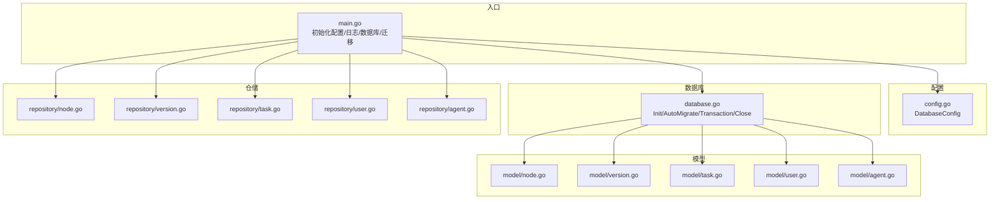
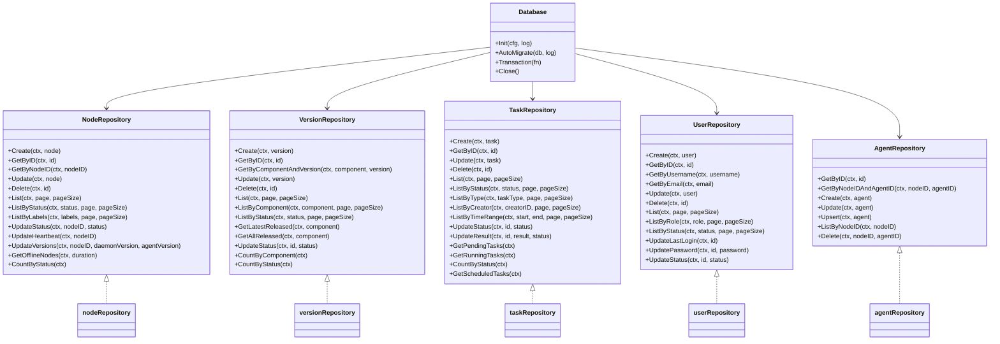
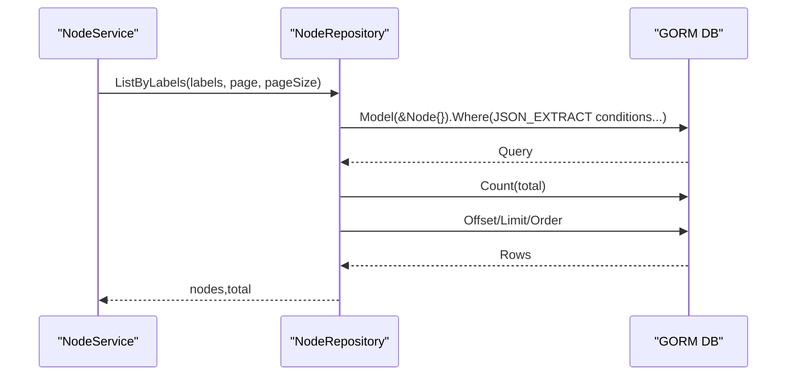
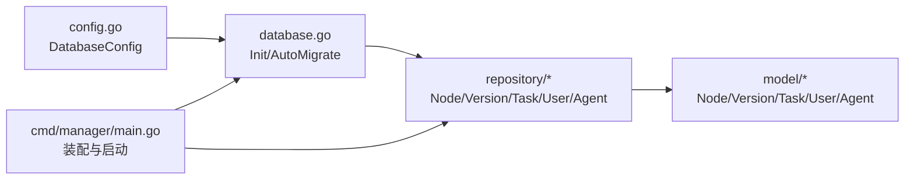

# 数据访问层

<cite>
**本文引用的文件**
- [manager/internal/repository/node.go](file://manager/internal/repository/node.go)
- [manager/internal/repository/version.go](file://manager/internal/repository/version.go)
- [manager/internal/repository/task.go](file://manager/internal/repository/task.go)
- [manager/internal/repository/user.go](file://manager/internal/repository/user.go)
- [manager/internal/repository/agent.go](file://manager/internal/repository/agent.go)
- [manager/internal/model/node.go](file://manager/internal/model/node.go)
- [manager/internal/model/version.go](file://manager/internal/model/version.go)
- [manager/internal/model/task.go](file://manager/internal/model/task.go)
- [manager/internal/model/user.go](file://manager/internal/model/user.go)
- [manager/internal/model/agent.go](file://manager/internal/model/agent.go)
- [manager/pkg/database/database.go](file://manager/pkg/database/database.go)
- [manager/internal/config/config.go](file://manager/internal/config/config.go)
- [manager/cmd/manager/main.go](file://manager/cmd/manager/main.go)
- [config/mysql/schema.sql](file://config/mysql/schema.sql)
- [manager/migrations/add_metrics_partitions.sql](file://manager/migrations/add_metrics_partitions.sql)
</cite>

## 目录
1. [简介](#简介)
2. [项目结构](#项目结构)
3. [核心组件](#核心组件)
4. [架构总览](#架构总览)
5. [详细组件分析](#详细组件分析)
6. [依赖分析](#依赖分析)
7. [性能考量](#性能考量)
8. [故障排查指南](#故障排查指南)
9. [结论](#结论)
10. [附录](#附录)

## 简介
本文件聚焦于 Manager 模块的数据访问层（Repository 层），系统性阐述其作为持久化抽象层的职责与实现方式。基于 GORM ORM 对 MySQL 数据库进行 CRUD 操作，涵盖 NodeRepo、VersionRepo、TaskRepo、UserRepo、AgentRepo 等数据访问对象的接口与实现；说明查询构造、关联加载、事务管理与性能优化策略；梳理数据模型与数据库表的映射关系，并给出分页、排序与复杂查询的实践方法。同时提供数据库连接池配置、慢查询日志分析与索引优化建议，帮助开发者提升数据访问性能。

## 项目结构
- 数据访问层位于 manager/internal/repository，面向各领域模型提供统一的仓储接口与实现。
- 数据模型位于 manager/internal/model，采用 GORM 标签完成字段映射与索引声明。
- 数据库初始化与迁移位于 manager/pkg/database，负责连接池、日志级别、自动迁移与事务封装。
- 配置位于 manager/internal/config，包含数据库连接参数、日志级别等。
- 入口程序 manager/cmd/manager/main.go 负责初始化数据库、执行迁移、构建仓储实例并启动服务。

图表来源
- [manager/cmd/manager/main.go](file://manager/cmd/manager/main.go#L58-L100)
- [manager/pkg/database/database.go](file://manager/pkg/database/database.go#L21-L80)
- [manager/internal/config/config.go](file://manager/internal/config/config.go#L30-L38)
- [manager/internal/model/node.go](file://manager/internal/model/node.go#L11-L38)
- [manager/internal/model/version.go](file://manager/internal/model/version.go#L9-L38)
- [manager/internal/model/task.go](file://manager/internal/model/task.go#L11-L40)
- [manager/internal/model/user.go](file://manager/internal/model/user.go#L9-L32)
- [manager/internal/model/agent.go](file://manager/internal/model/agent.go#L9-L47)
- [manager/internal/repository/node.go](file://manager/internal/repository/node.go#L11-L39)
- [manager/internal/repository/version.go](file://manager/internal/repository/version.go#L10-L38)
- [manager/internal/repository/task.go](file://manager/internal/repository/task.go#L11-L43)
- [manager/internal/repository/user.go](file://manager/internal/repository/user.go#L10-L36)
- [manager/internal/repository/agent.go](file://manager/internal/repository/agent.go#L11-L33)

章节来源
- [manager/cmd/manager/main.go](file://manager/cmd/manager/main.go#L58-L100)
- [manager/pkg/database/database.go](file://manager/pkg/database/database.go#L21-L80)
- [manager/internal/config/config.go](file://manager/internal/config/config.go#L30-L38)

## 核心组件
- 数据库连接与初始化：通过 Init 构建 GORM 实例，设置日志级别、禁用外键约束迁移、配置连接池参数并 Ping 校验。
- 自动迁移：AutoMigrate 对 User、Node、Task、Version、Agent、Metrics、AuditLog 等模型执行迁移，内置约束清理逻辑以兼容 GORM 已知问题。
- 事务封装：Transaction 提供统一的事务执行入口，便于跨多个仓储操作的一致性控制。
- 仓储接口与实现：NodeRepository、VersionRepository、TaskRepository、UserRepository、AgentRepository 定义 CRUD 与复杂查询能力，实现类通过 GORM 查询链式构造、分页与排序、聚合统计等。

章节来源
- [manager/pkg/database/database.go](file://manager/pkg/database/database.go#L21-L80)
- [manager/pkg/database/database.go](file://manager/pkg/database/database.go#L212-L281)
- [manager/internal/repository/node.go](file://manager/internal/repository/node.go#L11-L39)
- [manager/internal/repository/version.go](file://manager/internal/repository/version.go#L10-L38)
- [manager/internal/repository/task.go](file://manager/internal/repository/task.go#L11-L43)
- [manager/internal/repository/user.go](file://manager/internal/repository/user.go#L10-L36)
- [manager/internal/repository/agent.go](file://manager/internal/repository/agent.go#L11-L33)

## 架构总览
数据访问层采用“接口隔离 + GORM 实现”的分层设计，Repository 层向上提供领域服务所需的稳定接口，向下屏蔽 SQL 细节与数据库差异。模型层通过 GORM 标签完成表名、索引、默认值等映射；配置层提供连接池与日志级别；入口程序负责装配与生命周期管理。

图表来源
- [manager/internal/repository/node.go](file://manager/internal/repository/node.go#L11-L39)
- [manager/internal/repository/version.go](file://manager/internal/repository/version.go#L10-L38)
- [manager/internal/repository/task.go](file://manager/internal/repository/task.go#L11-L43)
- [manager/internal/repository/user.go](file://manager/internal/repository/user.go#L10-L36)
- [manager/internal/repository/agent.go](file://manager/internal/repository/agent.go#L11-L33)
- [manager/pkg/database/database.go](file://manager/pkg/database/database.go#L21-L80)
- [manager/pkg/database/database.go](file://manager/pkg/database/database.go#L212-L281)

## 详细组件分析

### 数据库连接与初始化
- 日志级别：根据配置选择 silent/error/warn/info，影响 SQL 语句与耗时输出。
- 连接池：设置最大空闲连接、最大打开连接、连接最大存活时间；Ping 校验连通性。
- 外键约束：迁移阶段禁用外键约束以提升性能，由应用层保证一致性。
- 全局 DB：Init 返回并设置全局 GORM 实例，供仓储层直接使用。

章节来源
- [manager/pkg/database/database.go](file://manager/pkg/database/database.go#L21-L80)
- [manager/internal/config/config.go](file://manager/internal/config/config.go#L30-L38)

### 自动迁移与约束修复
- AutoMigrate 对多个模型执行迁移，若遇到 GORM 尝试删除不存在的约束报错，会解析错误信息并尝试定位表名与约束名，分别判断是外键还是索引，再执行删除并重试。
- 若最终仍失败，返回带重试次数的错误信息，便于排障。

章节来源
- [manager/pkg/database/database.go](file://manager/pkg/database/database.go#L212-L281)

### 事务管理
- Transaction 封装 GORM 事务，支持在单个回调中执行多个仓储操作，确保原子性与一致性。

章节来源
- [manager/pkg/database/database.go](file://manager/pkg/database/database.go#L277-L281)

### Node 仓储（NodeRepository）
- 接口能力：创建、按 ID/NodeID 查询、更新、软删除、分页列表、按状态/标签过滤、更新状态/心跳/版本、离线节点查询、按状态统计。
- 查询构造：使用 Where 条件、Count 总数、Offset/Limit 分页、Order 排序；标签查询通过 JSON_EXTRACT 构造条件。
- 关联加载：未见显式关联预加载，复杂查询可结合 Model().Joins/Preload 在上层服务中扩展。
- 事务：复杂写入可在上层服务中使用 Transaction 包裹。
- 性能优化：标签过滤使用 JSON_EXTRACT，建议在 labels 字段上建立合适索引（参见“性能考量”）。

图表来源
- [manager/internal/repository/node.go](file://manager/internal/repository/node.go#L130-L156)

章节来源
- [manager/internal/repository/node.go](file://manager/internal/repository/node.go#L11-L39)
- [manager/internal/repository/node.go](file://manager/internal/repository/node.go#L130-L156)

### Version 仓储（VersionRepository）
- 接口能力：创建、按 ID/组件+版本查询、更新、软删除、分页列表、按组件/状态过滤、获取最新发布/全部已发布、更新状态、按组件/状态统计。
- 查询构造：Where 组合条件、Count 总数、Offset/Limit/Order、Group/Select 聚合统计。
- 性能优化：按组件/状态过滤建议在 component/status 建立索引；获取最新发布使用 Order(id DESC) 取首条。

章节来源
- [manager/internal/repository/version.go](file://manager/internal/repository/version.go#L10-L38)
- [manager/internal/repository/version.go](file://manager/internal/repository/version.go#L154-L182)

### Task 仓储（TaskRepository）
- 接口能力：创建、按 ID 查询、更新、软删除、分页列表、按状态/类型/创建者/时间范围过滤、更新状态（含 started_at/finished_at）、更新结果、待执行/运行中任务查询、按状态统计、定时任务查询。
- 查询构造：Where 条件、Between 时间范围、Count 总数、Offset/Limit/Order、Group/Select 聚合统计。
- 性能优化：按状态/类型/创建者/时间范围过滤建议建立复合索引；定时任务查询使用 schedule 非空条件。

章节来源
- [manager/internal/repository/task.go](file://manager/internal/repository/task.go#L11-L43)
- [manager/internal/repository/task.go](file://manager/internal/repository/task.go#L170-L192)

### User 仓储（UserRepository）
- 接口能力：创建、按 ID/用户名/邮箱查询、更新、软删除、分页列表、按角色/状态过滤、更新最后登录时间/密码/状态。
- 查询构造：Where 条件、Count 总数、Offset/Limit/Order、Update 单字段或 Updates 多字段。
- 性能优化：username/email 唯一索引，按角色/状态过滤建议建立索引。

章节来源
- [manager/internal/repository/user.go](file://manager/internal/repository/user.go#L10-L36)

### Agent 仓储（AgentRepository）
- 接口能力：按 ID/节点+AgentID 查询、创建、更新、Upsert（存在则更新，不存在则创建）、按节点列出、删除。
- 查询构造：Where 条件、First/Find/Delete。
- 性能优化：节点+AgentID 复合索引，Upsert 通过先查后更新减少重复写入。

章节来源
- [manager/internal/repository/agent.go](file://manager/internal/repository/agent.go#L11-L33)
- [manager/internal/repository/agent.go](file://manager/internal/repository/agent.go#L93-L110)

### 数据模型与表映射
- Node：表名 nodes，字段包含 NodeID、Hostname、IP、OS、Arch、Labels（JSON）、DaemonVersion、AgentVersion、Status、LastSeenAt、RegisterAt；DeletedAt 支持软删除。
- Version：表名 versions，字段包含 Component、Version、FileName、FileSize、DownloadURL、Hash、Signature、Description、Status、ReleaseType、UploadedBy；UploadedBy 建有索引。
- Task：表名 tasks，字段包含 Name、Description、Type、TargetNodes（JSON）、Script、Params（JSON）、Status、StartedAt、FinishedAt、Result（JSON）、CreatedBy；CreatedBy 建有索引。
- User：表名 users，字段包含 Username、Password、Email、Phone、RealName、Role、Status、LastLoginAt、LastLoginIP；Username/Email 唯一索引。
- Agent：表名 agents，字段包含 NodeID、AgentID、Type、Version、Status、Config、PID、LastHeartbeat、LastSyncTime；NodeID+AgentID 复合索引，Status 索引。

章节来源
- [manager/internal/model/node.go](file://manager/internal/model/node.go#L11-L38)
- [manager/internal/model/version.go](file://manager/internal/model/version.go#L9-L38)
- [manager/internal/model/task.go](file://manager/internal/model/task.go#L11-L40)
- [manager/internal/model/user.go](file://manager/internal/model/user.go#L9-L32)
- [manager/internal/model/agent.go](file://manager/internal/model/agent.go#L9-L47)

### 分页、排序与复杂查询
- 分页：先 Count 再 Offset/Limit，Order 默认按主键倒序，保证稳定排序。
- 排序：支持按 ID 倒序；复杂排序可在上层服务中扩展 Order 条件。
- 复杂查询：
  - 标签过滤：NodeRepository 使用 JSON_EXTRACT 构造条件，建议在 labels 上建立合适索引。
  - 时间范围：TaskRepository 使用 Between 条件。
  - 聚合统计：CountByStatus/CountByComponent/CountByRole 使用 Group/Select 聚合。

章节来源
- [manager/internal/repository/node.go](file://manager/internal/repository/node.go#L130-L156)
- [manager/internal/repository/task.go](file://manager/internal/repository/task.go#L170-L192)
- [manager/internal/repository/version.go](file://manager/internal/repository/version.go#L193-L218)
- [manager/internal/repository/user.go](file://manager/internal/repository/user.go#L137-L158)

## 依赖分析
- 入口程序 main.go 负责加载配置、初始化日志、数据库、迁移、构建仓储与服务、注册路由与 gRPC 服务。
- 仓储依赖 GORM DB 实例，模型通过 GORM 标签映射到表结构。
- 配置 DatabaseConfig 提供 DSN、连接池参数与日志级别。

图表来源
- [manager/internal/config/config.go](file://manager/internal/config/config.go#L30-L38)
- [manager/pkg/database/database.go](file://manager/pkg/database/database.go#L21-L80)
- [manager/internal/repository/node.go](file://manager/internal/repository/node.go#L11-L39)
- [manager/internal/repository/version.go](file://manager/internal/repository/version.go#L10-L38)
- [manager/internal/repository/task.go](file://manager/internal/repository/task.go#L11-L43)
- [manager/internal/repository/user.go](file://manager/internal/repository/user.go#L10-L36)
- [manager/internal/repository/agent.go](file://manager/internal/repository/agent.go#L11-L33)
- [manager/cmd/manager/main.go](file://manager/cmd/manager/main.go#L58-L100)

章节来源
- [manager/cmd/manager/main.go](file://manager/cmd/manager/main.go#L58-L100)
- [manager/pkg/database/database.go](file://manager/pkg/database/database.go#L21-L80)
- [manager/internal/config/config.go](file://manager/internal/config/config.go#L30-L38)

## 性能考量
- 连接池配置
  - MaxIdleConns：空闲连接数上限，建议根据并发请求与数据库负载调优。
  - MaxOpenConns：最大打开连接数，避免连接过多导致数据库压力。
  - ConnMaxLifetime：连接最大存活时间，定期回收连接，降低长连接带来的资源占用。
  - 日志级别：生产环境建议 warn 或 error，避免过多 SQL 输出影响性能。
- 慢查询日志分析
  - MySQL 慢查询日志开启后，结合 EXPLAIN 分析关键查询的执行计划，关注是否存在全表扫描、索引未命中等问题。
  - 对高频查询（如按状态/类型/创建者/时间范围）优先使用复合索引。
- 索引优化建议
  - Node：labels 字段 JSON 查询建议评估是否需要虚拟列或专用索引；status 建立索引。
  - Version：component/status 建立复合索引；uploaded_by 建有索引。
  - Task：status/type/created_by、created_at/BETWEEN 建立复合索引；schedule 非空查询可考虑索引。
  - User：username/email 唯一索引；role/status 建立复合索引。
  - Agent：node_id+agent_id 复合索引；status 索引。
- 分区表与历史数据清理
  - metrics 表已提供分区迁移脚本，按日期分区（RANGE），建议配合定时任务提前创建新分区，减少维护成本。
  - 结合配置中的 Metrics 清理调度，定期清理过期分区或数据，降低查询范围与存储压力。
- 查询与事务
  - 复杂写入建议使用 Transaction 包裹，确保一致性。
  - 分页查询先 Count 再 Offset/Limit，避免大偏移量导致的性能问题；必要时采用基于游标的分页策略。
  - 聚合统计使用 Group/Select，避免在应用层做二次聚合。

章节来源
- [manager/internal/config/config.go](file://manager/internal/config/config.go#L136-L151)
- [manager/migrations/add_metrics_partitions.sql](file://manager/migrations/add_metrics_partitions.sql#L1-L101)
- [manager/pkg/database/database.go](file://manager/pkg/database/database.go#L21-L80)

## 故障排查指南
- 迁移失败
  - 若出现 GORM 尝试删除不存在的约束错误，系统内置修复流程会尝试定位并删除外键或索引后重试；若仍失败，检查错误信息中的表名与约束名，确认是否应手动清理。
- 连接失败
  - Init 中包含 Ping 校验，若失败检查 DSN、网络连通性与数据库状态。
- 事务异常
  - 使用 Transaction 包裹多步写入，捕获错误并回滚，避免部分提交导致数据不一致。
- 查询性能问题
  - 使用 EXPLAIN 分析执行计划，确认索引使用情况；对高频查询补充复合索引；避免在大表上进行全表扫描。

章节来源
- [manager/pkg/database/database.go](file://manager/pkg/database/database.go#L212-L281)
- [manager/pkg/database/database.go](file://manager/pkg/database/database.go#L21-L80)

## 结论
Manager 模块的数据访问层以 GORM 为核心，通过清晰的仓储接口与实现，提供了稳定的 CRUD 与复杂查询能力。结合合理的连接池配置、索引优化与分区策略，能够有效支撑高并发场景下的数据访问性能。建议在实际部署中持续监控慢查询与资源使用情况，按业务增长动态调整索引与分区策略。

## 附录
- 数据库初始化与迁移入口：入口程序 main.go 负责初始化数据库与执行迁移。
- 数据库模式：schema.sql 提供数据库创建与使用示例。
- 分区迁移脚本：add_metrics_partitions.sql 提供分区表创建、数据迁移、验证与回滚方案。

章节来源
- [manager/cmd/manager/main.go](file://manager/cmd/manager/main.go#L58-L100)
- [config/mysql/schema.sql](file://config/mysql/schema.sql#L1-L5)
- [manager/migrations/add_metrics_partitions.sql](file://manager/migrations/add_metrics_partitions.sql#L1-L101)