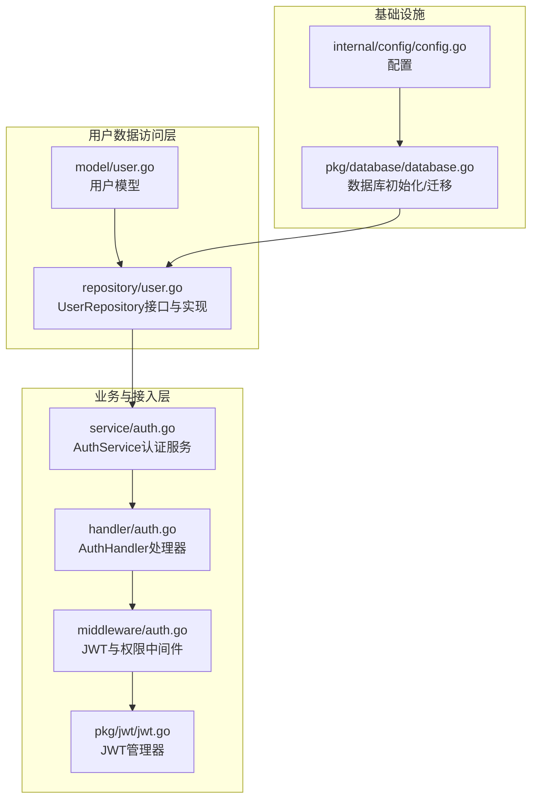
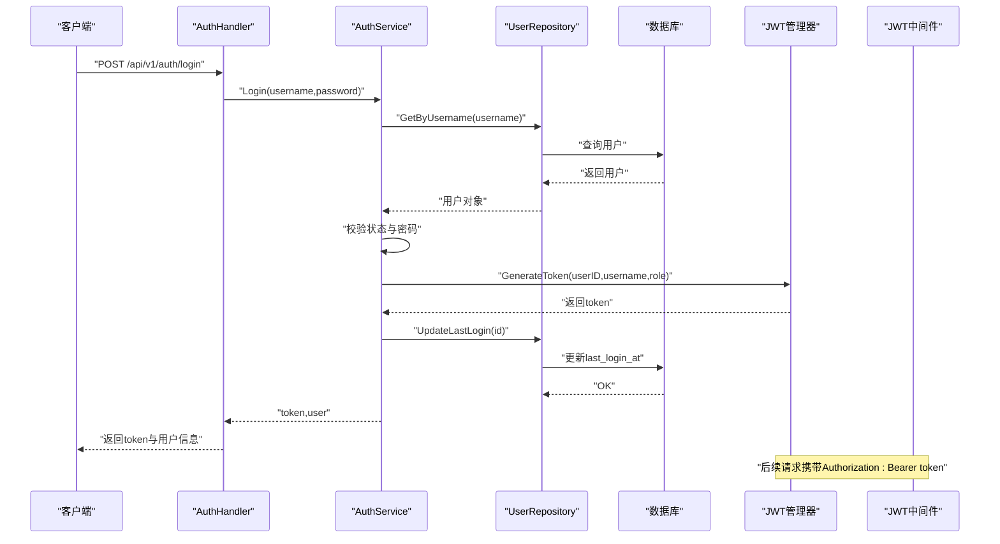
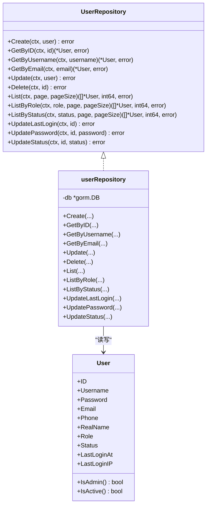
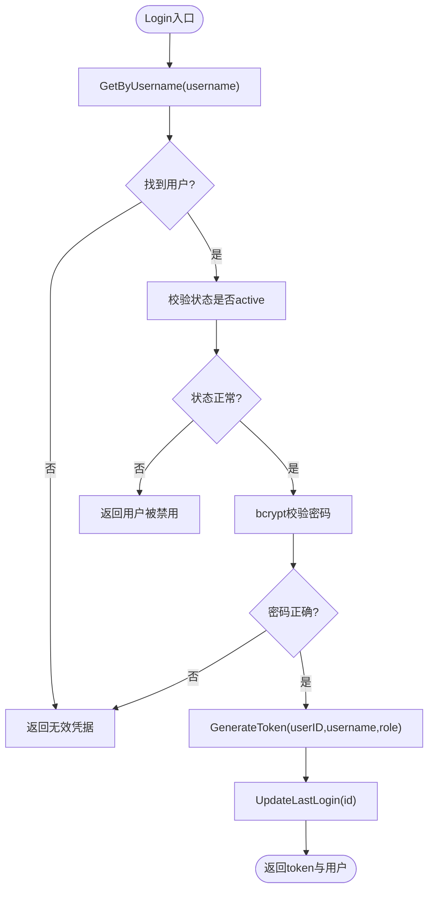
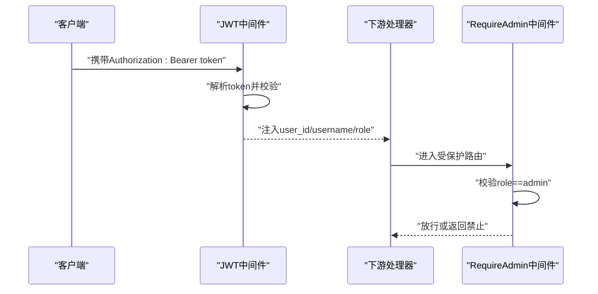
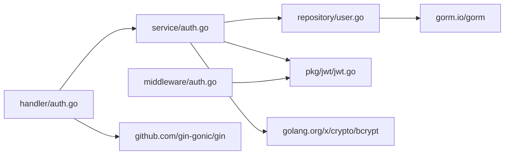

# 用户数据访问

<cite>
**本文引用的文件**
- [manager/internal/repository/user.go](file://manager/internal/repository/user.go)
- [manager/internal/model/user.go](file://manager/internal/model/user.go)
- [manager/internal/service/auth.go](file://manager/internal/service/auth.go)
- [manager/internal/handler/auth.go](file://manager/internal/handler/auth.go)
- [manager/internal/middleware/auth.go](file://manager/internal/middleware/auth.go)
- [manager/pkg/jwt/jwt.go](file://manager/pkg/jwt/jwt.go)
- [manager/pkg/database/database.go](file://manager/pkg/database/database.go)
- [manager/internal/config/config.go](file://manager/internal/config/config.go)
</cite>

## 目录
1. [简介](#简介)
2. [项目结构](#项目结构)
3. [核心组件](#核心组件)
4. [架构总览](#架构总览)
5. [详细组件分析](#详细组件分析)
6. [依赖关系分析](#依赖关系分析)
7. [性能考量](#性能考量)
8. [故障排查指南](#故障排查指南)
9. [结论](#结论)

## 简介
本文件聚焦于Manager模块的用户数据访问层，系统性阐述UserRepository接口的职责与实现，覆盖用户创建、认证、权限管理与状态跟踪。重点解析GetByUsername、GetByEmail、UpdatePassword等核心方法，并结合RBAC权限控制、用户状态管理与登录信息处理，提供安全与性能优化建议。文档同时给出关键调用序列图与类图，帮助读者快速把握整体架构与数据流。

## 项目结构
围绕用户数据访问层的关键目录与文件：
- 数据模型：manager/internal/model/user.go
- 数据访问接口与实现：manager/internal/repository/user.go
- 认证服务：manager/internal/service/auth.go
- 认证处理器：manager/internal/handler/auth.go
- JWT与权限中间件：manager/pkg/jwt/jwt.go、manager/internal/middleware/auth.go
- 数据库初始化与迁移：manager/pkg/database/database.go、manager/internal/config/config.go

图表来源
- [manager/internal/model/user.go](file://manager/internal/model/user.go#L1-L43)
- [manager/internal/repository/user.go](file://manager/internal/repository/user.go#L1-L186)
- [manager/internal/service/auth.go](file://manager/internal/service/auth.go#L1-L287)
- [manager/internal/handler/auth.go](file://manager/internal/handler/auth.go#L1-L225)
- [manager/internal/middleware/auth.go](file://manager/internal/middleware/auth.go#L1-L98)
- [manager/pkg/jwt/jwt.go](file://manager/pkg/jwt/jwt.go#L1-L140)
- [manager/internal/config/config.go](file://manager/internal/config/config.go#L1-L262)
- [manager/pkg/database/database.go](file://manager/pkg/database/database.go#L1-L281)

章节来源
- [manager/internal/repository/user.go](file://manager/internal/repository/user.go#L1-L186)
- [manager/internal/model/user.go](file://manager/internal/model/user.go#L1-L43)
- [manager/internal/service/auth.go](file://manager/internal/service/auth.go#L1-L287)
- [manager/internal/handler/auth.go](file://manager/internal/handler/auth.go#L1-L225)
- [manager/internal/middleware/auth.go](file://manager/internal/middleware/auth.go#L1-L98)
- [manager/pkg/jwt/jwt.go](file://manager/pkg/jwt/jwt.go#L1-L140)
- [manager/pkg/database/database.go](file://manager/pkg/database/database.go#L1-L281)
- [manager/internal/config/config.go](file://manager/internal/config/config.go#L1-L262)

## 核心组件
- UserRepository接口：定义用户CRUD、分页、按角色/状态筛选、登录时间与密码/状态更新等能力，统一数据访问契约。
- userRepository实现：基于GORM封装具体SQL逻辑，提供幂等与可扩展的查询与更新。
- User模型：承载用户字段（用户名、邮箱、角色、状态、登录信息等），并提供角色与状态判断辅助方法。
- AuthService：编排用户注册、登录、密码变更/重置、启停用户、列表查询与Token校验等业务流程。
- AuthHandler：HTTP入口，绑定请求体、参数校验、调用AuthService并输出标准响应。
- JWT与中间件：JWT管理器负责签发/解析/刷新；中间件负责鉴权与权限拦截。
- 数据库初始化与迁移：集中配置连接池、日志级别与自动迁移策略。

章节来源
- [manager/internal/repository/user.go](file://manager/internal/repository/user.go#L1-L36)
- [manager/internal/model/user.go](file://manager/internal/model/user.go#L1-L43)
- [manager/internal/service/auth.go](file://manager/internal/service/auth.go#L1-L114)
- [manager/internal/handler/auth.go](file://manager/internal/handler/auth.go#L1-L96)
- [manager/pkg/jwt/jwt.go](file://manager/pkg/jwt/jwt.go#L1-L88)
- [manager/internal/middleware/auth.go](file://manager/internal/middleware/auth.go#L1-L70)
- [manager/pkg/database/database.go](file://manager/pkg/database/database.go#L1-L120)

## 架构总览
下图展示从HTTP请求到数据库的完整调用链路，突出用户认证与权限控制的关键节点。

图表来源
- [manager/internal/handler/auth.go](file://manager/internal/handler/auth.go#L71-L96)
- [manager/internal/service/auth.go](file://manager/internal/service/auth.go#L116-L153)
- [manager/internal/repository/user.go](file://manager/internal/repository/user.go#L63-L81)
- [manager/internal/repository/user.go](file://manager/internal/repository/user.go#L160-L167)
- [manager/pkg/jwt/jwt.go](file://manager/pkg/jwt/jwt.go#L43-L61)
- [manager/internal/middleware/auth.go](file://manager/internal/middleware/auth.go#L12-L49)

## 详细组件分析

### UserRepository接口与实现
- 职责边界
  - 用户生命周期管理：Create、GetByID、Update、Delete（软删）、List与分页。
  - 角色与状态筛选：ListByRole、ListByStatus。
  - 登录与安全：UpdateLastLogin、UpdatePassword、UpdateStatus。
- 实现要点
  - 使用GORM上下文传递，确保超时与追踪可控。
  - 分页采用offset+limit+倒序主键排序，兼顾一致性与性能。
  - 更新操作通过Model.Where.Update组合，避免全量写入。
  - GetByUsername/GetByEmail基于唯一索引查询，异常处理返回nil或错误。

图表来源
- [manager/internal/repository/user.go](file://manager/internal/repository/user.go#L1-L186)
- [manager/internal/model/user.go](file://manager/internal/model/user.go#L1-L43)

章节来源
- [manager/internal/repository/user.go](file://manager/internal/repository/user.go#L1-L186)
- [manager/internal/model/user.go](file://manager/internal/model/user.go#L1-L43)

### 用户模型与状态管理
- 字段与约束
  - 唯一索引：username、email。
  - 角色：admin、user（默认user）。
  - 状态：active、disabled（默认active）。
  - 登录信息：last_login_at、last_login_ip。
- 辅助方法
  - IsAdmin：基于Role判断。
  - IsActive：基于Status判断。
- 安全与合规
  - 密码以加密形式存储，不回显。
  - 状态字段用于强制禁用用户，防止登录。

章节来源
- [manager/internal/model/user.go](file://manager/internal/model/user.go#L1-L43)

### 认证服务与核心方法
- Register
  - 去重校验：用户名与邮箱唯一性。
  - 密码加密：bcrypt哈希后入库。
  - 默认角色与状态：user、active。
- Login
  - 查询用户并校验状态。
  - 密码校验：bcrypt比较。
  - 签发JWT并更新最后登录时间。
- ChangePassword/ResetPassword
  - ChangePassword：校验旧密码，加密新密码后更新。
  - ResetPassword：管理员重置，直接加密并更新。
- EnableUser/DisableUser
  - 通过UpdateStatus切换状态。
- ListUsers/GetUserByID
  - 分页与详情查询，统一错误处理与日志。

图表来源
- [manager/internal/service/auth.go](file://manager/internal/service/auth.go#L116-L153)
- [manager/internal/repository/user.go](file://manager/internal/repository/user.go#L63-L81)
- [manager/internal/repository/user.go](file://manager/internal/repository/user.go#L160-L167)
- [manager/pkg/jwt/jwt.go](file://manager/pkg/jwt/jwt.go#L43-L61)

章节来源
- [manager/internal/service/auth.go](file://manager/internal/service/auth.go#L66-L114)
- [manager/internal/service/auth.go](file://manager/internal/service/auth.go#L116-L204)
- [manager/internal/service/auth.go](file://manager/internal/service/auth.go#L206-L267)
- [manager/internal/service/auth.go](file://manager/internal/service/auth.go#L269-L287)

### RBAC权限控制与中间件
- JWT中间件
  - 从Authorization头解析Bearer Token。
  - 解析失败返回未授权/无效Token。
  - 将用户ID、用户名、角色注入上下文。
- 管理员权限
  - RequireAdmin中间件校验角色是否为admin。
  - 非管理员直接拒绝。
- JWT管理器
  - Claims包含用户ID、用户名、角色及标准声明。
  - 提供生成、解析、刷新与有效期校验。

图表来源
- [manager/internal/middleware/auth.go](file://manager/internal/middleware/auth.go#L12-L49)
- [manager/internal/middleware/auth.go](file://manager/internal/middleware/auth.go#L52-L70)
- [manager/pkg/jwt/jwt.go](file://manager/pkg/jwt/jwt.go#L19-L26)
- [manager/pkg/jwt/jwt.go](file://manager/pkg/jwt/jwt.go#L63-L88)

章节来源
- [manager/internal/middleware/auth.go](file://manager/internal/middleware/auth.go#L1-L98)
- [manager/pkg/jwt/jwt.go](file://manager/pkg/jwt/jwt.go#L1-L140)

### HTTP处理器与错误处理
- AuthHandler
  - Register/Login/ChangePassword/ListUsers/DisableUser/EnableUser等。
  - 参数绑定与校验，调用AuthService并输出统一响应。
  - 对敏感字段（如密码）进行隐藏。
- 错误处理
  - APIError包装与透传，便于统一响应。
  - 内部错误转为服务器错误响应。

章节来源
- [manager/internal/handler/auth.go](file://manager/internal/handler/auth.go#L1-L225)

### 数据库初始化与迁移
- 连接池与日志
  - 可配置最大空闲/活动连接、连接生命周期与日志级别。
  - Ping测试连接可用性。
- 自动迁移
  - AutoMigrate支持重试与约束清理，兼容不同环境差异。
  - 事务封装与关闭接口。

章节来源
- [manager/pkg/database/database.go](file://manager/pkg/database/database.go#L21-L120)
- [manager/pkg/database/database.go](file://manager/pkg/database/database.go#L212-L281)
- [manager/internal/config/config.go](file://manager/internal/config/config.go#L1-L262)

## 依赖关系分析
- 组件耦合
  - Handler依赖AuthService；AuthService依赖UserRepository与JWT管理器。
  - 中间件依赖JWT管理器，贯穿所有受保护路由。
  - 数据库初始化由配置驱动，迁移依赖模型定义。
- 外部依赖
  - GORM用于ORM与迁移。
  - bcrypt用于密码哈希。
  - Gin用于HTTP路由与中间件。
  - JWT库用于Token生成与解析。

图表来源
- [manager/internal/handler/auth.go](file://manager/internal/handler/auth.go#L1-L225)
- [manager/internal/service/auth.go](file://manager/internal/service/auth.go#L1-L287)
- [manager/internal/repository/user.go](file://manager/internal/repository/user.go#L1-L186)
- [manager/pkg/jwt/jwt.go](file://manager/pkg/jwt/jwt.go#L1-L140)
- [manager/internal/middleware/auth.go](file://manager/internal/middleware/auth.go#L1-L98)

## 性能考量
- 查询优化
  - 唯一索引字段（username、email）上使用精确匹配查询，避免全表扫描。
  - 分页查询使用offset+limit+主键倒序，减少随机IO。
- 写入优化
  - UpdateLastLogin、UpdatePassword、UpdateStatus使用Model.Where.Update，避免全量写入。
  - 批量操作可通过批量插入/更新优化（如后续扩展）。
- 连接池与日志
  - 合理设置最大空闲/活动连接与生命周期，降低连接抖动。
  - 根据环境调整日志级别，避免高并发下的I/O瓶颈。
- 缓存与会话
  - 当前JWT为无状态Token，适合水平扩展；若需提升鉴权性能，可在边缘层缓存近期Token元信息（需配合黑名单策略）。

[本节为通用性能建议，无需列出章节来源]

## 故障排查指南
- 登录失败
  - 检查用户名是否存在与状态是否为active。
  - 确认密码哈希一致与bcrypt比较逻辑。
  - 查看UpdateLastLogin是否成功执行。
- 密码变更失败
  - 核对旧密码校验是否通过。
  - 确认bcrypt哈希过程无异常。
- 权限拒绝
  - 检查Authorization头格式与Token有效性。
  - 确认中间件是否正确注入role并满足admin要求。
- 数据库问题
  - 检查DSN、连接池配置与日志级别。
  - AutoMigrate失败时关注约束清理与重试逻辑。

章节来源
- [manager/internal/service/auth.go](file://manager/internal/service/auth.go#L116-L153)
- [manager/internal/service/auth.go](file://manager/internal/service/auth.go#L171-L204)
- [manager/internal/middleware/auth.go](file://manager/internal/middleware/auth.go#L12-L49)
- [manager/pkg/database/database.go](file://manager/pkg/database/database.go#L21-L120)

## 结论
用户数据访问层以清晰的接口与实现分离为核心，结合AuthService编排业务流程、JWT中间件实现RBAC与权限控制、User模型承载状态与登录信息，形成从HTTP入口到数据库的完整闭环。通过唯一索引、分页查询、最小化更新与连接池配置，系统在安全性与性能之间取得平衡。建议在生产环境中进一步完善审计日志、Token黑名单与缓存策略，持续优化用户体验与系统稳定性。