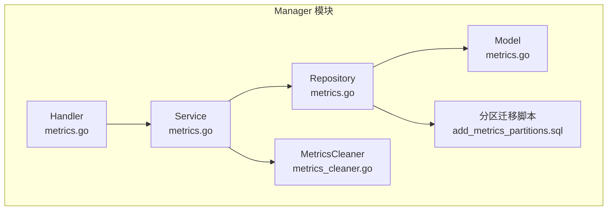
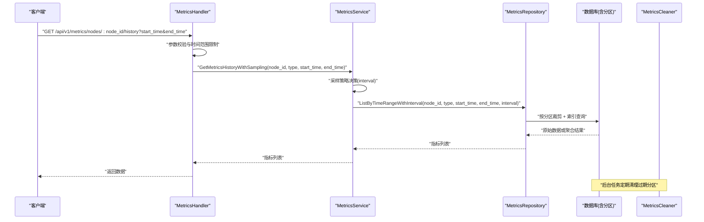
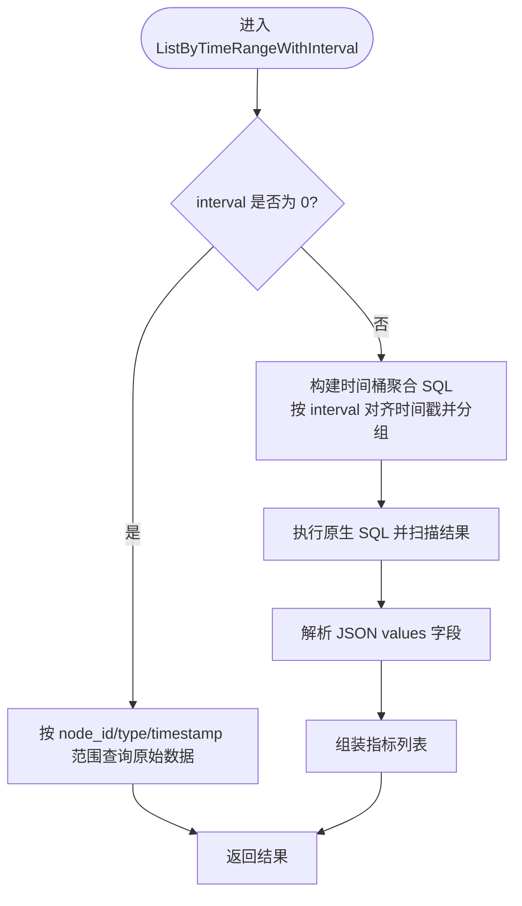
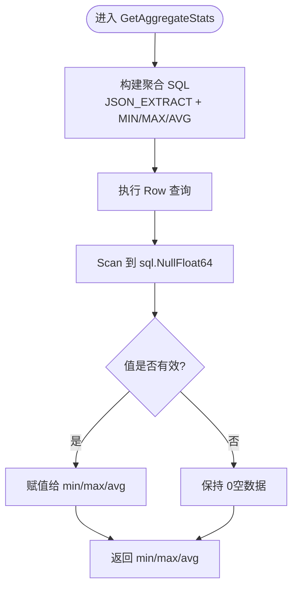
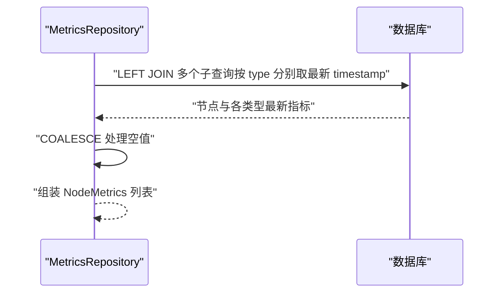
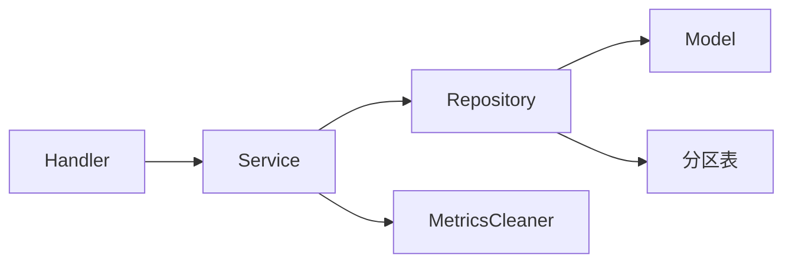

# 监控指标数据访问

<cite>
**本文引用的文件**
- [manager/internal/repository/metrics.go](file://manager/internal/repository/metrics.go)
- [manager/internal/model/metrics.go](file://manager/internal/model/metrics.go)
- [manager/internal/service/metrics.go](file://manager/internal/service/metrics.go)
- [manager/internal/service/metrics_cleaner.go](file://manager/internal/service/metrics_cleaner.go)
- [manager/internal/handler/metrics.go](file://manager/internal/handler/metrics.go)
- [manager/migrations/add_metrics_partitions.sql](file://manager/migrations/add_metrics_partitions.sql)
- [manager/migrations/README_PARTITIONS.md](file://manager/migrations/README_PARTITIONS.md)
- [manager/internal/repository/metrics_repository_test.go](file://manager/internal/repository/metrics_repository_test.go)
- [manager/internal/service/metrics_test.go](file://manager/internal/service/metrics_test.go)
</cite>

## 目录
1. [简介](#简介)
2. [项目结构](#项目结构)
3. [核心组件](#核心组件)
4. [架构总览](#架构总览)
5. [详细组件分析](#详细组件分析)
6. [依赖关系分析](#依赖关系分析)
7. [性能考量](#性能考量)
8. [故障排查指南](#故障排查指南)
9. [结论](#结论)
10. [附录](#附录)

## 简介
本文件聚焦于 Manager 模块的监控指标数据访问层，围绕 MetricsRepository 接口及其在数据存储、查询与聚合分析中的职责展开，重点解释以下方法的实现与优化策略：
- ListByTimeRangeWithInterval：基于时间范围的指标查询，并支持按采样间隔进行聚合
- GetAggregateStats：按时间范围计算最小值、最大值与平均值
- GetAllNodesLatestMetrics：获取所有节点的最新指标数据，用于集群概览

同时，文档涵盖时间序列数据存储优化（分区表）、聚合查询性能调优（索引与分区裁剪）、以及数据清理策略（分区级清理与保留策略）。

## 项目结构
Manager 模块采用经典的分层架构：
- Handler 层：对外暴露 HTTP 接口，负责参数校验与响应封装
- Service 层：业务编排与策略控制（如采样策略、统计摘要）
- Repository 层：数据访问接口与实现，封装 SQL 与 GORM 操作
- Model 层：数据模型与 JSON 字段映射
- Migration：数据库迁移与分区策略

图表来源
- [manager/internal/handler/metrics.go](file://manager/internal/handler/metrics.go#L1-L210)
- [manager/internal/service/metrics.go](file://manager/internal/service/metrics.go#L1-L371)
- [manager/internal/repository/metrics.go](file://manager/internal/repository/metrics.go#L1-L503)
- [manager/internal/model/metrics.go](file://manager/internal/model/metrics.go#L1-L65)
- [manager/internal/service/metrics_cleaner.go](file://manager/internal/service/metrics_cleaner.go#L1-L161)
- [manager/migrations/add_metrics_partitions.sql](file://manager/migrations/add_metrics_partitions.sql#L1-L101)

章节来源
- [manager/internal/handler/metrics.go](file://manager/internal/handler/metrics.go#L1-L210)
- [manager/internal/service/metrics.go](file://manager/internal/service/metrics.go#L1-L371)
- [manager/internal/repository/metrics.go](file://manager/internal/repository/metrics.go#L1-L503)
- [manager/internal/model/metrics.go](file://manager/internal/model/metrics.go#L1-L65)
- [manager/internal/service/metrics_cleaner.go](file://manager/internal/service/metrics_cleaner.go#L1-L161)
- [manager/migrations/add_metrics_partitions.sql](file://manager/migrations/add_metrics_partitions.sql#L1-L101)

## 核心组件
- MetricsRepository 接口：定义监控指标的增删改查与聚合能力，统一数据访问契约
- metricsRepository 实现：基于 GORM 的具体实现，包含原始查询、聚合查询、时间范围查询、最新指标查询、删除旧数据等
- MetricsService：对 Repository 的组合与编排，提供采样策略、统计摘要、集群概览等业务能力
- MetricsCleaner：基于分区的清理策略，支持过期分区删除
- Handler：HTTP 层，负责参数解析、调用 Service 并返回响应

章节来源
- [manager/internal/repository/metrics.go](file://manager/internal/repository/metrics.go#L28-L58)
- [manager/internal/service/metrics.go](file://manager/internal/service/metrics.go#L14-L40)
- [manager/internal/service/metrics_cleaner.go](file://manager/internal/service/metrics_cleaner.go#L13-L27)
- [manager/internal/handler/metrics.go](file://manager/internal/handler/metrics.go#L1-L210)

## 架构总览
下图展示从 Handler 到 Service、Repository 的调用链路，以及 Repository 与数据库（含分区）的交互。

图表来源
- [manager/internal/handler/metrics.go](file://manager/internal/handler/metrics.go#L56-L129)
- [manager/internal/service/metrics.go](file://manager/internal/service/metrics.go#L169-L225)
- [manager/internal/repository/metrics.go](file://manager/internal/repository/metrics.go#L258-L333)
- [manager/migrations/add_metrics_partitions.sql](file://manager/migrations/add_metrics_partitions.sql#L1-L101)
- [manager/internal/service/metrics_cleaner.go](file://manager/internal/service/metrics_cleaner.go#L29-L112)

## 详细组件分析

### MetricsRepository 接口与职责
- 存储与批量写入：Create、BatchCreate
- 分页与列表：List、ListByNodeID、ListByNodeIDAndType、ListByTimeRange
- 最新指标：GetLatestByNodeID、GetLatestByNodeIDAndType
- 聚合与统计：GetAverageByNodeIDAndType、GetAggregateStats
- 采样查询：ListByTimeRangeWithInterval
- 集群概览：GetAllNodesLatestMetrics
- 数据清理：DeleteOlderThan（按时间阈值删除）

章节来源
- [manager/internal/repository/metrics.go](file://manager/internal/repository/metrics.go#L28-L58)

### ListByTimeRangeWithInterval：时间范围与采样聚合
- 当 interval 为 0：按时间范围直接查询，保证原始数据点数量
- 当 interval > 0：使用时间桶聚合，将时间戳按 interval 对齐，对 values 字段中的 usage_percent 进行 AVG 聚合，返回聚合后的指标点
- SQL 优化要点：
  - 使用 FROM_UNIXTIME((UNIX_TIMESTAMP(timestamp) DIV intervalSeconds) * intervalSeconds) 实现时间桶对齐
  - GROUP BY node_id、type、UNIX_TIMESTAMP(...) DIV intervalSeconds，确保按时间桶分组
  - ORDER BY timestamp ASC，保证前端绘制时序图的顺序性
- 索引与分区：
  - 预期索引 idx_node_id_type_timestamp(node_id, type, timestamp)，加速时间范围过滤
  - 分区表按 TO_DAYS(timestamp) 切分，查询时可利用分区裁剪，减少扫描范围

图表来源
- [manager/internal/repository/metrics.go](file://manager/internal/repository/metrics.go#L258-L333)

章节来源
- [manager/internal/repository/metrics.go](file://manager/internal/repository/metrics.go#L258-L333)
- [manager/migrations/add_metrics_partitions.sql](file://manager/migrations/add_metrics_partitions.sql#L1-L101)
- [manager/migrations/README_PARTITIONS.md](file://manager/migrations/README_PARTITIONS.md#L1-L339)

### GetAggregateStats：最小/最大/平均值聚合
- 通过 JSON_EXTRACT(values, '$.usage_percent') 提取数值字段，计算 MIN/MAX/AVG
- 使用 sql.NullFloat64 处理空数据返回零值，避免错误
- 适合在时间范围限定下快速生成统计摘要

图表来源
- [manager/internal/repository/metrics.go](file://manager/internal/repository/metrics.go#L335-L374)

章节来源
- [manager/internal/repository/metrics.go](file://manager/internal/repository/metrics.go#L335-L374)

### GetAllNodesLatestMetrics：集群概览
- 使用子查询获取每个节点最新 CPU/内存/磁盘/网络指标的时间戳，再 LEFT JOIN nodes 表，避免全表扫描
- 通过 COALESCE(JSON_EXTRACT(...)) 将缺失值转为 0，保证前端渲染稳定
- 返回 NodeMetrics 结构体数组，包含节点基本信息与关键指标

图表来源
- [manager/internal/repository/metrics.go](file://manager/internal/repository/metrics.go#L376-L502)

章节来源
- [manager/internal/repository/metrics.go](file://manager/internal/repository/metrics.go#L376-L502)

### Service 编排与采样策略
- GetMetricsHistoryWithSampling：根据时间跨度自动选择采样间隔，确保前端渲染数据点数量适中（约 300-400 点）
  - ≤ 1 小时：interval=0（原始数据）
  - 1 天：5 分钟聚合
  - 7 天：30 分钟聚合
  - 30 天：2 小时聚合
- GetMetricsSummaryStats：对每种指标类型计算 min/max/avg/latest，并处理空数据与缺失类型
- GetClusterOverview：调用 Repository 的 getAllNodesLatestMetrics，计算平均使用率与节点计数

章节来源
- [manager/internal/service/metrics.go](file://manager/internal/service/metrics.go#L169-L225)
- [manager/internal/service/metrics.go](file://manager/internal/service/metrics.go#L227-L293)
- [manager/internal/service/metrics.go](file://manager/internal/service/metrics.go#L295-L370)

### Handler 接口与参数校验
- GetMetricsHistory：校验 node_id、type、start_time、end_time，限制时间范围不超过 30 天，调用 Service 层
- GetMetricsSummary：支持可选时间范围，默认最近 24 小时
- GetClusterOverview：返回集群概览数据

章节来源
- [manager/internal/handler/metrics.go](file://manager/internal/handler/metrics.go#L56-L209)

## 依赖关系分析
- Handler 依赖 Service
- Service 依赖 Repository 与 MetricsCleaner
- Repository 依赖 Model 与数据库（含分区）
- 分区迁移脚本定义了索引与分区策略，直接影响查询性能

图表来源
- [manager/internal/handler/metrics.go](file://manager/internal/handler/metrics.go#L1-L210)
- [manager/internal/service/metrics.go](file://manager/internal/service/metrics.go#L1-L371)
- [manager/internal/repository/metrics.go](file://manager/internal/repository/metrics.go#L1-L503)
- [manager/internal/service/metrics_cleaner.go](file://manager/internal/service/metrics_cleaner.go#L1-L161)
- [manager/migrations/add_metrics_partitions.sql](file://manager/migrations/add_metrics_partitions.sql#L1-L101)

章节来源
- [manager/internal/handler/metrics.go](file://manager/internal/handler/metrics.go#L1-L210)
- [manager/internal/service/metrics.go](file://manager/internal/service/metrics.go#L1-L371)
- [manager/internal/repository/metrics.go](file://manager/internal/repository/metrics.go#L1-L503)
- [manager/internal/service/metrics_cleaner.go](file://manager/internal/service/metrics_cleaner.go#L1-L161)
- [manager/migrations/add_metrics_partitions.sql](file://manager/migrations/add_metrics_partitions.sql#L1-L101)

## 性能考量
- 分区裁剪与索引使用
  - 分区表按 TO_DAYS(timestamp) 切分，查询时仅扫描相关分区
  - idx_node_id_type_timestamp(node_id, type, timestamp) 用于时间范围过滤与最新指标查询
- 采样策略
  - 通过 Service 的采样策略，将长周期查询转化为少量聚合点，降低前端渲染压力与数据库 IO
- JSON 字段聚合
  - 使用 JSON_EXTRACT 提取 usage_percent，避免在应用侧解析大 JSON，提高查询效率
- 清理策略
  - 使用 ALTER TABLE DROP PARTITION 删除整个分区，比 DELETE 更高效
  - 通过 MetricsCleaner 定期清理过期分区，维持分区数量与查询性能

章节来源
- [manager/migrations/add_metrics_partitions.sql](file://manager/migrations/add_metrics_partitions.sql#L1-L101)
- [manager/migrations/README_PARTITIONS.md](file://manager/migrations/README_PARTITIONS.md#L1-L339)
- [manager/internal/service/metrics.go](file://manager/internal/service/metrics.go#L169-L225)
- [manager/internal/service/metrics_cleaner.go](file://manager/internal/service/metrics_cleaner.go#L29-L112)

## 故障排查指南
- 采样查询在 SQLite 测试环境可能失败
  - 原因：SQLite 不支持 MySQL 的 FROM_UNIXTIME、JSON_EXTRACT 等函数
  - 建议：在 MySQL 环境中运行集成测试，或在测试中跳过相关断言
- 空数据返回
  - GetAggregateStats 在空数据情况下返回零值，避免错误
- 边界时间处理
  - ListByTimeRangeWithInterval 对边界时间数据进行正确包含，确保时间范围查询的准确性
- 分区清理失败
  - 检查分区命名格式与日期解析正则，确认过期分区识别正确
  - 若删除失败，查看错误集合并逐个分区重试

章节来源
- [manager/internal/repository/metrics_repository_test.go](file://manager/internal/repository/metrics_repository_test.go#L98-L138)
- [manager/internal/repository/metrics_repository_test.go](file://manager/internal/repository/metrics_repository_test.go#L189-L201)
- [manager/internal/repository/metrics_repository_test.go](file://manager/internal/repository/metrics_repository_test.go#L242-L287)
- [manager/internal/service/metrics_cleaner.go](file://manager/internal/service/metrics_cleaner.go#L29-L112)

## 结论
- MetricsRepository 通过明确的接口职责，将存储、查询与聚合能力集中在数据访问层，便于上层 Service 与 Handler 进行编排
- 通过分区表与索引设计，结合采样策略与分区级清理，系统在大规模时间序列数据场景下具备良好的查询性能与运维效率
- 建议在生产环境中：
  - 使用 MySQL 并启用分区表
  - 配置 MetricsCleaner 定时任务，定期创建新分区与删除过期分区
  - 在 Service 层持续优化采样策略，平衡数据精度与渲染性能

## 附录
- 数据模型与 JSON 映射
  - Metrics 模型包含 node_id、type、timestamp、values(JSON) 等字段
  - JSONMap 实现了 sql.Scanner 与 driver.Valuer，支持 JSON 字段的读写
- 测试覆盖
  - Repository 层测试覆盖原始数据查询、边界时间处理、聚合统计（MySQL 环境）
  - Service 层测试覆盖采样策略决策、时间范围校验、统计摘要与空数据处理

章节来源
- [manager/internal/model/metrics.go](file://manager/internal/model/metrics.go#L1-L65)
- [manager/internal/repository/metrics_repository_test.go](file://manager/internal/repository/metrics_repository_test.go#L1-L294)
- [manager/internal/service/metrics_test.go](file://manager/internal/service/metrics_test.go#L1-L291)