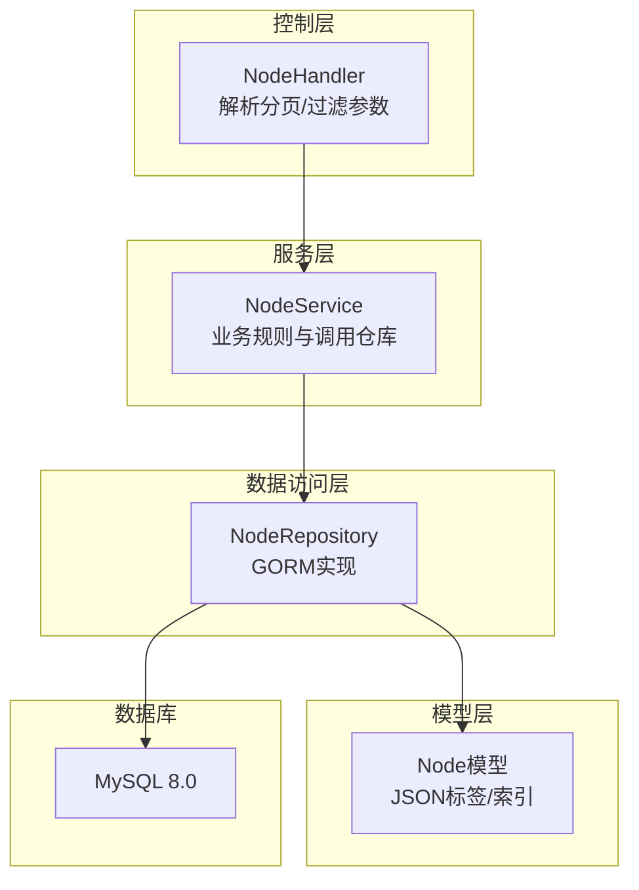
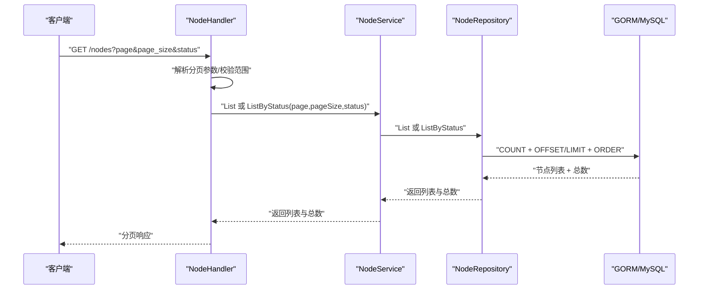
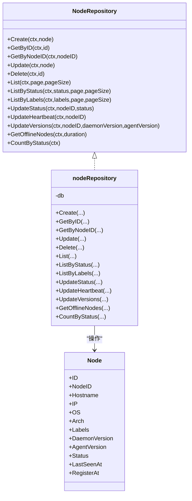
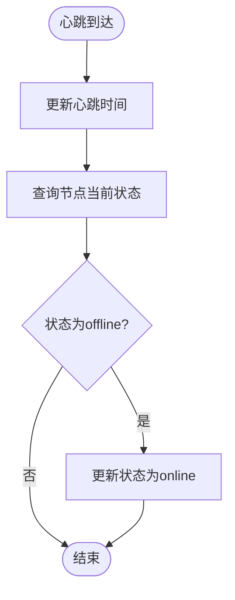
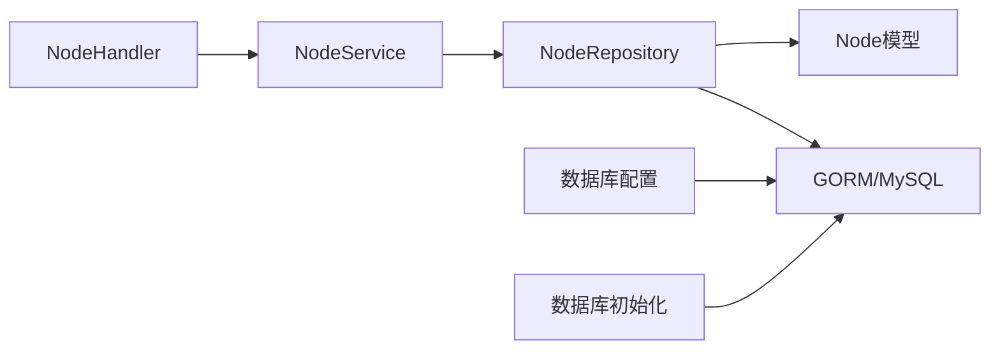

# 节点数据访问

<cite>
**本文引用的文件**
- [manager/internal/repository/node.go](file://manager/internal/repository/node.go)
- [manager/internal/model/node.go](file://manager/internal/model/node.go)
- [manager/internal/service/node.go](file://manager/internal/service/node.go)
- [manager/internal/handler/node.go](file://manager/internal/handler/node.go)
- [manager/pkg/database/database.go](file://manager/pkg/database/database.go)
- [manager/internal/config/config.go](file://manager/internal/config/config.go)
- [config/mysql/my.cnf](file://config/mysql/my.cnf)
- [podman-compose.yml](file://podman-compose.yml)
</cite>

## 目录
1. [简介](#简介)
2. [项目结构](#项目结构)
3. [核心组件](#核心组件)
4. [架构总览](#架构总览)
5. [详细组件分析](#详细组件分析)
6. [依赖关系分析](#依赖关系分析)
7. [性能考量](#性能考量)
8. [故障排查指南](#故障排查指南)
9. [结论](#结论)

## 简介
本文件聚焦于Manager模块的“节点数据访问层”，系统性阐述NodeRepository接口的职责边界与实现细节，覆盖节点的创建、查询、更新、删除与状态管理；重点解析GetByID、GetByNodeID、ListByStatus、ListByLabels等核心方法的实现路径、分页与复杂查询策略；并结合服务层的业务逻辑，说明节点状态更新、心跳维护、版本信息同步的实现要点，最后给出性能优化建议（索引与查询优化）。

## 项目结构
- 数据访问层位于manager/internal/repository，定义NodeRepository接口并提供基于GORM的实现。
- 模型层位于manager/internal/model，定义Node实体及JSON标签映射类型。
- 服务层位于manager/internal/service，封装业务规则（如心跳、离线检测、状态同步）。
- 控制层位于manager/internal/handler，负责HTTP参数解析与分页参数校验。
- 数据库初始化与连接池配置位于manager/pkg/database，MySQL配置位于config/mysql/my.cnf，容器编排位于podman-compose.yml。

图表来源
- [manager/internal/handler/node.go](file://manager/internal/handler/node.go#L1-L157)
- [manager/internal/service/node.go](file://manager/internal/service/node.go#L1-L234)
- [manager/internal/repository/node.go](file://manager/internal/repository/node.go#L1-L226)
- [manager/internal/model/node.go](file://manager/internal/model/node.go#L1-L68)
- [config/mysql/my.cnf](file://config/mysql/my.cnf#L1-L40)

章节来源
- [manager/internal/handler/node.go](file://manager/internal/handler/node.go#L1-L157)
- [manager/internal/service/node.go](file://manager/internal/service/node.go#L1-L234)
- [manager/internal/repository/node.go](file://manager/internal/repository/node.go#L1-L226)
- [manager/internal/model/node.go](file://manager/internal/model/node.go#L1-L68)
- [manager/pkg/database/database.go](file://manager/pkg/database/database.go#L1-L281)
- [manager/internal/config/config.go](file://manager/internal/config/config.go#L1-L262)
- [config/mysql/my.cnf](file://config/mysql/my.cnf#L1-L40)
- [podman-compose.yml](file://podman-compose.yml#L1-L60)

## 核心组件
- NodeRepository接口：定义节点的CRUD、分页查询、按状态/标签过滤、状态更新、心跳更新、版本更新、离线节点查询、按状态计数等能力。
- nodeRepository实现：基于GORM对nodes表进行操作，包含上下文透传、分页偏移、JSON字段查询、NOW()表达式更新等。
- Node模型：定义节点字段、唯一索引、JSON标签字段、状态默认值、时间戳等。
- NodeService：封装业务语义（心跳、离线检测、状态同步），协调仓库与审计日志。
- NodeHandler：HTTP层参数解析与分页校验，调用服务层并返回分页响应。

章节来源
- [manager/internal/repository/node.go](file://manager/internal/repository/node.go#L1-L39)
- [manager/internal/repository/node.go](file://manager/internal/repository/node.go#L51-L226)
- [manager/internal/model/node.go](file://manager/internal/model/node.go#L1-L68)
- [manager/internal/service/node.go](file://manager/internal/service/node.go#L1-L234)
- [manager/internal/handler/node.go](file://manager/internal/handler/node.go#L1-L157)

## 架构总览
下图展示从HTTP请求到数据库的完整调用链路，以及关键方法在各层的职责分工。

图表来源
- [manager/internal/handler/node.go](file://manager/internal/handler/node.go#L36-L69)
- [manager/internal/service/node.go](file://manager/internal/service/node.go#L126-L154)
- [manager/internal/repository/node.go](file://manager/internal/repository/node.go#L86-L105)
- [manager/internal/repository/node.go](file://manager/internal/repository/node.go#L107-L128)

## 详细组件分析

### NodeRepository接口与实现
- 接口职责
  - 基础CRUD：Create、GetByID、GetByNodeID、Update、Delete
  - 列表与分页：List、ListByStatus、ListByLabels
  - 状态与心跳：UpdateStatus、UpdateHeartbeat
  - 版本同步：UpdateVersions
  - 离线检测：GetOfflineNodes
  - 统计：CountByStatus

- 实现要点
  - 上下文透传：所有查询均通过WithContext传递请求上下文。
  - 分页策略：先COUNT再OFFSET/LIMIT，按主键倒序排序，确保稳定性。
  - JSON标签查询：使用JSON_EXTRACT构建键路径查询，支持多键组合过滤。
  - 时间更新：心跳更新使用NOW()表达式，避免应用侧时间漂移。
  - 离线判定：基于last_heartbeat_at与状态过滤，避免重复标记。

图表来源
- [manager/internal/repository/node.go](file://manager/internal/repository/node.go#L1-L39)
- [manager/internal/repository/node.go](file://manager/internal/repository/node.go#L51-L226)
- [manager/internal/model/node.go](file://manager/internal/model/node.go#L1-L68)

章节来源
- [manager/internal/repository/node.go](file://manager/internal/repository/node.go#L1-L39)
- [manager/internal/repository/node.go](file://manager/internal/repository/node.go#L51-L226)
- [manager/internal/model/node.go](file://manager/internal/model/node.go#L1-L68)

### 核心方法实现详解

#### GetByID
- 作用：按主键ID查询单个节点。
- 实现：First查询，返回指针或错误。
- 复杂度：O(1)，依赖主键索引。

章节来源
- [manager/internal/repository/node.go](file://manager/internal/repository/node.go#L56-L64)

#### GetByNodeID
- 作用：按唯一标识NodeID查询节点。
- 实现：基于唯一索引列查询，返回指针或错误。
- 复杂度：O(1)，依赖唯一索引。

章节来源
- [manager/internal/repository/node.go](file://manager/internal/repository/node.go#L66-L74)
- [manager/internal/model/node.go](file://manager/internal/model/node.go#L18-L20)

#### List
- 作用：分页列出节点，按ID倒序。
- 实现：
  - 先COUNT统计总数，再OFFSET/LIMIT分页查询。
  - ORDER BY id DESC保证稳定排序。
- 复杂度：COUNT O(n) + 分页查询取决于LIMIT；建议配合索引优化。

章节来源
- [manager/internal/repository/node.go](file://manager/internal/repository/node.go#L86-L105)

#### ListByStatus
- 作用：按状态过滤并分页。
- 实现：WHERE status=?，先COUNT后分页。
- 复杂度：COUNT O(n) + 分页查询；建议为status建立索引。

章节来源
- [manager/internal/repository/node.go](file://manager/internal/repository/node.go#L107-L128)

#### ListByLabels
- 作用：按JSON标签字典过滤并分页。
- 实现：逐键构建JSON_EXTRACT条件，支持多键AND组合。
- 复杂度：COUNT O(n) + 分页查询；JSON_EXTRACT不走普通B-Tree索引，建议评估复合索引或物化列。

章节来源
- [manager/internal/repository/node.go](file://manager/internal/repository/node.go#L130-L156)
- [manager/internal/model/node.go](file://manager/internal/model/node.go#L24-L24)

#### UpdateStatus
- 作用：更新节点状态。
- 实现：按NodeID更新status字段。
- 复杂度：O(1)，依赖NodeID索引。

章节来源
- [manager/internal/repository/node.go](file://manager/internal/repository/node.go#L158-L165)

#### UpdateHeartbeat
- 作用：更新心跳时间。
- 实现：使用NOW()表达式更新last_heartbeat_at，避免应用侧时间偏差。
- 复杂度：O(1)，依赖NodeID索引。

章节来源
- [manager/internal/repository/node.go](file://manager/internal/repository/node.go#L167-L174)

#### UpdateVersions
- 作用：同步Daemon/Agent版本信息。
- 实现：批量更新daemon_version与agent_version。
- 复杂度：O(1)，依赖NodeID索引。

章节来源
- [manager/internal/repository/node.go](file://manager/internal/repository/node.go#L176-L187)

#### GetOfflineNodes
- 作用：查询超过指定时长未心跳且非offline的节点。
- 实现：WHERE last_heartbeat_at < cutoff AND status != 'offline'。
- 复杂度：扫描近似窗口内记录；建议为last_heartbeat_at建立索引。

章节来源
- [manager/internal/repository/node.go](file://manager/internal/repository/node.go#L189-L199)

#### CountByStatus
- 作用：按状态统计节点数量。
- 实现：SELECT status, COUNT(*) GROUP BY status。
- 复杂度：全表聚合；建议为status建立索引以加速GROUP BY。

章节来源
- [manager/internal/repository/node.go](file://manager/internal/repository/node.go#L201-L225)

### 业务逻辑：心跳维护与状态同步
- 心跳处理（服务层）
  - 更新心跳时间：UpdateHeartbeat
  - 若节点此前为offline，则更新为online
- 离线检测（服务层）
  - 通过GetOfflineNodes获取超时未心跳节点
  - 将其状态更新为offline
- 版本同步（服务层）
  - UpdateVersions同步Daemon/Agent版本

图表来源
- [manager/internal/service/node.go](file://manager/internal/service/node.go#L166-L188)

章节来源
- [manager/internal/service/node.go](file://manager/internal/service/node.go#L166-L188)
- [manager/internal/service/node.go](file://manager/internal/service/node.go#L203-L223)

### 分页与复杂查询策略
- 分页参数
  - HTTP层解析page/page_size并做边界校验（最小页码与最大页大小限制）。
  - 服务层直接透传给仓库层。
- 复杂查询
  - 状态过滤：WHERE status=?
  - 标签过滤：JSON_EXTRACT(labels, '$.key')=? 多键AND组合
  - 排序：ORDER BY id DESC
- 响应格式
  - 服务层返回列表与总数，HTTP层统一包装分页响应。

章节来源
- [manager/internal/handler/node.go](file://manager/internal/handler/node.go#L36-L69)
- [manager/internal/service/node.go](file://manager/internal/service/node.go#L126-L154)
- [manager/internal/repository/node.go](file://manager/internal/repository/node.go#L107-L156)

## 依赖关系分析
- 控制层依赖服务层接口，服务层依赖仓库接口，仓库依赖GORM与MySQL。
- Node模型定义了唯一索引与JSON字段，影响查询性能与索引策略。
- 数据库初始化配置连接池参数，容器编排提供MySQL服务与配置挂载。

图表来源
- [manager/internal/handler/node.go](file://manager/internal/handler/node.go#L1-L157)
- [manager/internal/service/node.go](file://manager/internal/service/node.go#L1-L234)
- [manager/internal/repository/node.go](file://manager/internal/repository/node.go#L1-L226)
- [manager/internal/model/node.go](file://manager/internal/model/node.go#L1-L68)
- [manager/pkg/database/database.go](file://manager/pkg/database/database.go#L1-L281)
- [manager/internal/config/config.go](file://manager/internal/config/config.go#L1-L262)

章节来源
- [manager/internal/handler/node.go](file://manager/internal/handler/node.go#L1-L157)
- [manager/internal/service/node.go](file://manager/internal/service/node.go#L1-L234)
- [manager/internal/repository/node.go](file://manager/internal/repository/node.go#L1-L226)
- [manager/internal/model/node.go](file://manager/internal/model/node.go#L1-L68)
- [manager/pkg/database/database.go](file://manager/pkg/database/database.go#L1-L281)
- [manager/internal/config/config.go](file://manager/internal/config/config.go#L1-L262)

## 性能考量
- 索引建议
  - 为NodeID建立唯一索引（已具备），保障GetByNodeID与Update系列高效。
  - 为status建立索引，优化ListByStatus与CountByStatus。
  - 为last_heartbeat_at建立索引，优化GetOfflineNodes。
  - 对JSON标签查询，若查询频繁且数据量大，考虑物化标签字段或复合索引（视MySQL版本与JSON存储特性）。
- 查询优化
  - 分页COUNT与LIMIT分离，避免一次性COUNT全表；对于超大表，可考虑估算总数或延迟COUNT。
  - 使用NOW()表达式更新心跳时间，减少应用侧时间误差。
  - 避免在WHERE中对列进行函数计算（如日期函数包裹），以免索引失效。
- 连接池与数据库
  - 合理设置最大空闲/活跃连接数与连接生命周期，避免连接抖动。
  - MySQL配置中启用慢查询日志，定位热点查询与索引缺失问题。
- 容器与部署
  - 使用Podman编排MySQL服务，挂载my.cnf以启用性能参数（缓冲池、连接数、慢查询阈值等）。

章节来源
- [manager/internal/repository/node.go](file://manager/internal/repository/node.go#L107-L199)
- [manager/internal/model/node.go](file://manager/internal/model/node.go#L18-L33)
- [manager/pkg/database/database.go](file://manager/pkg/database/database.go#L60-L80)
- [config/mysql/my.cnf](file://config/mysql/my.cnf#L1-L40)
- [podman-compose.yml](file://podman-compose.yml#L1-L60)

## 故障排查指南
- 常见错误与处理
  - 记录不存在：GetByNodeID返回“记录不存在”时，上层应区分处理（如注册流程）。
  - 数据库错误：服务层捕获数据库异常并包装为API错误，便于HTTP层统一返回。
  - 迁移约束冲突：数据库初始化包含约束清理与重试逻辑，避免因历史残留约束导致迁移失败。
- 日志与监控
  - 服务层在关键操作（注册、更新、删除、心跳、离线检测）记录日志，便于追踪。
  - HTTP层对异常进行分类返回，便于前端与运维定位问题。
- 数据库健康
  - 启用慢查询日志，定期分析热点查询与索引使用情况。
  - 检查连接池参数与MySQL配置，避免连接不足或超时。

章节来源
- [manager/internal/service/node.go](file://manager/internal/service/node.go#L62-L91)
- [manager/internal/service/node.go](file://manager/internal/service/node.go#L93-L114)
- [manager/internal/service/node.go](file://manager/internal/service/node.go#L156-L188)
- [manager/internal/service/node.go](file://manager/internal/service/node.go#L203-L223)
- [manager/pkg/database/database.go](file://manager/pkg/database/database.go#L82-L211)
- [manager/internal/handler/node.go](file://manager/internal/handler/node.go#L59-L69)

## 结论
NodeRepository接口清晰地划分了数据访问职责，结合GORM实现，提供了稳定的节点CRUD、分页与复杂查询能力。服务层围绕心跳、离线检测与版本同步实现了关键业务逻辑。通过合理的索引策略、连接池配置与MySQL性能参数，可有效提升查询吞吐与稳定性。建议在高并发场景下持续监控慢查询与索引命中率，并根据实际查询模式迭代索引设计。