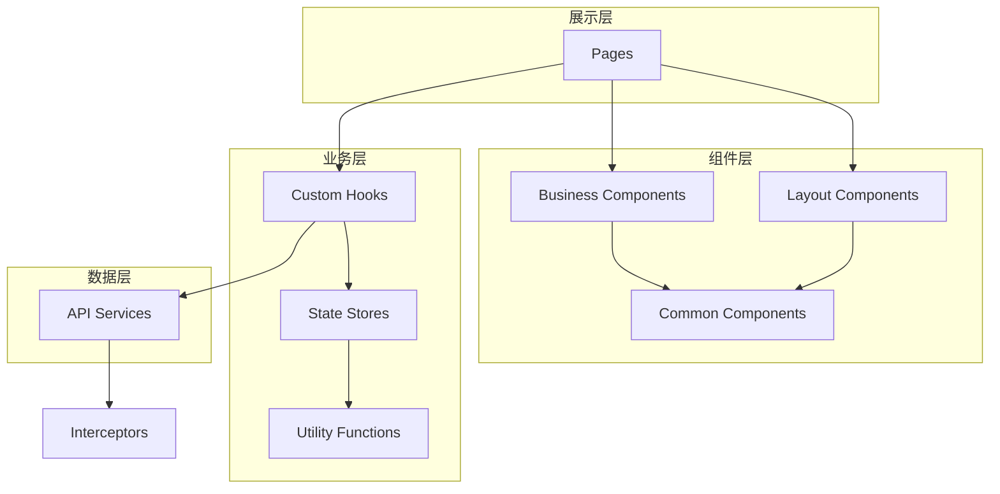
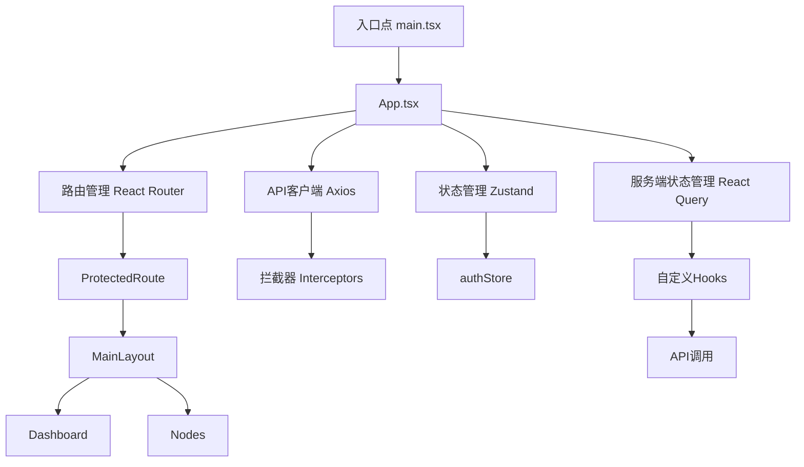
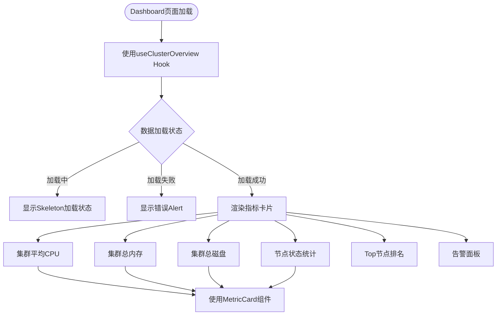
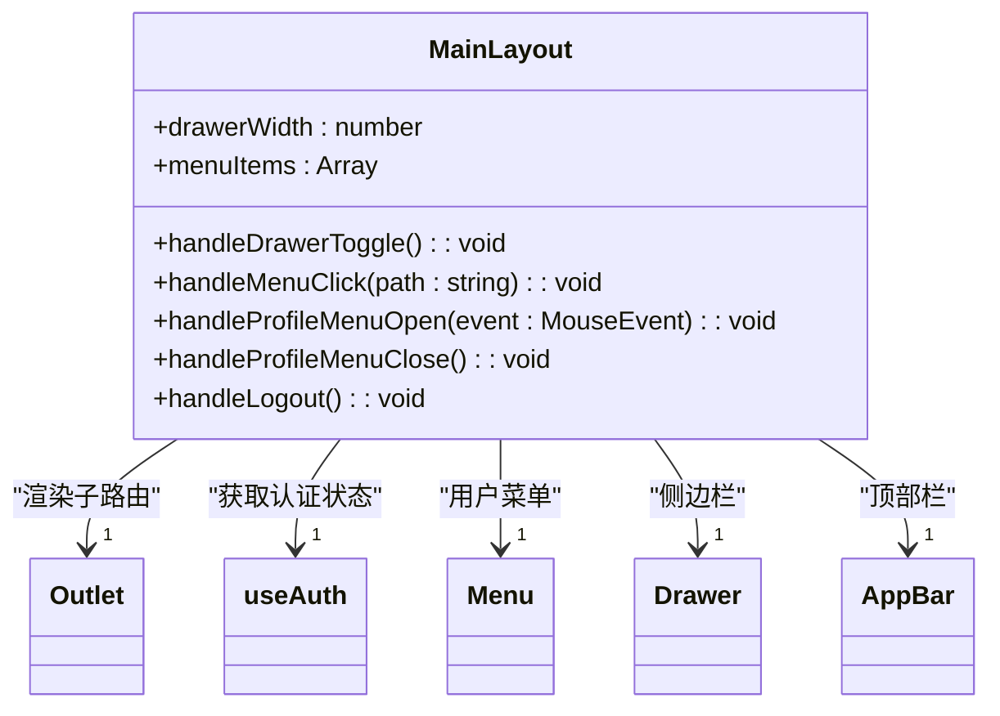
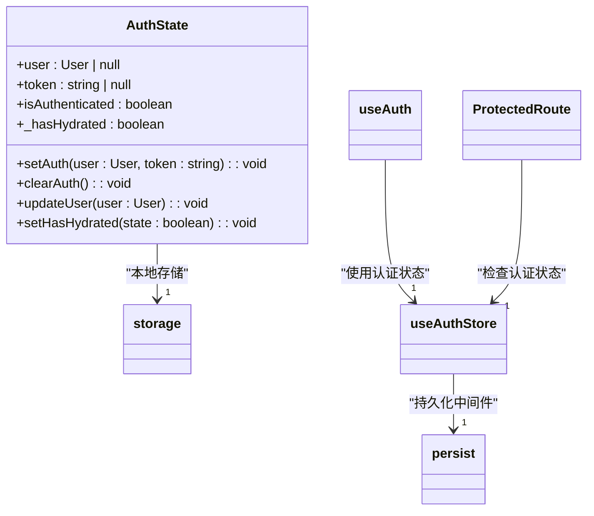
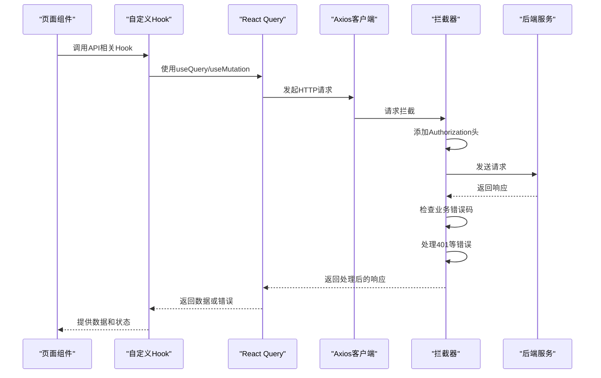
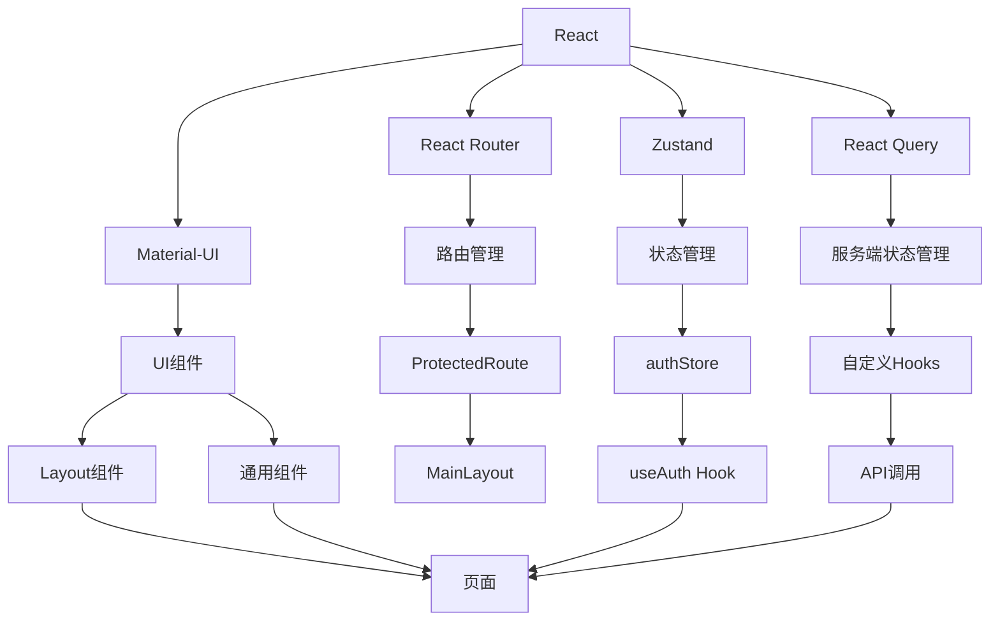

# Web 前端模块架构

<cite>
**本文档引用的文件**   
- [App.tsx](file://web/src/App.tsx)
- [main.tsx](file://web/src/main.tsx)
- [package.json](file://web/package.json)
- [vite.config.ts](file://web/vite.config.ts)
- [ProtectedRoute.tsx](file://web/src/router/ProtectedRoute.tsx)
- [MainLayout.tsx](file://web/src/components/Layout/MainLayout.tsx)
- [Dashboard/index.tsx](file://web/src/pages/Dashboard/index.tsx)
- [Nodes/List.tsx](file://web/src/pages/Nodes/List.tsx)
- [authStore.ts](file://web/src/stores/authStore.ts)
- [useAuth.ts](file://web/src/hooks/useAuth.ts)
- [client.ts](file://web/src/api/client.ts)
- [interceptors.ts](file://web/src/api/interceptors.ts)
- [MetricCard.tsx](file://web/src/components/Metrics/MetricCard.tsx)
- [storage.ts](file://web/src/utils/storage.ts)
- [index.ts](file://web/src/theme/index.ts)
</cite>

## 目录
1. [项目结构](#项目结构)
2. [核心组件](#核心组件)
3. [架构概述](#架构概述)
4. [详细组件分析](#详细组件分析)
5. [依赖分析](#依赖分析)
6. [性能考虑](#性能考虑)
7. [故障排除指南](#故障排除指南)
8. [结论](#结论)

## 项目结构

Web前端模块采用现代化的分层架构设计，遵循清晰的目录结构组织。项目根目录下的`src`文件夹包含所有源代码，按照功能和职责划分为多个层次：展示层（Pages）、组件层（Layout, Business, Common）、业务层（Hooks, Stores, Utils）和数据层（API Services）。这种分层结构确保了代码的可维护性和可扩展性。

**Diagram sources**
- [App.tsx](file://web/src/App.tsx#L5-L56)
- [MainLayout.tsx](file://web/src/components/Layout/MainLayout.tsx#L5-L183)

**Section sources**
- [App.tsx](file://web/src/App.tsx#L1-L57)
- [main.tsx](file://web/src/main.tsx#L1-L11)

## 核心组件

前端模块的核心组件包括Dashboard、节点管理、任务调度和版本发布等功能界面。这些组件共同构成了系统的可视化操作界面，为用户提供直观的运维管理体验。系统采用React框架构建用户界面，通过组件化开发模式实现功能的模块化和复用。

**Section sources**
- [Dashboard/index.tsx](file://web/src/pages/Dashboard/index.tsx#L1-L193)
- [Nodes/List.tsx](file://web/src/pages/Nodes/List.tsx#L1-L183)

## 架构概述

Web前端模块采用现代化的分层架构设计，包含展示层、组件层、业务层和数据层四个主要层次。系统以Vite作为构建工具，React作为UI框架，Material-UI作为UI组件库，Zustand进行状态管理，React Router进行路由管理，并通过Axios与后端API进行通信。

**Diagram sources**
- [App.tsx](file://web/src/App.tsx#L5-L56)
- [vite.config.ts](file://web/vite.config.ts#L1-L38)
- [package.json](file://web/package.json#L1-L57)

## 详细组件分析

### 展示层分析

展示层包含系统的主要页面组件，包括Dashboard、节点管理等。这些页面组件负责组织和协调下层组件，实现特定的业务功能。

#### Dashboard页面
Dashboard页面作为系统的主界面，提供集群监控的概览信息。页面通过组合多个指标卡片组件，展示集群的CPU、内存、磁盘使用情况以及节点状态统计。

**Diagram sources**
- [Dashboard/index.tsx](file://web/src/pages/Dashboard/index.tsx#L1-L193)
- [MetricCard.tsx](file://web/src/components/Metrics/MetricCard.tsx#L1-L117)

**Section sources**
- [Dashboard/index.tsx](file://web/src/pages/Dashboard/index.tsx#L1-L193)

### 组件层分析

组件层包含布局组件、业务组件和通用组件，实现了UI的模块化和复用。

#### 布局组件
MainLayout组件实现了系统的主布局结构，包含顶部导航栏、侧边栏菜单和内容区域。布局组件使用Material-UI的Drawer、AppBar等组件实现响应式设计。

**Diagram sources**
- [MainLayout.tsx](file://web/src/components/Layout/MainLayout.tsx#L1-L184)
- [ProtectedRoute.tsx](file://web/src/router/ProtectedRoute.tsx#L1-L38)

**Section sources**
- [MainLayout.tsx](file://web/src/components/Layout/MainLayout.tsx#L1-L184)

### 业务层分析

业务层包含自定义Hook、状态存储和工具函数，实现了业务逻辑的封装和复用。

#### 状态管理方案
系统采用Zustand进行客户端状态管理，特别是用户认证状态的管理。authStore使用Zustand的persist中间件实现状态的持久化存储。

**Diagram sources**
- [authStore.ts](file://web/src/stores/authStore.ts#L1-L85)
- [useAuth.ts](file://web/src/hooks/useAuth.ts#L1-L73)
- [storage.ts](file://web/src/utils/storage.ts#L1-L48)

**Section sources**
- [authStore.ts](file://web/src/stores/authStore.ts#L1-L85)
- [useAuth.ts](file://web/src/hooks/useAuth.ts#L1-L73)

### 数据层分析

数据层负责与后端API的通信，包含API客户端配置、拦截器和具体的API服务。

#### API集成方案
系统使用Axios作为HTTP客户端，通过拦截器实现请求和响应的统一处理。拦截器负责添加认证Token、处理错误响应和重定向未授权请求。

**Diagram sources**
- [client.ts](file://web/src/api/client.ts#L1-L18)
- [interceptors.ts](file://web/src/api/interceptors.ts#L1-L95)
- [useAuth.ts](file://web/src/hooks/useAuth.ts#L1-L73)

**Section sources**
- [client.ts](file://web/src/api/client.ts#L1-L18)
- [interceptors.ts](file://web/src/api/interceptors.ts#L1-L95)

## 依赖分析

前端模块的依赖关系清晰，各层次之间遵循单向依赖原则。展示层依赖组件层和业务层，业务层依赖数据层，形成稳定的架构结构。

**Diagram sources**
- [package.json](file://web/package.json#L1-L57)
- [App.tsx](file://web/src/App.tsx#L5-L56)

**Section sources**
- [package.json](file://web/package.json#L1-L57)

## 性能考虑

系统在性能方面进行了多项优化，包括代码分割、缓存策略和资源加载优化。Vite配置中通过manualChunks实现了第三方库的代码分割，将Recharts、Material-UI等大型库单独打包，减少初始加载体积。

React Query的配置中设置了合理的缓存策略，包括staleTime、refetchOnWindowFocus等选项，平衡了数据新鲜度和网络请求频率。组件层面使用React.memo进行性能优化，避免不必要的重新渲染。

## 故障排除指南

当遇到前端问题时，可以按照以下步骤进行排查：

1. **网络连接问题**：检查Manager服务是否已启动，API地址配置是否正确，以及网络连接是否正常。
2. **认证问题**：检查Token是否过期，本地存储中的认证信息是否完整。
3. **数据加载问题**：检查API响应格式是否符合预期，React Query的错误处理是否正确。
4. **UI渲染问题**：检查组件的props传递是否正确，状态管理是否正常工作。

**Section sources**
- [interceptors.ts](file://web/src/api/interceptors.ts#L1-L95)
- [authStore.ts](file://web/src/stores/authStore.ts#L1-L85)

## 结论

Web前端模块采用现代化的技术栈和分层架构设计，实现了清晰的职责分离和良好的可维护性。通过Vite、React、Material-UI、Zustand和React Query等技术的组合，构建了一个高效、可扩展的运维管理界面。系统的架构设计充分考虑了性能、可维护性和用户体验，为后续功能扩展奠定了坚实的基础。