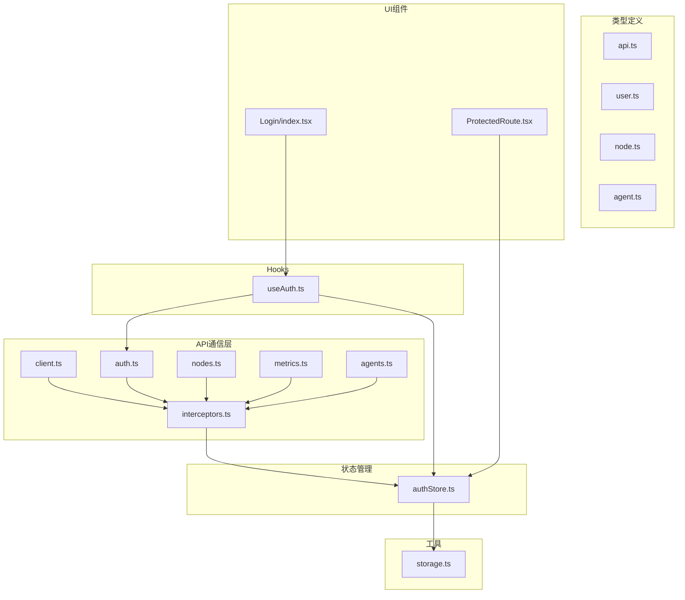
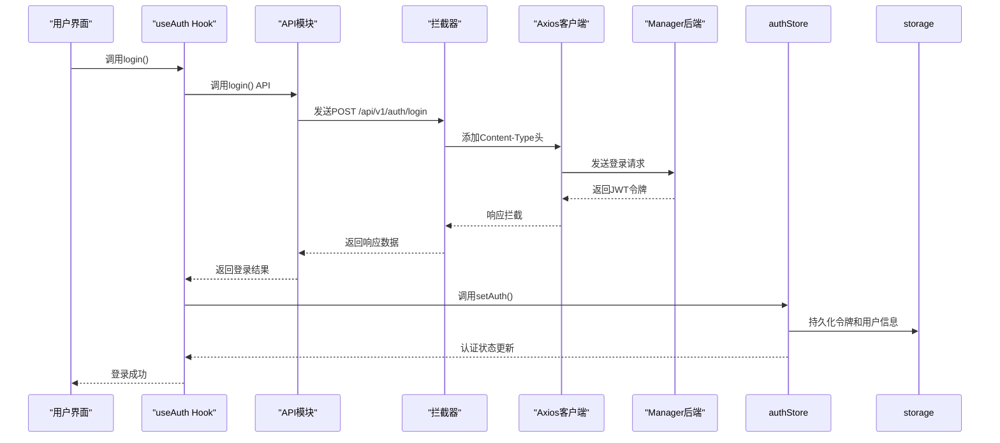
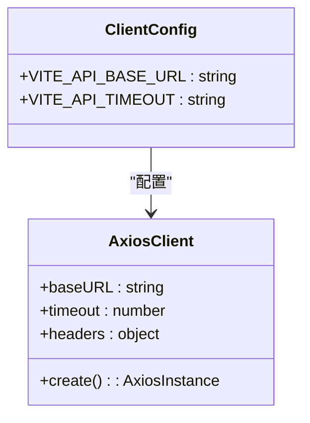
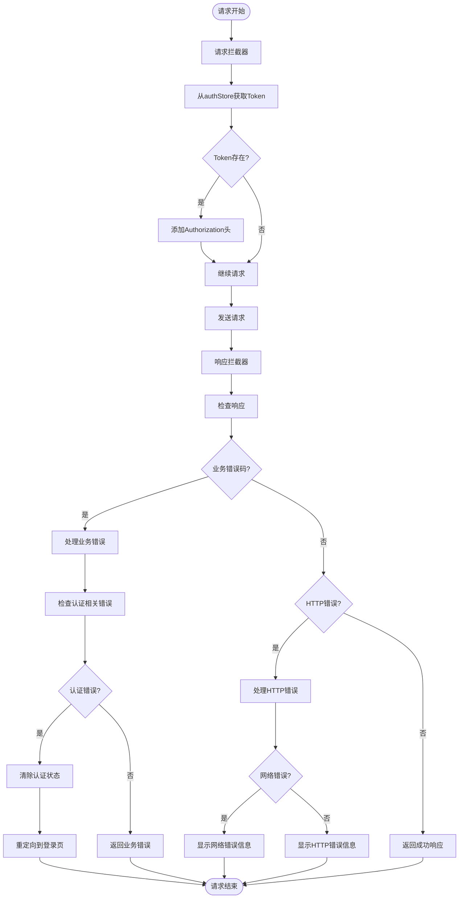
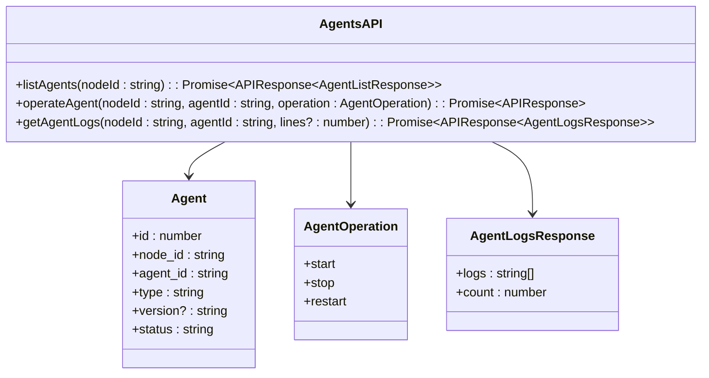
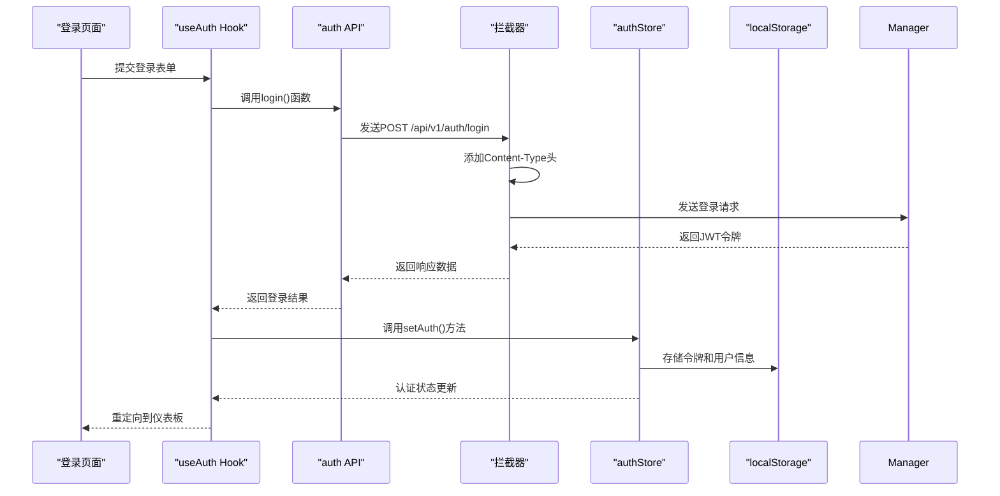

# API 集成与通信

<cite>
**本文档引用的文件**   
- [client.ts](file://web/src/api/client.ts)
- [interceptors.ts](file://web/src/api/interceptors.ts)
- [auth.ts](file://web/src/api/auth.ts)
- [nodes.ts](file://web/src/api/nodes.ts)
- [metrics.ts](file://web/src/api/metrics.ts)
- [agents.ts](file://web/src/api/agents.ts)
- [api.ts](file://web/src/types/api.ts)
- [user.ts](file://web/src/types/user.ts)
- [node.ts](file://web/src/types/node.ts)
- [agent.ts](file://web/src/types/agent.ts)
- [authStore.ts](file://web/src/stores/authStore.ts)
- [useAuth.ts](file://web/src/hooks/useAuth.ts)
- [storage.ts](file://web/src/utils/storage.ts)
- [index.tsx](file://web/src/pages/Login/index.tsx)
- [ProtectedRoute.tsx](file://web/src/router/ProtectedRoute.tsx)
</cite>

## 目录
1. [简介](#简介)
2. [项目结构](#项目结构)
3. [核心组件](#核心组件)
4. [架构概述](#架构概述)
5. [详细组件分析](#详细组件分析)
6. [依赖分析](#依赖分析)
7. [性能考虑](#性能考虑)
8. [故障排除指南](#故障排除指南)
9. [结论](#结论)

## 简介
本文档详细说明了前端与Manager后端之间的RESTful API通信机制。文档涵盖了Axios实例的配置、请求/响应拦截器的实现、各API模块的封装方式以及参数类型定义。同时，文档还包含HTTP请求生命周期图、认证流程时序图，并提供实际代码示例，展示如何调用登录API并处理返回的JWT令牌。此外，文档还讨论了安全性考虑，如防止CSRF攻击、敏感信息保护和HTTPS强制使用。

## 项目结构
前端API通信机制主要位于`web/src/api`目录下，包含客户端配置、拦截器和各个API模块。类型定义位于`web/src/types`目录，状态管理位于`web/src/stores`目录。



**Diagram sources**
- [client.ts](file://web/src/api/client.ts)
- [interceptors.ts](file://web/src/api/interceptors.ts)
- [authStore.ts](file://web/src/stores/authStore.ts)
- [storage.ts](file://web/src/utils/storage.ts)

**Section sources**
- [client.ts](file://web/src/api/client.ts)
- [interceptors.ts](file://web/src/api/interceptors.ts)
- [authStore.ts](file://web/src/stores/authStore.ts)

## 核心组件
前端API通信的核心组件包括Axios客户端实例、请求/响应拦截器、API模块封装和认证状态管理。这些组件共同实现了安全、高效的RESTful API通信。

**Section sources**
- [client.ts](file://web/src/api/client.ts)
- [interceptors.ts](file://web/src/api/interceptors.ts)
- [authStore.ts](file://web/src/stores/authStore.ts)

## 架构概述
系统采用分层架构，前端通过Axios与Manager后端进行通信。API请求经过拦截器处理，自动添加JWT令牌，并在响应中处理认证状态。认证信息通过zustand store进行管理，并持久化到localStorage。



**Diagram sources**
- [client.ts](file://web/src/api/client.ts)
- [interceptors.ts](file://web/src/api/interceptors.ts)
- [auth.ts](file://web/src/api/auth.ts)
- [authStore.ts](file://web/src/stores/authStore.ts)
- [storage.ts](file://web/src/utils/storage.ts)

## 详细组件分析

### Axios客户端配置分析
Axios客户端配置了基础URL、超时设置和默认请求头，为所有API请求提供了统一的配置基础。



**Diagram sources**
- [client.ts](file://web/src/api/client.ts)

**Section sources**
- [client.ts](file://web/src/api/client.ts)

### 拦截器实现分析
请求拦截器负责自动添加JWT令牌到请求头，响应拦截器处理401未授权重定向、统一错误处理和响应数据标准化。



**Diagram sources**
- [interceptors.ts](file://web/src/api/interceptors.ts)
- [authStore.ts](file://web/src/stores/authStore.ts)

**Section sources**
- [interceptors.ts](file://web/src/api/interceptors.ts)

### API模块封装分析
各个API模块（auth、nodes、metrics、agents）被封装为独立的函数，提供了类型安全的接口，简化了API调用。

#### 认证API模块
```mermaid
classDiagram
class AuthAPI {
+login(data : LoginRequest) : Promise~APIResponse~LoginResponse~~
+register(data : RegisterRequest) : Promise~APIResponse~RegisterResponse~~
+getProfile() : Promise~APIResponse~{user : User}~~
+changePassword(data : ChangePasswordRequest) : Promise~APIResponse~
}
class LoginRequest {
+username : string
+password : string
}
class LoginResponse {
+token : string
+user : User
}
class User {
+id : number
+username : string
+email : string
+role : UserRole
+status : UserStatus
}
AuthAPI --> LoginRequest
AuthAPI --> LoginResponse
LoginResponse --> User
```

**Diagram sources**
- [auth.ts](file://web/src/api/auth.ts)
- [user.ts](file://web/src/types/user.ts)

**Section sources**
- [auth.ts](file://web/src/api/auth.ts)

#### 节点管理API模块
```mermaid
classDiagram
class NodesAPI {
+getNodes(params : {page? : number, page_size? : number, status? : string}) : Promise~APIResponse~PageResponse~Node~~~
+getNode(id : string) : Promise~APIResponse~{node : Node}~~
+deleteNode(id : number) : Promise~APIResponse~
+getNodeStatistics() : Promise~APIResponse~{statistics : NodeStatistics}~~
}
class Node {
+id : number
+node_id : string
+hostname : string
+ip : string
+os : string
+arch : string
+status : NodeStatus
}
class NodeStatistics {
+total : number
+online : number
+offline : number
}
NodesAPI --> Node
NodesAPI --> NodeStatistics
```

**Diagram sources**
- [nodes.ts](file://web/src/api/nodes.ts)
- [node.ts](file://web/src/types/node.ts)

**Section sources**
- [nodes.ts](file://web/src/api/nodes.ts)

#### 监控指标API模块
```mermaid
classDiagram
class MetricsAPI {
+getLatestMetrics(nodeId : string) : Promise~APIResponse~MetricsLatestResponse~~
+getMetricsHistory(nodeId : string, type : string, params : {start_time : string, end_time : string}) : Promise~APIResponse~MetricsHistoryResponse~~
+getMetricsSummary(nodeId : string, timeRange? : TimeRange) : Promise~APIResponse~MetricsSummaryResponse~~
+getClusterOverview() : Promise~APIResponse~ClusterOverviewResponse~~
}
class MetricsLatestResponse {
+cpu_usage : number
+memory_usage : number
+disk_usage : number
}
class MetricsHistoryResponse {
+timestamps : string[]
+values : number[]
}
class TimeRange {
+startTime : Date
+endTime : Date
}
MetricsAPI --> MetricsLatestResponse
MetricsAPI --> MetricsHistoryResponse
MetricsAPI --> TimeRange
```

**Diagram sources**
- [metrics.ts](file://web/src/api/metrics.ts)
- [node.ts](file://web/src/types/node.ts)

**Section sources**
- [metrics.ts](file://web/src/api/metrics.ts)

#### Agent管理API模块


**Diagram sources**
- [agents.ts](file://web/src/api/agents.ts)
- [agent.ts](file://web/src/types/agent.ts)

**Section sources**
- [agents.ts](file://web/src/api/agents.ts)

### 认证流程分析
认证流程包括登录、令牌存储、请求认证和令牌失效处理，确保了系统的安全性。



**Diagram sources**
- [auth.ts](file://web/src/api/auth.ts)
- [interceptors.ts](file://web/src/api/interceptors.ts)
- [authStore.ts](file://web/src/stores/authStore.ts)
- [storage.ts](file://web/src/utils/storage.ts)
- [index.tsx](file://web/src/pages/Login/index.tsx)

**Section sources**
- [auth.ts](file://web/src/api/auth.ts)
- [interceptors.ts](file://web/src/api/interceptors.ts)
- [authStore.ts](file://web/src/stores/authStore.ts)

## 依赖分析
API通信机制依赖于多个核心组件，包括Axios库、zustand状态管理、react-query数据获取和MUI组件库。

```mermaid
graph TD
Axios[axios] --> Client[client.ts]
Zustand[zustand] --> AuthStore[authStore.ts]
ReactQuery[react-query] --> UseAuth[useAuth.ts]
MUI[@mui/material] --> LoginPage[Login/index.tsx]
Client --> Interceptors[interceptors.ts]
Interceptors --> AuthStore
AuthStore --> Storage[storage.ts]
UseAuth --> AuthStore
UseAuth --> AuthAPI[auth.ts]
LoginPage --> UseAuth
ProtectedRoute --> AuthStore
```

**Diagram sources**
- [client.ts](file://web/src/api/client.ts)
- [interceptors.ts](file://web/src/api/interceptors.ts)
- [authStore.ts](file://web/src/stores/authStore.ts)
- [storage.ts](file://web/src/utils/storage.ts)
- [useAuth.ts](file://web/src/hooks/useAuth.ts)
- [index.tsx](file://web/src/pages/Login/index.tsx)
- [ProtectedRoute.tsx](file://web/src/router/ProtectedRoute.tsx)

**Section sources**
- [client.ts](file://web/src/api/client.ts)
- [interceptors.ts](file://web/src/api/interceptors.ts)
- [authStore.ts](file://web/src/stores/authStore.ts)

## 性能考虑
API通信机制在性能方面进行了优化，包括请求超时设置、错误处理和状态管理。

**Section sources**
- [client.ts](file://web/src/api/client.ts)
- [interceptors.ts](file://web/src/api/interceptors.ts)

## 故障排除指南
当API通信出现问题时，可以按照以下步骤进行排查：

1. 检查Manager服务是否已启动
2. 检查API地址配置是否正确
3. 检查网络连接和防火墙设置
4. 检查认证状态和令牌是否有效
5. 查看浏览器控制台的错误信息

**Section sources**
- [interceptors.ts](file://web/src/api/interceptors.ts)
- [client.ts](file://web/src/api/client.ts)

## 结论
本文档详细说明了前端与Manager后端之间的RESTful API通信机制。通过Axios客户端配置、请求/响应拦截器、API模块封装和认证状态管理，实现了安全、高效的API通信。系统具有良好的可维护性和扩展性，为后续功能开发提供了坚实的基础。