# UI 组件设计

<cite>
**本文引用的文件**
- [MainLayout.tsx](file://web/src/components/Layout/MainLayout.tsx)
- [TopNodesCard.tsx](file://web/src/components/Dashboard/TopNodesCard.tsx)
- [AlertsPanel.tsx](file://web/src/components/Dashboard/AlertsPanel.tsx)
- [MetricCard.tsx](file://web/src/components/Metrics/MetricCard.tsx)
- [CPUCard.tsx](file://web/src/components/Metrics/CPUCard.tsx)
- [MemoryCard.tsx](file://web/src/components/Metrics/MemoryCard.tsx)
- [DiskCard.tsx](file://web/src/components/Metrics/DiskCard.tsx)
- [NetworkCard.tsx](file://web/src/components/Metrics/NetworkCard.tsx)
- [MetricsChart.tsx](file://web/src/components/Metrics/MetricsChart.tsx)
- [TimeRangeSelector.tsx](file://web/src/components/Metrics/TimeRangeSelector.tsx)
- [RefreshControl.tsx](file://web/src/components/Metrics/RefreshControl.tsx)
- [index.tsx](file://web/src/pages/Dashboard/index.tsx)
- [useMetrics.ts](file://web/src/hooks/useMetrics.ts)
- [metricsUtils.ts](file://web/src/utils/metricsUtils.ts)
- [metrics.ts](file://web/src/types/metrics.ts)
- [metricsStore.ts](file://web/src/stores/metricsStore.ts)
- [index.ts](file://web/src/theme/index.ts)
</cite>

## 目录
1. [引言](#引言)
2. [项目结构](#项目结构)
3. [核心组件](#核心组件)
4. [架构总览](#架构总览)
5. [组件详解](#组件详解)
6. [依赖关系分析](#依赖关系分析)
7. [性能与可维护性](#性能与可维护性)
8. [故障排查指南](#故障排查指南)
9. [结论](#结论)
10. [附录](#附录)

## 引言
本设计文档聚焦于前端可视化组件的实现，围绕主布局 MainLayout 的响应式结构、Dashboard 中 TopNodesCard 与 AlertsPanel 的数据绑定与交互、Metrics 系列组件对 MetricCard 基类的复用与差异化展示，以及 MetricsChart 对 Apache ECharts for React 的集成与时间范围选择、手动刷新控制。文档同时提供组件层级关系图、Props 接口定义示例与 Material-UI 主题定制方案，确保 UI 风格一致性与可扩展性。

## 项目结构
前端位于 web/src 目录，采用按功能域分层组织：
- components：可复用 UI 组件（Layout、Dashboard、Metrics）
- pages：页面级容器（如 Dashboard）
- hooks：数据获取与状态逻辑（React Query、Zustand）
- stores：全局状态（metricsStore）
- utils：工具函数（metricsUtils）
- types：类型定义（metrics.ts）
- theme：MUI 主题定制（index.ts）

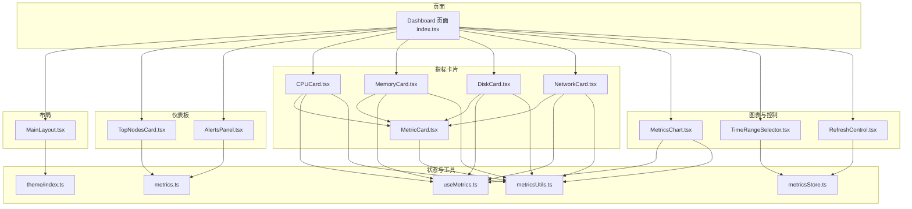

图表来源
- [index.tsx](file://web/src/pages/Dashboard/index.tsx#L1-L193)
- [MainLayout.tsx](file://web/src/components/Layout/MainLayout.tsx#L1-L184)
- [TopNodesCard.tsx](file://web/src/components/Dashboard/TopNodesCard.tsx#L1-L202)
- [AlertsPanel.tsx](file://web/src/components/Dashboard/AlertsPanel.tsx#L1-L137)
- [MetricCard.tsx](file://web/src/components/Metrics/MetricCard.tsx#L1-L117)
- [CPUCard.tsx](file://web/src/components/Metrics/CPUCard.tsx#L1-L77)
- [MemoryCard.tsx](file://web/src/components/Metrics/MemoryCard.tsx#L1-L86)
- [DiskCard.tsx](file://web/src/components/Metrics/DiskCard.tsx#L1-L86)
- [NetworkCard.tsx](file://web/src/components/Metrics/NetworkCard.tsx#L1-L89)
- [MetricsChart.tsx](file://web/src/components/Metrics/MetricsChart.tsx#L1-L178)
- [TimeRangeSelector.tsx](file://web/src/components/Metrics/TimeRangeSelector.tsx#L1-L235)
- [RefreshControl.tsx](file://web/src/components/Metrics/RefreshControl.tsx#L1-L101)
- [useMetrics.ts](file://web/src/hooks/useMetrics.ts#L1-L103)
- [metricsUtils.ts](file://web/src/utils/metricsUtils.ts#L1-L77)
- [metrics.ts](file://web/src/types/metrics.ts#L1-L93)
- [metricsStore.ts](file://web/src/stores/metricsStore.ts#L1-L37)
- [index.ts](file://web/src/theme/index.ts#L1-L100)

章节来源
- [index.tsx](file://web/src/pages/Dashboard/index.tsx#L1-L193)
- [MainLayout.tsx](file://web/src/components/Layout/MainLayout.tsx#L1-L184)

## 核心组件
- MainLayout：提供响应式侧边栏、头部导航与内容区 Outlet，支持移动端抽屉与桌面端永久侧栏。
- Dashboard 页面：聚合指标卡片、Top 节点、告警面板与刷新控制，统一管理刷新策略与最后更新时间。
- Metrics 系列：以 MetricCard 为基类，CPUCard/MemoryCard/DiskCard/NetworkCard 实现差异化展示。
- MetricsChart：基于 recharts 的面积图，支持时间范围自适应的 X/Y 轴格式化、渐变填充与自定义 Tooltip。
- TimeRangeSelector：预设时间范围与自定义时间对话框，约束时间范围与校验。
- RefreshControl：定时刷新开关与倒计时可视化，配合全局刷新间隔状态。

章节来源
- [MainLayout.tsx](file://web/src/components/Layout/MainLayout.tsx#L1-L184)
- [index.tsx](file://web/src/pages/Dashboard/index.tsx#L1-L193)
- [MetricCard.tsx](file://web/src/components/Metrics/MetricCard.tsx#L1-L117)
- [MetricsChart.tsx](file://web/src/components/Metrics/MetricsChart.tsx#L1-L178)
- [TimeRangeSelector.tsx](file://web/src/components/Metrics/TimeRangeSelector.tsx#L1-L235)
- [RefreshControl.tsx](file://web/src/components/Metrics/RefreshControl.tsx#L1-L101)

## 架构总览
Dashboard 页面作为容器，协调各子组件：
- 通过 useMetricsStore 管理时间范围与刷新间隔
- 通过 useClusterOverview 获取集群概览数据，驱动 MetricCard 系列
- TopNodesCard 与 AlertsPanel 基于节点指标进行排序与告警规则计算
- MetricsChart 通过 useMetricsHistory 获取历史数据并渲染

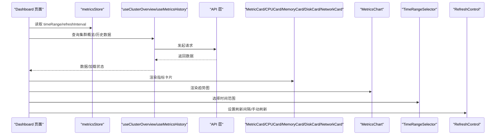

图表来源
- [index.tsx](file://web/src/pages/Dashboard/index.tsx#L1-L193)
- [useMetrics.ts](file://web/src/hooks/useMetrics.ts#L1-L103)
- [metricsStore.ts](file://web/src/stores/metricsStore.ts#L1-L37)

## 组件详解

### MainLayout 布局组件
- 结构组成
  - 顶部 AppBar：标题、用户头像菜单、移动端抽屉按钮
  - 左侧 Drawer：移动端临时抽屉与桌面端永久抽屉
  - 主内容区 Outlet：承载路由页面
- 响应式设计
  - 移动端：抽屉仅在点击菜单按钮时出现
  - 桌面端：抽屉常驻，随窗口宽度变化调整
- 导航与用户操作
  - 菜单项跳转至仪表盘与节点管理
  - 用户菜单提供登出操作

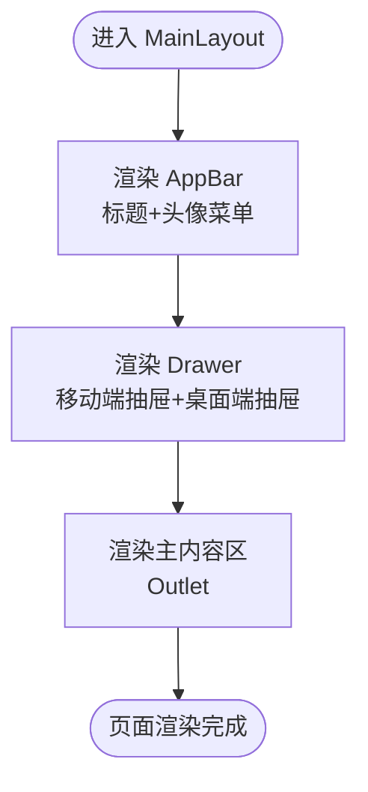

图表来源
- [MainLayout.tsx](file://web/src/components/Layout/MainLayout.tsx#L1-L184)

章节来源
- [MainLayout.tsx](file://web/src/components/Layout/MainLayout.tsx#L1-L184)

### Dashboard 页面与数据流
- 数据来源
  - useClusterOverview 获取集群概览（平均 CPU、总内存、总磁盘、节点状态）
  - useMetricsHistory 获取历史指标用于图表
- 刷新机制
  - RefreshControl 控制刷新间隔与倒计时
  - Dashboard 页面调用 refetch 触发重新拉取
- 信息展示
  - 指标卡片：CPU、内存、磁盘、节点状态
  - Top 节点：按 CPU 或内存排序的前五节点
  - 告警面板：基于规则检查的告警列表与徽章

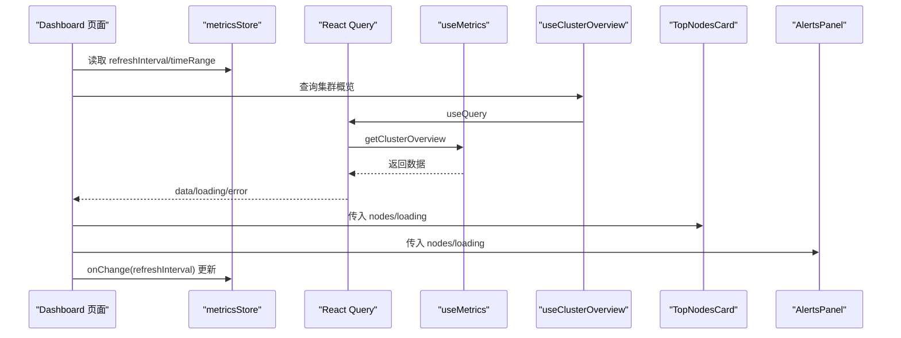

图表来源
- [index.tsx](file://web/src/pages/Dashboard/index.tsx#L1-L193)
- [useMetrics.ts](file://web/src/hooks/useMetrics.ts#L1-L103)
- [metricsStore.ts](file://web/src/stores/metricsStore.ts#L1-L37)

章节来源
- [index.tsx](file://web/src/pages/Dashboard/index.tsx#L1-L193)
- [useMetrics.ts](file://web/src/hooks/useMetrics.ts#L1-L103)

### TopNodesCard 组件
- 数据绑定
  - 接收 nodes 与 loading
  - 基于 sortBy 切换 CPU/内存排序维度
- 交互逻辑
  - ToggleButtonGroup 切换排序维度
  - 点击节点项跳转到节点详情页
- 视觉呈现
  - 排名徽章颜色区分前三
  - LinearProgress 展示使用率
  - Skeleton 占位符优化加载体验

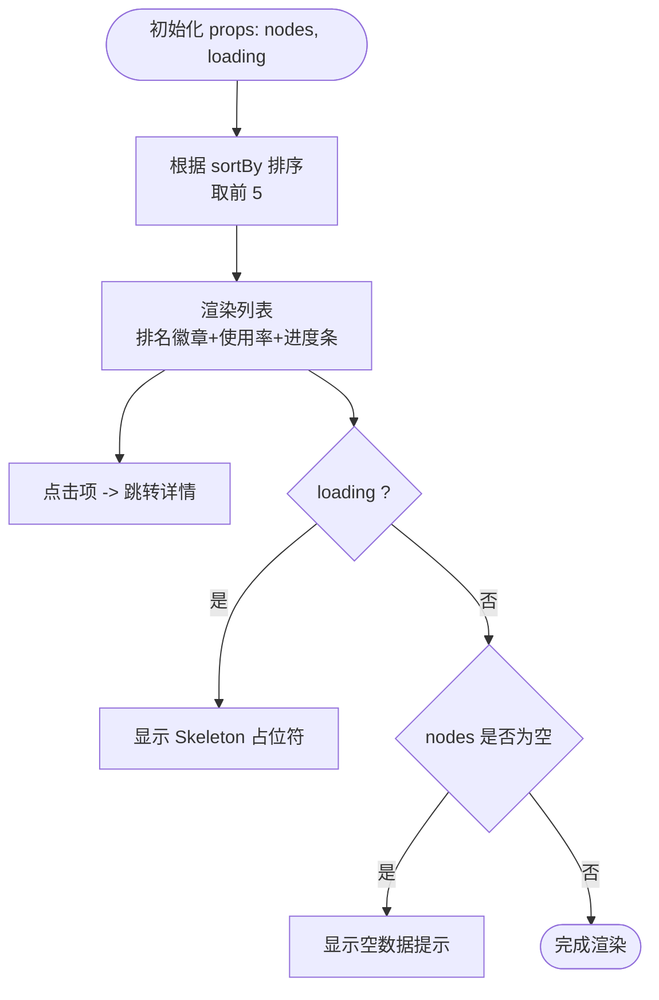

图表来源
- [TopNodesCard.tsx](file://web/src/components/Dashboard/TopNodesCard.tsx#L1-L202)

章节来源
- [TopNodesCard.tsx](file://web/src/components/Dashboard/TopNodesCard.tsx#L1-L202)
- [metricsUtils.ts](file://web/src/utils/metricsUtils.ts#L1-L77)

### AlertsPanel 组件
- 数据绑定
  - 接收 nodes 与 loading
  - 使用规则函数计算告警并按严重级别排序
- 交互逻辑
  - 点击告警项跳转到对应节点详情
- 视觉呈现
  - Badge 根据是否存在 critical 决定颜色
  - 前 10 条告警展示，超出部分提示剩余数量
  - 成功状态下显示“运行正常”提示

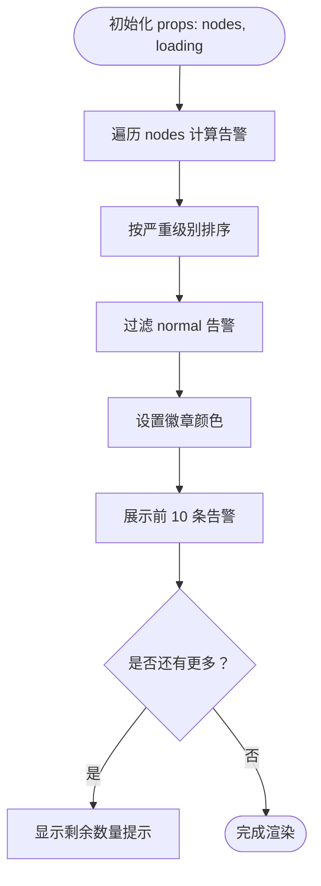

图表来源
- [AlertsPanel.tsx](file://web/src/components/Dashboard/AlertsPanel.tsx#L1-L137)

章节来源
- [AlertsPanel.tsx](file://web/src/components/Dashboard/AlertsPanel.tsx#L1-L137)

### Metrics 系列组件与 MetricCard 基类
- MetricCard 基类
  - Props：title、value、unit、percentage、icon、color、loading、error、extraInfo
  - 支持加载态、错误态与进度条展示
- CPUCard
  - 从 useLatestMetrics 获取 CPU 数据
  - 使用 getUsageColor 计算颜色，extraInfo 展示核心数与型号
- MemoryCard
  - 从 useLatestMetrics 获取内存数据
  - 使用 formatBytesToGB 与 getUsageColor
  - 无有效数据时提示“暂无数据”
- DiskCard
  - 从 useLatestMetrics 获取磁盘数据
  - 使用 getDiskUsageColor 与 formatBytesToGB
  - 无有效数据时提示“暂无数据”
- NetworkCard
  - 从 useLatestMetrics 获取网络 RX/TX
  - 合计为总流量，使用固定颜色（蓝色）
  - extraInfo 展示接收与发送量

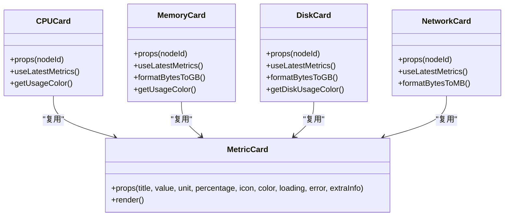

图表来源
- [MetricCard.tsx](file://web/src/components/Metrics/MetricCard.tsx#L1-L117)
- [CPUCard.tsx](file://web/src/components/Metrics/CPUCard.tsx#L1-L77)
- [MemoryCard.tsx](file://web/src/components/Metrics/MemoryCard.tsx#L1-L86)
- [DiskCard.tsx](file://web/src/components/Metrics/DiskCard.tsx#L1-L86)
- [NetworkCard.tsx](file://web/src/components/Metrics/NetworkCard.tsx#L1-L89)

章节来源
- [MetricCard.tsx](file://web/src/components/Metrics/MetricCard.tsx#L1-L117)
- [CPUCard.tsx](file://web/src/components/Metrics/CPUCard.tsx#L1-L77)
- [MemoryCard.tsx](file://web/src/components/Metrics/MemoryCard.tsx#L1-L86)
- [DiskCard.tsx](file://web/src/components/Metrics/DiskCard.tsx#L1-L86)
- [NetworkCard.tsx](file://web/src/components/Metrics/NetworkCard.tsx#L1-L89)
- [metricsUtils.ts](file://web/src/utils/metricsUtils.ts#L1-L77)

### MetricsChart 图表组件
- 数据绑定
  - 接收 data（timestamp/value）、title、unit、color、loading、height
- 自适应格式化
  - X 轴：根据时间范围选择不同格式（HH:mm、MM-dd HH:mm、MM-dd）
  - Y 轴：根据单位添加 % 或单位文本
- 交互与样式
  - 自定义 Tooltip 展示时间戳与数值
  - 渐变填充区域图，支持响应式容器
- 加载与空数据
  - loading 显示骨架屏
  - 无数据时显示提示

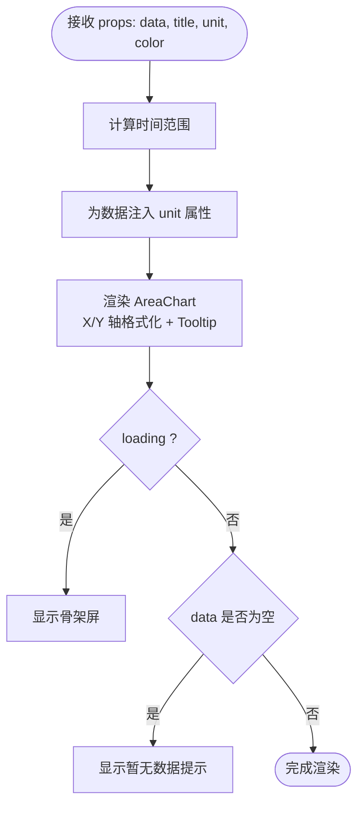

图表来源
- [MetricsChart.tsx](file://web/src/components/Metrics/MetricsChart.tsx#L1-L178)

章节来源
- [MetricsChart.tsx](file://web/src/components/Metrics/MetricsChart.tsx#L1-L178)

### TimeRangeSelector 时间范围选择器
- 功能特性
  - 预设时间范围：15m/30m/1h/1d/7d/30d
  - 自定义时间对话框：日期时间选择器，校验开始/结束时间与最大跨度
- 状态管理
  - 通过 value/onChange 与全局 store 同步
  - 识别当前是否为预设值，保持 UI 状态一致

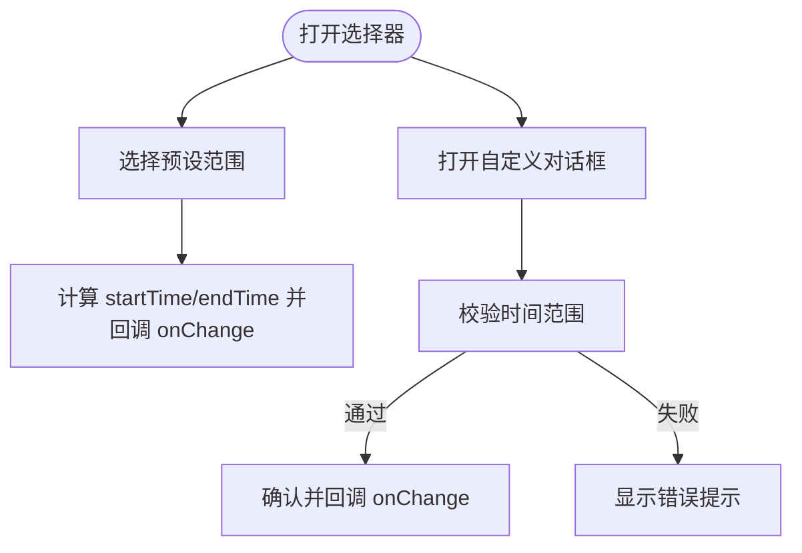

图表来源
- [TimeRangeSelector.tsx](file://web/src/components/Metrics/TimeRangeSelector.tsx#L1-L235)
- [metricsStore.ts](file://web/src/stores/metricsStore.ts#L1-L37)

章节来源
- [TimeRangeSelector.tsx](file://web/src/components/Metrics/TimeRangeSelector.tsx#L1-L235)
- [metricsStore.ts](file://web/src/stores/metricsStore.ts#L1-L37)

### RefreshControl 刷新控制
- 功能特性
  - 切换暂停/30秒/1分钟刷新
  - 倒计时进度条与秒数显示
- 行为逻辑
  - 设置 interval 后启动定时器，到期触发 onRefresh 回调并重置倒计时
  - 清理定时器避免内存泄漏

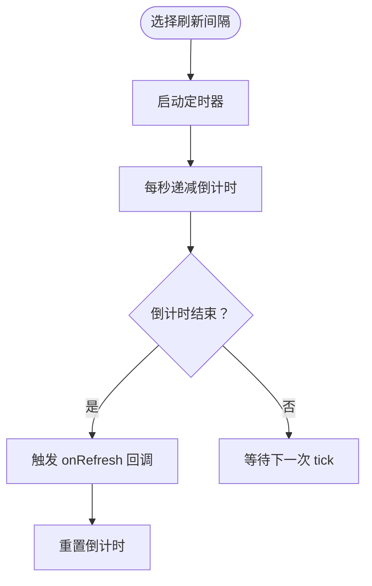

图表来源
- [RefreshControl.tsx](file://web/src/components/Metrics/RefreshControl.tsx#L1-L101)

章节来源
- [RefreshControl.tsx](file://web/src/components/Metrics/RefreshControl.tsx#L1-L101)

## 依赖关系分析
- 组件间依赖
  - Dashboard 页面依赖 Metrics 系列、TopNodesCard、AlertsPanel、RefreshControl
  - Metrics 系列依赖 MetricCard 与 hooks/useMetrics
  - MetricsChart 依赖 hooks/useMetrics 与 utils/metricsUtils
  - TimeRangeSelector 依赖 stores/metricsStore
- 类型与工具
  - types/metrics.ts 定义指标数据结构
  - utils/metricsUtils 提供颜色与格式化工具
- 主题与样式
  - theme/index.ts 定义主题与组件默认样式

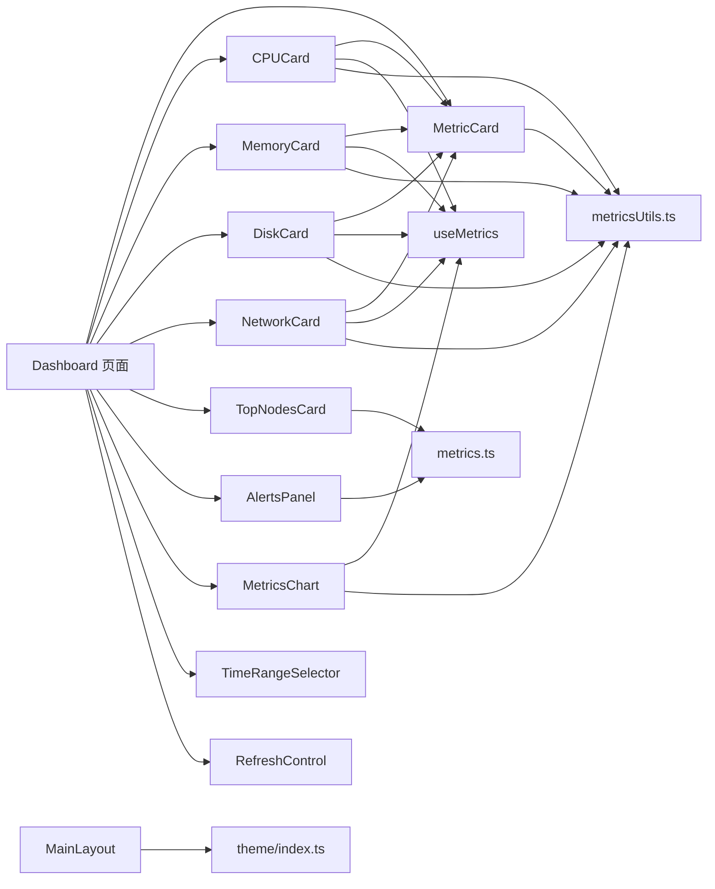

图表来源
- [index.tsx](file://web/src/pages/Dashboard/index.tsx#L1-L193)
- [MetricCard.tsx](file://web/src/components/Metrics/MetricCard.tsx#L1-L117)
- [CPUCard.tsx](file://web/src/components/Metrics/CPUCard.tsx#L1-L77)
- [MemoryCard.tsx](file://web/src/components/Metrics/MemoryCard.tsx#L1-L86)
- [DiskCard.tsx](file://web/src/components/Metrics/DiskCard.tsx#L1-L86)
- [NetworkCard.tsx](file://web/src/components/Metrics/NetworkCard.tsx#L1-L89)
- [TopNodesCard.tsx](file://web/src/components/Dashboard/TopNodesCard.tsx#L1-L202)
- [AlertsPanel.tsx](file://web/src/components/Dashboard/AlertsPanel.tsx#L1-L137)
- [MetricsChart.tsx](file://web/src/components/Metrics/MetricsChart.tsx#L1-L178)
- [TimeRangeSelector.tsx](file://web/src/components/Metrics/TimeRangeSelector.tsx#L1-L235)
- [RefreshControl.tsx](file://web/src/components/Metrics/RefreshControl.tsx#L1-L101)
- [useMetrics.ts](file://web/src/hooks/useMetrics.ts#L1-L103)
- [metricsUtils.ts](file://web/src/utils/metricsUtils.ts#L1-L77)
- [metrics.ts](file://web/src/types/metrics.ts#L1-L93)
- [index.ts](file://web/src/theme/index.ts#L1-L100)

章节来源
- [index.tsx](file://web/src/pages/Dashboard/index.tsx#L1-L193)
- [metrics.ts](file://web/src/types/metrics.ts#L1-L93)

## 性能与可维护性
- 性能优化
  - 使用 useMemo 缓存计算结果（排序、颜色、格式化），减少重复计算
  - 使用 React.memo 包装图表与控制组件，避免不必要的重渲染
  - React Query 缓存策略：最新指标 25 秒、历史与摘要 5 分钟，降低请求频率
  - Skeleton 占位符提升长列表加载体验
- 可维护性
  - MetricCard 抽象统一的卡片结构，Metrics 系列组件仅关注差异化展示
  - hooks/useMetrics 统一查询逻辑，便于扩展新的指标类型
  - utils/metricsUtils 将颜色与格式化逻辑集中管理，便于主题与规则变更
  - stores/metricsStore 集中管理时间范围与刷新间隔，便于跨页面共享

[本节为通用建议，无需列出具体文件来源]

## 故障排查指南
- 无数据或显示“暂无数据”
  - 检查 useLatestMetrics 返回的 data.data.* 是否存在
  - 确认节点指标采集是否正常
- 告警未显示
  - 确认 nodes 数据是否传入且非空
  - 检查告警规则函数是否正确返回非 normal 告警
- 图表无数据
  - 检查 useMetricsHistory 的 timeRange 与 nodeId 是否有效
  - 确认 API 返回的历史数据格式符合预期
- 刷新无效
  - 检查 RefreshControl 的 value 与 onChange 是否同步到 store
  - 确认 Dashboard 页面的 refetch 是否被调用
- 主题不一致
  - 检查 theme/index.ts 的 palette 与 components 样式覆盖
  - 确保组件使用 theme 调色板而非硬编码颜色

章节来源
- [CPUCard.tsx](file://web/src/components/Metrics/CPUCard.tsx#L1-L77)
- [MemoryCard.tsx](file://web/src/components/Metrics/MemoryCard.tsx#L1-L86)
- [DiskCard.tsx](file://web/src/components/Metrics/DiskCard.tsx#L1-L86)
- [NetworkCard.tsx](file://web/src/components/Metrics/NetworkCard.tsx#L1-L89)
- [AlertsPanel.tsx](file://web/src/components/Dashboard/AlertsPanel.tsx#L1-L137)
- [MetricsChart.tsx](file://web/src/components/Metrics/MetricsChart.tsx#L1-L178)
- [RefreshControl.tsx](file://web/src/components/Metrics/RefreshControl.tsx#L1-L101)
- [index.ts](file://web/src/theme/index.ts#L1-L100)

## 结论
该 UI 组件体系以 MainLayout 提供一致的导航与布局，Dashboard 页面整合指标卡片、Top 节点与告警面板，Metrics 系列通过 MetricCard 基类实现高内聚低耦合的复用模式；MetricsChart 与 TimeRangeSelector/RefreshControl 提供灵活的时间范围与刷新控制能力。结合主题定制与工具函数，整体具备良好的可扩展性与一致性。

[本节为总结性内容，无需列出具体文件来源]

## 附录

### Props 接口定义示例
- MetricCardProps
  - title: 字符串
  - value: 数字或字符串
  - unit?: 字符串
  - percentage?: 数字
  - icon?: ReactNode
  - color?: 字符串
  - loading?: 布尔
  - error?: 字符串
  - extraInfo?: ReactNode
- CPUCardProps
  - nodeId: 字符串
- MemoryCardProps
  - nodeId: 字符串
- DiskCardProps
  - nodeId: 字符串
- NetworkCardProps
  - nodeId: 字符串
- MetricsChartProps
  - data: 数组（timestamp, value）
  - title: 字符串
  - unit: 字符串
  - color: 字符串
  - loading?: 布尔
  - height?: 数字
- TimeRangeSelectorProps
  - value: TimeRange
  - onChange: 回调函数
- RefreshControlProps
  - value: 数字或 null
  - onChange: 回调函数
  - onRefresh?: 回调函数
- TimeRange
  - startTime: Date
  - endTime: Date
- NodeMetrics
  - node_id: 字符串
  - hostname: 字符串
  - ip: 字符串
  - status: 字符串
  - cpu_usage: 数字
  - memory_usage: 数字
  - disk_usage: 数字
  - network_rx: 数字
  - network_tx: 数字

章节来源
- [MetricCard.tsx](file://web/src/components/Metrics/MetricCard.tsx#L1-L117)
- [CPUCard.tsx](file://web/src/components/Metrics/CPUCard.tsx#L1-L77)
- [MemoryCard.tsx](file://web/src/components/Metrics/MemoryCard.tsx#L1-L86)
- [DiskCard.tsx](file://web/src/components/Metrics/DiskCard.tsx#L1-L86)
- [NetworkCard.tsx](file://web/src/components/Metrics/NetworkCard.tsx#L1-L89)
- [MetricsChart.tsx](file://web/src/components/Metrics/MetricsChart.tsx#L1-L178)
- [TimeRangeSelector.tsx](file://web/src/components/Metrics/TimeRangeSelector.tsx#L1-L235)
- [RefreshControl.tsx](file://web/src/components/Metrics/RefreshControl.tsx#L1-L101)
- [metrics.ts](file://web/src/types/metrics.ts#L1-L93)

### Material-UI 主题定制方案
- 主题配置要点
  - palette：定义主色、次色、成功/警告/错误等语义色
  - typography：统一字体族与各级标题字号
  - components：为 Button、Card、TextField 等组件设置默认样式与行为
- 应用建议
  - 在应用入口引入主题并包裹应用根节点
  - 组件内部优先使用 theme 调色板，避免硬编码颜色
  - 通过 styled 或 sx 统一样式，保证一致性

章节来源
- [index.ts](file://web/src/theme/index.ts#L1-L100)