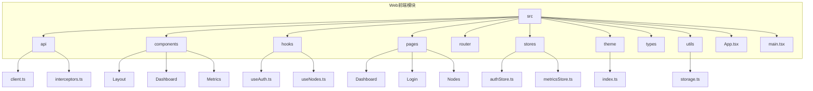
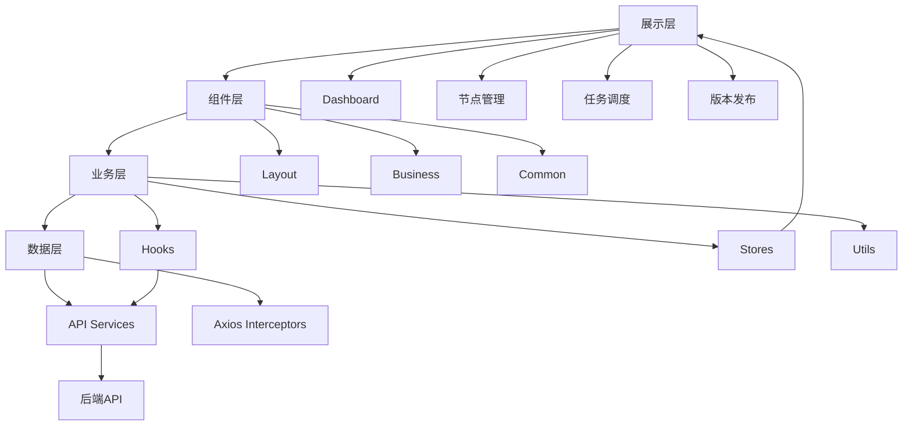
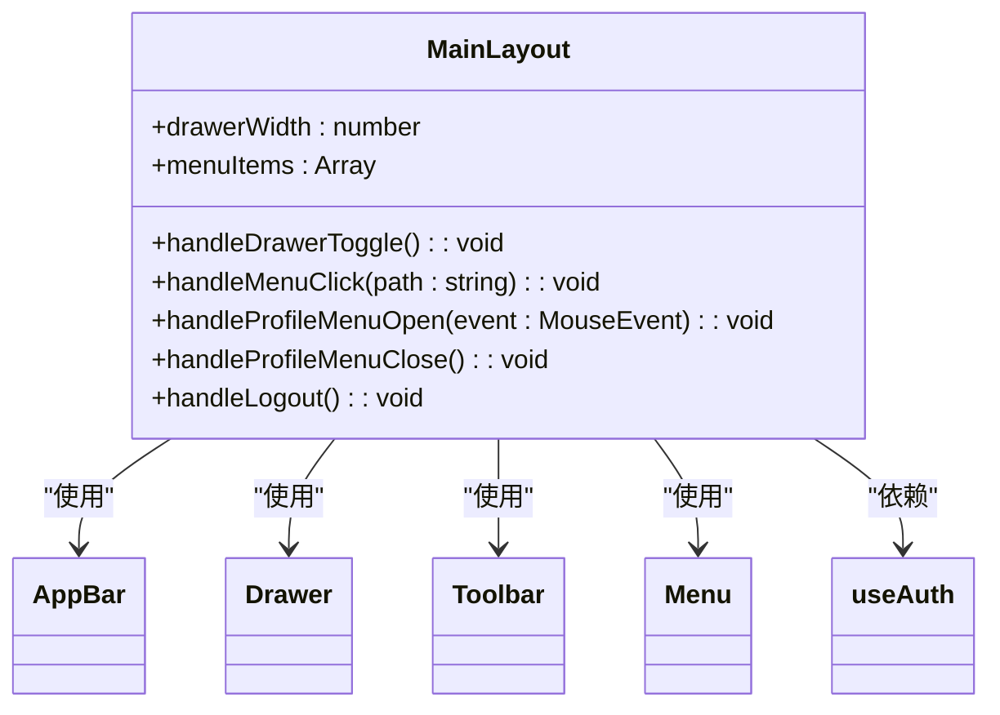
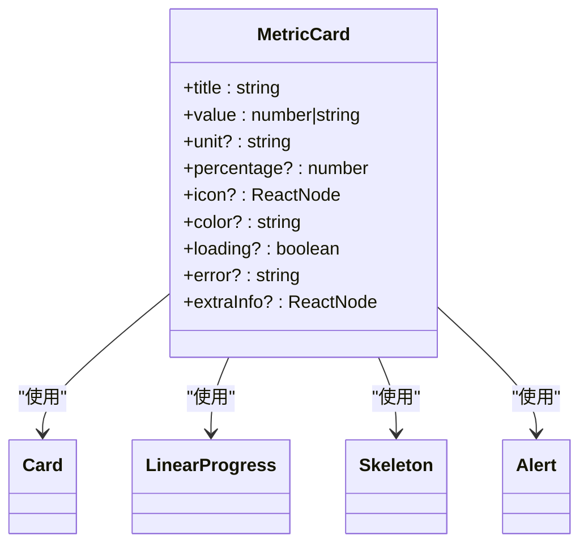
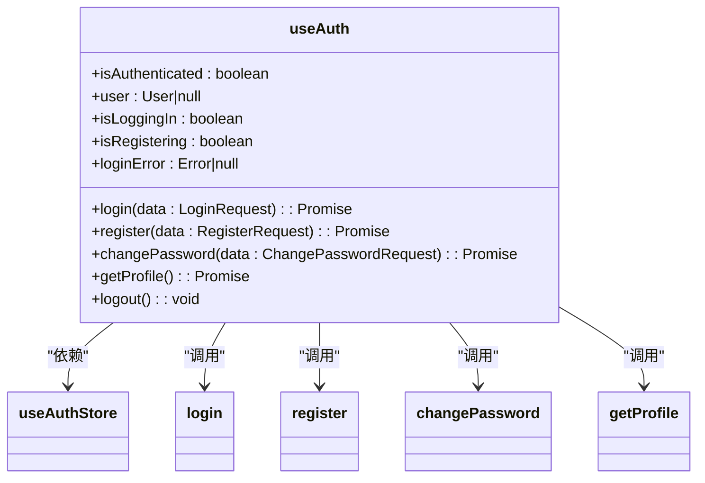
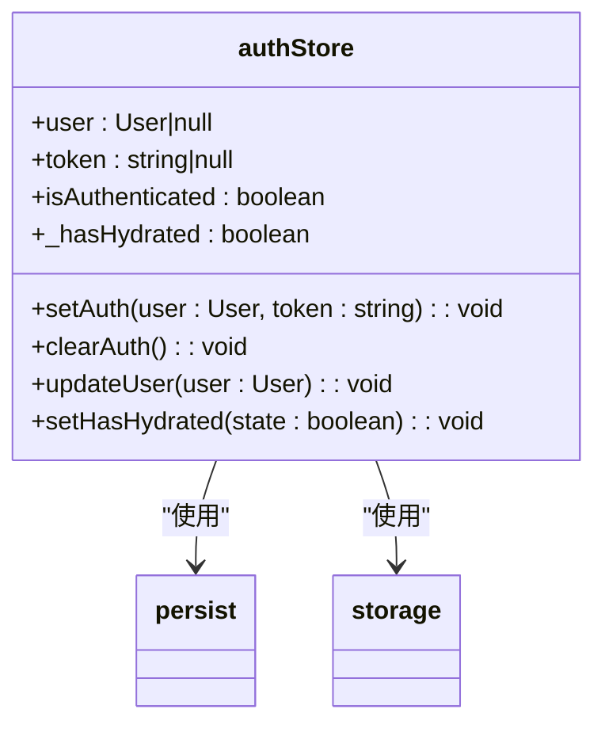
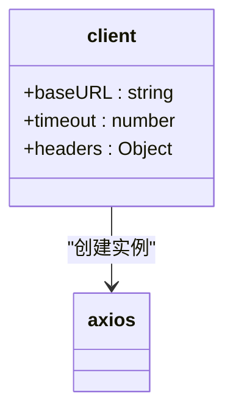
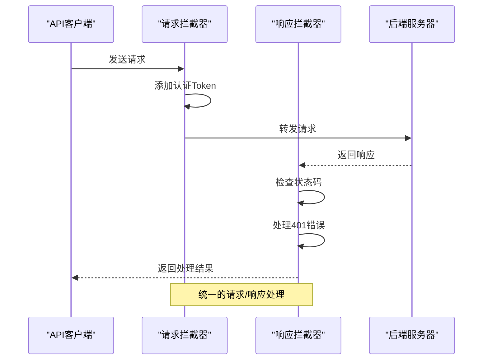
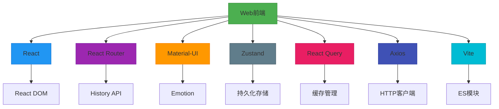

# Web 前端模块架构

<cite>
**本文档引用的文件**  
- [App.tsx](file://web/src/App.tsx)
- [main.tsx](file://web/src/main.tsx)
- [package.json](file://web/package.json)
- [vite.config.ts](file://web/vite.config.ts)
- [ProtectedRoute.tsx](file://web/src/router/ProtectedRoute.tsx)
- [MainLayout.tsx](file://web/src/components/Layout/MainLayout.tsx)
- [Dashboard/index.tsx](file://web/src/pages/Dashboard/index.tsx)
- [Nodes/List.tsx](file://web/src/pages/Nodes/List.tsx)
- [authStore.ts](file://web/src/stores/authStore.ts)
- [useAuth.ts](file://web/src/hooks/useAuth.ts)
- [client.ts](file://web/src/api/client.ts)
- [interceptors.ts](file://web/src/api/interceptors.ts)
- [theme/index.ts](file://web/src/theme/index.ts)
- [storage.ts](file://web/src/utils/storage.ts)
- [index.ts](file://web/src/types/index.ts)
- [MetricCard.tsx](file://web/src/components/Metrics/MetricCard.tsx)
</cite>

## 目录

1. [简介](#简介)
2. [项目结构](#项目结构)
3. [核心组件](#核心组件)
4. [架构概览](#架构概览)
5. [详细组件分析](#详细组件分析)
6. [依赖分析](#依赖分析)
7. [性能考虑](#性能考虑)
8. [故障排除指南](#故障排除指南)
9. [结论](#结论)

## 简介
Web前端模块是运维工具框架的可视化操作界面，为用户提供直观的集群监控和管理功能。该模块采用现代化的React技术栈，实现了Dashboard、节点管理、任务调度和版本发布等核心功能。前端架构设计遵循分层原则，包含展示层、组件层、业务层和数据层，确保代码的可维护性和可扩展性。通过Zustand进行本地状态管理，React Query处理服务端状态，结合Axios拦截器实现统一的API通信，构建了一个高效、稳定且用户体验优良的管理平台。

## 项目结构

**图示来源**
- [App.tsx](file://web/src/App.tsx)
- [src目录结构](file://web/src/)

**本节来源**
- [项目结构](file://.)

## 核心组件

Web前端模块的核心组件包括主应用组件、路由系统、布局组件、页面组件和状态管理模块。主应用组件(App.tsx)负责初始化React Query客户端和Material-UI主题，并通过React Router定义应用的路由结构。ProtectedRoute组件实现路由保护，确保只有认证用户才能访问受保护的页面。MainLayout提供统一的页面布局，包含侧边栏导航和顶部工具栏。Dashboard和Nodes页面分别实现集群监控和节点管理功能，通过自定义Hook(useAuth, useNodes)与后端API交互获取数据。

**本节来源**
- [App.tsx](file://web/src/App.tsx#L27-L56)
- [ProtectedRoute.tsx](file://web/src/router/ProtectedRoute.tsx#L13-L37)
- [MainLayout.tsx](file://web/src/components/Layout/MainLayout.tsx#L40-L183)
- [Dashboard/index.tsx](file://web/src/pages/Dashboard/index.tsx#L22-L192)
- [Nodes/List.tsx](file://web/src/pages/Nodes/List.tsx#L27-L182)

## 架构概览

**图示来源**
- [src目录结构](file://web/src/)
- [App.tsx](file://web/src/App.tsx)
- [hooks目录](file://web/src/hooks/)
- [stores目录](file://web/src/stores/)
- [api目录](file://web/src/api/)

## 详细组件分析

### 组件层分析

#### 布局组件

**图示来源**
- [MainLayout.tsx](file://web/src/components/Layout/MainLayout.tsx#L40-L183)

#### 指标卡片组件

**图示来源**
- [MetricCard.tsx](file://web/src/components/Metrics/MetricCard.tsx#L28-L115)

### 业务层分析

#### 认证Hook

**图示来源**
- [useAuth.ts](file://web/src/hooks/useAuth.ts#L13-L72)

#### 认证状态管理

**图示来源**
- [authStore.ts](file://web/src/stores/authStore.ts#L23-L84)

### 数据层分析

#### API客户端配置

**图示来源**
- [client.ts](file://web/src/api/client.ts#L9-L15)

#### API拦截器

**图示来源**
- [interceptors.ts](file://web/src/api/interceptors.ts)

## 依赖分析

**图示来源**
- [package.json](file://web/package.json)
- [vite.config.ts](file://web/vite.config.ts)

**本节来源**
- [package.json](file://web/package.json#L1-L57)
- [vite.config.ts](file://web/vite.config.ts#L1-L38)

## 性能考虑

前端模块在性能优化方面采取了多项措施。首先，通过Vite的构建配置实现了代码分割，将Recharts、Material-UI等大型依赖单独打包，减少初始加载体积。其次，React Query的缓存机制避免了重复的API请求，设置了合理的staleTime(5秒)和refetchOnWindowFocus(false)策略，在保证数据新鲜度的同时减少不必要的网络请求。此外，组件层面使用React.memo进行性能优化，如MetricCard组件，避免不必要的重渲染。主题配置中通过自定义按钮和卡片样式，减少了运行时的样式计算开销。

**本节来源**
- [vite.config.ts](file://web/vite.config.ts#L20-L33)
- [App.tsx](file://web/src/App.tsx#L17-L25)
- [MetricCard.tsx](file://web/src/components/Metrics/MetricCard.tsx#L115)
- [theme/index.ts](file://web/src/theme/index.ts)

## 故障排除指南

前端模块的故障排除主要集中在认证状态、API通信和数据加载三个方面。认证问题通常与localStorage中的token失效有关，可通过清除本地存储数据后重新登录解决。API通信问题可通过检查浏览器开发者工具的网络面板，确认请求URL、头部信息和响应状态码。数据加载异常可能源于React Query的缓存机制，可通过触发refetch手动刷新数据。对于构建问题，检查Vite配置和环境变量设置，确保API代理正确指向后端服务。状态管理问题可检查Zustand store的持久化配置，确保onRehydrateStorage回调正确处理水合过程。

**本节来源**
- [authStore.ts](file://web/src/stores/authStore.ts#L70-L81)
- [ProtectedRoute.tsx](file://web/src/router/ProtectedRoute.tsx#L17-L30)
- [useAuth.ts](file://web/src/hooks/useAuth.ts)
- [client.ts](file://web/src/api/client.ts)
- [vite.config.ts](file://web/vite.config.ts#L10-L14)

## 结论

Web前端模块采用现代化的技术栈和清晰的分层架构，为运维工具框架提供了强大而直观的可视化界面。通过React 19、Vite、Material-UI、Zustand和React Query等先进技术的组合，实现了高性能、易维护的前端应用。分层架构设计将展示、组件、业务和数据逻辑清晰分离，提高了代码的可读性和可测试性。状态管理方案合理，Zustand处理本地UI状态，React Query管理服务端状态，两者协同工作，确保了应用状态的一致性。API集成通过Axios拦截器实现统一的请求处理，增强了代码的复用性和可维护性。整体架构体现了现代化前端开发的最佳实践，为系统的持续演进奠定了坚实基础。