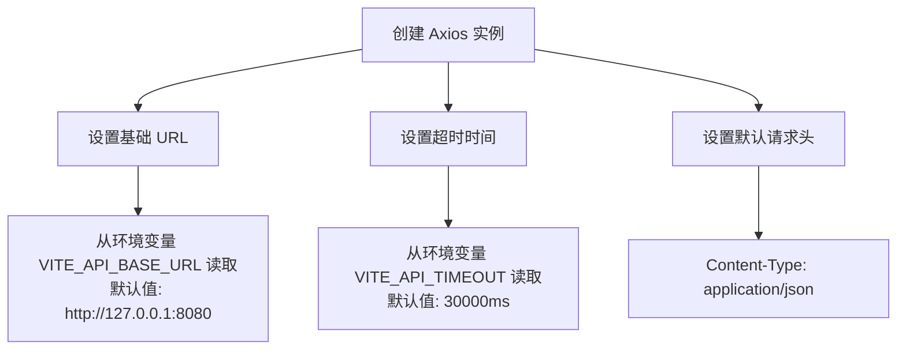
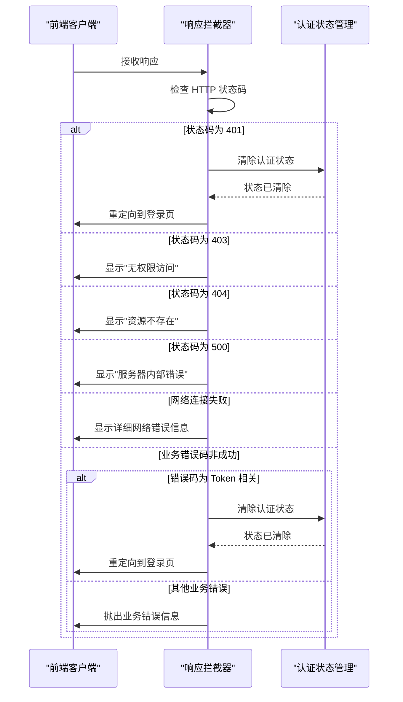
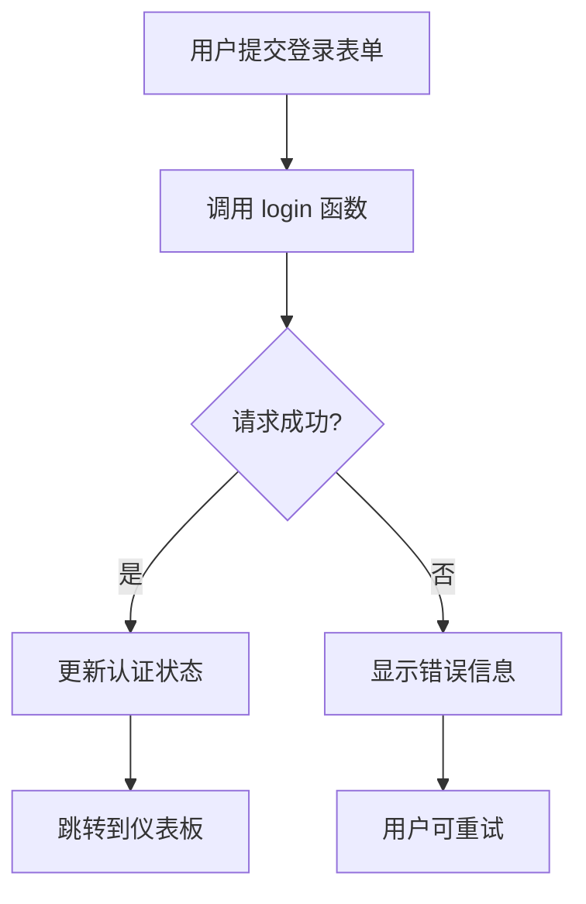
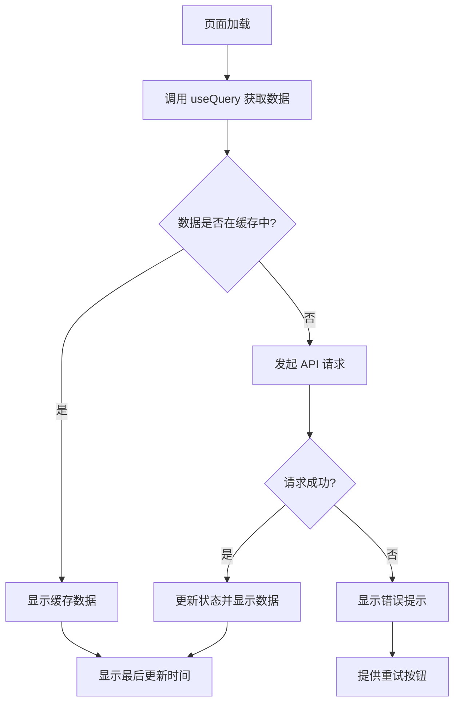
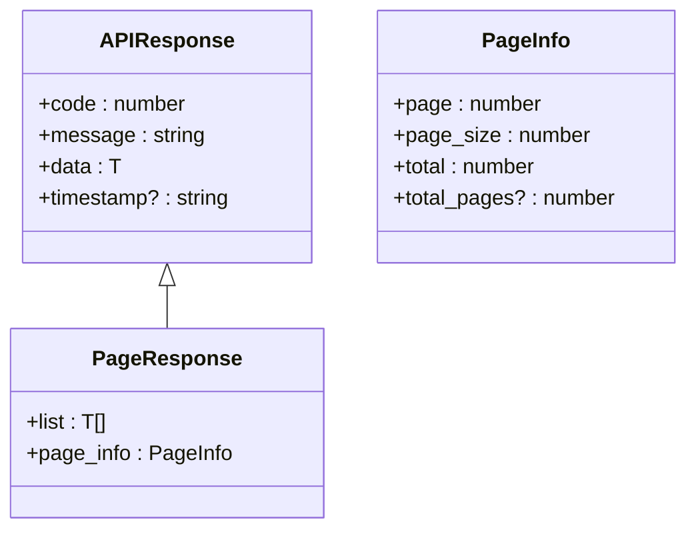
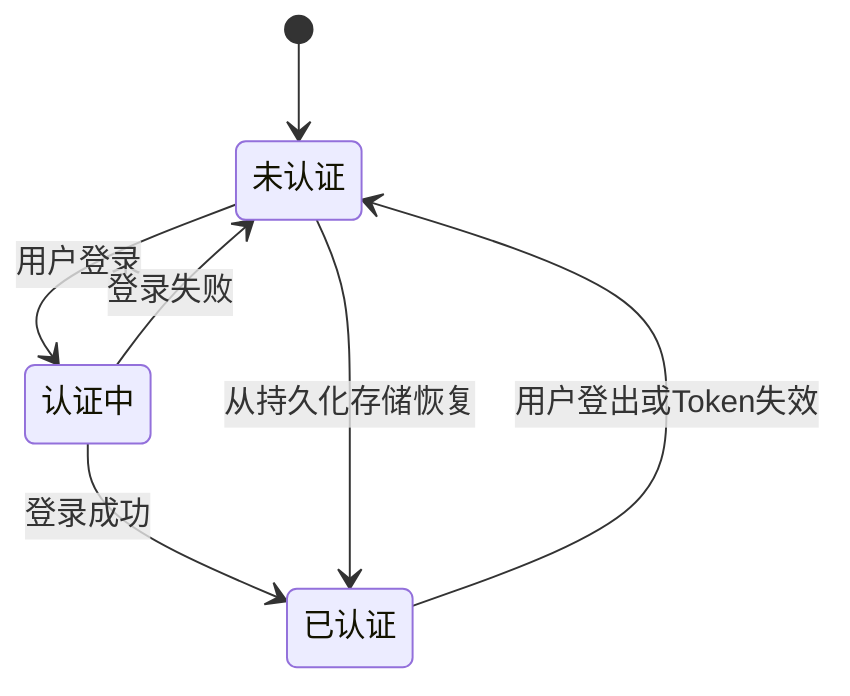

# API 集成

<cite>
**本文档中引用的文件**   
- [client.ts](file://web/src/api/client.ts)
- [interceptors.ts](file://web/src/api/interceptors.ts)
- [auth.ts](file://web/src/api/auth.ts)
- [nodes.ts](file://web/src/api/nodes.ts)
- [metrics.ts](file://web/src/api/metrics.ts)
- [agents.ts](file://web/src/api/agents.ts)
- [api.ts](file://web/src/types/api.ts)
- [authStore.ts](file://web/src/stores/authStore.ts)
- [useAuth.ts](file://web/src/hooks/useAuth.ts)
- [useMetrics.ts](file://web/src/hooks/useMetrics.ts)
- [useNodes.ts](file://web/src/hooks/useNodes.ts)
- [Login/index.tsx](file://web/src/pages/Login/index.tsx)
- [Dashboard/index.tsx](file://web/src/pages/Dashboard/index.tsx)
- [ProtectedRoute.tsx](file://web/src/router/ProtectedRoute.tsx)
- [package.json](file://web/package.json)
</cite>

## 目录
1. [简介](#简介)
2. [Axios 实例配置](#axios-实例配置)
3. [请求/响应拦截器](#请求响应拦截器)
4. [API 服务模块职责](#api-服务模块职责)
5. [API 调用示例](#api-调用示例)
6. [类型定义与 TypeScript 集成](#类型定义与-typescript-集成)
7. [错误处理与状态管理](#错误处理与状态管理)
8. [最佳实践](#最佳实践)

## 简介
本文档全面介绍了前端与 Manager 后端服务的通信机制。系统阐述了 Axios 客户端的配置、拦截器的实现、各 API 模块的职责划分，以及在 React 组件中安全发起 API 请求的最佳实践。通过统一的 API 响应格式和 TypeScript 类型定义，确保了前后端数据契约的一致性，为开发人员提供了清晰的集成指南。

## Axios 实例配置
前端使用 Axios 库与 Manager 后端服务进行 HTTP 通信。通过创建一个全局的 Axios 实例，统一配置了基础 URL、超时时间和默认请求头，确保所有 API 请求遵循一致的规范。

**Diagram sources**
- [client.ts](file://web/src/api/client.ts#L9-L15)

**Section sources**
- [client.ts](file://web/src/api/client.ts#L1-L18)

## 请求/响应拦截器
系统实现了请求和响应拦截器，用于统一处理 JWT 认证令牌的注入、401 未授权状态的自动跳转，以及 API 错误的标准化处理。

### 请求拦截器
在每个请求发送前，请求拦截器会从 Zustand 状态管理库中获取当前用户的 JWT 令牌，并将其添加到请求头的 `Authorization` 字段中。

### 响应拦截器
响应拦截器负责处理服务器返回的响应，根据 HTTP 状态码和业务错误码进行统一的错误处理和用户引导。

**Diagram sources**
- [interceptors.ts](file://web/src/api/interceptors.ts#L14-L92)

**Section sources**
- [interceptors.ts](file://web/src/api/interceptors.ts#L1-L95)
- [authStore.ts](file://web/src/stores/authStore.ts#L23-L84)

## API 服务模块职责
API 服务被组织在 `web/src/api` 目录下，按功能模块划分，每个模块负责特定的业务领域。

### auth.ts - 认证接口
负责用户认证相关的所有 API 操作，包括登录、注册、获取用户资料和修改密码。

**Section sources**
- [auth.ts](file://web/src/api/auth.ts#L1-L43)

### nodes.ts - 节点资源管理
提供对节点资源的 CRUD 操作，包括获取节点列表、节点详情、删除节点和获取节点统计信息。

**Section sources**
- [nodes.ts](file://web/src/api/nodes.ts#L1-L47)

### metrics.ts - 监控数据获取
负责获取系统监控指标数据，包括节点最新指标、历史指标数据、指标统计摘要和集群资源概览。

**Section sources**
- [metrics.ts](file://web/src/api/metrics.ts#L1-L58)

### agents.ts - Agent 功能操作
提供对 Agent 的管理操作，包括获取 Agent 列表、执行 Agent 操作（启动/停止/重启）和获取 Agent 日志。

**Section sources**
- [agents.ts](file://web/src/api/agents.ts#L1-L57)

## API 调用示例
以下示例展示了如何在 React 组件中安全地发起 API 请求并处理异步状态（加载、成功、错误）。

### 登录页面示例
登录页面使用 `useAuth` Hook 来处理用户登录逻辑，展示了如何处理表单提交、加载状态和错误信息。

**Section sources**
- [Login/index.tsx](file://web/src/pages/Login/index.tsx#L1-L110)
- [useAuth.ts](file://web/src/hooks/useAuth.ts#L1-L73)

### 仪表板页面示例
仪表板页面使用 `useClusterOverview` Hook 获取集群概览数据，展示了如何处理数据加载、错误和最后更新时间。

**Section sources**
- [Dashboard/index.tsx](file://web/src/pages/Dashboard/index.tsx#L1-L193)
- [useMetrics.ts](file://web/src/hooks/useMetrics.ts#L85-L103)

## 类型定义与 TypeScript 集成
系统通过 TypeScript 类型定义确保前后端数据契约的一致性，提供了强类型的安全保障。

### 统一响应格式
所有 API 响应都遵循统一的格式，包含 `code`、`message`、`data` 和可选的 `timestamp` 字段。

**Diagram sources**
- [api.ts](file://web/src/types/api.ts#L6-L25)

### 错误码枚举
定义了详细的错误码枚举，便于前端根据不同的错误码进行相应的处理。

**Section sources**
- [api.ts](file://web/src/types/api.ts#L28-L54)

## 错误处理与状态管理
系统实现了全面的错误处理机制和状态管理策略，确保用户体验的流畅性和系统的健壮性。

### 认证状态管理
使用 Zustand 库管理认证状态，包括用户信息、JWT 令牌和认证状态，并通过持久化中间件将状态保存在 localStorage 中。

**Section sources**
- [authStore.ts](file://web/src/stores/authStore.ts#L1-L85)
- [ProtectedRoute.tsx](file://web/src/router/ProtectedRoute.tsx#L1-L38)

### 路由保护
通过 `ProtectedRoute` 组件实现路由保护，确保只有已认证的用户才能访问受保护的页面。

## 最佳实践
1. **使用 Hook 封装 API 调用**：通过 `useQuery` 和 `useMutation` 封装 API 调用，自动处理加载、错误和数据缓存。
2. **统一错误处理**：在拦截器中统一处理错误，避免在每个组件中重复编写错误处理逻辑。
3. **类型安全**：为所有 API 请求和响应定义 TypeScript 类型，确保数据类型的一致性。
4. **状态持久化**：将认证状态持久化到 localStorage，提升用户体验。
5. **自动刷新**：为监控数据设置合理的自动刷新间隔，确保数据的实时性。