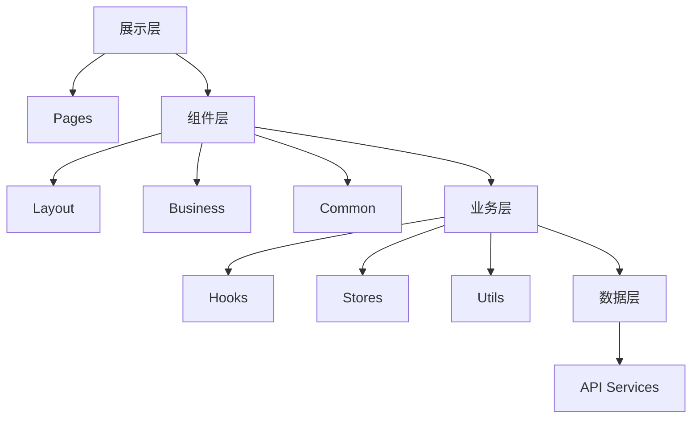
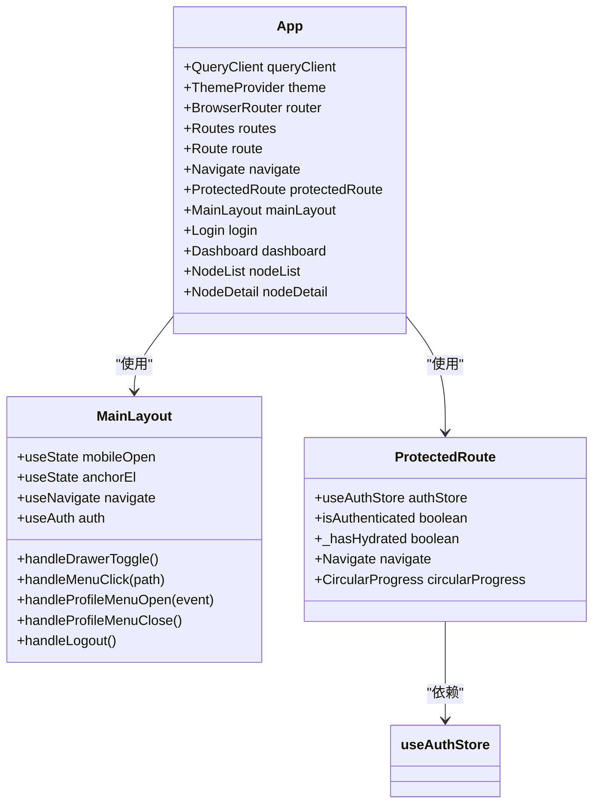
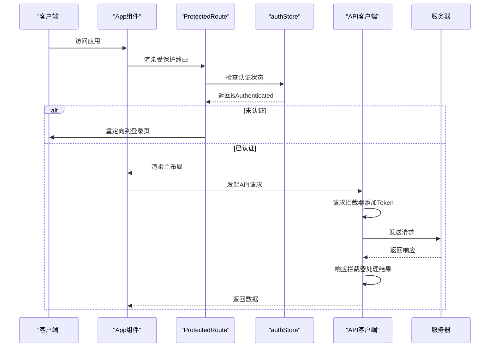
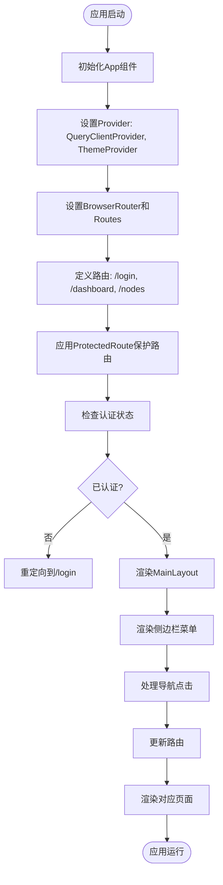
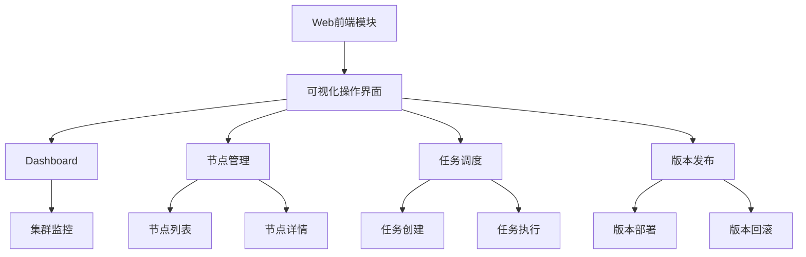

# Web 前端模块架构

<cite>
**本文档引用的文件**
- [App.tsx](file://web/src/App.tsx)
- [main.tsx](file://web/src/main.tsx)
- [package.json](file://web/package.json)
- [vite.config.ts](file://web/vite.config.ts)
- [ProtectedRoute.tsx](file://web/src/router/ProtectedRoute.tsx)
- [authStore.ts](file://web/src/stores/authStore.ts)
- [metricsStore.ts](file://web/src/stores/metricsStore.ts)
- [MainLayout.tsx](file://web/src/components/Layout/MainLayout.tsx)
- [index.tsx](file://web/src/pages/Dashboard/index.tsx)
- [useAuth.ts](file://web/src/hooks/useAuth.ts)
- [client.ts](file://web/src/api/client.ts)
- [interceptors.ts](file://web/src/api/interceptors.ts)
- [index.ts](file://web/src/types/index.ts)
- [theme/index.ts](file://web/src/theme/index.ts)
- [storage.ts](file://web/src/utils/storage.ts)
</cite>

## 目录

1. [简介](#简介)
2. [项目结构](#项目结构)
3. [核心组件](#核心组件)
4. [架构概览](#架构概览)
5. [详细组件分析](#详细组件分析)
6. [依赖分析](#依赖分析)
7. [性能考虑](#性能考虑)
8. [故障排除指南](#故障排除指南)
9. [结论](#结论)

## 简介
Web前端模块是运维工具框架的可视化操作界面，提供Dashboard、节点管理、任务调度和版本发布等功能。该模块采用现代化的React技术栈，实现了组件化、分层化的开发模式，为用户提供直观、高效的运维管理体验。

## 项目结构
Web前端模块采用清晰的分层架构，包括展示层、组件层、业务层和数据层。项目结构体现了功能模块化和职责分离的设计原则。

```mermaid
graph TD
A[Web前端模块] --> B[api]
A --> C[components]
A --> D[hooks]
A --> E[pages]
A --> F[router]
A --> G[stores]
A --> H[theme]
A --> I[types]
A --> J[utils]
B --> K[agents.ts]
B --> L[auth.ts]
B --> M[client.ts]
B --> N[interceptors.ts]
B --> O[metrics.ts]
B --> P[nodes.ts]
C --> Q[Dashboard]
C --> R[Layout]
C --> S[Metrics]
Q --> T[AlertsPanel.tsx]
Q --> U[TopNodesCard.tsx]
R --> V[MainLayout.tsx]
S --> W[CPUCard.tsx]
S --> X[DiskCard.tsx]
S --> Y[MemoryCard.tsx]
S --> Z[MetricCard.tsx]
D --> AA[index.ts]
D --> AB[useAgentMetrics.ts]
D --> AC[useAuth.ts]
D --> AD[useMetrics.ts]
D --> AE[useNodes.ts]
E --> AF[Dashboard]
E --> AG[Login]
E --> AH[Nodes]
AF --> AI[index.tsx]
AG --> AJ[index.tsx]
AH --> AK[Detail.tsx]
AH --> AL[List.tsx]
F --> AM[ProtectedRoute.tsx]
G --> AN[authStore.ts]
G --> AO[index.ts]
G --> AP[metricsStore.ts]
H --> AQ[index.ts]
I --> AR[agent.ts]
I --> AS[api.ts]
I --> AT[index.ts]
I --> AU[metrics.ts]
I --> AV[node.ts]
I --> AW[user.ts]
J --> AX[alertRules.ts]
J --> AY[format.ts]
J --> AZ[index.ts]
J --> BA[metricsFormat.ts]
J --> BB[metricsUtils.ts]
J --> BC[storage.ts]
```



**图表来源**
- [App.tsx](file://web/src/App.tsx)

**章节来源**
- [App.tsx](file://web/src/App.tsx)
- [package.json](file://web/package.json)

## 核心组件
Web前端模块的核心组件包括应用入口、路由配置、状态管理、API客户端和UI组件。这些组件共同构成了前端应用的基础架构。

**章节来源**
- [App.tsx](file://web/src/App.tsx)
- [main.tsx](file://web/src/main.tsx)
- [vite.config.ts](file://web/vite.config.ts)

## 架构概览
Web前端模块采用分层架构设计，包括展示层、组件层、业务层和数据层。这种架构设计实现了关注点分离，提高了代码的可维护性和可扩展性。



**图表来源**
- [App.tsx](file://web/src/App.tsx)
- [MainLayout.tsx](file://web/src/components/Layout/MainLayout.tsx)

## 详细组件分析
### 组件A分析
#### 对于面向对象组件：


**图表来源**
- [App.tsx](file://web/src/App.tsx)
- [MainLayout.tsx](file://web/src/components/Layout/MainLayout.tsx)
- [ProtectedRoute.tsx](file://web/src/router/ProtectedRoute.tsx)

#### 对于API/服务组件：


**图表来源**
- [App.tsx](file://web/src/App.tsx)
- [ProtectedRoute.tsx](file://web/src/router/ProtectedRoute.tsx)
- [authStore.ts](file://web/src/stores/authStore.ts)
- [interceptors.ts](file://web/src/api/interceptors.ts)

#### 对于复杂逻辑组件：


**图表来源**
- [App.tsx](file://web/src/App.tsx)
- [MainLayout.tsx](file://web/src/components/Layout/MainLayout.tsx)
- [ProtectedRoute.tsx](file://web/src/router/ProtectedRoute.tsx)

**章节来源**
- [App.tsx](file://web/src/App.tsx)
- [main.tsx](file://web/src/main.tsx)
- [ProtectedRoute.tsx](file://web/src/router/ProtectedRoute.tsx)

### 概念概述
Web前端模块作为运维工具框架的可视化操作界面，承担着重要的用户交互职责。它通过分层架构设计，实现了关注点分离和组件化开发。



## 依赖分析
Web前端模块依赖于多个外部库和内部组件，这些依赖关系构成了模块的功能基础。

```mermaid
graph TD
A[Web前端模块] --> B[React]
A --> C[React Router]
A --> D[Zustand]
A --> E[React Query]
A --> F[Material-UI]
A --> G[Axios]
A --> H[Vite]
B --> I[React DOM]
C --> J[React Router DOM]
F --> K[@mui/material]
F --> L[@mui/icons-material]
G --> M[Axios Interceptors]
H --> N[Vite Plugins]
```

**图表来源**
- [package.json](file://web/package.json)
- [vite.config.ts](file://web/vite.config.ts)

**章节来源**
- [package.json](file://web/package.json)
- [vite.config.ts](file://web/vite.config.ts)

## 性能考虑
Web前端模块在性能方面进行了多项优化，包括代码分割、缓存策略和资源加载优化。Vite的使用提供了快速的开发服务器和高效的生产构建。

## 故障排除指南
当遇到前端模块问题时，可以检查API代理配置、认证状态和网络连接。常见的错误包括无法连接到Manager服务和认证失败。

**章节来源**
- [interceptors.ts](file://web/src/api/interceptors.ts)
- [authStore.ts](file://web/src/stores/authStore.ts)

## 结论
Web前端模块采用现代化的技术栈和分层架构设计，为运维工具框架提供了强大而灵活的可视化操作界面。通过合理的技术选型和架构设计，实现了高性能、易维护的前端应用。