# 功能设计

<cite>
**本文档引用的文件**
- [App.tsx](file://web/src/App.tsx)
- [ProtectedRoute.tsx](file://web/src/router/ProtectedRoute.tsx)
- [authStore.ts](file://web/src/stores/authStore.ts)
- [Login/index.tsx](file://web/src/pages/Login/index.tsx)
- [useAuth.ts](file://web/src/hooks/useAuth.ts)
- [Dashboard/index.tsx](file://web/src/pages/Dashboard/index.tsx)
- [List.tsx](file://web/src/pages/Nodes/List.tsx)
- [Detail.tsx](file://web/src/pages/Nodes/Detail.tsx)
- [useNodes.ts](file://web/src/hooks/useNodes.ts)
- [useMetrics.ts](file://web/src/hooks/useMetrics.ts)
- [nodes.ts](file://web/src/api/nodes.ts)
- [auth.ts](file://web/src/api/auth.ts)
- [index.ts](file://web/src/types/index.ts)
</cite>

## 目录
1. [简介](#简介)
2. [项目结构](#项目结构)
3. [核心组件](#核心组件)
4. [架构概述](#架构概述)
5. [详细组件分析](#详细组件分析)
6. [依赖分析](#依赖分析)
7. [性能考虑](#性能考虑)
8. [故障排除指南](#故障排除指南)
9. [结论](#结论)

## 简介
本功能设计文档详细说明了运维平台Web前端模块的实现方案。文档涵盖了用户认证流程、Dashboard仪表盘、节点管理、任务调度和版本管理等核心功能。通过分析各页面组件的职责划分和功能之间的数据流转关系，帮助开发者理解用户操作背后的技术实现。

## 项目结构
Web前端模块采用React框架构建，使用TypeScript进行类型定义，MUI作为UI组件库。项目结构清晰，按功能模块组织代码。

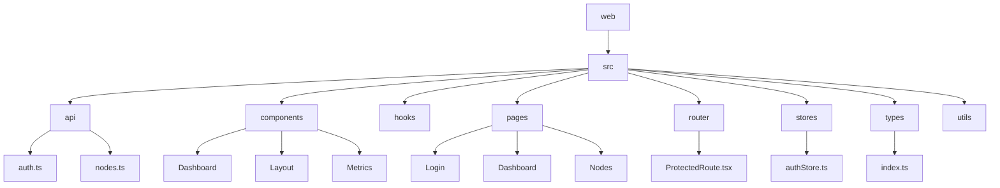

**图源**
- [App.tsx](file://web/src/App.tsx)

## 核心组件
前端应用的核心组件包括路由管理、状态管理、API客户端和UI组件。这些组件协同工作，提供完整的用户界面和交互体验。

**节源**
- [App.tsx](file://web/src/App.tsx)
- [main.tsx](file://web/src/main.tsx)

## 架构概述
系统采用现代化的前端架构，基于React 18和TypeScript构建。使用Zustand进行状态管理，React Query进行数据获取和缓存，Axios进行HTTP请求。

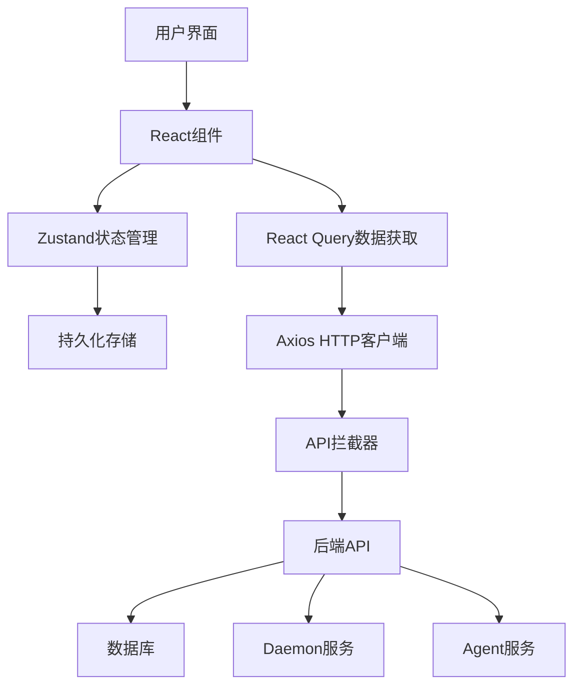

**图源**
- [App.tsx](file://web/src/App.tsx)
- [authStore.ts](file://web/src/stores/authStore.ts)

## 详细组件分析
### 认证流程分析
用户认证流程包括登录、登出和自动续期功能，确保系统的安全访问。

#### 认证状态管理
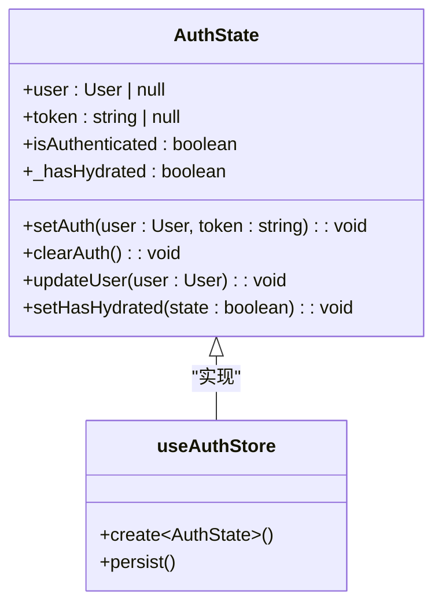

**图源**
- [authStore.ts](file://web/src/stores/authStore.ts)

#### 登录流程时序图
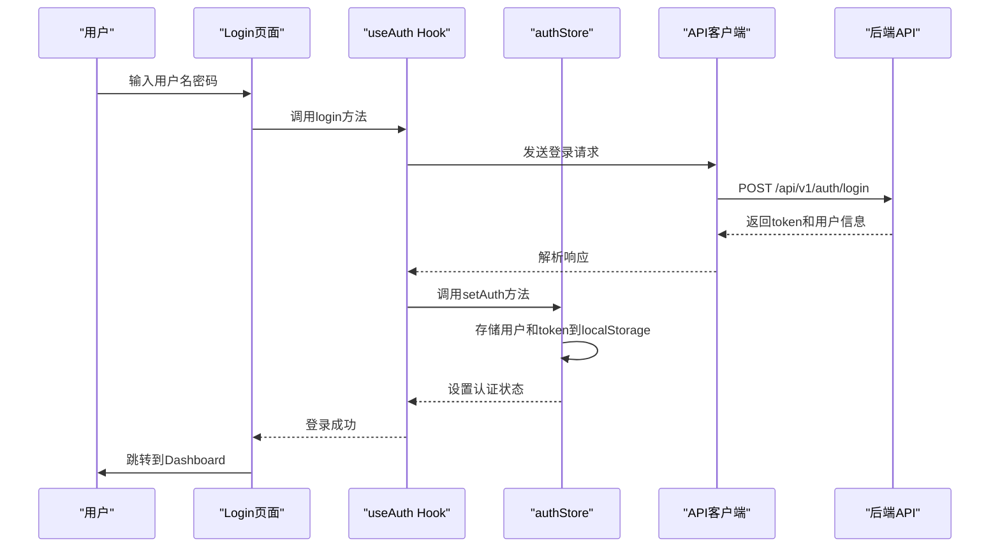

**图源**
- [Login/index.tsx](file://web/src/pages/Login/index.tsx)
- [useAuth.ts](file://web/src/hooks/useAuth.ts)
- [authStore.ts](file://web/src/stores/authStore.ts)

#### 认证状态转换图
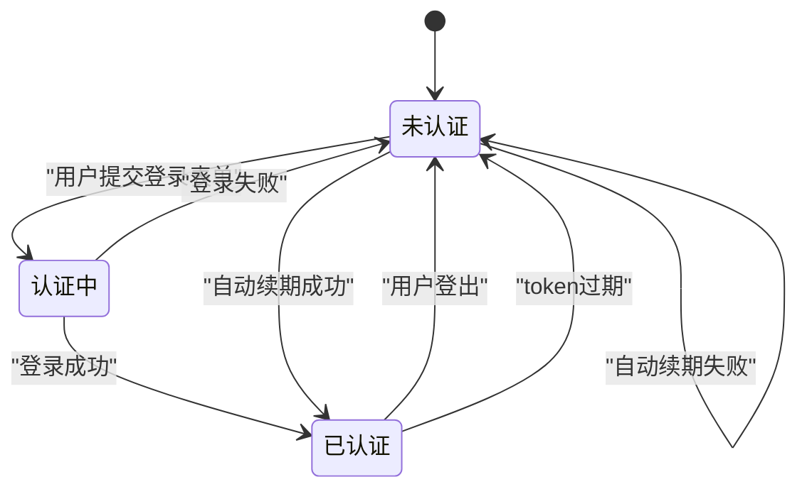

**图源**
- [ProtectedRoute.tsx](file://web/src/router/ProtectedRoute.tsx)
- [authStore.ts](file://web/src/stores/authStore.ts)

### Dashboard仪表盘分析
Dashboard页面提供集群监控的聚合展示，包括统计卡片、节点状态图和资源趋势图。

#### Dashboard组件结构
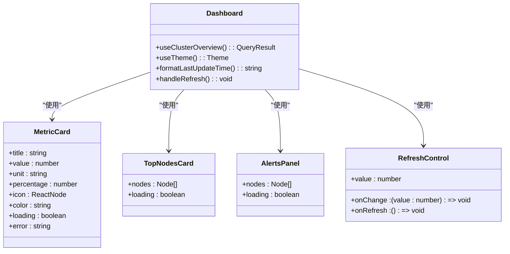

**图源**
- [Dashboard/index.tsx](file://web/src/pages/Dashboard/index.tsx)
- [components/Metrics/MetricCard.tsx](file://web/src/components/Metrics/MetricCard.tsx)

#### Dashboard数据流图
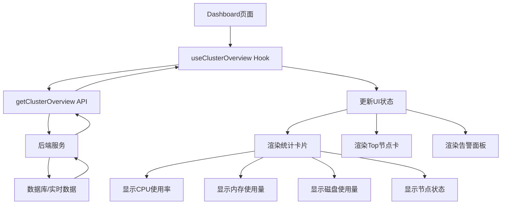

**图源**
- [Dashboard/index.tsx](file://web/src/pages/Dashboard/index.tsx)
- [useMetrics.ts](file://web/src/hooks/useMetrics.ts)

### 节点管理分析
节点管理功能包括节点列表、详情查看和筛选功能，提供对集群节点的全面管理。

#### 节点列表组件
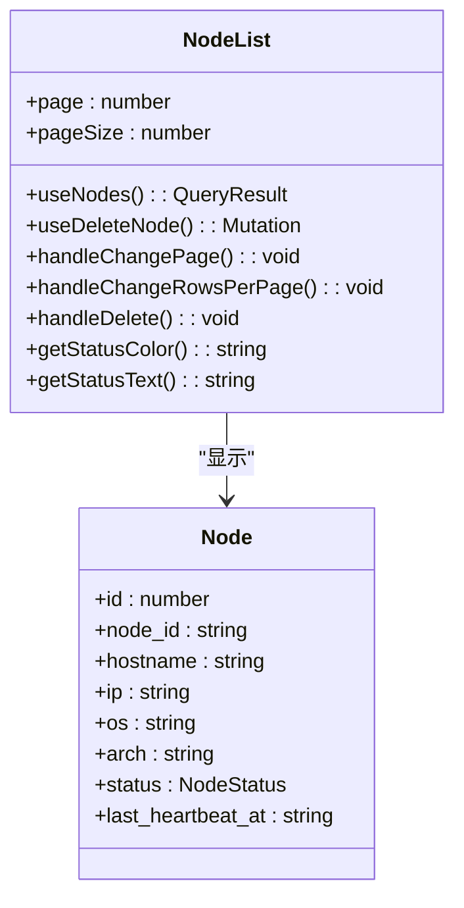

**图源**
- [List.tsx](file://web/src/pages/Nodes/List.tsx)
- [useNodes.ts](file://web/src/hooks/useNodes.ts)

#### 节点详情页面
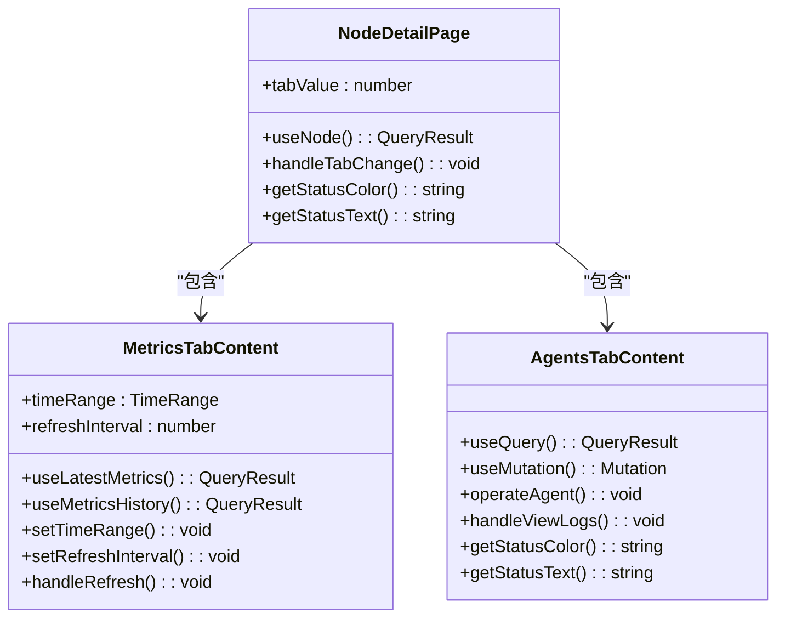

**图源**
- [Detail.tsx](file://web/src/pages/Nodes/Detail.tsx)
- [useNodes.ts](file://web/src/hooks/useNodes.ts)

#### 节点管理数据流
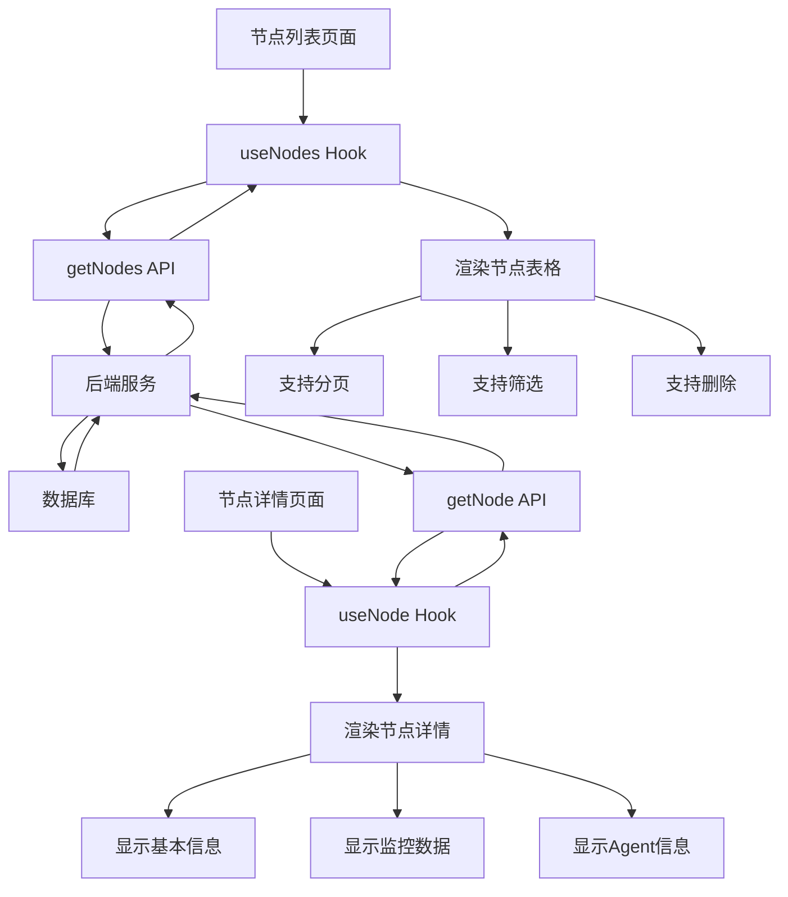

**图源**
- [List.tsx](file://web/src/pages/Nodes/List.tsx)
- [Detail.tsx](file://web/src/pages/Nodes/Detail.tsx)
- [nodes.ts](file://web/src/api/nodes.ts)

## 依赖分析
前端模块依赖于多个内部和外部库，这些依赖关系确保了应用的正常运行。

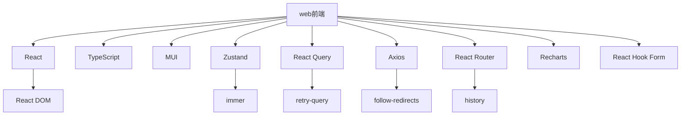

**图源**
- [package.json](file://web/package.json)

## 性能考虑
系统在性能方面进行了多项优化，确保用户体验流畅。

1. **数据缓存**: 使用React Query的缓存机制，减少重复API调用
2. **懒加载**: 对图表组件使用React.lazy进行懒加载
3. **防抖处理**: 在搜索和筛选功能中实现防抖
4. **分页加载**: 节点列表采用分页方式加载数据
5. **状态管理**: 使用Zustand进行高效的状态管理
6. **自动刷新**: 可配置的自动刷新间隔，平衡实时性和性能

## 故障排除指南
### 常见问题及解决方案
1. **登录失败**
   - 检查用户名和密码是否正确
   - 确认后端服务是否正常运行
   - 检查网络连接是否正常

2. **数据不更新**
   - 检查自动刷新是否启用
   - 确认后端API是否返回最新数据
   - 检查浏览器缓存是否影响

3. **页面加载缓慢**
   - 检查网络连接质量
   - 确认数据量是否过大
   - 检查是否有过多的并发请求

4. **认证状态丢失**
   - 检查localStorage是否被清除
   - 确认token是否过期
   - 检查自动续期功能是否正常

**节源**
- [authStore.ts](file://web/src/stores/authStore.ts)
- [ProtectedRoute.tsx](file://web/src/router/ProtectedRoute.tsx)

## 结论
本功能设计文档详细描述了运维平台Web前端模块的实现方案。系统采用现代化的前端技术栈，提供了完整的用户认证、Dashboard监控、节点管理等功能。通过合理的架构设计和组件划分，确保了系统的可维护性和扩展性。建议在后续开发中继续优化性能，增强用户体验。