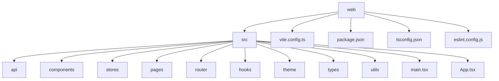
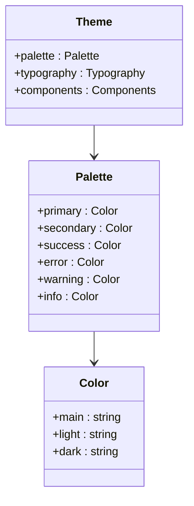
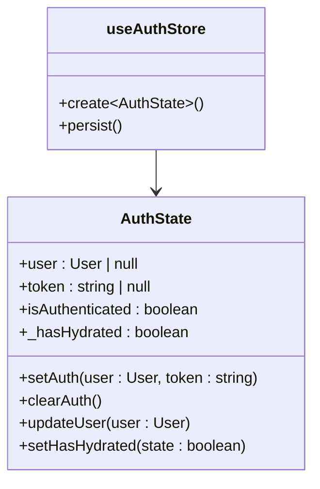
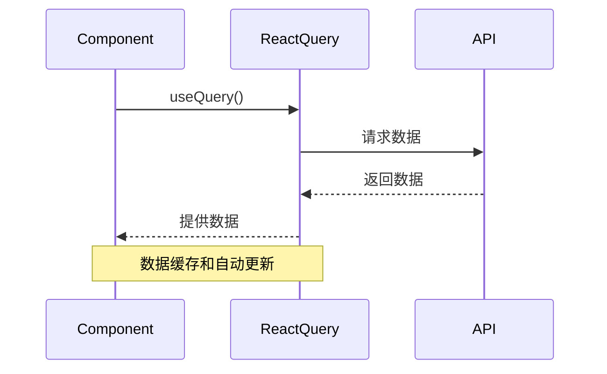
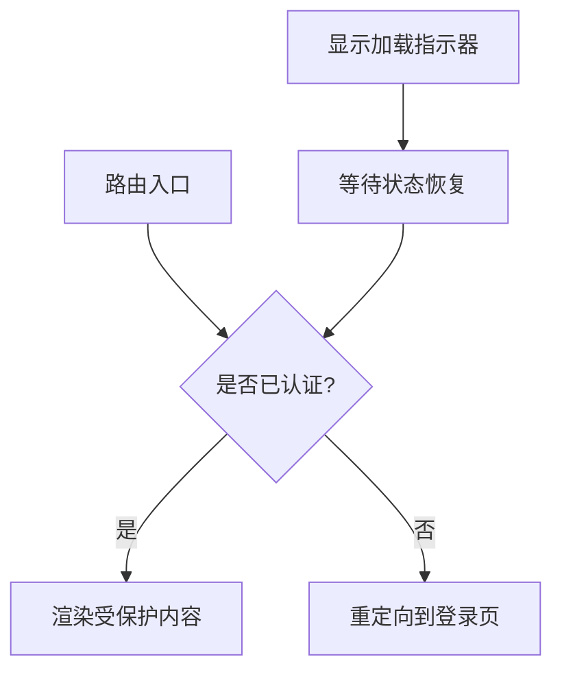
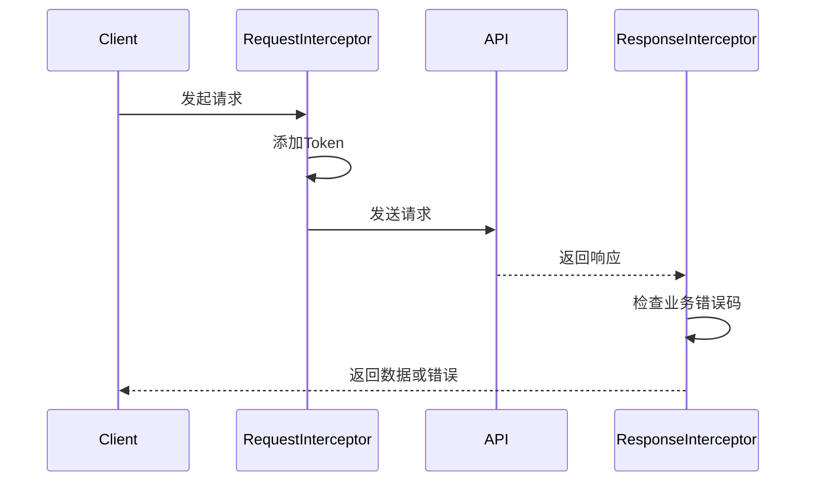
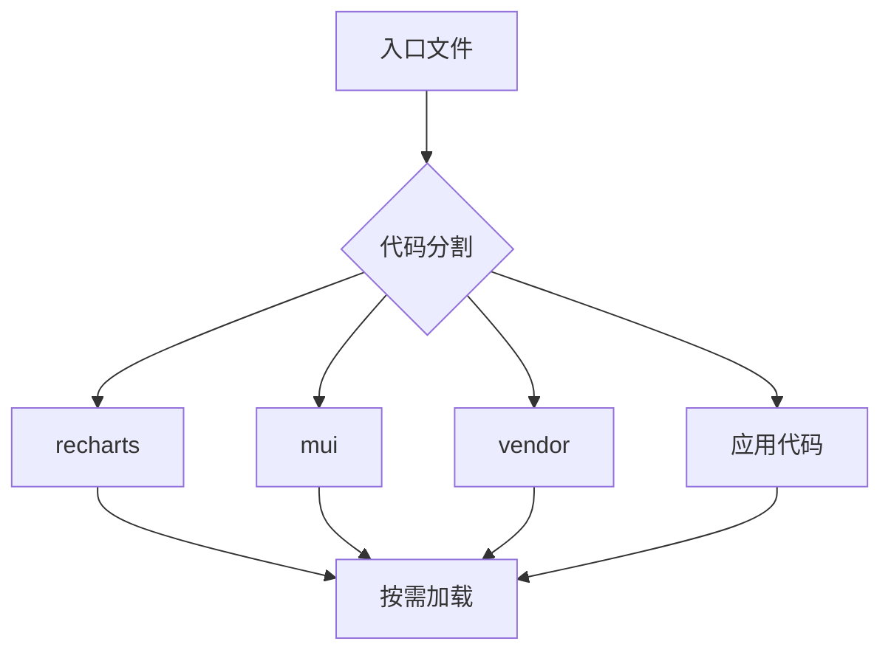
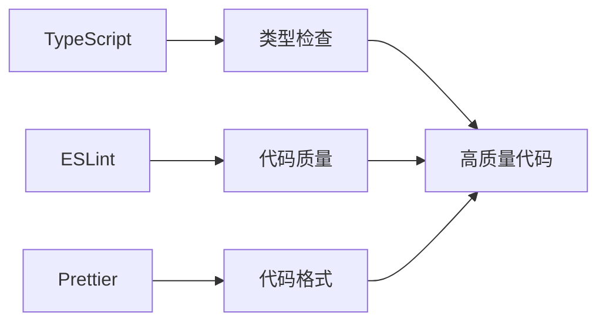
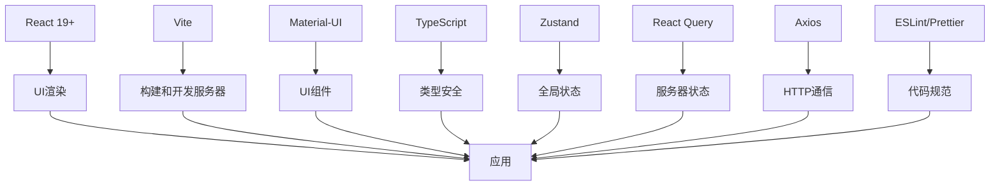

# 技术架构

<cite>
**本文档引用的文件**  
- [package.json](file://web/package.json)
- [vite.config.ts](file://web/vite.config.ts)
- [tsconfig.json](file://web/tsconfig.json)
- [main.tsx](file://web/src/main.tsx)
- [App.tsx](file://web/src/App.tsx)
- [authStore.ts](file://web/src/stores/authStore.ts)
- [client.ts](file://web/src/api/client.ts)
- [interceptors.ts](file://web/src/api/interceptors.ts)
- [ProtectedRoute.tsx](file://web/src/router/ProtectedRoute.tsx)
- [eslint.config.js](file://web/eslint.config.js)
- [theme/index.ts](file://web/src/theme/index.ts)
- [useAuth.ts](file://web/src/hooks/useAuth.ts)
- [Dashboard/index.tsx](file://web/src/pages/Dashboard/index.tsx)
- [storage.ts](file://web/src/utils/storage.ts)
</cite>

## 目录
1. [项目结构](#项目结构)
2. [核心框架选型](#核心框架选型)
3. [状态管理方案](#状态管理方案)
4. [路由管理机制](#路由管理机制)
5. [HTTP通信设计](#http通信设计)
6. [构建工具与性能优化](#构建工具与性能优化)
7. [类型安全与代码规范](#类型安全与代码规范)
8. [技术栈协同工作原理](#技术栈协同工作原理)

## 项目结构

前端项目采用模块化分层设计，主要目录结构如下：

**Diagram sources**  
- [web](file://web)
- [src](file://web/src)

**Section sources**  
- [web](file://web)

## 核心框架选型

本项目采用React 19+作为核心UI框架，结合Vite构建工具和Material-UI组件库，构建现代化的前端工程体系。

### React 19+作为核心框架

React 19+提供了更强大的并发渲染能力、自动批处理优化和新的useAction Hook，显著提升了应用性能和开发体验。项目通过`@vitejs/plugin-react`插件集成React，利用其最新的性能优化特性。

### Material-UI作为UI组件库

项目采用Material-UI（@mui/material）作为UI组件库，提供了一致的设计语言和丰富的可复用组件。通过自定义主题配置，实现了符合运维工具风格的视觉设计。

**Diagram sources**  
- [theme/index.ts](file://web/src/theme/index.ts)

**Section sources**  
- [package.json](file://web/package.json)
- [theme/index.ts](file://web/src/theme/index.ts)

## 状态管理方案

项目采用Zustand与React Query相结合的状态管理方案，实现全局状态和服务器状态的有效分离。

### Zustand全局状态管理

Zustand用于管理应用的全局状态，如用户认证信息。通过`persist`中间件实现状态的持久化存储，确保页面刷新后状态不丢失。

**Diagram sources**  
- [authStore.ts](file://web/src/stores/authStore.ts)

**Section sources**  
- [authStore.ts](file://web/src/stores/authStore.ts)
- [storage.ts](file://web/src/utils/storage.ts)

### React Query服务器状态管理

React Query用于管理与服务器同步的状态，如API数据获取、缓存和更新。通过`QueryClient`配置，实现了合理的缓存策略和重试机制。

**Diagram sources**  
- [App.tsx](file://web/src/App.tsx)
- [useAuth.ts](file://web/src/hooks/useAuth.ts)

**Section sources**  
- [App.tsx](file://web/src/App.tsx)
- [useAuth.ts](file://web/src/hooks/useAuth.ts)

## 路由管理机制

项目使用React Router 7+进行路由管理，通过嵌套路由和路由保护机制，实现安全的页面导航。

### 路由配置

在`App.tsx`中配置了主要路由，包括登录页、仪表盘和节点管理页面，采用嵌套路由结构。

### 路由保护

通过`ProtectedRoute`组件实现路由保护，确保未认证用户无法访问受保护的页面。

**Diagram sources**  
- [App.tsx](file://web/src/App.tsx)
- [ProtectedRoute.tsx](file://web/src/router/ProtectedRoute.tsx)

**Section sources**  
- [App.tsx](file://web/src/App.tsx)
- [ProtectedRoute.tsx](file://web/src/router/ProtectedRoute.tsx)

## HTTP通信设计

项目使用Axios进行HTTP通信，通过拦截器机制实现统一的请求处理和错误管理。

### Axios客户端配置

创建了全局的Axios实例，配置了基础URL、超时时间和默认请求头。

### 拦截器机制

通过请求和响应拦截器，实现了自动添加认证令牌、错误处理和重定向等功能。

**Diagram sources**  
- [client.ts](file://web/src/api/client.ts)
- [interceptors.ts](file://web/src/api/interceptors.ts)

**Section sources**  
- [client.ts](file://web/src/api/client.ts)
- [interceptors.ts](file://web/src/api/interceptors.ts)

## 构建工具与性能优化

项目采用Vite作为构建工具，充分发挥其开发服务器性能优势和构建优化能力。

### Vite开发服务器

Vite配置了开发服务器端口和代理，将API请求代理到后端服务，解决了开发环境的跨域问题。

### 构建优化策略

通过Rollup配置实现了代码分割，将不同依赖库分割到独立的chunk中，优化加载性能。

**Diagram sources**  
- [vite.config.ts](file://web/vite.config.ts)

**Section sources**  
- [vite.config.ts](file://web/vite.config.ts)
- [package.json](file://web/package.json)

## 类型安全与代码规范

项目采用TypeScript和ESLint/Prettier组合，确保代码质量和类型安全。

### TypeScript应用

通过TypeScript实现全面的类型检查，定义了统一的类型系统，提高了代码的可维护性和开发效率。

### 代码规范集成

配置了ESLint和Prettier，实现了代码风格的统一和质量检查。

**Diagram sources**  
- [tsconfig.json](file://web/tsconfig.json)
- [eslint.config.js](file://web/eslint.config.js)

**Section sources**  
- [tsconfig.json](file://web/tsconfig.json)
- [eslint.config.js](file://web/eslint.config.js)

## 技术栈协同工作原理

各技术栈组件协同工作，形成完整的前端工程化体系。

**Diagram sources**  
- [package.json](file://web/package.json)
- [main.tsx](file://web/src/main.tsx)
- [App.tsx](file://web/src/App.tsx)

**Section sources**  
- [package.json](file://web/package.json)
- [main.tsx](file://web/src/main.tsx)
- [App.tsx](file://web/src/App.tsx)