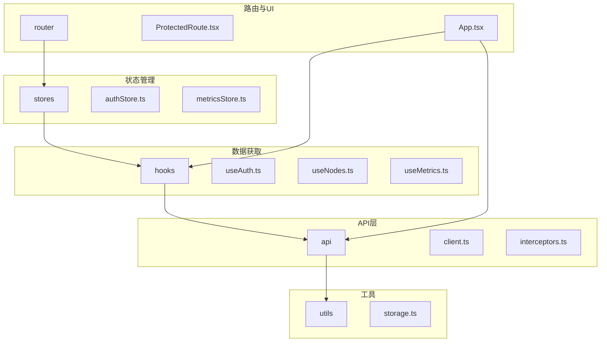
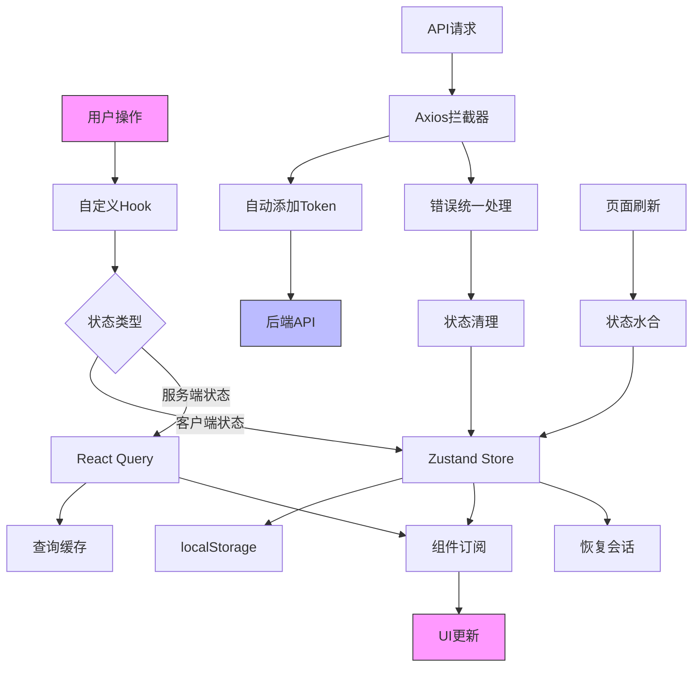
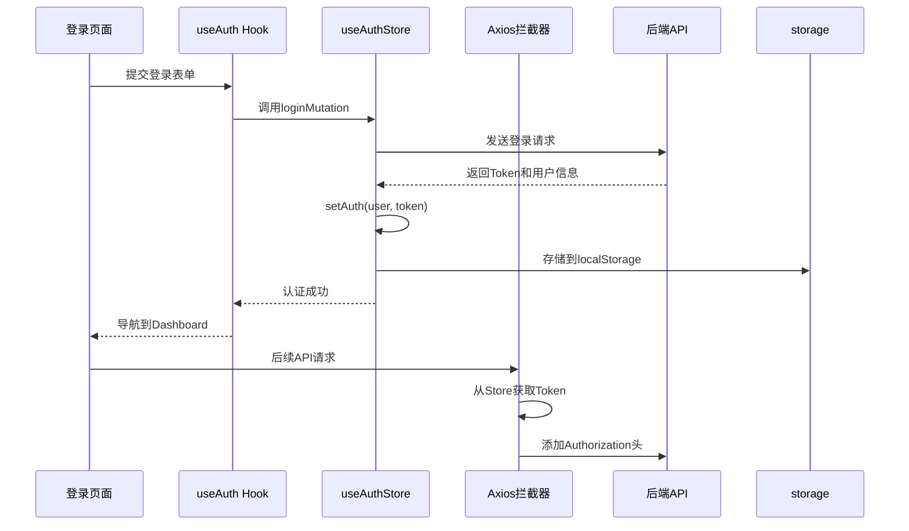
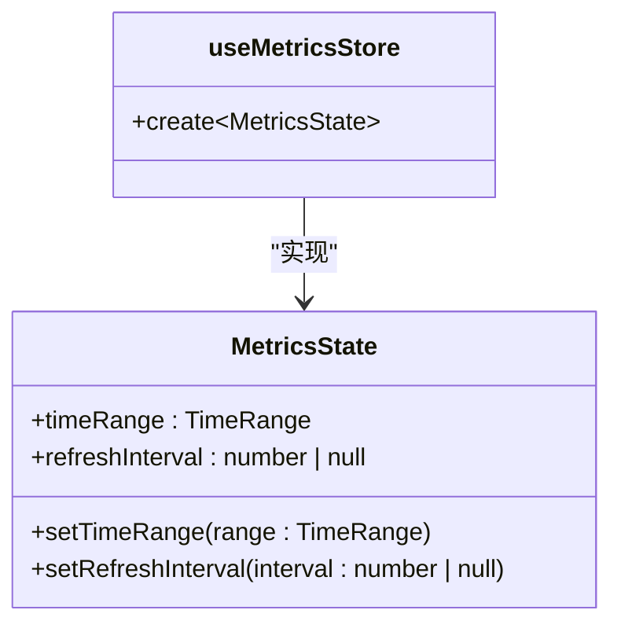
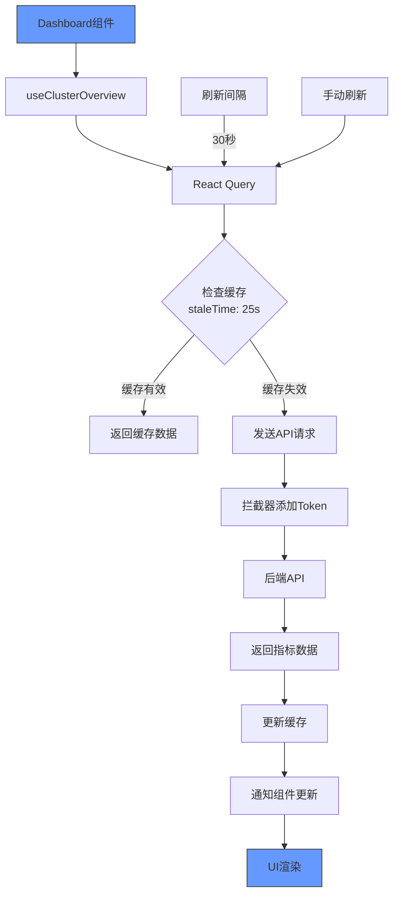
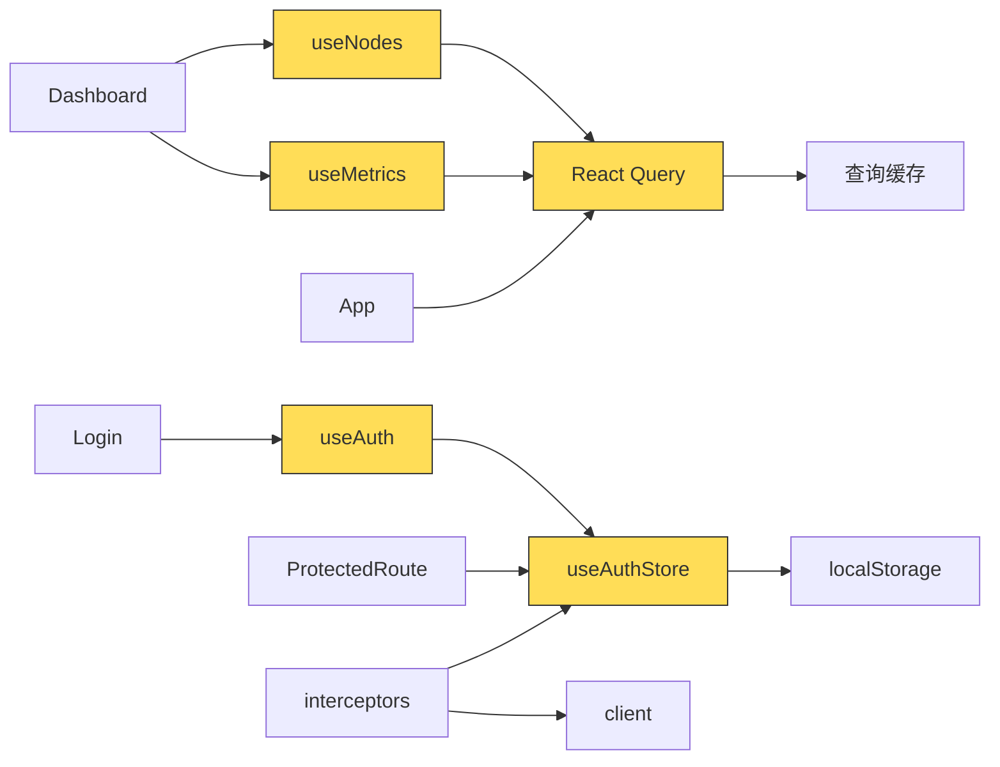

# 状态管理

<cite>
**本文档中引用的文件**  
- [authStore.ts](file://web/src/stores/authStore.ts)
- [metricsStore.ts](file://web/src/stores/metricsStore.ts)
- [useAuth.ts](file://web/src/hooks/useAuth.ts)
- [useNodes.ts](file://web/src/hooks/useNodes.ts)
- [useMetrics.ts](file://web/src/hooks/useMetrics.ts)
- [client.ts](file://web/src/api/client.ts)
- [interceptors.ts](file://web/src/api/interceptors.ts)
- [storage.ts](file://web/src/utils/storage.ts)
- [ProtectedRoute.tsx](file://web/src/router/ProtectedRoute.tsx)
- [App.tsx](file://web/src/App.tsx)
</cite>

## 目录
1. [简介](#简介)
2. [项目结构](#项目结构)
3. [核心组件](#核心组件)
4. [架构概览](#架构概览)
5. [详细组件分析](#详细组件分析)
6. [依赖分析](#依赖分析)
7. [性能考虑](#性能考虑)
8. [故障排除指南](#故障排除指南)
9. [结论](#结论)

## 简介
本专项文档深入解析前端应用的状态管理架构，重点阐述Zustand在认证状态（useAuthStore）和全局配置状态中的应用，以及React Query在服务端状态管理（useNodes, useMetrics）中的角色。文档详细说明了状态持久化机制、自定义Hook设计模式、状态订阅机制、错误处理与数据预取等高级功能的实现方式，并提供完整的状态流图展示从API请求到UI更新的数据流动路径。

## 项目结构



**Diagram sources**  
- [authStore.ts](file://web/src/stores/authStore.ts)
- [useAuth.ts](file://web/src/hooks/useAuth.ts)
- [client.ts](file://web/src/api/client.ts)
- [storage.ts](file://web/src/utils/storage.ts)
- [ProtectedRoute.tsx](file://web/src/router/ProtectedRoute.tsx)
- [App.tsx](file://web/src/App.tsx)

**Section sources**  
- [authStore.ts](file://web/src/stores/authStore.ts)
- [useAuth.ts](file://web/src/hooks/useAuth.ts)
- [client.ts](file://web/src/api/client.ts)
- [storage.ts](file://web/src/utils/storage.ts)
- [ProtectedRoute.tsx](file://web/src/router/ProtectedRoute.tsx)
- [App.tsx](file://web/src/App.tsx)

## 核心组件

前端应用采用Zustand和React Query相结合的状态管理架构。Zustand用于管理客户端状态（如认证信息、UI配置），而React Query负责服务端状态管理（如节点数据、监控指标）。这种分层架构实现了客户端状态与服务端状态的关注点分离，提高了代码的可维护性和性能。

**Section sources**  
- [authStore.ts](file://web/src/stores/authStore.ts)
- [metricsStore.ts](file://web/src/stores/metricsStore.ts)
- [useNodes.ts](file://web/src/hooks/useNodes.ts)
- [useMetrics.ts](file://web/src/hooks/useMetrics.ts)

## 架构概览



**Diagram sources**  
- [authStore.ts](file://web/src/stores/authStore.ts)
- [useAuth.ts](file://web/src/hooks/useAuth.ts)
- [interceptors.ts](file://web/src/api/interceptors.ts)
- [storage.ts](file://web/src/utils/storage.ts)
- [ProtectedRoute.tsx](file://web/src/router/ProtectedRoute.tsx)

## 详细组件分析

### 认证状态管理分析

#### Zustand Store 实现
```mermaid
classDiagram
class AuthState {
+user : User | null
+token : string | null
+isAuthenticated : boolean
+_hasHydrated : boolean
+setAuth(user : User, token : string)
+clearAuth()
+updateUser(user : User)
+setHasHydrated(state : boolean)
}
class useAuthStore {
+create~AuthState~()
+persist()
}
useAuthStore --> AuthState : "实现"
useAuthStore --> "localStorage" : "持久化"
```

**Diagram sources**  
- [authStore.ts](file://web/src/stores/authStore.ts)
- [storage.ts](file://web/src/utils/storage.ts)

#### 认证流程序列图


**Diagram sources**  
- [authStore.ts](file://web/src/stores/authStore.ts)
- [useAuth.ts](file://web/src/hooks/useAuth.ts)
- [interceptors.ts](file://web/src/api/interceptors.ts)
- [Login/index.tsx](file://web/src/pages/Login/index.tsx)

**Section sources**  
- [authStore.ts](file://web/src/stores/authStore.ts)
- [useAuth.ts](file://web/src/hooks/useAuth.ts)
- [interceptors.ts](file://web/src/api/interceptors.ts)
- [Login/index.tsx](file://web/src/pages/Login/index.tsx)

### 全局配置状态分析

#### 指标配置Store


**Diagram sources**  
- [metricsStore.ts](file://web/src/stores/metricsStore.ts)

**Section sources**  
- [metricsStore.ts](file://web/src/stores/metricsStore.ts)

### 服务端状态管理分析

#### 节点数据获取流程
```mermaid
flowchart TD
Start([useNodes Hook]) --> Query["useQuery({\n queryKey: ['nodes', params],\n queryFn: getNodes\n}")]
Query --> CacheCheck{"缓存检查"}
CacheCheck --> |缓存有效| ReturnCache["返回缓存数据"]
CacheCheck --> |缓存失效| APIRequest["调用getNodes API"]
APIRequest --> Response{"响应处理"}
Response --> |成功| UpdateCache["更新查询缓存"]
Response --> |失败| ErrorHandle["错误处理"]
UpdateCache --> EmitData["通知订阅组件"]
ErrorHandle --> EmitError["通知错误状态"]
EmitData --> End([组件渲染])
EmitError --> End
ReturnCache --> End
style Start fill:#f96,stroke:#333
style End fill:#f96,stroke:#333
```

**Diagram sources**  
- [useNodes.ts](file://web/src/hooks/useNodes.ts)

#### 监控指标获取流程


**Diagram sources**  
- [useMetrics.ts](file://web/src/hooks/useMetrics.ts)
- [Dashboard/index.tsx](file://web/src/pages/Dashboard/index.tsx)

**Section sources**  
- [useNodes.ts](file://web/src/hooks/useNodes.ts)
- [useMetrics.ts](file://web/src/hooks/useMetrics.ts)
- [Dashboard/index.tsx](file://web/src/pages/Dashboard/index.tsx)

## 依赖分析



**Diagram sources**  
- [useAuth.ts](file://web/src/hooks/useAuth.ts)
- [authStore.ts](file://web/src/stores/authStore.ts)
- [useNodes.ts](file://web/src/hooks/useNodes.ts)
- [useMetrics.ts](file://web/src/hooks/useMetrics.ts)
- [interceptors.ts](file://web/src/api/interceptors.ts)
- [App.tsx](file://web/src/App.tsx)
- [ProtectedRoute.tsx](file://web/src/router/ProtectedRoute.tsx)

**Section sources**  
- [useAuth.ts](file://web/src/hooks/useAuth.ts)
- [authStore.ts](file://web/src/stores/authStore.ts)
- [useNodes.ts](file://web/src/hooks/useNodes.ts)
- [useMetrics.ts](file://web/src/hooks/useMetrics.ts)
- [interceptors.ts](file://web/src/api/interceptors.ts)
- [App.tsx](file://web/src/App.tsx)
- [ProtectedRoute.tsx](file://web/src/router/ProtectedRoute.tsx)

## 性能考虑

状态管理架构通过多种机制优化性能：
- **缓存策略**：React Query使用staleTime和refetchInterval实现智能缓存，减少不必要的网络请求
- **选择性订阅**：Zustand和React Query都支持组件只订阅关心的状态片段，避免不必要的渲染
- **自动去重**：相同queryKey的请求会被自动去重，防止并发请求
- **后台更新**：支持窗口聚焦时的数据刷新控制，提升用户体验
- **错误重试**：配置了自动重试机制，提高系统健壮性

## 故障排除指南

常见状态管理问题及解决方案：

| 问题现象 | 可能原因 | 解决方案 |
|---------|--------|--------|
| 页面刷新后登录状态丢失 | 状态水合失败 | 检查localStorage键名和序列化逻辑 |
| API请求无Token | 拦截器未正确获取Token | 确认useAuthStore.getState()调用正确 |
| 组件频繁重新渲染 | 状态订阅范围过大 | 使用选择器函数精确订阅所需状态 |
| 数据更新不及时 | 缓存时间设置过长 | 调整staleTime和refetchInterval参数 |
| 登录后无法跳转 | ProtectedRoute检查逻辑 | 确保_isHydrated标志正确设置 |

**Section sources**  
- [authStore.ts](file://web/src/stores/authStore.ts)
- [interceptors.ts](file://web/src/api/interceptors.ts)
- [ProtectedRoute.tsx](file://web/src/router/ProtectedRoute.tsx)
- [useMetrics.ts](file://web/src/hooks/useMetrics.ts)

## 结论

该前端应用的状态管理架构设计合理，采用了Zustand和React Query的最佳实践。Zustand有效地管理了客户端状态和持久化需求，而React Query出色地处理了服务端状态的获取、缓存和同步。通过自定义Hook封装业务逻辑，实现了关注点分离和代码复用。整体架构具有良好的可维护性、性能表现和用户体验。