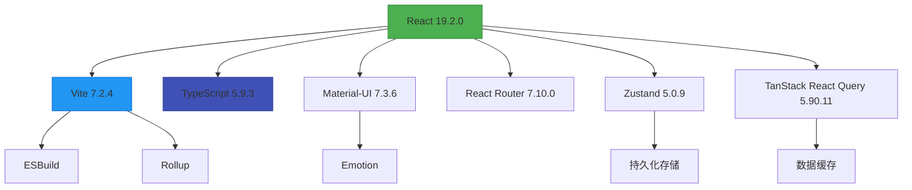
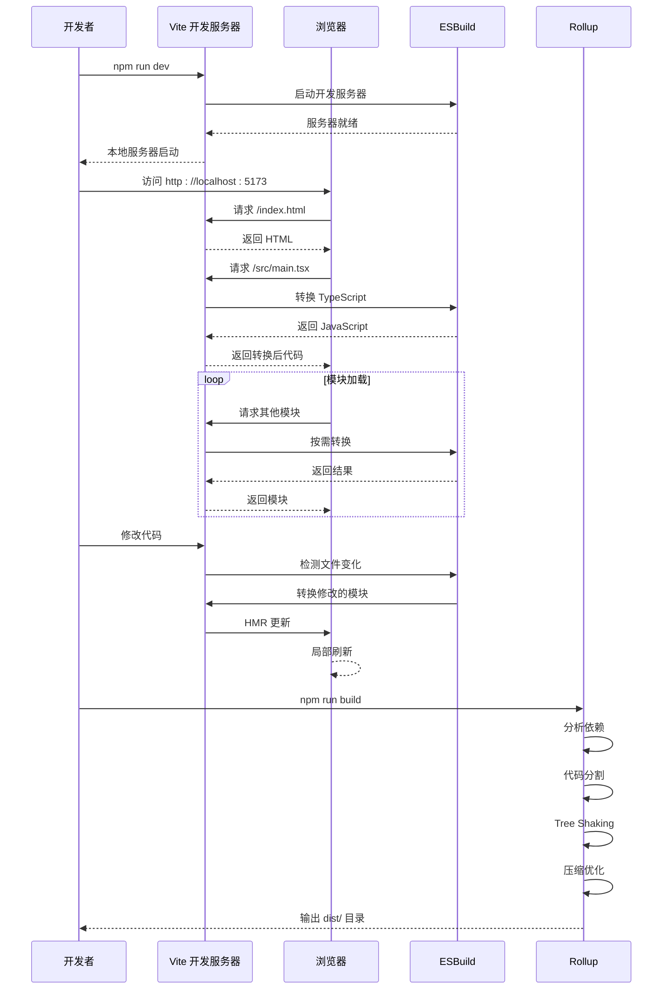

# 前端技术栈与架构

<cite>
**本文档引用文件**  
- [package.json](file://web/package.json)
- [vite.config.ts](file://web/vite.config.ts)
- [tsconfig.json](file://web/tsconfig.json)
- [tsconfig.app.json](file://web/tsconfig.app.json)
- [README.md](file://web/README.md)
- [设计文档_04_Web前端模块.md](file://docs/设计文档_04_Web前端模块.md)
- [main.tsx](file://web/src/main.tsx)
- [App.tsx](file://web/src/App.tsx)
- [ProtectedRoute.tsx](file://web/src/router/ProtectedRoute.tsx)
- [authStore.ts](file://web/src/stores/authStore.ts)
- [api.ts](file://web/src/types/api.ts)
- [auth.ts](file://web/src/api/auth.ts)
- [useAuth.ts](file://web/src/hooks/useAuth.ts)
- [index.ts](file://web/src/theme/index.ts)
</cite>

## 目录
1. [技术选型与架构设计](#技术选型与架构设计)
2. [核心框架与构建工具](#核心框架与构建工具)
3. [TypeScript 类型系统应用](#typescript-类型系统应用)
4. [Vite 构建性能与优化](#vite-构建性能与优化)
5. [React Router 路由机制](#react-router-路由机制)
6. [技术栈依赖关系图](#技术栈依赖关系图)
7. [构建流程时序图](#构建流程时序图)
8. [vite.config.ts 配置解析](#viteconfigts-配置解析)

## 技术选型与架构设计

本项目采用现代化的前端技术栈，以 React 18+ 为核心框架，Vite 5+ 为构建工具，Material-UI 5+ 为 UI 组件库，构建高性能、可维护的运维管理平台。技术选型基于生态成熟度、开发效率、性能表现和团队熟悉度等多维度考量，确保系统长期可维护性和扩展性。

**Section sources**
- [README.md](file://web/README.md#L5-L15)
- [设计文档_04_Web前端模块.md](file://docs/设计文档_04_Web前端模块.md#L73-L108)

## 核心框架与构建工具

### React 18+ 作为核心框架

React 被选为前端核心框架，主要基于其成熟的生态系统、优秀的性能表现和强大的社区支持。React 的虚拟 DOM 和 Fiber 架构确保了高效的 UI 更新性能，组件化开发模式提升了代码复用性和可维护性。结合 TypeScript 提供的静态类型检查，显著降低了运行时错误风险。

项目中 React 19.2.0 版本提供了最新的并发渲染特性，优化了用户体验和响应性能。

### Vite 5+ 作为构建工具

Vite 作为现代前端构建工具，基于 ESBuild 实现了秒级冷启动和极速的模块热更新（HMR）。开发服务器利用浏览器原生 ES 模块支持，按需编译模块，避免了传统打包工具的全量构建开销。

生产构建基于 Rollup，提供了优秀的代码分割和 Tree Shaking 优化能力，确保输出产物的最小化。

### Material-UI 5+ 作为 UI 组件库

Material-UI（MUI）提供了完整的 Material Design 实现，包含丰富的 UI 组件、强大的主题定制系统和良好的无障碍支持。其响应式设计断点系统完美适配多端设备，显著提升了开发效率和用户体验一致性。

当前项目使用 MUI 7.3.6 版本，结合 Emotion 作为 CSS-in-JS 解决方案，实现了灵活的样式定制。

**Section sources**
- [package.json](file://web/package.json#L28-L31)
- [package.json](file://web/package.json#L16-L20)
- [README.md](file://web/README.md#L7-L10)
- [设计文档_04_Web前端模块.md](file://docs/设计文档_04_Web前端模块.md#L282-L310)

## TypeScript 类型系统应用

### 接口定义与类型安全

TypeScript 5.9.3 在项目中全面应用，通过严格的类型定义确保代码的类型安全。所有 API 响应均遵循统一的 `APIResponse<T>` 格式，包含 `code`、`message`、`data` 等字段，便于统一处理。

```typescript
interface APIResponse<T = any> {
  code: number;
  message: string;
  data: T;
}
```

### 泛型使用实践

泛型在数据获取和状态管理中广泛应用。例如，在 API 客户端中，`client.get<T>()` 方法返回指定类型的响应数据，确保类型安全。在状态管理中，Zustand Store 使用泛型定义状态结构，提供精确的类型推导。

### 类型定义组织

项目采用模块化的类型定义组织方式，在 `src/types/` 目录下按功能划分类型文件，并通过 `index.ts` 统一导出，便于跨模块引用。

**Section sources**
- [tsconfig.json](file://web/tsconfig.json#L1-L8)
- [tsconfig.app.json](file://web/tsconfig.app.json#L1-L29)
- [api.ts](file://web/src/types/api.ts#L1-L55)
- [设计文档_04_Web前端模块.md](file://docs/设计文档_04_Web前端模块.md#L63-L64)

## Vite 构建性能与优化

### 开发服务器性能优势

Vite 开发服务器基于 ESBuild 实现，将 TypeScript 和 JSX 文件转换速度提升至毫秒级。开发启动时，服务器直接提供源码，利用浏览器原生 ES 模块支持按需编译，避免了传统打包工具的全量构建过程，实现秒级冷启动。

模块热更新（HMR）仅更新修改的模块，无需刷新整个页面，极大提升了开发体验。

### Rollup 生产构建优化

生产构建使用 Rollup 作为打包器，通过以下策略优化输出产物：

1. **代码分割**：将第三方依赖分割为独立 chunk
2. **Tree Shaking**：移除未使用的代码
3. **压缩优化**：使用 Terser 压缩代码
4. **资源优化**：自动优化图片和字体资源

### ESBuild 秒级冷启动实现

ESBuild 使用 Go 语言编写，通过并行处理和高效的算法实现超快的构建速度。相比 JavaScript 实现的打包工具，ESBuild 的解析和打包速度提升 10-100 倍，是 Vite 实现极速开发体验的核心技术。

**Section sources**
- [vite.config.ts](file://web/vite.config.ts#L1-L38)
- [package.json](file://web/package.json#L53-L54)
- [设计文档_04_Web前端模块.md](file://docs/设计文档_04_Web前端模块.md#L296-L300)

## React Router 路由机制

### 路由配置方式

项目使用 React Router 7.10.0 进行路由管理，采用嵌套路由配置方式。根路由 `/` 由 `ProtectedRoute` 保护，确保只有认证用户可访问。子路由包括仪表盘、节点管理等页面。

```tsx
<Routes>
  <Route path="/login" element={<Login />} />
  <Route path="/" element={<ProtectedRoute><MainLayout /></ProtectedRoute>}>
    <Route index element={<Navigate to="/dashboard" />} />
    <Route path="dashboard" element={<Dashboard />} />
    <Route path="nodes" element={<NodeList />} />
    <Route path="nodes/:id" element={<NodeDetail />} />
  </Route>
</Routes>
```

### 动态路由加载

通过路径参数 `:id` 实现动态路由，如 `nodes/:id` 可匹配任意节点 ID。在组件中使用 `useParams()` Hook 获取动态参数，实现节点详情页的动态加载。

### 路由守卫实现

`ProtectedRoute` 组件实现路由守卫功能，检查用户认证状态。未认证用户访问受保护路由时，自动重定向到登录页。同时处理状态持久化存储的水合过程，确保状态恢复完成后再进行路由判断。

**Section sources**
- [App.tsx](file://web/src/App.tsx#L5-L57)
- [ProtectedRoute.tsx](file://web/src/router/ProtectedRoute.tsx#L1-L38)
- [package.json](file://web/package.json#L31)
- [设计文档_04_Web前端模块.md](file://docs/设计文档_04_Web前端模块.md#L89)

## 技术栈依赖关系图



**Diagram sources**
- [package.json](file://web/package.json#L28-L34)
- [vite.config.ts](file://web/vite.config.ts#L1-L38)
- [设计文档_04_Web前端模块.md](file://docs/设计文档_04_Web前端模块.md#L73-L108)

## 构建流程时序图



**Diagram sources**
- [package.json](file://web/package.json#L7-L9)
- [vite.config.ts](file://web/vite.config.ts#L1-L38)
- [main.tsx](file://web/src/main.tsx#L1-L11)

## vite.config.ts 配置解析

### 插件集成

Vite 配置中集成了 `@vitejs/plugin-react` 插件，用于处理 React 组件的转换和 HMR 支持。该插件自动配置 Babel 和 React Fast Refresh，无需额外配置。

```typescript
plugins: [react()]
```

### 环境变量处理

通过 `.env.development` 和 `.env.production` 文件管理环境变量。Vite 自动加载以 `VITE_` 开头的环境变量，可在代码中通过 `import.meta.env.VITE_API_BASE_URL` 访问。

开发环境配置了 API 代理，将 `/api` 请求代理到后端服务：

```typescript
proxy: {
  '/api': {
    target: 'http://127.0.0.1:8080',
    changeOrigin: true,
  },
}
```

### 代码分割策略

生产构建配置了手动代码分割策略，优化加载性能：

1. **Recharts 单独分割**：将图表库单独打包
2. **MUI 组件库分割**：将 Material-UI 相关组件打包为独立 chunk
3. **第三方依赖分割**：将其他 node_modules 依赖打包为 vendor chunk

```typescript
manualChunks: (id) => {
  if (id.includes('recharts')) {
    return 'recharts';
  }
  if (id.includes('@mui/material') || id.includes('@mui/icons-material')) {
    return 'mui';
  }
  if (id.includes('node_modules')) {
    return 'vendor';
  }
}
```

此策略减少了主包体积，实现按需加载，提升首屏加载速度。

**Section sources**
- [vite.config.ts](file://web/vite.config.ts#L1-L38)
- [.env.development](file://web/.env.development)
- [README.md](file://web/README.md#L26-L37)