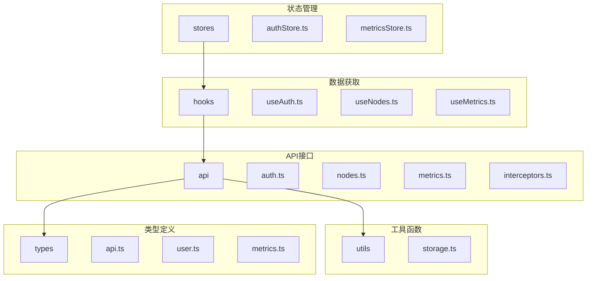
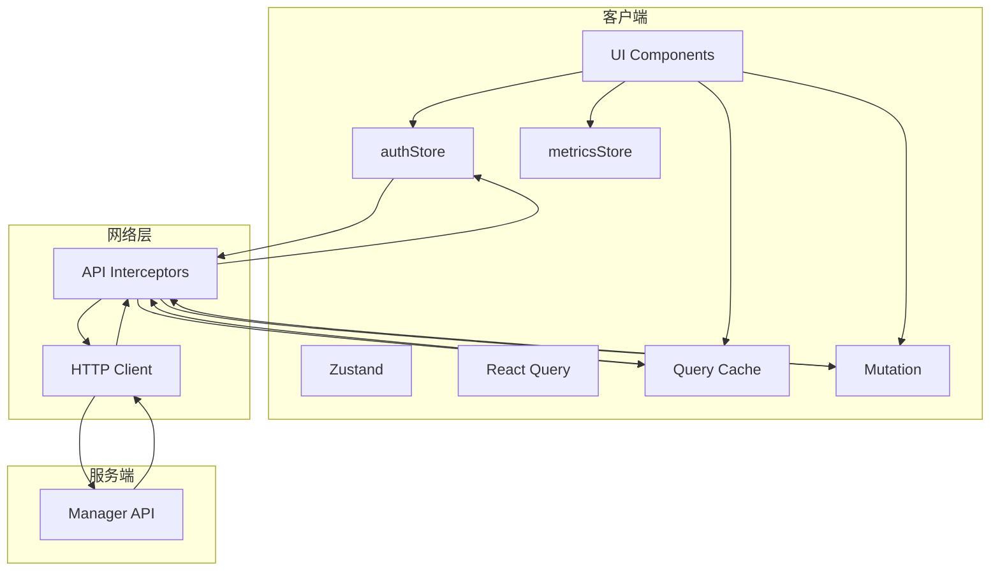
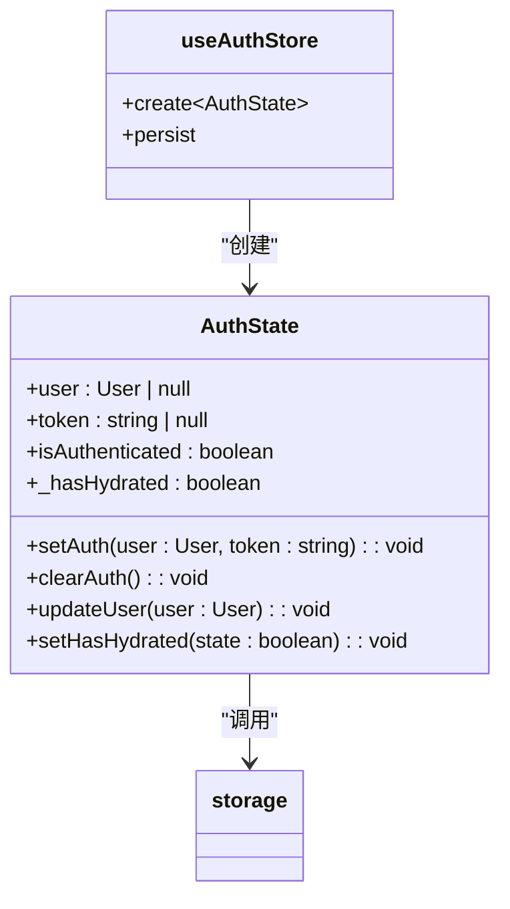
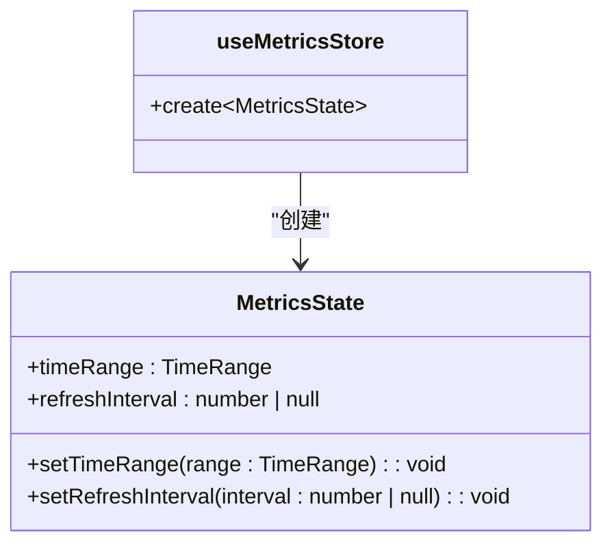
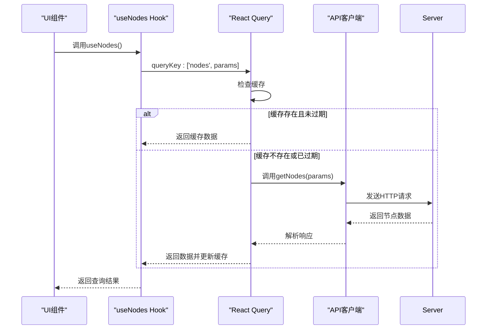
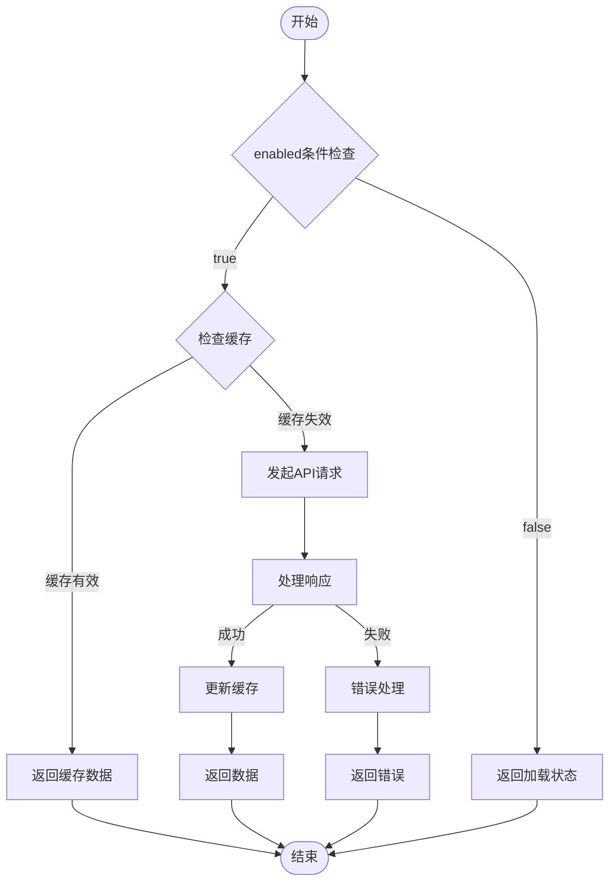
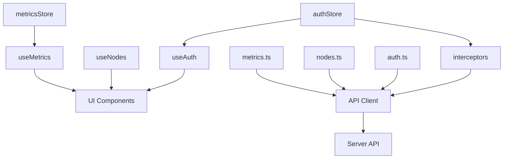

# 状态管理方案

<cite>
**本文档引用的文件**  
- [authStore.ts](file://web/src/stores/authStore.ts)
- [metricsStore.ts](file://web/src/stores/metricsStore.ts)
- [useAuth.ts](file://web/src/hooks/useAuth.ts)
- [useNodes.ts](file://web/src/hooks/useNodes.ts)
- [useMetrics.ts](file://web/src/hooks/useMetrics.ts)
- [storage.ts](file://web/src/utils/storage.ts)
- [interceptors.ts](file://web/src/api/interceptors.ts)
- [auth.ts](file://web/src/api/auth.ts)
- [nodes.ts](file://web/src/api/nodes.ts)
- [metrics.ts](file://web/src/api/metrics.ts)
- [api.ts](file://web/src/types/api.ts)
</cite>

## 目录
1. [简介](#简介)
2. [项目结构](#项目结构)
3. [核心组件](#核心组件)
4. [架构概述](#架构概述)
5. [详细组件分析](#详细组件分析)
6. [依赖分析](#依赖分析)
7. [性能考虑](#性能考虑)
8. [故障排除指南](#故障排除指南)
9. [结论](#结论)

## 简介
本文档详细阐述了运维工具框架中的状态管理方案，重点介绍Zustand与React Query的组合使用模式。文档解释了Zustand在管理认证状态（authStore）和用户界面状态（metricsStore）中的轻量级优势，包括其基于中间件的持久化（persist）和精确状态订阅机制。同时详细说明了React Query在服务端状态管理中的角色，如useNodes、useMetrics等自定义Hook如何实现数据获取、缓存、自动刷新和错误重试。文档还阐述了状态持久化策略，包括token如何通过localStorage保存，以及如何在页面刷新后恢复状态，并提供了状态变更的调试方法和性能优化建议。

## 项目结构
前端状态管理相关文件主要位于`web/src`目录下，采用模块化组织结构。核心状态管理文件位于`stores`目录，自定义Hook位于`hooks`目录，API调用封装位于`api`目录，工具函数位于`utils`目录，类型定义位于`types`目录。

**Diagram sources**
- [authStore.ts](file://web/src/stores/authStore.ts)
- [useAuth.ts](file://web/src/hooks/useAuth.ts)
- [auth.ts](file://web/src/api/auth.ts)
- [storage.ts](file://web/src/utils/storage.ts)

**Section sources**
- [authStore.ts](file://web/src/stores/authStore.ts)
- [useAuth.ts](file://web/src/hooks/useAuth.ts)
- [auth.ts](file://web/src/api/auth.ts)
- [storage.ts](file://web/src/utils/storage.ts)

## 核心组件
本系统采用Zustand和React Query相结合的状态管理方案，分别处理客户端状态和服务器端状态。Zustand用于管理认证状态和用户界面状态，提供轻量级、高效的全局状态管理；React Query则专注于服务器端状态管理，处理数据获取、缓存、同步和更新等复杂逻辑。

**Section sources**
- [authStore.ts](file://web/src/stores/authStore.ts)
- [metricsStore.ts](file://web/src/stores/metricsStore.ts)
- [useAuth.ts](file://web/src/hooks/useAuth.ts)
- [useNodes.ts](file://web/src/hooks/useNodes.ts)
- [useMetrics.ts](file://web/src/hooks/useMetrics.ts)

## 架构概述
系统采用分层状态管理架构，将客户端状态与服务器端状态分离管理。Zustand负责管理持久化的客户端状态（如认证信息）和用户界面状态（如时间范围、刷新间隔），而React Query负责管理从服务器获取的数据状态，包括节点信息、监控指标等。

**Diagram sources**
- [authStore.ts](file://web/src/stores/authStore.ts)
- [metricsStore.ts](file://web/src/stores/metricsStore.ts)
- [useAuth.ts](file://web/src/hooks/useAuth.ts)
- [useNodes.ts](file://web/src/hooks/useNodes.ts)
- [useMetrics.ts](file://web/src/hooks/useMetrics.ts)
- [interceptors.ts](file://web/src/api/interceptors.ts)

## 详细组件分析

### Zustand状态管理分析
Zustand在本项目中用于管理两种类型的状态：认证状态和用户界面状态。通过create函数创建store，结合persist中间件实现状态持久化，确保页面刷新后状态能够恢复。

#### 认证状态管理
`authStore`使用Zustand的persist中间件将用户认证信息持久化到localStorage中，包含用户信息、token和认证状态。通过partialize配置，仅持久化必要字段，并在水合（rehydrate）完成后重新计算认证状态。

**Diagram sources**
- [authStore.ts](file://web/src/stores/authStore.ts)
- [storage.ts](file://web/src/utils/storage.ts)

#### 用户界面状态管理
`metricsStore`管理与监控指标相关的用户界面状态，如时间范围和刷新间隔。与认证状态不同，该store未使用持久化中间件，因为这些状态更适合在会话期间保持。

**Diagram sources**
- [metricsStore.ts](file://web/src/stores/metricsStore.ts)

**Section sources**
- [metricsStore.ts](file://web/src/stores/metricsStore.ts)

### React Query数据管理分析
React Query在本项目中用于管理所有从服务器获取的数据状态，通过自定义Hook封装数据获取逻辑，提供缓存、自动刷新、错误重试等高级功能。

#### 节点数据管理
`useNodes`系列Hook管理节点相关数据，包括节点列表、节点详情、节点统计信息等。每个Hook使用唯一的queryKey标识数据，确保缓存的准确性和有效性。

**Diagram sources**
- [useNodes.ts](file://web/src/hooks/useNodes.ts)
- [nodes.ts](file://web/src/api/nodes.ts)

#### 监控指标数据管理
`useMetrics`系列Hook管理监控指标数据，根据不同的使用场景配置不同的缓存策略和刷新策略。例如，最新指标每30秒自动刷新，而历史数据则禁用窗口聚焦时的自动刷新以节省资源。

**Diagram sources**
- [useMetrics.ts](file://web/src/hooks/useMetrics.ts)
- [metrics.ts](file://web/src/api/metrics.ts)

**Section sources**
- [useNodes.ts](file://web/src/hooks/useNodes.ts)
- [useMetrics.ts](file://web/src/hooks/useMetrics.ts)
- [nodes.ts](file://web/src/api/nodes.ts)
- [metrics.ts](file://web/src/api/metrics.ts)

## 依赖分析
状态管理组件之间存在清晰的依赖关系，形成了一个层次化的架构。Zustand store作为最基础的客户端状态层，被React Query的自定义Hook所依赖，而自定义Hook又被UI组件所使用。

**Diagram sources**
- [authStore.ts](file://web/src/stores/authStore.ts)
- [metricsStore.ts](file://web/src/stores/metricsStore.ts)
- [useAuth.ts](file://web/src/hooks/useAuth.ts)
- [useNodes.ts](file://web/src/hooks/useNodes.ts)
- [useMetrics.ts](file://web/src/hooks/useMetrics.ts)
- [interceptors.ts](file://web/src/api/interceptors.ts)
- [auth.ts](file://web/src/api/auth.ts)
- [nodes.ts](file://web/src/api/nodes.ts)
- [metrics.ts](file://web/src/api/metrics.ts)

**Section sources**
- [authStore.ts](file://web/src/stores/authStore.ts)
- [metricsStore.ts](file://web/src/stores/metricsStore.ts)
- [useAuth.ts](file://web/src/hooks/useAuth.ts)
- [useNodes.ts](file://web/src/hooks/useNodes.ts)
- [useMetrics.ts](file://web/src/hooks/useMetrics.ts)

## 性能考虑
本状态管理方案在设计时充分考虑了性能优化，通过多种策略避免不必要的重新渲染和网络请求。

### 缓存策略
React Query实现了智能缓存机制，根据staleTime配置决定数据的新鲜度。例如，最新指标数据缓存25秒，每30秒自动刷新；历史数据缓存5分钟，减少重复请求。

### 精确订阅
Zustand支持精确的状态订阅，组件只会在其使用的状态发生变化时重新渲染，避免了传统全局状态管理中常见的过度渲染问题。

### 条件查询
通过enabled配置，可以条件性地执行查询。例如，在`useNode`中，只有当nodeId存在时才发起请求，避免无效的网络调用。

### 查询失效
在执行变更操作（如删除节点）后，通过invalidateQueries使相关查询失效，触发数据的重新获取，确保UI与服务器状态同步。

**Section sources**
- [useNodes.ts](file://web/src/hooks/useNodes.ts)
- [useMetrics.ts](file://web/src/hooks/useMetrics.ts)

## 故障排除指南
### 认证状态问题
当遇到认证相关问题时，首先检查localStorage中的token和用户信息是否正确存储。可以通过浏览器开发者工具的Application标签页查看`ops_token`和`ops_user`的值。

**Section sources**
- [authStore.ts](file://web/src/stores/authStore.ts)
- [storage.ts](file://web/src/utils/storage.ts)

### 数据获取失败
当数据获取失败时，检查API拦截器中的错误处理逻辑。网络连接失败会显示详细的排查步骤，包括检查Manager服务是否启动、API地址配置是否正确等。

**Section sources**
- [interceptors.ts](file://web/src/api/interceptors.ts)

### 状态不同步
当出现状态不同步问题时，检查queryKey的唯一性，确保相同数据使用相同的key。同时检查staleTime和refetchInterval的配置是否合理。

**Section sources**
- [useNodes.ts](file://web/src/hooks/useNodes.ts)
- [useMetrics.ts](file://web/src/hooks/useMetrics.ts)

## 结论
本状态管理方案通过Zustand和React Query的有机结合，实现了客户端状态和服务器端状态的有效分离管理。Zustand以其轻量级和简单性，完美处理了认证状态和用户界面状态的管理需求，特别是通过persist中间件实现了状态的持久化。React Query则以其强大的缓存、同步和更新机制，简化了服务器端状态的管理复杂性。这种组合方案不仅提高了开发效率，还确保了应用的性能和用户体验。