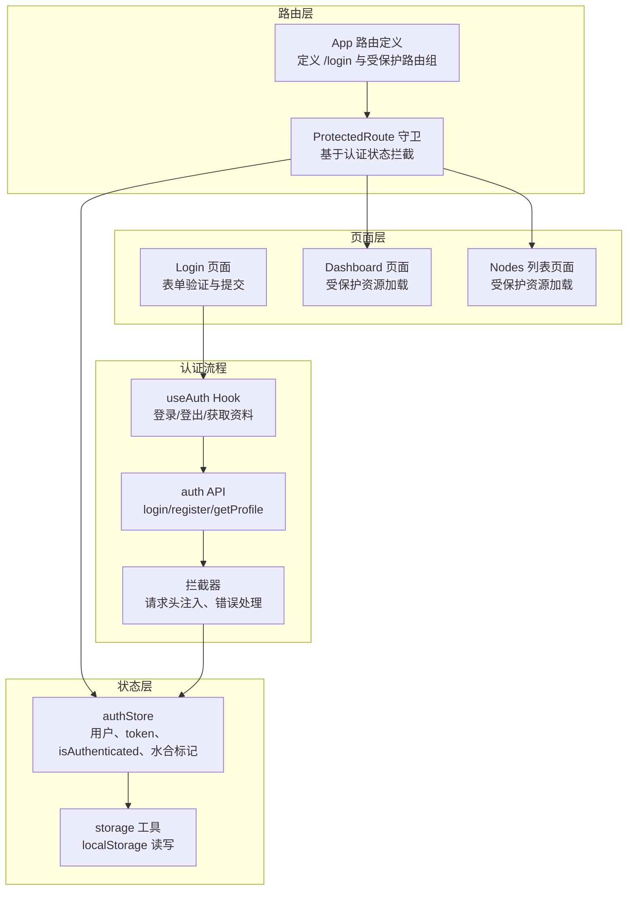
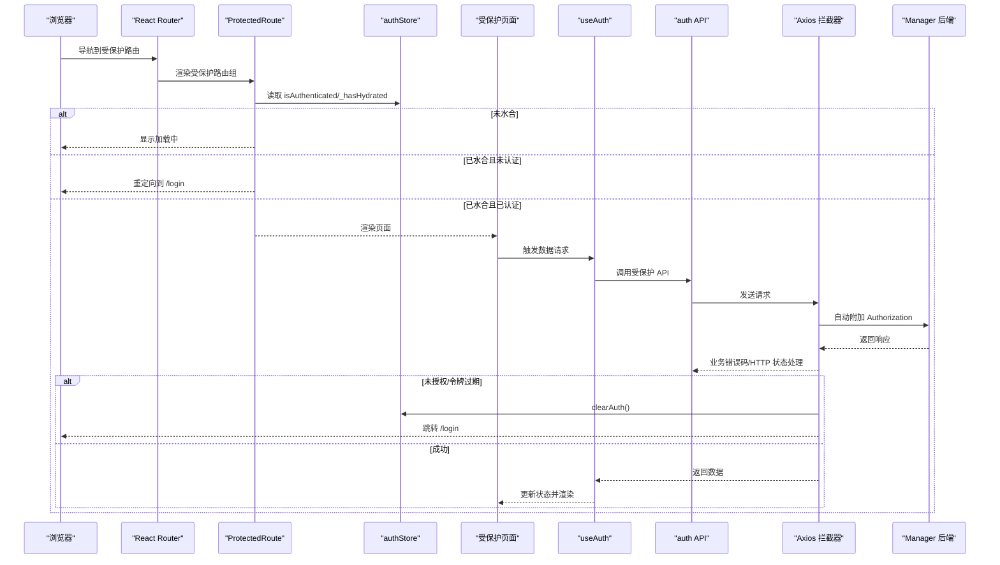
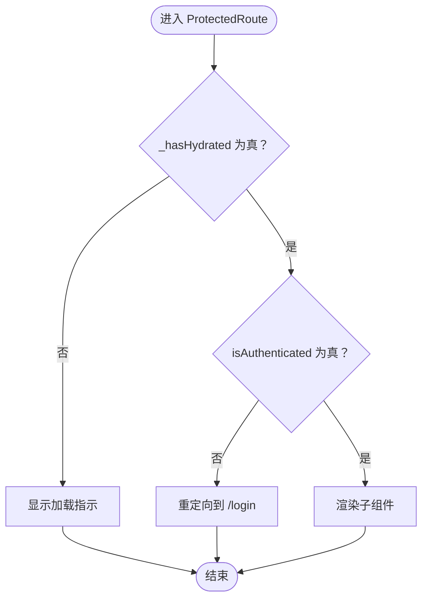
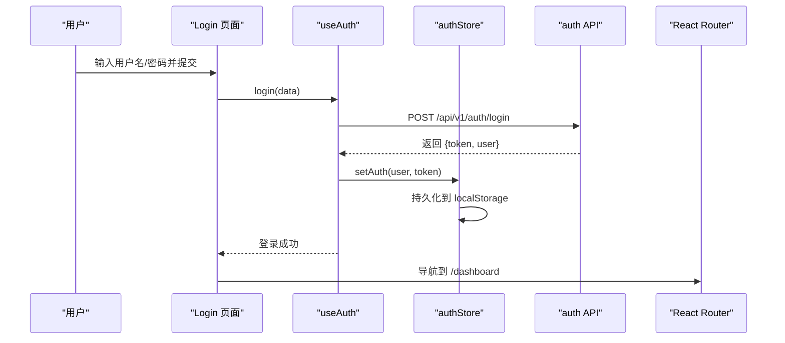
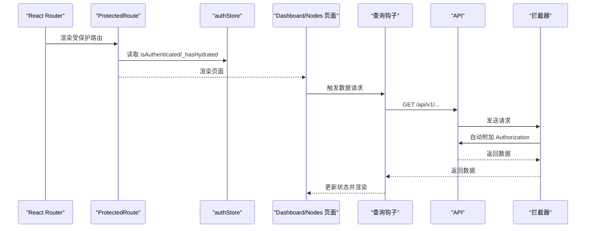
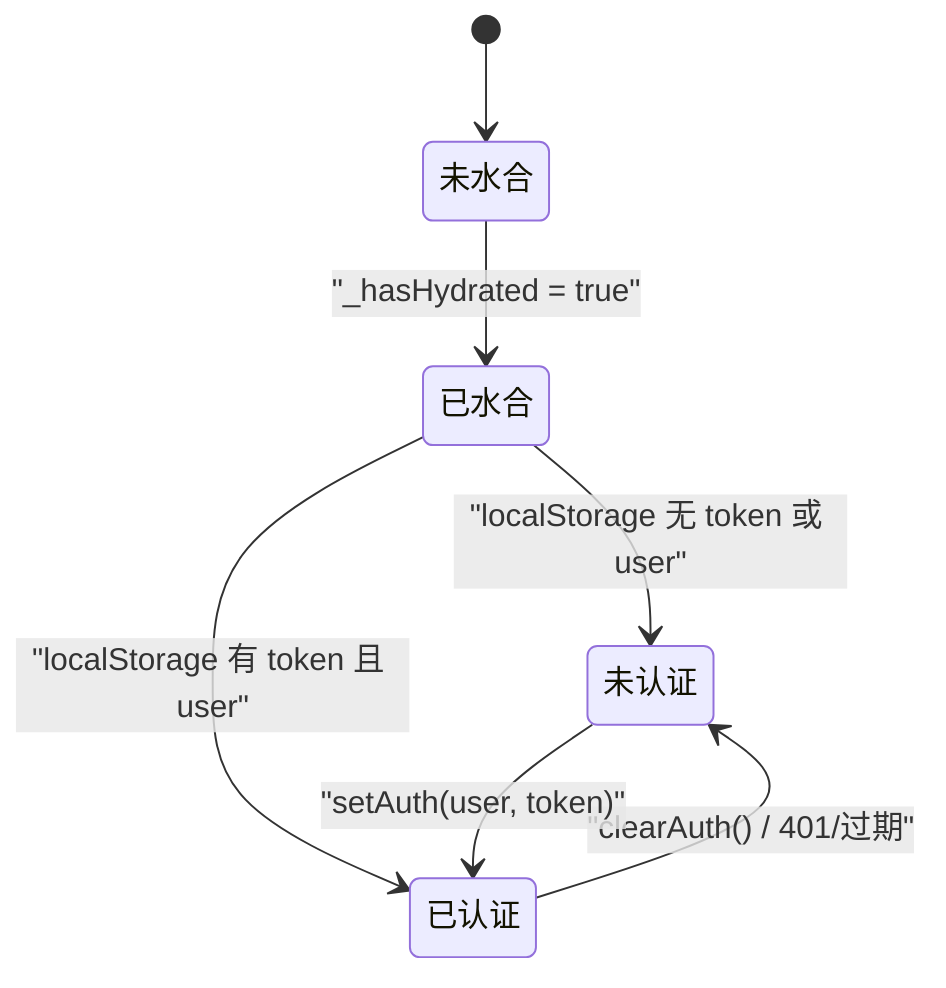
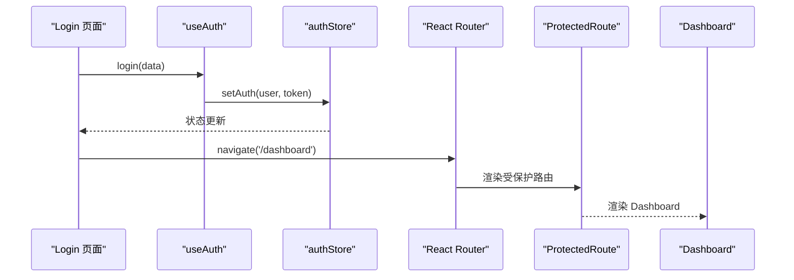
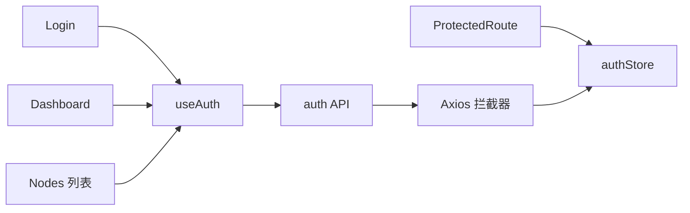

# 路由与安全控制

<cite>
**本文引用的文件**
- [web/src/router/ProtectedRoute.tsx](file://web/src/router/ProtectedRoute.tsx)
- [web/src/App.tsx](file://web/src/App.tsx)
- [web/src/stores/authStore.ts](file://web/src/stores/authStore.ts)
- [web/src/hooks/useAuth.ts](file://web/src/hooks/useAuth.ts)
- [web/src/pages/Login/index.tsx](file://web/src/pages/Login/index.tsx)
- [web/src/api/auth.ts](file://web/src/api/auth.ts)
- [web/src/api/interceptors.ts](file://web/src/api/interceptors.ts)
- [web/src/utils/storage.ts](file://web/src/utils/storage.ts)
- [web/src/types/user.ts](file://web/src/types/user.ts)
- [web/src/pages/Dashboard/index.tsx](file://web/src/pages/Dashboard/index.tsx)
- [web/src/pages/Nodes/List.tsx](file://web/src/pages/Nodes/List.tsx)
- [docs/设计文档_04_Web前端模块.md](file://docs/设计文档_04_Web前端模块.md)
</cite>

## 目录
1. [简介](#简介)
2. [项目结构](#项目结构)
3. [核心组件](#核心组件)
4. [架构总览](#架构总览)
5. [详细组件分析](#详细组件分析)
6. [依赖关系分析](#依赖关系分析)
7. [性能考量](#性能考量)
8. [故障排查指南](#故障排查指南)
9. [结论](#结论)
10. [附录](#附录)

## 简介
本文件围绕前端路由与安全控制展开，重点解释以下内容：
- ProtectedRoute 守卫组件如何基于 Zustand 的认证状态拦截未授权访问并重定向至登录页
- 登录页面的表单验证、JWT 令牌获取与状态更新流程
- 受保护页面（如 Dashboard、Nodes）的加载逻辑与权限校验
- 路由跳转时序图与认证状态流转图
- 安全最佳实践：防止路由枚举、敏感路由的动态加载、登录状态过期处理

## 项目结构
前端路由与安全控制主要分布在以下模块：
- 路由与守卫：App 路由定义、ProtectedRoute 守卫
- 认证状态管理：Zustand store（authStore）、本地存储工具
- 认证流程：useAuth Hook、登录 API、请求/响应拦截器
- 页面与受保护资源：Login、Dashboard、Nodes 列表等

图表来源
- [web/src/App.tsx](file://web/src/App.tsx#L1-L57)
- [web/src/router/ProtectedRoute.tsx](file://web/src/router/ProtectedRoute.tsx#L1-L38)
- [web/src/stores/authStore.ts](file://web/src/stores/authStore.ts#L1-L85)
- [web/src/hooks/useAuth.ts](file://web/src/hooks/useAuth.ts#L1-L73)
- [web/src/api/auth.ts](file://web/src/api/auth.ts#L1-L43)
- [web/src/api/interceptors.ts](file://web/src/api/interceptors.ts#L1-L95)
- [web/src/utils/storage.ts](file://web/src/utils/storage.ts#L1-L48)
- [web/src/pages/Login/index.tsx](file://web/src/pages/Login/index.tsx#L1-L110)
- [web/src/pages/Dashboard/index.tsx](file://web/src/pages/Dashboard/index.tsx#L1-L193)
- [web/src/pages/Nodes/List.tsx](file://web/src/pages/Nodes/List.tsx#L1-L183)

章节来源
- [web/src/App.tsx](file://web/src/App.tsx#L1-L57)
- [web/src/router/ProtectedRoute.tsx](file://web/src/router/ProtectedRoute.tsx#L1-L38)
- [web/src/stores/authStore.ts](file://web/src/stores/authStore.ts#L1-L85)
- [web/src/hooks/useAuth.ts](file://web/src/hooks/useAuth.ts#L1-L73)
- [web/src/api/interceptors.ts](file://web/src/api/interceptors.ts#L1-L95)

## 核心组件
- ProtectedRoute 守卫：在渲染子路由前检查认证状态，未认证则重定向至登录页；同时等待水合完成以避免初次加载闪烁。
- authStore：Zustand store，负责用户信息、JWT token、认证状态与水合标记；通过 persist 中间件持久化到 localStorage。
- useAuth Hook：封装登录、注册、修改密码、获取资料、登出等操作，统一管理加载态与错误信息。
- 登录页面 Login：使用 react-hook-form 进行表单验证，提交后调用 useAuth.login 并成功后导航至仪表盘。
- 请求/响应拦截器：自动为受保护接口添加 Authorization 头；当出现未授权/令牌过期等错误时，清理本地状态并跳转登录页。

章节来源
- [web/src/router/ProtectedRoute.tsx](file://web/src/router/ProtectedRoute.tsx#L1-L38)
- [web/src/stores/authStore.ts](file://web/src/stores/authStore.ts#L1-L85)
- [web/src/hooks/useAuth.ts](file://web/src/hooks/useAuth.ts#L1-L73)
- [web/src/pages/Login/index.tsx](file://web/src/pages/Login/index.tsx#L1-L110)
- [web/src/api/interceptors.ts](file://web/src/api/interceptors.ts#L1-L95)

## 架构总览
下图展示了从路由到状态与 API 的整体交互路径，以及拦截器如何在请求阶段注入 token、在响应阶段处理异常并触发登出。

图表来源
- [web/src/router/ProtectedRoute.tsx](file://web/src/router/ProtectedRoute.tsx#L1-L38)
- [web/src/stores/authStore.ts](file://web/src/stores/authStore.ts#L1-L85)
- [web/src/hooks/useAuth.ts](file://web/src/hooks/useAuth.ts#L1-L73)
- [web/src/api/auth.ts](file://web/src/api/auth.ts#L1-L43)
- [web/src/api/interceptors.ts](file://web/src/api/interceptors.ts#L1-L95)

## 详细组件分析

### ProtectedRoute 守卫组件
- 作用：作为受保护路由组的包装器，在渲染子路由前进行认证检查与水合等待。
- 关键逻辑：
  - 等待水合完成：_hasHydrated 为 false 时返回加载指示，避免初次渲染时因状态尚未从 localStorage 恢复导致误判。
  - 认证判断：isAuthenticated 为 false 时重定向到 /login。
  - 子组件渲染：通过 isAuthenticated 为真时直接返回 children。
- 与路由的关系：App 中将 MainLayout 包裹在 ProtectedRoute 下，使 /、/dashboard、/nodes 等均受保护。

图表来源
- [web/src/router/ProtectedRoute.tsx](file://web/src/router/ProtectedRoute.tsx#L1-L38)
- [web/src/stores/authStore.ts](file://web/src/stores/authStore.ts#L1-L85)
- [web/src/App.tsx](file://web/src/App.tsx#L1-L57)

章节来源
- [web/src/router/ProtectedRoute.tsx](file://web/src/router/ProtectedRoute.tsx#L1-L38)
- [web/src/stores/authStore.ts](file://web/src/stores/authStore.ts#L1-L85)
- [web/src/App.tsx](file://web/src/App.tsx#L1-L57)

### 登录页面 Login 的表单验证、JWT 获取与状态更新
- 表单验证：使用 react-hook-form 对用户名与密码进行必填校验，错误信息通过 MUI Alert 展示。
- 提交流程：onSubmit 中调用 useAuth.login(data)，成功后 navigate('/dashboard')。
- 状态更新：useAuth.login 的 onSuccess 会调用 store.setAuth(user, token)，从而将用户与 token 写入 localStorage 并更新 isAuthenticated。
- 错误处理：页面同时展示 loginError 与本地错误信息，避免静默失败。

图表来源
- [web/src/pages/Login/index.tsx](file://web/src/pages/Login/index.tsx#L1-L110)
- [web/src/hooks/useAuth.ts](file://web/src/hooks/useAuth.ts#L1-L73)
- [web/src/stores/authStore.ts](file://web/src/stores/authStore.ts#L1-L85)
- [web/src/api/auth.ts](file://web/src/api/auth.ts#L1-L43)

章节来源
- [web/src/pages/Login/index.tsx](file://web/src/pages/Login/index.tsx#L1-L110)
- [web/src/hooks/useAuth.ts](file://web/src/hooks/useAuth.ts#L1-L73)
- [web/src/stores/authStore.ts](file://web/src/stores/authStore.ts#L1-L85)
- [web/src/api/auth.ts](file://web/src/api/auth.ts#L1-L43)

### 受保护页面的加载逻辑与权限校验
- Dashboard：页面组件通过查询钩子加载集群概览数据；受保护路由保证只有已认证用户可见。
- Nodes 列表：分页加载节点列表，支持刷新与分页切换；同样受 ProtectedRoute 保护。
- 权限校验：受保护页面本身不重复校验权限，统一由路由守卫与拦截器共同保障。

图表来源
- [web/src/router/ProtectedRoute.tsx](file://web/src/router/ProtectedRoute.tsx#L1-L38)
- [web/src/stores/authStore.ts](file://web/src/stores/authStore.ts#L1-L85)
- [web/src/pages/Dashboard/index.tsx](file://web/src/pages/Dashboard/index.tsx#L1-L193)
- [web/src/pages/Nodes/List.tsx](file://web/src/pages/Nodes/List.tsx#L1-L183)
- [web/src/api/interceptors.ts](file://web/src/api/interceptors.ts#L1-L95)

章节来源
- [web/src/pages/Dashboard/index.tsx](file://web/src/pages/Dashboard/index.tsx#L1-L193)
- [web/src/pages/Nodes/List.tsx](file://web/src/pages/Nodes/List.tsx#L1-L183)
- [web/src/router/ProtectedRoute.tsx](file://web/src/router/ProtectedRoute.tsx#L1-L38)

### 认证状态流转图
该图描述了从初始水合到登录成功再到过期清理的关键状态变化。

图表来源
- [web/src/stores/authStore.ts](file://web/src/stores/authStore.ts#L1-L85)
- [web/src/api/interceptors.ts](file://web/src/api/interceptors.ts#L1-L95)

章节来源
- [web/src/stores/authStore.ts](file://web/src/stores/authStore.ts#L1-L85)
- [web/src/api/interceptors.ts](file://web/src/api/interceptors.ts#L1-L95)

### 路由跳转时序图（登录成功后）

图表来源
- [web/src/pages/Login/index.tsx](file://web/src/pages/Login/index.tsx#L1-L110)
- [web/src/hooks/useAuth.ts](file://web/src/hooks/useAuth.ts#L1-L73)
- [web/src/stores/authStore.ts](file://web/src/stores/authStore.ts#L1-L85)
- [web/src/App.tsx](file://web/src/App.tsx#L1-L57)

章节来源
- [web/src/pages/Login/index.tsx](file://web/src/pages/Login/index.tsx#L1-L110)
- [web/src/App.tsx](file://web/src/App.tsx#L1-L57)

### 代码示例：ProtectedRoute 的使用方式
- 在 App 中将受保护的路由组包裹在 ProtectedRoute 下，即可对 /、/dashboard、/nodes 等进行统一保护。
- 参考路径：
  - [受保护路由组定义](file://web/src/App.tsx#L33-L48)
  - [ProtectedRoute 守卫实现](file://web/src/router/ProtectedRoute.tsx#L1-L38)

章节来源
- [web/src/App.tsx](file://web/src/App.tsx#L33-L48)
- [web/src/router/ProtectedRoute.tsx](file://web/src/router/ProtectedRoute.tsx#L1-L38)

## 依赖关系分析
- 组件耦合与内聚：
  - ProtectedRoute 仅依赖 authStore 的认证状态，耦合度低，内聚于“路由守卫”职责。
  - useAuth 作为认证流程的统一入口，向上提供状态与方法，向下封装 API 调用。
  - 拦截器与 API 层解耦，通过 Axios 拦截器集中处理 token 注入与错误处理。
- 外部依赖：
  - React Router：路由定义与导航
  - MUI：UI 组件与样式
  - react-query：数据请求与缓存
  - axios：HTTP 客户端与拦截器

图表来源
- [web/src/router/ProtectedRoute.tsx](file://web/src/router/ProtectedRoute.tsx#L1-L38)
- [web/src/stores/authStore.ts](file://web/src/stores/authStore.ts#L1-L85)
- [web/src/hooks/useAuth.ts](file://web/src/hooks/useAuth.ts#L1-L73)
- [web/src/api/auth.ts](file://web/src/api/auth.ts#L1-L43)
- [web/src/api/interceptors.ts](file://web/src/api/interceptors.ts#L1-L95)
- [web/src/pages/Dashboard/index.tsx](file://web/src/pages/Dashboard/index.tsx#L1-L193)
- [web/src/pages/Nodes/List.tsx](file://web/src/pages/Nodes/List.tsx#L1-L183)

章节来源
- [web/src/router/ProtectedRoute.tsx](file://web/src/router/ProtectedRoute.tsx#L1-L38)
- [web/src/stores/authStore.ts](file://web/src/stores/authStore.ts#L1-L85)
- [web/src/hooks/useAuth.ts](file://web/src/hooks/useAuth.ts#L1-L73)
- [web/src/api/interceptors.ts](file://web/src/api/interceptors.ts#L1-L95)

## 性能考量
- 水合等待：ProtectedRoute 在 _hasHydrated 为假时显示加载指示，避免首次渲染闪烁与误判。
- 查询缓存：QueryClient 默认 staleTime 与 retry 配置减少重复请求与网络抖动影响。
- 本地存储：Zustand persist 仅保存必要字段，避免 localStorage 过大导致性能问题。
- 拦截器幂等：请求拦截器只在存在 token 时附加 Authorization，避免不必要的开销。

章节来源
- [web/src/router/ProtectedRoute.tsx](file://web/src/router/ProtectedRoute.tsx#L1-L38)
- [web/src/stores/authStore.ts](file://web/src/stores/authStore.ts#L1-L85)
- [web/src/App.tsx](file://web/src/App.tsx#L16-L25)

## 故障排查指南
- 登录后仍被重定向到登录页
  - 检查 localStorage 是否写入 token 与 user
  - 确认 authStore 的 setAuth 是否被调用
  - 参考路径：
    - [localStorage 写入工具](file://web/src/utils/storage.ts#L1-L48)
    - [setAuth 实现](file://web/src/stores/authStore.ts#L32-L40)
- 401/403 错误频繁出现
  - 检查拦截器是否正确附加 Authorization
  - 确认后端返回的业务错误码与 HTTP 状态码处理逻辑
  - 参考路径：
    - [请求拦截器](file://web/src/api/interceptors.ts#L14-L27)
    - [响应拦截器错误处理](file://web/src/api/interceptors.ts#L32-L91)
- 登录页面表单校验无效
  - 确认 react-hook-form 的 register 与 handleSubmit 使用正确
  - 参考路径：
    - [Login 表单与校验](file://web/src/pages/Login/index.tsx#L67-L103)
- 受保护页面数据不加载
  - 确认 ProtectedRoute 已包裹对应路由
  - 检查 useAuth.login 是否成功 setAuth
  - 参考路径：
    - [受保护路由组](file://web/src/App.tsx#L33-L48)
    - [useAuth 登录成功回调](file://web/src/hooks/useAuth.ts#L17-L23)

章节来源
- [web/src/utils/storage.ts](file://web/src/utils/storage.ts#L1-L48)
- [web/src/stores/authStore.ts](file://web/src/stores/authStore.ts#L32-L40)
- [web/src/api/interceptors.ts](file://web/src/api/interceptors.ts#L14-L27)
- [web/src/pages/Login/index.tsx](file://web/src/pages/Login/index.tsx#L67-L103)
- [web/src/App.tsx](file://web/src/App.tsx#L33-L48)
- [web/src/hooks/useAuth.ts](file://web/src/hooks/useAuth.ts#L17-L23)

## 结论
本项目采用“路由守卫 + 状态管理 + 拦截器”的组合实现前端安全控制：
- ProtectedRoute 保证受保护路由的访问控制
- authStore 与 localStorage 实现持久化认证状态
- useAuth 与 API 统一封装认证流程
- Axios 拦截器集中处理 token 注入与错误处理，确保登录状态过期时自动清理并跳转登录页

该方案具备良好的可维护性与扩展性，适合在多页面、多权限场景下复用。

## 附录

### 安全最佳实践
- 防止路由枚举
  - 不暴露受保护路由的精确路径；使用通配符兜底并重定向至仪表盘
  - 参考路径：[通配符兜底与重定向](file://web/src/App.tsx#L48-L49)
- 敏感路由的动态加载
  - 将受保护页面按需懒加载，减少首屏体积与暴露面
  - 参考路径：[受保护路由组](file://web/src/App.tsx#L33-L48)
- 登录状态过期处理
  - 响应拦截器检测未授权/令牌过期错误，清理本地状态并跳转登录页
  - 参考路径：[响应拦截器](file://web/src/api/interceptors.ts#L32-L67)
- 类型与常量
  - 使用强类型定义用户角色与状态，避免运行时错误
  - 参考路径：[用户类型定义](file://web/src/types/user.ts#L1-L52)
- 设计文档中的守卫补充
  - 文档中提供了 AuthGuard 与 GuestGuard 的实现思路，可按需扩展
  - 参考路径：[设计文档中的守卫](file://docs/设计文档_04_Web前端模块.md#L400-L428)

章节来源
- [web/src/App.tsx](file://web/src/App.tsx#L33-L49)
- [web/src/api/interceptors.ts](file://web/src/api/interceptors.ts#L32-L67)
- [web/src/types/user.ts](file://web/src/types/user.ts#L1-L52)
- [docs/设计文档_04_Web前端模块.md](file://docs/设计文档_04_Web前端模块.md#L400-L428)