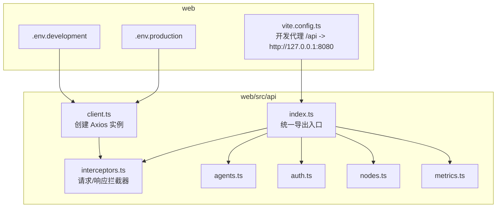
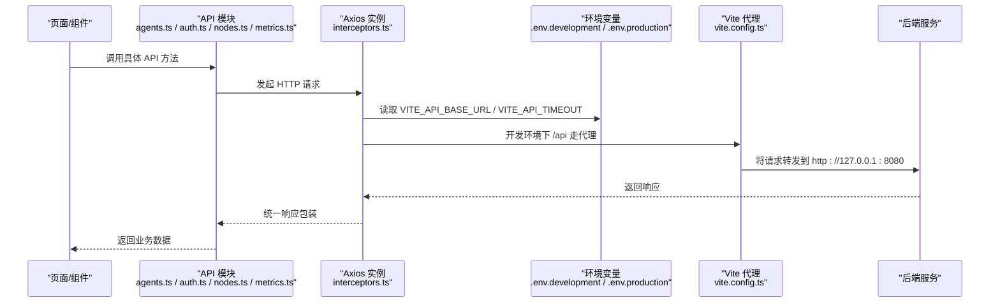
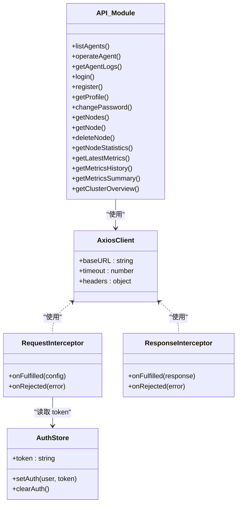
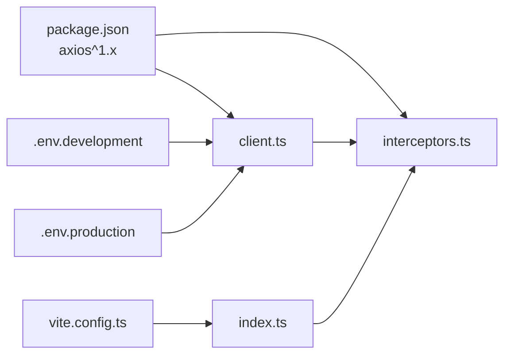

# API客户端配置

<cite>
**本文引用的文件**
- [web/src/api/client.ts](file://web/src/api/client.ts)
- [web/src/api/interceptors.ts](file://web/src/api/interceptors.ts)
- [web/src/api/index.ts](file://web/src/api/index.ts)
- [web/src/api/agents.ts](file://web/src/api/agents.ts)
- [web/src/api/auth.ts](file://web/src/api/auth.ts)
- [web/src/api/nodes.ts](file://web/src/api/nodes.ts)
- [web/src/api/metrics.ts](file://web/src/api/metrics.ts)
- [web/.env.development](file://web/.env.development)
- [web/.env.production](file://web/.env.production)
- [web/vite.config.ts](file://web/vite.config.ts)
- [web/src/types/api.ts](file://web/src/types/api.ts)
- [web/src/stores/authStore.ts](file://web/src/stores/authStore.ts)
- [web/package.json](file://web/package.json)
</cite>

## 目录
1. [简介](#简介)
2. [项目结构](#项目结构)
3. [核心组件](#核心组件)
4. [架构总览](#架构总览)
5. [详细组件分析](#详细组件分析)
6. [依赖关系分析](#依赖关系分析)
7. [性能考量](#性能考量)
8. [故障排查指南](#故障排查指南)
9. [结论](#结论)
10. [附录](#附录)

## 简介
本文件聚焦于前端 Web 项目的 API 客户端配置，围绕 Axios 实例的初始化与全局配置展开，系统性说明以下内容：
- 如何基于 Vite 的 import.meta.env 环境变量设置基础 URL、请求超时时间、默认请求头等核心参数；
- Axios 实例的导出机制与在项目中的全局复用模式；
- 通过 index.ts 统一导出所有 API 模块，实现模块化管理；
- 跨环境部署（开发、生产）的支持机制；
- 常见配置错误的排查方法，如 CORS 预检失败、超时不生效等。

## 项目结构
前端 Web 位于 web/ 目录，API 客户端相关代码集中在 web/src/api 下，采用按功能模块拆分的方式组织，配合 Vite 的代理与环境变量实现跨环境支持。

图表来源
- [web/src/api/client.ts](file://web/src/api/client.ts#L1-L18)
- [web/src/api/interceptors.ts](file://web/src/api/interceptors.ts#L1-L95)
- [web/src/api/index.ts](file://web/src/api/index.ts#L1-L10)
- [web/.env.development](file://web/.env.development#L1-L5)
- [web/.env.production](file://web/.env.production#L1-L5)
- [web/vite.config.ts](file://web/vite.config.ts#L1-L38)

章节来源
- [web/src/api/client.ts](file://web/src/api/client.ts#L1-L18)
- [web/src/api/interceptors.ts](file://web/src/api/interceptors.ts#L1-L95)
- [web/src/api/index.ts](file://web/src/api/index.ts#L1-L10)
- [web/.env.development](file://web/.env.development#L1-L5)
- [web/.env.production](file://web/.env.production#L1-L5)
- [web/vite.config.ts](file://web/vite.config.ts#L1-L38)

## 核心组件
- Axios 实例创建：在 client.ts 中创建 Axios 实例，设置 baseURL、timeout、默认 Content-Type 头。
- 拦截器：在 interceptors.ts 中配置请求头注入（Authorization）与响应错误处理（业务错误码、HTTP 状态码、网络错误）。
- 统一导出：index.ts 将各 API 模块与 Axios 实例集中导出，便于上层按需导入使用。
- 环境变量：.env.development 与 .env.production 分别提供开发与生产的 baseURL 与 timeout；Vite 在开发时通过代理将 /api 路由转发至后端。

章节来源
- [web/src/api/client.ts](file://web/src/api/client.ts#L1-L18)
- [web/src/api/interceptors.ts](file://web/src/api/interceptors.ts#L1-L95)
- [web/src/api/index.ts](file://web/src/api/index.ts#L1-L10)
- [web/.env.development](file://web/.env.development#L1-L5)
- [web/.env.production](file://web/.env.production#L1-L5)
- [web/vite.config.ts](file://web/vite.config.ts#L1-L38)

## 架构总览
下图展示了从页面调用到后端接口的整体流程，包括环境变量、代理、Axios 实例与拦截器的作用。

图表来源
- [web/src/api/agents.ts](file://web/src/api/agents.ts#L1-L57)
- [web/src/api/auth.ts](file://web/src/api/auth.ts#L1-L43)
- [web/src/api/nodes.ts](file://web/src/api/nodes.ts#L1-L47)
- [web/src/api/metrics.ts](file://web/src/api/metrics.ts#L1-L58)
- [web/src/api/interceptors.ts](file://web/src/api/interceptors.ts#L1-L95)
- [web/.env.development](file://web/.env.development#L1-L5)
- [web/.env.production](file://web/.env.production#L1-L5)
- [web/vite.config.ts](file://web/vite.config.ts#L1-L38)

## 详细组件分析

### Axios 实例初始化与全局配置（client.ts）
- 基础 URL（baseURL）：优先使用 import.meta.env.VITE_API_BASE_URL，若未设置则回退为本地开发地址。
- 超时时间（timeout）：优先使用 import.meta.env.VITE_API_TIMEOUT，若未设置则回退为 30000ms。
- 默认请求头：设置 Content-Type 为 application/json。
- 导出方式：同时导出命名导出 client 与默认导出，便于不同导入方式使用。

章节来源
- [web/src/api/client.ts](file://web/src/api/client.ts#L1-L18)
- [web/.env.development](file://web/.env.development#L1-L5)
- [web/.env.production](file://web/.env.production#L1-L5)

### 拦截器配置（interceptors.ts）
- 请求拦截器：从认证状态存储中读取 token 并注入 Authorization 头；错误时直接拒绝。
- 响应拦截器：
  - 业务错误码：当返回 code 不等于成功码时，根据错误码判断是否需要清理登录状态并跳转登录页；随后抛出错误。
  - HTTP 状态码：针对 401/403/404/500 等状态进行特定处理与提示。
  - 网络错误：当 error.request 存在时，拼装包含 baseURL 与 url 的详细错误信息，指导检查服务是否启动、配置是否正确、防火墙或网络设置。
- 导出方式：默认导出同一 Axios 实例，确保请求与响应拦截器在同一实例上生效。

章节来源
- [web/src/api/interceptors.ts](file://web/src/api/interceptors.ts#L1-L95)
- [web/src/stores/authStore.ts](file://web/src/stores/authStore.ts#L1-L85)
- [web/src/types/api.ts](file://web/src/types/api.ts#L1-L55)

### 统一导出入口（index.ts）
- 将 agents、auth、nodes、metrics 等模块全部导出，便于上层按需导入。
- 同时导出 client（来自 interceptors），使上层可直接使用统一的 Axios 实例。

章节来源
- [web/src/api/index.ts](file://web/src/api/index.ts#L1-L10)

### API 模块使用 Axios 实例（agents.ts / auth.ts / nodes.ts / metrics.ts）
- 各模块均从 interceptors 导入 client，保证共享同一实例与拦截器链。
- 模块内以函数形式封装具体接口，返回 Promise<APIResponse<T>>，并在 then 中提取 data 字段，简化调用方使用。

章节来源
- [web/src/api/agents.ts](file://web/src/api/agents.ts#L1-L57)
- [web/src/api/auth.ts](file://web/src/api/auth.ts#L1-L43)
- [web/src/api/nodes.ts](file://web/src/api/nodes.ts#L1-L47)
- [web/src/api/metrics.ts](file://web/src/api/metrics.ts#L1-L58)

### 跨环境部署支持机制
- 开发环境（.env.development）：
  - VITE_API_BASE_URL 指向本地后端地址。
  - Vite 通过 server.proxy 将 /api 路由代理到 http://127.0.0.1:8080，避免 CORS 问题。
- 生产环境（.env.production）：
  - VITE_API_BASE_URL 设置为相对路径 /api，由反向代理统一转发到后端。
  - Axios 实例的 baseURL 会自动拼接相对路径，形成最终请求地址。

章节来源
- [web/.env.development](file://web/.env.development#L1-L5)
- [web/.env.production](file://web/.env.production#L1-L5)
- [web/vite.config.ts](file://web/vite.config.ts#L1-L38)
- [web/src/api/client.ts](file://web/src/api/client.ts#L1-L18)

### 类关系与依赖图（代码级）

图表来源
- [web/src/api/client.ts](file://web/src/api/client.ts#L1-L18)
- [web/src/api/interceptors.ts](file://web/src/api/interceptors.ts#L1-L95)
- [web/src/stores/authStore.ts](file://web/src/stores/authStore.ts#L1-L85)
- [web/src/api/agents.ts](file://web/src/api/agents.ts#L1-L57)
- [web/src/api/auth.ts](file://web/src/api/auth.ts#L1-L43)
- [web/src/api/nodes.ts](file://web/src/api/nodes.ts#L1-L47)
- [web/src/api/metrics.ts](file://web/src/api/metrics.ts#L1-L58)

## 依赖关系分析
- Axios 版本：package.json 显示使用 axios^1.x，确保与拦截器与实例配置兼容。
- 环境变量：Vite 在构建时会将 import.meta.env 注入到客户端，因此 client.ts 与 index.ts 可直接读取。
- 开发代理：vite.config.ts 的 proxy 将 /api 转发到后端，避免浏览器同源策略限制。
- 统一导出：index.ts 将各模块与 client 集中导出，降低上层导入复杂度。

图表来源
- [web/package.json](file://web/package.json#L1-L57)
- [web/.env.development](file://web/.env.development#L1-L5)
- [web/.env.production](file://web/.env.production#L1-L5)
- [web/vite.config.ts](file://web/vite.config.ts#L1-L38)
- [web/src/api/client.ts](file://web/src/api/client.ts#L1-L18)
- [web/src/api/interceptors.ts](file://web/src/api/interceptors.ts#L1-L95)
- [web/src/api/index.ts](file://web/src/api/index.ts#L1-L10)

章节来源
- [web/package.json](file://web/package.json#L1-L57)
- [web/vite.config.ts](file://web/vite.config.ts#L1-L38)

## 性能考量
- 超时控制：通过 VITE_API_TIMEOUT 控制请求超时，避免长时间阻塞 UI。建议根据接口特性调整开发与生产环境的超时值。
- 全局复用：Axios 实例与拦截器在全局复用，减少重复初始化开销。
- 代理优化：开发阶段使用 Vite 代理，避免跨域带来的额外握手成本。
- 模块化导入：index.ts 统一导出，便于 Tree Shaking 与按需加载，减少打包体积。

## 故障排查指南
- CORS 预检失败
  - 现象：浏览器控制台出现跨域错误，OPTIONS 预检失败。
  - 排查要点：
    - 开发环境：确认 vite.config.ts 的 /api 代理是否启用且目标地址正确。
    - 生产环境：确认反向代理是否将 /api 路由转发到后端，且后端允许跨域。
  - 参考来源
    - [web/vite.config.ts](file://web/vite.config.ts#L1-L38)
    - [web/.env.production](file://web/.env.production#L1-L5)

- 超时不生效
  - 现象：请求超过预期时间仍未中断。
  - 排查要点：
    - 确认 VITE_API_TIMEOUT 是否正确写入 .env.development 或 .env.production。
    - 确认 client.ts 读取到的 timeout 值是否为数字类型（字符串会被转换为数字）。
  - 参考来源
    - [web/.env.development](file://web/.env.development#L1-L5)
    - [web/.env.production](file://web/.env.production#L1-L5)
    - [web/src/api/client.ts](file://web/src/api/client.ts#L1-L18)

- 网络连接失败
  - 现象：出现“无法连接到服务器”提示。
  - 排查要点：
    - 确认后端服务已启动（例如 make run-dev）。
    - 检查 VITE_API_BASE_URL 是否指向正确的后端地址。
    - 确认防火墙或网络策略未阻止请求。
  - 参考来源
    - [web/src/api/interceptors.ts](file://web/src/api/interceptors.ts#L79-L91)
    - [web/.env.development](file://web/.env.development#L1-L5)

- 401/403/404/500 错误
  - 现象：页面弹出相应错误提示或跳转登录页。
  - 排查要点：
    - 401：检查 token 是否过期或无效，必要时清理本地认证状态并重新登录。
    - 403：检查权限策略与角色授权。
    - 404：确认接口路径是否正确。
    - 500：检查后端日志定位问题。
  - 参考来源
    - [web/src/api/interceptors.ts](file://web/src/api/interceptors.ts#L61-L78)
    - [web/src/stores/authStore.ts](file://web/src/stores/authStore.ts#L1-L85)

- 业务错误码异常
  - 现象：接口返回 code 非成功码但未触发登录态清理。
  - 排查要点：
    - 确认 ErrorCode 枚举与后端一致。
    - 检查拦截器中对错误码的分支逻辑是否覆盖所有场景。
  - 参考来源
    - [web/src/types/api.ts](file://web/src/types/api.ts#L1-L55)
    - [web/src/api/interceptors.ts](file://web/src/api/interceptors.ts#L37-L51)

## 结论
本项目通过 Vite 环境变量与 Axios 实例的组合，实现了灵活的跨环境 API 客户端配置。开发环境借助代理规避 CORS，生产环境通过相对路径与反向代理实现统一转发。拦截器在全局范围内统一注入认证头与错误处理，index.ts 提供简洁的模块化导出入口，使上层调用更加直观。遵循本文的配置与排错建议，可有效提升开发效率与稳定性。

## 附录
- 环境变量清单
  - VITE_API_BASE_URL：后端基础地址（开发/生产）
  - VITE_API_TIMEOUT：请求超时时间（毫秒）
- 关键文件路径
  - Axios 实例与默认导出：web/src/api/client.ts
  - 拦截器与错误处理：web/src/api/interceptors.ts
  - 统一导出入口：web/src/api/index.ts
  - API 模块示例：web/src/api/agents.ts、web/src/api/auth.ts、web/src/api/nodes.ts、web/src/api/metrics.ts
  - 开发代理配置：web/vite.config.ts
  - 环境变量示例：web/.env.development、web/.env.production
  - 类型与错误码：web/src/types/api.ts
  - 认证状态存储：web/src/stores/authStore.ts
  - 依赖版本：web/package.json