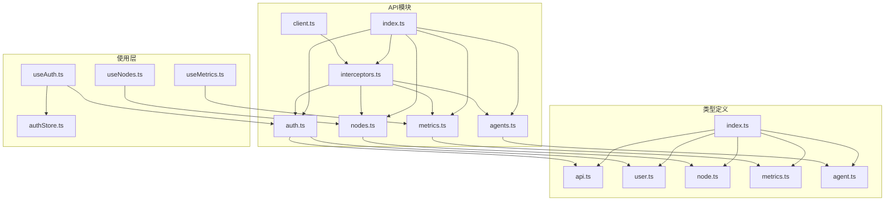
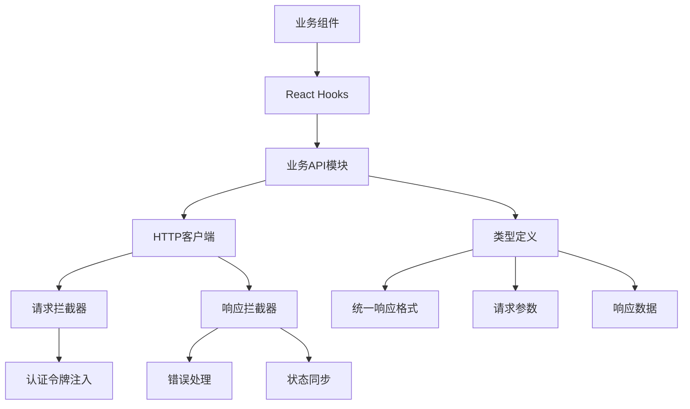
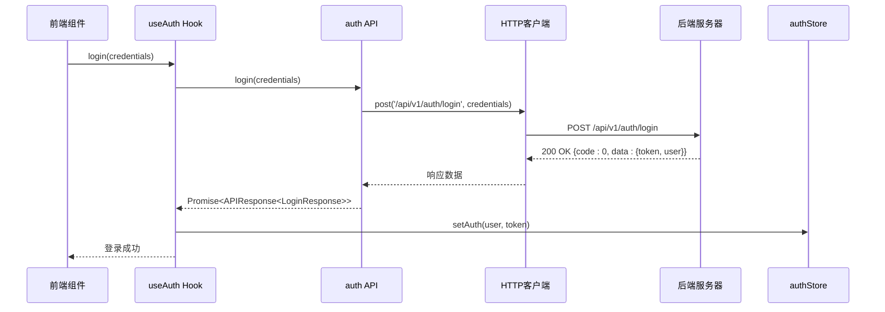
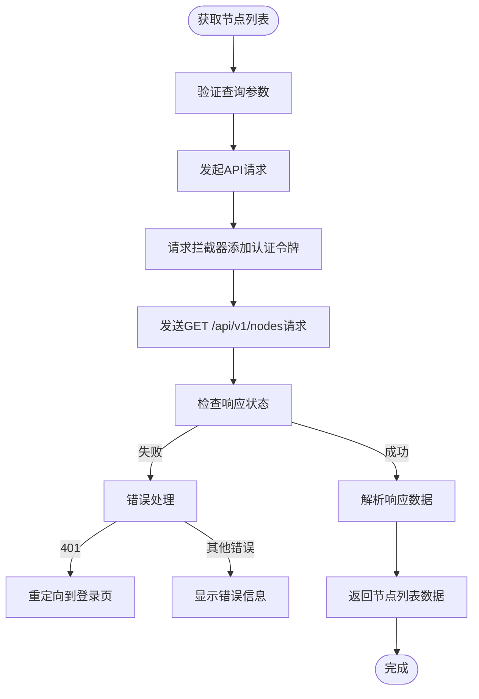
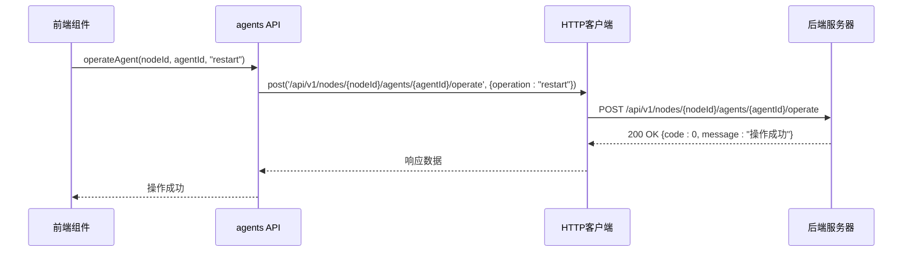
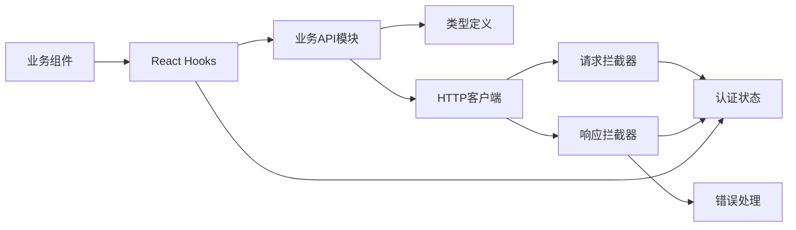

# 业务API模块封装

<cite>
**本文档引用的文件**
- [auth.ts](file://web/src/api/auth.ts)
- [nodes.ts](file://web/src/api/nodes.ts)
- [metrics.ts](file://web/src/api/metrics.ts)
- [agents.ts](file://web/src/api/agents.ts)
- [client.ts](file://web/src/api/client.ts)
- [interceptors.ts](file://web/src/api/interceptors.ts)
- [index.ts](file://web/src/api/index.ts)
- [api.ts](file://web/src/types/api.ts)
- [user.ts](file://web/src/types/user.ts)
- [node.ts](file://web/src/types/node.ts)
- [metrics.ts](file://web/src/types/metrics.ts)
- [agent.ts](file://web/src/types/agent.ts)
- [index.ts](file://web/src/types/index.ts)
- [useAuth.ts](file://web/src/hooks/useAuth.ts)
- [useNodes.ts](file://web/src/hooks/useNodes.ts)
- [useMetrics.ts](file://web/src/hooks/useMetrics.ts)
- [authStore.ts](file://web/src/stores/authStore.ts)
</cite>

## 目录
1. [简介](#简介)
2. [项目结构](#项目结构)
3. [核心组件](#核心组件)
4. [架构概述](#架构概述)
5. [详细组件分析](#详细组件分析)
6. [依赖分析](#依赖分析)
7. [性能考虑](#性能考虑)
8. [故障排除指南](#故障排除指南)
9. [结论](#结论)

## 简介
本文档详细说明了运维框架中业务API模块的封装设计，重点分析了认证(auth)、节点(nodes)、指标(metrics)和Agent(agents)等核心API模块的组织结构与实现方式。文档阐述了各模块如何封装RESTful端点，包括URL路径、HTTP方法、参数序列化及响应数据解构，并强调了TypeScript接口在请求参数和响应数据类型安全中的关键作用。通过典型调用示例，展示了用户登录认证流程、节点列表获取、指标查询和Agent操作等核心功能的实现。同时，文档还解释了API函数的复用性设计原则和统一的错误处理模式，确保前后端契约的一致性。

## 项目结构
业务API模块主要位于`web/src/api`目录下，采用模块化设计，每个业务领域都有独立的API文件。类型定义统一存放在`web/src/types`目录中，通过索引文件导出。API客户端基于Axios构建，通过拦截器实现统一的请求和响应处理。



**Diagram sources**
- [auth.ts](file://web/src/api/auth.ts)
- [nodes.ts](file://web/src/api/nodes.ts)
- [metrics.ts](file://web/src/api/metrics.ts)
- [agents.ts](file://web/src/api/agents.ts)
- [client.ts](file://web/src/api/client.ts)
- [interceptors.ts](file://web/src/api/interceptors.ts)
- [index.ts](file://web/src/api/index.ts)
- [api.ts](file://web/src/types/api.ts)
- [user.ts](file://web/src/types/user.ts)
- [node.ts](file://web/src/types/node.ts)
- [metrics.ts](file://web/src/types/metrics.ts)
- [agent.ts](file://web/src/types/agent.ts)
- [index.ts](file://web/src/types/index.ts)
- [useAuth.ts](file://web/src/hooks/useAuth.ts)
- [useNodes.ts](file://web/src/hooks/useNodes.ts)
- [useMetrics.ts](file://web/src/hooks/useMetrics.ts)
- [authStore.ts](file://web/src/stores/authStore.ts)

**Section sources**
- [auth.ts](file://web/src/api/auth.ts)
- [nodes.ts](file://web/src/api/nodes.ts)
- [metrics.ts](file://web/src/api/metrics.ts)
- [agents.ts](file://web/src/api/agents.ts)
- [client.ts](file://web/src/api/client.ts)
- [interceptors.ts](file://web/src/api/interceptors.ts)
- [index.ts](file://web/src/api/index.ts)

## 核心组件
业务API模块的核心组件包括认证、节点管理、指标监控和Agent管理四大模块。每个模块都封装了特定业务领域的RESTful端点，提供类型安全的函数接口。API客户端通过拦截器实现了统一的认证令牌注入和错误处理，确保了前后端交互的一致性和可靠性。

**Section sources**
- [auth.ts](file://web/src/api/auth.ts)
- [nodes.ts](file://web/src/api/nodes.ts)
- [metrics.ts](file://web/src/api/metrics.ts)
- [agents.ts](file://web/src/api/agents.ts)
- [interceptors.ts](file://web/src/api/interceptors.ts)

## 架构概述
业务API模块采用分层架构设计，上层为业务API封装，中层为HTTP客户端和拦截器，底层为类型定义系统。这种设计实现了关注点分离，提高了代码的可维护性和可扩展性。



**Diagram sources**
- [auth.ts](file://web/src/api/auth.ts)
- [nodes.ts](file://web/src/api/nodes.ts)
- [metrics.ts](file://web/src/api/metrics.ts)
- [agents.ts](file://web/src/api/agents.ts)
- [interceptors.ts](file://web/src/api/interceptors.ts)
- [useAuth.ts](file://web/src/hooks/useAuth.ts)
- [useNodes.ts](file://web/src/hooks/useNodes.ts)
- [useMetrics.ts](file://web/src/hooks/useMetrics.ts)
- [authStore.ts](file://web/src/stores/authStore.ts)
- [api.ts](file://web/src/types/api.ts)
- [user.ts](file://web/src/types/user.ts)
- [node.ts](file://web/src/types/node.ts)
- [metrics.ts](file://web/src/types/metrics.ts)
- [agent.ts](file://web/src/types/agent.ts)

## 详细组件分析

### 认证模块分析
认证模块封装了用户登录、注册、获取资料和修改密码等核心功能。所有API调用都返回符合`APIResponse<T>`格式的响应，确保了前后端契约的一致性。



**Diagram sources**
- [auth.ts](file://web/src/api/auth.ts)
- [useAuth.ts](file://web/src/hooks/useAuth.ts)
- [authStore.ts](file://web/src/stores/authStore.ts)
- [interceptors.ts](file://web/src/api/interceptors.ts)

**Section sources**
- [auth.ts](file://web/src/api/auth.ts)
- [useAuth.ts](file://web/src/hooks/useAuth.ts)
- [authStore.ts](file://web/src/stores/authStore.ts)
- [user.ts](file://web/src/types/user.ts)

### 节点管理模块分析
节点管理模块提供了节点列表获取、节点详情查询、节点删除和节点统计信息获取等功能。API设计遵循RESTful规范，使用标准的HTTP方法和路径。



**Diagram sources**
- [nodes.ts](file://web/src/api/nodes.ts)
- [useNodes.ts](file://web/src/hooks/useNodes.ts)
- [interceptors.ts](file://web/src/api/interceptors.ts)

**Section sources**
- [nodes.ts](file://web/src/api/nodes.ts)
- [useNodes.ts](file://web/src/hooks/useNodes.ts)
- [node.ts](file://web/src/types/node.ts)

### 指标监控模块分析
指标监控模块提供了获取最新指标、历史指标数据、指标统计摘要和集群资源概览等功能。API设计考虑了性能优化，支持自动刷新和缓存策略。

```mermaid
classDiagram
class MetricsAPI {
+getLatestMetrics(nodeId : string) : Promise~APIResponse~MetricsLatestResponse~~
+getMetricsHistory(nodeId : string, type : string, params : {start_time : string, end_time : string}) : Promise~APIResponse~MetricsHistoryResponse~~
+getMetricsSummary(nodeId : string, timeRange? : TimeRange) : Promise~APIResponse~MetricsSummaryResponse~~
+getClusterOverview() : Promise~APIResponse~ClusterOverviewResponse~~
}
class TimeRange {
+startTime : Date
+endTime : Date
}
class MetricsLatestResponse {
+cpu? : MetricData
+memory? : MetricData
+disk? : MetricData
+network? : MetricData
}
class MetricsHistoryResponse {
+id : number
+node_id : string
+type : 'cpu' | 'memory' | 'disk' | 'network'
+timestamp : string
+values : Record~string, any~
}
class MetricsSummaryResponse {
+cpu? : MetricSummary
+memory? : MetricSummary
+disk? : MetricSummary
+network? : MetricSummary
}
class ClusterOverviewResponse {
+aggregate : AggregateData
+nodes : NodeMetrics[]
}
MetricsAPI --> TimeRange
MetricsAPI --> MetricsLatestResponse
MetricsAPI --> MetricsHistoryResponse
MetricsAPI --> MetricsSummaryResponse
MetricsAPI --> ClusterOverviewResponse
```

**Diagram sources**
- [metrics.ts](file://web/src/api/metrics.ts)
- [useMetrics.ts](file://web/src/hooks/useMetrics.ts)
- [metrics.ts](file://web/src/types/metrics.ts)

**Section sources**
- [metrics.ts](file://web/src/api/metrics.ts)
- [useMetrics.ts](file://web/src/hooks/useMetrics.ts)
- [metrics.ts](file://web/src/types/metrics.ts)

### Agent管理模块分析
Agent管理模块提供了获取Agent列表、操作Agent（启动/停止/重启）和获取Agent日志等功能。API设计考虑了操作的幂等性和安全性。



**Diagram sources**
- [agents.ts](file://web/src/api/agents.ts)
- [interceptors.ts](file://web/src/api/interceptors.ts)

**Section sources**
- [agents.ts](file://web/src/api/agents.ts)
- [agent.ts](file://web/src/types/agent.ts)

## 依赖分析
业务API模块与其他组件存在明确的依赖关系，形成了清晰的调用链路。



**Diagram sources**
- [auth.ts](file://web/src/api/auth.ts)
- [nodes.ts](file://web/src/api/nodes.ts)
- [metrics.ts](file://web/src/api/metrics.ts)
- [agents.ts](file://web/src/api/agents.ts)
- [client.ts](file://web/src/api/client.ts)
- [interceptors.ts](file://web/src/api/interceptors.ts)
- [useAuth.ts](file://web/src/hooks/useAuth.ts)
- [useNodes.ts](file://web/src/hooks/useNodes.ts)
- [useMetrics.ts](file://web/src/hooks/useMetrics.ts)
- [authStore.ts](file://web/src/stores/authStore.ts)
- [api.ts](file://web/src/types/api.ts)
- [user.ts](file://web/src/types/user.ts)
- [node.ts](file://web/src/types/node.ts)
- [metrics.ts](file://web/src/types/metrics.ts)
- [agent.ts](file://web/src/types/agent.ts)

**Section sources**
- [auth.ts](file://web/src/api/auth.ts)
- [nodes.ts](file://web/src/api/nodes.ts)
- [metrics.ts](file://web/src/api/metrics.ts)
- [agents.ts](file://web/src/api/agents.ts)
- [client.ts](file://web/src/api/client.ts)
- [interceptors.ts](file://web/src/api/interceptors.ts)
- [useAuth.ts](file://web/src/hooks/useAuth.ts)
- [useNodes.ts](file://web/src/hooks/useNodes.ts)
- [useMetrics.ts](file://web/src/hooks/useMetrics.ts)
- [authStore.ts](file://web/src/stores/authStore.ts)

## 性能考虑
业务API模块在设计时充分考虑了性能优化，主要体现在以下几个方面：
- **缓存策略**：使用React Query的缓存机制，避免重复请求相同数据
- **自动刷新**：关键指标数据支持定时自动刷新，保持数据实时性
- **错误重试**：网络错误时提供详细的错误信息和重试建议
- **请求合并**：通过查询参数优化，减少不必要的请求次数
- **数据分页**：对于列表数据，支持分页查询，避免一次性加载过多数据

这些性能优化措施确保了前端应用的响应速度和用户体验。

## 故障排除指南
当API调用出现问题时，可以按照以下步骤进行排查：

**Section sources**
- [interceptors.ts](file://web/src/api/interceptors.ts)
- [client.ts](file://web/src/api/client.ts)
- [authStore.ts](file://web/src/stores/authStore.ts)

### 认证相关问题
- **401未授权错误**：检查认证令牌是否过期，用户是否已登录
- **Token失效**：重新登录获取新的认证令牌
- **权限不足**：确认当前用户角色是否有权限访问该资源

### 网络连接问题
- **无法连接服务器**：检查Manager服务是否已启动，API地址配置是否正确
- **防火墙设置**：确认防火墙或网络设置是否阻止了API请求
- **环境变量**：检查`.env.development`文件中的API基础URL配置

### 数据问题
- **数据不一致**：尝试清除浏览器缓存或重新登录
- **响应格式错误**：检查后端API是否返回了符合`APIResponse<T>`格式的数据
- **类型不匹配**：确认前端TypeScript类型定义与后端实际返回数据结构一致

## 结论
本文档详细分析了运维框架中业务API模块的封装设计。通过模块化的API组织、类型安全的接口定义、统一的错误处理机制和清晰的依赖关系，实现了高效、可靠的前后端交互。API模块的设计充分考虑了可维护性、可扩展性和性能优化，为前端应用提供了稳定的基础支持。建议在开发过程中严格遵循本文档的设计原则，确保代码质量和系统稳定性。