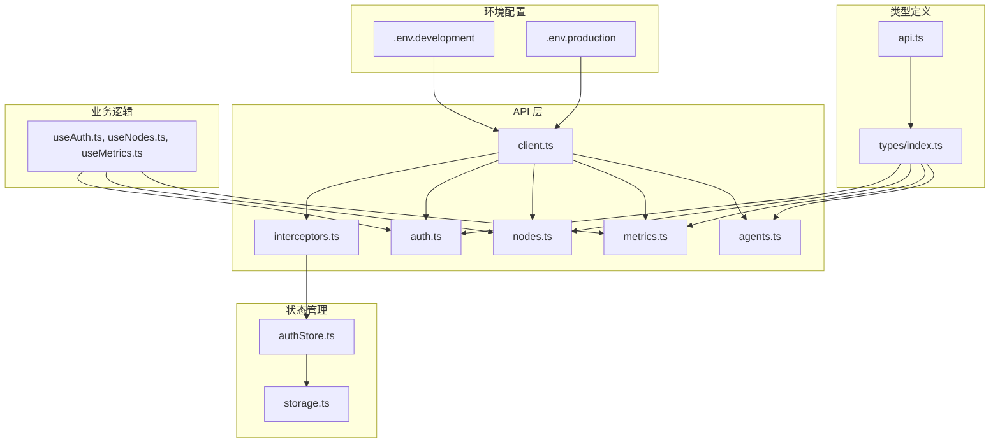
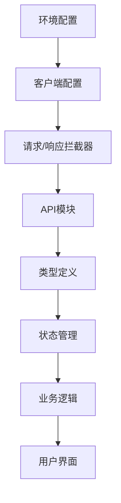
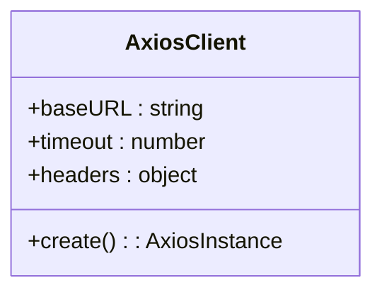
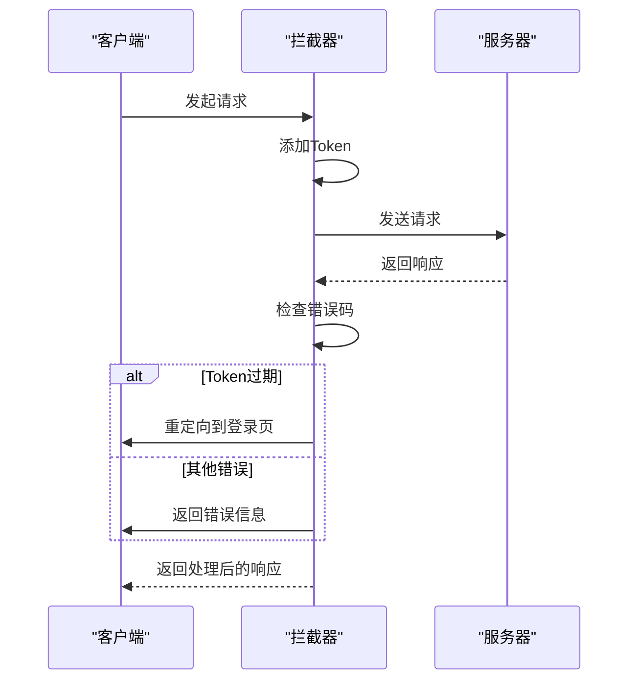
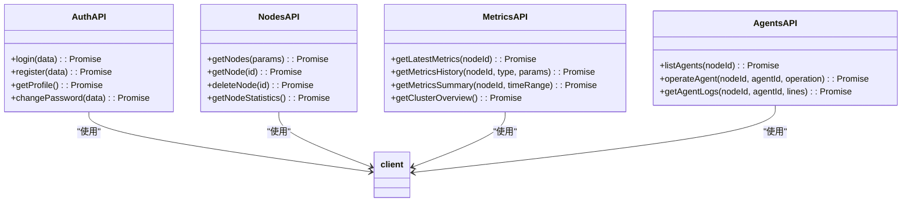
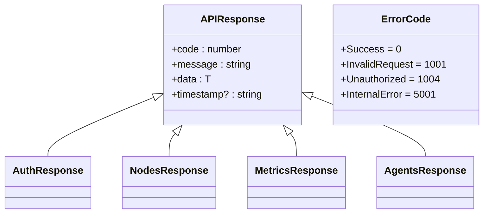
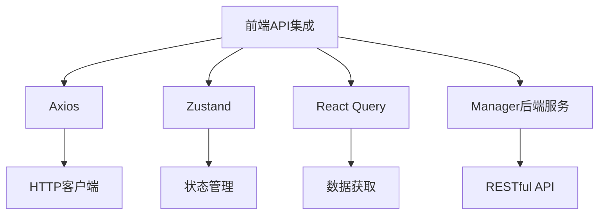

# 前端API集成

<cite>
**本文档引用的文件**  
- [client.ts](file://web/src/api/client.ts)
- [interceptors.ts](file://web/src/api/interceptors.ts)
- [auth.ts](file://web/src/api/auth.ts)
- [nodes.ts](file://web/src/api/nodes.ts)
- [metrics.ts](file://web/src/api/metrics.ts)
- [agents.ts](file://web/src/api/agents.ts)
- [api.ts](file://web/src/types/api.ts)
- [authStore.ts](file://web/src/stores/authStore.ts)
- [storage.ts](file://web/src/utils/storage.ts)
- [useAuth.ts](file://web/src/hooks/useAuth.ts)
- [useNodes.ts](file://web/src/hooks/useNodes.ts)
- [useMetrics.ts](file://web/src/hooks/useMetrics.ts)
- [.env.development](file://web/.env.development)
- [.env.production](file://web/.env.production)
- [Manager_API.md](file://docs/api/Manager_API.md)
- [Login/index.tsx](file://web/src/pages/Login/index.tsx)
</cite>

## 目录
1. [引言](#引言)
2. [项目结构](#项目结构)
3. [核心组件](#核心组件)
4. [架构概述](#架构概述)
5. [详细组件分析](#详细组件分析)
6. [依赖分析](#依赖分析)
7. [性能考虑](#性能考虑)
8. [故障排除指南](#故障排除指南)
9. [结论](#结论)
10. [附录](#附录)（如有必要）

## 引言
本文档详细描述了前端与Manager后端服务之间的通信机制，重点介绍Axios实例的配置策略、请求/响应拦截器的实现、各API模块的封装方式以及RESTful API的调用模式。文档还涵盖了错误码处理策略、重试机制和API调用的最佳实践，包括并发控制、取消请求和加载状态管理。

## 项目结构
前端API集成主要位于`web/src/api`目录下，包含客户端配置、拦截器和各个API模块。类型定义位于`web/src/types`目录，状态管理使用Zustand存储在`web/src/stores`目录中。环境变量配置在`.env.development`和`.env.production`文件中。

**图示来源**
- [client.ts](file://web/src/api/client.ts)
- [interceptors.ts](file://web/src/api/interceptors.ts)
- [auth.ts](file://web/src/api/auth.ts)
- [nodes.ts](file://web/src/api/nodes.ts)
- [metrics.ts](file://web/src/api/metrics.ts)
- [agents.ts](file://web/src/api/agents.ts)
- [api.ts](file://web/src/types/api.ts)
- [authStore.ts](file://web/src/stores/authStore.ts)
- [storage.ts](file://web/src/utils/storage.ts)
- [.env.development](file://web/.env.development)
- [.env.production](file://web/.env.production)

**本节来源**
- [client.ts](file://web/src/api/client.ts)
- [interceptors.ts](file://web/src/api/interceptors.ts)
- [auth.ts](file://web/src/api/auth.ts)
- [nodes.ts](file://web/src/api/nodes.ts)
- [metrics.ts](file://web/src/api/metrics.ts)
- [agents.ts](file://web/src/api/agents.ts)
- [api.ts](file://web/src/types/api.ts)
- [authStore.ts](file://web/src/stores/authStore.ts)
- [storage.ts](file://web/src/utils/storage.ts)
- [.env.development](file://web/.env.development)
- [.env.production](file://web/.env.production)

## 核心组件
前端API集成的核心组件包括Axios客户端实例、请求/响应拦截器、API模块封装和状态管理。这些组件共同实现了与Manager后端服务的高效通信。

**本节来源**
- [client.ts](file://web/src/api/client.ts)
- [interceptors.ts](file://web/src/api/interceptors.ts)
- [authStore.ts](file://web/src/stores/authStore.ts)

## 架构概述
前端API集成采用分层架构，从下到上依次为：环境配置层、客户端配置层、拦截器层、API模块层、类型定义层、状态管理层和业务逻辑层。这种分层架构确保了代码的可维护性和可扩展性。

**图示来源**
- [client.ts](file://web/src/api/client.ts)
- [interceptors.ts](file://web/src/api/interceptors.ts)
- [auth.ts](file://web/src/api/auth.ts)
- [nodes.ts](file://web/src/api/nodes.ts)
- [metrics.ts](file://web/src/api/metrics.ts)
- [agents.ts](file://web/src/api/agents.ts)
- [api.ts](file://web/src/types/api.ts)
- [authStore.ts](file://web/src/stores/authStore.ts)

## 详细组件分析
### Axios客户端配置
Axios客户端实例在`client.ts`文件中创建，配置了基础URL、超时设置和默认头部。基础URL和超时时间通过环境变量配置，支持开发和生产环境的不同设置。

**图示来源**
- [client.ts](file://web/src/api/client.ts)

**本节来源**
- [client.ts](file://web/src/api/client.ts)
- [.env.development](file://web/.env.development)
- [.env.production](file://web/.env.production)

### 请求/响应拦截器
请求/响应拦截器在`interceptors.ts`文件中配置，实现了JWT token自动注入、401重定向登录、错误统一处理等功能。请求拦截器从状态存储中获取token并添加到请求头，响应拦截器处理业务错误码和HTTP状态码。

**图示来源**
- [interceptors.ts](file://web/src/api/interceptors.ts)
- [authStore.ts](file://web/src/stores/authStore.ts)

**本节来源**
- [interceptors.ts](file://web/src/api/interceptors.ts)
- [authStore.ts](file://web/src/stores/authStore.ts)

### API模块封装
API模块在`auth.ts`、`nodes.ts`、`metrics.ts`和`agents.ts`文件中封装，每个模块提供一组相关的API函数。这些函数使用Axios实例发送请求，并返回Promise，确保类型安全。

**图示来源**
- [auth.ts](file://web/src/api/auth.ts)
- [nodes.ts](file://web/src/api/nodes.ts)
- [metrics.ts](file://web/src/api/metrics.ts)
- [agents.ts](file://web/src/api/agents.ts)
- [client.ts](file://web/src/api/client.ts)

**本节来源**
- [auth.ts](file://web/src/api/auth.ts)
- [nodes.ts](file://web/src/api/nodes.ts)
- [metrics.ts](file://web/src/api/metrics.ts)
- [agents.ts](file://web/src/api/agents.ts)

### 类型安全保证
类型安全通过TypeScript实现，定义在`api.ts`文件中的`APIResponse`接口和`ErrorCode`枚举确保了API响应的类型一致性。各API模块使用这些类型定义，提供编译时类型检查。

**图示来源**
- [api.ts](file://web/src/types/api.ts)

**本节来源**
- [api.ts](file://web/src/types/api.ts)

### RESTful API调用模式
RESTful API调用模式遵循标准的HTTP方法和状态码，使用`GET`、`POST`、`PUT`、`DELETE`等方法进行资源操作。API路径遵循`/api/v1/{resource}`的命名规范，支持分页和筛选。

**本节来源**
- [Manager_API.md](file://docs/api/Manager_API.md)

### 错误码处理策略
错误码处理策略在拦截器中实现，区分业务错误码和HTTP状态码。业务错误码如`Unauthorized`、`TokenExpired`等触发登录状态清除和重定向，HTTP状态码如401、403、500等返回相应的错误信息。

**本节来源**
- [interceptors.ts](file://web/src/api/interceptors.ts)
- [api.ts](file://web/src/types/api.ts)

### 重试机制
重试机制未在代码中显式实现，但通过React Query的`useQuery`和`useMutation`钩子提供了自动重试功能。例如，`useLatestMetrics`钩子配置了30秒的自动刷新间隔。

**本节来源**
- [useMetrics.ts](file://web/src/hooks/useMetrics.ts)

## 依赖分析
前端API集成依赖于Axios、Zustand、React Query等第三方库，以及Manager后端服务。这些依赖通过`package.json`文件管理，确保版本一致性。

**图示来源**
- [package.json](file://web/package.json)
- [Manager_API.md](file://docs/api/Manager_API.md)

**本节来源**
- [package.json](file://web/package.json)
- [Manager_API.md](file://docs/api/Manager_API.md)

## 性能考虑
API调用的性能考虑包括缓存策略、并发控制和加载状态管理。React Query的`staleTime`和`refetchInterval`配置了数据缓存和自动刷新，避免不必要的网络请求。

**本节来源**
- [useMetrics.ts](file://web/src/hooks/useMetrics.ts)

## 故障排除指南
常见问题包括网络连接失败、Token过期和权限不足。网络连接失败时，检查Manager服务是否启动和API地址配置是否正确。Token过期时，清除本地存储并重新登录。权限不足时，检查用户角色和权限设置。

**本节来源**
- [interceptors.ts](file://web/src/api/interceptors.ts)
- [authStore.ts](file://web/src/stores/authStore.ts)

## 结论
前端API集成通过Axios客户端、拦截器、API模块封装和状态管理，实现了与Manager后端服务的高效通信。文档详细描述了各组件的实现和最佳实践，为开发者提供了全面的参考。

## 附录
### 环境变量配置
| 变量 | 开发环境值 | 生产环境值 | 说明 |
|------|------------|------------|------|
| VITE_APP_TITLE | Ops Scaffold Framework | Ops Scaffold Framework | 应用标题 |
| VITE_API_BASE_URL | http://127.0.0.1:8080 | /api | API基础URL |
| VITE_API_TIMEOUT | 30000 | 30000 | API超时时间（毫秒） |

**本节来源**
- [.env.development](file://web/.env.development)
- [.env.production](file://web/.env.production)

### API错误码
| 错误码 | 说明 | HTTP状态码 |
|--------|------|-------------|
| 0 | 成功 | 200 |
| 1001 | 无效的参数 | 400 |
| 1004 | 未授权 | 401 |
| 1007 | 无权限 | 403 |
| 5001 | 服务器内部错误 | 500 |

**本节来源**
- [api.ts](file://web/src/types/api.ts)
- [Manager_API.md](file://docs/api/Manager_API.md)