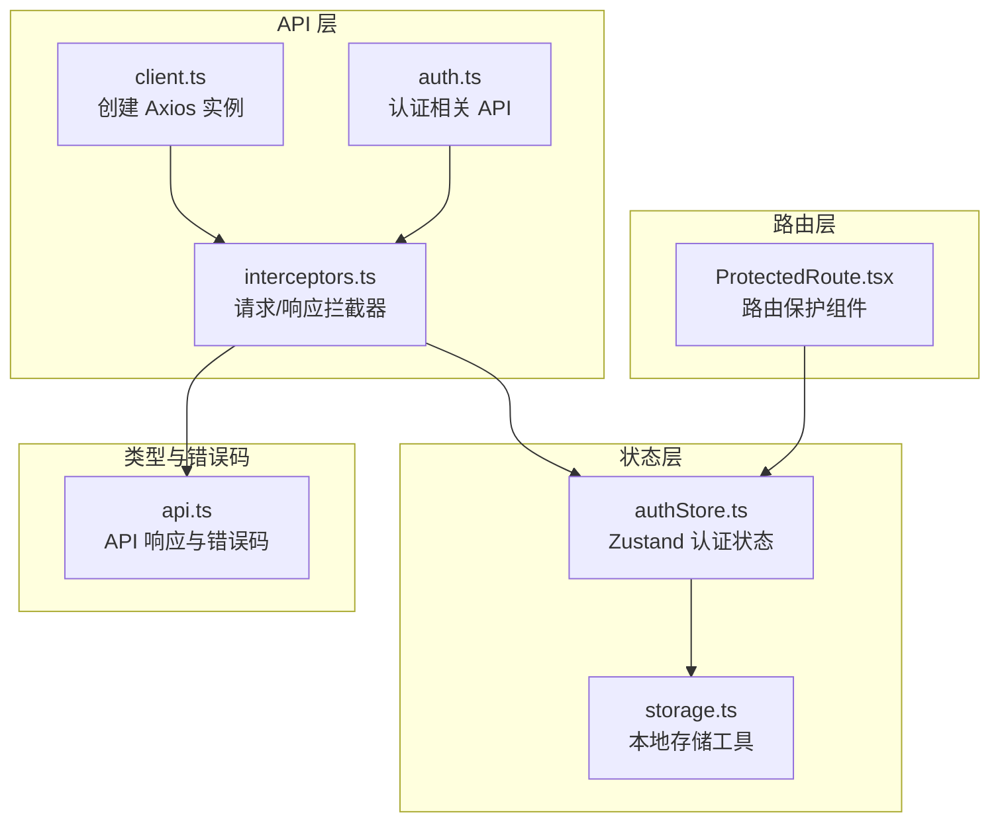
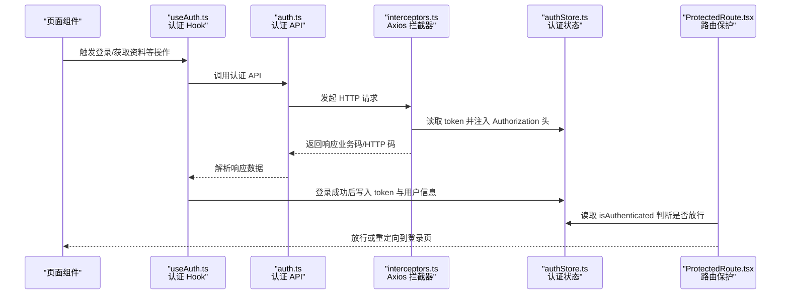
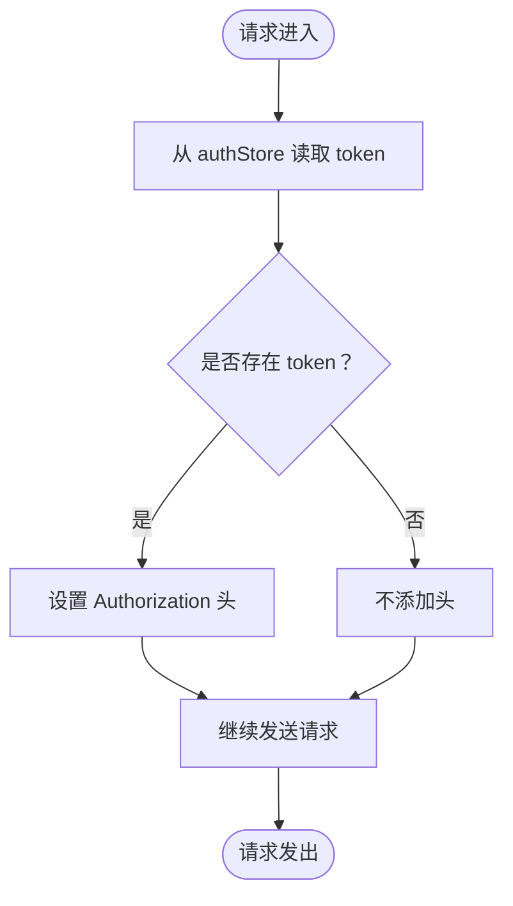
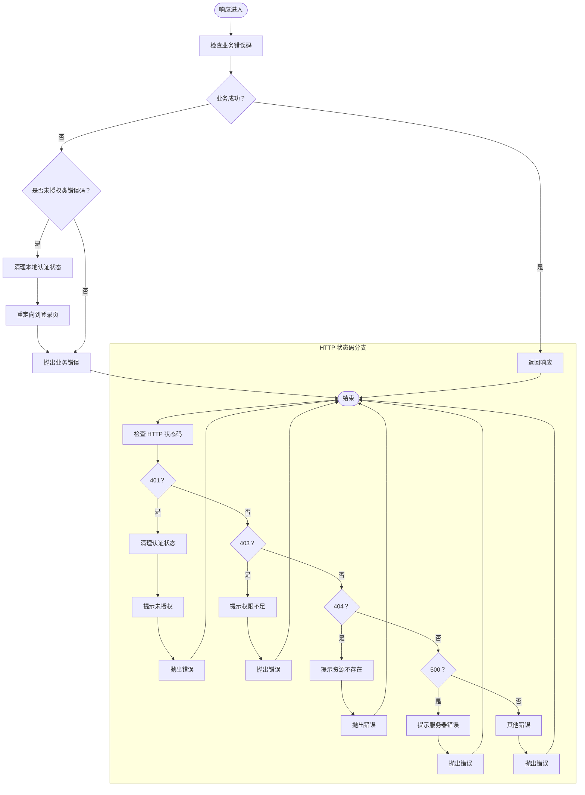
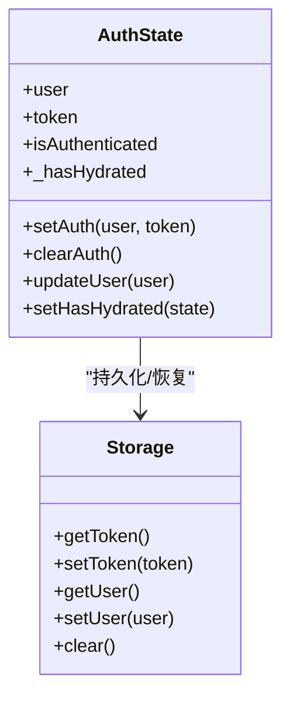
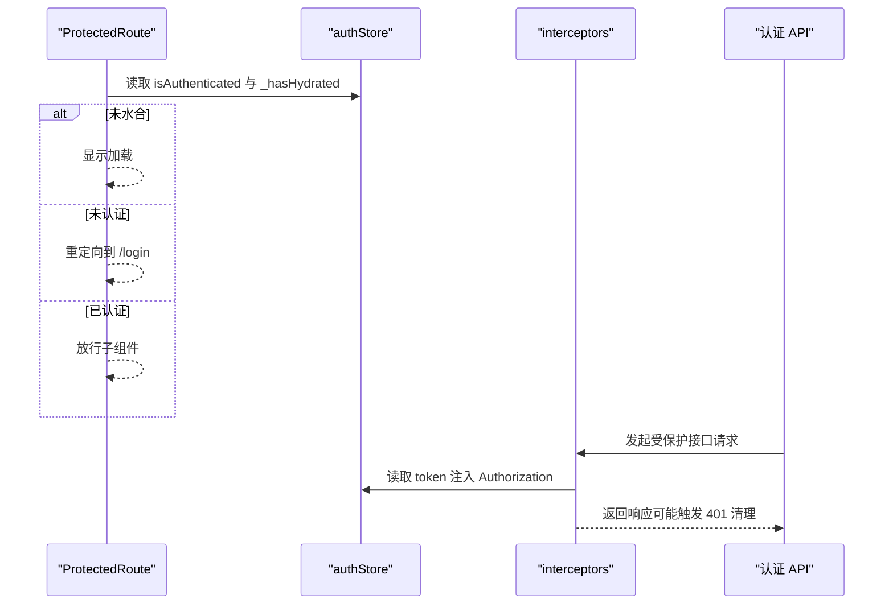
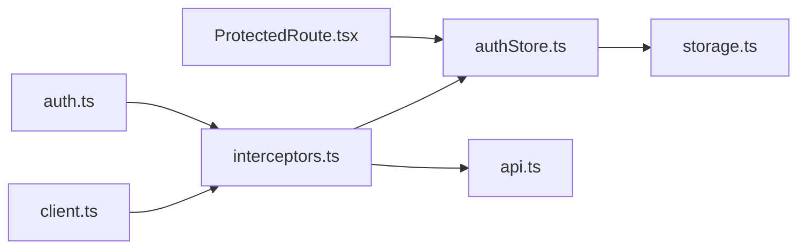

# 请求与响应拦截器

<cite>
**本文引用的文件**
- [interceptors.ts](file://web/src/api/interceptors.ts)
- [client.ts](file://web/src/api/client.ts)
- [authStore.ts](file://web/src/stores/authStore.ts)
- [ProtectedRoute.tsx](file://web/src/router/ProtectedRoute.tsx)
- [auth.ts](file://web/src/api/auth.ts)
- [useAuth.ts](file://web/src/hooks/useAuth.ts)
- [storage.ts](file://web/src/utils/storage.ts)
- [api.ts](file://web/src/types/api.ts)
</cite>

## 目录
1. [简介](#简介)
2. [项目结构](#项目结构)
3. [核心组件](#核心组件)
4. [架构总览](#架构总览)
5. [详细组件分析](#详细组件分析)
6. [依赖关系分析](#依赖关系分析)
7. [性能考量](#性能考量)
8. [故障排查指南](#故障排查指南)
9. [结论](#结论)
10. [附录](#附录)

## 简介
本文件系统性梳理前端拦截器机制，重点解析 web/src/api/interceptors.ts 中的请求与响应拦截器实现。内容覆盖：
- 请求拦截器如何从认证状态仓库读取 JWT 并自动注入 Authorization 头，实现无感认证
- 响应拦截器对 401 未授权等状态的处理流程，包括清理本地认证状态与重定向至登录页
- 全局错误提示与 HTTP 状态码统一处理（400、403、404、500）
- 请求防抖机制说明（当前实现未内置防抖，但可按需扩展）
- 与 ProtectedRoute 路由鉴权的协同工作机制
- 自定义拦截逻辑的扩展指导

## 项目结构
拦截器位于 API 层，围绕 Axios 客户端实例进行统一配置；认证状态由 Zustand store 管理；路由守卫负责页面级鉴权；登录与认证 API 通过拦截器后的客户端发起请求。

图表来源
- [client.ts](file://web/src/api/client.ts#L1-L18)
- [interceptors.ts](file://web/src/api/interceptors.ts#L1-L95)
- [auth.ts](file://web/src/api/auth.ts#L1-L43)
- [authStore.ts](file://web/src/stores/authStore.ts#L1-L85)
- [storage.ts](file://web/src/utils/storage.ts#L1-L48)
- [ProtectedRoute.tsx](file://web/src/router/ProtectedRoute.tsx#L1-L38)
- [api.ts](file://web/src/types/api.ts#L1-L55)

章节来源
- [client.ts](file://web/src/api/client.ts#L1-L18)
- [interceptors.ts](file://web/src/api/interceptors.ts#L1-L95)
- [authStore.ts](file://web/src/stores/authStore.ts#L1-L85)
- [ProtectedRoute.tsx](file://web/src/router/ProtectedRoute.tsx#L1-L38)
- [auth.ts](file://web/src/api/auth.ts#L1-L43)
- [api.ts](file://web/src/types/api.ts#L1-L55)

## 核心组件
- Axios 客户端实例：在 client.ts 中创建，包含基础 baseURL、超时与默认头
- 请求拦截器：在 interceptors.ts 中为每个请求注入 Authorization 头
- 响应拦截器：统一处理业务错误码与 HTTP 状态码，触发登出与重定向
- 认证状态仓库：在 authStore.ts 中维护 token、user、isAuthenticated，并持久化
- 路由保护组件：在 ProtectedRoute.tsx 中基于认证状态控制页面访问
- 认证 API：在 auth.ts 中封装登录、注册、获取资料等接口，使用拦截器后的客户端

章节来源
- [client.ts](file://web/src/api/client.ts#L1-L18)
- [interceptors.ts](file://web/src/api/interceptors.ts#L1-L95)
- [authStore.ts](file://web/src/stores/authStore.ts#L1-L85)
- [ProtectedRoute.tsx](file://web/src/router/ProtectedRoute.tsx#L1-L38)
- [auth.ts](file://web/src/api/auth.ts#L1-L43)

## 架构总览
下图展示从页面发起请求到拦截器处理再到路由守卫的整体流程。

图表来源
- [auth.ts](file://web/src/api/auth.ts#L1-L43)
- [interceptors.ts](file://web/src/api/interceptors.ts#L1-L95)
- [authStore.ts](file://web/src/stores/authStore.ts#L1-L85)
- [ProtectedRoute.tsx](file://web/src/router/ProtectedRoute.tsx#L1-L38)
- [useAuth.ts](file://web/src/hooks/useAuth.ts#L1-L58)

## 详细组件分析

### 请求拦截器：无感认证与 Authorization 头注入
- 作用：在每次请求前从认证状态仓库读取 token，并将其放入 Authorization 头
- 关键点：
  - 从 authStore 中读取 token
  - 将 Bearer token 写入请求头
  - 对于无 token 的请求保持不变
- 与认证流程的关系：
  - 登录成功后，通过 useAuth 的 mutation 将 token 与用户信息写入 authStore
  - 后续请求自动携带 Authorization 头，实现无感认证

图表来源
- [interceptors.ts](file://web/src/api/interceptors.ts#L1-L30)
- [authStore.ts](file://web/src/stores/authStore.ts#L1-L85)

章节来源
- [interceptors.ts](file://web/src/api/interceptors.ts#L1-L30)
- [authStore.ts](file://web/src/stores/authStore.ts#L1-L85)
- [useAuth.ts](file://web/src/hooks/useAuth.ts#L1-L58)

### 响应拦截器：业务错误码与 HTTP 状态码统一处理
- 业务错误码处理：
  - 当响应 code 不等于成功码时，抛出错误
  - 若 code 属于未授权类（Unauthorized、TokenExpired、TokenInvalid、InvalidToken），则清理本地认证状态并重定向到登录页
- HTTP 状态码处理：
  - 401：清理认证状态并提示“未授权，请重新登录”
  - 403：提示“没有权限访问”
  - 404：提示“请求的资源不存在”
  - 500：提示“服务器内部错误”
  - 其他网络错误：拼接 baseURL 与 url 提示，引导检查服务、配置与网络
- 统一错误提示：
  - 所有错误均以 Promise.reject 形式抛出，调用方可通过错误处理逻辑统一提示

图表来源
- [interceptors.ts](file://web/src/api/interceptors.ts#L31-L92)
- [api.ts](file://web/src/types/api.ts#L1-L55)

章节来源
- [interceptors.ts](file://web/src/api/interceptors.ts#L31-L92)
- [api.ts](file://web/src/types/api.ts#L1-L55)

### 认证状态仓库：持久化与水合
- 状态字段：user、token、isAuthenticated、_hasHydrated
- 行为：
  - setAuth：写入用户与 token，并标记已认证
  - clearAuth：清空用户与 token，并标记未认证
  - updateUser：更新用户信息
  - 持久化：使用 localStorage 存储 token 与用户信息
  - 水合：从持久化存储恢复后，根据 user 与 token 计算 isAuthenticated，并标记水合完成
- 与拦截器协作：
  - 请求拦截器读取 token 注入头
  - 响应拦截器在未授权时调用 clearAuth 清理状态

图表来源
- [authStore.ts](file://web/src/stores/authStore.ts#L1-L85)
- [storage.ts](file://web/src/utils/storage.ts#L1-L48)

章节来源
- [authStore.ts](file://web/src/stores/authStore.ts#L1-L85)
- [storage.ts](file://web/src/utils/storage.ts#L1-L48)

### 路由保护组件：与拦截器的协同
- 保护逻辑：
  - 在水合完成前显示加载态
  - 未认证时重定向到登录页
  - 已认证时放行子组件
- 与拦截器的配合：
  - 响应拦截器在 401 时清理本地状态，ProtectedRoute 读取 isAuthenticated 判断是否放行
  - 登录成功后 setAuth 写入 token，后续请求自动携带 Authorization 头

图表来源
- [ProtectedRoute.tsx](file://web/src/router/ProtectedRoute.tsx#L1-L38)
- [interceptors.ts](file://web/src/api/interceptors.ts#L1-L95)
- [auth.ts](file://web/src/api/auth.ts#L1-L43)

章节来源
- [ProtectedRoute.tsx](file://web/src/router/ProtectedRoute.tsx#L1-L38)
- [interceptors.ts](file://web/src/api/interceptors.ts#L1-L95)
- [auth.ts](file://web/src/api/auth.ts#L1-L43)

### 认证 API 与 Hook：登录成功后的状态更新
- 登录成功后，useAuth 的 mutation 会调用 setAuth，将 token 与用户信息写入 authStore
- 后续请求自动携带 Authorization 头，无需手动处理

章节来源
- [auth.ts](file://web/src/api/auth.ts#L1-L43)
- [useAuth.ts](file://web/src/hooks/useAuth.ts#L1-L58)
- [authStore.ts](file://web/src/stores/authStore.ts#L1-L85)

## 依赖关系分析
- client.ts 作为 Axios 实例，被 interceptors.ts 引用并配置拦截器
- interceptors.ts 依赖：
  - authStore.ts：读取 token 注入 Authorization
  - api.ts：使用 ErrorCode 枚举判断业务错误码
  - auth.ts：认证 API 使用拦截器后的客户端
- ProtectedRoute.tsx 依赖 authStore.ts 的认证状态进行页面级鉴权
- storage.ts 为 authStore.ts 的持久化工具

图表来源
- [client.ts](file://web/src/api/client.ts#L1-L18)
- [interceptors.ts](file://web/src/api/interceptors.ts#L1-L95)
- [authStore.ts](file://web/src/stores/authStore.ts#L1-L85)
- [ProtectedRoute.tsx](file://web/src/router/ProtectedRoute.tsx#L1-L38)
- [auth.ts](file://web/src/api/auth.ts#L1-L43)
- [api.ts](file://web/src/types/api.ts#L1-L55)
- [storage.ts](file://web/src/utils/storage.ts#L1-L48)

章节来源
- [client.ts](file://web/src/api/client.ts#L1-L18)
- [interceptors.ts](file://web/src/api/interceptors.ts#L1-L95)
- [authStore.ts](file://web/src/stores/authStore.ts#L1-L85)
- [ProtectedRoute.tsx](file://web/src/router/ProtectedRoute.tsx#L1-L38)
- [auth.ts](file://web/src/api/auth.ts#L1-L43)
- [api.ts](file://web/src/types/api.ts#L1-L55)
- [storage.ts](file://web/src/utils/storage.ts#L1-L48)

## 性能考量
- 请求头注入成本极低，几乎不影响性能
- 响应拦截器在错误路径上进行状态清理与重定向，属于异常路径，不会影响正常请求吞吐
- 当前未内置请求防抖机制。若需要，可在调用层或自定义拦截器中增加去抖策略（例如基于 URL 或请求体的缓存键）

[本节为通用建议，不直接分析具体文件]

## 故障排查指南
- 401 未授权
  - 现象：拦截器检测到未授权类业务错误码或 HTTP 401，清理本地认证状态并重定向到登录页
  - 排查要点：确认 token 是否过期或失效；检查服务端 JWT 签发与校验逻辑
- 403 禁止访问
  - 现象：提示“没有权限访问”，通常为权限不足
  - 排查要点：确认用户角色与接口权限映射
- 404 资源不存在
  - 现象：提示“请求的资源不存在”
  - 排查要点：确认接口路径与参数
- 500 服务器内部错误
  - 现象：提示“服务器内部错误”
  - 排查要点：查看服务端日志与数据库状态
- 网络错误
  - 现象：提示无法连接到服务器，包含 baseURL 与 url 信息
  - 排查要点：确认服务端是否启动、API 地址配置是否正确、防火墙与网络设置

章节来源
- [interceptors.ts](file://web/src/api/interceptors.ts#L55-L92)
- [api.ts](file://web/src/types/api.ts#L1-L55)

## 结论
该拦截器机制通过“请求自动注入 Authorization 头 + 响应统一错误处理”的方式，实现了无感认证与一致化的错误体验。结合路由保护组件，形成从前端请求到页面访问的完整鉴权闭环。对于未来扩展，可在调用层或自定义拦截器中引入请求防抖、重试与日志上报等能力。

[本节为总结性内容，不直接分析具体文件]

## 附录

### 自定义拦截逻辑扩展指导
- 新增请求拦截器：在 interceptors.ts 中新增 request 拦截器，用于统一处理请求前逻辑（如埋点、签名、重试策略等）
- 新增响应拦截器：在 interceptors.ts 中新增 response 拦截器，用于统一处理响应后逻辑（如统一日志、错误上报、数据转换等）
- 与路由守卫联动：在业务侧根据错误类型决定是否触发 ProtectedRoute 的重定向逻辑
- 注意事项：
  - 保持拦截器链路清晰，避免重复处理
  - 对异常路径进行幂等处理，防止重复清理状态
  - 在调用层捕获 Promise.reject 并统一提示

章节来源
- [interceptors.ts](file://web/src/api/interceptors.ts#L1-L95)
- [ProtectedRoute.tsx](file://web/src/router/ProtectedRoute.tsx#L1-L38)