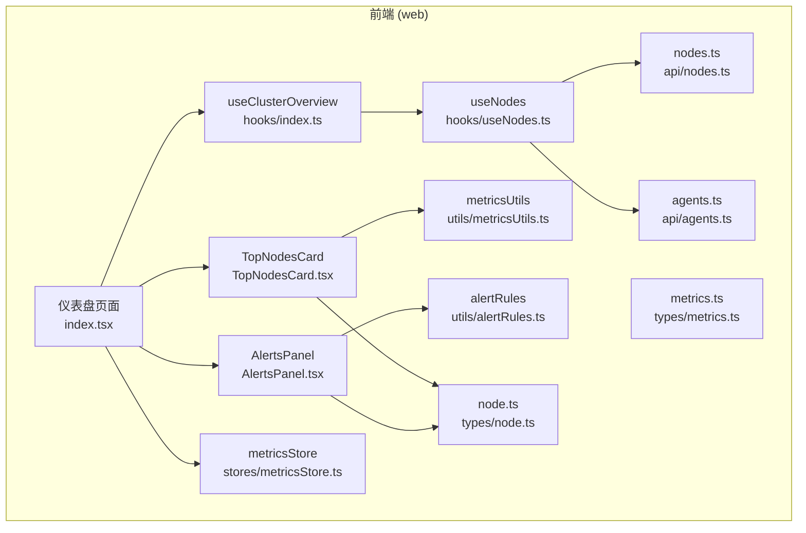
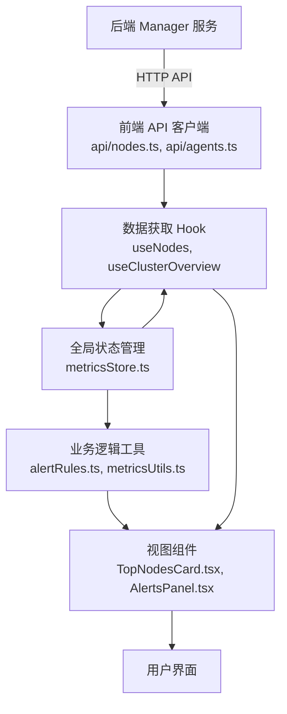
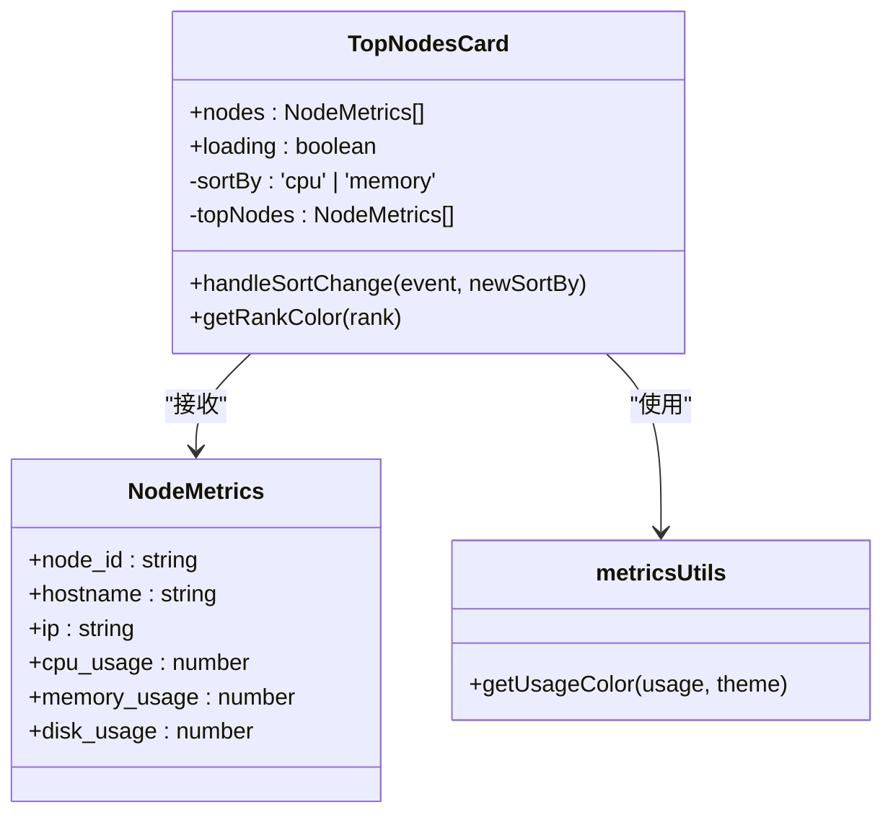
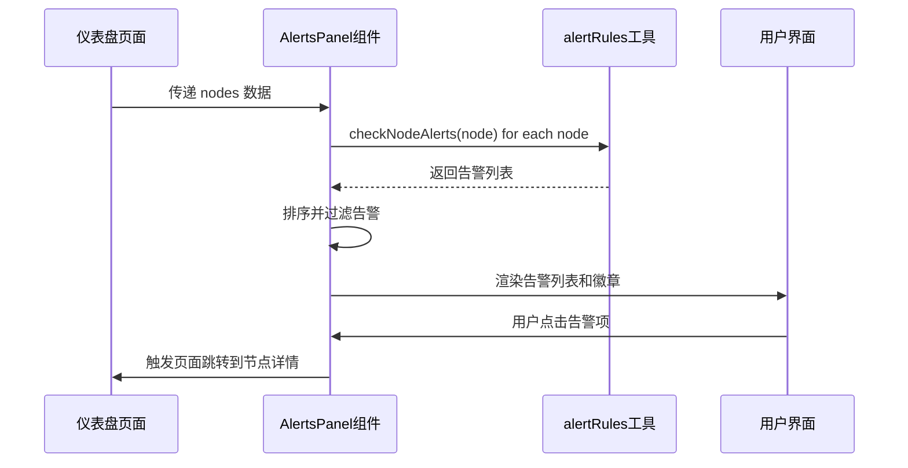
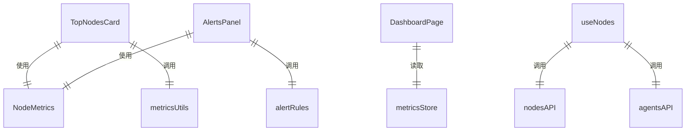

# 仪表盘业务组件

<cite>
**本文档引用的文件**   
- [TopNodesCard.tsx](file://web/src/components/Dashboard/TopNodesCard.tsx)
- [AlertsPanel.tsx](file://web/src/components/Dashboard/AlertsPanel.tsx)
- [useNodes.ts](file://web/src/hooks/useNodes.ts)
- [nodes.ts](file://web/src/api/nodes.ts)
- [agents.ts](file://web/src/api/agents.ts)
- [alertRules.ts](file://web/src/utils/alertRules.ts)
- [metricsUtils.ts](file://web/src/utils/metricsUtils.ts)
- [node.ts](file://web/src/types/node.ts)
- [metrics.ts](file://web/src/types/metrics.ts)
- [metricsStore.ts](file://web/src/stores/metricsStore.ts)
- [index.tsx](file://web/src/pages/Dashboard/index.tsx)
</cite>

## 目录
1. [简介](#简介)
2. [项目结构](#项目结构)
3. [核心组件](#核心组件)
4. [架构概述](#架构概述)
5. [详细组件分析](#详细组件分析)
6. [依赖分析](#依赖分析)
7. [性能考虑](#性能考虑)
8. [故障排除指南](#故障排除指南)
9. [结论](#结论)

## 简介
本文档详细介绍了运维监控系统中的两个核心仪表盘业务组件：TopNodesCard 和 AlertsPanel。这两个组件为系统管理员提供了关键的集群监控视图，帮助快速识别资源使用热点和潜在的系统告警。TopNodesCard 组件展示资源使用率最高的前五个节点，支持按 CPU 或内存使用率排序，并提供直观的视觉反馈。AlertsPanel 组件集中显示系统中的所有告警信息，根据严重级别进行排序和过滤，确保关键问题能够被优先处理。文档将深入分析这两个组件的数据来源、渲染逻辑、交互行为以及它们与全局状态管理和 API 服务的集成方式。

## 项目结构
仪表盘业务组件位于前端代码库的 `web/src/components/Dashboard/` 目录下，是整个监控系统用户界面的核心部分。这些组件通过一系列精心设计的模块与后端服务进行交互，包括 API 客户端、数据获取 Hook、状态管理 Store 和工具函数。组件的调用方是位于 `web/src/pages/Dashboard/` 目录下的主仪表盘页面，该页面负责协调数据流并渲染这些业务组件。

**Diagram sources**
- [index.tsx](file://web/src/pages/Dashboard/index.tsx)
- [TopNodesCard.tsx](file://web/src/components/Dashboard/TopNodesCard.tsx)
- [AlertsPanel.tsx](file://web/src/components/Dashboard/AlertsPanel.tsx)
- [useNodes.ts](file://web/src/hooks/useNodes.ts)
- [nodes.ts](file://web/src/api/nodes.ts)
- [agents.ts](file://web/src/api/agents.ts)
- [metricsStore.ts](file://web/src/stores/metricsStore.ts)
- [alertRules.ts](file://web/src/utils/alertRules.ts)
- [metricsUtils.ts](file://web/src/utils/metricsUtils.ts)
- [node.ts](file://web/src/types/node.ts)
- [metrics.ts](file://web/src/types/metrics.ts)

**Section sources**
- [index.tsx](file://web/src/pages/Dashboard/index.tsx)
- [TopNodesCard.tsx](file://web/src/components/Dashboard/TopNodesCard.tsx)
- [AlertsPanel.tsx](file://web/src/components/Dashboard/AlertsPanel.tsx)

## 核心组件
本节将深入分析 TopNodesCard 和 AlertsPanel 这两个核心业务组件。TopNodesCard 组件通过 `useNodes` Hook 从 `api/nodes` 模块获取节点数据，利用 `useMemo` 进行高效的排序计算，并通过 `useNavigate` 实现点击节点后的页面跳转。其渲染逻辑包括一个排序切换的按钮组，允许用户在 CPU 和内存使用率之间切换排序维度。组件根据排序结果展示前五个节点的排名、主机名、IP 地址和资源使用率，并使用颜色编码的进度条直观地表示使用率高低。

AlertsPanel 组件同样接收节点数据，它依赖 `utils/alertRules` 模块中的 `checkNodeAlerts` 函数来分析每个节点的指标并生成告警列表。该组件实现了状态过滤功能，自动排除状态为 "normal" 的告警，并按 "critical" 和 "warning" 的严重级别进行排序。其渲染逻辑包括一个显示告警总数的徽章，该徽章的颜色根据是否存在严重告警动态变化。告警列表本身会截取前十个告警进行展示，并在告警过多时提示用户还有更多未显示的告警。

**Section sources**
- [TopNodesCard.tsx](file://web/src/components/Dashboard/TopNodesCard.tsx)
- [AlertsPanel.tsx](file://web/src/components/Dashboard/AlertsPanel.tsx)
- [useNodes.ts](file://web/src/hooks/useNodes.ts)
- [alertRules.ts](file://web/src/utils/alertRules.ts)

## 架构概述
这两个组件共同构成了仪表盘的核心监控视图，它们与系统的其他部分形成了清晰的架构关系。数据流始于后端 Manager 服务，通过 RESTful API 暴露节点和指标数据。前端通过 `api/nodes` 和 `api/agents` 模块封装了这些 API 调用。`useNodes` 等自定义 Hook 利用 React Query 库管理数据获取、缓存和状态。`stores/metricsStore` 使用 Zustand 管理全局的监控状态，如刷新间隔。`utils` 目录下的工具函数则负责业务逻辑的计算，如告警判断和颜色映射。最终，`TopNodesCard` 和 `AlertsPanel` 组件作为视图层，消费这些数据和状态，向用户呈现关键信息。

**Diagram sources**
- [nodes.ts](file://web/src/api/nodes.ts)
- [agents.ts](file://web/src/api/agents.ts)
- [useNodes.ts](file://web/src/hooks/useNodes.ts)
- [metricsStore.ts](file://web/src/stores/metricsStore.ts)
- [alertRules.ts](file://web/src/utils/alertRules.ts)
- [metricsUtils.ts](file://web/src/utils/metricsUtils.ts)
- [TopNodesCard.tsx](file://web/src/components/Dashboard/TopNodesCard.tsx)
- [AlertsPanel.tsx](file://web/src/components/Dashboard/AlertsPanel.tsx)

## 详细组件分析
### TopNodesCard 分析
TopNodesCard 组件是一个功能丰富的数据展示卡片，它为用户提供了一个快速了解集群中资源消耗最严重节点的窗口。该组件的核心功能是展示和排序。

#### 数据来源与处理
组件通过其 `nodes` 属性接收一个 `NodeMetrics` 对象数组。这些数据通常由父组件（如仪表盘页面）通过 `useNodes` Hook 从 `api/nodes` 模块获取。组件内部使用 `useMemo` Hook 来优化排序逻辑。`useMemo` 会监听 `nodes` 数组和当前的 `sortBy` 状态，仅当这两者之一发生变化时，才会重新执行排序计算。排序算法根据用户选择的维度（CPU 或内存）对节点进行降序排列，并使用 `slice(0, 5)` 方法截取排名前五的节点。

#### 渲染逻辑与交互
组件的渲染分为三个主要部分：标题区、操作区和内容区。标题区显示固定的“Top 5 资源使用节点”文本。操作区包含一个 `ToggleButtonGroup`，允许用户在“CPU”和“内存”之间切换排序维度。这个交互通过 `handleSortChange` 回调函数实现，该函数会更新组件的 `sortBy` 状态。内容区是一个 `List`，它遍历 `topNodes` 数组并为每个节点渲染一个 `ListItem`。每个列表项包含一个圆形的排名序号（1-5），使用 `getRankColor` 函数根据排名返回不同的颜色（金、银、铜）。节点的主机名和 IP 地址作为主要和次要文本显示。最后，一个 `LinearProgress` 组件以颜色编码的方式（通过 `getUsageColor` 函数）和百分比文本展示该节点的资源使用率。整个列表项是可点击的，点击后会通过 `useNavigate` 导航到该节点的详情页面。

**Diagram sources**
- [TopNodesCard.tsx](file://web/src/components/Dashboard/TopNodesCard.tsx)
- [node.ts](file://web/src/types/node.ts)
- [metricsUtils.ts](file://web/src/utils/metricsUtils.ts)

**Section sources**
- [TopNodesCard.tsx](file://web/src/components/Dashboard/TopNodesCard.tsx)
- [node.ts](file://web/src/types/node.ts)
- [metricsUtils.ts](file://web/src/utils/metricsUtils.ts)

### AlertsPanel 分析
AlertsPanel 组件是系统的告警中心，负责聚合、过滤和展示来自所有节点的潜在问题。

#### 告警信息展示机制
组件同样接收 `nodes` 属性。其核心逻辑在于 `useMemo` 计算的 `alerts` 和 `activeAlerts` 变量。`alerts` 变量通过 `flatMap` 方法遍历所有节点，并调用 `utils/alertRules` 中的 `checkNodeAlerts` 函数。该函数会检查每个节点的 CPU、内存和磁盘使用率，并根据预设的阈值（如 CPU > 90% 为严重）生成相应的告警对象。生成的告警列表会根据严重级别（critical, warning, normal）进行排序。`activeAlerts` 变量则通过 `filter` 方法过滤掉所有状态为 "normal" 的告警，只保留需要关注的警告和严重告警。

#### 状态过滤与自动刷新
状态过滤是通过 `activeAlerts` 的计算逻辑实现的。自动刷新功能并非由 AlertsPanel 组件直接控制，而是由其父组件（仪表盘页面）通过 `useClusterOverview` Hook 实现。该 Hook 会根据 `metricsStore` 中的 `refreshInterval` 设置，定期重新获取数据，从而间接地实现了告警信息的自动刷新。

#### 通知样式设计
组件的视觉设计旨在突出告警的严重性。标题区右侧的 `Badge` 组件显示 `activeAlerts` 的总数，其颜色由 `hasCritical` 变量决定：如果存在严重告警，则为红色（error）；如果只有警告，则为黄色（warning）；否则为默认颜色。告警列表中的每一项都使用 MUI 的 `Alert` 组件进行渲染，其 `severity` 属性同样根据告警级别设置为 "error" 或 "warning"，从而在视觉上形成强烈的区分。列表项的布局清晰，依次显示主机名、具体的指标类型和当前值、以及告警消息。当告警数量超过10个时，组件会显示一个提示文本，告知用户还有更多未显示的告警。

**Diagram sources**
- [AlertsPanel.tsx](file://web/src/components/Dashboard/AlertsPanel.tsx)
- [alertRules.ts](file://web/src/utils/alertRules.ts)
- [index.tsx](file://web/src/pages/Dashboard/index.tsx)

**Section sources**
- [AlertsPanel.tsx](file://web/src/components/Dashboard/AlertsPanel.tsx)
- [alertRules.ts](file://web/src/utils/alertRules.ts)

## 依赖分析
TopNodesCard 和 AlertsPanel 组件与系统的多个模块存在紧密的依赖关系。它们直接依赖于 `types` 目录下的 `node.ts` 和 `metrics.ts` 文件，以确保接收到的数据结构是正确的。它们通过 `utils` 目录下的 `metricsUtils.ts` 和 `alertRules.ts` 文件获取业务逻辑支持，这遵循了关注点分离的原则。在数据获取层面，它们间接依赖于 `api/nodes.ts` 和 `api/agents.ts` 模块，这些模块由 `useNodes` Hook 调用。在状态管理方面，它们与 `stores/metricsStore.ts` 存在间接依赖，因为自动刷新功能依赖于该 Store 中的 `refreshInterval` 状态。这种依赖结构清晰，使得组件本身保持了相对的独立性和可测试性。

**Diagram sources**
- [TopNodesCard.tsx](file://web/src/components/Dashboard/TopNodesCard.tsx)
- [AlertsPanel.tsx](file://web/src/components/Dashboard/AlertsPanel.tsx)
- [node.ts](file://web/src/types/node.ts)
- [metrics.ts](file://web/src/types/metrics.ts)
- [metricsUtils.ts](file://web/src/utils/metricsUtils.ts)
- [alertRules.ts](file://web/src/utils/alertRules.ts)
- [metricsStore.ts](file://web/src/stores/metricsStore.ts)
- [nodes.ts](file://web/src/api/nodes.ts)
- [agents.ts](file://web/src/api/agents.ts)

**Section sources**
- [TopNodesCard.tsx](file://web/src/components/Dashboard/TopNodesCard.tsx)
- [AlertsPanel.tsx](file://web/src/components/Dashboard/AlertsPanel.tsx)
- [metricsUtils.ts](file://web/src/utils/metricsUtils.ts)
- [alertRules.ts](file://web/src/utils/alertRules.ts)
- [metricsStore.ts](file://web/src/stores/metricsStore.ts)
- [nodes.ts](file://web/src/api/nodes.ts)
- [agents.ts](file://web/src/api/agents.ts)

## 性能考虑
在监控场景下，这两个组件的性能表现至关重要，尤其是在节点数量庞大的情况下。目前的实现已经应用了一些优化策略，例如使用 `useMemo` 来避免不必要的排序和告警计算。然而，仍有进一步的优化空间。

对于 TopNodesCard，当集群节点数量极大时，即使只展示前5个，对整个 `nodes` 数组进行排序的开销也可能变得显著。一个潜在的优化是，将排序和截取的逻辑下推到后端 API，让 `api/nodes` 接口直接提供已排序的 Top N 节点，从而减少前端的计算负担和数据传输量。

对于 AlertsPanel，当系统中存在大量告警时，渲染一个包含数十甚至上百个条目的列表可能会导致页面卡顿。一个有效的优化方案是实现虚拟滚动（Virtual Scrolling）。通过只渲染当前可见区域内的告警项，可以极大地提升列表的滚动性能。此外，可以考虑对告警进行更精细的分页或分组，而不是简单地截取前10个。

另一个通用的优化是数据节流（Throttling）。虽然自动刷新由父组件控制，但可以引入节流机制，确保即使 `refreshInterval` 设置得很短，API 调用也不会过于频繁，从而减轻后端和网络的压力。

## 故障排除指南
当 TopNodesCard 或 AlertsPanel 组件出现问题时，可以按照以下步骤进行排查：

1.  **检查数据获取**：首先确认父组件（如仪表盘页面）是否成功获取了节点数据。检查浏览器开发者工具的网络面板，查看 `/api/v1/nodes` 等 API 请求是否成功（HTTP 200），响应数据是否包含预期的节点列表。
2.  **检查组件属性**：确认 `TopNodesCard` 和 `AlertsPanel` 组件是否正确地接收到了 `nodes` 属性。可以在组件内部添加临时的 `console.log` 语句来验证。
3.  **检查告警规则**：如果 AlertsPanel 没有显示预期的告警，检查 `utils/alertRules.ts` 中的阈值设置是否正确。确保节点的指标数据（如 CPU 使用率）确实超过了告警阈值。
4.  **检查状态管理**：如果自动刷新没有生效，检查 `stores/metricsStore.ts` 中的 `refreshInterval` 状态是否被正确设置和更新。
5.  **检查 API 客户端**：如果所有 API 请求都失败，检查 `api/interceptors.ts` 中的请求拦截器，确认 Token 是否正确附加，以及响应拦截器是否因错误码（如 401）而重定向。

**Section sources**
- [index.tsx](file://web/src/pages/Dashboard/index.tsx)
- [TopNodesCard.tsx](file://web/src/components/Dashboard/TopNodesCard.tsx)
- [AlertsPanel.tsx](file://web/src/components/Dashboard/AlertsPanel.tsx)
- [alertRules.ts](file://web/src/utils/alertRules.ts)
- [metricsStore.ts](file://web/src/stores/metricsStore.ts)
- [interceptors.ts](file://web/src/api/interceptors.ts)

## 结论
TopNodesCard 和 AlertsPanel 是运维监控系统仪表盘中不可或缺的两个业务组件。它们通过清晰的设计和合理的架构，有效地将复杂的集群状态转化为直观、可操作的用户界面。TopNodesCard 通过排序和视觉编码，帮助管理员快速定位资源瓶颈。AlertsPanel 则通过聚合和分级，确保关键问题不会被淹没在大量信息中。这两个组件与系统的 API 服务、状态管理和工具函数紧密集成，形成了一个高效的数据展示闭环。未来，通过引入后端排序、虚拟滚动和数据节流等优化措施，可以进一步提升其在大规模监控场景下的性能和用户体验。