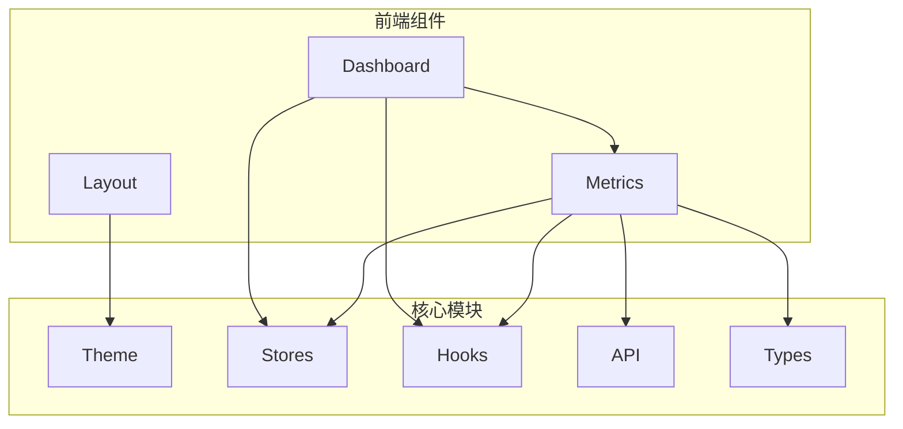
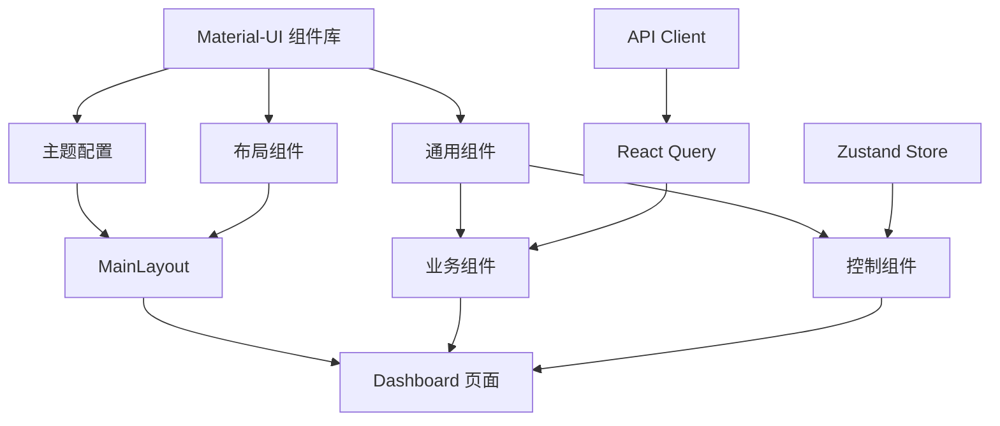
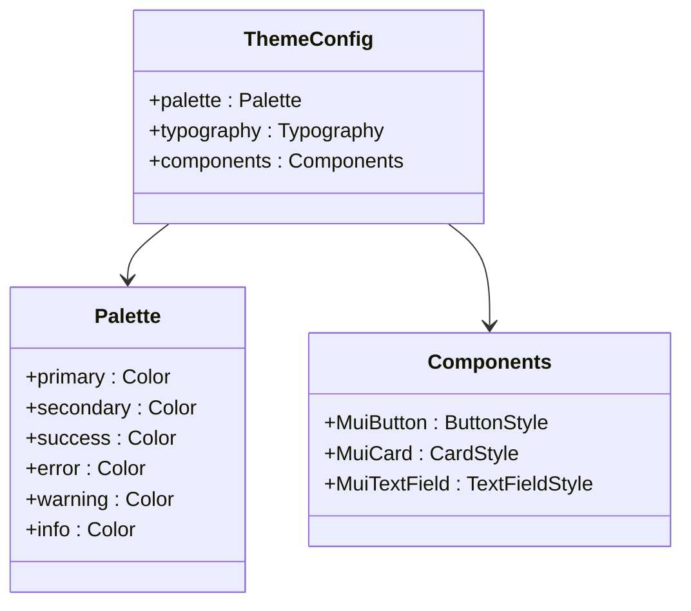
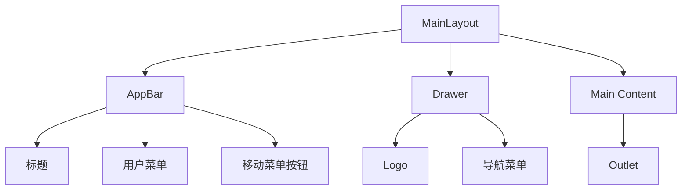
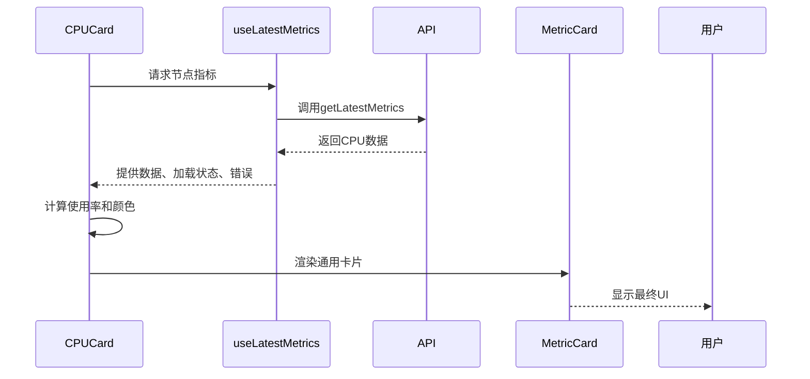
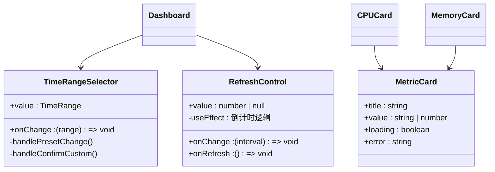
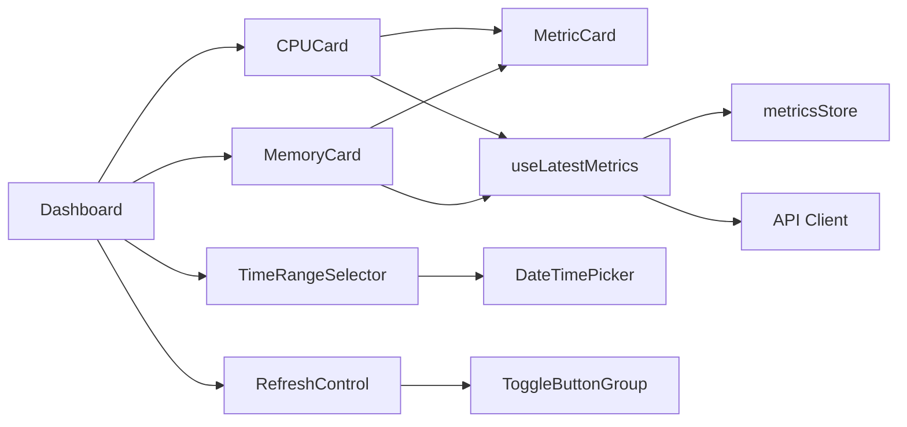

# 前端UI组件体系

<cite>
**本文档引用文件**  
- [theme/index.ts](file://web/src/theme/index.ts)
- [components/Layout/MainLayout.tsx](file://web/src/components/Layout/MainLayout.tsx)
- [components/Metrics/CPUCard.tsx](file://web/src/components/Metrics/CPUCard.tsx)
- [components/Metrics/MemoryCard.tsx](file://web/src/components/Metrics/MemoryCard.tsx)
- [components/Metrics/MetricsChart.tsx](file://web/src/components/Metrics/MetricsChart.tsx)
- [components/Metrics/RefreshControl.tsx](file://web/src/components/Metrics/RefreshControl.tsx)
- [components/Metrics/TimeRangeSelector.tsx](file://web/src/components/Metrics/TimeRangeSelector.tsx)
- [components/Metrics/MetricCard.tsx](file://web/src/components/Metrics/MetricCard.tsx)
- [utils/metricsUtils.ts](file://web/src/utils/metricsUtils.ts)
- [hooks/useMetrics.ts](file://web/src/hooks/useMetrics.ts)
- [types/metrics.ts](file://web/src/types/metrics.ts)
- [stores/metricsStore.ts](file://web/src/stores/metricsStore.ts)
- [pages/Dashboard/index.tsx](file://web/src/pages/Dashboard/index.tsx)
</cite>

## 目录
1. [项目结构](#项目结构)
2. [核心组件](#核心组件)
3. [架构概述](#架构概述)
4. [详细组件分析](#详细组件分析)
5. [依赖分析](#依赖分析)
6. [性能考虑](#性能考虑)
7. [故障排除指南](#故障排除指南)
8. [结论](#结论)

## 项目结构

该项目的前端部分采用现代化的React技术栈，组织结构清晰且模块化。核心UI组件位于`web/src/components`目录下，按功能划分为`Dashboard`、`Layout`和`Metrics`三个子模块。主题配置集中于`web/src/theme/index.ts`，状态管理通过Zustand实现于`web/src/stores`目录。API交互封装在`web/src/api`中，而自定义Hook则位于`web/src/hooks`目录，实现了逻辑与UI的分离。



**图示来源**
- [components/Layout/MainLayout.tsx](file://web/src/components/Layout/MainLayout.tsx#L1-L184)
- [theme/index.ts](file://web/src/theme/index.ts#L1-L100)

**本节来源**
- [web/src/components](file://web/src/components)
- [web/src/theme](file://web/src/theme)

## 核心组件

前端UI体系围绕监控运维场景构建，包含布局组件、业务指标组件、图表组件和通用控制组件四大类。布局组件`MainLayout`提供一致的导航框架，业务组件如`CPUCard`和`MemoryCard`封装特定指标的展示逻辑，`MetricsChart`实现数据可视化，而`TimeRangeSelector`和`RefreshControl`则提供用户交互控制。这些组件通过Material-UI构建，确保了视觉一致性和用户体验。

**本节来源**
- [components/Metrics/CPUCard.tsx](file://web/src/components/Metrics/CPUCard.tsx#L1-L77)
- [components/Metrics/MemoryCard.tsx](file://web/src/components/Metrics/MemoryCard.tsx#L1-L86)
- [components/Metrics/MetricsChart.tsx](file://web/src/components/Metrics/MetricsChart.tsx#L1-L178)

## 架构概述

系统采用组件化架构，以React 19为基础，结合Material-UI 7构建用户界面。状态管理使用Zustand，通过`metricsStore`集中管理刷新间隔等全局状态。数据获取采用React Query，实现高效的数据缓存和自动刷新。整体架构分层清晰，从底层的主题配置，到中间的通用组件，再到上层的页面组合，形成了高内聚、低耦合的设计体系。



**图示来源**
- [theme/index.ts](file://web/src/theme/index.ts#L1-L100)
- [components/Layout/MainLayout.tsx](file://web/src/components/Layout/MainLayout.tsx#L1-L184)
- [stores/metricsStore.ts](file://web/src/stores/metricsStore.ts#L1-L20)
- [hooks/useMetrics.ts](file://web/src/hooks/useMetrics.ts#L1-L103)

## 详细组件分析

### Material-UI集成与主题定制

项目通过`@mui/material`和`@mui/icons-material`等包集成Material-UI，并在`theme/index.ts`中创建了自定义主题。主题配置包括调色板、排版和组件样式覆盖，确保了品牌一致性和视觉统一性。



**图示来源**
- [theme/index.ts](file://web/src/theme/index.ts#L1-L100)

**本节来源**
- [theme/index.ts](file://web/src/theme/index.ts#L1-L100)

### 布局组件设计

`MainLayout`组件采用响应式设计，包含固定头部、侧边栏和主内容区。在桌面端，侧边栏永久显示；在移动端，侧边栏以抽屉形式出现，通过汉堡按钮控制显隐。布局使用CSS Flexbox实现，确保在不同屏幕尺寸下的良好适配。



**图示来源**
- [components/Layout/MainLayout.tsx](file://web/src/components/Layout/MainLayout.tsx#L1-L184)

**本节来源**
- [components/Layout/MainLayout.tsx](file://web/src/components/Layout/MainLayout.tsx#L1-L184)

### 业务组件设计

业务组件如`CPUCard`和`MemoryCard`遵循统一的设计模式：接收`nodeId`作为属性，通过自定义Hook获取数据，计算展示状态，并渲染通用的`MetricCard`组件。这种设计实现了关注点分离和代码复用。

#### 业务组件数据流


**图示来源**
- [components/Metrics/CPUCard.tsx](file://web/src/components/Metrics/CPUCard.tsx#L1-L77)
- [hooks/useMetrics.ts](file://web/src/hooks/useMetrics.ts#L15-L28)
- [components/Metrics/MetricCard.tsx](file://web/src/components/Metrics/MetricCard.tsx#L1-L117)

**本节来源**
- [components/Metrics/CPUCard.tsx](file://web/src/components/Metrics/CPUCard.tsx#L1-L77)
- [components/Metrics/MemoryCard.tsx](file://web/src/components/Metrics/MemoryCard.tsx#L1-L86)

### 图表组件设计

`MetricsChart`组件基于Recharts库构建，实现了监控数据的趋势可视化。组件支持自定义标题、单位、颜色，并根据时间范围自动调整X轴标签格式。通过`ResponsiveContainer`确保图表在不同容器尺寸下的自适应。

```mermaid
flowchart TD
A[MetricsChart] --> B{加载状态?}
B --> |是| C[显示Skeleton]
B --> |否| D{有数据?}
D --> |否| E[显示"暂无数据"]
D --> |是| F[格式化数据]
F --> G[渲染AreaChart]
G --> H[配置X轴格式]
G --> I[配置Y轴格式]
G --> J[添加渐变填充]
G --> K[集成自定义Tooltip]
```

**图示来源**
- [components/Metrics/MetricsChart.tsx](file://web/src/components/Metrics/MetricsChart.tsx#L1-L178)

**本节来源**
- [components/Metrics/MetricsChart.tsx](file://web/src/components/Metrics/MetricsChart.tsx#L1-L178)

### 通用组件设计

通用组件`TimeRangeSelector`和`RefreshControl`提供了可复用的交互控件。`TimeRangeSelector`支持预设时间范围和自定义时间选择，`RefreshControl`则管理自动刷新的间隔和倒计时。

#### 通用组件复用机制


**图示来源**
- [components/Metrics/TimeRangeSelector.tsx](file://web/src/components/Metrics/TimeRangeSelector.tsx#L1-L235)
- [components/Metrics/RefreshControl.tsx](file://web/src/components/Metrics/RefreshControl.tsx#L1-L101)
- [components/Metrics/MetricCard.tsx](file://web/src/components/Metrics/MetricCard.tsx#L1-L117)

**本节来源**
- [components/Metrics/TimeRangeSelector.tsx](file://web/src/components/Metrics/TimeRangeSelector.tsx#L1-L235)
- [components/Metrics/RefreshControl.tsx](file://web/src/components/Metrics/RefreshControl.tsx#L1-L101)

## 依赖分析

前端组件之间存在清晰的依赖关系。页面组件依赖业务组件，业务组件依赖通用组件和Hook，Hook又依赖API和Store。这种分层依赖确保了组件的可维护性和可测试性。



**图示来源**
- [pages/Dashboard/index.tsx](file://web/src/pages/Dashboard/index.tsx#L1-L193)
- [components/Metrics/CPUCard.tsx](file://web/src/components/Metrics/CPUCard.tsx#L1-L77)
- [hooks/useMetrics.ts](file://web/src/hooks/useMetrics.ts#L1-L103)
- [stores/metricsStore.ts](file://web/src/stores/metricsStore.ts#L1-L20)

**本节来源**
- [package.json](file://web/package.json#L1-L57)
- [src/hooks](file://web/src/hooks)

## 性能考虑

组件体系在性能方面做了多项优化。使用`React.memo`对`MetricsChart`、`RefreshControl`和`TimeRangeSelector`等组件进行记忆化，避免不必要的重渲染。通过`useMemo`缓存`CPUCard`和`MemoryCard`中的计算结果。数据获取使用React Query的缓存机制，减少重复请求。图表组件采用虚拟化和懒加载技术，确保大数据量下的流畅体验。

## 故障排除指南

当组件出现问题时，应首先检查数据流。对于指标卡片不显示数据，检查`useLatestMetrics` Hook的网络请求是否成功。对于图表不渲染，检查传入的数据格式是否符合`{timestamp: number, value: number}[]`。对于主题不生效，确认`ThemeProvider`是否正确包裹了应用。对于状态更新问题，检查Zustand Store的更新逻辑。

**本节来源**
- [components/Metrics/MetricCard.tsx](file://web/src/components/Metrics/MetricCard.tsx#L51-L59)
- [hooks/useMetrics.ts](file://web/src/hooks/useMetrics.ts#L22-L26)
- [components/Metrics/MetricsChart.tsx](file://web/src/components/Metrics/MetricsChart.tsx#L121-L129)

## 结论

该前端UI组件体系设计合理，层次分明，充分体现了组件化开发的优势。通过Material-UI的集成和主题定制，保证了界面的专业性和一致性。布局组件提供了灵活的响应式框架，业务组件封装了复杂的监控逻辑，通用组件实现了高度的复用性。整体架构遵循现代前端最佳实践，为系统的可维护性和可扩展性奠定了坚实基础。