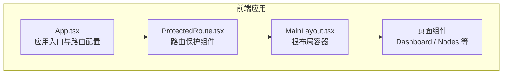
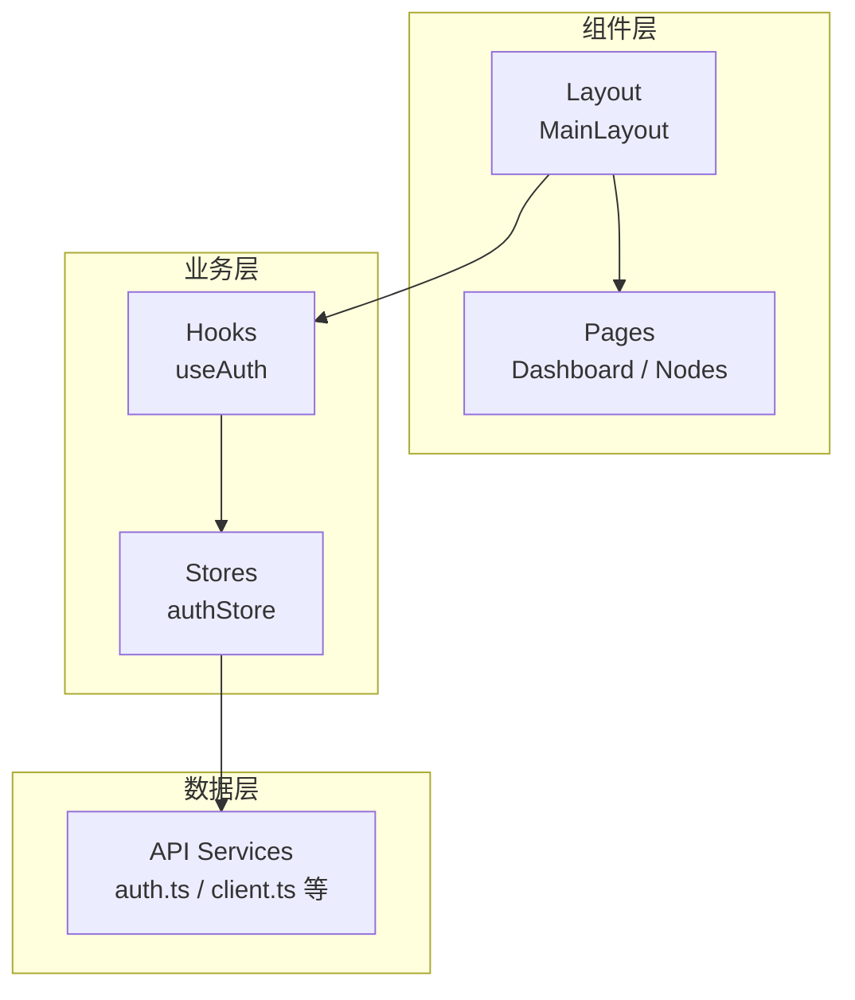
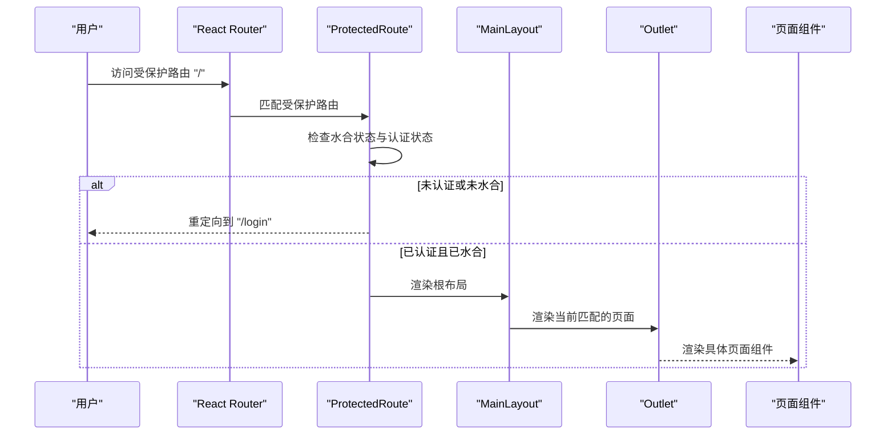
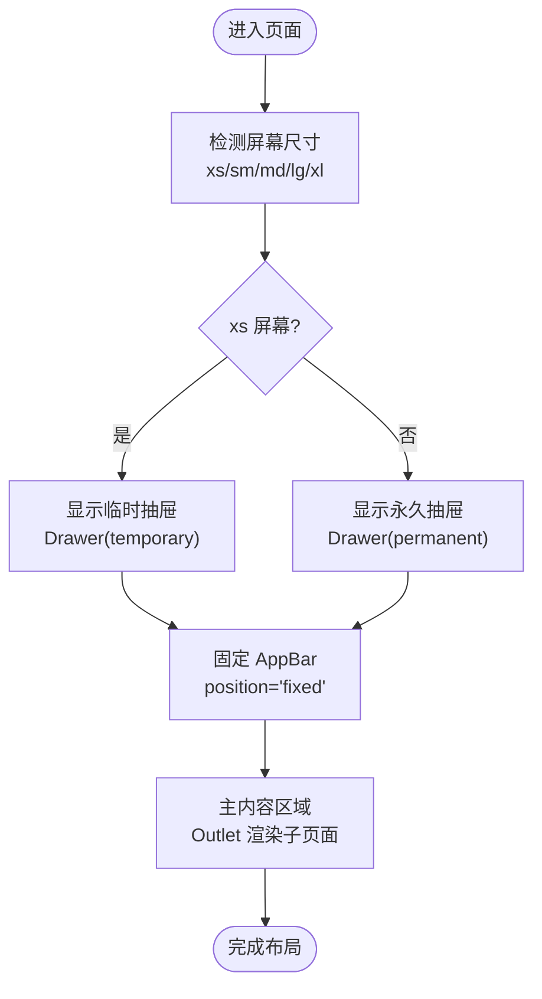
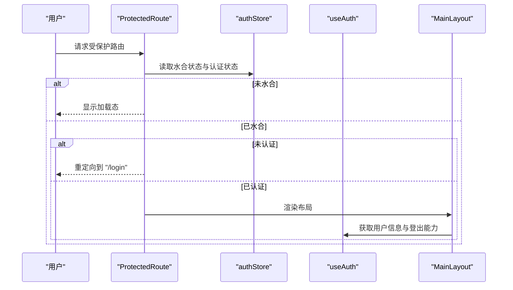
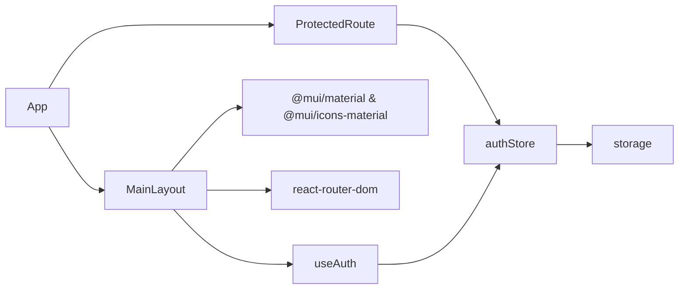

# 布局组件

<cite>
**本文引用的文件**
- [web/src/components/Layout/MainLayout.tsx](file://web/src/components/Layout/MainLayout.tsx)
- [web/src/components/Layout/index.ts](file://web/src/components/Layout/index.ts)
- [web/src/App.tsx](file://web/src/App.tsx)
- [web/src/router/ProtectedRoute.tsx](file://web/src/router/ProtectedRoute.tsx)
- [web/src/hooks/useAuth.ts](file://web/src/hooks/useAuth.ts)
- [web/src/stores/authStore.ts](file://web/src/stores/authStore.ts)
- [web/src/theme/index.ts](file://web/src/theme/index.ts)
- [web/src/utils/storage.ts](file://web/src/utils/storage.ts)
- [docs/设计文档_04_Web前端模块.md](file://docs/设计文档_04_Web前端模块.md)
</cite>

## 目录
1. [简介](#简介)
2. [项目结构](#项目结构)
3. [核心组件](#核心组件)
4. [架构总览](#架构总览)
5. [详细组件分析](#详细组件分析)
6. [依赖关系分析](#依赖关系分析)
7. [性能考虑](#性能考虑)
8. [故障排查指南](#故障排查指南)
9. [结论](#结论)
10. [附录](#附录)

## 简介
本文件围绕 MainLayout 根布局组件进行系统化技术文档整理，重点阐述其作为应用根布局容器的角色定位，包括侧边栏导航、顶部导航栏与主内容区域的结构设计；响应式布局的断点控制、折叠逻辑与移动端适配策略；与 React Router 的集成方式及权限控制在布局中的体现；组件的 Props 接口定义、使用示例与可扩展方法；以及在整体前端架构中的位置与与其他业务组件的协作关系，并给出性能优化建议（如懒加载与条件渲染）。

## 项目结构
MainLayout 位于前端工程 web/src/components/Layout 下，是页面路由的根级布局容器，配合 ProtectedRoute 实现受保护路由，通过 React Router 完成页面切换与 Outlet 内容渲染。

图表来源
- [web/src/App.tsx](file://web/src/App.tsx#L27-L54)
- [web/src/router/ProtectedRoute.tsx](file://web/src/router/ProtectedRoute.tsx#L13-L37)
- [web/src/components/Layout/MainLayout.tsx](file://web/src/components/Layout/MainLayout.tsx#L40-L183)

章节来源
- [web/src/App.tsx](file://web/src/App.tsx#L27-L54)
- [web/src/components/Layout/index.ts](file://web/src/components/Layout/index.ts#L1-L2)

## 核心组件
- MainLayout：负责应用根布局，包含顶部导航栏、侧边栏导航与主内容区域，支持移动端抽屉与桌面端固定侧边栏的响应式切换。
- ProtectedRoute：在路由层级对受保护页面进行鉴权拦截，未登录或尚未完成水合时显示加载态或重定向至登录页。
- useAuth：封装认证相关操作（登录、登出、获取资料等），向布局与页面提供用户状态与操作能力。
- authStore：基于 Zustand 的持久化状态管理，维护用户、令牌与认证状态，并在水合阶段完成初始状态恢复。
- theme：MUI 主题配置，为布局与页面提供一致的视觉风格。
- storage：本地存储工具，用于读写令牌与用户信息，支撑认证状态持久化。

章节来源
- [web/src/components/Layout/MainLayout.tsx](file://web/src/components/Layout/MainLayout.tsx#L40-L183)
- [web/src/router/ProtectedRoute.tsx](file://web/src/router/ProtectedRoute.tsx#L13-L37)
- [web/src/hooks/useAuth.ts](file://web/src/hooks/useAuth.ts#L13-L72)
- [web/src/stores/authStore.ts](file://web/src/stores/authStore.ts#L1-L85)
- [web/src/theme/index.ts](file://web/src/theme/index.ts#L1-L100)
- [web/src/utils/storage.ts](file://web/src/utils/storage.ts#L1-L48)

## 架构总览
MainLayout 在应用架构中处于“组件层”的根布局位置，向上承接路由与受保护页面，向下承载各业务页面组件。其职责是提供统一的导航与布局骨架，确保页面切换时的导航一致性与用户体验稳定性。

图表来源
- [web/src/components/Layout/MainLayout.tsx](file://web/src/components/Layout/MainLayout.tsx#L40-L183)
- [web/src/hooks/useAuth.ts](file://web/src/hooks/useAuth.ts#L13-L72)
- [web/src/stores/authStore.ts](file://web/src/stores/authStore.ts#L1-L85)

## 详细组件分析

### MainLayout 组件分析
- 角色与职责
  - 提供全局导航：顶部导航栏包含菜单按钮、标题与用户头像下拉菜单；侧边栏包含导航菜单项。
  - 管理布局区域：固定 AppBar、可折叠 Drawer（移动端临时抽屉 + 桌面端永久抽屉）、主内容区 Outlet。
  - 协调路由：通过 useNavigate 实现菜单点击跳转；与 React Router 的嵌套路由配合渲染子页面。
  - 权限联动：通过 useAuth 获取用户信息与登出能力，结合 ProtectedRoute 实现受保护页面。

- 结构设计
  - 顶部导航栏：包含移动端菜单按钮（触发抽屉开关）、应用标题与用户头像下拉菜单（显示用户名与退出登录）。
  - 侧边栏导航：包含品牌标题与菜单项列表，点击后通过 useNavigate 导航到对应路径。
  - 主内容区域：通过 Outlet 渲染当前路由匹配的页面组件，配合 Toolbar 保证内容不被 AppBar 遮挡。

- 响应式布局与断点控制
  - 断点策略：采用 MUI 断点系统，移动端（xs）使用临时抽屉，平板及以上（sm 及以上）使用永久抽屉。
  - 折叠逻辑：mobileOpen 控制抽屉显隐；handleDrawerToggle 切换抽屉状态；菜单项点击后自动关闭抽屉。
  - 移动端适配：AppBar 固定定位，侧边栏宽度固定，主内容区宽度随抽屉宽度变化；抽屉在 xs 屏幕下通过 ModalProps.keepMounted 保持挂载以提升交互体验。

- 与 React Router 的集成
  - App.tsx 中通过 BrowserRouter、Routes、Route 配置路由，"/" 路由包裹 ProtectedRoute，再包裹 MainLayout，使受保护页面共享同一布局。
  - MainLayout 内部通过 Outlet 渲染当前匹配的子页面组件，实现布局与内容的解耦。

- 权限控制在布局中的体现
  - ProtectedRoute 在水合完成前返回加载态，水合完成后若未认证则重定向至登录页。
  - MainLayout 通过 useAuth 获取用户信息并在顶部菜单中展示用户名，同时提供退出登录功能，调用后重定向至登录页。

- Props 接口定义
  - MainLayout 当前未接收任何外部 Props，内部通过 useNavigate、useAuth 与 useState 管理状态与导航行为。
  - 若需扩展，可在组件上增加可选 Props（例如：menuItems、onLogout、title 等），但当前实现未声明外部接口。

- 使用示例
  - 在 App.tsx 中将 MainLayout 作为受保护路由的子组件使用，即可实现全局布局与导航的一致性。
  - 子页面通过 React Router 的 Route 定义，由 MainLayout 的 Outlet 渲染。

- 自定义扩展方法
  - 菜单扩展：在 menuItems 中添加新的导航项，即可在侧边栏与顶部菜单中新增入口。
  - 布局定制：通过 MUI sx 属性调整抽屉宽度、AppBar 样式、主内容区间距等。
  - 权限控制：结合 useAuthStore 的 isAuthenticated 状态，在布局中按角色显示不同菜单项或隐藏敏感操作。

图表来源
- [web/src/App.tsx](file://web/src/App.tsx#L33-L49)
- [web/src/router/ProtectedRoute.tsx](file://web/src/router/ProtectedRoute.tsx#L13-L37)
- [web/src/components/Layout/MainLayout.tsx](file://web/src/components/Layout/MainLayout.tsx#L170-L181)

章节来源
- [web/src/components/Layout/MainLayout.tsx](file://web/src/components/Layout/MainLayout.tsx#L40-L183)
- [web/src/App.tsx](file://web/src/App.tsx#L33-L49)
- [web/src/router/ProtectedRoute.tsx](file://web/src/router/ProtectedRoute.tsx#L13-L37)
- [web/src/hooks/useAuth.ts](file://web/src/hooks/useAuth.ts#L13-L72)
- [web/src/stores/authStore.ts](file://web/src/stores/authStore.ts#L1-L85)

### 响应式布局流程图

图表来源
- [web/src/components/Layout/MainLayout.tsx](file://web/src/components/Layout/MainLayout.tsx#L134-L181)
- [docs/设计文档_04_Web前端模块.md](file://docs/设计文档_04_Web前端模块.md#L945-L969)

章节来源
- [web/src/components/Layout/MainLayout.tsx](file://web/src/components/Layout/MainLayout.tsx#L134-L181)
- [docs/设计文档_04_Web前端模块.md](file://docs/设计文档_04_Web前端模块.md#L945-L969)

### 权限控制与状态管理
- 认证状态来源：useAuthStore 通过 persist 中间件将用户与令牌持久化到 localStorage，并在水合阶段恢复状态。
- 认证操作：useAuth 封装登录、注册、修改密码、获取资料与登出等操作，返回状态与错误信息。
- 路由保护：ProtectedRoute 在水合完成前显示加载态，之后检查 isAuthenticated，未认证则重定向到登录页。

图表来源
- [web/src/router/ProtectedRoute.tsx](file://web/src/router/ProtectedRoute.tsx#L13-L37)
- [web/src/stores/authStore.ts](file://web/src/stores/authStore.ts#L1-L85)
- [web/src/hooks/useAuth.ts](file://web/src/hooks/useAuth.ts#L13-L72)
- [web/src/components/Layout/MainLayout.tsx](file://web/src/components/Layout/MainLayout.tsx#L40-L66)

章节来源
- [web/src/router/ProtectedRoute.tsx](file://web/src/router/ProtectedRoute.tsx#L13-L37)
- [web/src/stores/authStore.ts](file://web/src/stores/authStore.ts#L1-L85)
- [web/src/hooks/useAuth.ts](file://web/src/hooks/useAuth.ts#L13-L72)
- [web/src/utils/storage.ts](file://web/src/utils/storage.ts#L1-L48)

## 依赖关系分析
- 组件耦合
  - MainLayout 依赖 MUI 组件与图标，依赖 useAuth 获取用户状态与登出能力，依赖 useNavigate 进行路由跳转。
  - ProtectedRoute 依赖 useAuthStore 的认证状态与水合标记，决定是否允许渲染受保护内容。
- 外部依赖
  - MUI Material 与 Icons：用于布局与图标。
  - React Router：用于路由与导航。
  - TanStack React Query：用于查询客户端（在 App.tsx 中配置，影响页面数据加载行为）。
  - date-fns：用于时间格式化（在页面组件中使用，间接影响布局展示）。

图表来源
- [web/src/components/Layout/MainLayout.tsx](file://web/src/components/Layout/MainLayout.tsx#L40-L183)
- [web/src/router/ProtectedRoute.tsx](file://web/src/router/ProtectedRoute.tsx#L13-L37)
- [web/src/hooks/useAuth.ts](file://web/src/hooks/useAuth.ts#L13-L72)
- [web/src/stores/authStore.ts](file://web/src/stores/authStore.ts#L1-L85)
- [web/src/utils/storage.ts](file://web/src/utils/storage.ts#L1-L48)
- [web/src/App.tsx](file://web/src/App.tsx#L27-L54)

章节来源
- [web/src/components/Layout/MainLayout.tsx](file://web/src/components/Layout/MainLayout.tsx#L40-L183)
- [web/src/router/ProtectedRoute.tsx](file://web/src/router/ProtectedRoute.tsx#L13-L37)
- [web/src/hooks/useAuth.ts](file://web/src/hooks/useAuth.ts#L13-L72)
- [web/src/stores/authStore.ts](file://web/src/stores/authStore.ts#L1-L85)
- [web/src/utils/storage.ts](file://web/src/utils/storage.ts#L1-L48)
- [web/src/App.tsx](file://web/src/App.tsx#L27-L54)

## 性能考虑
- 懒加载与条件渲染
  - 将非关键路径的页面组件按需加载，减少首屏资源体积。
  - 对于大型页面，可采用分页、虚拟滚动与条件渲染（仅在需要时渲染复杂图表或表格）。
- 抽屉渲染策略
  - 在 xs 屏幕下，临时抽屉通过 keepMounted 保持挂载，避免频繁卸载/挂载带来的性能损耗。
  - 在 sm 及以上屏幕，永久抽屉常驻，减少切换成本。
- 查询缓存与刷新策略
  - App.tsx 中配置了 React Query 的默认选项（如 staleTime、retry、refetchOnWindowFocus），有助于减少重复请求与提升交互流畅度。
- 主题与样式
  - 使用 MUI 主题统一风格，避免重复样式计算；合理使用 sx 属性，避免过度嵌套导致的样式重排。

章节来源
- [web/src/components/Layout/MainLayout.tsx](file://web/src/components/Layout/MainLayout.tsx#L134-L181)
- [web/src/App.tsx](file://web/src/App.tsx#L16-L25)
- [web/src/theme/index.ts](file://web/src/theme/index.ts#L1-L100)

## 故障排查指南
- 登录后仍被重定向到登录页
  - 检查 authStore 是否正确持久化用户与令牌，确认水合阶段已完成。
  - 确认 ProtectedRoute 的 isAuthenticated 判断逻辑与水合标记是否正常。
- 退出登录后未跳转
  - 检查 MainLayout 中 handleLogout 的调用链是否执行，确认 useAuth 的 logout 是否清空了存储。
- 抽屉无法打开或关闭
  - 检查 mobileOpen 状态与 handleDrawerToggle 的绑定是否正确。
  - 确认 xs/sm 断点下的 Drawer 类型与显示控制逻辑。
- 顶部菜单不显示用户名
  - 检查 useAuth 返回的 user 是否存在，确认 ProtectedRoute 已完成水合。

章节来源
- [web/src/router/ProtectedRoute.tsx](file://web/src/router/ProtectedRoute.tsx#L13-L37)
- [web/src/stores/authStore.ts](file://web/src/stores/authStore.ts#L1-L85)
- [web/src/hooks/useAuth.ts](file://web/src/hooks/useAuth.ts#L13-L72)
- [web/src/utils/storage.ts](file://web/src/utils/storage.ts#L1-L48)
- [web/src/components/Layout/MainLayout.tsx](file://web/src/components/Layout/MainLayout.tsx#L40-L183)

## 结论
MainLayout 作为应用根布局容器，承担了统一导航与布局骨架的关键职责。通过与 React Router 和受保护路由的协同，实现了页面级别的权限控制与一致的用户体验。其响应式设计利用 MUI 断点系统与 Drawer 的临时/永久模式，兼顾了移动端与桌面端的可用性。结合 Zustand 的持久化状态管理与自定义 Hook，布局与页面之间的耦合度低、扩展性强。建议在后续迭代中进一步完善菜单权限控制、主题定制与性能优化策略，以满足更复杂的业务场景。

## 附录
- 相关文件路径
  - [MainLayout.tsx](file://web/src/components/Layout/MainLayout.tsx)
  - [index.ts（导出）](file://web/src/components/Layout/index.ts)
  - [App.tsx（路由与应用入口）](file://web/src/App.tsx)
  - [ProtectedRoute.tsx（路由保护）](file://web/src/router/ProtectedRoute.tsx)
  - [useAuth.ts（认证 Hook）](file://web/src/hooks/useAuth.ts)
  - [authStore.ts（认证状态管理）](file://web/src/stores/authStore.ts)
  - [theme/index.ts（主题配置）](file://web/src/theme/index.ts)
  - [storage.ts（本地存储）](file://web/src/utils/storage.ts)
  - [设计文档_04_Web前端模块.md（响应式断点）](file://docs/设计文档_04_Web前端模块.md)