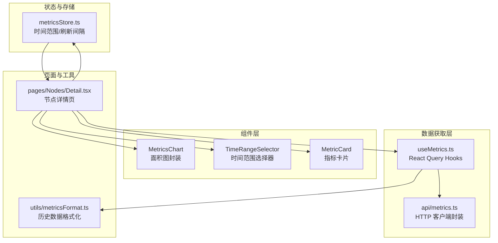
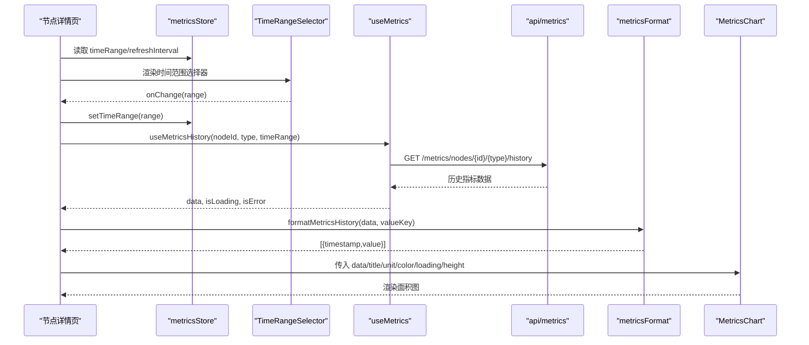
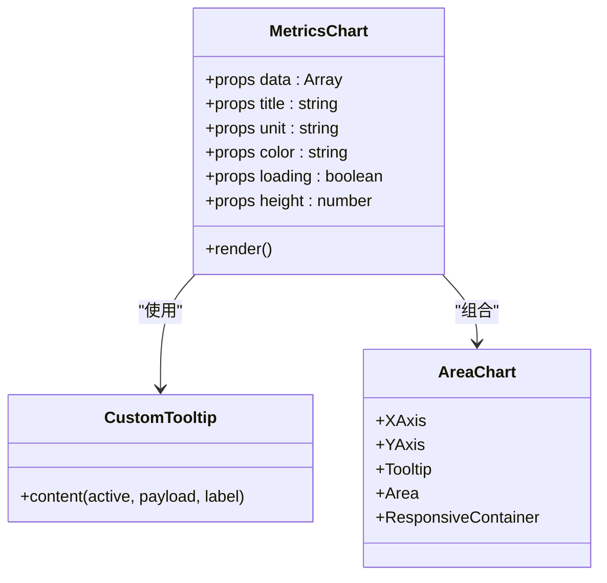
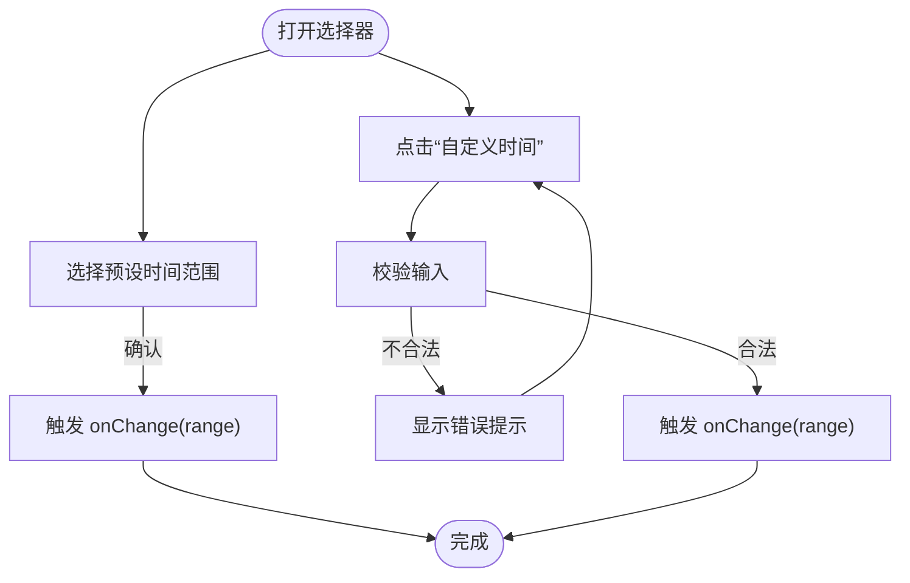
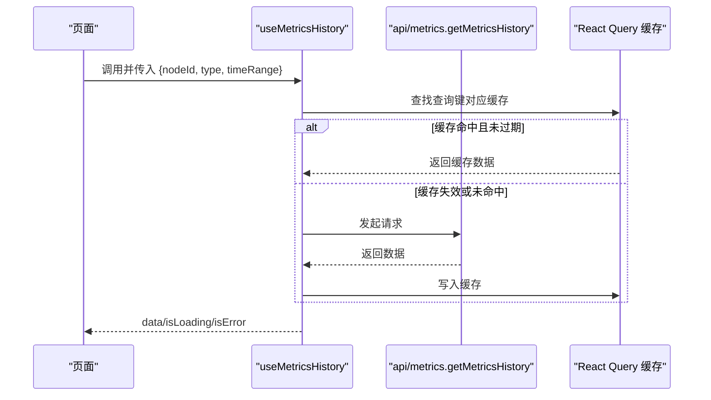
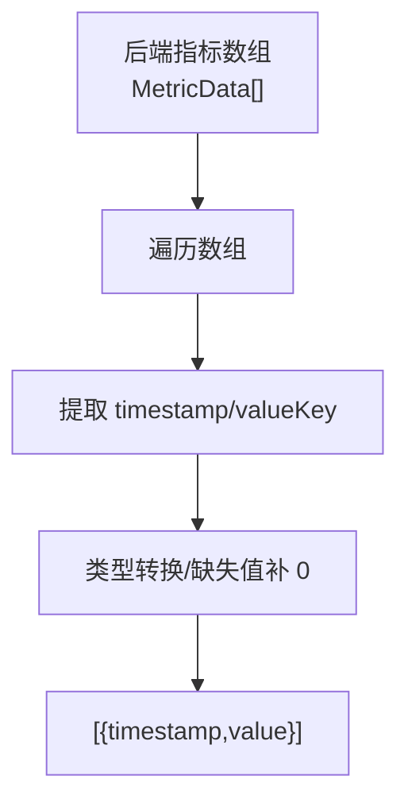
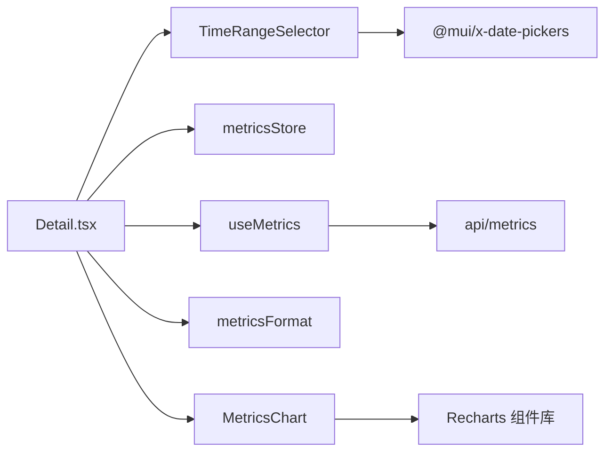

# 数据可视化组件

<cite>
**本文引用的文件**
- [MetricsChart.tsx](file://web/src/components/Metrics/MetricsChart.tsx)
- [TimeRangeSelector.tsx](file://web/src/components/Metrics/TimeRangeSelector.tsx)
- [useMetrics.ts](file://web/src/hooks/useMetrics.ts)
- [metrics.ts](file://web/src/types/metrics.ts)
- [metrics.ts](file://web/src/api/metrics.ts)
- [metricsStore.ts](file://web/src/stores/metricsStore.ts)
- [metricsFormat.ts](file://web/src/utils/metricsFormat.ts)
- [Detail.tsx](file://web/src/pages/Nodes/Detail.tsx)
- [MetricCard.tsx](file://web/src/components/Metrics/MetricCard.tsx)
</cite>

## 目录
1. [简介](#简介)
2. [项目结构](#项目结构)
3. [核心组件](#核心组件)
4. [架构总览](#架构总览)
5. [组件详解](#组件详解)
6. [依赖关系分析](#依赖关系分析)
7. [性能考量](#性能考量)
8. [故障排查指南](#故障排查指南)
9. [结论](#结论)
10. [附录](#附录)

## 简介
本专项文档聚焦于 MetricsChart 组件的功能实现与集成方式，说明其基于 Recharts 的封装、支持的图表类型与配置项、时间序列数据处理流程（含 API 获取、时间范围筛选与聚合）、交互能力（缩放、拖拽、数据点提示），并提供组件 API 文档、性能优化建议以及常见问题排查方法。文档同时覆盖与 TimeRangeSelector 的联动、React Query 的数据获取与缓存策略，以及在节点详情页中的实际应用。

## 项目结构
MetricsChart 及其配套组件位于前端 web/src/components/Metrics 目录；数据获取通过 React Query Hooks 与 API 层对接；时间范围状态由 Zustand Store 管理；数据格式化工具将后端指标结构转换为 Recharts 所需的 {timestamp, value} 形态。

**图表来源**
- [MetricsChart.tsx](file://web/src/components/Metrics/MetricsChart.tsx#L1-L178)
- [TimeRangeSelector.tsx](file://web/src/components/Metrics/TimeRangeSelector.tsx#L1-L235)
- [useMetrics.ts](file://web/src/hooks/useMetrics.ts#L1-L103)
- [metrics.ts](file://web/src/api/metrics.ts#L1-L58)
- [metricsStore.ts](file://web/src/stores/metricsStore.ts#L1-L37)
- [metricsFormat.ts](file://web/src/utils/metricsFormat.ts#L1-L32)
- [Detail.tsx](file://web/src/pages/Nodes/Detail.tsx#L276-L473)

**章节来源**
- [MetricsChart.tsx](file://web/src/components/Metrics/MetricsChart.tsx#L1-L178)
- [TimeRangeSelector.tsx](file://web/src/components/Metrics/TimeRangeSelector.tsx#L1-L235)
- [useMetrics.ts](file://web/src/hooks/useMetrics.ts#L1-L103)
- [metrics.ts](file://web/src/api/metrics.ts#L1-L58)
- [metricsStore.ts](file://web/src/stores/metricsStore.ts#L1-L37)
- [metricsFormat.ts](file://web/src/utils/metricsFormat.ts#L1-L32)
- [Detail.tsx](file://web/src/pages/Nodes/Detail.tsx#L276-L473)

## 核心组件
- MetricsChart：基于 Recharts 的面积图封装，支持自定义渐变填充、时间轴刻度格式化、单位显示与自定义 Tooltip。
- TimeRangeSelector：提供预设时间范围与自定义时间范围选择，包含输入校验与错误提示。
- useMetrics：封装 React Query 查询，负责最新指标、历史指标与统计摘要的获取与缓存策略。
- metricsStore：全局维护时间范围与刷新间隔，供页面与图表联动使用。
- metricsFormat：将后端指标数组转换为 Recharts 所需的 {timestamp, value} 结构，并处理缺失值。

**章节来源**
- [MetricsChart.tsx](file://web/src/components/Metrics/MetricsChart.tsx#L1-L178)
- [TimeRangeSelector.tsx](file://web/src/components/Metrics/TimeRangeSelector.tsx#L1-L235)
- [useMetrics.ts](file://web/src/hooks/useMetrics.ts#L1-L103)
- [metricsStore.ts](file://web/src/stores/metricsStore.ts#L1-L37)
- [metricsFormat.ts](file://web/src/utils/metricsFormat.ts#L1-L32)

## 架构总览
MetricsChart 的数据流从页面发起，经由 React Query Hooks 获取后端数据，再通过格式化工具转换为 Recharts 所需的数据结构，最终由 MetricsChart 渲染为面积图。时间范围由 TimeRangeSelector 选择并通过 Zustand Store 传递给页面，页面在 useEffect 中触发查询与刷新。

**图表来源**
- [Detail.tsx](file://web/src/pages/Nodes/Detail.tsx#L276-L473)
- [metricsStore.ts](file://web/src/stores/metricsStore.ts#L1-L37)
- [TimeRangeSelector.tsx](file://web/src/components/Metrics/TimeRangeSelector.tsx#L1-L235)
- [useMetrics.ts](file://web/src/hooks/useMetrics.ts#L1-L103)
- [metrics.ts](file://web/src/api/metrics.ts#L1-L58)
- [metricsFormat.ts](file://web/src/utils/metricsFormat.ts#L1-L32)
- [MetricsChart.tsx](file://web/src/components/Metrics/MetricsChart.tsx#L1-L178)

## 组件详解

### MetricsChart 组件
- 图表库与类型
  - 基于 Recharts 的 AreaChart/Area 组件，采用面积图展示时间序列。
  - 支持渐变填充（linearGradient），通过 color prop 注入。
- 数据输入与格式
  - Props: data（[{timestamp, value}]）、title、unit、color、loading、height。
  - 在渲染前为每条数据注入 unit 字段，供 Tooltip 使用。
- 时间轴与单位格式化
  - X 轴 tickFormatter 根据时间范围动态选择格式（例如 HH:mm、MM-dd HH:mm、MM-dd）。
  - Y 轴 tickFormatter 根据 unit 添加百分号或单位后缀。
- 交互与提示
  - 自定义 Tooltip，显示格式化的时间戳与数值及单位。
  - 响应式容器 ResponsiveContainer 保证图表随容器宽度自适应。
- 空态与加载态
  - loading 为真时显示 Material UI 的 Skeleton。
  - data 为空时显示“暂无数据”提示。
- 性能优化
  - 使用 memo 包装组件，避免不必要的重渲染。
  - 使用 useMemo 计算 timeRange，减少依赖变更带来的重渲染。

**图表来源**
- [MetricsChart.tsx](file://web/src/components/Metrics/MetricsChart.tsx#L1-L178)

**章节来源**
- [MetricsChart.tsx](file://web/src/components/Metrics/MetricsChart.tsx#L1-L178)

### TimeRangeSelector 组件
- 功能概述
  - 提供预设时间范围（15m/30m/1h/1d/7d/30d）与“自定义时间”弹窗。
  - 弹窗使用 @mui/x-date-pickers 的 DateTimePicker，支持中文本地化。
- 输入校验
  - 必填校验、结束时间必须晚于开始时间、最大跨度不超过 30 天。
- 状态与联动
  - 通过 value/onChange 与父组件同步当前时间范围。
  - 通过 getCurrentPreset 判断当前是否为预设范围，便于 UI 选中态控制。

**图表来源**
- [TimeRangeSelector.tsx](file://web/src/components/Metrics/TimeRangeSelector.tsx#L1-L235)

**章节来源**
- [TimeRangeSelector.tsx](file://web/src/components/Metrics/TimeRangeSelector.tsx#L1-L235)

### 数据获取与缓存（React Query）
- useMetricsHistory
  - 查询键包含 nodeId、type、起止时间，确保时间范围变化时重新拉取。
  - staleTime 设置为 5 分钟，refetchOnWindowFocus 关闭，避免频繁刷新。
  - onError 统一记录错误，页面层面可做降级处理。
- useLatestMetrics
  - 自动刷新间隔 30 秒，staleTime 25 秒，适合实时指标卡片。
- useMetricsSummary / useClusterOverview
  - 提供统计摘要与集群概览，配合 MetricCard 展示。

**图表来源**
- [useMetrics.ts](file://web/src/hooks/useMetrics.ts#L1-L103)
- [metrics.ts](file://web/src/api/metrics.ts#L1-L58)

**章节来源**
- [useMetrics.ts](file://web/src/hooks/useMetrics.ts#L1-L103)
- [metrics.ts](file://web/src/api/metrics.ts#L1-L58)

### 数据格式化与聚合
- metricsFormat.formatMetricsHistory
  - 将后端 MetricData[] 转换为 [{timestamp, value}]，valueKey 指向 usage_percent 等字段。
  - 对缺失值统一补 0，保证图表连续性。
- 节点详情页中的网络数据聚合
  - 将 rx_bytes 与 tx_bytes 合并为 totalBytes，单位转换为 MB，作为图表数据源。

**图表来源**
- [metricsFormat.ts](file://web/src/utils/metricsFormat.ts#L1-L32)
- [Detail.tsx](file://web/src/pages/Nodes/Detail.tsx#L316-L344)

**章节来源**
- [metricsFormat.ts](file://web/src/utils/metricsFormat.ts#L1-L32)
- [Detail.tsx](file://web/src/pages/Nodes/Detail.tsx#L316-L344)

### 组件 API 文档

- MetricsChart Props
  - data: Array<{ timestamp: number; value: number }>
  - title: string
  - unit: string
  - color: string（用于渐变与描边）
  - loading: boolean（可选）
  - height: number（可选，默认 300）

- Events
  - 无显式事件回调；交互行为由 Recharts 内置组件提供（如 Tooltip）。

- 自定义样式方法
  - 通过 color 传入十六进制颜色，用于渐变与描边。
  - 通过 height 控制图表高度。
  - 单位显示由 unit 控制，Y 轴 tickFormatter 会自动添加单位或百分号。

- TimeRangeSelector Props
  - value: TimeRange（包含 startTime 和 endTime）
  - onChange: (range: TimeRange) => void

- React Query Hooks
  - useMetricsHistory(nodeId, type, timeRange)
    - 返回 data、isLoading、isError、refetch 等。
  - useLatestMetrics(nodeId)
    - 返回 data、isLoading、isError、refetch 等。
  - useMetricsSummary(nodeId, timeRange?)
    - 返回统计摘要。
  - useClusterOverview()
    - 返回集群概览。

- Zustand Store
  - timeRange: TimeRange
  - refreshInterval: number | null
  - setTimeRange(range)
  - setRefreshInterval(interval)

**章节来源**
- [MetricsChart.tsx](file://web/src/components/Metrics/MetricsChart.tsx#L1-L178)
- [TimeRangeSelector.tsx](file://web/src/components/Metrics/TimeRangeSelector.tsx#L1-L235)
- [useMetrics.ts](file://web/src/hooks/useMetrics.ts#L1-L103)
- [metricsStore.ts](file://web/src/stores/metricsStore.ts#L1-L37)
- [metrics.ts](file://web/src/api/metrics.ts#L1-L58)
- [metricsFormat.ts](file://web/src/utils/metricsFormat.ts#L1-L32)

## 依赖关系分析

**图表来源**
- [Detail.tsx](file://web/src/pages/Nodes/Detail.tsx#L276-L473)
- [TimeRangeSelector.tsx](file://web/src/components/Metrics/TimeRangeSelector.tsx#L1-L235)
- [useMetrics.ts](file://web/src/hooks/useMetrics.ts#L1-L103)
- [metrics.ts](file://web/src/api/metrics.ts#L1-L58)
- [metricsStore.ts](file://web/src/stores/metricsStore.ts#L1-L37)
- [metricsFormat.ts](file://web/src/utils/metricsFormat.ts#L1-L32)
- [MetricsChart.tsx](file://web/src/components/Metrics/MetricsChart.tsx#L1-L178)

**章节来源**
- [Detail.tsx](file://web/src/pages/Nodes/Detail.tsx#L276-L473)
- [MetricsChart.tsx](file://web/src/components/Metrics/MetricsChart.tsx#L1-L178)
- [TimeRangeSelector.tsx](file://web/src/components/Metrics/TimeRangeSelector.tsx#L1-L235)
- [useMetrics.ts](file://web/src/hooks/useMetrics.ts#L1-L103)
- [metrics.ts](file://web/src/api/metrics.ts#L1-L58)
- [metricsStore.ts](file://web/src/stores/metricsStore.ts#L1-L37)
- [metricsFormat.ts](file://web/src/utils/metricsFormat.ts#L1-L32)

## 性能考量
- 渲染优化
  - MetricsChart 使用 memo 包装，避免因父组件重渲染导致的重复绘制。
  - 使用 useMemo 计算 timeRange，减少不必要的依赖变更。
  - 使用 ResponsiveContainer 与固定高度，降低布局抖动。
- 数据获取与缓存
  - useMetricsHistory 设置 staleTime 为 5 分钟，减少重复请求。
  - useLatestMetrics 设置较短 staleTime 与自动刷新，保证实时性。
  - 页面在时间范围变化时仅触发 refetch，避免全量重查。
- 大规模监控数据渲染策略
  - 优先使用面积图（AreaChart/Area），其对大数据集的渲染性能优于折线图。
  - 通过 metricsFormat 将原始指标转换为紧凑的 {timestamp, value} 数组，减少对象层级。
  - 在网络数据场景中，提前聚合 rx_bytes + tx_bytes 并进行单位换算，降低数据点数量与计算复杂度。
  - 若数据量极大，可在页面层引入分页或采样策略（例如按时间窗口聚合），并在组件层保留扩展点以支持更复杂的聚合算法。
- 交互与提示
  - 自定义 Tooltip 仅在悬停时渲染，避免常驻 DOM 带来的性能负担。
  - X/Y 轴 tickFormatter 为纯函数，避免在渲染过程中产生副作用。

[本节为通用性能建议，无需特定文件引用]

## 故障排查指南
- 图表无数据
  - 检查 data 是否为空或未正确格式化；确认 metricsFormat 是否正确提取 valueKey。
  - 确认 useMetricsHistory 的 queryKey 是否包含正确的起止时间。
- 时间范围无效
  - TimeRangeSelector 自定义时间校验：结束时间必须晚于开始时间、最大跨度不超过 30 天。
  - 若 onChange 未触发，请检查 value/onChange 的传入与 Store 的更新。
- 刷新异常
  - 检查 metricsStore.refreshInterval 是否为 null 或设置为合适的毫秒数。
  - 确认页面 useEffect 中定时器是否被清理，避免内存泄漏。
- 请求错误
  - useMetrics.onError 会输出错误日志；页面可捕获并显示错误提示。
  - 检查拦截器与权限状态，必要时跳转登录页。

**章节来源**
- [TimeRangeSelector.tsx](file://web/src/components/Metrics/TimeRangeSelector.tsx#L1-L235)
- [useMetrics.ts](file://web/src/hooks/useMetrics.ts#L1-L103)
- [Detail.tsx](file://web/src/pages/Nodes/Detail.tsx#L276-L473)

## 结论
MetricsChart 通过 Recharts 实现了简洁高效的面积图展示，结合 TimeRangeSelector 与 React Query Hooks，形成了从时间选择到数据获取、格式化与渲染的完整链路。组件具备良好的可扩展性与性能表现，适合在大规模监控数据场景中使用。建议在数据量进一步增大时引入采样与聚合策略，并持续优化缓存与刷新策略以提升用户体验。

[本节为总结性内容，无需特定文件引用]

## 附录

### 与 MetricCard 的对比
- MetricCard：展示单点指标与进度条，适合实时卡片展示。
- MetricsChart：展示时间序列趋势，适合趋势分析与对比。

**章节来源**
- [MetricCard.tsx](file://web/src/components/Metrics/MetricCard.tsx#L1-L117)
- [Detail.tsx](file://web/src/pages/Nodes/Detail.tsx#L405-L471)