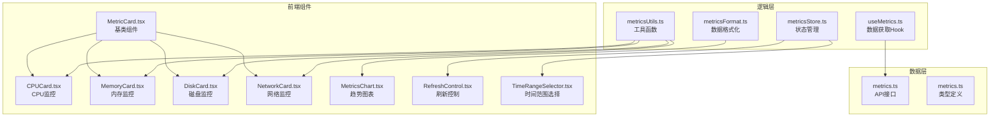
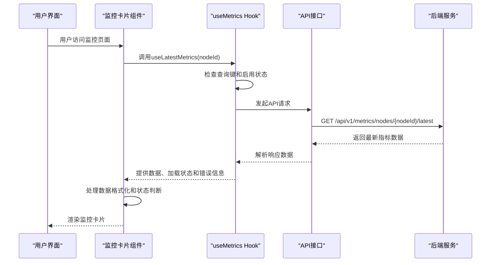
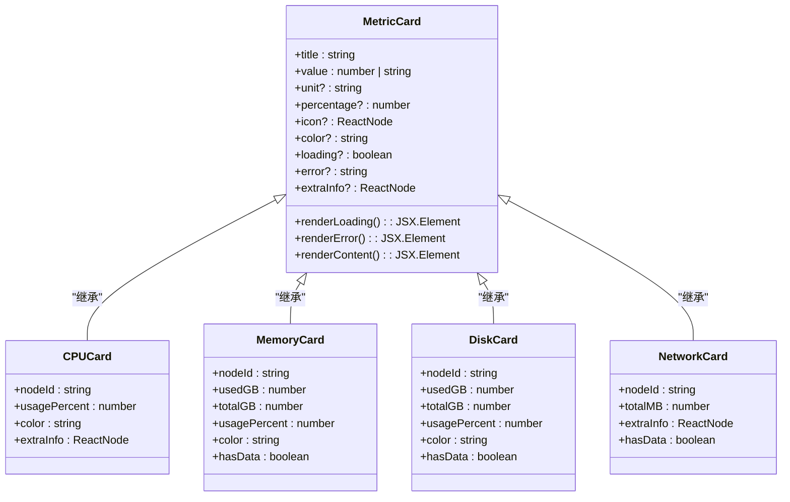
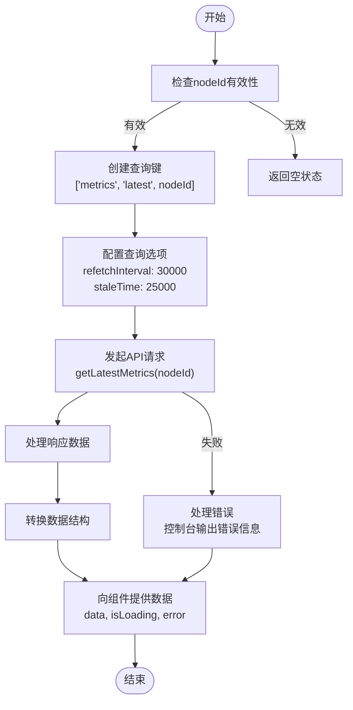
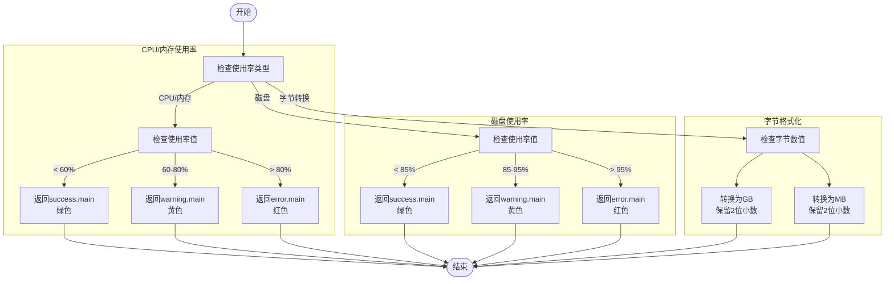
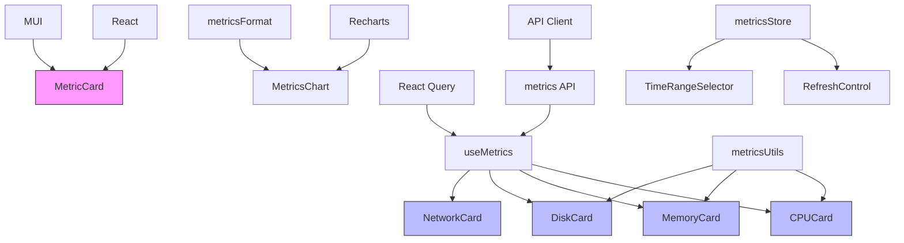

# 监控指标组件

<cite>
**本文档引用的文件**
- [MetricCard.tsx](file://web/src/components/Metrics/MetricCard.tsx)
- [CPUCard.tsx](file://web/src/components/Metrics/CPUCard.tsx)
- [MemoryCard.tsx](file://web/src/components/Metrics/MemoryCard.tsx)
- [DiskCard.tsx](file://web/src/components/Metrics/DiskCard.tsx)
- [NetworkCard.tsx](file://web/src/components/Metrics/NetworkCard.tsx)
- [useMetrics.ts](file://web/src/hooks/useMetrics.ts)
- [metricsUtils.ts](file://web/src/utils/metricsUtils.ts)
- [metricsFormat.ts](file://web/src/utils/metricsFormat.ts)
- [metrics.ts](file://web/src/api/metrics.ts)
- [metrics.ts](file://web/src/types/metrics.ts)
- [MetricsChart.tsx](file://web/src/components/Metrics/MetricsChart.tsx)
- [RefreshControl.tsx](file://web/src/components/Metrics/RefreshControl.tsx)
- [TimeRangeSelector.tsx](file://web/src/components/Metrics/TimeRangeSelector.tsx)
- [metricsStore.ts](file://web/src/stores/metricsStore.ts)
</cite>

## 目录
1. [简介](#简介)
2. [项目结构](#项目结构)
3. [核心组件](#核心组件)
4. [架构概述](#架构概述)
5. [详细组件分析](#详细组件分析)
6. [依赖分析](#依赖分析)
7. [性能考虑](#性能考虑)
8. [故障排除指南](#故障排除指南)
9. [结论](#结论)

## 简介
本项目是一个运维监控框架，专注于实现CPU、内存、磁盘和网络等资源的监控指标组件。核心设计围绕`MetricCard`基类组件展开，通过继承和扩展机制实现各类具体资源监控卡片的复用。系统采用React技术栈，结合MUI组件库和Recharts图表库，构建了现代化的监控界面。指标数据通过`useMetrics`自定义Hook从后端API获取，并通过`metricsFormat`和`metricsUtils`工具函数进行格式化和异常状态标识。整个组件体系支持灵活的阈值配置和告警联动机制，可在不同监控视图中高效复用。

## 项目结构
项目采用分层架构设计，前端组件集中存放在`web/src`目录下。监控相关组件位于`web/src/components/Metrics`目录，包含基类组件`MetricCard`和具体资源卡片组件（CPU、内存、磁盘、网络）。Hooks逻辑封装在`web/src/hooks`目录，工具函数位于`web/src/utils`目录，类型定义在`web/src/types`目录，状态管理使用Zustand存储在`web/src/stores`目录。API接口定义在`web/src/api`目录，与后端通过RESTful API进行数据交互。

**Diagram sources**
- [MetricCard.tsx](file://web/src/components/Metrics/MetricCard.tsx)
- [CPUCard.tsx](file://web/src/components/Metrics/CPUCard.tsx)
- [MemoryCard.tsx](file://web/src/components/Metrics/MemoryCard.tsx)
- [DiskCard.tsx](file://web/src/components/Metrics/DiskCard.tsx)
- [NetworkCard.tsx](file://web/src/components/Metrics/NetworkCard.tsx)
- [useMetrics.ts](file://web/src/hooks/useMetrics.ts)
- [metricsUtils.ts](file://web/src/utils/metricsUtils.ts)
- [metricsFormat.ts](file://web/src/utils/metricsFormat.ts)
- [metrics.ts](file://web/src/api/metrics.ts)
- [metrics.ts](file://web/src/types/metrics.ts)
- [MetricsChart.tsx](file://web/src/components/Metrics/MetricsChart.tsx)
- [RefreshControl.tsx](file://web/src/components/Metrics/RefreshControl.tsx)
- [TimeRangeSelector.tsx](file://web/src/components/Metrics/TimeRangeSelector.tsx)
- [metricsStore.ts](file://web/src/stores/metricsStore.ts)

**Section sources**
- [MetricCard.tsx](file://web/src/components/Metrics/MetricCard.tsx)
- [CPUCard.tsx](file://web/src/components/Metrics/CPUCard.tsx)
- [MemoryCard.tsx](file://web/src/components/Metrics/MemoryCard.tsx)
- [DiskCard.tsx](file://web/src/components/Metrics/DiskCard.tsx)
- [NetworkCard.tsx](file://web/src/components/Metrics/NetworkCard.tsx)
- [useMetrics.ts](file://web/src/hooks/useMetrics.ts)
- [metricsUtils.ts](file://web/src/utils/metricsUtils.ts)
- [metricsFormat.ts](file://web/src/utils/metricsFormat.ts)
- [metrics.ts](file://web/src/api/metrics.ts)
- [metrics.ts](file://web/src/types/metrics.ts)
- [MetricsChart.tsx](file://web/src/components/Metrics/MetricsChart.tsx)
- [RefreshControl.tsx](file://web/src/components/Metrics/RefreshControl.tsx)
- [TimeRangeSelector.tsx](file://web/src/components/Metrics/TimeRangeSelector.tsx)
- [metricsStore.ts](file://web/src/stores/metricsStore.ts)

## 核心组件
监控指标组件体系以`MetricCard`为基类组件，通过继承机制实现CPU、内存、磁盘和网络等具体资源监控卡片。`MetricCard`封装了通用的UI结构和状态管理，包括标题、数值、单位、进度条、图标和附加信息的展示。各具体资源卡片组件通过`useLatestMetrics` Hook获取指标数据，利用`metricsUtils`中的工具函数进行数据格式化和异常状态标识，并根据资源特性扩展特定的展示逻辑。整个组件体系支持加载状态、错误状态和空数据状态的处理，确保用户体验的完整性。

**Section sources**
- [MetricCard.tsx](file://web/src/components/Metrics/MetricCard.tsx)
- [CPUCard.tsx](file://web/src/components/Metrics/CPUCard.tsx)
- [MemoryCard.tsx](file://web/src/components/Metrics/MemoryCard.tsx)
- [DiskCard.tsx](file://web/src/components/Metrics/DiskCard.tsx)
- [NetworkCard.tsx](file://web/src/components/Metrics/NetworkCard.tsx)
- [useMetrics.ts](file://web/src/hooks/useMetrics.ts)
- [metricsUtils.ts](file://web/src/utils/metricsUtils.ts)

## 架构概述
系统采用分层架构设计，从前端组件到后端API形成清晰的数据流。前端组件层由`MetricCard`基类和具体资源卡片组成，通过自定义Hook与逻辑层交互。逻辑层包含数据获取、格式化和状态管理功能，通过API层与后端服务通信。数据流从用户界面开始，经过Hook触发API调用，获取原始指标数据后进行格式化处理，最终在组件中渲染展示。整个架构支持自动刷新、时间范围选择和手动刷新控制，确保监控数据的实时性和可操作性。

**Diagram sources**
- [CPUCard.tsx](file://web/src/components/Metrics/CPUCard.tsx)
- [useMetrics.ts](file://web/src/hooks/useMetrics.ts)
- [metrics.ts](file://web/src/api/metrics.ts)

## 详细组件分析
监控指标组件体系采用基类继承的设计模式，通过`MetricCard`作为基类组件封装通用功能，各具体资源卡片组件继承并扩展其功能。这种设计实现了代码复用和维护便利性，同时保持了各资源监控的特异性。组件间的共性体现在数据获取、状态管理和基本UI结构上，差异则体现在数据格式化、阈值配置和展示细节上。

### MetricCard 基类组件分析
`MetricCard`作为所有监控卡片的基类组件，封装了通用的UI结构和状态管理逻辑。组件支持三种状态展示：加载状态显示骨架屏，错误状态显示错误告警，正常状态显示完整指标信息。UI结构包含标题和图标区域、数值和单位区域、进度条区域以及附加信息区域，通过props灵活配置。

**Diagram sources**
- [MetricCard.tsx](file://web/src/components/Metrics/MetricCard.tsx)
- [CPUCard.tsx](file://web/src/components/Metrics/CPUCard.tsx)
- [MemoryCard.tsx](file://web/src/components/Metrics/MemoryCard.tsx)
- [DiskCard.tsx](file://web/src/components/Metrics/DiskCard.tsx)
- [NetworkCard.tsx](file://web/src/components/Metrics/NetworkCard.tsx)

**Section sources**
- [MetricCard.tsx](file://web/src/components/Metrics/MetricCard.tsx)
- [CPUCard.tsx](file://web/src/components/Metrics/CPUCard.tsx)
- [MemoryCard.tsx](file://web/src/components/Metrics/MemoryCard.tsx)
- [DiskCard.tsx](file://web/src/components/Metrics/DiskCard.tsx)
- [NetworkCard.tsx](file://web/src/components/Metrics/NetworkCard.tsx)

### 指标数据获取流程分析
指标数据获取流程基于React Query库实现，通过自定义Hook封装数据获取逻辑。`useLatestMetrics` Hook负责获取节点的最新指标数据，设置30秒自动刷新间隔和25秒缓存时间，平衡数据实时性和性能消耗。数据获取过程包含查询键管理、请求触发、响应处理和错误捕获等环节，确保数据获取的可靠性和用户体验。

**Diagram sources**
- [useMetrics.ts](file://web/src/hooks/useMetrics.ts)
- [metrics.ts](file://web/src/api/metrics.ts)

**Section sources**
- [useMetrics.ts](file://web/src/hooks/useMetrics.ts)
- [metrics.ts](file://web/src/api/metrics.ts)

### 指标格式化与异常标识分析
指标格式化与异常标识功能由`metricsUtils`工具函数集中管理，确保阈值配置的一致性和可维护性。CPU和内存使用率采用相同的阈值标准（<60%绿色，60-80%黄色，>80%红色），磁盘使用率采用更严格的阈值标准（<85%绿色，85-95%黄色，>95%红色）。字节单位转换函数支持GB和MB格式化，满足不同资源的展示需求。

**Diagram sources**
- [metricsUtils.ts](file://web/src/utils/metricsUtils.ts)

**Section sources**
- [metricsUtils.ts](file://web/src/utils/metricsUtils.ts)

## 依赖分析
监控指标组件体系具有清晰的依赖关系，各组件和模块职责分明。前端组件依赖于React、MUI和Recharts等UI库，逻辑层依赖于React Query状态管理库，工具函数层无外部依赖，API层依赖于Axios或类似HTTP客户端。组件间依赖通过props和Hook机制实现，确保了低耦合和高内聚的设计原则。

**Diagram sources**
- [MetricCard.tsx](file://web/src/components/Metrics/MetricCard.tsx)
- [CPUCard.tsx](file://web/src/components/Metrics/CPUCard.tsx)
- [MemoryCard.tsx](file://web/src/components/Metrics/MemoryCard.tsx)
- [DiskCard.tsx](file://web/src/components/Metrics/DiskCard.tsx)
- [NetworkCard.tsx](file://web/src/components/Metrics/NetworkCard.tsx)
- [useMetrics.ts](file://web/src/hooks/useMetrics.ts)
- [metricsUtils.ts](file://web/src/utils/metricsUtils.ts)
- [metricsFormat.ts](file://web/src/utils/metricsFormat.ts)
- [metricsStore.ts](file://web/src/stores/metricsStore.ts)
- [metrics.ts](file://web/src/api/metrics.ts)

**Section sources**
- [MetricCard.tsx](file://web/src/components/Metrics/MetricCard.tsx)
- [CPUCard.tsx](file://web/src/components/Metrics/CPUCard.tsx)
- [MemoryCard.tsx](file://web/src/components/Metrics/MemoryCard.tsx)
- [DiskCard.tsx](file://web/src/components/Metrics/DiskCard.tsx)
- [NetworkCard.tsx](file://web/src/components/Metrics/NetworkCard.tsx)
- [useMetrics.ts](file://web/src/hooks/useMetrics.ts)
- [metricsUtils.ts](file://web/src/utils/metricsUtils.ts)
- [metricsFormat.ts](file://web/src/utils/metricsFormat.ts)
- [metricsStore.ts](file://web/src/stores/metricsStore.ts)
- [metrics.ts](file://web/src/api/metrics.ts)

## 性能考虑
监控指标组件在性能方面进行了多项优化。数据获取采用React Query的缓存机制，避免重复请求；UI渲染使用React.memo进行组件记忆化，防止不必要的重渲染；数据处理利用useMemo缓存计算结果，减少重复计算开销。自动刷新间隔设置为30秒，平衡数据实时性和服务器负载。大时间范围的历史数据查询采用分页或聚合策略，避免一次性加载过多数据导致性能问题。

## 故障排除指南
当监控指标组件出现问题时，可按照以下步骤进行排查：首先检查网络连接和API端点可达性；其次查看浏览器控制台是否有JavaScript错误；然后确认nodeId参数是否正确传递；最后检查后端服务日志以确定数据采集是否正常。常见问题包括数据加载超时、指标显示异常和自动刷新失效等，多数情况下可通过刷新页面或检查网络状态解决。

**Section sources**
- [useMetrics.ts](file://web/src/hooks/useMetrics.ts)
- [metrics.ts](file://web/src/api/metrics.ts)
- [MetricCard.tsx](file://web/src/components/Metrics/MetricCard.tsx)

## 结论
监控指标组件通过基类继承的设计模式，实现了CPU、内存、磁盘和网络等资源监控卡片的高效复用和统一管理。`MetricCard`基类组件封装了通用的UI结构和状态管理，各具体资源卡片组件通过自定义Hook获取数据，并利用工具函数进行格式化和异常标识。整个组件体系具有良好的可维护性和扩展性，支持灵活的阈值配置和告警联动机制。通过合理的性能优化和错误处理，确保了监控系统的稳定性和用户体验。未来可进一步统一阈值配置管理，增强告警规则的可配置性，提升组件的复用价值。