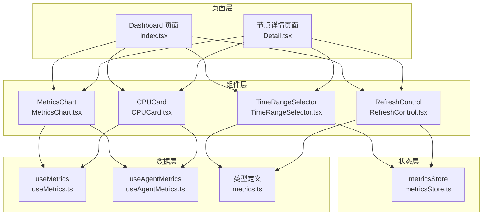
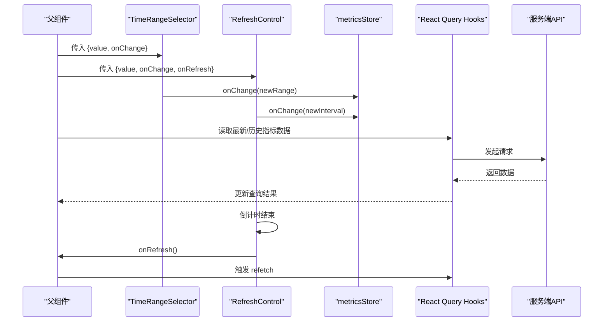
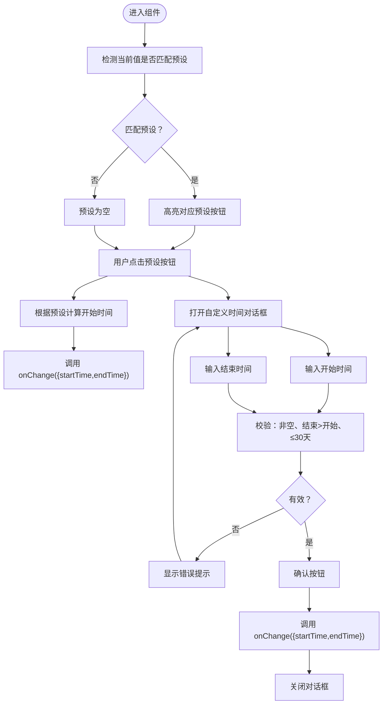
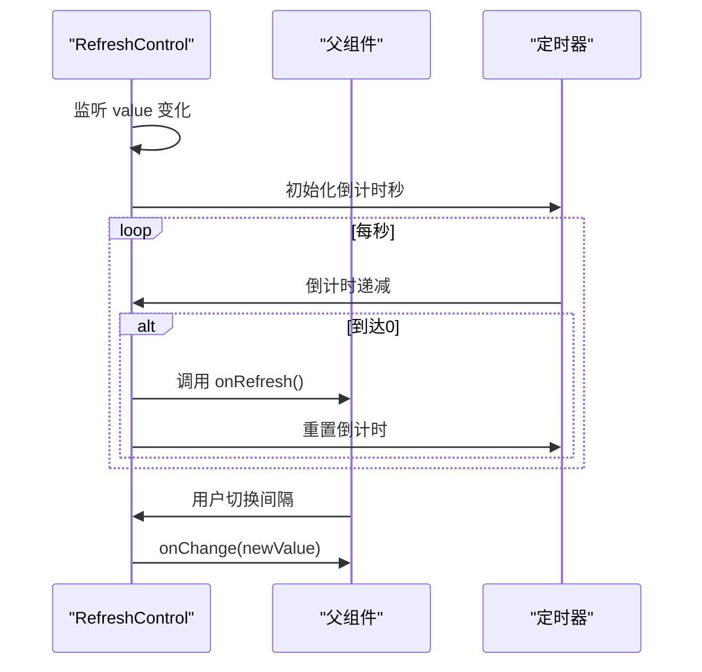
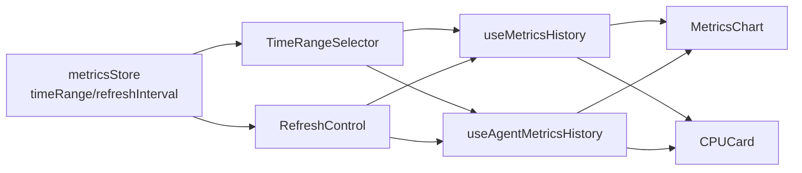
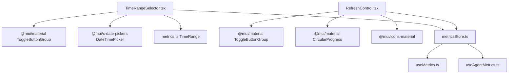

# 通用UI组件

<cite>
**本文引用的文件**
- [TimeRangeSelector.tsx](file://web/src/components/Metrics/TimeRangeSelector.tsx)
- [RefreshControl.tsx](file://web/src/components/Metrics/RefreshControl.tsx)
- [metricsStore.ts](file://web/src/stores/metricsStore.ts)
- [useMetrics.ts](file://web/src/hooks/useMetrics.ts)
- [useAgentMetrics.ts](file://web/src/hooks/useAgentMetrics.ts)
- [metrics.ts](file://web/src/types/metrics.ts)
- [index.tsx](file://web/src/pages/Dashboard/index.tsx)
- [Detail.tsx](file://web/src/pages/Nodes/Detail.tsx)
- [MetricsChart.tsx](file://web/src/components/Metrics/MetricsChart.tsx)
- [CPUCard.tsx](file://web/src/components/Metrics/CPUCard.tsx)
</cite>

## 目录
1. [简介](#简介)
2. [项目结构](#项目结构)
3. [核心组件](#核心组件)
4. [架构总览](#架构总览)
5. [组件详解](#组件详解)
6. [依赖关系分析](#依赖关系分析)
7. [性能考量](#性能考量)
8. [故障排查指南](#故障排查指南)
9. [结论](#结论)
10. [附录](#附录)

## 简介
本文件围绕通用UI组件“时间范围选择器”（TimeRangeSelector）与“刷新控制器”（RefreshControl）展开，系统阐述其复用设计、状态管理机制、与父组件的数据同步方式、自动刷新控制逻辑、以及与监控组件的无缝集成。同时给出类型定义与调用示例路径，帮助读者在不同场景下灵活应用这两个组件。

## 项目结构
- 组件层：位于 web/src/components/Metrics 下，包含 TimeRangeSelector、RefreshControl 及其他监控可视化组件。
- 状态层：使用 Zustand 的 metricsStore 提供全局的时间范围与刷新间隔状态。
- 数据层：通过 React Query Hooks（useMetrics、useAgentMetrics）拉取最新与历史指标数据。
- 类型层：统一在 web/src/types/metrics.ts 中定义 TimeRange 等类型。
- 页面层：Dashboard 与 Nodes/Detail 页面分别演示了组件在不同场景下的组合使用。

图示来源
- [index.tsx](file://web/src/pages/Dashboard/index.tsx#L1-L193)
- [Detail.tsx](file://web/src/pages/Nodes/Detail.tsx#L1-L473)
- [TimeRangeSelector.tsx](file://web/src/components/Metrics/TimeRangeSelector.tsx#L1-L235)
- [RefreshControl.tsx](file://web/src/components/Metrics/RefreshControl.tsx#L1-L101)
- [metricsStore.ts](file://web/src/stores/metricsStore.ts#L1-L37)
- [useMetrics.ts](file://web/src/hooks/useMetrics.ts#L1-L103)
- [useAgentMetrics.ts](file://web/src/hooks/useAgentMetrics.ts#L1-L98)
- [metrics.ts](file://web/src/types/metrics.ts#L51-L58)

章节来源
- [index.tsx](file://web/src/pages/Dashboard/index.tsx#L1-L193)
- [Detail.tsx](file://web/src/pages/Nodes/Detail.tsx#L1-L473)
- [metricsStore.ts](file://web/src/stores/metricsStore.ts#L1-L37)

## 核心组件
- TimeRangeSelector：提供预设时间范围（如最近15分钟、30分钟、1小时、1天、7天、30天）与自定义时间选择能力；通过 props.value 与 props.onChange 与父组件进行双向数据同步；内部维护本地状态以驱动 UI 行为。
- RefreshControl：提供刷新间隔选择（暂停、30秒、1分钟），内置倒计时与自动触发刷新回调；通过 props.value 与 props.onChange 管理状态；通过 props.onRefresh 暴露手动触发刷新的能力。

章节来源
- [TimeRangeSelector.tsx](file://web/src/components/Metrics/TimeRangeSelector.tsx#L23-L235)
- [RefreshControl.tsx](file://web/src/components/Metrics/RefreshControl.tsx#L15-L101)

## 架构总览
TimeRangeSelector 与 RefreshControl 作为通用 UI 组件，通过 props 与全局状态（Zustand）解耦，既可在 Dashboard 页面集中控制，也可在节点详情页面按需复用。二者与数据层（React Query Hooks）配合，实现“时间范围”和“刷新策略”的统一管理与高效渲染。

图示来源
- [index.tsx](file://web/src/pages/Dashboard/index.tsx#L43-L73)
- [Detail.tsx](file://web/src/pages/Nodes/Detail.tsx#L346-L354)
- [TimeRangeSelector.tsx](file://web/src/components/Metrics/TimeRangeSelector.tsx#L146-L231)
- [RefreshControl.tsx](file://web/src/components/Metrics/RefreshControl.tsx#L21-L98)
- [metricsStore.ts](file://web/src/stores/metricsStore.ts#L17-L35)
- [useMetrics.ts](file://web/src/hooks/useMetrics.ts#L30-L59)

## 组件详解

### TimeRangeSelector 组件
- 功能特性
  - 预设时间范围：15分钟、30分钟、1小时、1天、7天、30天。
  - 自定义时间范围：弹窗选择开始/结束时间，包含输入校验与范围限制。
  - 状态管理：内部维护 open、customStartTime、customEndTime、error 等状态；根据当前值推断预设值并高亮对应按钮。
- 数据流
  - 父组件通过 props.value 传入当前时间范围；当用户选择预设或确认自定义时间后，调用 props.onChange 通知父组件更新。
  - 在节点详情页面，父组件使用 metricsStore 的 setTimeRange 更新全局时间范围；各指标查询（useMetricsHistory、useAgentMetricsHistory）基于此时间范围执行。
- 错误处理
  - 自定义时间校验：必填、结束时间需晚于开始时间、最大跨度不超过30天。
- 可配置性
  - 通过 props.value 与 props.onChange 与任意父容器集成，无需关心具体存储位置。

图示来源
- [TimeRangeSelector.tsx](file://web/src/components/Metrics/TimeRangeSelector.tsx#L39-L143)

章节来源
- [TimeRangeSelector.tsx](file://web/src/components/Metrics/TimeRangeSelector.tsx#L23-L235)
- [metricsStore.ts](file://web/src/stores/metricsStore.ts#L17-L35)
- [useMetrics.ts](file://web/src/hooks/useMetrics.ts#L30-L59)
- [useAgentMetrics.ts](file://web/src/hooks/useAgentMetrics.ts#L54-L98)

### RefreshControl 组件
- 功能特性
  - 刷新间隔：暂停（null）、30秒、1分钟。
  - 自动刷新：倒计时结束自动触发 onRefresh 回调；倒计时进度通过圆形进度条与秒数显示。
  - 手动触发：父组件可直接调用 refetch 或自行刷新逻辑。
- 数据流
  - 父组件通过 props.value 传入当前刷新间隔；当用户切换间隔时，调用 props.onChange 通知父组件更新。
  - 倒计时逻辑基于 useEffect 与 setInterval，确保在 value 变更时正确初始化与清理。
- 可配置性
  - 通过 props.value、props.onChange、props.onRefresh 与任意父容器集成，适配不同页面的刷新策略。

图示来源
- [RefreshControl.tsx](file://web/src/components/Metrics/RefreshControl.tsx#L21-L98)

章节来源
- [RefreshControl.tsx](file://web/src/components/Metrics/RefreshControl.tsx#L15-L101)
- [index.tsx](file://web/src/pages/Dashboard/index.tsx#L43-L73)
- [Detail.tsx](file://web/src/pages/Nodes/Detail.tsx#L346-L354)

### 与监控组件的集成
- Dashboard 页面
  - 使用 RefreshControl 控制集群概览的自动刷新；通过 useMetricsStore 的 refreshInterval 与 useClusterOverview 的 refetchInterval 协同工作。
  - TimeRangeSelector 在节点详情页面使用，但 Dashboard 未直接使用时间范围选择器。
- 节点详情页面
  - 同时使用 TimeRangeSelector 与 RefreshControl，二者均绑定到 metricsStore 的全局状态。
  - 历史指标查询（useMetricsHistory、useAgentMetricsHistory）基于 timeRange 与 refreshInterval，实现“时间范围+刷新策略”的双轮驱动。

图示来源
- [Detail.tsx](file://web/src/pages/Nodes/Detail.tsx#L276-L473)
- [metricsStore.ts](file://web/src/stores/metricsStore.ts#L17-L35)
- [useMetrics.ts](file://web/src/hooks/useMetrics.ts#L30-L59)
- [useAgentMetrics.ts](file://web/src/hooks/useAgentMetrics.ts#L54-L98)
- [MetricsChart.tsx](file://web/src/components/Metrics/MetricsChart.tsx#L1-L178)
- [CPUCard.tsx](file://web/src/components/Metrics/CPUCard.tsx#L1-L77)

章节来源
- [index.tsx](file://web/src/pages/Dashboard/index.tsx#L1-L193)
- [Detail.tsx](file://web/src/pages/Nodes/Detail.tsx#L276-L473)

## 依赖关系分析
- 组件依赖
  - TimeRangeSelector 依赖 MUI ToggleButtonGroup、Dialog、DateTimePicker 等 UI 组件；依赖类型 TimeRange。
  - RefreshControl 依赖 MUI ToggleButtonGroup、CircularProgress、图标等；依赖类型 TimeRange。
- 状态依赖
  - 二者均通过 metricsStore 的 setTimeRange 与 setRefreshInterval 与全局状态解耦，便于跨页面复用。
- 数据依赖
  - useMetrics/useAgentMetrics 依赖 React Query 的 useQuery，结合 timeRange 与 refreshInterval 实现数据拉取与缓存策略。

图示来源
- [TimeRangeSelector.tsx](file://web/src/components/Metrics/TimeRangeSelector.tsx#L1-L235)
- [RefreshControl.tsx](file://web/src/components/Metrics/RefreshControl.tsx#L1-L101)
- [metricsStore.ts](file://web/src/stores/metricsStore.ts#L1-L37)
- [useMetrics.ts](file://web/src/hooks/useMetrics.ts#L1-L103)
- [useAgentMetrics.ts](file://web/src/hooks/useAgentMetrics.ts#L1-L98)
- [metrics.ts](file://web/src/types/metrics.ts#L51-L58)

章节来源
- [TimeRangeSelector.tsx](file://web/src/components/Metrics/TimeRangeSelector.tsx#L1-L235)
- [RefreshControl.tsx](file://web/src/components/Metrics/RefreshControl.tsx#L1-L101)
- [metricsStore.ts](file://web/src/stores/metricsStore.ts#L1-L37)

## 性能考量
- TimeRangeSelector
  - 使用 memo 包装组件，避免不必要的重渲染。
  - 预设值检测采用毫秒级差值比较，允许1秒误差，提升兼容性。
- RefreshControl
  - 倒计时使用 useEffect + setInterval，value 变化时正确初始化与清理，避免内存泄漏。
  - 进度条使用 determinate 模式，基于剩余秒数与总秒数计算百分比，视觉反馈清晰。
- 数据层
  - useMetrics/useAgentMetrics 对历史数据设置了合理的 staleTime，减少重复请求。
  - Dashboard 通过 useMetricsStore 的 refreshInterval 与 useClusterOverview 的 refetchInterval 协同，避免重复刷新。

章节来源
- [TimeRangeSelector.tsx](file://web/src/components/Metrics/TimeRangeSelector.tsx#L233-L235)
- [RefreshControl.tsx](file://web/src/components/Metrics/RefreshControl.tsx#L99-L101)
- [useMetrics.ts](file://web/src/hooks/useMetrics.ts#L1-L103)
- [useAgentMetrics.ts](file://web/src/hooks/useAgentMetrics.ts#L1-L98)

## 故障排查指南
- TimeRangeSelector
  - 自定义时间无效：检查是否选择了开始/结束时间、结束时间是否晚于开始时间、时间跨度是否超过30天。
  - 预设按钮未高亮：确认当前时间范围与预设差值是否在允许误差范围内。
- RefreshControl
  - 倒计时不更新：确认传入的 value 是否为数字（毫秒）且非 null；检查 onRefresh 回调是否正确触发。
  - 刷新未生效：确认父组件的 refetch 或数据查询逻辑是否被调用。
- 数据查询
  - 历史数据为空：检查 timeRange 是否合理、接口是否可用、缓存是否过期。

章节来源
- [TimeRangeSelector.tsx](file://web/src/components/Metrics/TimeRangeSelector.tsx#L119-L143)
- [RefreshControl.tsx](file://web/src/components/Metrics/RefreshControl.tsx#L29-L53)
- [useMetrics.ts](file://web/src/hooks/useMetrics.ts#L30-L59)
- [useAgentMetrics.ts](file://web/src/hooks/useAgentMetrics.ts#L54-L98)

## 结论
TimeRangeSelector 与 RefreshControl 通过 props 与全局状态解耦，实现了高度可配置与可复用的设计。二者与 React Query Hooks 协作，将“时间范围”和“刷新策略”抽象为通用能力，可在 Dashboard 与节点详情等多场景无缝集成。借助明确的状态管理与错误处理，组件具备良好的扩展性与稳定性。

## 附录

### 类型定义（TimeRange）
- TimeRange：包含 startTime 与 endTime 两个 Date 字段，用于表示时间范围。
- 该类型在多个组件与 Hooks 中被广泛使用，确保数据一致性。

章节来源
- [metrics.ts](file://web/src/types/metrics.ts#L51-L58)

### 调用示例路径（不展示代码内容）
- 在 Dashboard 页面中：
  - 引入 RefreshControl，绑定 value 与 onChange、onRefresh，实现集群概览的自动刷新控制。
  - 示例路径参考：[Dashboard 页面](file://web/src/pages/Dashboard/index.tsx#L43-L73)
- 在节点详情页面中：
  - 引入 TimeRangeSelector 与 RefreshControl，二者均绑定到 metricsStore 的全局状态。
  - 历史指标查询（useMetricsHistory、useAgentMetricsHistory）基于 timeRange 与 refreshInterval。
  - 示例路径参考：
    - [节点详情页面（控制面板）](file://web/src/pages/Nodes/Detail.tsx#L381-L402)
    - [历史数据查询与刷新逻辑](file://web/src/pages/Nodes/Detail.tsx#L283-L314)
- 在数据层：
  - useMetricsHistory 与 useAgentMetricsHistory 基于 TimeRange 与 React Query 的 refetch 机制工作。
  - 示例路径参考：
    - [useMetricsHistory](file://web/src/hooks/useMetrics.ts#L30-L59)
    - [useAgentMetricsHistory](file://web/src/hooks/useAgentMetrics.ts#L54-L98)