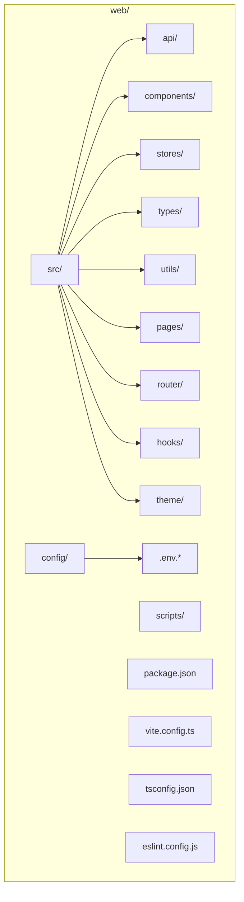
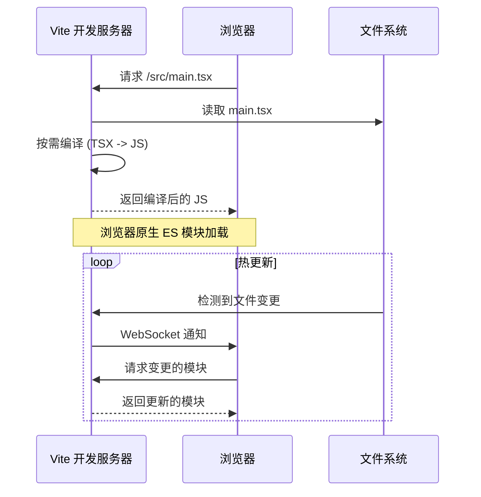
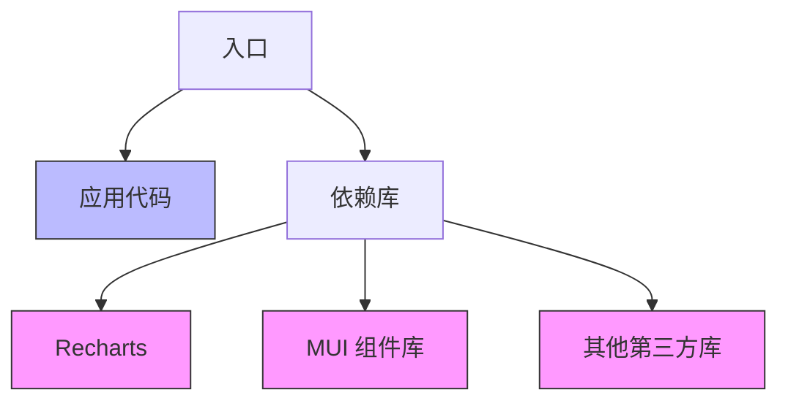
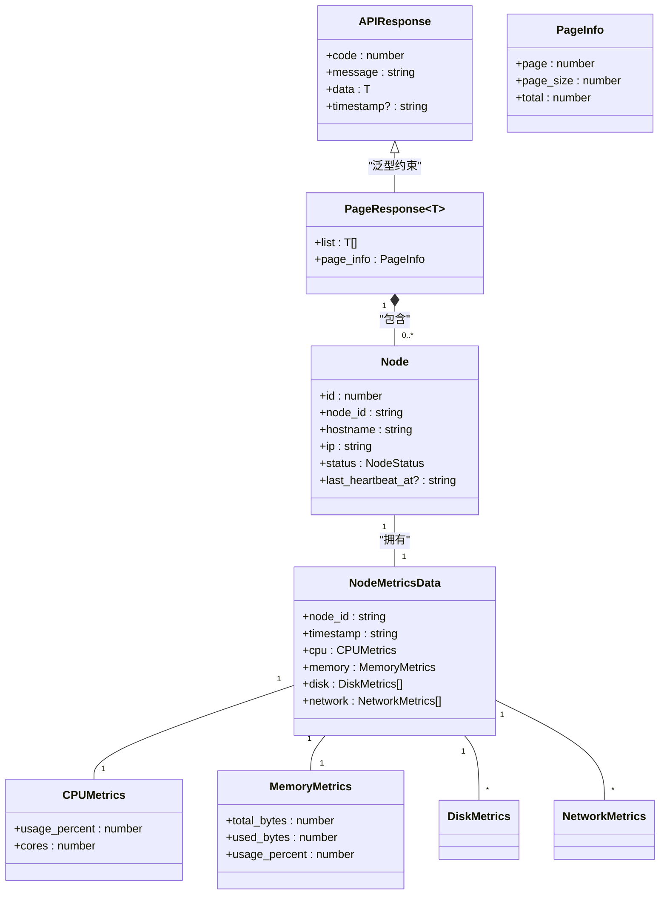
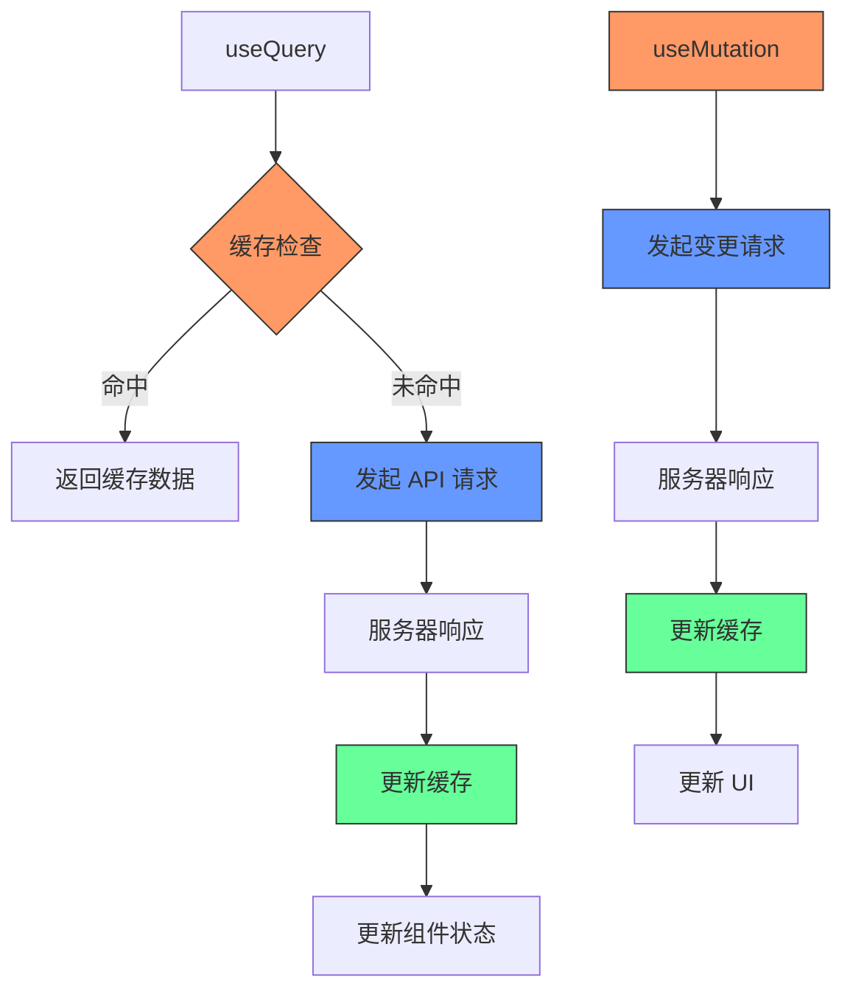
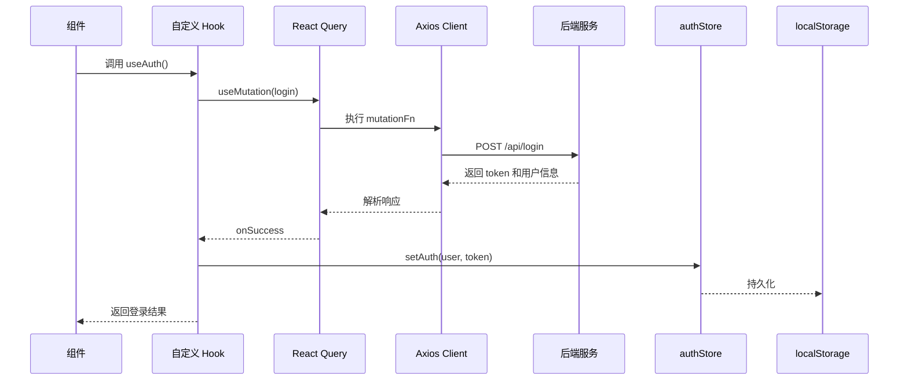
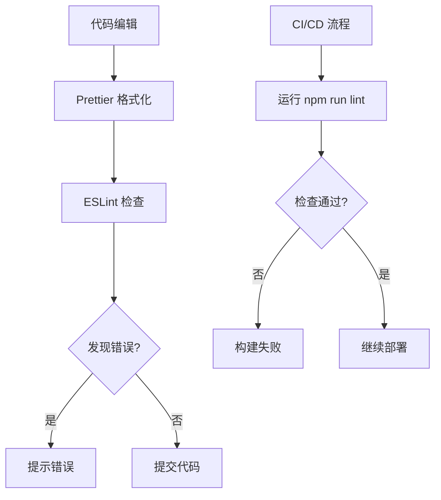

# 前端技术架构

<cite>
**本文档引用的文件**  
- [package.json](file://web/package.json)
- [vite.config.ts](file://web/vite.config.ts)
- [tsconfig.json](file://web/tsconfig.json)
- [tsconfig.app.json](file://web/tsconfig.app.json)
- [tsconfig.node.json](file://web/tsconfig.node.json)
- [eslint.config.js](file://web/eslint.config.js)
- [.env.development](file://web/.env.development)
- [.env.production](file://web/.env.production)
- [src/types/index.ts](file://web/src/types/index.ts)
- [src/types/api.ts](file://web/src/types/api.ts)
- [src/types/agent.ts](file://web/src/types/agent.ts)
- [src/types/node.ts](file://web/src/types/node.ts)
- [src/stores/authStore.ts](file://web/src/stores/authStore.ts)
- [src/stores/metricsStore.ts](file://web/src/stores/metricsStore.ts)
- [src/hooks/useAuth.ts](file://web/src/hooks/useAuth.ts)
- [src/hooks/useMetrics.ts](file://web/src/hooks/useMetrics.ts)
- [src/api/client.ts](file://web/src/api/client.ts)
- [src/App.tsx](file://web/src/App.tsx)
</cite>

## 目录
1. [项目结构](#项目结构)
2. [核心技术栈选型](#核心技术栈选型)
3. [Vite 构建系统](#vite-构建系统)
4. [TypeScript 类型系统](#typescript-类型系统)
5. [状态管理架构](#状态管理架构)
6. [API 与数据流设计](#api-与数据流设计)
7. [环境变量与配置管理](#环境变量与配置管理)
8. [代码质量保障](#代码质量保障)
9. [技术选型对比分析](#技术选型对比分析)
10. [最佳实践](#最佳实践)

## 项目结构

前端项目位于 `web/` 目录下，采用模块化、分层化的组织结构，清晰地分离关注点，便于维护和扩展。



**Diagram sources**  
- [web/package.json](file://web/package.json)
- [web/vite.config.ts](file://web/vite.config.ts)
- [web/tsconfig.json](file://web/tsconfig.json)

**Section sources**  
- [web/package.json](file://web/package.json)
- [web/vite.config.ts](file://web/vite.config.ts)

## 核心技术栈选型

本项目采用 **React 19 + TypeScript 5 + Vite 7** 作为核心技术组合，构建现代化、高性能的运维管理前端应用。

- **React 19**: 采用最新的 React 版本，利用其优化的渲染机制和并发特性，提升应用性能和用户体验。
- **TypeScript 5**: 提供强大的静态类型检查，确保代码的健壮性和可维护性，减少运行时错误。
- **Vite 7**: 利用其基于 ES 模块的原生浏览器支持，实现极速的开发服务器启动和热模块替换（HMR）。

该技术栈的选择旨在平衡开发效率、运行性能和长期可维护性，为复杂的运维监控场景提供坚实基础。

**Section sources**  
- [web/package.json](file://web/package.json)
- [web/tsconfig.json](file://web/tsconfig.json)
- [web/vite.config.ts](file://web/vite.config.ts)

## Vite 构建系统

Vite 作为项目的构建工具，在开发和生产环境均展现出卓越性能。

### 开发服务器优势

Vite 的开发服务器利用浏览器原生 ES 模块导入，实现了近乎即时的冷启动和热更新。当项目启动时，Vite 仅对依赖进行预构建，而源代码则按需编译，这使得大型项目也能在秒级内启动。



**Diagram sources**  
- [web/vite.config.ts](file://web/vite.config.ts)
- [web/src/main.tsx](file://web/src/main.tsx)

### 生产构建优化策略

生产构建基于 Rollup，通过精细化的代码分割策略优化最终包体积和加载性能。



如 `vite.config.ts` 中配置，构建过程将依赖库分割为多个 chunk：
- `recharts` 单独打包
- `@mui` 相关库合并为 `mui` chunk
- 其他 `node_modules` 依赖打包为 `vendor` chunk

这种策略有效利用浏览器缓存，当应用代码更新时，体积较大的第三方库无需重新下载。

**Section sources**  
- [web/vite.config.ts](file://web/vite.config.ts)
- [web/package.json](file://web/package.json)

## TypeScript 类型系统

TypeScript 为项目提供了全面的类型安全，其类型定义文件组织清晰，便于维护。

### 类型定义组织

类型定义集中存放在 `src/types/` 目录下，采用模块化设计：
- `api.ts`: 定义 API 响应的通用结构和错误码
- `agent.ts`: Agent 相关的数据模型
- `node.ts`: 节点和监控指标的数据结构
- `user.ts`: 用户信息类型
- `index.ts`: 统一导出所有类型，简化导入



**Diagram sources**  
- [src/types/api.ts](file://web/src/types/api.ts)
- [src/types/node.ts](file://web/src/types/node.ts)
- [src/types/agent.ts](file://web/src/types/agent.ts)

### 严格类型检查

`tsconfig.app.json` 配置了严格的编译选项：
- `"strict": true`: 启用所有严格类型检查选项
- `"noUnusedLocals": true`: 禁止未使用的局部变量
- `"noFallthroughCasesInSwitch": true`: 禁止 switch 语句的 case 穿透

这些配置确保了代码的高质量和类型安全。

**Section sources**  
- [web/tsconfig.app.json](file://web/tsconfig.app.json)
- [web/tsconfig.json](file://web/tsconfig.json)
- [src/types/index.ts](file://web/src/types/index.ts)

## 状态管理架构

项目采用组合式状态管理方案，结合 Zustand 和 React Query，分别处理客户端状态和服务器状态。

### 客户端状态：Zustand

使用 Zustand 管理持久化的客户端状态，如用户认证信息。

```mermaid
classDiagram
class AuthState {
+user : User | null
+token : string | null
+isAuthenticated : boolean
+_hasHydrated : boolean
+setAuth(user, token)
+clearAuth()
+updateUser(user)
+setHasHydrated(state)
}
class useAuthStore {
+create~AuthState~()
+persist()
}
useAuthStore --> AuthState : "实现"
AuthState --> "localStorage" : "持久化"
```

`authStore.ts` 中的 `useAuthStore` 使用 `zustand/persist` 中间件，将认证状态持久化到 `localStorage`，并处理水合（hydration）过程，确保页面刷新后状态能正确恢复。

**Diagram sources**  
- [src/stores/authStore.ts](file://web/src/stores/authStore.ts)
- [src/types/user.ts](file://web/src/types/user.ts)

### 服务器状态：React Query

使用 React Query 管理所有与服务器交互的数据状态，提供强大的缓存、自动刷新和错误处理能力。



如 `useMetrics.ts` 中所示，`useLatestMetrics` 配置了 `refetchInterval: 30000` 实现指标的自动轮询，`staleTime` 控制缓存的有效期，避免不必要的重复请求。

**Section sources**  
- [src/stores/authStore.ts](file://web/src/stores/authStore.ts)
- [src/stores/metricsStore.ts](file://web/src/stores/metricsStore.ts)
- [src/hooks/useAuth.ts](file://web/src/hooks/useAuth.ts)
- [src/hooks/useMetrics.ts](file://web/src/hooks/useMetrics.ts)

## API 与数据流设计

API 层设计清晰，封装了与后端服务的通信逻辑。

### Axios 客户端配置

`api/client.ts` 创建了全局的 Axios 实例，统一配置基础 URL 和超时时间，这些值从环境变量中读取。



**Diagram sources**  
- [src/api/client.ts](file://web/src/api/client.ts)
- [src/hooks/useAuth.ts](file://web/src/hooks/useAuth.ts)
- [src/stores/authStore.ts](file://web/src/stores/authStore.ts)

### 请求拦截器

项目使用 `interceptors.ts` 实现请求拦截器，在请求头中自动添加认证 token，并对响应进行统一的错误处理，确保了 API 调用的一致性和安全性。

**Section sources**  
- [src/api/client.ts](file://web/src/api/client.ts)
- [src/api/interceptors.ts](file://web/src/api/interceptors.ts)

## 环境变量与配置管理

项目通过 Vite 的环境变量机制实现多环境配置。

### 环境变量文件

- `.env.development`: 开发环境配置，API 基地址指向本地后端 `http://127.0.0.1:8080`
- `.env.production`: 生产环境配置，API 基地址为相对路径 `/api`，便于反向代理

所有环境变量均以 `VITE_` 开头，确保能被 Vite 正确识别和注入。

```mermaid
flowchart LR
A[代码中] --> B[import.meta.env.VITE_API_BASE_URL]
B --> C{构建时}
C --> |开发| D[替换为 .env.development 的值]
C --> |生产| E[替换为 .env.production 的值]
D --> F[http://127.0.0.1:8080]
E --> G[/api]
```

**Section sources**  
- [.env.development](file://web/.env.development)
- [.env.production](file://web/.env.production)
- [src/api/client.ts](file://web/src/api/client.ts)

## 代码质量保障

项目集成了 ESLint 和 Prettier，确保代码风格统一和质量。

### ESLint 配置

`eslint.config.js` 集成了多个推荐配置：
- `@eslint/js`: ESLint 官方推荐规则
- `typescript-eslint`: TypeScript 支持
- `eslint-plugin-react-hooks`: React Hooks 规则
- `eslint-plugin-react-refresh`: Vite HMR 支持



**Section sources**  
- [eslint.config.js](file://web/eslint.config.js)
- [package.json](file://web/package.json)

## 技术选型对比分析

### Vite vs Webpack

| 特性 | Vite | Webpack |
| :--- | :--- | :--- |
| **开发服务器启动** | <1 秒 | 数秒至数十秒 |
| **热更新速度** | 毫秒级 | 秒级 |
| **构建原理** | 基于 ES 模块 | 基于打包 |
| **配置复杂度** | 简单 | 复杂 |
| **适用场景** | 现代化项目 | 老旧项目兼容 |

Vite 的优势在于其利用现代浏览器原生支持 ES 模块的特性，避免了开发时的全量打包，从而实现了极速的开发体验。

### Zustand vs Redux

| 特性 | Zustand | Redux |
| :--- | :--- | :--- |
| **学习曲线** | 低 | 高 |
| **代码量** | 少 | 多 |
| **样板代码** | 几乎无 | 多 |
| **中间件** | 简单 | 复杂 |
| **持久化** | 内置中间件 | 需额外库 |

Zustand 以其极简的 API 和零样板代码，特别适合中小型应用的状态管理，降低了开发复杂度。

### React Query vs 传统状态管理

| 特性 | React Query | 传统方式 |
| :--- | :--- | :--- |
| **缓存管理** | 自动 | 手动 |
| **数据同步** | 自动 | 手动 |
| **错误处理** | 内置 | 自行实现 |
| **加载状态** | 内置 | 自行管理 |
| **代码复杂度** | 低 | 高 |

React Query 将服务器状态管理从组件逻辑中解耦，开发者只需关注数据的获取和使用，极大地简化了异步数据流的处理。

**Section sources**  
- [package.json](file://web/package.json)
- [src/hooks/useMetrics.ts](file://web/src/hooks/useMetrics.ts)
- [src/stores/authStore.ts](file://web/src/stores/authStore.ts)

## 最佳实践

### 项目初始化

1. 克隆仓库并进入 `web/` 目录
2. 运行 `npm install` 安装依赖
3. 复制 `.env.example` 为 `.env` 并根据环境修改配置
4. 运行 `npm run dev` 启动开发服务器

### 依赖管理

- 使用 `npm install` 添加依赖
- 生产依赖添加到 `dependencies`，开发依赖添加到 `devDependencies`
- 定期运行 `npm audit` 检查安全漏洞

### CI/CD 集成

项目可通过简单的脚本集成到 CI/CD 流程：
```bash
# 构建
npm run build

# 运行测试
npm run test:coverage

# 部署
# 将 dist 目录内容部署到 Web 服务器
```

**Section sources**  
- [package.json](file://web/package.json)
- [vite.config.ts](file://web/vite.config.ts)
- [README.md](file://web/README.md)