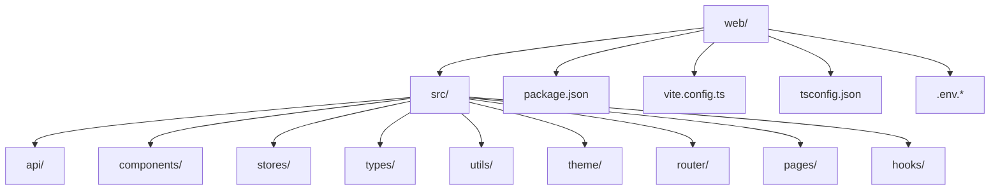
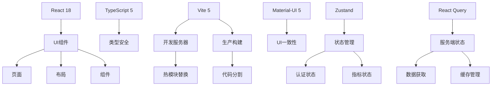
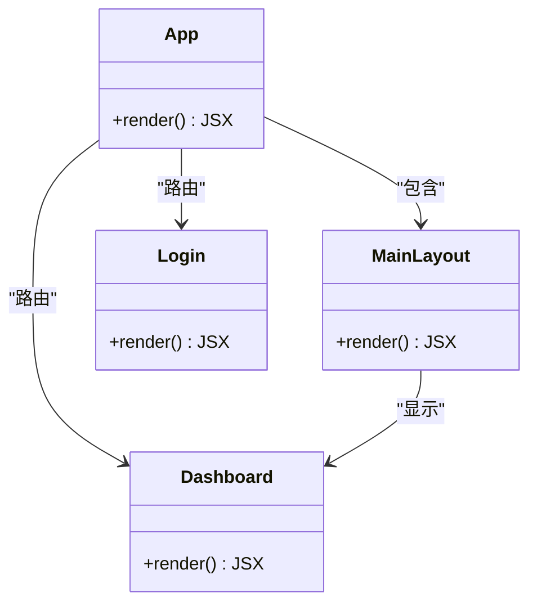
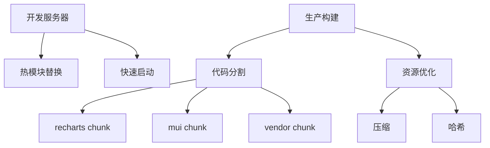
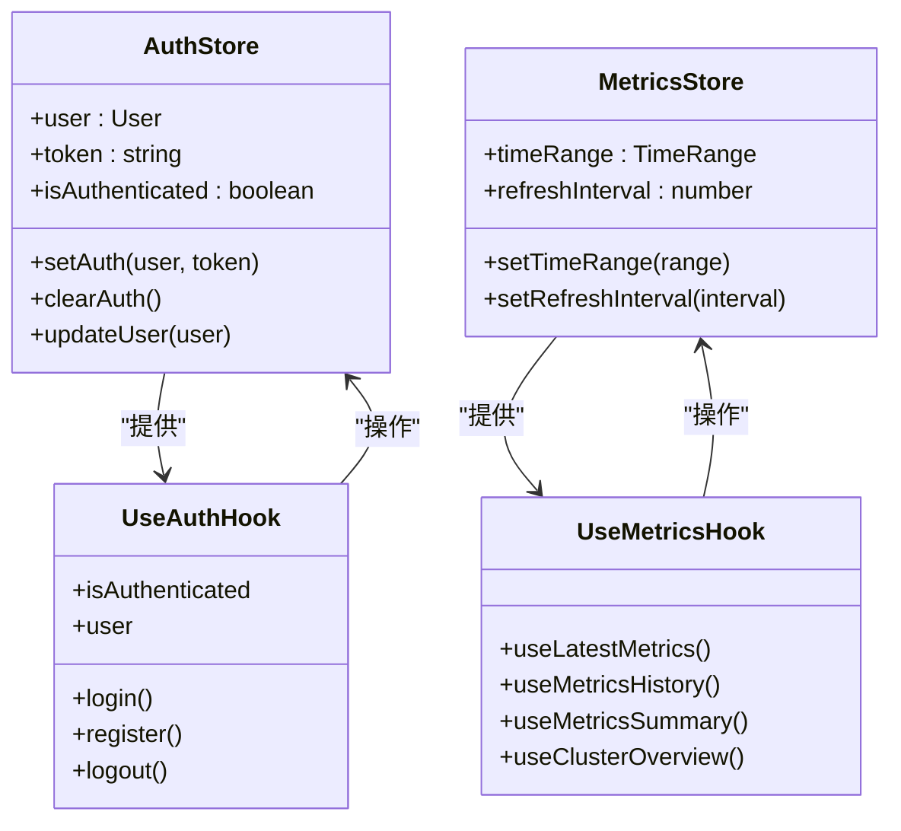
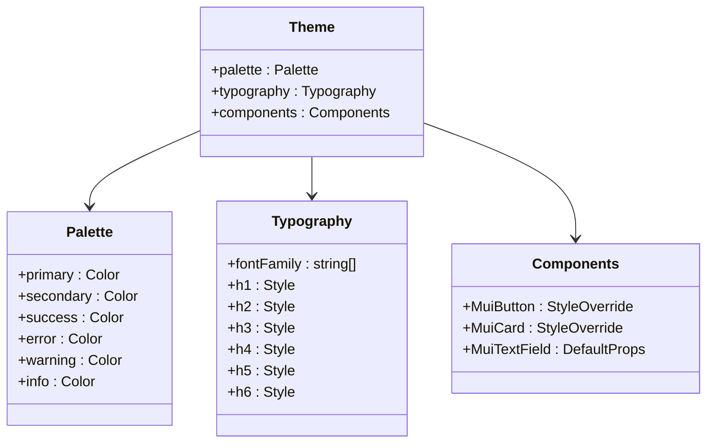
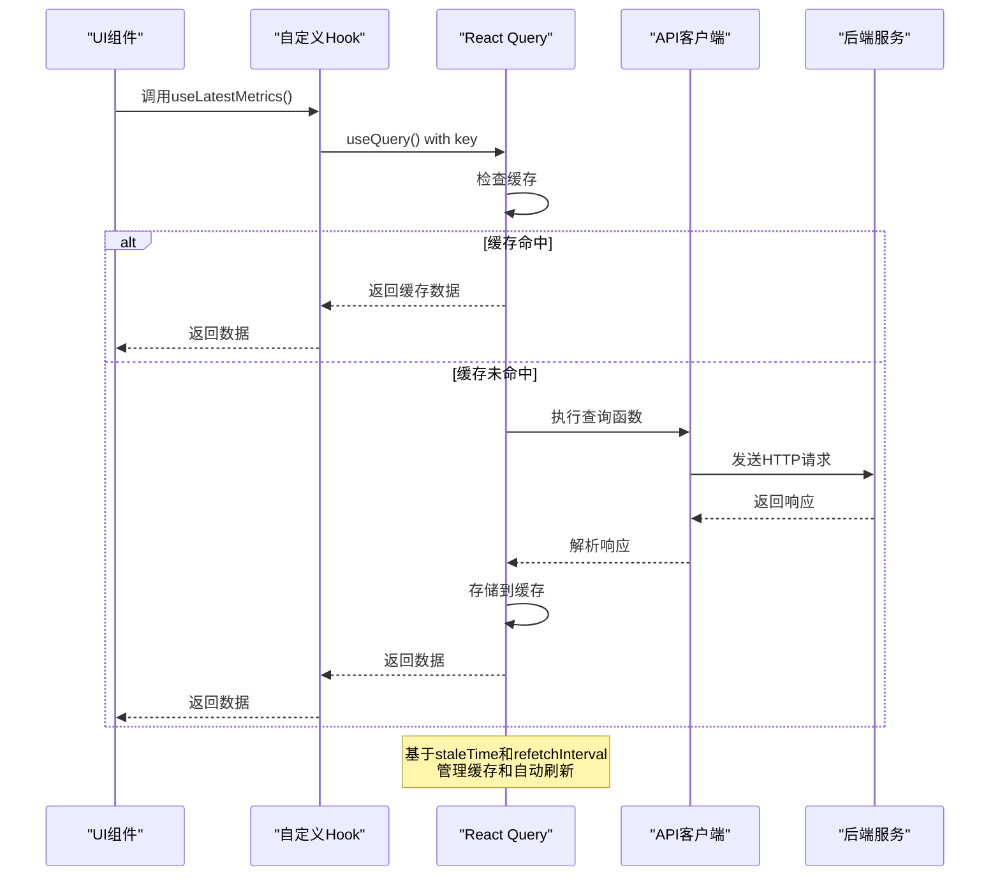
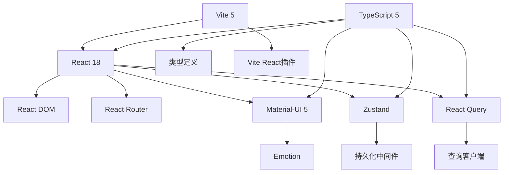
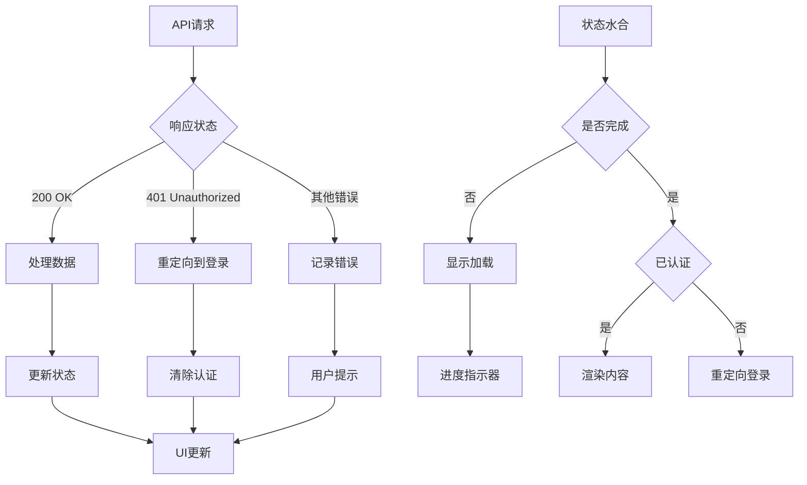

# 技术栈选型

<cite>
**本文档引用的文件**  
- [package.json](file://web/package.json)
- [vite.config.ts](file://web/vite.config.ts)
- [tsconfig.json](file://web/tsconfig.json)
- [App.tsx](file://web/src/App.tsx)
- [authStore.ts](file://web/src/stores/authStore.ts)
- [metricsStore.ts](file://web/src/stores/metricsStore.ts)
- [useAuth.ts](file://web/src/hooks/useAuth.ts)
- [useMetrics.ts](file://web/src/hooks/useMetrics.ts)
- [theme/index.ts](file://web/src/theme/index.ts)
- [auth.ts](file://web/src/api/auth.ts)
- [user.ts](file://web/src/types/user.ts)
- [metrics.ts](file://web/src/types/metrics.ts)
- [storage.ts](file://web/src/utils/storage.ts)
- [ProtectedRoute.tsx](file://web/src/router/ProtectedRoute.tsx)
</cite>

## 目录
1. [引言](#引言)
2. [项目结构](#项目结构)
3. [核心组件](#核心组件)
4. [架构概述](#架构概述)
5. [详细组件分析](#详细组件分析)
6. [依赖分析](#依赖分析)
7. [性能考虑](#性能考虑)
8. [故障排除指南](#故障排除指南)
9. [结论](#结论)

## 引言
本文档详细阐述了运维工具框架前端技术栈的选型依据，重点分析React 18、TypeScript 5、Vite 5、Material-UI 5、Zustand和React Query等核心技术的选择理由。通过对比Redux与Zustand、Webpack与Vite等可选方案的优劣，说明各技术在项目中的具体作用和集成方式，包括TypeScript的类型安全优势、Vite的开发构建性能提升、Material-UI的UI一致性保障、Zustand的轻量级状态管理以及React Query的服务端状态同步能力，并提供技术栈版本选择的考量因素和未来升级路径。

## 项目结构
前端应用位于`web/`目录下，采用现代前端工程化架构。项目结构清晰，包含源代码、配置文件、测试和文档等完整组成部分。

**Diagram sources**
- [package.json](file://web/package.json)
- [vite.config.ts](file://web/vite.config.ts)

**Section sources**
- [package.json](file://web/package.json)
- [vite.config.ts](file://web/vite.config.ts)

## 核心组件
本项目采用现代化的前端技术栈组合，核心组件包括React 18作为UI框架，TypeScript 5提供类型安全，Vite 5作为构建工具，Material-UI 5用于UI组件库，Zustand进行状态管理，React Query处理服务端状态同步。

**Section sources**
- [package.json](file://web/package.json)
- [tsconfig.json](file://web/tsconfig.json)

## 架构概述
前端应用采用分层架构设计，各技术栈协同工作，形成高效、可维护的开发体系。

**Diagram sources**
- [App.tsx](file://web/src/App.tsx)
- [vite.config.ts](file://web/vite.config.ts)

## 详细组件分析

### React 18与TypeScript集成分析
React 18与TypeScript 5的集成提供了强大的类型安全和现代化的React特性支持。

**Diagram sources**
- [App.tsx](file://web/src/App.tsx)
- [main.tsx](file://web/src/main.tsx)

**Section sources**
- [App.tsx](file://web/src/App.tsx)
- [main.tsx](file://web/src/main.tsx)

### Vite构建系统分析
Vite 5作为构建工具，在开发和生产环境中提供了卓越的性能表现。

**Diagram sources**
- [vite.config.ts](file://web/vite.config.ts)
- [package.json](file://web/package.json)

**Section sources**
- [vite.config.ts](file://web/vite.config.ts)
- [package.json](file://web/package.json)

### 状态管理架构分析
项目采用Zustand进行状态管理，结合React Query处理服务端状态，形成完整的状态管理解决方案。

**Diagram sources**
- [authStore.ts](file://web/src/stores/authStore.ts)
- [metricsStore.ts](file://web/src/stores/metricsStore.ts)
- [useAuth.ts](file://web/src/hooks/useAuth.ts)
- [useMetrics.ts](file://web/src/hooks/useMetrics.ts)

**Section sources**
- [authStore.ts](file://web/src/stores/authStore.ts)
- [metricsStore.ts](file://web/src/stores/metricsStore.ts)
- [useAuth.ts](file://web/src/hooks/useAuth.ts)
- [useMetrics.ts](file://web/src/hooks/useMetrics.ts)

### UI组件与主题系统分析
Material-UI 5提供了丰富的UI组件和灵活的主题系统，确保了应用的视觉一致性和可定制性。

**Diagram sources**
- [theme/index.ts](file://web/src/theme/index.ts)
- [App.tsx](file://web/src/App.tsx)

**Section sources**
- [theme/index.ts](file://web/src/theme/index.ts)
- [App.tsx](file://web/src/App.tsx)

### 服务端状态同步分析
React Query与API层的集成实现了高效的服务端状态管理，包括数据获取、缓存、错误处理和自动刷新。

**Diagram sources**
- [useMetrics.ts](file://web/src/hooks/useMetrics.ts)
- [auth.ts](file://web/src/api/auth.ts)
- [client.ts](file://web/src/api/client.ts)

**Section sources**
- [useMetrics.ts](file://web/src/hooks/useMetrics.ts)
- [auth.ts](file://web/src/api/auth.ts)

## 依赖分析
项目依赖关系清晰，各技术栈之间协同工作，形成高效的技术生态。

**Diagram sources**
- [package.json](file://web/package.json)
- [tsconfig.json](file://web/tsconfig.json)

**Section sources**
- [package.json](file://web/package.json)
- [tsconfig.json](file://web/tsconfig.json)

## 性能考虑
技术栈选型充分考虑了开发和生产环境的性能需求，通过Vite的快速启动、代码分割和React Query的智能缓存等机制优化应用性能。

**Section sources**
- [vite.config.ts](file://web/vite.config.ts)
- [App.tsx](file://web/src/App.tsx)
- [useMetrics.ts](file://web/src/hooks/useMetrics.ts)

## 故障排除指南
本节分析了应用中的关键错误处理机制和调试工具。

**Diagram sources**
- [ProtectedRoute.tsx](file://web/src/router/ProtectedRoute.tsx)
- [useMetrics.ts](file://web/src/hooks/useMetrics.ts)
- [interceptors.ts](file://web/src/api/interceptors.ts)

**Section sources**
- [ProtectedRoute.tsx](file://web/src/router/ProtectedRoute.tsx)
- [useMetrics.ts](file://web/src/hooks/useMetrics.ts)

## 结论
本项目的技术栈选型经过深思熟虑，React 18提供了现代化的UI开发体验，TypeScript 5确保了代码的类型安全和可维护性，Vite 5极大提升了开发效率和构建性能，Material-UI 5保障了UI的一致性和专业性，Zustand作为轻量级状态管理方案避免了Redux的复杂性，而React Query则优雅地解决了服务端状态管理的挑战。这种技术组合既满足了当前项目的需求，又为未来的扩展和升级提供了良好的基础。