# 构建与工程化

<cite>
**本文档引用的文件**  
- [vite.config.ts](file://web/vite.config.ts)
- [tsconfig.json](file://web/tsconfig.json)
- [tsconfig.app.json](file://web/tsconfig.app.json)
- [tsconfig.node.json](file://web/tsconfig.node.json)
- [package.json](file://web/package.json)
- [eslint.config.js](file://web/eslint.config.js)
- [.env.development](file://web/.env.development)
- [.env.production](file://web/.env.production)
- [.env.example](file://web/.env.example)
- [vitest.config.ts](file://web/vitest.config.ts)
- [src/main.tsx](file://web/src/main.tsx)
- [src/App.tsx](file://web/src/App.tsx)
- [src/api/client.ts](file://web/src/api/client.ts)
</cite>

## 目录
1. [简介](#简介)
2. [项目结构](#项目结构)
3. [核心组件](#核心组件)
4. [架构概述](#架构概述)
5. [详细组件分析](#详细组件分析)
6. [依赖分析](#依赖分析)
7. [性能考虑](#性能考虑)
8. [故障排除指南](#故障排除指南)
9. [结论](#结论)

## 简介
本文档深入解析运维工具框架前端的构建与工程化配置，涵盖 Vite 构建工具、TypeScript 编译配置、环境变量管理以及代码质量保障体系。文档详细说明了开发服务器配置、构建优化选项、插件系统集成方式、TypeScript 编译选项对开发体验的影响、环境变量在不同环境下的应用策略，以及开发、构建、测试的完整工作流程。

## 项目结构
前端项目位于 `web/` 目录下，采用现代化的前端工程化架构。项目使用 Vite 作为构建工具，React 作为 UI 框架，TypeScript 作为开发语言，并集成了 ESLint、Prettier、Vitest 等代码质量工具。

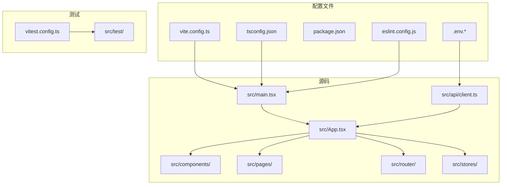

**Diagram sources**
- [vite.config.ts](file://web/vite.config.ts#L1-L38)
- [tsconfig.json](file://web/tsconfig.json#L1-L8)
- [package.json](file://web/package.json#L1-L57)

**Section sources**
- [vite.config.ts](file://web/vite.config.ts#L1-L38)
- [tsconfig.json](file://web/tsconfig.json#L1-L8)
- [package.json](file://web/package.json#L1-L57)

## 核心组件
前端核心组件包括 Vite 构建配置、TypeScript 编译配置、环境变量管理系统和代码质量保障体系。这些组件共同构成了项目的工程化基础，确保了开发效率、代码质量和构建性能。

**Section sources**
- [vite.config.ts](file://web/vite.config.ts#L1-L38)
- [tsconfig.json](file://web/tsconfig.json#L1-L8)
- [package.json](file://web/package.json#L1-L57)

## 架构概述
项目采用分层架构设计，基于 React 19 和 Vite 7 构建。架构分为配置层、应用层、服务层和数据层，各层职责分明，耦合度低。

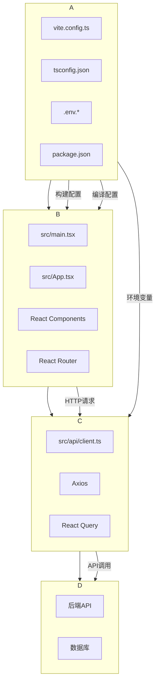

**Diagram sources**
- [vite.config.ts](file://web/vite.config.ts#L1-L38)
- [tsconfig.json](file://web/tsconfig.json#L1-L8)
- [src/main.tsx](file://web/src/main.tsx#L1-L11)
- [src/App.tsx](file://web/src/App.tsx#L1-L57)

## 详细组件分析

### Vite 配置分析
Vite 配置文件定义了开发服务器、构建优化和插件系统，是项目构建的核心。

#### 开发服务器配置
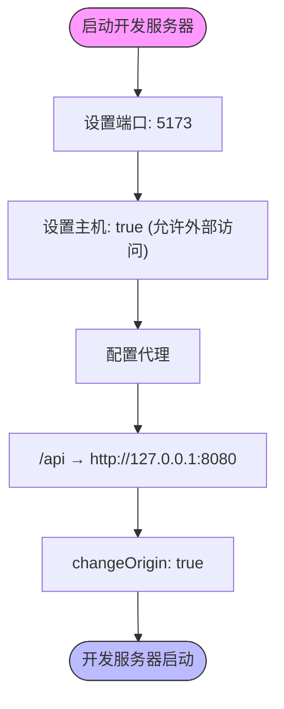

**Diagram sources**
- [vite.config.ts](file://web/vite.config.ts#L7-L15)

#### 构建优化配置
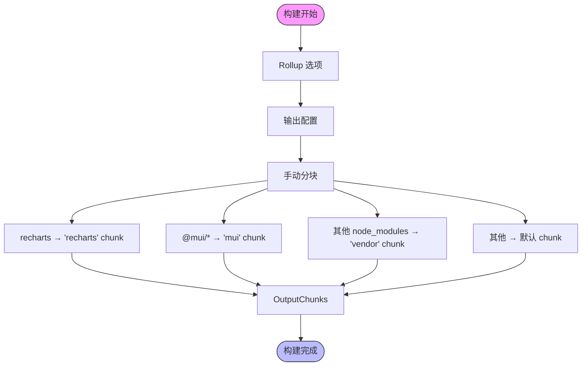

**Diagram sources**
- [vite.config.ts](file://web/vite.config.ts#L17-L35)

#### 插件系统集成
```mermaid
classDiagram
class ViteConfig {
+plugins : Plugin[]
+server : ServerOptions
+build : BuildOptions
}
class ReactPlugin {
+name : string
+config()
+transform()
+handleHotUpdate()
}
class ESLintPlugin {
+name : string
+config()
+transform()
}
ViteConfig --> ReactPlugin : "集成"
ViteConfig --> ESLintPlugin : "通过eslint.config.js集成"
ReactPlugin --> ViteConfig : "提供React支持"
ESLintPlugin --> ViteConfig : "提供代码检查"
note right of ViteConfig
Vite 核心配置
end
note right of ReactPlugin
@vitejs/plugin-react
提供React 19支持
JSX转换
HMR热更新
end
note right of ESLintPlugin
通过eslint.config.js配置
集成typescript-eslint
react-hooks规则
react-refresh规则
end
```

**Diagram sources**
- [vite.config.ts](file://web/vite.config.ts#L6-L7)
- [eslint.config.js](file://web/eslint.config.js#L1-L24)

**Section sources**
- [vite.config.ts](file://web/vite.config.ts#L1-L38)
- [eslint.config.js](file://web/eslint.config.js#L1-L24)

### TypeScript 配置分析
TypeScript 配置采用引用式配置，将不同类型的目标分离到不同的配置文件中。

#### 主配置文件
```mermaid
classDiagram
class tsconfig.json {
+files : []
+references : Reference[]
}
class tsconfig_app {
+compilerOptions : CompilerOptions
+include : string[]
}
class tsconfig_node {
+compilerOptions : CompilerOptions
+include : string[]
}
tsconfig.json --> tsconfig_app : "引用"
tsconfig.json --> tsconfig_node : "引用"
tsconfig_app --> tsconfig.json : "被引用"
tsconfig_node --> tsconfig.json : "被引用"
note right of tsconfig.json
根配置文件
不包含具体编译选项
通过引用组合配置
end
note right of tsconfig_app
应用编译配置
目标 : ES2022
包含 : src/
类型 : vite/client
end
note right of tsconfig_node
Node编译配置
目标 : ES2023
包含 : vite.config.ts
类型 : node
end
```

**Diagram sources**
- [tsconfig.json](file://web/tsconfig.json#L1-L8)
- [tsconfig.app.json](file://web/tsconfig.app.json#L1-L29)
- [tsconfig.node.json](file://web/tsconfig.node.json#L1-L27)

#### 应用编译选项
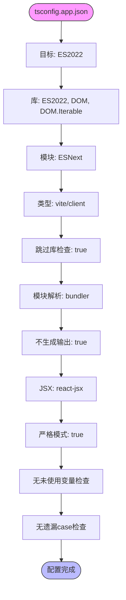

**Diagram sources**
- [tsconfig.app.json](file://web/tsconfig.app.json#L1-L29)

**Section sources**
- [tsconfig.json](file://web/tsconfig.json#L1-L8)
- [tsconfig.app.json](file://web/tsconfig.app.json#L1-L29)
- [tsconfig.node.json](file://web/tsconfig.node.json#L1-L27)

### 环境变量管理分析
环境变量系统通过 .env 文件实现多环境配置，支持开发、生产等不同环境的差异化设置。

#### 环境变量文件结构
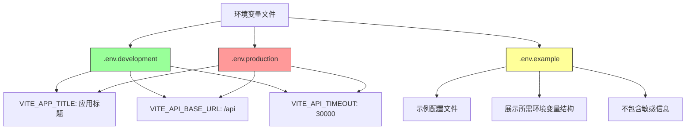

#### 环境变量应用流程
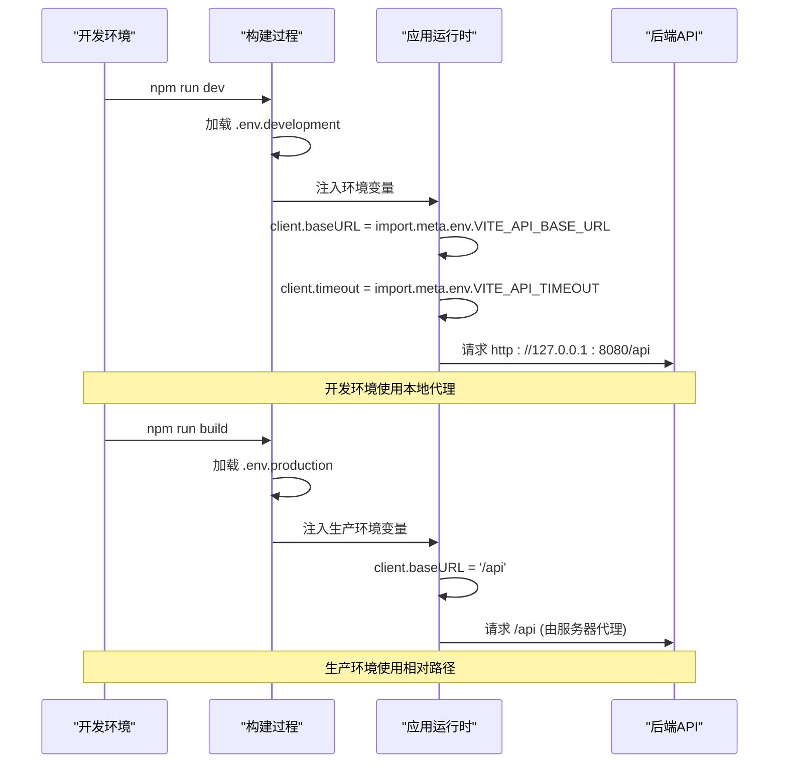

**Diagram sources**
- [.env.development](file://web/.env.development#L1-L5)
- [.env.production](file://web/.env.production#L1-L5)
- [src/api/client.ts](file://web/src/api/client.ts#L9-L15)

**Section sources**
- [.env.development](file://web/.env.development#L1-L5)
- [.env.production](file://web/.env.production#L1-L5)
- [.env.example](file://web/.env.example#L1-L12)
- [src/api/client.ts](file://web/src/api/client.ts#L9-L15)

### 工作流程分析
项目通过 package.json 中的脚本命令定义了完整的开发、构建、测试工作流程。

#### 脚本命令流程
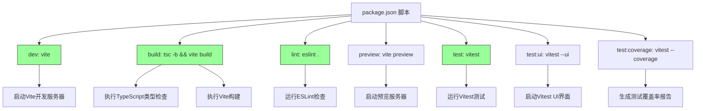

#### 完整开发工作流
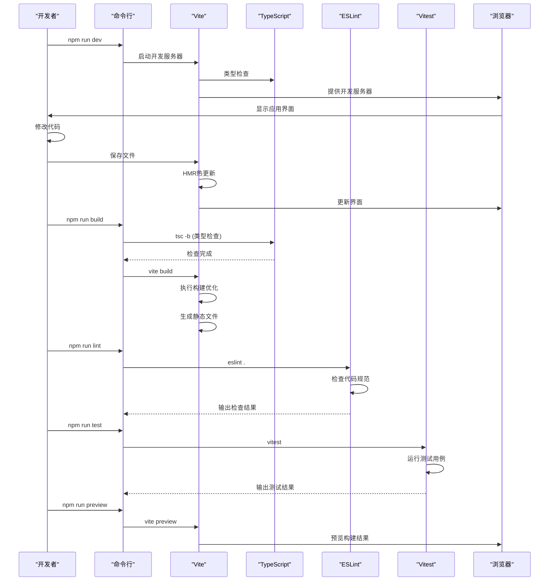

**Diagram sources**
- [package.json](file://web/package.json#L6-L14)
- [vite.config.ts](file://web/vite.config.ts#L1-L38)
- [tsconfig.json](file://web/tsconfig.json#L1-L8)

### 代码质量保障分析
项目集成了 ESLint 和 Prettier 等工具，建立了完整的代码质量保障体系。

#### ESLint 配置结构
```mermaid
classDiagram
class ESLintConfig {
+extends : string[]
+files : string[]
+languageOptions : LanguageOptions
}
class JSConfig {
+recommended : config
}
class TSESLintConfig {
+recommended : config
}
class ReactHooksConfig {
+recommended : config
}
class ReactRefreshConfig {
+vite : config
}
ESLintConfig --> JSConfig : "扩展"
ESLintConfig --> TSESLintConfig : "扩展"
ESLintConfig --> ReactHooksConfig : "扩展"
ESLintConfig --> ReactRefreshConfig : "扩展"
note right of ESLintConfig
根ESLint配置
使用defineConfig
忽略dist目录
end
note right of JSConfig
@eslint/js
JavaScript推荐规则
end
note right of TSESLintConfig
typescript-eslint
TypeScript推荐规则
end
note right of ReactHooksConfig
eslint-plugin-react-hooks
React Hooks规则
end
note right of ReactRefreshConfig
eslint-plugin-react-refresh
Vite HMR支持
end
```

#### 代码质量工作流
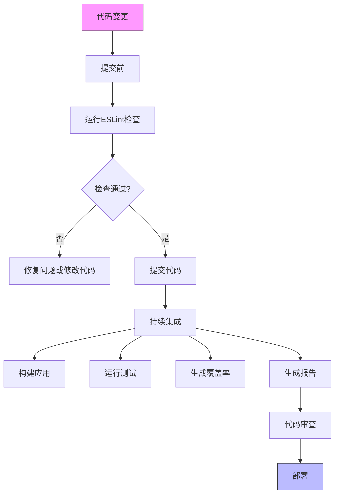

**Diagram sources**
- [eslint.config.js](file://web/eslint.config.js#L1-L24)
- [package.json](file://web/package.json#L9-L13)

**Section sources**
- [package.json](file://web/package.json#L6-L14)
- [eslint.config.js](file://web/eslint.config.js#L1-L24)
- [vitest.config.ts](file://web/vitest.config.ts#L1-L34)

## 依赖分析
项目依赖关系清晰，分为生产依赖和开发依赖，各依赖项职责分明。

```mermaid
graph TD
Vite[vite] --> ReactPlugin[@vitejs/plugin-react]
ReactPlugin --> React[react]
ReactPlugin --> ReactDOM[react-dom]
React --> MUI[@mui/material]
React --> MUIIcons[@mui/icons-material]
React --> MUIDate[@mui/x-date-pickers]
React --> Emotion[@emotion/react]
React --> EmotionStyled[@emotion/styled]
React --> ReactQuery[@tanstack/react-query]
React --> Axios[axios]
React --> Recharts[recharts]
React --> ECharts[echarts]
React --> EChartsReact[echarts-for-react]
React --> DateFns[date-fns]
React --> Dayjs[dayjs]
React --> Lodash[lodash-es]
React --> ReactRouter[react-router-dom]
React --> ReactHookForm[react-hook-form]
React --> Zustand[zustand]
Dev --> Vite
Dev --> ESLint[eslint]
Dev --> TSESLint[typescript-eslint]
Dev --> ReactHooks[eslint-plugin-react-hooks]
Dev --> ReactRefresh[eslint-plugin-react-refresh]
Dev --> TypesReact[@types/react]
Dev --> TypesReactDOM[@types/react-dom]
Dev --> TypesNode[@types/node]
Dev --> Vitest[vitest]
Dev --> TestingLib[@testing-library/react]
Dev --> JSDOM[jsdom]
Dev --> TypeScript[typescript]
style Vite fill:#9f9,stroke:#333
style Dev fill:#f99,stroke:#333
```

**Diagram sources**
- [package.json](file://web/package.json#L15-L55)

**Section sources**
- [package.json](file://web/package.json#L15-L55)

## 性能考虑
项目在构建和运行时都进行了性能优化，确保了良好的用户体验和构建效率。

### 构建性能优化
项目通过多种方式优化构建性能：

1. **代码分割**：通过 `manualChunks` 配置将大型依赖库（如 Recharts、MUI）单独分割，实现按需加载
2. **类型检查分离**：在构建脚本中先执行 `tsc -b` 进行类型检查，再执行 `vite build`，分离关注点
3. **开发服务器优化**：使用 Vite 的原生 ES 模块加载，实现快速启动和热更新
4. **缓存优化**：TypeScript 配置中使用 `tsBuildInfoFile` 实现增量编译

### 运行时性能优化
运行时性能优化主要体现在：

1. **HTTP 客户端配置**：Axios 客户端设置了合理的超时时间，避免请求长时间挂起
2. **React Query 配置**：合理配置了 `refetchOnWindowFocus`、`retry` 和 `staleTime`，平衡数据新鲜度和网络请求频率
3. **组件懒加载**：虽然配置中未显式定义，但 React Router 的路由结构为组件懒加载提供了基础
4. **资源按需加载**：通过代码分割，确保用户只加载当前需要的代码

**Section sources**
- [vite.config.ts](file://web/vite.config.ts#L17-L35)
- [package.json](file://web/package.json#L8-L9)
- [src/App.tsx](file://web/src/App.tsx#L17-L25)
- [src/api/client.ts](file://web/src/api/client.ts#L9-L15)

## 故障排除指南
本节提供常见问题的解决方案和调试建议。

### 常见问题及解决方案
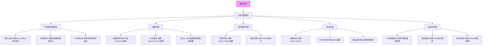

### 调试建议
1. **开发环境调试**：使用 `npm run dev` 启动开发服务器，利用浏览器开发者工具进行调试
2. **构建问题调试**：使用 `npm run build` 构建，检查控制台输出的错误信息
3. **类型检查调试**：查看 TypeScript 编译错误，确保类型定义正确
4. **测试调试**：使用 `npm run test:ui` 启动 Vitest UI 界面，可视化测试结果
5. **性能调试**：使用浏览器性能分析工具，检查加载时间和运行性能

**Section sources**
- [vite.config.ts](file://web/vite.config.ts#L1-L38)
- [package.json](file://web/package.json#L6-L14)
- [vitest.config.ts](file://web/vitest.config.ts#L1-L34)
- [eslint.config.js](file://web/eslint.config.js#L1-L24)

## 结论
本文档全面分析了运维工具框架前端的构建与工程化配置。项目采用了现代化的前端技术栈，通过 Vite、TypeScript、React 等技术构建了一个高效、可维护的前端应用。工程化配置方面，项目实现了：

1. **高效的开发体验**：通过 Vite 的快速启动和热更新，提供了极佳的开发体验
2. **优化的构建性能**：通过代码分割和合理的构建配置，优化了包大小和加载性能
3. **严格的代码质量**：通过 ESLint、TypeScript 等工具，确保了代码的规范性和类型安全
4. **灵活的环境管理**：通过环境变量文件，实现了不同环境的差异化配置
5. **完整的测试体系**：通过 Vitest 等工具，建立了全面的测试覆盖

这些工程化实践为项目的长期维护和发展奠定了坚实的基础，确保了代码质量、开发效率和用户体验的平衡。