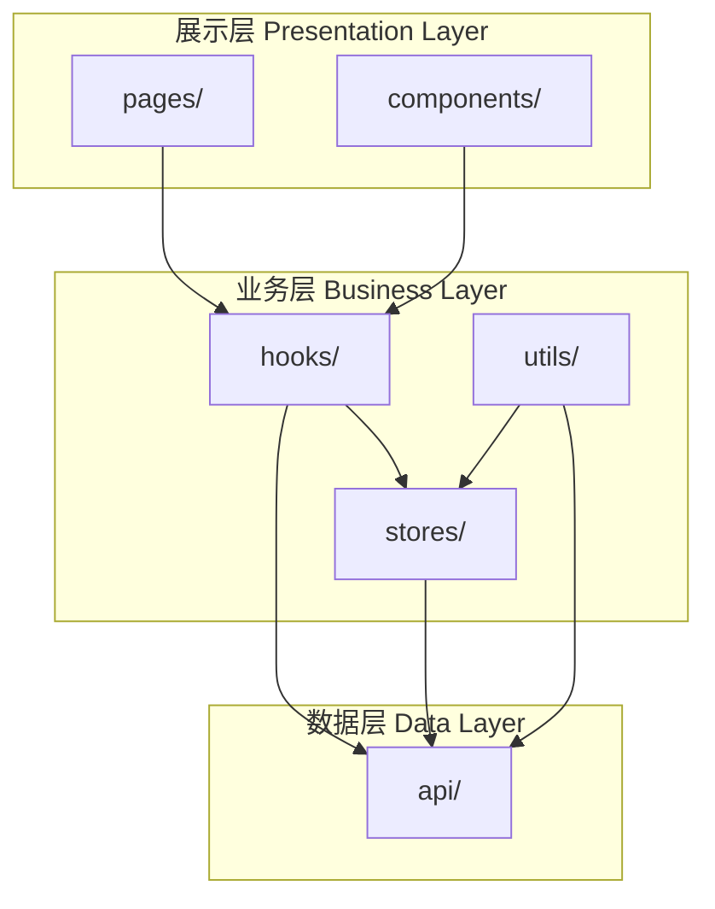
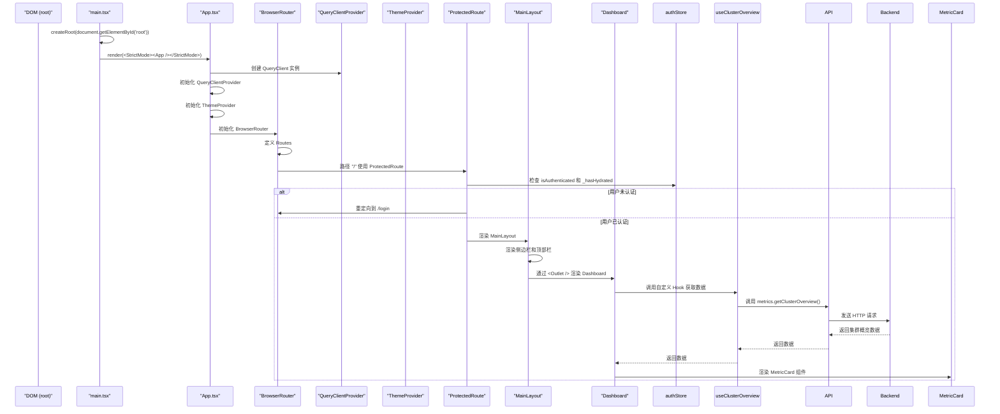

# 项目目录结构

<cite>
**本文档引用的文件**
- [设计文档_04_Web前端模块.md](file://docs/设计文档_04_Web前端模块.md)
- [main.tsx](file://web/src/main.tsx)
- [App.tsx](file://web/src/App.tsx)
- [authStore.ts](file://web/src/stores/authStore.ts)
- [useAuth.ts](file://web/src/hooks/useAuth.ts)
- [auth.ts](file://web/src/api/auth.ts)
- [user.ts](file://web/src/types/user.ts)
- [ProtectedRoute.tsx](file://web/src/router/ProtectedRoute.tsx)
- [MainLayout.tsx](file://web/src/components/Layout/MainLayout.tsx)
- [index.tsx](file://web/src/pages/Dashboard/index.tsx)
- [index.ts](file://web/src/api/index.ts)
- [index.ts](file://web/src/hooks/index.ts)
- [index.ts](file://web/src/stores/index.ts)
- [index.ts](file://web/src/types/index.ts)
- [index.ts](file://web/src/utils/index.ts)
</cite>

## 目录
1. [项目结构概览](#项目结构概览)
2. [分层架构设计](#分层架构设计)
3. [核心目录解析](#核心目录解析)
4. [项目启动流程与目录关联](#项目启动流程与目录关联)
5. [组织原则与命名规范](#组织原则与命名规范)

## 项目结构概览

本项目采用基于 React 的现代化前端架构，遵循清晰的分层和模块化设计原则。`web/src` 目录是前端应用的核心，其结构设计旨在实现高内聚、低耦合，便于团队协作和长期维护。



**Diagram sources**
- [设计文档_04_Web前端模块.md](file://docs/设计文档_04_Web前端模块.md#222-目录结构)

## 分层架构设计

项目的目录结构清晰地体现了四层架构设计理念：展示层、组件层、业务层和数据层。这种分层方式确保了关注点分离，使得代码更易于理解和维护。

### 展示层 (Presentation Layer)

展示层由 `pages/` 目录构成，负责定义应用的路由和页面级组件。每个页面组件（如 `Dashboard`、`Login`）都是一个独立的模块，负责协调下层组件和业务逻辑，构建完整的用户界面。

### 组件层 (Component Layer)

组件层位于 `components/` 目录下，包含可复用的 UI 组件。这些组件被进一步细分为：
- **Layout/**: 布局组件，如 `MainLayout.tsx`，定义了应用的整体框架。
- **Dashboard/**: 仪表盘专用组件，如 `TopNodesCard.tsx`。
- **Metrics/**: 监控指标相关的展示组件，如 `MetricCard.tsx`。

### 业务层 (Business Layer)

业务层是应用的核心逻辑所在，由 `hooks/`、`stores/` 和 `utils/` 三个目录组成，分别处理状态管理、自定义逻辑和工具函数。

### 数据层 (Data Layer)

数据层由 `api/` 目录实现，封装了所有与后端服务的通信逻辑，包括 API 客户端配置、请求拦截器和具体的业务 API 调用。

**Section sources**
- [设计文档_04_Web前端模块.md](file://docs/设计文档_04_Web前端模块.md#221-分层架构)

## 核心目录解析

### api 目录

`api/` 目录是应用与后端服务交互的唯一入口，实现了数据层的职责。

#### 设计理念
- **单一职责**: 每个文件（如 `auth.ts`、`nodes.ts`）负责一个特定的业务域。
- **统一出口**: `index.ts` 文件统一导出所有 API 模块，便于在其他地方导入。
- **拦截器机制**: `interceptors.ts` 配置了请求和响应拦截器，用于处理认证、错误等全局逻辑。

```mermaid
classDiagram
class client {
+axiosInstance : AxiosInstance
+interceptors : Request/Response Interceptors
+createClient() : AxiosInstance
}
class auth {
+login(data) : Promise~LoginResponse~
+register(data) : Promise~RegisterResponse~
+getProfile() : Promise~User~
+changePassword(data) : Promise~void~
}
class nodes {
+getNodes() : Promise~NodeList~
+getNodeDetail(id) : Promise~NodeDetail~
}
class metrics {
+getClusterOverview() : Promise~ClusterOverview~
+getNodeMetrics(id) : Promise~NodeMetrics~
}
client <|-- auth : "uses"
client <|-- nodes : "uses"
client <|-- metrics : "uses"
auth ..> "types" : "imports"
nodes ..> "types" : "imports"
metrics ..> "types" : "imports"
```

**Diagram sources**
- [client.ts](file://web/src/api/client.ts)
- [auth.ts](file://web/src/api/auth.ts)
- [nodes.ts](file://web/src/api/nodes.ts)
- [metrics.ts](file://web/src/api/metrics.ts)
- [index.ts](file://web/src/api/index.ts)

**Section sources**
- [auth.ts](file://web/src/api/auth.ts#L1-L43)
- [index.ts](file://web/src/api/index.ts#L1-L10)

### components 目录

`components/` 目录存放所有可复用的 UI 组件，是组件层的核心。

#### 设计理念
- **模块化**: 按功能或页面划分子目录，如 `Layout/`、`Dashboard/`。
- **高复用性**: 组件设计为无状态或通过 props 控制，便于在不同场景下使用。
- **样式隔离**: 组件的样式通常内联或通过 CSS-in-JS 实现，避免全局污染。

**Section sources**
- [MainLayout.tsx](file://web/src/components/Layout/MainLayout.tsx#L1-L184)

### pages 目录

`pages/` 目录包含应用的所有页面级组件，是展示层的主体。

#### 设计理念
- **路由映射**: 页面组件与路由一一对应，如 `Login/index.tsx` 对应 `/login` 路径。
- **逻辑协调**: 页面组件负责调用 `hooks` 获取数据，并将其传递给 `components` 进行渲染。
- **入口点**: 每个页面通常是一个独立的模块，可以有自己的样式和辅助组件。

**Section sources**
- [index.tsx](file://web/src/pages/Dashboard/index.tsx#L1-L193)

### stores 目录

`stores/` 目录使用 Zustand 实现全局状态管理，是业务层的关键部分。

#### 设计理念
- **状态集中管理**: 将应用的全局状态（如用户认证信息、主题设置）集中管理。
- **持久化**: 利用 Zustand 的 `persist` 中间件，将关键状态（如 token）持久化到 `localStorage`。
- **类型安全**: 与 TypeScript 深度集成，确保状态操作的类型安全。

```mermaid
classDiagram
class authStore {
-user : User
-token : string
-isAuthenticated : boolean
-_hasHydrated : boolean
+setAuth(user, token)
+clearAuth()
+updateUser(user)
+setHasHydrated(state)
}
class metricsStore {
-refreshInterval : number
-setRefreshInterval(interval)
}
authStore <.. useAuth : "used by"
metricsStore <.. Dashboard : "used by"
authStore ..> "utils/storage" : "uses"
authStore ..> "zustand/persist" : "uses"
```

**Diagram sources**
- [authStore.ts](file://web/src/stores/authStore.ts#L1-L85)
- [metricsStore.ts](file://web/src/stores/metricsStore.ts)

**Section sources**
- [authStore.ts](file://web/src/stores/authStore.ts#L1-L85)
- [index.ts](file://web/src/stores/index.ts#L1-L7)

### hooks 目录

`hooks/` 目录封装了与业务逻辑相关的自定义 Hook，是业务层的另一核心。

#### 设计理念
- **逻辑复用**: 将复杂的业务逻辑（如认证、数据获取）封装成 Hook，供多个组件复用。
- **状态与副作用管理**: 使用 `useMutation`、`useQuery` 等 React Query Hook 管理数据获取和状态变更。
- **组合式 API**: 通过组合多个基础 Hook，构建出功能更强大的自定义 Hook。

```mermaid
classDiagram
class useAuth {
+isAuthenticated : boolean
+user : User
+login(data) : Promise~void~
+logout() : void
+register(data) : Promise~void~
+changePassword(data) : Promise~void~
-loginMutation : useMutation
-registerMutation : useMutation
-getProfileMutation : useMutation
}
useAuth --> authStore : "reads/writes"
useAuth --> authAPI : "calls"
useAuth ..> "types" : "imports"
```

**Diagram sources**
- [useAuth.ts](file://web/src/hooks/useAuth.ts#L1-L73)
- [authStore.ts](file://web/src/stores/authStore.ts)
- [auth.ts](file://web/src/api/auth.ts)

**Section sources**
- [useAuth.ts](file://web/src/hooks/useAuth.ts#L1-L73)
- [index.ts](file://web/src/hooks/index.ts#L1-L8)

### types 目录

`types/` 目录定义了项目中使用的所有 TypeScript 类型，是类型安全的基础。

#### 设计理念
- **接口驱动**: 为 API 响应、业务模型等定义清晰的接口。
- **枚举定义**: 使用 `enum` 定义固定的值集合，如用户角色、状态。
- **统一导出**: `index.ts` 文件统一导出所有类型，简化导入路径。

**Section sources**
- [user.ts](file://web/src/types/user.ts#L1-L52)
- [index.ts](file://web/src/types/index.ts#L1-L10)

### utils 目录

`utils/` 目录存放与业务无关的工具函数，是业务层的辅助部分。

#### 设计理念
- **功能单一**: 每个工具函数只做一件事，如日期格式化、数据存储。
- **无副作用**: 工具函数通常是纯函数，不修改外部状态。
- **可测试性**: 独立的工具函数易于单元测试。

**Section sources**
- [index.ts](file://web/src/utils/index.ts#L1-L7)

## 项目启动流程与目录关联

项目的启动流程始于 `main.tsx`，通过 `App.tsx` 构建应用的根组件，整个过程紧密关联着目录结构。



**Diagram sources**
- [main.tsx](file://web/src/main.tsx#L1-L11)
- [App.tsx](file://web/src/App.tsx#L1-L57)
- [ProtectedRoute.tsx](file://web/src/router/ProtectedRoute.tsx#L1-L38)
- [MainLayout.tsx](file://web/src/components/Layout/MainLayout.tsx)
- [index.tsx](file://web/src/pages/Dashboard/index.tsx)

**Section sources**
- [main.tsx](file://web/src/main.tsx#L1-L11)
- [App.tsx](file://web/src/App.tsx#L1-L57)

### 启动流程详解

1.  **入口点**: `main.tsx` 是应用的入口，它使用 `createRoot` 将 `App` 组件挂载到 DOM 的 `root` 节点上。
2.  **根组件初始化**: `App.tsx` 作为根组件，初始化了 `QueryClientProvider`、`ThemeProvider` 和 `BrowserRouter` 等全局上下文。
3.  **路由与保护**: `App.tsx` 定义了路由规则，其中受保护的路由（如 `/`）被 `ProtectedRoute` 包裹。
4.  **状态水合**: `ProtectedRoute` 在渲染前会检查 `authStore` 的 `_hasHydrated` 状态，确保从 `localStorage` 恢复持久化数据完成。
5.  **布局与页面**: 一旦认证通过，`MainLayout` 被渲染，其内部的 `<Outlet />` 会根据当前路径加载对应的页面组件（如 `Dashboard`）。
6.  **数据获取**: 页面组件通过调用 `hooks`（如 `useClusterOverview`）来获取数据，`hooks` 再调用 `api` 层发起网络请求。

## 组织原则与命名规范

### 组织原则

- **功能模块化**: 目录按功能划分，每个目录职责单一。
- **可扩展性**: 采用扁平化结构，避免过深的嵌套，便于新功能的添加。
- **可维护性**: 通过 `index.ts` 文件提供统一的导入路径，减少相对路径的使用，提高代码的可维护性。

### 命名规范

- **文件命名**: 采用 PascalCase 命名法，组件文件以 `.tsx` 结尾，如 `MainLayout.tsx`；非组件文件以 `.ts` 结尾，如 `authStore.ts`。
- **目录命名**: 采用小写单数名词，如 `api`、`hooks`。
- **导出规范**: 每个目录下的 `index.ts` 文件负责统一导出该目录下的公共模块，形成清晰的模块接口。

**Section sources**
- [设计文档_04_Web前端模块.md](file://docs/设计文档_04_Web前端模块.md#222-目录结构)
- [index.ts](file://web/src/api/index.ts)
- [index.ts](file://web/src/hooks/index.ts)
- [index.ts](file://web/src/stores/index.ts)
- [index.ts](file://web/src/types/index.ts)
- [index.ts](file://web/src/utils/index.ts)