# 前端状态管理

<cite>
**本文档引用的文件**   
- [authStore.ts](file://web/src/stores/authStore.ts)
- [metricsStore.ts](file://web/src/stores/metricsStore.ts)
- [useAuth.ts](file://web/src/hooks/useAuth.ts)
- [useMetrics.ts](file://web/src/hooks/useMetrics.ts)
- [useNodes.ts](file://web/src/hooks/useNodes.ts)
- [client.ts](file://web/src/api/client.ts)
- [interceptors.ts](file://web/src/api/interceptors.ts)
- [storage.ts](file://web/src/utils/storage.ts)
- [auth.ts](file://web/src/api/auth.ts)
- [metrics.ts](file://web/src/api/metrics.ts)
- [nodes.ts](file://web/src/api/nodes.ts)
- [api.ts](file://web/src/types/api.ts)
- [user.ts](file://web/src/types/user.ts)
- [index.ts](file://web/src/stores/index.ts)
- [index.ts](file://web/src/hooks/index.ts)
- [App.tsx](file://web/src/App.tsx)
- [Login/index.tsx](file://web/src/pages/Login/index.tsx)
</cite>

## 目录
1. [简介](#简介)
2. [项目结构](#项目结构)
3. [核心组件](#核心组件)
4. [架构概述](#架构概述)
5. [详细组件分析](#详细组件分析)
6. [依赖分析](#依赖分析)
7. [性能考虑](#性能考虑)
8. [故障排除指南](#故障排除指南)
9. [结论](#结论)

## 简介
本项目采用现代化的前端状态管理架构，结合Zustand和React Query两种状态管理方案，分别处理客户端状态和服务器端状态。Zustand用于管理应用的全局状态，如用户认证信息和UI状态，而React Query则专注于服务器状态的获取、缓存和同步。通过这种分层状态管理策略，实现了状态管理的关注点分离，提高了应用的可维护性和性能。

## 项目结构
项目采用模块化结构，将状态管理相关的代码组织在特定目录中。`stores`目录包含Zustand状态存储，`hooks`目录封装了自定义Hook，`api`目录管理API客户端和拦截器，`utils`目录提供辅助工具。

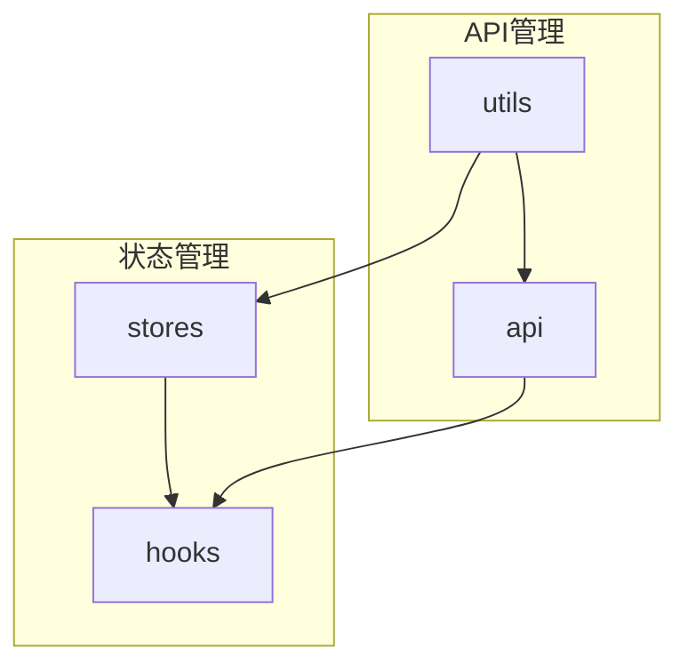

**Diagram sources**
- [authStore.ts](file://web/src/stores/authStore.ts)
- [useAuth.ts](file://web/src/hooks/useAuth.ts)
- [interceptors.ts](file://web/src/api/interceptors.ts)
- [storage.ts](file://web/src/utils/storage.ts)

**Section sources**
- [authStore.ts](file://web/src/stores/authStore.ts)
- [useAuth.ts](file://web/src/hooks/useAuth.ts)
- [interceptors.ts](file://web/src/api/interceptors.ts)

## 核心组件
系统的核心状态管理组件包括认证状态存储(authStore)、度量状态存储(metricsStore)以及封装这些状态逻辑的自定义Hook(useAuth, useMetrics, useNodes)。这些组件协同工作，为前端应用提供一致的状态管理体验。

**Section sources**
- [authStore.ts](file://web/src/stores/authStore.ts)
- [metricsStore.ts](file://web/src/stores/metricsStore.ts)
- [useAuth.ts](file://web/src/hooks/useAuth.ts)
- [useMetrics.ts](file://web/src/hooks/useMetrics.ts)
- [useNodes.ts](file://web/src/hooks/useNodes.ts)

## 架构概述
系统采用分层状态管理架构，将客户端状态和服务器端状态分离管理。Zustand负责持久化存储和全局状态管理，React Query处理数据获取、缓存和同步。

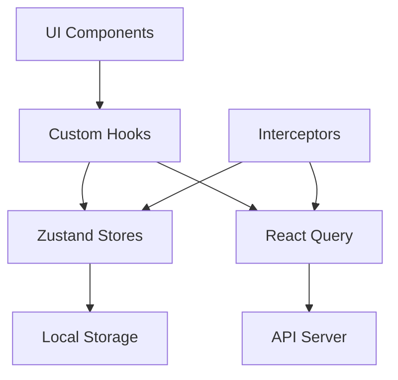

**Diagram sources**
- [authStore.ts](file://web/src/stores/authStore.ts)
- [useAuth.ts](file://web/src/hooks/useAuth.ts)
- [interceptors.ts](file://web/src/api/interceptors.ts)
- [client.ts](file://web/src/api/client.ts)

## 详细组件分析

### 认证状态管理分析
认证状态管理通过Zustand实现，结合persist中间件实现本地持久化，确保用户刷新页面后仍保持登录状态。

#### Zustand Store 实现
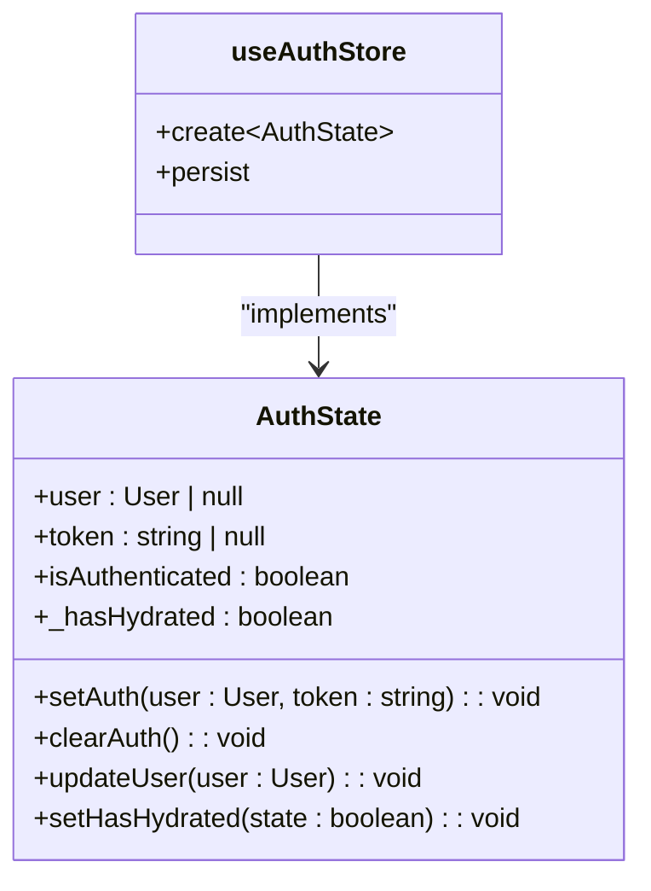

**Diagram sources**
- [authStore.ts](file://web/src/stores/authStore.ts#L10-L84)

#### 认证持久化机制
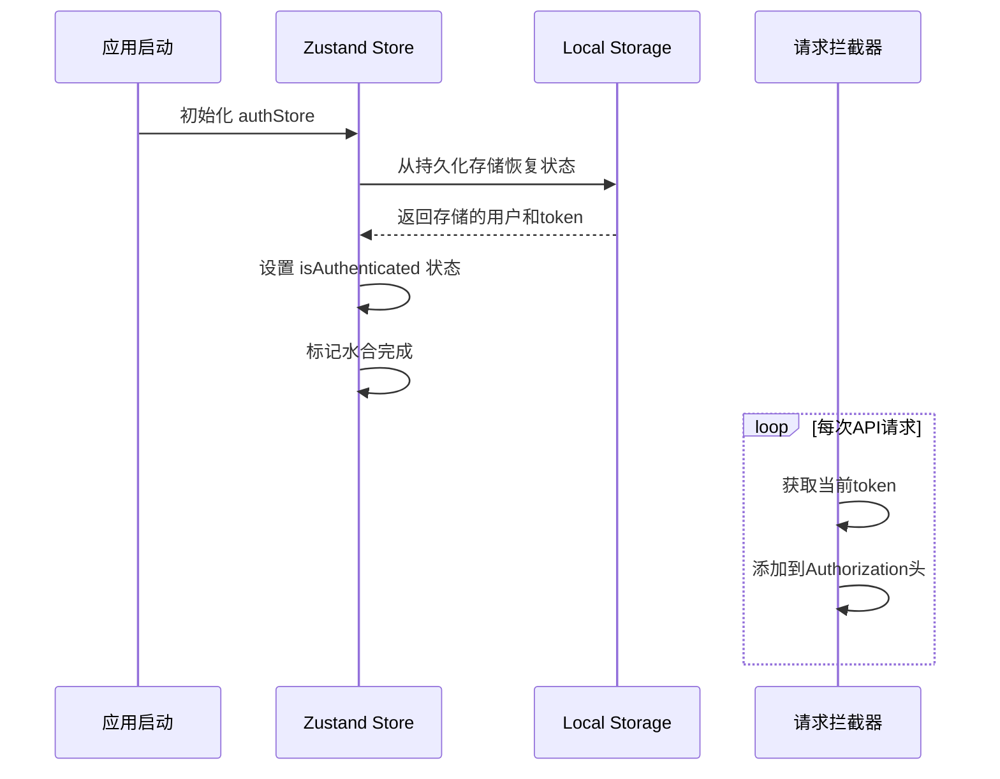

**Diagram sources**
- [authStore.ts](file://web/src/stores/authStore.ts#L23-L84)
- [interceptors.ts](file://web/src/api/interceptors.ts#L14-L27)

**Section sources**
- [authStore.ts](file://web/src/stores/authStore.ts#L5-L84)
- [interceptors.ts](file://web/src/api/interceptors.ts#L14-L27)
- [storage.ts](file://web/src/utils/storage.ts#L8-L47)

### 自定义Hooks分析
自定义Hooks封装了状态逻辑，为组件提供简洁的API接口。

#### useAuth Hook
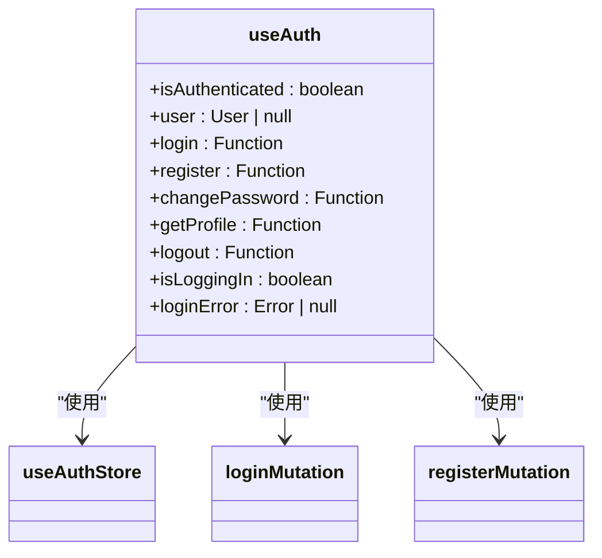

**Diagram sources**
- [useAuth.ts](file://web/src/hooks/useAuth.ts#L13-L72)

#### useMetrics Hook
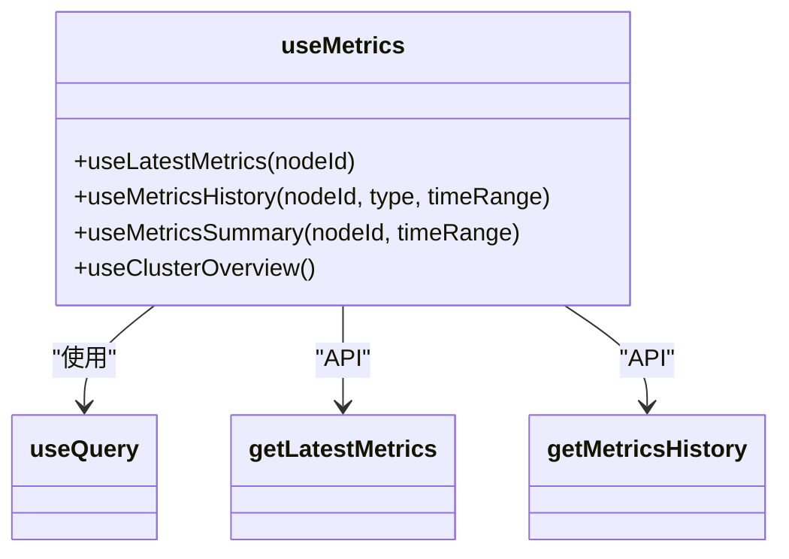

**Diagram sources**
- [useMetrics.ts](file://web/src/hooks/useMetrics.ts#L15-L103)

#### useNodes Hook
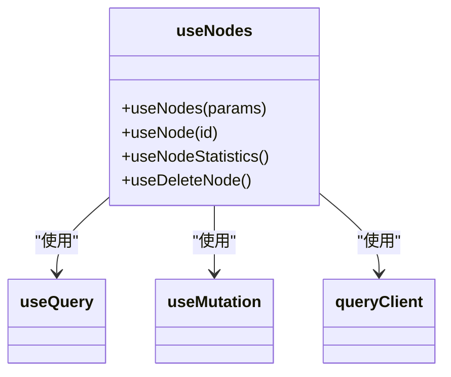

**Diagram sources**
- [useNodes.ts](file://web/src/hooks/useNodes.ts#L11-L57)

**Section sources**
- [useAuth.ts](file://web/src/hooks/useAuth.ts#L13-L72)
- [useMetrics.ts](file://web/src/hooks/useMetrics.ts#L15-L103)
- [useNodes.ts](file://web/src/hooks/useNodes.ts#L11-L57)

### React Query 服务端状态管理
React Query在系统中扮演着服务端状态管理的核心角色，提供数据获取、缓存、自动刷新和错误重试机制。

#### 数据获取流程
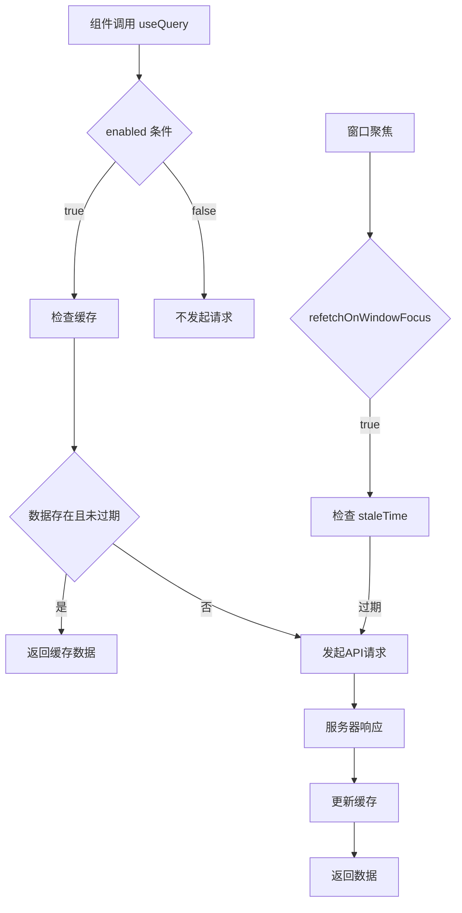

**Diagram sources**
- [useMetrics.ts](file://web/src/hooks/useMetrics.ts#L16-L27)
- [useNodes.ts](file://web/src/hooks/useNodes.ts#L16-L19)

#### 错误处理与重试机制
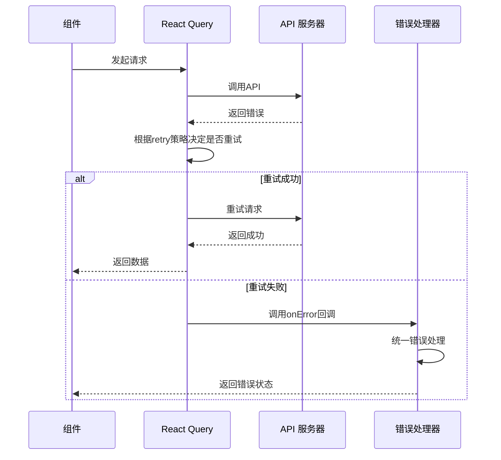

**Diagram sources**
- [useMetrics.ts](file://web/src/hooks/useMetrics.ts#L22-L26)
- [useNodes.ts](file://web/src/hooks/useNodes.ts#L16-L19)
- [App.tsx](file://web/src/App.tsx#L17-L24)

**Section sources**
- [useMetrics.ts](file://web/src/hooks/useMetrics.ts#L16-L103)
- [useNodes.ts](file://web/src/hooks/useNodes.ts#L16-L57)
- [App.tsx](file://web/src/App.tsx#L17-L24)

## 依赖分析
系统各组件之间存在明确的依赖关系，形成了清晰的依赖链。

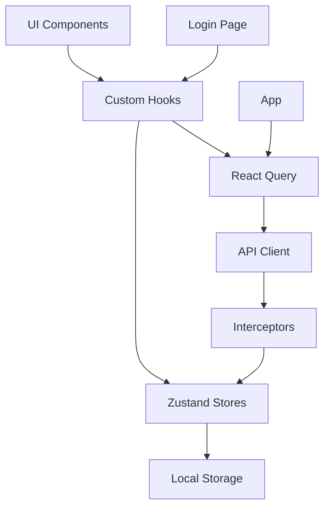

**Diagram sources**
- [App.tsx](file://web/src/App.tsx#L5-L56)
- [Login/index.tsx](file://web/src/pages/Login/index.tsx#L1-L110)
- [useAuth.ts](file://web/src/hooks/useAuth.ts#L13-L72)

**Section sources**
- [App.tsx](file://web/src/App.tsx#L5-L56)
- [Login/index.tsx](file://web/src/pages/Login/index.tsx#L1-L110)
- [useAuth.ts](file://web/src/hooks/useAuth.ts#L13-L72)

## 性能考虑
系统在状态管理方面进行了多项性能优化，避免不必要的组件重渲染。

### 状态订阅优化
通过选择性订阅状态和使用React.memo，系统有效减少了不必要的组件重渲染。

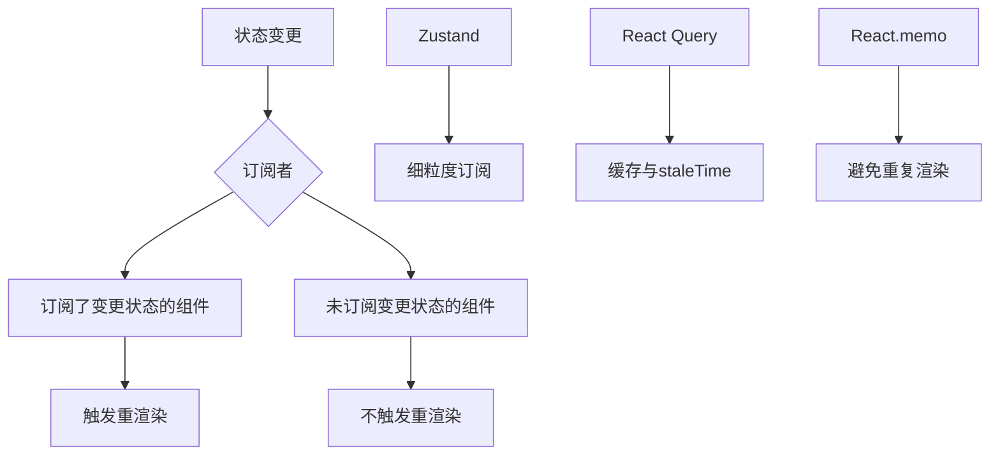

**Diagram sources**
- [useAuth.ts](file://web/src/hooks/useAuth.ts#L14-L15)
- [useMetrics.ts](file://web/src/hooks/useMetrics.ts#L87-L88)
- [App.tsx](file://web/src/App.tsx#L17-L24)

## 故障排除指南
当状态管理出现问题时，可以参考以下常见问题的解决方案。

### 认证状态问题
```mermaid
flowchart TD
A[用户无法保持登录] --> B{检查localStorage}
B --> C[存在ops_token和ops_user]
C --> |是| D[检查authStore水合]
C --> |否| E[检查setAuth调用]
D --> F[检查onRehydrateStorage]
E --> G[检查登录API响应]
H[Token未添加到请求头] --> I{检查拦截器}
I --> J[请求拦截器是否执行]
J --> K[useAuthStore.getState().token是否正确]
```

**Section sources**
- [authStore.ts](file://web/src/stores/authStore.ts#L32-L39)
- [interceptors.ts](file://web/src/api/interceptors.ts#L17-L20)
- [useAuth.ts](file://web/src/hooks/useAuth.ts#L21-L22)

### 数据获取问题
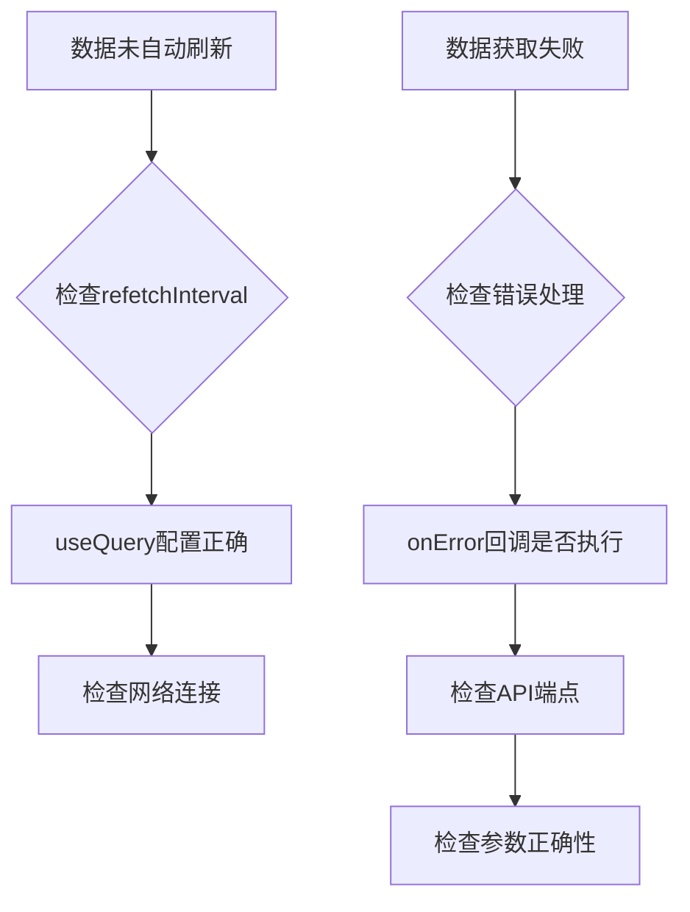

**Section sources**
- [useMetrics.ts](file://web/src/hooks/useMetrics.ts#L20-L26)
- [useNodes.ts](file://web/src/hooks/useNodes.ts#L16-L19)
- [interceptors.ts](file://web/src/api/interceptors.ts#L55-L91)

## 结论
本项目采用Zustand和React Query相结合的状态管理方案，实现了客户端状态和服务器端状态的有效分离。通过Zustand的persist中间件实现了认证状态的本地持久化，确保用户体验的连续性。自定义Hooks封装了复杂的状态逻辑，为组件提供了简洁的API接口。React Query提供了强大的数据获取、缓存、自动刷新和错误重试机制，大大简化了服务器状态的管理。整体架构清晰，性能优化得当，为前端应用提供了可靠的状态管理基础。