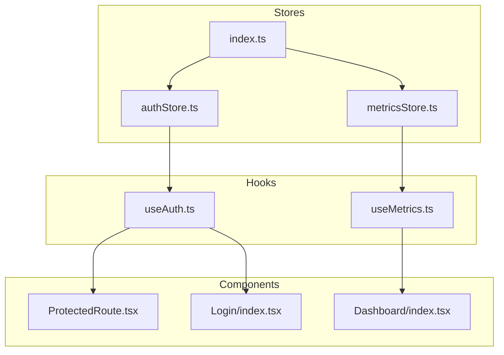
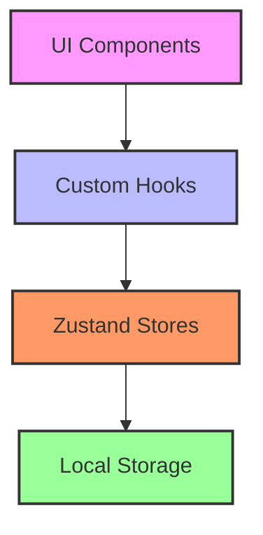
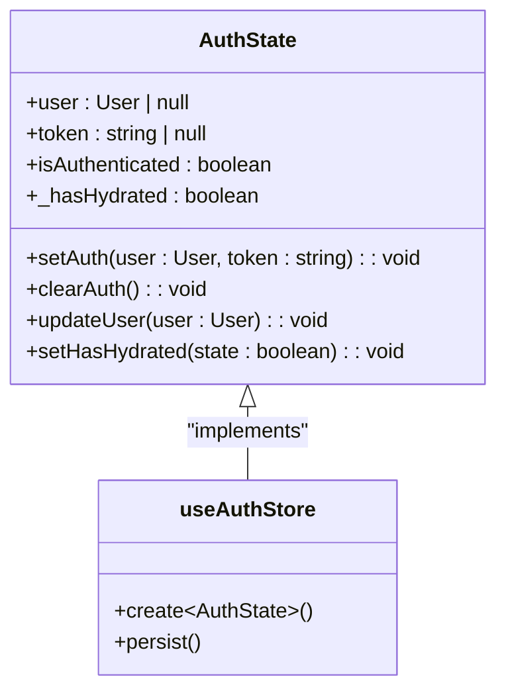
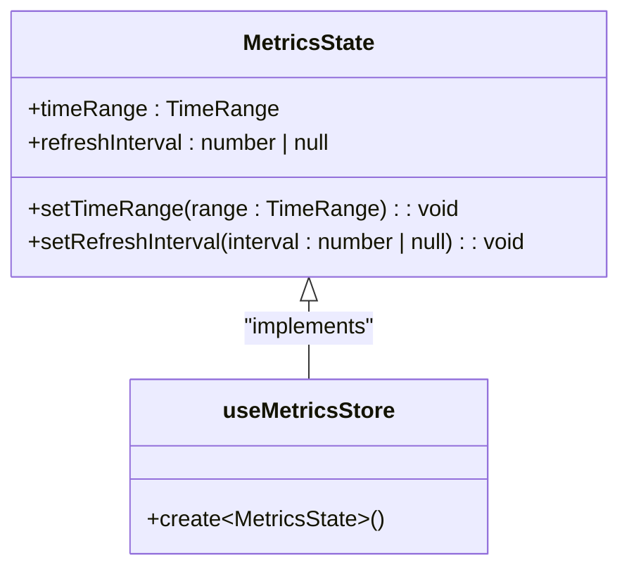
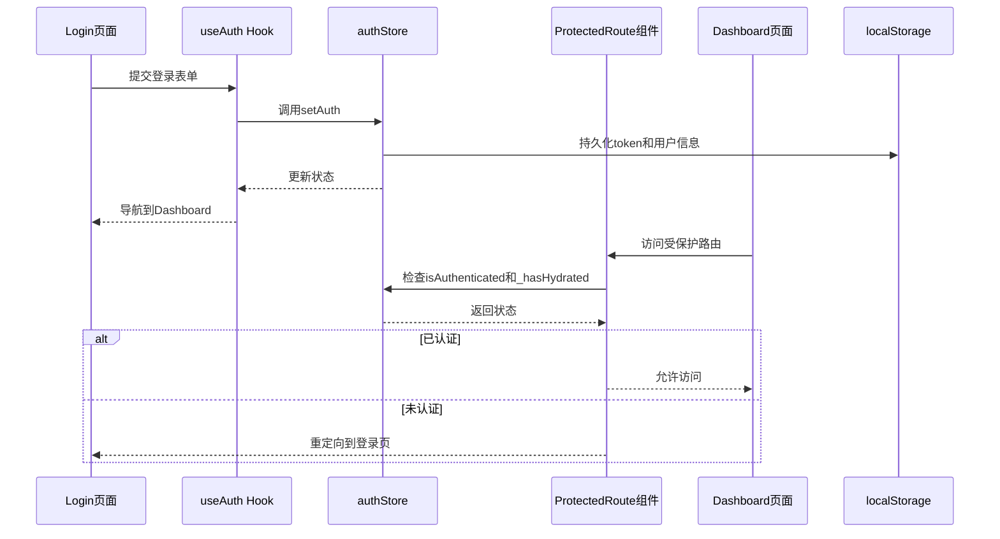
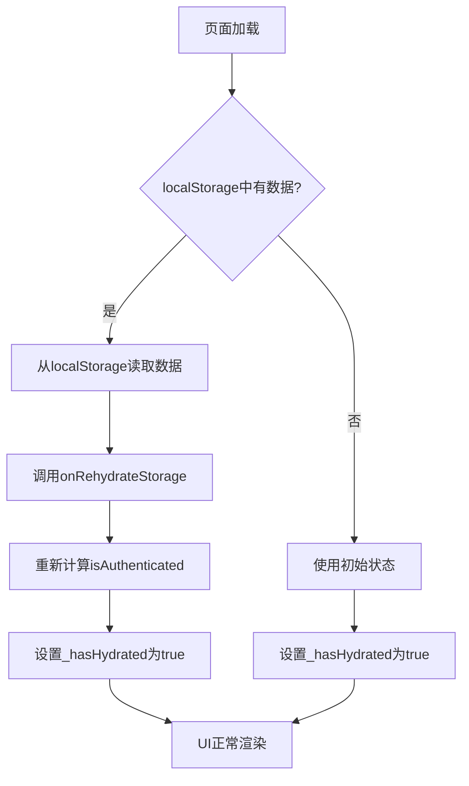

# 客户端状态管理

<cite>
**本文档引用的文件**  
- [authStore.ts](file://web/src/stores/authStore.ts)
- [metricsStore.ts](file://web/src/stores/metricsStore.ts)
- [useAuth.ts](file://web/src/hooks/useAuth.ts)
- [useMetrics.ts](file://web/src/hooks/useMetrics.ts)
- [storage.ts](file://web/src/utils/storage.ts)
- [ProtectedRoute.tsx](file://web/src/router/ProtectedRoute.tsx)
- [Login/index.tsx](file://web/src/pages/Login/index.tsx)
- [Dashboard/index.tsx](file://web/src/pages/Dashboard/index.tsx)
- [TimeRangeSelector.tsx](file://web/src/components/Metrics/TimeRangeSelector.tsx)
- [RefreshControl.tsx](file://web/src/components/Metrics/RefreshControl.tsx)
- [user.ts](file://web/src/types/user.ts)
- [metrics.ts](file://web/src/types/metrics.ts)
</cite>

## 目录
1. [简介](#简介)
2. [项目结构](#项目结构)
3. [核心组件](#核心组件)
4. [架构概述](#架构概述)
5. [详细组件分析](#详细组件分析)
6. [依赖分析](#依赖分析)
7. [性能考虑](#性能考虑)
8. [故障排除指南](#故障排除指南)
9. [结论](#结论)

## 简介
本文档详细介绍了运维工具框架前端应用中的客户端状态管理实现。系统采用Zustand作为核心状态管理库，结合中间件实现本地状态的持久化存储。文档重点分析了认证状态管理（authStore）和监控指标状态管理（metricsStore）两个核心模块的实现机制，包括用户认证流程、页面路由保护、UI状态管理以及状态持久化策略。通过模块化的store设计和类型安全的TypeScript实现，系统实现了高效、可维护的状态管理架构。

## 项目结构
前端状态管理模块位于`web/src/stores`目录下，采用模块化设计，将不同的状态管理逻辑分离到独立的store文件中。核心状态管理文件包括`authStore.ts`和`metricsStore.ts`，分别处理用户认证和监控指标相关的状态。这些store通过`index.ts`统一导出，便于在应用其他部分导入使用。状态管理与React组件通过自定义Hook（位于`hooks`目录）进行交互，实现了状态逻辑与UI组件的解耦。



**图表来源**  
- [authStore.ts](file://web/src/stores/authStore.ts)
- [metricsStore.ts](file://web/src/stores/metricsStore.ts)
- [index.ts](file://web/src/stores/index.ts)

**章节来源**  
- [stores](file://web/src/stores)

## 核心组件
系统实现了两个核心状态管理组件：`authStore`用于管理用户认证状态，`metricsStore`用于管理监控相关的UI状态。`authStore`通过Zustand的`persist`中间件实现了状态的本地持久化，确保用户登录状态在页面刷新后不会丢失。`metricsStore`则管理着时间范围选择、自动刷新间隔等监控相关的UI状态，为Dashboard等页面提供统一的状态管理。两个store都采用了TypeScript进行类型定义，确保了类型安全和代码可维护性。

**章节来源**  
- [authStore.ts](file://web/src/stores/authStore.ts#L1-L84)
- [metricsStore.ts](file://web/src/stores/metricsStore.ts#L1-L37)

## 架构概述
系统采用分层架构设计，将状态管理、业务逻辑和UI组件分离。Zustand store作为状态管理层，负责管理应用的核心状态；自定义Hook作为业务逻辑层，封装了与store交互的复杂逻辑；React组件作为UI层，负责渲染界面并响应用户交互。这种分层设计使得状态管理逻辑集中且可复用，同时保持了UI组件的简洁性。



**图表来源**  
- [authStore.ts](file://web/src/stores/authStore.ts#L5-L84)
- [useAuth.ts](file://web/src/hooks/useAuth.ts#L5-L72)
- [ProtectedRoute.tsx](file://web/src/router/ProtectedRoute.tsx#L5-L37)

## 详细组件分析

### 认证状态管理分析
`authStore`是系统的核心状态管理模块，负责管理用户的认证状态，包括token、用户信息和认证状态。store通过`persist`中间件实现了状态的本地持久化，使用`localStorage`作为持久化存储介质。store定义了`setAuth`、`clearAuth`和`updateUser`等操作方法，用于更新状态。特别地，store引入了`_hasHydrated`状态标记，用于跟踪状态从持久化存储恢复的完成情况，确保在状态恢复完成前显示加载状态，避免了页面闪烁问题。



**图表来源**  
- [authStore.ts](file://web/src/stores/authStore.ts#L10-L84)
- [user.ts](file://web/src/types/user.ts#L5-L52)

### 监控指标状态管理分析
`metricsStore`负责管理监控相关的UI状态，主要包括时间范围选择和自动刷新间隔。store定义了`timeRange`和`refreshInterval`两个状态字段，以及对应的`setTimeRange`和`setRefreshInterval`操作方法。与`authStore`不同，`metricsStore`没有使用持久化中间件，因为这些UI状态更适合在会话期间保持，而不需要跨会话持久化。store的状态被`useMetrics` Hook封装，供Dashboard等组件使用。



**图表来源**  
- [metricsStore.ts](file://web/src/stores/metricsStore.ts#L8-L37)
- [metrics.ts](file://web/src/types/metrics.ts#L54-L57)

### 认证流程分析
系统的认证流程通过`useAuth` Hook和`ProtectedRoute`组件协同实现。`useAuth` Hook封装了登录、注册、修改密码等认证操作，通过`react-query`的`useMutation`管理异步操作的状态。当用户成功登录时，`login`方法调用`authStore`的`setAuth`方法更新状态并持久化到`localStorage`。`ProtectedRoute`组件通过检查`authStore`的`isAuthenticated`和`_hasHydrated`状态，实现路由保护，确保未认证用户无法访问受保护的页面。



**图表来源**  
- [useAuth.ts](file://web/src/hooks/useAuth.ts#L13-L72)
- [authStore.ts](file://web/src/stores/authStore.ts#L23-L84)
- [ProtectedRoute.tsx](file://web/src/router/ProtectedRoute.tsx#L13-L37)

### 状态持久化机制分析
系统使用Zustand的`persist`中间件实现状态的本地持久化。`authStore`配置了`name`选项指定`localStorage`的键名，`partialize`选项指定需要持久化的状态字段，以及`onRehydrateStorage`回调函数处理状态恢复完成后的逻辑。`partialize`函数确保只有`user`、`token`和`isAuthenticated`字段被持久化，而`_hasHydrated`等临时状态不会被存储。`onRehydrateStorage`回调在状态恢复完成后重新计算`isAuthenticated`状态，并设置`_hasHydrated`标记，确保UI能够正确响应状态恢复过程。



**图表来源**  
- [authStore.ts](file://web/src/stores/authStore.ts#L63-L83)
- [storage.ts](file://web/src/utils/storage.ts#L5-L47)

## 依赖分析
状态管理模块依赖于多个外部库和内部模块。核心依赖包括Zustand作为状态管理库，`zustand/middleware`提供持久化功能，`react-query`用于管理异步操作状态。内部依赖包括`types`目录下的类型定义，`utils`目录下的工具函数，以及`api`目录下的API客户端。这些依赖关系通过模块化的import语句清晰地表达，确保了代码的可维护性和可测试性。

```mermaid
graph TD
A[authStore.ts] --> B[zustand]
A --> C[zustand/middleware]
A --> D[../types/user]
A --> E[../utils/storage]
F[useAuth.ts] --> G[@tanstack/react-query]
F --> H[../stores/authStore]
F --> I[../api/auth]
F --> J[../types]
K[ProtectedRoute.tsx] --> L[react-router-dom]
K --> M[@mui/material]
K --> N[../stores/authStore]
style A fill:#f96,stroke:#333
style F fill:#f96,stroke:#333
style K fill:#f96,stroke:#333
```

**图表来源**  
- [authStore.ts](file://web/src/stores/authStore.ts#L5-L8)
- [useAuth.ts](file://web/src/hooks/useAuth.ts#L5-L8)
- [ProtectedRoute.tsx](file://web/src/router/ProtectedRoute.tsx#L5-L7)

## 性能考虑
系统在状态管理方面采用了多种性能优化策略。首先，通过Zustand的细粒度订阅机制，确保只有依赖特定状态的组件才会在状态变化时重新渲染。其次，使用`useMemo`和`useCallback`等React Hook优化组件性能，避免不必要的计算和函数创建。此外，通过`memo`高阶组件对`TimeRangeSelector`和`RefreshControl`等组件进行记忆化，防止不必要的重渲染。最后，合理使用`react-query`的缓存和自动刷新功能，减少不必要的API调用，提高应用响应速度。

## 故障排除指南
在使用状态管理功能时，可能会遇到一些常见问题。如果用户登录后页面刷新仍然需要重新登录，可能是`persist`中间件配置不正确或`localStorage`被清除。如果受保护的页面无法正确重定向到登录页，应检查`ProtectedRoute`组件中的`_hasHydrated`状态逻辑。如果状态更新后UI没有及时响应，可能是组件没有正确订阅状态变化，或者存在不必要的重渲染问题。在开发过程中，可以通过浏览器的开发者工具检查`localStorage`中的状态数据，以及使用React DevTools检查组件的渲染行为，帮助定位和解决问题。

**章节来源**  
- [authStore.ts](file://web/src/stores/authStore.ts#L70-L81)
- [ProtectedRoute.tsx](file://web/src/router/ProtectedRoute.tsx#L17-L30)

## 结论
本系统通过Zustand实现了高效、可维护的客户端状态管理。`authStore`和`metricsStore`两个核心模块分别处理认证状态和UI状态，通过模块化设计和类型安全的实现，确保了代码的可读性和可维护性。持久化机制的引入使得用户登录状态能够在页面刷新后保持，提升了用户体验。通过自定义Hook封装业务逻辑，实现了状态管理与UI组件的解耦，使得组件更加简洁和可复用。整体状态管理架构设计合理，为系统的稳定运行提供了坚实的基础。