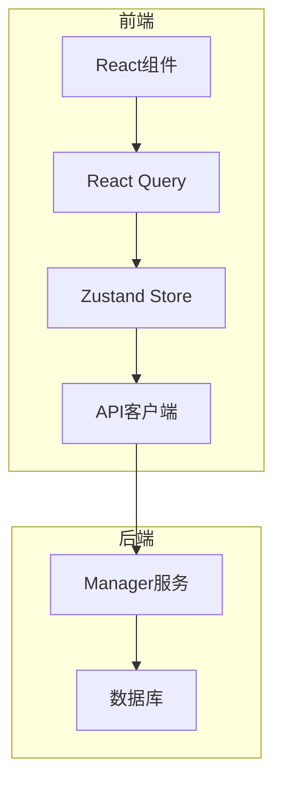
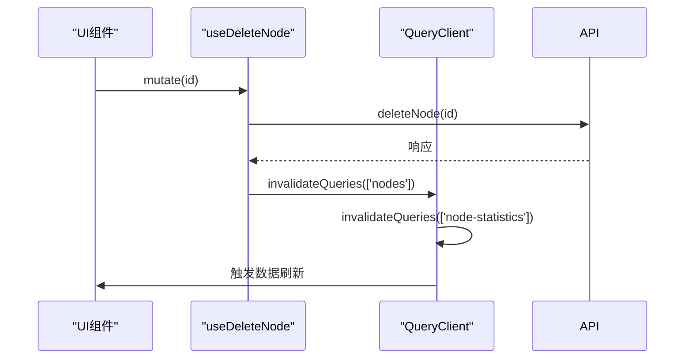
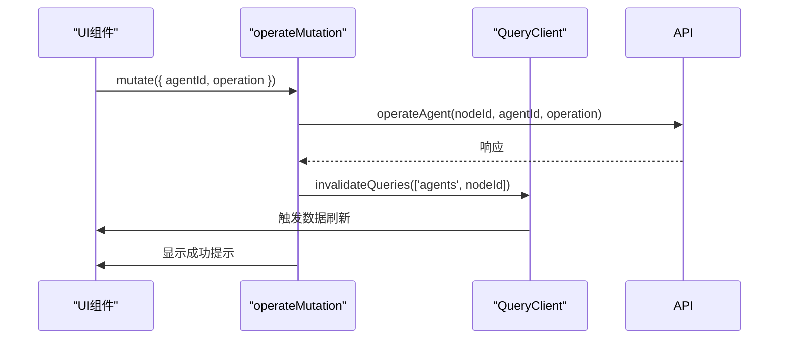
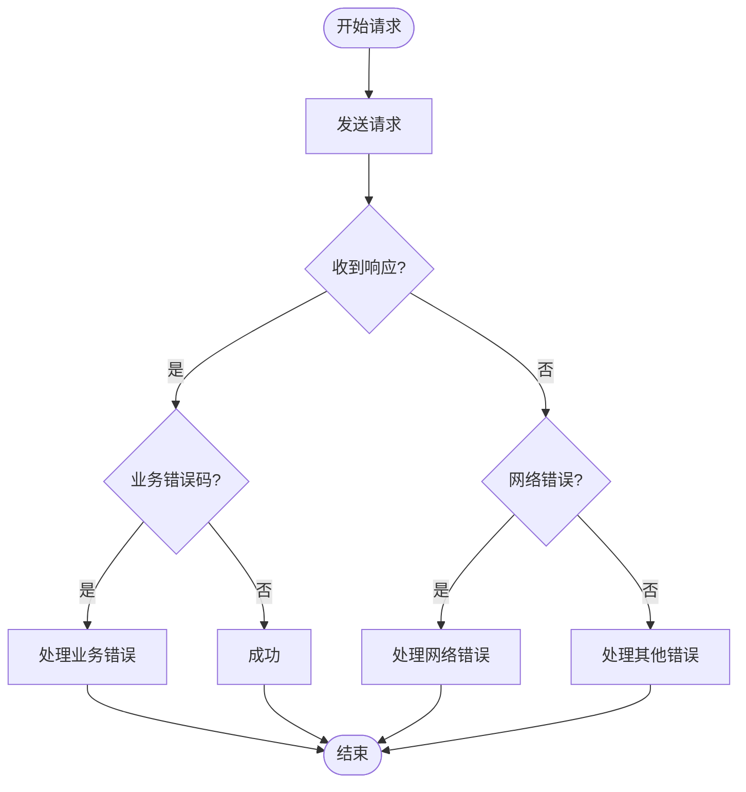
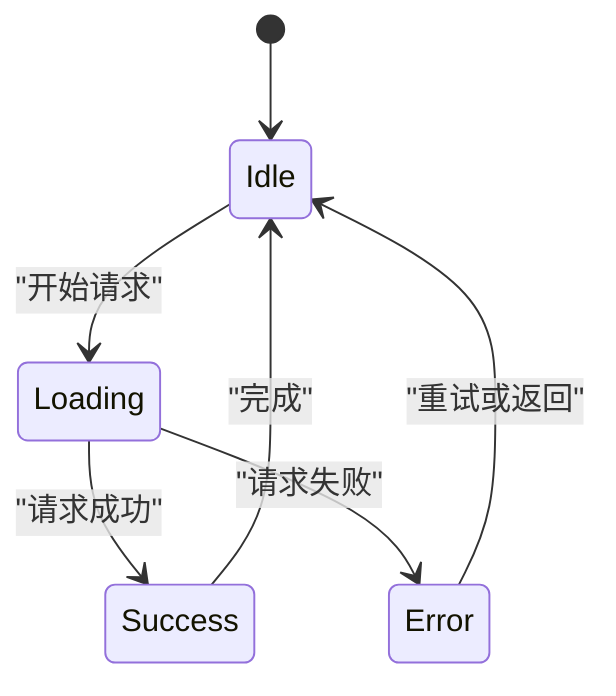

# 服务端状态管理

<cite>
**本文档引用的文件**  
- [useNodes.ts](file://web/src/hooks/useNodes.ts)
- [useMetrics.ts](file://web/src/hooks/useMetrics.ts)
- [useAuth.ts](file://web/src/hooks/useAuth.ts)
- [interceptors.ts](file://web/src/api/interceptors.ts)
- [metricsStore.ts](file://web/src/stores/metricsStore.ts)
- [nodes.ts](file://web/src/api/nodes.ts)
- [metrics.ts](file://web/src/api/metrics.ts)
- [api.ts](file://web/src/types/api.ts)
- [node.ts](file://web/src/types/node.ts)
- [metrics.ts](file://web/src/types/metrics.ts)
- [List.tsx](file://web/src/pages/Nodes/List.tsx)
- [Detail.tsx](file://web/src/pages/Nodes/Detail.tsx)
- [前端开发规范.md](file://web/docs/前端开发规范.md)
- [设计文档_04_Web前端模块.md](file://docs/设计文档_04_Web前端模块.md)
</cite>

## 目录
1. [引言](#引言)
2. [核心组件](#核心组件)
3. [架构概述](#架构概述)
4. [详细组件分析](#详细组件分析)
5. [依赖分析](#依赖分析)
6. [性能考虑](#性能考虑)
7. [故障排除指南](#故障排除指南)
8. [结论](#结论)

## 引言
本项目采用React Query作为服务端状态管理的核心解决方案，通过`useQuery`和`useMutation`等Hook封装数据获取和变更操作。系统实现了自动缓存、数据去重、新鲜度管理等高级功能，并结合Zustand管理客户端状态，形成完整的状态管理方案。

## 核心组件
服务端状态管理主要由React Query的`useQuery`和`useMutation`构成，分别处理数据获取和数据变更操作。`useQuery`用于封装节点、监控指标等数据的获取逻辑，而`useMutation`用于处理创建任务、更新配置等数据变更操作。

**核心组件来源**
- [useNodes.ts](file://web/src/hooks/useNodes.ts#L5-L57)
- [useMetrics.ts](file://web/src/hooks/useMetrics.ts#L5-L103)
- [useAuth.ts](file://web/src/hooks/useAuth.ts#L5-L58)

## 架构概述
系统采用分层架构，前端通过React Query与后端API进行交互。React Query负责服务端状态管理，包括数据获取、缓存、刷新等；Zustand负责客户端状态管理，如用户认证状态、UI状态等。



**图表来源**
- [useNodes.ts](file://web/src/hooks/useNodes.ts#L5-L57)
- [useMetrics.ts](file://web/src/hooks/useMetrics.ts#L5-L103)
- [interceptors.ts](file://web/src/api/interceptors.ts#L5-L94)

## 详细组件分析

### useQuery在数据获取中的应用
`useQuery`用于封装节点和监控指标的数据获取逻辑，实现了自动缓存、数据去重和新鲜度管理。

#### 节点数据获取
`useNodes`和`useNode`函数使用`useQuery`获取节点列表和节点详情数据。查询键（queryKey）的设计遵循`['nodes', params]`和`['node', id]`的规范，确保数据的唯一性和可预测性。

```mermaid
classDiagram
class useNodes {
+useQuery({ queryKey : ['nodes', params], queryFn : getNodes })
+params : { page? : number; page_size? : number; status? : string }
}
class useNode {
+useQuery({ queryKey : ['node', id], queryFn : getNode })
+id : string
+enabled : boolean
}
useNodes --> useQuery : "使用"
useNode --> useQuery : "使用"
```

**图表来源**
- [useNodes.ts](file://web/src/hooks/useNodes.ts#L11-L31)
- [nodes.ts](file://web/src/api/nodes.ts#L11-L28)

#### 监控指标数据获取
`useLatestMetrics`、`useMetricsHistory`等函数使用`useQuery`获取监控指标数据。通过配置`refetchInterval`和`staleTime`参数，实现了自动刷新和缓存管理。

```mermaid
classDiagram
class useLatestMetrics {
+useQuery({ queryKey : ['metrics', 'latest', nodeId], refetchInterval : 30000, staleTime : 25000 })
+nodeId : string
}
class useMetricsHistory {
+useQuery({ queryKey : ['metrics', 'history', nodeId, type, startTime, endTime], staleTime : 300000 })
+nodeId : string
+type : string
+timeRange : TimeRange
}
useLatestMetrics --> useQuery : "使用"
useMetricsHistory --> useQuery : "使用"
```

**图表来源**
- [useMetrics.ts](file://web/src/hooks/useMetrics.ts#L15-L58)
- [metrics.ts](file://web/src/api/metrics.ts#L11-L28)

### useMutation在数据变更中的应用
`useMutation`用于处理数据变更操作，如删除节点、操作Agent等。成功后的缓存更新策略通过`invalidateQueries`实现。

#### 节点删除操作
`useDeleteNode`函数使用`useMutation`处理节点删除操作。在`onSuccess`回调中，通过`queryClient.invalidateQueries`使相关查询失效，触发数据刷新。



**图表来源**
- [useNodes.ts](file://web/src/hooks/useNodes.ts#L46-L57)
- [nodes.ts](file://web/src/api/nodes.ts#L33-L37)

#### Agent操作
在`AgentsTabContent`组件中，`useMutation`用于处理Agent的启动、停止、重启等操作。成功后刷新Agent列表并显示成功提示。



**图表来源**
- [Detail.tsx](file://web/src/pages/Nodes/Detail.tsx#L548-L568)
- [interceptors.ts](file://web/src/api/interceptors.ts#L5-L94)

### 查询键设计规范
查询键（queryKey）的设计遵循层级化、可预测的原则，确保数据的唯一性和可管理性。

| 查询类型 | 查询键格式 | 示例 |
|---------|-----------|------|
| 节点列表 | ['nodes', params] | ['nodes', {page: 1, page_size: 20}] |
| 节点详情 | ['node', id] | ['node', 'node-001'] |
| 最新指标 | ['metrics', 'latest', nodeId] | ['metrics', 'latest', 'node-001'] |
| 历史指标 | ['metrics', 'history', nodeId, type, startTime, endTime] | ['metrics', 'history', 'node-001', 'cpu', 1700000000000, 1700003600000] |

**表格来源**
- [useNodes.ts](file://web/src/hooks/useNodes.ts#L17-L18)
- [useMetrics.ts](file://web/src/hooks/useMetrics.ts#L17-L46)
- [前端开发规范.md](file://web/docs/前端开发规范.md#L481-L512)

### 错误处理与加载状态管理
系统通过React Query的`onError`回调和组件的加载状态，实现了完善的错误处理和加载状态管理。

#### 错误处理机制
错误处理分为业务错误和网络错误两种情况。业务错误通过响应拦截器统一处理，网络错误则提供详细的错误信息。



**图表来源**
- [interceptors.ts](file://web/src/api/interceptors.ts#L37-L90)
- [api.ts](file://web/src/types/api.ts#L28-L54)

#### 加载状态管理
组件通过`isLoading`、`error`等状态，实现了加载指示器和错误提示的显示。



**图表来源**
- [List.tsx](file://web/src/pages/Nodes/List.tsx#L32-L41)
- [Detail.tsx](file://web/src/pages/Nodes/Detail.tsx#L86-L123)

## 依赖分析
系统依赖React Query进行服务端状态管理，Zustand进行客户端状态管理，Axios进行HTTP请求。

```mermaid
dependencyDiagram
ReactQuery["React Query"] --> Axios["Axios"]
Zustand["Zustand"] --> React["React"]
ReactQuery --> React["React"]
Axios --> Backend["后端API"]
ReactQuery --> Zustand : "共享状态"
```

**图表来源**
- [package.json](file://web/package.json)
- [useNodes.ts](file://web/src/hooks/useNodes.ts#L5)
- [metricsStore.ts](file://web/src/stores/metricsStore.ts#L5)

## 性能考虑
系统通过缓存、自动刷新、数据去重等机制优化性能。

- **缓存策略**：通过`staleTime`配置缓存新鲜度
- **自动刷新**：通过`refetchInterval`配置自动刷新间隔
- **数据去重**：React Query自动处理并发请求的数据去重

**性能考虑来源**
- [useMetrics.ts](file://web/src/hooks/useMetrics.ts#L20-L21)
- [useNodes.ts](file://web/src/hooks/useNodes.ts#L49-L55)
- [设计文档_04_Web前端模块.md](file://docs/设计文档_04_Web前端模块.md#L1067-L1068)

## 故障排除指南
常见问题及解决方案：

1. **网络连接失败**：检查Manager服务是否启动，API地址配置是否正确
2. **未授权错误**：检查Token是否过期，重新登录
3. **数据不刷新**：检查`refetchInterval`配置，手动调用`refetch`
4. **缓存数据过期**：调整`staleTime`配置

**故障排除指南来源**
- [interceptors.ts](file://web/src/api/interceptors.ts#L83-L86)
- [api.ts](file://web/src/types/api.ts#L35-L37)
- [useMetrics.ts](file://web/src/hooks/useMetrics.ts#L92-L93)

## 结论
本项目通过React Query实现了高效的服务端状态管理，结合Zustand管理客户端状态，形成了完整的状态管理方案。系统具有良好的性能、可维护性和用户体验。