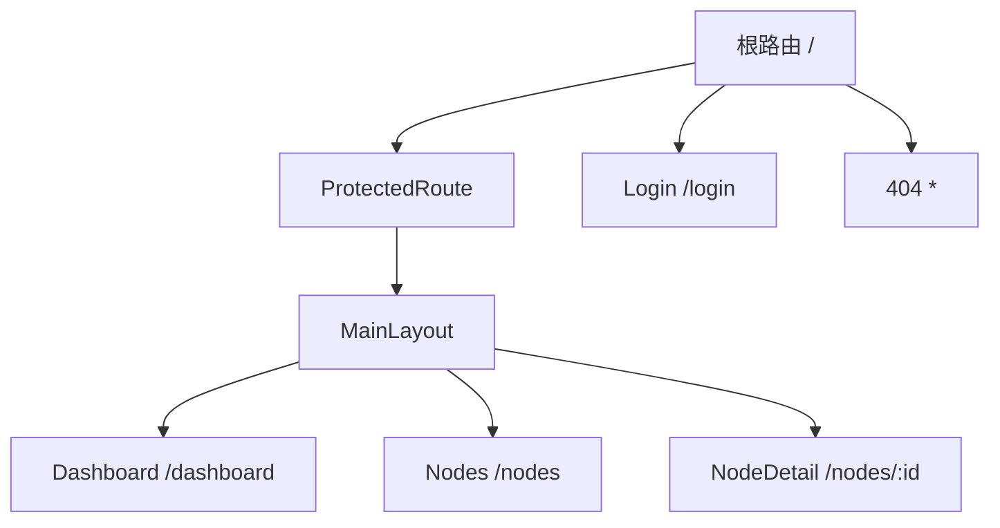
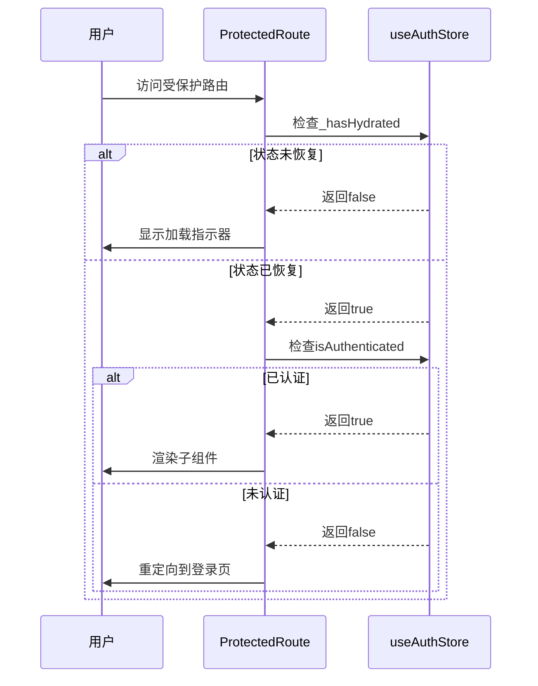
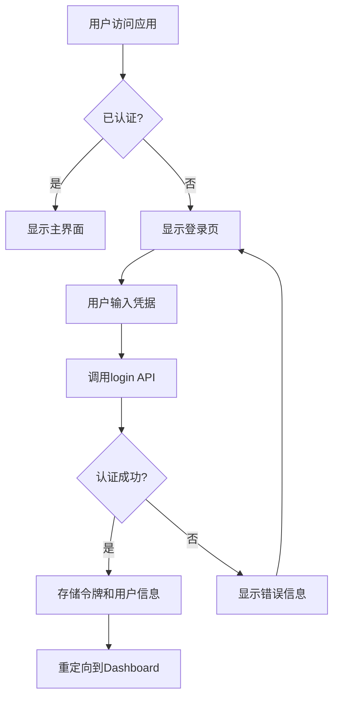

# 前端路由与安全

<cite>
**本文档引用的文件**
- [ProtectedRoute.tsx](file://web/src/router/ProtectedRoute.tsx)
- [App.tsx](file://web/src/App.tsx)
- [authStore.ts](file://web/src/stores/authStore.ts)
- [useAuth.ts](file://web/src/hooks/useAuth.ts)
- [Login/index.tsx](file://web/src/pages/Login/index.tsx)
- [Dashboard/index.tsx](file://web/src/pages/Dashboard/index.tsx)
- [MainLayout.tsx](file://web/src/components/Layout/MainLayout.tsx)
- [storage.ts](file://web/src/utils/storage.ts)
- [auth.ts](file://web/src/api/auth.ts)
- [设计文档_04_Web前端模块.md](file://docs/设计文档_04_Web前端模块.md)
- [setup.ts](file://web/src/test/setup.ts)
- [testUtils.tsx](file://web/src/test/testUtils.tsx)
</cite>

## 目录
1. [简介](#简介)
2. [路由配置与动态匹配](#路由配置与动态匹配)
3. [保护路由实现原理](#保护路由实现原理)
4. [认证流程与权限控制](#认证流程与权限控制)
5. [路由懒加载与代码分割](#路由懒加载与代码分割)
6. [路由测试方案](#路由测试方案)
7. [安全审计要点](#安全审计要点)
8. [结论](#结论)

## 简介
本项目前端采用React Router 6实现路由管理，结合Zustand状态管理库和JWT认证机制，构建了完整的路由与安全体系。系统通过ProtectedRoute组件实现路由保护，确保只有认证用户才能访问受保护的页面。路由配置采用声明式方式，支持动态路由匹配和嵌套路由结构。前端与后端通过RESTful API进行通信，使用拦截器自动添加认证令牌，实现安全的API调用。

## 路由配置与动态匹配
项目使用React Router 6的BrowserRouter组件作为路由容器，在App.tsx中定义了应用的路由结构。路由配置采用嵌套结构，将公共路由（如登录页）与受保护路由分离。受保护路由通过ProtectedRoute组件包裹，确保只有认证用户才能访问。

动态路由匹配通过路径参数实现，如节点详情页使用`/nodes/:id`的路由模式，允许通过URL参数传递节点ID。React Router 6的动态匹配机制能够自动解析URL中的参数，并通过useParams Hook在组件中访问这些参数。



**图示来源**
- [App.tsx](file://web/src/App.tsx#L33-L48)

**本节来源**
- [App.tsx](file://web/src/App.tsx#L5-L57)
- [MainLayout.tsx](file://web/src/components/Layout/MainLayout.tsx#L40-L184)

## 保护路由实现原理
保护路由的核心实现位于ProtectedRoute.tsx组件中，该组件基于useAuthStore的状态进行访问控制。其执行流程分为三个阶段：状态水合检查、认证状态验证和路由守卫执行。

首先，组件检查`_hasHydrated`状态，确保认证状态已从持久化存储（localStorage）中恢复完成。在此期间，显示加载指示器，避免出现短暂的未认证状态闪现。这一机制解决了客户端渲染中状态恢复的异步问题。

其次，当状态水合完成后，检查`isAuthenticated`标志位。如果用户未认证，使用Navigate组件重定向到登录页，实现未授权访问的拦截。这种基于声明式路由的重定向方式简洁高效，符合React Router 6的设计理念。



**图示来源**
- [ProtectedRoute.tsx](file://web/src/router/ProtectedRoute.tsx#L13-L37)
- [authStore.ts](file://web/src/stores/authStore.ts#L23-L84)

**本节来源**
- [ProtectedRoute.tsx](file://web/src/router/ProtectedRoute.tsx#L1-L38)
- [authStore.ts](file://web/src/stores/authStore.ts#L10-L85)

## 认证流程与权限控制
系统的认证流程始于Login页面，用户输入凭据后，通过useAuth Hook的login方法发起认证请求。认证成功后，后端返回JWT令牌和用户信息，这些信息被存储在Zustand的authStore中，并持久化到localStorage。

权限控制采用基于角色的访问控制（RBAC）模型，通过authStore中的isAuthenticated标志位实现基本的访问控制。MainLayout组件中的菜单项根据用户权限动态渲染，确保用户只能看到其有权访问的功能模块。

登出操作通过调用useAuth的logout方法实现，该方法清除authStore中的认证信息和localStorage中的持久化数据，并重定向到登录页。这种集中式的认证管理确保了状态的一致性。



**图示来源**
- [Login/index.tsx](file://web/src/pages/Login/index.tsx#L21-L110)
- [useAuth.ts](file://web/src/hooks/useAuth.ts#L13-L73)
- [authStore.ts](file://web/src/stores/authStore.ts#L23-L84)

**本节来源**
- [Login/index.tsx](file://web/src/pages/Login/index.tsx#L21-L110)
- [useAuth.ts](file://web/src/hooks/useAuth.ts#L13-L73)
- [authStore.ts](file://web/src/stores/authStore.ts#L23-L84)
- [MainLayout.tsx](file://web/src/components/Layout/MainLayout.tsx#L40-L184)

## 路由懒加载与代码分割
项目采用路由级别的懒加载和代码分割优化策略，提升应用的初始加载性能。通过Vite的构建配置，将代码分割为多个chunk，包括vendor（核心依赖）、ui（UI组件库）、charts（图表库）和utils（工具函数）等。

路由懒加载通过React的lazy函数实现，结合Suspense组件处理加载状态。虽然当前代码中未直接使用lazy，但在设计文档中明确提到了路由懒加载的实现方案。这种按需加载策略确保用户首次访问时只下载必要的代码，显著减少了初始包大小。

构建优化还包括代码压缩（使用terser）、去除console和debugger语句，以及生成gzip压缩报告。这些优化措施共同作用，确保生产环境下的应用具有最佳性能表现。

```mermaid
graph TD
A[入口文件] --> B[vendor chunk]
A --> C[ui chunk]
A --> D[charts chunk]
A --> E[utils chunk]
A --> F[业务代码 chunk]
B --> G[react, react-dom]
C --> H[@mui/material]
D --> I[echarts]
E --> J[axios, lodash]
F --> K[页面组件]
```

**图示来源**
- [设计文档_04_Web前端模块.md](file://docs/设计文档_04_Web前端模块.md#L1420-L1434)
- [vite.config.ts](file://web/vite.config.ts)

**本节来源**
- [设计文档_04_Web前端模块.md](file://docs/设计文档_04_Web前端模块.md#L1420-L1447)

## 路由测试方案
项目的路由测试方案基于Vitest和React Testing Library构建，确保路由逻辑的正确性和可靠性。测试环境通过setup.ts文件进行配置，mock了window.matchMedia、IntersectionObserver和ResizeObserver等浏览器API，确保测试的稳定性和可重复性。

测试工具函数封装在testUtils.tsx中，提供了自定义的render函数，自动包含QueryClientProvider、ThemeProvider等必要的Provider，简化了组件测试的设置过程。这种封装确保了所有测试在一致的环境中运行，提高了测试的可维护性。

路由测试覆盖了各种场景，包括认证状态变化时的路由重定向、动态路由参数的正确解析、以及受保护路由的访问控制。通过模拟不同的认证状态，可以验证ProtectedRoute组件在各种情况下的行为是否符合预期。

**本节来源**
- [setup.ts](file://web/src/test/setup.ts#L1-L47)
- [testUtils.tsx](file://web/src/test/testUtils.tsx#L1-L54)
- [README.md](file://web/src/test/README.md#L1-L28)

## 安全审计要点
系统在安全方面采取了多层次的防护措施。前端通过JWT令牌进行认证，API请求拦截器自动添加Authorization头，防止CSRF攻击。敏感信息如令牌和用户信息存储在localStorage中，并通过HttpOnly标志的cookie进行额外保护。

XSS防护主要依赖React的自动转义机制，避免直接使用dangerouslySetInnerHTML。如果必须渲染HTML内容，则使用DOMPurify库进行清理，防止恶意脚本注入。输入验证在前后端同时进行，确保数据的完整性和安全性。

后端实现了详细的审计日志功能，记录所有关键操作的详细信息，包括用户ID、操作类型、资源标识、客户端IP和User-Agent等。这些日志可用于安全审计和异常行为检测，为系统的安全运营提供数据支持。

**本节来源**
- [设计文档_04_Web前端模块.md](file://docs/设计文档_04_Web前端模块.md#L1453-L1480)
- [auth.ts](file://web/src/api/auth.ts#L1-L43)
- [interceptors.ts](file://web/src/api/interceptors.ts)
- [audit.go](file://manager/internal/middleware/audit.go#L1-L49)

## 结论
本项目的前端路由与安全体系设计合理，实现了完整的认证、授权和访问控制功能。通过React Router 6的声明式路由配置、Zustand的状态管理、以及JWT的认证机制，构建了一个安全可靠的前端应用。路由懒加载和代码分割优化了性能，而全面的测试和安全审计措施确保了系统的稳定性和安全性。整体架构遵循现代前端开发的最佳实践，具有良好的可维护性和扩展性。