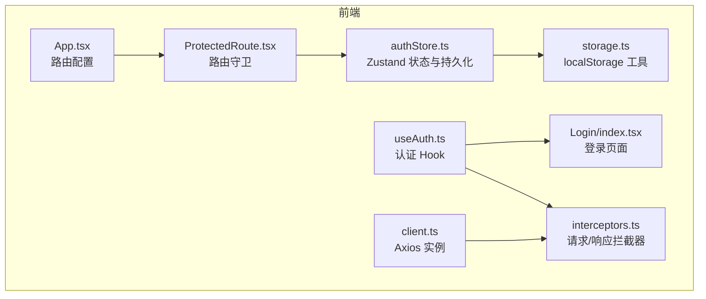
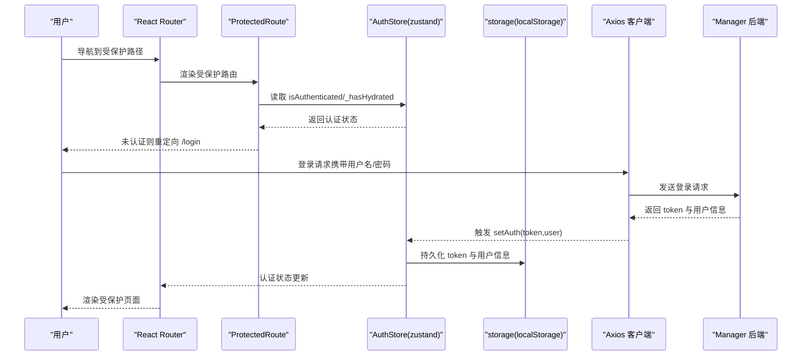
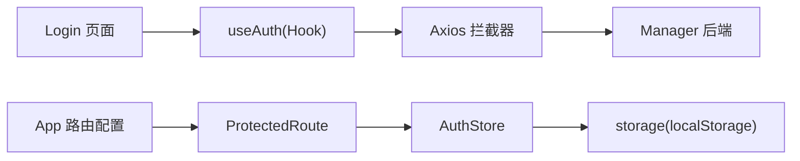

# 安全防护实践

<cite>
**本文引用的文件**
- [web/src/router/ProtectedRoute.tsx](file://web/src/router/ProtectedRoute.tsx)
- [web/src/App.tsx](file://web/src/App.tsx)
- [web/src/stores/authStore.ts](file://web/src/stores/authStore.ts)
- [web/src/utils/storage.ts](file://web/src/utils/storage.ts)
- [web/src/api/client.ts](file://web/src/api/client.ts)
- [web/src/api/interceptors.ts](file://web/src/api/interceptors.ts)
- [web/src/api/auth.ts](file://web/src/api/auth.ts)
- [web/src/pages/Login/index.tsx](file://web/src/pages/Login/index.tsx)
- [web/src/hooks/useAuth.ts](file://web/src/hooks/useAuth.ts)
- [web/vite.config.ts](file://web/vite.config.ts)
- [web/.env.development](file://web/.env.development)
- [web/.env.production](file://web/.env.production)
- [docs/设计文档_04_Web前端模块.md](file://docs/设计文档_04_Web前端模块.md)
- [docs/前端开发规范.md](file://docs/前端开发规范.md)
- [docs/运维工具框架需求文档.md](file://docs/运维工具框架需求文档.md)
</cite>

## 目录
1. [引言](#引言)
2. [项目结构](#项目结构)
3. [核心组件](#核心组件)
4. [架构总览](#架构总览)
5. [详细组件分析](#详细组件分析)
6. [依赖关系分析](#依赖关系分析)
7. [性能与安全特性](#性能与安全特性)
8. [故障排查指南](#故障排查指南)
9. [结论](#结论)
10. [附录](#附录)

## 引言
本文件系统性梳理前端安全防护措施，聚焦路由层安全风险与后端校验的必要性，总结敏感信息（如 token）在客户端存储的最佳实践，分析 localStorage 的安全边界与潜在风险，给出 XSS 防范策略与动态渲染场景下的输入验证与转义处理建议，并结合项目现有实现说明 HTTP 安全头（如 Content-Security-Policy）的配置建议、安全编码实践以避免开放重定向漏洞，最后提供前端安全审计清单与常用检测工具的使用指南。

## 项目结构
前端采用 React + Vite + Zustand + Axios + React Router 的技术栈，围绕认证与路由保护形成清晰的分层：
- 路由层：通过受保护路由组件实现访问控制
- 状态层：使用 Zustand + persist 实现认证状态与 token 的持久化
- 网络层：Axios 客户端与拦截器统一注入 Authorization 头并处理鉴权错误
- 页面层：登录页、仪表盘等页面按路由规则受控访问

图表来源
- [web/src/App.tsx](file://web/src/App.tsx#L1-L57)
- [web/src/router/ProtectedRoute.tsx](file://web/src/router/ProtectedRoute.tsx#L1-L38)
- [web/src/stores/authStore.ts](file://web/src/stores/authStore.ts#L1-L85)
- [web/src/utils/storage.ts](file://web/src/utils/storage.ts#L1-L48)
- [web/src/api/client.ts](file://web/src/api/client.ts#L1-L18)
- [web/src/api/interceptors.ts](file://web/src/api/interceptors.ts#L1-L95)
- [web/src/pages/Login/index.tsx](file://web/src/pages/Login/index.tsx#L1-L110)
- [web/src/hooks/useAuth.ts](file://web/src/hooks/useAuth.ts#L1-L73)

章节来源
- [web/src/App.tsx](file://web/src/App.tsx#L1-L57)
- [web/src/router/ProtectedRoute.tsx](file://web/src/router/ProtectedRoute.tsx#L1-L38)
- [web/src/stores/authStore.ts](file://web/src/stores/authStore.ts#L1-L85)
- [web/src/utils/storage.ts](file://web/src/utils/storage.ts#L1-L48)
- [web/src/api/client.ts](file://web/src/api/client.ts#L1-L18)
- [web/src/api/interceptors.ts](file://web/src/api/interceptors.ts#L1-L95)
- [web/src/pages/Login/index.tsx](file://web/src/pages/Login/index.tsx#L1-L110)
- [web/src/hooks/useAuth.ts](file://web/src/hooks/useAuth.ts#L1-L73)

## 核心组件
- 受保护路由组件：在水合完成且未认证时重定向至登录页，保障路由层访问控制
- 认证状态管理：Zustand + persist，持久化 token 与用户信息，自动恢复认证状态
- 本地存储工具：封装 token 与用户信息的读写，提供 clear 清理能力
- Axios 客户端与拦截器：统一添加 Authorization 头，集中处理 401/令牌错误并触发登出
- 登录页面与认证 Hook：表单校验、调用登录接口、成功后设置认证状态并跳转

章节来源
- [web/src/router/ProtectedRoute.tsx](file://web/src/router/ProtectedRoute.tsx#L1-L38)
- [web/src/stores/authStore.ts](file://web/src/stores/authStore.ts#L1-L85)
- [web/src/utils/storage.ts](file://web/src/utils/storage.ts#L1-L48)
- [web/src/api/interceptors.ts](file://web/src/api/interceptors.ts#L1-L95)
- [web/src/pages/Login/index.tsx](file://web/src/pages/Login/index.tsx#L1-L110)
- [web/src/hooks/useAuth.ts](file://web/src/hooks/useAuth.ts#L1-L73)

## 架构总览
下图展示从前端路由到网络层的调用链路，突出认证状态、拦截器与后端校验的关系。

图表来源
- [web/src/App.tsx](file://web/src/App.tsx#L1-L57)
- [web/src/router/ProtectedRoute.tsx](file://web/src/router/ProtectedRoute.tsx#L1-L38)
- [web/src/stores/authStore.ts](file://web/src/stores/authStore.ts#L1-L85)
- [web/src/utils/storage.ts](file://web/src/utils/storage.ts#L1-L48)
- [web/src/api/interceptors.ts](file://web/src/api/interceptors.ts#L1-L95)
- [web/src/api/auth.ts](file://web/src/api/auth.ts#L1-L43)

## 详细组件分析

### 路由守卫与访问控制
- 受保护路由组件在水合完成前显示加载态，避免初次渲染时因状态未恢复导致误判
- 未认证时重定向至登录页，确保只有持有有效 token 的用户可访问受保护页面
- 文档中还提供了“访客守卫”用于登录页等公开路由，防止已登录用户重复访问

章节来源
- [web/src/router/ProtectedRoute.tsx](file://web/src/router/ProtectedRoute.tsx#L1-L38)
- [docs/前端开发规范.md](file://docs/前端开发规范.md#L593-L678)
- [docs/设计文档_04_Web前端模块.md](file://docs/设计文档_04_Web前端模块.md#L411-L432)

### 认证状态管理与持久化
- 使用 Zustand + persist 将 token 与用户信息持久化到 localStorage
- 水合阶段根据存储数据重新计算 isAuthenticated，并标记水合完成
- 提供 clear 方法在登出或异常时清理本地存储

章节来源
- [web/src/stores/authStore.ts](file://web/src/stores/authStore.ts#L1-L85)
- [web/src/utils/storage.ts](file://web/src/utils/storage.ts#L1-L48)

### 网络层拦截与后端校验
- 请求拦截器从状态中读取 token 并注入 Authorization 头
- 响应拦截器集中处理业务错误码与 HTTP 状态码，遇到 401 或令牌相关错误时清空认证状态并跳转登录
- 登录成功后通过 Hook 设置认证状态，随后导航到受保护页面

章节来源
- [web/src/api/client.ts](file://web/src/api/client.ts#L1-L18)
- [web/src/api/interceptors.ts](file://web/src/api/interceptors.ts#L1-L95)
- [web/src/hooks/useAuth.ts](file://web/src/hooks/useAuth.ts#L1-L73)
- [web/src/api/auth.ts](file://web/src/api/auth.ts#L1-L43)

### 登录流程与表单校验
- 登录页面使用表单库进行字段校验，提交成功后调用认证 Hook 设置状态并跳转
- 登录错误通过 Hook 暴露给 UI 层提示

章节来源
- [web/src/pages/Login/index.tsx](file://web/src/pages/Login/index.tsx#L1-L110)
- [web/src/hooks/useAuth.ts](file://web/src/hooks/useAuth.ts#L1-L73)

### XSS 防护与动态渲染
- React 默认对 JSX 插值进行自动转义，避免直接插入 HTML 导致的 XSS
- 文档建议避免使用危险的 HTML 注入方式；如确需使用，应先进行净化处理
- 对于动态渲染的路由内容，建议在进入页面前进行输入验证与输出转义

章节来源
- [docs/设计文档_04_Web前端模块.md](file://docs/设计文档_04_Web前端模块.md#L1451-L1481)

### 敏感信息存储与风险
- 项目当前将 token 与用户信息存储在 localStorage，便于跨会话复用
- localStorage 不具备 HttpOnly 语义，存在被脚本读取的风险；建议优先考虑 HttpOnly Cookie（需后端配合）
- 文档中提供了敏感数据保护示例，强调不在日志中打印敏感字段

章节来源
- [web/src/utils/storage.ts](file://web/src/utils/storage.ts#L1-L48)
- [docs/设计文档_04_Web前端模块.md](file://docs/设计文档_04_Web前端模块.md#L1482-L1503)

### HTTP 安全头与 CSP 配置建议
- 项目未在前端代码中直接设置 CSP 等安全头；建议在反向代理或服务端返回头中配置
- 建议启用并合理配置 Content-Security-Policy，限制脚本来源、内联脚本与外链资源
- 启用 X-Content-Type-Options: nosniff、X-Frame-Options: DENY、Referrer-Policy 等常见安全头

章节来源
- [docs/设计文档_04_Web前端模块.md](file://docs/设计文档_04_Web前端模块.md#L1451-L1481)

### 开放重定向与安全跳转
- 在前端进行路由跳转时，避免直接使用用户可控的 URL 参数作为跳转目标
- 建议对跳转目标进行白名单校验或使用相对路径跳转，防止被利用进行开放重定向

章节来源
- [docs/前端开发规范.md](file://docs/前端开发规范.md#L593-L678)

## 依赖关系分析
- 路由层依赖认证状态管理；认证状态来源于本地存储
- 网络层依赖认证状态与拦截器；拦截器依赖后端返回的业务错误码与 HTTP 状态码
- 登录页面与认证 Hook 形成闭环：登录成功后设置状态并触发路由跳转

图表来源
- [web/src/router/ProtectedRoute.tsx](file://web/src/router/ProtectedRoute.tsx#L1-L38)
- [web/src/stores/authStore.ts](file://web/src/stores/authStore.ts#L1-L85)
- [web/src/utils/storage.ts](file://web/src/utils/storage.ts#L1-L48)
- [web/src/api/interceptors.ts](file://web/src/api/interceptors.ts#L1-L95)
- [web/src/pages/Login/index.tsx](file://web/src/pages/Login/index.tsx#L1-L110)
- [web/src/hooks/useAuth.ts](file://web/src/hooks/useAuth.ts#L1-L73)
- [web/src/App.tsx](file://web/src/App.tsx#L1-L57)

章节来源
- [web/src/App.tsx](file://web/src/App.tsx#L1-L57)
- [web/src/router/ProtectedRoute.tsx](file://web/src/router/ProtectedRoute.tsx#L1-L38)
- [web/src/stores/authStore.ts](file://web/src/stores/authStore.ts#L1-L85)
- [web/src/utils/storage.ts](file://web/src/utils/storage.ts#L1-L48)
- [web/src/api/interceptors.ts](file://web/src/api/interceptors.ts#L1-L95)
- [web/src/pages/Login/index.tsx](file://web/src/pages/Login/index.tsx#L1-L110)
- [web/src/hooks/useAuth.ts](file://web/src/hooks/useAuth.ts#L1-L73)

## 性能与安全特性
- 构建优化：生产构建开启压缩与代码分割，减少首屏体积，间接降低被攻击面
- 环境变量：开发与生产环境的 API 基地址不同，有助于在生产环境使用反向代理统一入口，便于集中配置安全头

章节来源
- [web/vite.config.ts](file://web/vite.config.ts#L1-L38)
- [web/.env.development](file://web/.env.development#L1-L5)
- [web/.env.production](file://web/.env.production#L1-L5)

## 故障排查指南
- 401/令牌失效：拦截器检测到业务错误码或 HTTP 401 时会清空认证状态并跳转登录，检查后端返回的错误码与 token 是否过期
- 网络错误：当出现网络连接失败时，拦截器会提供详细提示，建议核对 API 地址、服务状态与防火墙设置
- 登录失败：登录页面会捕获错误并显示提示，检查用户名/密码与后端接口返回

章节来源
- [web/src/api/interceptors.ts](file://web/src/api/interceptors.ts#L1-L95)
- [web/src/pages/Login/index.tsx](file://web/src/pages/Login/index.tsx#L1-L110)

## 结论
- 路由守卫是前端访问控制的第一道防线，但必须与后端严格校验相结合，才能有效防止未授权访问与越权操作
- localStorage 存储 token 存在脚本读取风险，建议优先采用 HttpOnly Cookie（需后端支持），并在前端做好输入验证与输出转义
- 通过 Axios 拦截器集中处理鉴权错误与网络错误，能显著提升一致性与可维护性
- 建议在服务端配置 CSP 等安全头，并在前端避免开放重定向，完善安全审计清单与检测工具

## 附录

### 前端安全审计清单
- 路由层
  - 是否为受保护路由设置了守卫
  - 是否存在访客守卫防止已登录用户重复访问
  - 跳转逻辑是否使用白名单校验或相对路径
- 认证与会话
  - token 是否持久化（建议 HttpOnly Cookie）
  - 是否在登出时清理本地存储
  - 是否在水合阶段正确恢复认证状态
- 网络层
  - 是否统一注入 Authorization 头
  - 是否集中处理 401/令牌错误并触发登出
  - 是否对网络错误提供明确提示
- 输入与输出
  - 是否避免使用危险的 HTML 注入
  - 动态渲染内容是否进行输入验证与输出转义
- 安全头与部署
  - 是否在服务端配置 CSP、X-Content-Type-Options、X-Frame-Options、Referrer-Policy
  - 生产环境 API 基地址是否通过反向代理统一入口

### 常用检测工具与实践
- 代码扫描
  - ESLint + TypeScript 类型检查，发现潜在安全问题
  - Vitest + Testing Library 编写安全相关单元测试
- 运行时检测
  - 浏览器开发者工具查看网络请求与响应头
  - 使用 Lighthouse 或类似工具评估安全与性能
- 安全基线
  - 参考项目文档中的安全需求与规范，确保符合传输安全、认证授权、审计日志与敏感数据处理的要求

章节来源
- [docs/运维工具框架需求文档.md](file://docs/运维工具框架需求文档.md#L368-L389)
- [web/package.json](file://web/package.json#L1-L57)