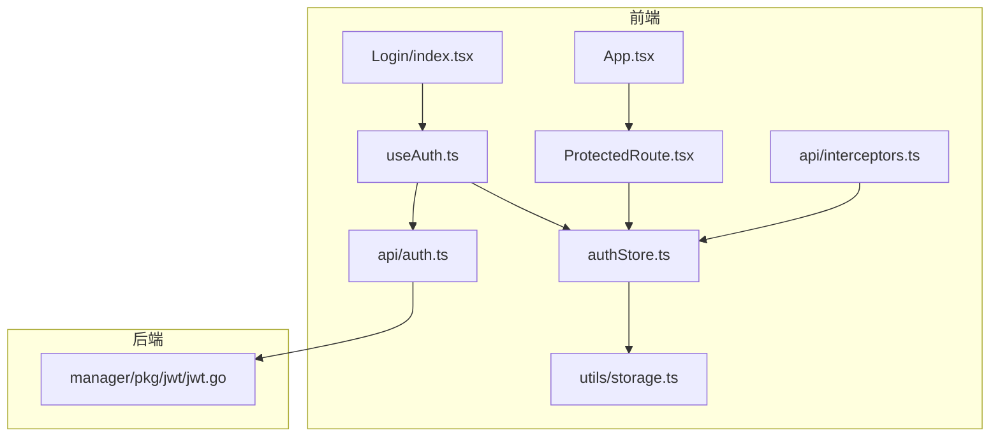
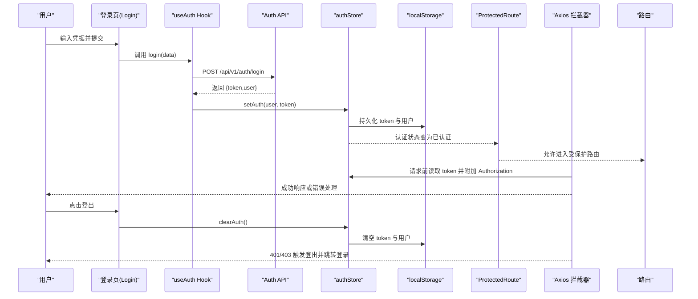
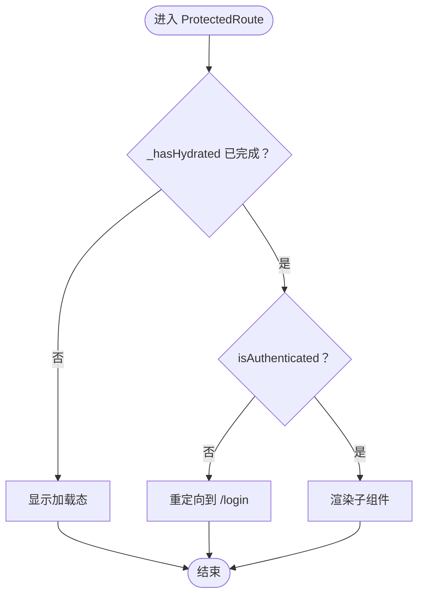
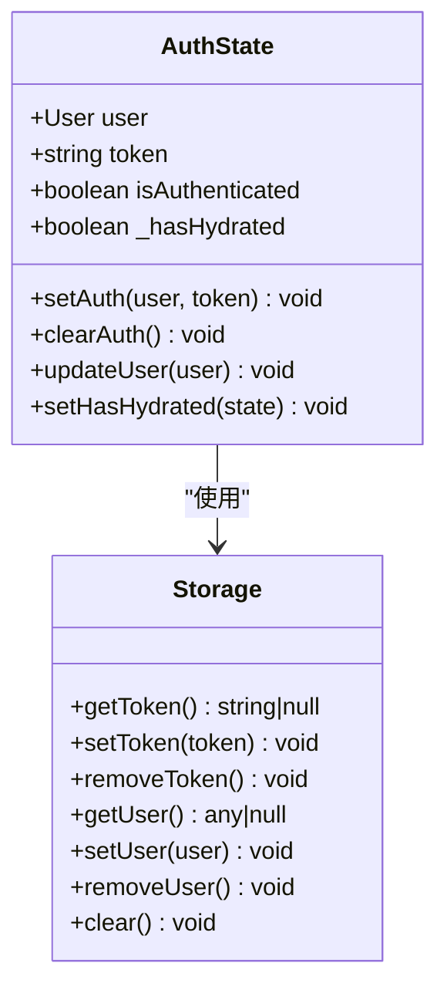
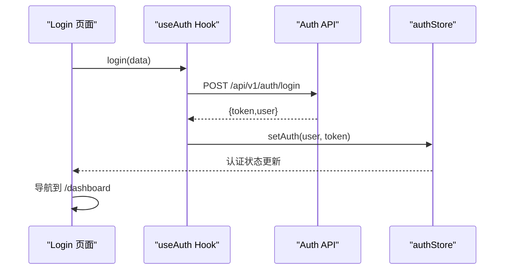
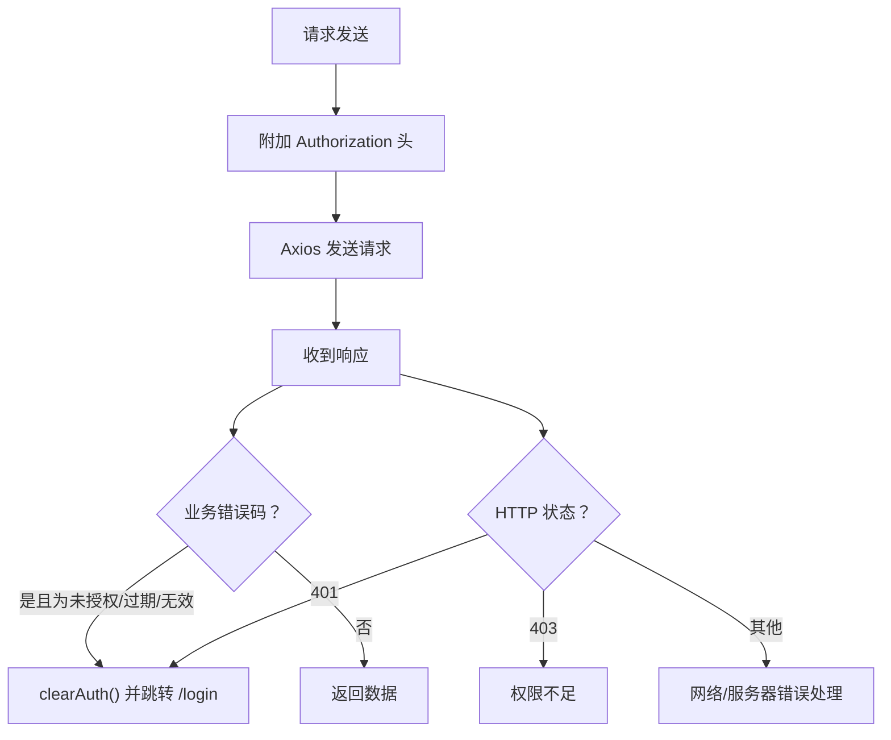
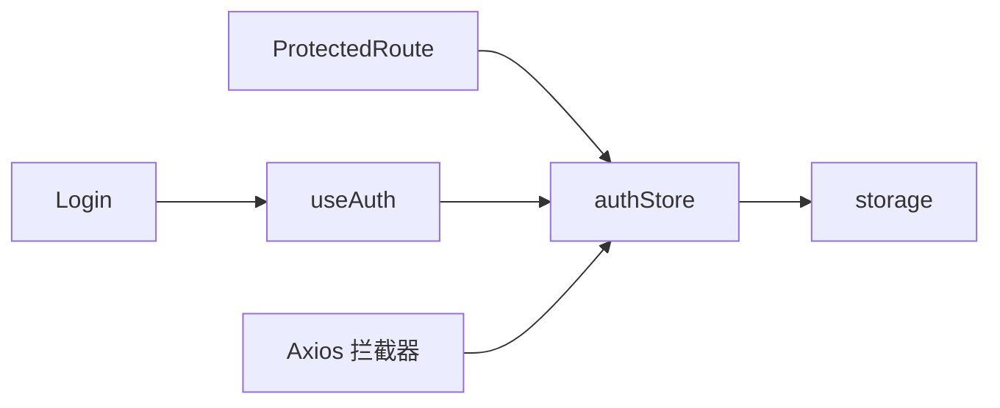

# 认证与访问控制

<cite>
**本文引用的文件**
- [web/src/router/ProtectedRoute.tsx](file://web/src/router/ProtectedRoute.tsx)
- [web/src/stores/authStore.ts](file://web/src/stores/authStore.ts)
- [web/src/hooks/useAuth.ts](file://web/src/hooks/useAuth.ts)
- [web/src/pages/Login/index.tsx](file://web/src/pages/Login/index.tsx)
- [web/src/api/auth.ts](file://web/src/api/auth.ts)
- [web/src/api/interceptors.ts](file://web/src/api/interceptors.ts)
- [web/src/utils/storage.ts](file://web/src/utils/storage.ts)
- [web/src/App.tsx](file://web/src/App.tsx)
- [web/src/types/user.ts](file://web/src/types/user.ts)
- [web/src/types/api.ts](file://web/src/types/api.ts)
- [manager/pkg/jwt/jwt.go](file://manager/pkg/jwt/jwt.go)
</cite>

## 目录
1. [引言](#引言)
2. [项目结构](#项目结构)
3. [核心组件](#核心组件)
4. [架构总览](#架构总览)
5. [详细组件分析](#详细组件分析)
6. [依赖关系分析](#依赖关系分析)
7. [性能考量](#性能考量)
8. [故障排查指南](#故障排查指南)
9. [结论](#结论)
10. [附录](#附录)

## 引言
本文件系统性阐述前端认证状态管理与访问控制机制，重点围绕以下目标展开：
- ProtectedRoute 的实现逻辑：对 useAuthStore 的依赖、_hasHydrated 水合状态的处理时机、未认证用户的重定向行为
- authStore 的持久化存储（localStorage）集成方式，onRehydrateStorage 在状态恢复过程中的关键作用
- 登录页面如何通过 useAuth 调用 setAuth 完成认证状态更新；登出时 clearAuth 的清理逻辑
- 多标签页认证状态同步问题的解决方案建议
- JWT 令牌刷新机制的集成建议与权限细粒度控制的扩展思路

## 项目结构
前端认证相关代码主要分布在以下模块：
- 路由保护：web/src/router/ProtectedRoute.tsx
- 认证状态管理：web/src/stores/authStore.ts
- 认证 Hook：web/src/hooks/useAuth.ts
- 登录页面：web/src/pages/Login/index.tsx
- 认证 API：web/src/api/auth.ts
- Axios 拦截器：web/src/api/interceptors.ts
- 本地存储工具：web/src/utils/storage.ts
- 应用入口与路由：web/src/App.tsx
- 类型定义：web/src/types/user.ts、web/src/types/api.ts
- 后端 JWT 管理器：manager/pkg/jwt/jwt.go（用于理解令牌结构与刷新策略）

图表来源
- [web/src/router/ProtectedRoute.tsx](file://web/src/router/ProtectedRoute.tsx#L1-L38)
- [web/src/stores/authStore.ts](file://web/src/stores/authStore.ts#L1-L85)
- [web/src/hooks/useAuth.ts](file://web/src/hooks/useAuth.ts#L1-L73)
- [web/src/pages/Login/index.tsx](file://web/src/pages/Login/index.tsx#L1-L110)
- [web/src/api/auth.ts](file://web/src/api/auth.ts#L1-L43)
- [web/src/api/interceptors.ts](file://web/src/api/interceptors.ts#L1-L95)
- [web/src/utils/storage.ts](file://web/src/utils/storage.ts#L1-L48)
- [web/src/App.tsx](file://web/src/App.tsx#L1-L57)
- [manager/pkg/jwt/jwt.go](file://manager/pkg/jwt/jwt.go#L1-L139)

章节来源
- [web/src/App.tsx](file://web/src/App.tsx#L1-L57)
- [web/src/router/ProtectedRoute.tsx](file://web/src/router/ProtectedRoute.tsx#L1-L38)
- [web/src/stores/authStore.ts](file://web/src/stores/authStore.ts#L1-L85)
- [web/src/hooks/useAuth.ts](file://web/src/hooks/useAuth.ts#L1-L73)
- [web/src/pages/Login/index.tsx](file://web/src/pages/Login/index.tsx#L1-L110)
- [web/src/api/auth.ts](file://web/src/api/auth.ts#L1-L43)
- [web/src/api/interceptors.ts](file://web/src/api/interceptors.ts#L1-L95)
- [web/src/utils/storage.ts](file://web/src/utils/storage.ts#L1-L48)
- [web/src/types/user.ts](file://web/src/types/user.ts#L1-L52)
- [web/src/types/api.ts](file://web/src/types/api.ts#L1-L55)
- [manager/pkg/jwt/jwt.go](file://manager/pkg/jwt/jwt.go#L1-L139)

## 核心组件
- ProtectedRoute：基于认证状态进行路由保护，未认证用户重定向至登录页，并在水合完成前显示加载态
- authStore：Zustand 状态管理，结合 persist 中间件实现 localStorage 持久化，提供 setAuth/clearAuth/updateUser/setHasHydrated 等动作
- useAuth：封装登录、注册、修改密码、获取资料、登出等操作，统一暴露认证状态与操作函数
- 登录页面：表单校验、提交登录、成功后导航至仪表盘
- Axios 拦截器：自动注入 Authorization 头，处理 401/403 等错误并触发登出
- 本地存储工具：封装 token 与用户信息的读写
- 类型定义：User、UserRole、ErrorCode 等

章节来源
- [web/src/router/ProtectedRoute.tsx](file://web/src/router/ProtectedRoute.tsx#L1-L38)
- [web/src/stores/authStore.ts](file://web/src/stores/authStore.ts#L1-L85)
- [web/src/hooks/useAuth.ts](file://web/src/hooks/useAuth.ts#L1-L73)
- [web/src/pages/Login/index.tsx](file://web/src/pages/Login/index.tsx#L1-L110)
- [web/src/api/interceptors.ts](file://web/src/api/interceptors.ts#L1-L95)
- [web/src/utils/storage.ts](file://web/src/utils/storage.ts#L1-L48)
- [web/src/types/user.ts](file://web/src/types/user.ts#L1-L52)
- [web/src/types/api.ts](file://web/src/types/api.ts#L1-L55)

## 架构总览
下图展示认证与访问控制的整体交互流程，涵盖登录、状态持久化、路由保护、请求拦截与登出清理。

图表来源
- [web/src/pages/Login/index.tsx](file://web/src/pages/Login/index.tsx#L1-L110)
- [web/src/hooks/useAuth.ts](file://web/src/hooks/useAuth.ts#L1-L73)
- [web/src/api/auth.ts](file://web/src/api/auth.ts#L1-L43)
- [web/src/stores/authStore.ts](file://web/src/stores/authStore.ts#L1-L85)
- [web/src/utils/storage.ts](file://web/src/utils/storage.ts#L1-L48)
- [web/src/router/ProtectedRoute.tsx](file://web/src/router/ProtectedRoute.tsx#L1-L38)
- [web/src/api/interceptors.ts](file://web/src/api/interceptors.ts#L1-L95)

## 详细组件分析

### ProtectedRoute 组件
- 依赖 useAuthStore 的 isAuthenticated 与 _hasHydrated
- 在 _hasHydrated 为 false 时显示加载态，等待状态从 localStorage 恢复完成
- 若未认证则重定向到 /login
- 已认证则渲染子组件

图表来源
- [web/src/router/ProtectedRoute.tsx](file://web/src/router/ProtectedRoute.tsx#L1-L38)
- [web/src/stores/authStore.ts](file://web/src/stores/authStore.ts#L1-L85)

章节来源
- [web/src/router/ProtectedRoute.tsx](file://web/src/router/ProtectedRoute.tsx#L1-L38)
- [web/src/stores/authStore.ts](file://web/src/stores/authStore.ts#L1-L85)

### authStore（Zustand + persist）
- 状态字段：user、token、isAuthenticated、_hasHydrated
- 动作：
  - setAuth：写入用户与 token，标记为已认证
  - clearAuth：清空本地存储与状态
  - updateUser：更新用户信息并持久化
  - setHasHydrated：标记水合完成
- 持久化配置：
  - 存储键名：ops-auth-storage
  - partialize：仅持久化 user/token，并根据两者是否非空动态计算 isAuthenticated
  - onRehydrateStorage：水合完成后修正 isAuthenticated 并设置 _hasHydrated

图表来源
- [web/src/stores/authStore.ts](file://web/src/stores/authStore.ts#L1-L85)
- [web/src/utils/storage.ts](file://web/src/utils/storage.ts#L1-L48)

章节来源
- [web/src/stores/authStore.ts](file://web/src/stores/authStore.ts#L1-L85)
- [web/src/utils/storage.ts](file://web/src/utils/storage.ts#L1-L48)

### 登录流程与 useAuth Hook
- useAuth 暴露：
  - 状态：isAuthenticated、user
  - 操作：login、register、changePassword、getProfile、logout
  - 加载与错误：各操作的 pending/error 字段
- 登录流程：
  - 表单提交 -> 调用 login(data) -> 成功回调中调用 setAuth(user, token)
  - 登录成功后导航至 /dashboard
- 登出：
  - 调用 logout() -> clearAuth()

图表来源
- [web/src/pages/Login/index.tsx](file://web/src/pages/Login/index.tsx#L1-L110)
- [web/src/hooks/useAuth.ts](file://web/src/hooks/useAuth.ts#L1-L73)
- [web/src/api/auth.ts](file://web/src/api/auth.ts#L1-L43)
- [web/src/stores/authStore.ts](file://web/src/stores/authStore.ts#L1-L85)

章节来源
- [web/src/pages/Login/index.tsx](file://web/src/pages/Login/index.tsx#L1-L110)
- [web/src/hooks/useAuth.ts](file://web/src/hooks/useAuth.ts#L1-L73)
- [web/src/api/auth.ts](file://web/src/api/auth.ts#L1-L43)
- [web/src/stores/authStore.ts](file://web/src/stores/authStore.ts#L1-L85)

### Axios 拦截器与错误处理
- 请求拦截：从 authStore 读取 token 并附加 Authorization 头
- 响应拦截：
  - 业务错误码：当 code 属于未授权/令牌过期/无效时，调用 clearAuth 并跳转 /login
  - HTTP 401：同样触发 clearAuth 并跳转 /login
  - 其他错误：抛出错误或返回友好提示

图表来源
- [web/src/api/interceptors.ts](file://web/src/api/interceptors.ts#L1-L95)
- [web/src/stores/authStore.ts](file://web/src/stores/authStore.ts#L1-L85)

章节来源
- [web/src/api/interceptors.ts](file://web/src/api/interceptors.ts#L1-L95)
- [web/src/stores/authStore.ts](file://web/src/stores/authStore.ts#L1-L85)

### 多标签页状态同步方案
当前实现采用 localStorage 作为持久化介质，但未显式监听 storage 事件以实现跨标签页同步。建议在应用初始化阶段添加 storage 事件监听，当检测到其他标签页修改了 token 或用户信息时，触发 authStore 的状态更新与路由重定向，确保多标签页认证状态一致。

可选实现要点：
- 在应用启动时注册 storage 事件监听
- 当检测到 ops_token 或 ops_user 变化时，调用 authStore 的相应动作
- 如检测到 token 变为 null，则执行 clearAuth 并跳转 /login

（本节为通用实践建议，不对应具体现有代码）

### JWT 令牌刷新机制集成建议
后端提供了 JWT 管理器，支持生成、解析、验证与刷新。前端可结合拦截器与 authStore 扩展刷新流程：
- 在响应拦截器中识别“令牌即将过期”或“已过期”的业务错误码
- 调用后端刷新接口获取新 token，并更新 authStore 与 localStorage
- 重试原请求或继续后续流程
- 对于长期会话，可在后台定时刷新 token，避免频繁登录

章节来源
- [manager/pkg/jwt/jwt.go](file://manager/pkg/jwt/jwt.go#L1-L139)
- [web/src/api/interceptors.ts](file://web/src/api/interceptors.ts#L1-L95)
- [web/src/stores/authStore.ts](file://web/src/stores/authStore.ts#L1-L85)

### 权限细粒度控制扩展思路
- 在 User 类型中扩展角色与权限集合
- 在 authStore 中维护 roles/permissions 字段
- 新增权限守卫组件（如 RequirePermission），在路由层或组件层按需校验
- 结合后端 RBAC 授权策略，前端仅做 UI 层辅助控制与快速拒绝

章节来源
- [web/src/types/user.ts](file://web/src/types/user.ts#L1-L52)
- [web/src/stores/authStore.ts](file://web/src/stores/authStore.ts#L1-L85)

## 依赖关系分析
- ProtectedRoute 依赖 authStore 的认证状态
- useAuth 依赖 authStore 的 setAuth/clearAuth/updateUser
- 登录页面依赖 useAuth 的 login 方法
- Axios 拦截器依赖 authStore 的 token，并在错误时调用 clearAuth
- authStore 依赖 utils/storage 将 token 与用户信息持久化到 localStorage

图表来源
- [web/src/router/ProtectedRoute.tsx](file://web/src/router/ProtectedRoute.tsx#L1-L38)
- [web/src/stores/authStore.ts](file://web/src/stores/authStore.ts#L1-L85)
- [web/src/hooks/useAuth.ts](file://web/src/hooks/useAuth.ts#L1-L73)
- [web/src/pages/Login/index.tsx](file://web/src/pages/Login/index.tsx#L1-L110)
- [web/src/api/interceptors.ts](file://web/src/api/interceptors.ts#L1-L95)
- [web/src/utils/storage.ts](file://web/src/utils/storage.ts#L1-L48)

章节来源
- [web/src/router/ProtectedRoute.tsx](file://web/src/router/ProtectedRoute.tsx#L1-L38)
- [web/src/stores/authStore.ts](file://web/src/stores/authStore.ts#L1-L85)
- [web/src/hooks/useAuth.ts](file://web/src/hooks/useAuth.ts#L1-L73)
- [web/src/pages/Login/index.tsx](file://web/src/pages/Login/index.tsx#L1-L110)
- [web/src/api/interceptors.ts](file://web/src/api/interceptors.ts#L1-L95)
- [web/src/utils/storage.ts](file://web/src/utils/storage.ts#L1-L48)

## 性能考量
- Zustand 的精确订阅避免不必要的渲染，结合 persist 减少初始水合开销
- Axios 拦截器在请求前附加 token，避免每个请求手动处理
- 通过 onRehydrateStorage 在水合完成后一次性修正状态，减少中间态闪烁

（本节为通用指导，不直接分析具体文件）

## 故障排查指南
- 登录后仍被重定向到登录页
  - 检查 authStore 是否正确 setAuth，并确认 _hasHydrated 已置为 true
  - 确认 localStorage 中存在 ops_auth_storage 且包含 user/token
- 401/403 错误频繁出现
  - 检查拦截器是否正确附加 Authorization 头
  - 确认后端返回的业务错误码与前端处理分支一致
- 多标签页状态不同步
  - 按照“多标签页状态同步方案”添加 storage 事件监听
- 令牌过期导致频繁登出
  - 结合“JWT 令牌刷新机制集成建议”，在拦截器中处理刷新流程

章节来源
- [web/src/stores/authStore.ts](file://web/src/stores/authStore.ts#L1-L85)
- [web/src/api/interceptors.ts](file://web/src/api/interceptors.ts#L1-L95)
- [web/src/utils/storage.ts](file://web/src/utils/storage.ts#L1-L48)

## 结论
该前端认证体系以 Zustand 为核心，结合 persist 实现状态持久化，配合 Axios 拦截器与路由保护组件形成完整的认证与访问控制闭环。登录流程清晰、登出清理彻底，错误处理覆盖全面。为进一步提升用户体验与安全性，建议引入多标签页同步与 JWT 刷新机制，并扩展权限细粒度控制。

## 附录
- 类型定义参考：
  - 用户与角色：[web/src/types/user.ts](file://web/src/types/user.ts#L1-L52)
  - API 响应与错误码：[web/src/types/api.ts](file://web/src/types/api.ts#L1-L55)
- 后端 JWT 管理器参考：
  - [manager/pkg/jwt/jwt.go](file://manager/pkg/jwt/jwt.go#L1-L139)