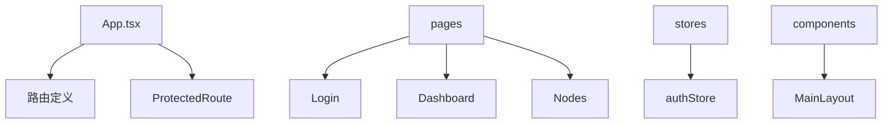
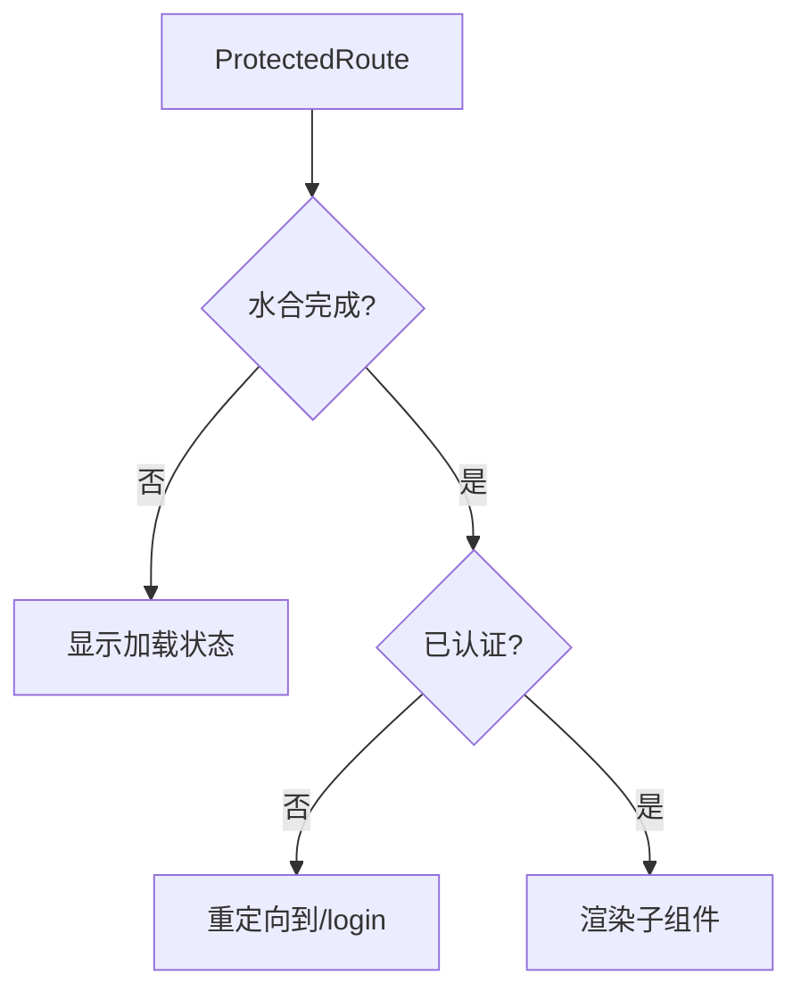
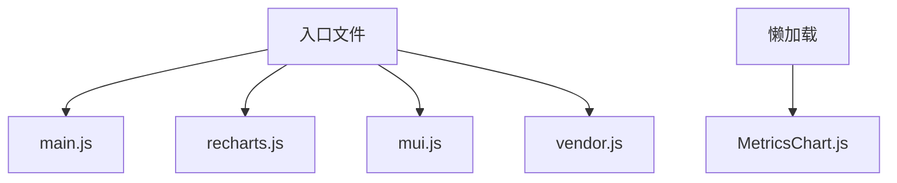

# 路由配置

<cite>
**本文档引用的文件**  
- [App.tsx](file://web/src/App.tsx)
- [ProtectedRoute.tsx](file://web/src/router/ProtectedRoute.tsx)
- [MainLayout.tsx](file://web/src/components/Layout/MainLayout.tsx)
- [authStore.ts](file://web/src/stores/authStore.ts)
- [useAuth.ts](file://web/src/hooks/useAuth.ts)
- [Login/index.tsx](file://web/src/pages/Login/index.tsx)
- [Dashboard/index.tsx](file://web/src/pages/Dashboard/index.tsx)
- [Nodes/List.tsx](file://web/src/pages/Nodes/List.tsx)
- [Nodes/Detail.tsx](file://web/src/pages/Nodes/Detail.tsx)
- [vite.config.ts](file://web/vite.config.ts)
- [设计文档_04_Web前端模块.md](file://docs/设计文档_04_Web前端模块.md)
</cite>

## 目录
1. [项目结构](#项目结构)
2. [核心路由配置](#核心路由配置)
3. [路由保护机制](#路由保护机制)
4. [路由层级与嵌套](#路由层级与嵌套)
5. [动态路由匹配](#动态路由匹配)
6. [代码分割与懒加载](#代码分割与懒加载)
7. [常见路由问题排查](#常见路由问题排查)

## 项目结构

本项目采用模块化前端架构，路由相关代码主要位于`web/src`目录下。核心路由配置在`App.tsx`中定义，路由保护逻辑通过`ProtectedRoute.tsx`组件实现。页面组件按功能模块组织在`pages`目录下，包括登录页、仪表盘和节点管理等。



**图源**  
- [App.tsx](file://web/src/App.tsx)
- [pages](file://web/src/pages)
- [stores](file://web/src/stores)
- [components](file://web/src/components)

**本节来源**  
- [App.tsx](file://web/src/App.tsx)
- [web/src/pages](file://web/src/pages)

## 核心路由配置

项目使用React Router 6进行路由管理，通过`BrowserRouter`、`Routes`和`Route`组件构建路由系统。路由配置分为公共路由和受保护路由两大类。

在`App.tsx`中，根路由配置定义了应用的路由结构：
- `/login`路径为公共路由，直接渲染登录组件
- 根路径`/`及其子路由为受保护路由，需要通过`ProtectedRoute`组件验证
- 使用`Navigate`组件实现路由重定向
- 通配符路由`*`处理404情况，重定向到仪表盘

```mermaid
graph TD
A[/login] --> B[Login]
C[/] --> D[ProtectedRoute]
D --> E[/dashboard]
D --> F[/nodes]
D --> G[/nodes/:id]
H[*] --> I[重定向到/dashboard]
```

**图源**  
- [App.tsx](file://web/src/App.tsx#L34-L48)

**本节来源**  
- [App.tsx](file://web/src/App.tsx#L5-L57)

## 路由保护机制

路由保护通过`ProtectedRoute`组件实现，该组件结合Zustand状态管理库中的认证状态来控制路由访问权限。

`ProtectedRoute`组件的工作流程：
1. 首先检查认证状态是否已完成水合（从持久化存储恢复）
2. 如果未完成水合，显示加载状态
3. 检查用户是否已认证
4. 未认证用户重定向到登录页
5. 已认证用户渲染子组件

认证状态由`authStore.ts`中的`useAuthStore`管理，包含`isAuthenticated`和`_hasHydrated`等状态字段。`useAuth` Hook封装了登录、登出等认证操作。



**图源**  
- [ProtectedRoute.tsx](file://web/src/router/ProtectedRoute.tsx#L13-L37)
- [authStore.ts](file://web/src/stores/authStore.ts#L10-L21)

**本节来源**  
- [ProtectedRoute.tsx](file://web/src/router/ProtectedRoute.tsx#L1-L38)
- [authStore.ts](file://web/src/stores/authStore.ts#L1-L85)
- [useAuth.ts](file://web/src/hooks/useAuth.ts#L1-L73)

## 路由层级与嵌套

项目采用嵌套路由设计，通过路由层级结构组织页面内容。主布局`MainLayout`作为受保护路由的容器，包含导航栏和内容区域。

路由层级结构：
- 一级路由：`/login`（公共）和`/`（受保护）
- 二级路由：`/dashboard`、`/nodes`、`/nodes/:id`
- 使用`Outlet`组件作为子路由的占位符

`MainLayout`组件包含侧边栏导航，菜单项与路由路径对应，点击菜单项通过`useNavigate`进行路由跳转。面包屑导航在`NodeDetail`页面中实现，提供清晰的导航路径。

```mermaid
graph TD
A[根路由] --> B[/login]
A --> C[/]
C --> D[/dashboard]
C --> E[/nodes]
C --> F[/nodes/:id]
G[MainLayout] --> H[Outlet]
H --> I[Dashboard]
H --> J[NodeList]
H --> K[NodeDetail]
```

**图源**  
- [App.tsx](file://web/src/App.tsx#L34-L48)
- [MainLayout.tsx](file://web/src/components/Layout/MainLayout.tsx#L6-L184)
- [NodeDetail.tsx](file://web/src/pages/Nodes/Detail.tsx#L162-L188)

**本节来源**  
- [App.tsx](file://web/src/App.tsx#L27-L57)
- [MainLayout.tsx](file://web/src/components/Layout/MainLayout.tsx#L1-L184)
- [NodeDetail.tsx](file://web/src/pages/Nodes/Detail.tsx#L1-L800)

## 动态路由匹配

项目使用动态路由参数实现节点详情页的访问。`/nodes/:id`路由通过`useParams` Hook获取动态参数。

在`NodeDetail.tsx`中，`useParams`用于获取URL中的节点ID：
```typescript
const { id } = useParams<{ id: string }>();
```

动态路由的应用场景：
- 节点详情页：`/nodes/:id`，根据节点ID显示特定节点信息
- 路由参数可用于API请求，获取对应节点的详细数据
- 页面内通过`Link`组件创建动态路由链接

动态路由的配置在`App.tsx`中定义，子路由直接定义在父路由的`children`中，无需额外配置。

**本节来源**  
- [App.tsx](file://web/src/App.tsx#L46)
- [NodeDetail.tsx](file://web/src/pages/Nodes/Detail.tsx#L82)
- [List.tsx](file://web/src/pages/Nodes/List.tsx#L123)

## 代码分割与懒加载

项目通过Vite的构建配置和React的懒加载特性实现代码分割，优化首屏加载性能。

在`vite.config.ts`中配置了`manualChunks`，将第三方库分割成独立的代码块：
- `recharts`单独分割
- MUI相关库合并为`mui`块
- 其他依赖合并为`vendor`块

对于大型组件如`MetricsChart`，使用React的`lazy`和`Suspense`实现懒加载：
```typescript
const MetricsChart = lazy(() => import('../../components/Metrics/MetricsChart'));
```

这种代码分割策略减少了初始加载的JavaScript包大小，提升了首屏渲染速度，同时按需加载非关键组件。



**图源**  
- [vite.config.ts](file://web/vite.config.ts#L20-L33)
- [Detail.tsx](file://web/src/pages/Nodes/Detail.tsx#L57)

**本节来源**  
- [vite.config.ts](file://web/vite.config.ts#L1-L38)
- [Detail.tsx](file://web/src/pages/Nodes/Detail.tsx#L57)

## 常见路由问题排查

### 重定向循环问题
当受保护路由的重定向逻辑配置不当时，可能导致重定向循环。本项目通过在`ProtectedRoute`中正确处理认证状态避免此问题。

### 404处理不当
通配符路由`*`应放在路由配置的最后，确保其他路由匹配失败时才触发。本项目将`*`路由放在最后，重定向到仪表盘页面。

### 认证状态水合问题
使用Zustand的`persist`中间件时，需等待状态从持久化存储恢复完成。`ProtectedRoute`通过`_hasHydrated`状态确保水合完成后再进行认证检查。

### 嵌套路由配置错误
确保父路由的`element`包含`Outlet`组件，否则子路由无法渲染。本项目在`MainLayout`中正确使用`Outlet`。

### 动态路由参数获取失败
使用`useParams`前应确保在正确的路由层级。对于嵌套路由，`useParams`获取的是所有层级的参数合并对象。

**本节来源**  
- [ProtectedRoute.tsx](file://web/src/router/ProtectedRoute.tsx#L17-L30)
- [App.tsx](file://web/src/App.tsx#L48)
- [MainLayout.tsx](file://web/src/components/Layout/MainLayout.tsx#L179)
- [设计文档_04_Web前端模块.md](file://docs/设计文档_04_Web前端模块.md#L400-L427)