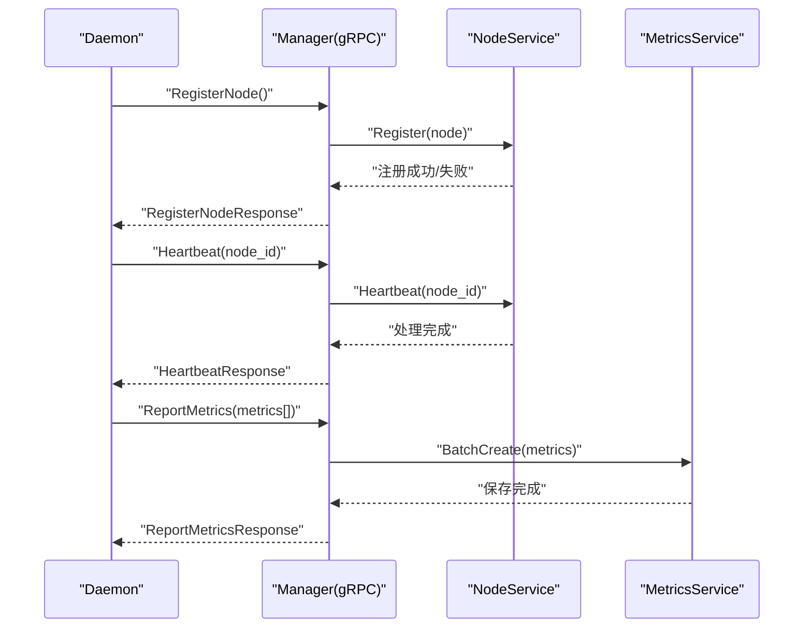
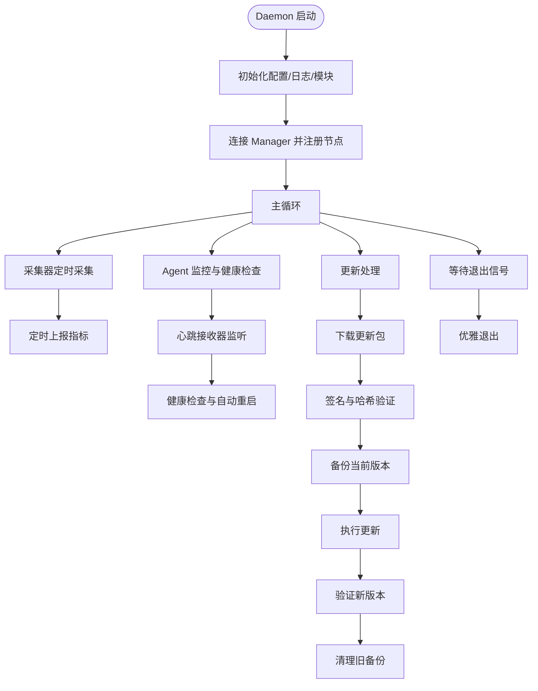
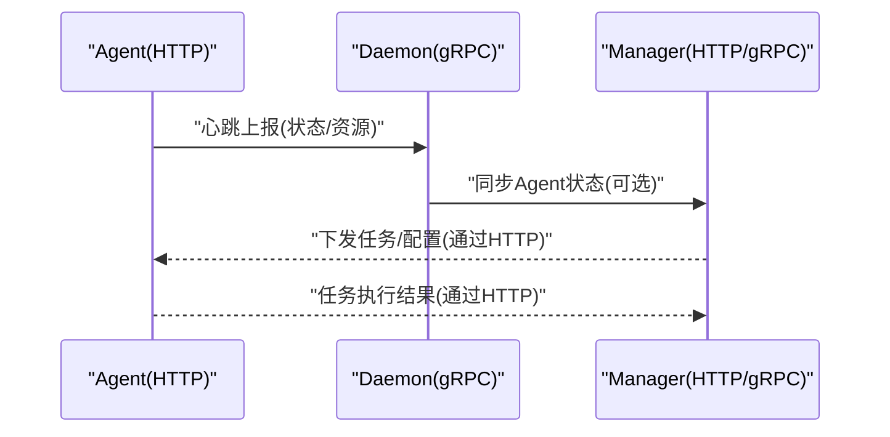
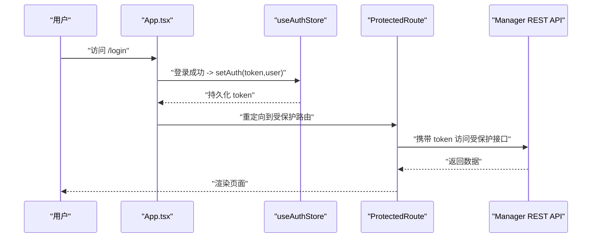
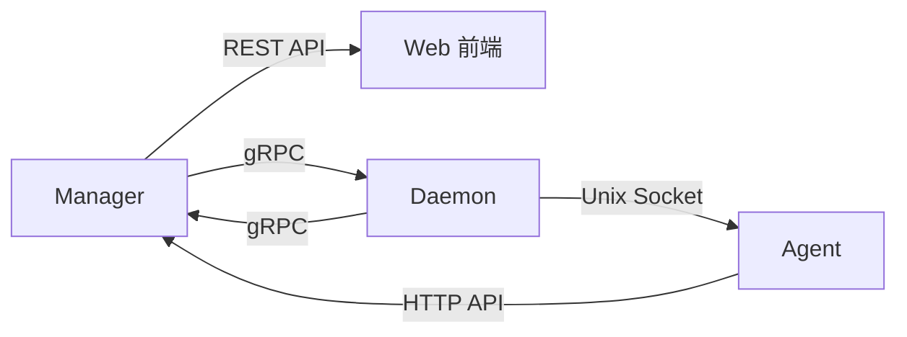

# 架构设计

<cite>
**本文引用的文件**
- [manager/cmd/manager/main.go](file://manager/cmd/manager/main.go)
- [manager/internal/grpc/server.go](file://manager/internal/grpc/server.go)
- [manager/internal/handler/node.go](file://manager/internal/handler/node.go)
- [daemon/cmd/daemon/main.go](file://daemon/cmd/daemon/main.go)
- [daemon/internal/grpc/server.go](file://daemon/internal/grpc/server.go)
- [daemon/internal/agent/multi_manager.go](file://daemon/internal/agent/multi_manager.go)
- [agent/cmd/agent/main.go](file://agent/cmd/agent/main.go)
- [web/src/App.tsx](file://web/src/App.tsx)
- [web/src/stores/authStore.ts](file://web/src/stores/authStore.ts)
- [web/src/stores/metricsStore.ts](file://web/src/stores/metricsStore.ts)
- [daemon/pkg/proto/daemon.proto](file://daemon/pkg/proto/daemon.proto)
- [docs/设计文档_03_Manager模块.md](file://docs/设计文档_03_Manager模块.md)
- [docs/设计文档_01_Daemon模块.md](file://docs/设计文档_01_Daemon模块.md)
- [docs/设计文档_02_Agent模块.md](file://docs/设计文档_02_Agent模块.md)
- [docs/设计文档_04_Web前端模块.md](file://docs/设计文档_04_Web前端模块.md)
</cite>

## 目录
1. [简介](#简介)
2. [项目结构](#项目结构)
3. [核心组件](#核心组件)
4. [架构总览](#架构总览)
5. [组件详细分析](#组件详细分析)
6. [依赖关系分析](#依赖关系分析)
7. [性能考量](#性能考量)
8. [故障排查指南](#故障排查指南)
9. [结论](#结论)
10. [附录](#附录)

## 简介
本架构设计文档面向 ops-scaffold-framework 的四大核心组件：Manager、Daemon、Agent 与 Web 前端。文档以“高内聚、低耦合”为设计原则，明确各组件的职责边界与服务契约，并通过来自设计文档的架构图与实际代码映射，解释组件间的集成模式（RESTful API、gRPC 通信协议与潜在 Unix Socket IPC）。文档还包含系统上下文图、组件图与数据流图，帮助开发者快速理解全局交互与关键架构决策。

## 项目结构
- Manager：中心管理节点，提供 REST API 与 gRPC 服务，负责节点管理、指标聚合、任务调度、版本发布与审计日志。
- Daemon：运行在被管主机上的守护进程，负责资源采集、Agent 生命周期管理、与 Manager 的 gRPC 通信、版本更新与本地日志管理。
- Agent：运行在被管主机上的任务执行进程，提供 HTTP API 供 Manager/Daemon 调用，上报心跳与状态，支持任务队列与并发控制。
- Web：基于 React + MUI 的前端应用，采用 Zustand 状态管理与 React Query 服务端状态缓存，提供节点管理、监控仪表盘、任务与版本管理等界面。

```mermaid
graph TB
subgraph "Manager"
M_HTTP["HTTP 服务(Gin)"]
M_GRPC["gRPC 服务"]
M_DB["MySQL/Redis"]
end
subgraph "Daemon"
D_GRPC["gRPC 客户端"]
D_COL["资源采集模块"]
D_AG["Agent 管理模块"]
D_UPD["版本更新模块"]
end
subgraph "Agent"
A_HTTP["HTTP API 服务"]
A_TASK["任务引擎"]
A_HB["心跳模块"]
end
subgraph "Web 前端"
W_APP["App.tsx 路由与主题"]
W_STORE["Zustand 状态管理"]
end
W_APP --> M_HTTP
M_HTTP --> M_DB
M_GRPC <- --> D_GRPC
D_GRPC --> M_GRPC
D_COL --> M_GRPC
D_AG --> D_GRPC
D_UPD --> M_GRPC
A_HTTP <- --> D_GRPC
A_TASK --> A_HTTP
A_HB --> D_GRPC
```

**图表来源**
- [manager/cmd/manager/main.go](file://manager/cmd/manager/main.go#L135-L211)
- [daemon/cmd/daemon/main.go](file://daemon/cmd/daemon/main.go#L47-L61)
- [agent/cmd/agent/main.go](file://agent/cmd/agent/main.go#L92-L119)
- [web/src/App.tsx](file://web/src/App.tsx#L1-L57)

**章节来源**
- [docs/设计文档_03_Manager模块.md](file://docs/设计文档_03_Manager模块.md#L1-L120)
- [docs/设计文档_01_Daemon模块.md](file://docs/设计文档_01_Daemon模块.md#L1-L120)
- [docs/设计文档_02_Agent模块.md](file://docs/设计文档_02_Agent模块.md#L1-L120)
- [docs/设计文档_04_Web前端模块.md](file://docs/设计文档_04_Web前端模块.md#L1-L120)

## 核心组件
- Manager
  - 职责：节点注册与状态监控、指标聚合与查询、任务调度与执行、版本发布与回滚、用户认证与审计日志。
  - 边界：对外通过 REST API 与 gRPC 与 Daemon/Agent 交互；对内分层清晰，包含 Handler、Service、Repository、Model 与基础设施。
- Daemon
  - 职责：系统资源采集与上报、Agent 生命周期管理、与 Manager 的 gRPC 通信、版本更新执行、本地日志管理。
  - 边界：通过 gRPC 与 Manager 交互，通过 Unix Socket 与 Agent 通信，保持轻量化与高可用。
- Agent
  - 职责：执行运维任务（脚本、文件、服务）、提供 HTTP API、上报心跳与状态、支持插件扩展。
  - 边界：独立于 Manager 运行，通过 HTTP API 与 Manager/Daemon 交互，通过 Unix Socket 与 Daemon 交互。
- Web 前端
  - 职责：集中化节点管理、可视化监控仪表盘、任务与版本管理、用户权限管理。
  - 边界：通过 REST API 与 Manager 交互，使用 Zustand 管理认证与指标状态，React Query 管理服务端状态缓存。

**章节来源**
- [docs/设计文档_03_Manager模块.md](file://docs/设计文档_03_Manager模块.md#L30-L120)
- [docs/设计文档_01_Daemon模块.md](file://docs/设计文档_01_Daemon模块.md#L22-L62)
- [docs/设计文档_02_Agent模块.md](file://docs/设计文档_02_Agent模块.md#L24-L68)
- [docs/设计文档_04_Web前端模块.md](file://docs/设计文档_04_Web前端模块.md#L25-L66)

## 架构总览
- 系统上下文图
  - Manager 作为中心节点，提供 REST API 与 gRPC 服务，负责节点与指标管理、任务与版本管理、审计与用户管理。
  - Daemon 在每台被管主机上运行，负责资源采集、Agent 管理、与 Manager 的 gRPC 通信、版本更新与本地日志。
  - Agent 在每台被管主机上运行，提供 HTTP API 供 Manager/Daemon 调用，上报心跳与状态，执行任务。
  - Web 前端通过 REST API 与 Manager 交互，提供可视化界面与状态管理。

```mermaid
graph TB
subgraph "外部系统"
U["运维人员/自动化系统"]
end
subgraph "Manager"
M_API["REST API"]
M_G["gRPC 服务"]
end
subgraph "Daemon"
D_G["gRPC 客户端"]
D_A["Agent 管理"]
D_C["资源采集"]
end
subgraph "Agent"
A_API["HTTP API"]
end
U --> M_API
M_API --> M_G
M_G <- --> D_G
D_G --> M_G
D_C --> M_G
D_A --> D_G
A_API <- --> D_G
```

**图表来源**
- [manager/cmd/manager/main.go](file://manager/cmd/manager/main.go#L212-L246)
- [daemon/internal/grpc/server.go](file://daemon/internal/grpc/server.go#L1-L67)
- [agent/cmd/agent/main.go](file://agent/cmd/agent/main.go#L92-L119)

**章节来源**
- [docs/设计文档_03_Manager模块.md](file://docs/设计文档_03_Manager模块.md#L80-L137)
- [docs/设计文档_01_Daemon模块.md](file://docs/设计文档_01_Daemon模块.md#L64-L120)
- [docs/设计文档_02_Agent模块.md](file://docs/设计文档_02_Agent模块.md#L72-L114)

## 组件详细分析

### Manager 组件
- 设计要点
  - MVC 分层：Handler（路由与参数校验）、Service（业务逻辑）、Repository（数据访问）、Model（数据模型）、基础设施（数据库、缓存、gRPC）。
  - REST API：公开健康检查与认证接口，受保护的节点、指标、Agent 管理与管理员接口。
  - gRPC 服务：接收 Daemon 的节点注册、心跳与指标上报；同时作为 Daemon 的 gRPC 服务端，接收 Daemon 上报的 Agent 状态。
  - 安全：JWT 认证、CORS、审计日志中间件。
  - 数据库：MySQL 主数据、Redis 缓存、Kafka 可选消息队列。
- 关键流程
  - 节点注册：Daemon 通过 gRPC RegisterNode，Manager 调用 NodeService 完成注册并返回节点 ID。
  - 心跳处理：Daemon 通过 gRPC Heartbeat，Manager 调用 NodeService 更新节点状态。
  - 指标上报：Daemon 通过 gRPC ReportMetrics，Manager 调用 MetricsService 批量保存指标。
  - 版本更新：前端通过 REST API 触发，Manager 通过 Daemon 客户端推送更新，Daemon 下载并执行更新，Agent 执行任务或自更新。



**图表来源**
- [manager/internal/grpc/server.go](file://manager/internal/grpc/server.go#L34-L145)
- [manager/internal/handler/node.go](file://manager/internal/handler/node.go#L36-L157)

**章节来源**
- [manager/cmd/manager/main.go](file://manager/cmd/manager/main.go#L135-L211)
- [manager/internal/grpc/server.go](file://manager/internal/grpc/server.go#L1-L145)
- [manager/internal/handler/node.go](file://manager/internal/handler/node.go#L1-L157)
- [docs/设计文档_03_Manager模块.md](file://docs/设计文档_03_Manager模块.md#L140-L229)

### Daemon 组件
- 设计要点
  - 轻量化与高可用：CPU < 1%、内存 < 30MB；自动恢复、异常率 < 0.1%。
  - 模块化：Core Engine（配置、日志、信号、调度）、Collector（CPU/Memory/Disk/Network）、Agent 管理（生命周期、健康检查、心跳接收）、Updater（下载、验证、备份、回滚、自更新）。
  - 通信：gRPC 客户端与 Manager 通信；Unix Socket 与 Agent 通信。
  - 线程模型：Main Goroutine + 多个子协程分别负责采集、上报、Agent 监控、心跳接收、更新处理与信号处理。
- 关键流程
  - Agent 管理：MultiAgentManager 提供 Start/Stop/Restart/List 等操作，支持并发启动/停止/重启。
  - 资源采集：CollectorManager 并发采集 CPU/Memory/Disk/Network 指标，定时上报 Manager。
  - 心跳接收：HeartbeatReceiver 通过 Unix Socket 接收 Agent 心跳，HealthChecker 基于心跳与资源阈值进行健康检查与自动重启。
  - 版本更新：Updater 通过下载、签名与哈希验证、备份、执行与验证、回滚策略保障更新安全可靠。



**图表来源**
- [docs/设计文档_01_Daemon模块.md](file://docs/设计文档_01_Daemon模块.md#L141-L191)
- [daemon/internal/grpc/server.go](file://daemon/internal/grpc/server.go#L37-L124)
- [daemon/internal/agent/multi_manager.go](file://daemon/internal/agent/multi_manager.go#L135-L275)

**章节来源**
- [daemon/cmd/daemon/main.go](file://daemon/cmd/daemon/main.go#L47-L61)
- [docs/设计文档_01_Daemon模块.md](file://docs/设计文档_01_Daemon模块.md#L121-L200)
- [daemon/internal/grpc/server.go](file://daemon/internal/grpc/server.go#L1-L171)
- [daemon/internal/agent/multi_manager.go](file://daemon/internal/agent/multi_manager.go#L1-L134)

### Agent 组件
- 设计要点
  - 轻量化与高性能：CPU < 1%、内存 < 50MB；API 响应 < 100ms，支持 10 并发任务。
  - 模块化：HTTP/HTTPS 服务（路由、认证中间件、限流中间件）、任务引擎（队列管理、调度器、工作池、结果存储）、执行器（脚本、文件、服务）、心跳模块（状态采集、Socket 客户端）。
  - 独立性：不依赖 Daemon 运行，通过 HTTP API 与 Manager/Daemon 交互。
- 关键流程
  - HTTP API：健康检查、状态查询、任务执行、文件操作、服务管理等接口。
  - 任务引擎：QueueManager 按优先级排队，WorkerPool 并发执行，ResultStore 存储结果并定期清理。
  - 心跳上报：StatusCollector 与 SocketClient 将 Agent 状态上报给 Daemon。



**图表来源**
- [agent/cmd/agent/main.go](file://agent/cmd/agent/main.go#L92-L119)
- [daemon/internal/grpc/server.go](file://daemon/internal/grpc/server.go#L172-L211)
- [docs/设计文档_02_Agent模块.md](file://docs/设计文档_02_Agent模块.md#L150-L200)

**章节来源**
- [agent/cmd/agent/main.go](file://agent/cmd/agent/main.go#L48-L119)
- [docs/设计文档_02_Agent模块.md](file://docs/设计文档_02_Agent模块.md#L120-L200)

### Web 前端组件
- 设计要点
  - 分层架构：展示层（页面）、组件层（布局、业务、通用）、业务层（Hooks、Stores、Utils）、数据层（API 服务）。
  - 状态管理：Zustand 轻量级状态管理，React Query 服务端状态管理与缓存。
  - 技术栈：React 18、TypeScript、Material-UI、Vite、Axios、ECharts、React Hook Form、React Router。
- 关键流程
  - 认证状态：useAuthStore 管理 token 与用户信息，持久化存储，水合后计算 isAuthenticated。
  - 指标状态：useMetricsStore 管理时间范围与刷新间隔，驱动图表与轮询。
  - 路由与守卫：ProtectedRoute 保护受控路由，GuestGuard 限制未登录访问。



**图表来源**
- [web/src/App.tsx](file://web/src/App.tsx#L1-L57)
- [web/src/stores/authStore.ts](file://web/src/stores/authStore.ts#L1-L85)
- [docs/设计文档_04_Web前端模块.md](file://docs/设计文档_04_Web前端模块.md#L324-L429)

**章节来源**
- [web/src/App.tsx](file://web/src/App.tsx#L1-L57)
- [web/src/stores/authStore.ts](file://web/src/stores/authStore.ts#L1-L85)
- [web/src/stores/metricsStore.ts](file://web/src/stores/metricsStore.ts#L1-L37)
- [docs/设计文档_04_Web前端模块.md](file://docs/设计文档_04_Web前端模块.md#L110-L180)

## 依赖关系分析
- 组件耦合与内聚
  - Manager 与 Daemon 通过 gRPC 协议强耦合，职责清晰：Manager 负责编排与存储，Daemon 负责执行与上报。
  - Agent 与 Daemon 通过 Unix Socket 与 gRPC 协议耦合，保持轻量与低延迟。
  - Web 前端与 Manager 通过 REST API 耦合，状态管理与服务端状态缓存解耦。
- 外部依赖
  - gRPC/Protobuf：统一跨语言通信协议，便于扩展与演进。
  - MySQL/Redis：Manager 的数据持久化与缓存。
  - Unix Socket：Agent 与 Daemon 的本地 IPC。
- 循环依赖
  - 代码层面未见循环导入；模块间通过接口与 Protobuf 消息解耦。



**图表来源**
- [manager/cmd/manager/main.go](file://manager/cmd/manager/main.go#L212-L246)
- [daemon/cmd/daemon/main.go](file://daemon/cmd/daemon/main.go#L47-L61)
- [agent/cmd/agent/main.go](file://agent/cmd/agent/main.go#L92-L119)

**章节来源**
- [daemon/pkg/proto/daemon.proto](file://daemon/pkg/proto/daemon.proto#L1-L35)

## 性能考量
- Manager
  - REST API：Gin 框架，中间件（恢复、日志、CORS、JWT、审计）保证稳定性；数据库连接池与索引设计（节点状态、指标时间戳、任务执行状态）提升查询性能。
  - gRPC：短连接/长连接策略与连接池（Daemon 客户端池）降低延迟；批量指标上报减少网络开销。
- Daemon
  - 轻量化：采集与上报周期可配置，避免高频 IO；健康检查与自动重启降低宕机风险。
  - 并发：多 goroutine 并行采集与上报，避免阻塞。
- Agent
  - 任务并发：WorkerPool 并发执行，超时控制与结果存储避免资源泄漏。
  - 心跳：Unix Socket 低延迟上报，减少网络开销。
- Web 前端
  - Zustand 与 React Query：精确订阅与缓存，减少不必要的渲染与重复请求；路由守卫与懒加载优化首屏性能。

[本节为通用指导，无需特定文件引用]

## 故障排查指南
- Manager
  - REST API：检查路由注册与中间件顺序，确认 JWT 与审计日志中间件正确注入；查看数据库迁移与连接状态。
  - gRPC：检查 gRPC 服务注册与监听端口；验证 Daemon 客户端连接池状态。
- Daemon
  - gRPC 客户端：确认与 Manager 的连接状态与证书配置；检查心跳与指标上报是否正常。
  - Agent 管理：查看 MultiAgentManager 的 Start/Stop/Restart 日志；检查元数据存储与状态回调。
  - 资源采集：确认采集器接口实现与定时器；检查指标上报频率与数据格式。
- Agent
  - HTTP API：检查路由与中间件（认证、限流）；查看任务队列与执行器日志。
  - 心跳：确认 Unix Socket 路径与权限；检查心跳回调与状态更新。
- Web 前端
  - 认证：检查 token 持久化与水合过程；确认路由守卫生效。
  - 状态管理：确认 Zustand store 的初始化与更新；React Query 的缓存与重试策略。

**章节来源**
- [manager/cmd/manager/main.go](file://manager/cmd/manager/main.go#L247-L289)
- [daemon/cmd/daemon/main.go](file://daemon/cmd/daemon/main.go#L47-L61)
- [agent/cmd/agent/main.go](file://agent/cmd/agent/main.go#L121-L138)
- [web/src/stores/authStore.ts](file://web/src/stores/authStore.ts#L1-L85)

## 结论
本架构以“高内聚、低耦合”为核心设计原则，通过 REST API 与 gRPC 协议实现 Manager 与 Daemon/Agent 的清晰边界与高效协作，结合 Unix Socket 实现 Agent 与 Daemon 的轻量 IPC。前端采用 Zustand 与 React Query，确保状态管理与服务端状态缓存的简洁与高效。数据库与缓存配合，满足指标与审计日志的高吞吐需求。整体架构具备良好的扩展性与可维护性，适合在生产环境中长期演进。

[本节为总结性内容，无需特定文件引用]

## 附录
- 关键架构决策
  - 采用 gRPC 进行服务间通信：统一跨语言协议、强类型消息定义、便于扩展与演进。
  - 前端状态管理选择 Zustand：轻量、简单、性能优异，适合中小型应用的状态管理需求。
  - 保证 Daemon 与 Agent 的轻量级特性：通过模块化设计、并发与资源控制、健康检查与自动重启，确保系统稳定与低开销。
- 数据流图（Manager 与 Daemon）
  - 节点注册、心跳与指标上报的数据流已在“Manager 组件”与“Daemon 组件”的序列图中体现。

**章节来源**
- [docs/设计文档_03_Manager模块.md](file://docs/设计文档_03_Manager模块.md#L139-L229)
- [docs/设计文档_01_Daemon模块.md](file://docs/设计文档_01_Daemon模块.md#L64-L120)
- [docs/设计文档_04_Web前端模块.md](file://docs/设计文档_04_Web前端模块.md#L280-L322)