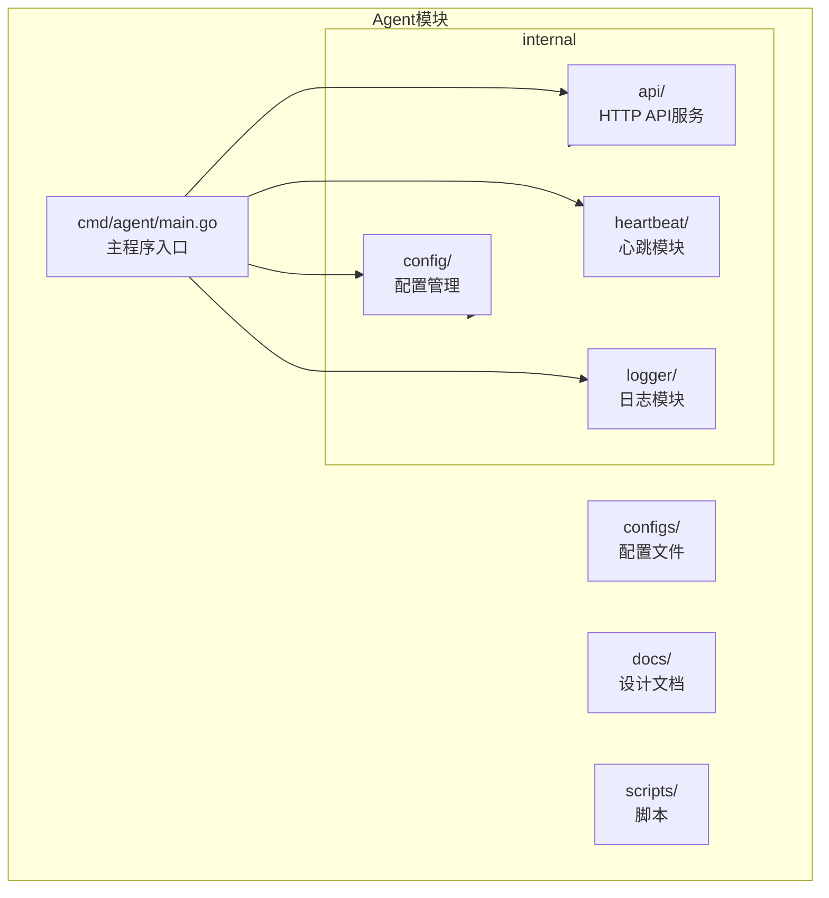
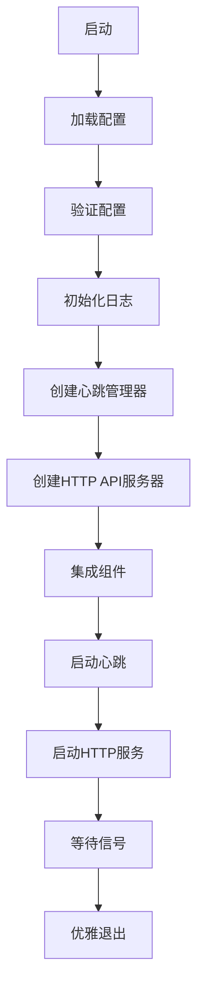
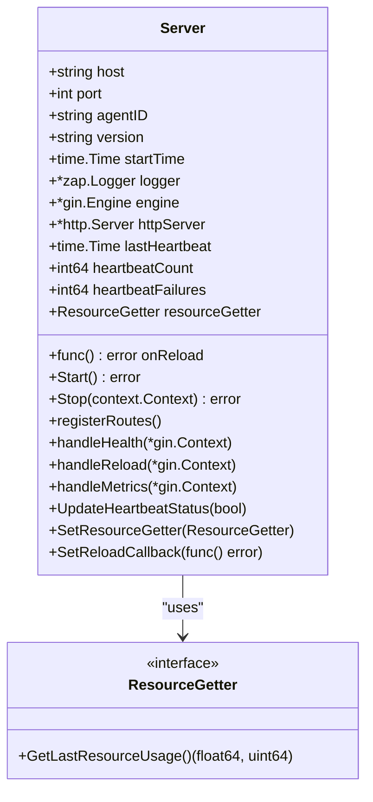
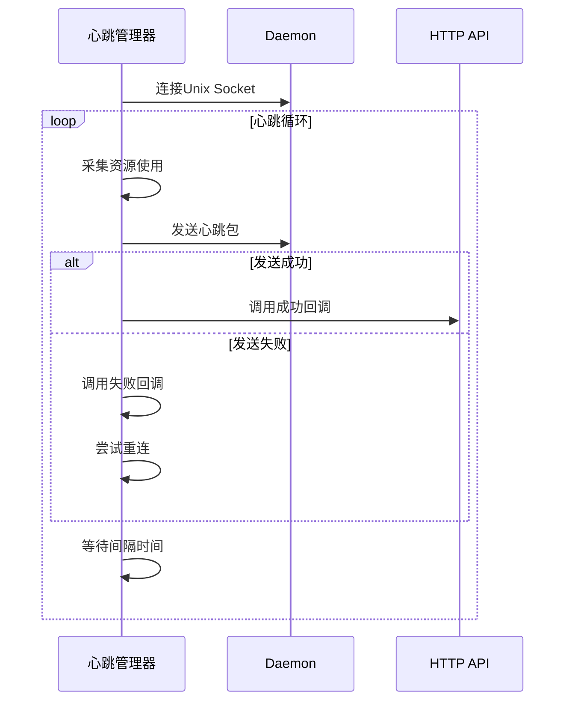
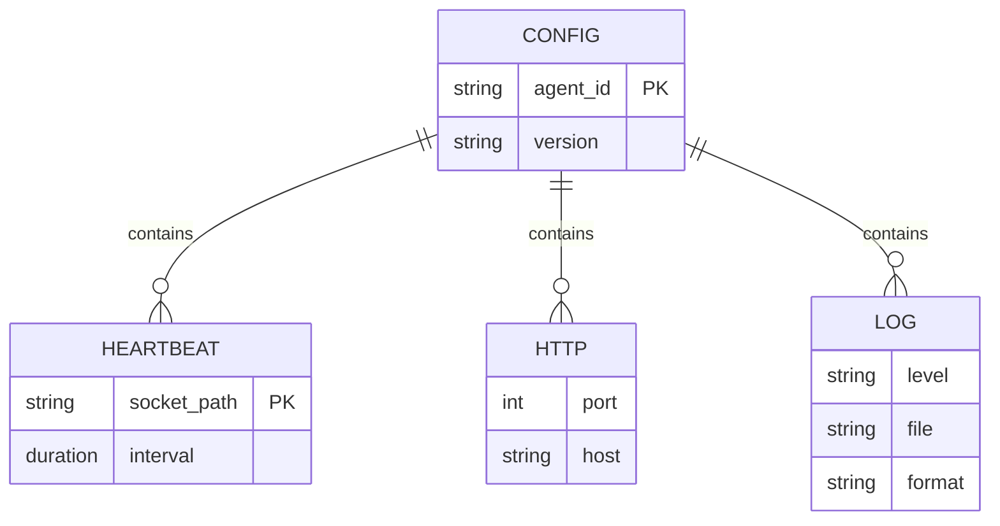

# Agent模块

<cite>
**本文档引用文件**   
- [main.go](file://agent/cmd/agent/main.go)
- [server.go](file://agent/internal/api/server.go)
- [config.go](file://agent/internal/config/config.go)
- [heartbeat.go](file://agent/internal/heartbeat/heartbeat.go)
- [logger.go](file://agent/internal/logger/logger.go)
- [agent.yaml](file://agent/configs/agent.yaml)
- [QUICKSTART.md](file://agent/QUICKSTART.md)
- [README.md](file://agent/README.md)
- [DESIGN.md](file://agent/docs/DESIGN.md)
- [设计文档_02_Agent模块.md](file://docs/设计文档_02_Agent模块.md)
</cite>

## 目录
1. [引言](#引言)
2. [项目结构](#项目结构)
3. [核心组件](#核心组件)
4. [架构概述](#架构概述)
5. [详细组件分析](#详细组件分析)
6. [依赖分析](#依赖分析)
7. [性能考虑](#性能考虑)
8. [故障排除指南](#故障排除指南)
9. [结论](#结论)

## 引言

Agent模块是运维工具框架中的终端执行单元，负责在被管主机上执行各种运维任务。该模块作为轻量级进程运行，主要职责包括：通过HTTP/HTTPS服务提供API接口、向Daemon上报心跳状态、执行来自Daemon的指令（如脚本运行、文件分发等）、支持配置热加载与插件扩展能力。Agent通过Unix Socket与Daemon进行轻量级通信，实现了高效的状态同步和任务传递机制。本技术文档将详细阐述Agent模块的设计原理、实现细节和使用方法。

## 项目结构

Agent模块采用清晰的分层架构设计，各组件职责分明，便于维护和扩展。



**图源**
- [main.go](file://agent/cmd/agent/main.go#L1-L138)
- [目录结构](file://agent/)

**本节来源**
- [main.go](file://agent/cmd/agent/main.go#L1-L138)
- [README.md](file://agent/README.md#L212-L226)

## 核心组件

Agent模块的核心组件包括配置管理、HTTP API服务、心跳上报和日志记录四大功能模块。配置管理模块基于Viper库实现，支持YAML配置文件和环境变量覆盖，确保了配置的灵活性和可管理性。HTTP API服务采用Gin框架构建，提供了健康检查、指标暴露和配置重载等RESTful接口，为外部系统提供了标准化的交互方式。心跳模块通过Unix Socket与Daemon建立持久连接，定时发送包含CPU和内存使用率的心跳包，实现了Agent状态的实时监控。日志模块使用Zap库实现结构化日志输出，支持JSON和文本两种格式，便于日志的收集和分析。这些组件通过main函数进行集成和协调，共同构成了Agent的完整功能体系。

**本节来源**
- [main.go](file://agent/cmd/agent/main.go#L24-L138)
- [config.go](file://agent/internal/config/config.go#L1-L111)
- [server.go](file://agent/internal/api/server.go#L1-L217)
- [heartbeat.go](file://agent/internal/heartbeat/heartbeat.go#L1-L228)
- [logger.go](file://agent/internal/logger/logger.go#L1-L50)

## 架构概述

Agent模块采用微内核架构设计，以main函数为核心，协调各个功能模块的启动和运行。系统启动时，首先加载配置文件并进行验证，然后初始化日志系统，接着创建心跳管理器和HTTP API服务器实例。通过回调机制，将心跳状态与API服务的状态监控进行绑定，实现了组件间的松耦合通信。心跳管理器负责采集Agent自身的资源使用情况，并通过Unix Socket向Daemon发送心跳包；HTTP API服务器则监听指定端口，提供健康检查、指标查询和配置重载等接口。整个系统采用goroutine实现并发处理，包括HTTP请求处理、心跳发送、信号监听等独立的执行流，确保了系统的响应性和稳定性。



**图源**
- [main.go](file://agent/cmd/agent/main.go#L24-L138)
- [gracefulShutdown](file://agent/cmd/agent/main.go#L121-L137)

**本节来源**
- [main.go](file://agent/cmd/agent/main.go#L24-L138)

## 详细组件分析

### HTTP API服务分析

HTTP API服务是Agent对外提供功能的主要接口，采用Gin框架实现RESTful API。服务启动时会注册三个核心路由：/health用于健康检查，/metrics用于暴露监控指标，/reload用于触发配置重载。通过中间件机制实现了请求日志记录和异常恢复功能，确保了服务的可观测性和稳定性。健康检查接口不仅返回Agent的基本状态，还会根据最后一次心跳时间判断Agent的健康状况，当超过90秒未收到心跳时返回服务不可用状态。指标接口则聚合了Agent的运行时信息，包括CPU使用率、内存占用、心跳统计等关键指标，为监控系统提供了丰富的数据支持。

#### API服务类图


**图源**
- [server.go](file://agent/internal/api/server.go#L19-L217)

**本节来源**
- [server.go](file://agent/internal/api/server.go#L19-L217)
- [README.md](file://agent/README.md#L60-L122)

### 心跳模块分析

心跳模块是Agent与Daemon通信的核心机制，负责定期向Daemon上报Agent的运行状态。模块通过Unix Socket与Daemon建立连接，避免了TCP连接的开销，实现了高效的进程间通信。心跳数据结构包含PID、时间戳、版本号、运行状态以及CPU和内存使用率等关键信息，为Daemon提供了全面的Agent状态视图。模块实现了完善的重试机制，当心跳发送失败时会自动尝试重新连接，确保了通信的可靠性。同时，通过设置成功和失败回调函数，实现了与API服务的状态同步，使得外部系统可以通过HTTP接口实时了解心跳的发送情况。

#### 心跳模块序列图


**图源**
- [heartbeat.go](file://agent/internal/heartbeat/heartbeat.go#L26-L228)

**本节来源**
- [heartbeat.go](file://agent/internal/heartbeat/heartbeat.go#L26-L228)
- [README.md](file://agent/README.md#L123-L145)

### 配置管理分析

配置管理模块基于Viper库实现，提供了灵活的配置加载和管理功能。系统支持从配置文件和环境变量两个来源加载配置，环境变量的优先级高于配置文件，便于在不同环境中进行配置覆盖。配置结构采用分层设计，包括Agent基础配置、心跳配置、HTTP服务配置和日志配置四个部分，每个部分都有明确的默认值和验证规则。模块在加载配置后会进行完整性验证，确保必需字段如Agent ID、Socket路径等都已正确设置。这种设计既保证了配置的灵活性，又确保了系统的稳定运行。

#### 配置结构图


**图源**
- [config.go](file://agent/internal/config/config.go#L11-L37)

**本节来源**
- [config.go](file://agent/internal/config/config.go#L11-L111)
- [agent.yaml](file://agent/configs/agent.yaml#L1-L22)

## 依赖分析

Agent模块的依赖关系清晰明确，各组件之间通过定义良好的接口进行通信，降低了耦合度。主程序作为协调者，负责初始化所有核心组件并建立它们之间的联系。配置管理模块为其他所有模块提供配置数据，是系统启动的基础。日志模块被所有组件共享，确保了日志输出的一致性。API服务和心跳管理器作为两个核心功能模块，通过回调机制实现状态同步，而不需要直接依赖对方。这种设计使得各个组件可以独立开发和测试，提高了代码的可维护性。外部依赖方面，系统使用了Gin框架处理HTTP请求，Viper库管理配置，Zap库记录日志，这些成熟的第三方库为系统提供了稳定可靠的基础功能。

```mermaid
graph TD
main[main.go] --> config[config.go]
main --> logger[logger.go]
main --> heartbeat[heartbeat.go]
main --> api[server.go]
config --> api
config --> heartbeat
logger --> api
logger --> heartbeat
heartbeat --> api : 回调
api --> config : 重载
```

**图源**
- [go.mod](file://agent/go.mod#L1-L59)
- [依赖关系](file://agent/cmd/agent/main.go)

**本节来源**
- [go.mod](file://agent/go.mod#L1-L59)
- [main.go](file://agent/cmd/agent/main.go#L1-L138)

## 性能考虑

Agent模块在设计时充分考虑了性能因素，确保在低资源消耗的情况下提供稳定可靠的服务。系统采用Gin框架作为HTTP服务器，该框架以高性能著称，能够高效处理大量并发请求。心跳模块使用Unix Socket进行通信，相比TCP连接具有更低的延迟和开销。资源采集方面，系统仅采集必要的CPU和内存使用率，避免了对系统性能的过度影响。日志输出采用异步写入方式，并支持JSON格式，便于后续的日志处理和分析。通过合理设置心跳间隔（默认30秒）和HTTP超时时间（10秒），在保证功能完整性的前提下，最大限度地减少了系统资源的占用。

## 故障排除指南

在部署和使用Agent模块时，可能会遇到一些常见问题。最常见的问题是Agent无法连接到Daemon的Unix Socket，这通常是由于Daemon未启动或Socket路径配置错误导致的。解决方法是检查Daemon的运行状态，并确认`heartbeat.socket_path`配置项与Daemon的监听路径一致。另一个常见问题是HTTP端口冲突，当多个Agent实例运行在同一主机上时，需要确保它们使用不同的HTTP端口。可以通过修改配置文件中的`http.port`值来解决此问题。此外，如果遇到心跳发送失败的情况，应检查Socket文件的权限设置，确保Agent进程有读写权限。对于配置重载功能，目前仅实现了基础框架，完整的配置热加载功能仍在开发中。

**本节来源**
- [QUICKSTART.md](file://agent/QUICKSTART.md#L151-L178)
- [README.md](file://agent/README.md#L153-L169)

## 结论

Agent模块作为运维工具框架的终端执行单元，通过简洁高效的设计实现了核心功能。系统采用模块化架构，各组件职责分明，通过定义良好的接口进行通信，确保了代码的可维护性和可扩展性。HTTP API服务提供了标准化的交互接口，心跳模块实现了与Daemon的高效状态同步，配置管理支持灵活的部署方式，日志系统则为故障排查提供了有力支持。尽管目前配置热加载等高级功能尚未完全实现，但整体架构为后续功能扩展奠定了良好基础。通过遵循文档中的部署约束和安全建议，可以确保Agent模块在生产环境中稳定可靠地运行。