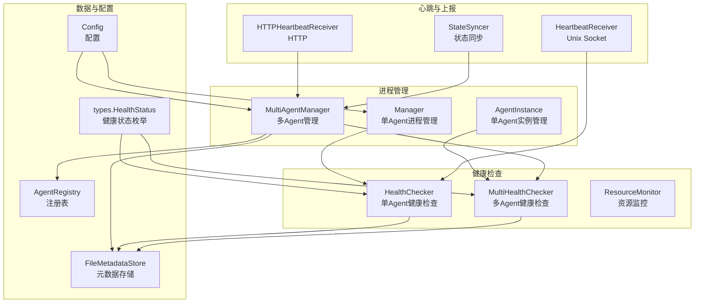
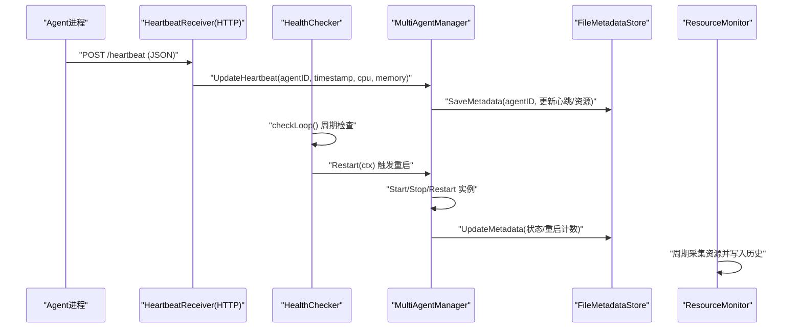
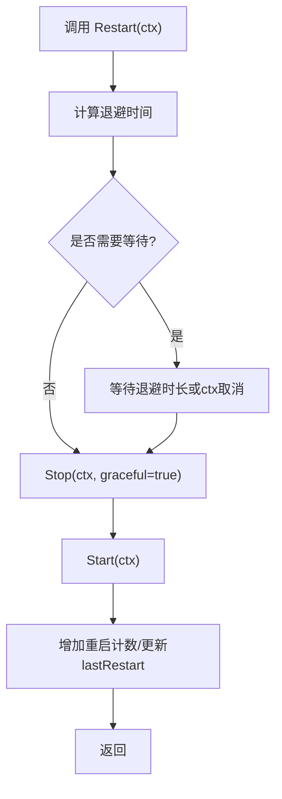
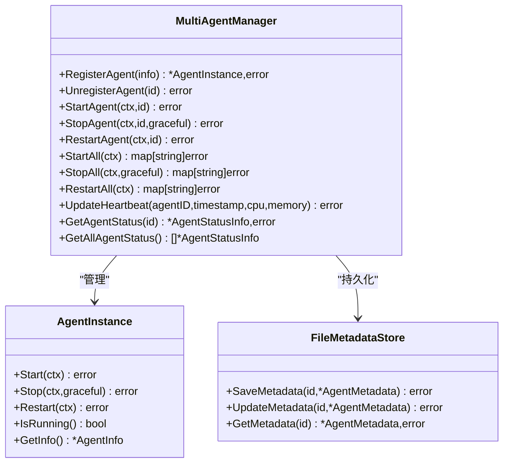
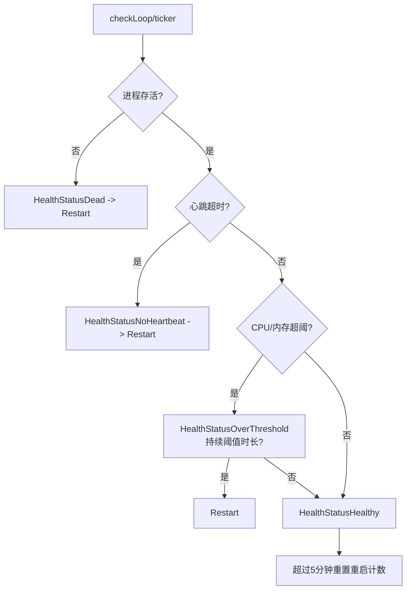
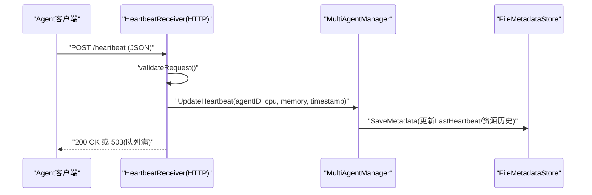
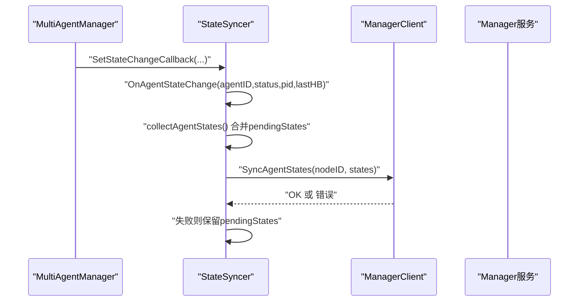
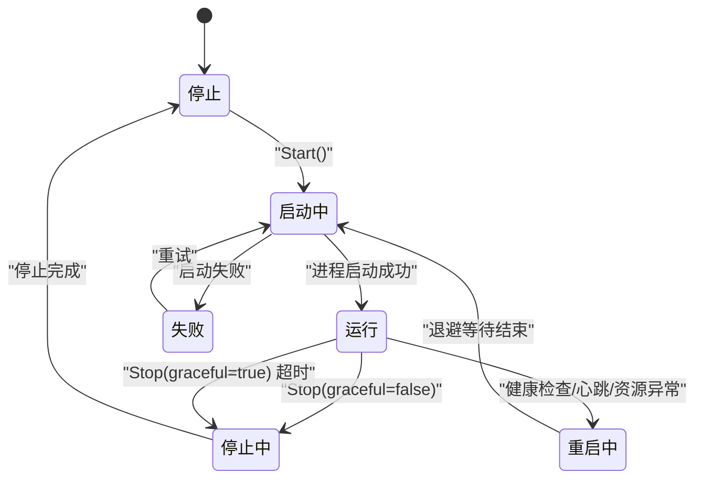
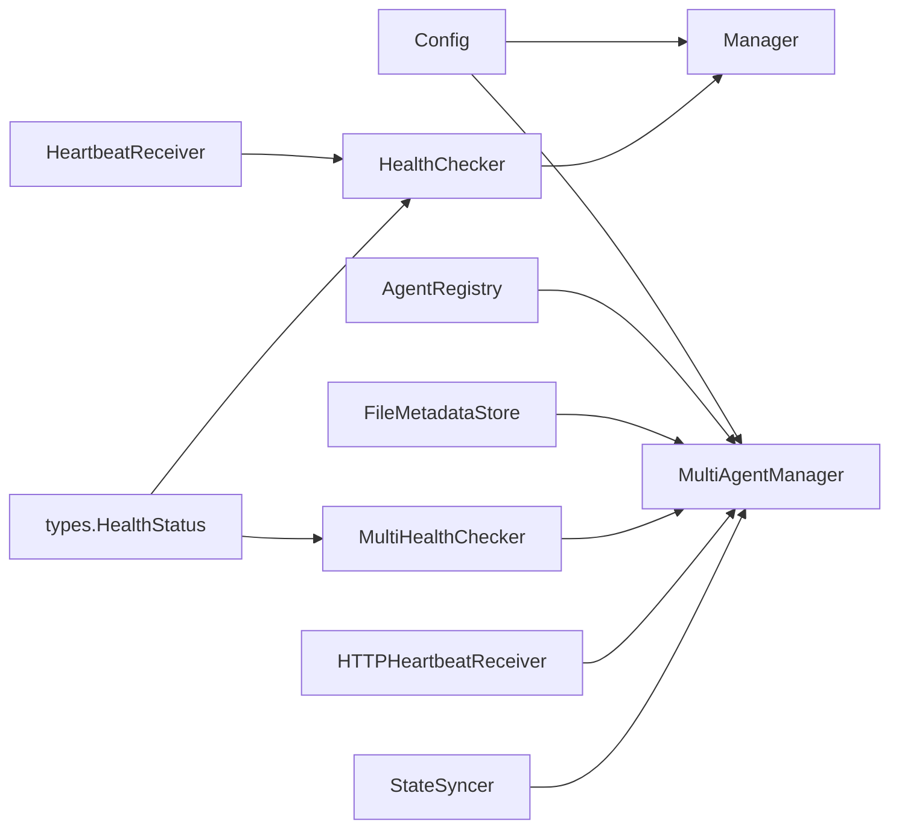

# Agent管理器

<cite>
**本文引用的文件**
- [manager.go](file://daemon/internal/agent/manager.go)
- [health.go](file://daemon/internal/agent/health.go)
- [heartbeat.go](file://daemon/internal/agent/heartbeat.go)
- [heartbeat_receiver.go](file://daemon/internal/agent/heartbeat_receiver.go)
- [multi_manager.go](file://daemon/internal/agent/multi_manager.go)
- [instance.go](file://daemon/internal/agent/instance.go)
- [multi_health_checker.go](file://daemon/internal/agent/multi_health_checker.go)
- [resource_monitor.go](file://daemon/internal/agent/resource_monitor.go)
- [registry.go](file://daemon/internal/agent/registry.go)
- [metadata_store.go](file://daemon/internal/agent/metadata_store.go)
- [state_syncer.go](file://daemon/internal/agent/state_syncer.go)
- [types.go](file://daemon/pkg/types/types.go)
- [config.go](file://daemon/internal/config/config.go)
</cite>

## 目录
1. [简介](#简介)
2. [项目结构](#项目结构)
3. [核心组件](#核心组件)
4. [架构总览](#架构总览)
5. [详细组件分析](#详细组件分析)
6. [依赖关系分析](#依赖关系分析)
7. [性能考量](#性能考量)
8. [故障排查指南](#故障排查指南)
9. [结论](#结论)
10. [附录](#附录)

## 简介
本文件面向Daemon Agent管理器的技术文档，聚焦于Agent进程的全生命周期管理。内容涵盖：
- Manager与MultiAgentManager的设计与职责边界，以及对旧版Agent配置与新版多Agent架构的兼容策略
- Agent的启动、停止、重启流程，包括进程分离、信号处理、优雅关闭与退避重启策略
- 健康检查器（HealthChecker与MultiHealthChecker）工作机制，基于心跳超时、进程状态与资源占用（CPU、内存）判定健康状态并自动重启
- 心跳接收器（HeartbeatReceiver与HTTPHeartbeatReceiver）如何通过Unix Socket或HTTP接收Agent心跳上报，并更新元数据
- 结合代码片段路径定位关键实现，提供状态转换图与故障排查建议

## 项目结构
Daemon模块下的agent子包围绕“进程管理、健康检查、心跳上报、元数据存储、状态同步”五大维度构建，形成完整的Agent生命周期闭环。

图表来源
- [manager.go](file://daemon/internal/agent/manager.go#L1-L234)
- [instance.go](file://daemon/internal/agent/instance.go#L1-L411)
- [multi_manager.go](file://daemon/internal/agent/multi_manager.go#L1-L529)
- [health.go](file://daemon/internal/agent/health.go#L1-L197)
- [multi_health_checker.go](file://daemon/internal/agent/multi_health_checker.go#L1-L490)
- [resource_monitor.go](file://daemon/internal/agent/resource_monitor.go#L1-L567)
- [heartbeat.go](file://daemon/internal/agent/heartbeat.go#L1-L122)
- [heartbeat_receiver.go](file://daemon/internal/agent/heartbeat_receiver.go#L1-L397)
- [state_syncer.go](file://daemon/internal/agent/state_syncer.go#L1-L282)
- [registry.go](file://daemon/internal/agent/registry.go#L1-L314)
- [metadata_store.go](file://daemon/internal/agent/metadata_store.go#L1-L384)
- [config.go](file://daemon/internal/config/config.go#L1-L499)
- [types.go](file://daemon/pkg/types/types.go#L1-L111)

章节来源
- [manager.go](file://daemon/internal/agent/manager.go#L1-L234)
- [multi_manager.go](file://daemon/internal/agent/multi_manager.go#L1-L529)
- [health.go](file://daemon/internal/agent/health.go#L1-L197)
- [multi_health_checker.go](file://daemon/internal/agent/multi_health_checker.go#L1-L490)
- [resource_monitor.go](file://daemon/internal/agent/resource_monitor.go#L1-L567)
- [heartbeat.go](file://daemon/internal/agent/heartbeat.go#L1-L122)
- [heartbeat_receiver.go](file://daemon/internal/agent/heartbeat_receiver.go#L1-L397)
- [state_syncer.go](file://daemon/internal/agent/state_syncer.go#L1-L282)
- [registry.go](file://daemon/internal/agent/registry.go#L1-L314)
- [metadata_store.go](file://daemon/internal/agent/metadata_store.go#L1-L384)
- [config.go](file://daemon/internal/config/config.go#L1-L499)
- [types.go](file://daemon/pkg/types/types.go#L1-L111)

## 核心组件
- Manager：单Agent进程管理器，负责启动、停止、重启、状态查询与退避策略
- AgentInstance：单Agent实例管理器，封装AgentInfo，提供更细粒度的状态与日志轮转能力
- MultiAgentManager：多Agent管理器，统一注册、启动、停止、重启、状态查询与元数据更新
- HealthChecker：单Agent健康检查器，周期性检查进程存活、心跳超时与资源阈值
- MultiHealthChecker：多Agent健康检查器，为每个Agent独立goroutine执行健康检查
- ResourceMonitor：资源监控器，定期采集CPU/内存/IO等指标并写入元数据
- HeartbeatReceiver：Unix Socket心跳接收器，将心跳转发给HealthChecker
- HTTPHeartbeatReceiver：HTTP心跳接收器，校验请求、并发处理、更新元数据
- StateSyncer：状态同步器，周期性向Manager上报Agent状态
- AgentRegistry：Agent注册表，提供并发安全的注册、查询、列举
- FileMetadataStore：文件型元数据存储，持久化Agent状态、心跳、资源历史
- Config：配置加载与合并，兼容旧版Agent配置与新版多Agent配置

章节来源
- [manager.go](file://daemon/internal/agent/manager.go#L1-L234)
- [instance.go](file://daemon/internal/agent/instance.go#L1-L411)
- [multi_manager.go](file://daemon/internal/agent/multi_manager.go#L1-L529)
- [health.go](file://daemon/internal/agent/health.go#L1-L197)
- [multi_health_checker.go](file://daemon/internal/agent/multi_health_checker.go#L1-L490)
- [resource_monitor.go](file://daemon/internal/agent/resource_monitor.go#L1-L567)
- [heartbeat.go](file://daemon/internal/agent/heartbeat.go#L1-L122)
- [heartbeat_receiver.go](file://daemon/internal/agent/heartbeat_receiver.go#L1-L397)
- [state_syncer.go](file://daemon/internal/agent/state_syncer.go#L1-L282)
- [registry.go](file://daemon/internal/agent/registry.go#L1-L314)
- [metadata_store.go](file://daemon/internal/agent/metadata_store.go#L1-L384)
- [config.go](file://daemon/internal/config/config.go#L1-L499)

## 架构总览
Daemon Agent管理器采用“分层+解耦”的架构：
- 进程管理层：Manager/AgentInstance负责进程生命周期
- 健康检查层：HealthChecker/MultiHealthChecker负责健康判定
- 心跳与上报层：HeartbeatReceiver/HTTPHeartbeatReceiver负责心跳接入，StateSyncer负责状态上报
- 数据与配置层：Registry/MetadataStore/Config负责数据持久化与配置合并
- 多Agent扩展：MultiAgentManager统一编排，支持批量操作与状态聚合

图表来源
- [heartbeat_receiver.go](file://daemon/internal/agent/heartbeat_receiver.go#L116-L174)
- [multi_manager.go](file://daemon/internal/agent/multi_manager.go#L486-L523)
- [health.go](file://daemon/internal/agent/health.go#L67-L132)
- [resource_monitor.go](file://daemon/internal/agent/resource_monitor.go#L406-L441)
- [metadata_store.go](file://daemon/internal/agent/metadata_store.go#L181-L224)

## 详细组件分析

### Manager与AgentInstance：进程生命周期管理
- 启动（Start）：创建进程组、重定向标准输出至日志文件、后台等待退出并更新状态
- 停止（Stop）：支持优雅关闭（SIGTERM + 等待）与强制关闭（SIGKILL），并清理状态
- 重启（Restart）：根据退避策略等待后先Stop再Start，更新重启计数与时间
- 退避策略：按重启次数分段递增，超过一定时间重置计数；支持上下文取消

图表来源
- [manager.go](file://daemon/internal/agent/manager.go#L139-L175)
- [manager.go](file://daemon/internal/agent/manager.go#L215-L234)

章节来源
- [manager.go](file://daemon/internal/agent/manager.go#L35-L175)
- [instance.go](file://daemon/internal/agent/instance.go#L48-L155)
- [instance.go](file://daemon/internal/agent/instance.go#L187-L248)
- [instance.go](file://daemon/internal/agent/instance.go#L250-L300)

### MultiAgentManager：多Agent编排与状态同步
- 注册/注销Agent、列举、批量操作（StartAll/StopAll/RestartAll）
- 与元数据存储交互，启动/停止/重启后更新状态、启动时间、重启计数
- 提供HTTP心跳接收器，将心跳转换为元数据更新
- 提供状态变化回调，配合StateSyncer上报Manager

图表来源
- [multi_manager.go](file://daemon/internal/agent/multi_manager.go#L61-L115)
- [multi_manager.go](file://daemon/internal/agent/multi_manager.go#L135-L197)
- [multi_manager.go](file://daemon/internal/agent/multi_manager.go#L199-L233)
- [multi_manager.go](file://daemon/internal/agent/multi_manager.go#L235-L275)
- [multi_manager.go](file://daemon/internal/agent/multi_manager.go#L277-L390)
- [multi_manager.go](file://daemon/internal/agent/multi_manager.go#L425-L471)
- [multi_manager.go](file://daemon/internal/agent/multi_manager.go#L486-L529)
- [metadata_store.go](file://daemon/internal/agent/metadata_store.go#L133-L149)

章节来源
- [multi_manager.go](file://daemon/internal/agent/multi_manager.go#L1-L529)
- [metadata_store.go](file://daemon/internal/agent/metadata_store.go#L1-L384)

### 健康检查器：HealthChecker与MultiHealthChecker
- HealthChecker（单Agent）：周期性检查进程存活、心跳超时、CPU/内存阈值，超限时触发重启；健康恢复时重置重启计数
- MultiHealthChecker（多Agent）：为每个Agent独立goroutine执行检查，支持按Agent配置差异化阈值；节点级HTTP端点检查策略

图表来源
- [health.go](file://daemon/internal/agent/health.go#L67-L132)
- [health.go](file://daemon/internal/agent/health.go#L146-L189)
- [multi_health_checker.go](file://daemon/internal/agent/multi_health_checker.go#L191-L279)
- [multi_health_checker.go](file://daemon/internal/agent/multi_health_checker.go#L282-L312)

章节来源
- [health.go](file://daemon/internal/agent/health.go#L1-L197)
- [multi_health_checker.go](file://daemon/internal/agent/multi_health_checker.go#L1-L490)
- [types.go](file://daemon/pkg/types/types.go#L82-L111)

### 心跳接收器：Unix Socket与HTTP
- Unix Socket：创建监听、接受连接、解码心跳、转发给HealthChecker
- HTTP：校验请求、并发工作池处理、更新元数据、统计信息查询

图表来源
- [heartbeat_receiver.go](file://daemon/internal/agent/heartbeat_receiver.go#L116-L174)
- [heartbeat_receiver.go](file://daemon/internal/agent/heartbeat_receiver.go#L236-L309)
- [multi_manager.go](file://daemon/internal/agent/multi_manager.go#L486-L523)
- [metadata_store.go](file://daemon/internal/agent/metadata_store.go#L181-L224)

章节来源
- [heartbeat.go](file://daemon/internal/agent/heartbeat.go#L1-L122)
- [heartbeat_receiver.go](file://daemon/internal/agent/heartbeat_receiver.go#L1-L397)
- [multi_manager.go](file://daemon/internal/agent/multi_manager.go#L486-L529)

### 元数据与状态同步
- FileMetadataStore：原子写入、并发安全、支持增量更新与历史记录
- StateSyncer：周期收集Agent状态并上报Manager，失败重试并保留待同步状态

图表来源
- [state_syncer.go](file://daemon/internal/agent/state_syncer.go#L93-L113)
- [state_syncer.go](file://daemon/internal/agent/state_syncer.go#L115-L186)
- [state_syncer.go](file://daemon/internal/agent/state_syncer.go#L188-L224)
- [state_syncer.go](file://daemon/internal/agent/state_syncer.go#L226-L282)

章节来源
- [metadata_store.go](file://daemon/internal/agent/metadata_store.go#L133-L384)
- [state_syncer.go](file://daemon/internal/agent/state_syncer.go#L1-L282)

### Agent状态转换图
Agent在运行、停止、重启中三态之间转换，受健康检查与用户操作驱动。

图表来源
- [instance.go](file://daemon/internal/agent/instance.go#L48-L155)
- [instance.go](file://daemon/internal/agent/instance.go#L187-L248)
- [instance.go](file://daemon/internal/agent/instance.go#L250-L300)
- [health.go](file://daemon/internal/agent/health.go#L67-L132)

## 依赖关系分析
- Manager/AgentInstance依赖配置与日志；MultiAgentManager依赖Registry与MetadataStore
- HealthChecker/MultiHealthChecker依赖types.HealthStatus与gopsutil进程信息
- HeartbeatReceiver依赖Unix Socket；HTTPHeartbeatReceiver依赖HTTP与工作池
- StateSyncer依赖Manager gRPC客户端接口

图表来源
- [config.go](file://daemon/internal/config/config.go#L1-L499)
- [manager.go](file://daemon/internal/agent/manager.go#L1-L234)
- [multi_manager.go](file://daemon/internal/agent/multi_manager.go#L1-L529)
- [registry.go](file://daemon/internal/agent/registry.go#L1-L314)
- [metadata_store.go](file://daemon/internal/agent/metadata_store.go#L1-L384)
- [health.go](file://daemon/internal/agent/health.go#L1-L197)
- [multi_health_checker.go](file://daemon/internal/agent/multi_health_checker.go#L1-L490)
- [heartbeat.go](file://daemon/internal/agent/heartbeat.go#L1-L122)
- [heartbeat_receiver.go](file://daemon/internal/agent/heartbeat_receiver.go#L1-L397)
- [state_syncer.go](file://daemon/internal/agent/state_syncer.go#L1-L282)
- [types.go](file://daemon/pkg/types/types.go#L82-L111)

章节来源
- [config.go](file://daemon/internal/config/config.go#L1-L499)
- [registry.go](file://daemon/internal/agent/registry.go#L1-L314)
- [metadata_store.go](file://daemon/internal/agent/metadata_store.go#L1-L384)
- [types.go](file://daemon/pkg/types/types.go#L1-L111)

## 性能考量
- 并发与锁：MultiAgentManager与Registry使用读写锁，降低高并发场景下的竞争
- 通道与工作池：HTTPHeartbeatReceiver使用固定容量通道与工作池，避免阻塞与内存膨胀
- 退避策略：指数/分段退避减少抖动，避免雪崩效应
- 资源采集：ResourceMonitor按间隔采集，避免高频IO；历史记录上限控制内存占用
- 日志轮转：AgentInstance支持定期轮转检查，避免单文件过大

[本节为通用指导，无需具体文件引用]

## 故障排查指南
- Agent无法启动
  - 检查二进制路径与权限、工作目录、日志文件创建权限
  - 查看启动参数生成逻辑与配置文件路径
  - 参考路径：[manager.go](file://daemon/internal/agent/manager.go#L47-L110)、[instance.go](file://daemon/internal/agent/instance.go#L66-L121)
- 健康检查误报
  - 调整心跳超时、CPU/内存阈值与阈值持续时长
  - 检查gopsutil获取进程信息是否成功
  - 参考路径：[health.go](file://daemon/internal/agent/health.go#L146-L189)、[multi_health_checker.go](file://daemon/internal/agent/multi_health_checker.go#L282-L312)
- 心跳接收失败
  - Unix Socket：确认socket路径、监听创建与Accept循环
  - HTTP：检查POST请求格式、AgentID校验、工作池容量与错误响应
  - 参考路径：[heartbeat.go](file://daemon/internal/agent/heartbeat.go#L38-L73)、[heartbeat_receiver.go](file://daemon/internal/agent/heartbeat_receiver.go#L116-L174)
- 状态同步失败
  - 检查Manager gRPC客户端是否设置、超时与重试策略
  - 参考路径：[state_syncer.go](file://daemon/internal/agent/state_syncer.go#L188-L224)
- 元数据异常
  - 检查原子写入流程、文件存在性与解析错误
  - 参考路径：[metadata_store.go](file://daemon/internal/agent/metadata_store.go#L181-L224)

章节来源
- [manager.go](file://daemon/internal/agent/manager.go#L47-L110)
- [instance.go](file://daemon/internal/agent/instance.go#L66-L121)
- [health.go](file://daemon/internal/agent/health.go#L146-L189)
- [multi_health_checker.go](file://daemon/internal/agent/multi_health_checker.go#L282-L312)
- [heartbeat.go](file://daemon/internal/agent/heartbeat.go#L38-L73)
- [heartbeat_receiver.go](file://daemon/internal/agent/heartbeat_receiver.go#L116-L174)
- [state_syncer.go](file://daemon/internal/agent/state_syncer.go#L188-L224)
- [metadata_store.go](file://daemon/internal/agent/metadata_store.go#L181-L224)

## 结论
该Agent管理器通过清晰的分层与解耦设计，实现了对单Agent与多Agent的统一管理。健康检查与心跳上报机制保证了可观测性与自愈能力；元数据存储与状态同步确保了运维侧的可见性与一致性。退避重启策略与资源监控进一步提升了系统的稳定性与可维护性。

[本节为总结，无需具体文件引用]

## 附录
- 关键实现路径参考
  - Manager.Start：[manager.go](file://daemon/internal/agent/manager.go#L35-L90)
  - Manager.Restart：[manager.go](file://daemon/internal/agent/manager.go#L139-L175)
  - HealthChecker.checkHealth：[health.go](file://daemon/internal/agent/health.go#L146-L189)
  - HTTPHeartbeatReceiver.HandleHeartbeat：[heartbeat_receiver.go](file://daemon/internal/agent/heartbeat_receiver.go#L116-L174)
  - MultiAgentManager.UpdateHeartbeat：[multi_manager.go](file://daemon/internal/agent/multi_manager.go#L486-L523)

[本节为补充说明，无需具体文件引用]