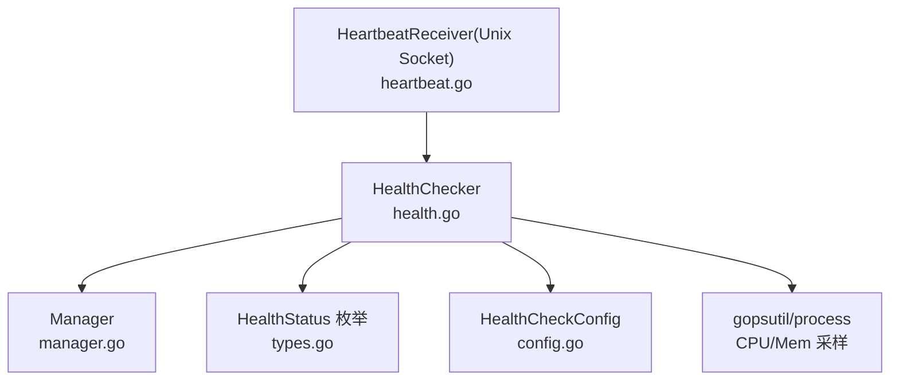
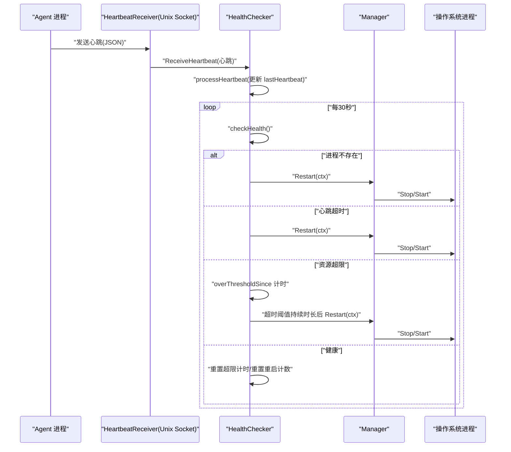
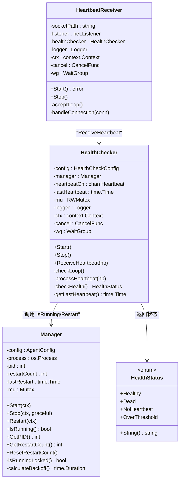

# 健康检查

<cite>
**本文引用的文件列表**
- [health.go](file://daemon/internal/agent/health.go)
- [types.go](file://daemon/pkg/types/types.go)
- [heartbeat.go](file://daemon/internal/agent/heartbeat.go)
- [manager.go](file://daemon/internal/agent/manager.go)
- [config.go](file://daemon/internal/config/config.go)
- [multi_health_checker.go](file://daemon/internal/agent/multi_health_checker.go)
</cite>

## 目录
1. [简介](#简介)
2. [项目结构](#项目结构)
3. [核心组件](#核心组件)
4. [架构总览](#架构总览)
5. [详细组件分析](#详细组件分析)
6. [依赖关系分析](#依赖关系分析)
7. [性能考量](#性能考量)
8. [故障排查指南](#故障排查指南)
9. [结论](#结论)

## 简介
本技术文档围绕 Daemon Agent 的健康检查机制展开，重点解析 HealthChecker 组件如何通过“进程存在性检查 + 心跳超时检查 + 资源占用检查”的三段式判定，确保 Agent 进程的高可用性。文档详细说明：
- HealthChecker 的 checkLoop 如何以默认 30 秒的 ticker 触发周期性检查；
- checkHealth 的三重判断逻辑与阈值配置；
- 当检测到资源超限（HealthStatusOverThreshold）时，通过 overThresholdSince 实现持续超限判断，避免瞬时峰值误重启；
- 健康状态枚举（types.HealthStatus）及不同状态下的处理流程（如 HealthStatusDead 时自动调用 manager.Restart）；
- 健康检查器与心跳接收器的协作关系；
- 故障排查建议（阈值配置、gopsutil 兼容性、心跳接收失败导致的假死判断）。

## 项目结构
与健康检查直接相关的模块位于 daemon/internal/agent 目录，关键文件如下：
- health.go：HealthChecker 结构体与检查逻辑
- heartbeat.go：心跳接收器（Unix Socket）与 HealthChecker 的对接
- manager.go：Agent 进程管理器，提供 IsRunning、Restart 等能力
- types.go：健康状态枚举 HealthStatus 定义
- config.go：HealthCheckConfig 配置项（含默认值）
- multi_health_checker.go：多 Agent 场景的健康检查器（作为对比参考）

图表来源
- [health.go](file://daemon/internal/agent/health.go#L1-L197)
- [manager.go](file://daemon/internal/agent/manager.go#L1-L234)
- [types.go](file://daemon/pkg/types/types.go#L82-L111)
- [config.go](file://daemon/internal/config/config.go#L60-L67)
- [heartbeat.go](file://daemon/internal/agent/heartbeat.go#L1-L122)

章节来源
- [health.go](file://daemon/internal/agent/health.go#L1-L197)
- [manager.go](file://daemon/internal/agent/manager.go#L1-L234)
- [types.go](file://daemon/pkg/types/types.go#L82-L111)
- [config.go](file://daemon/internal/config/config.go#L60-L67)
- [heartbeat.go](file://daemon/internal/agent/heartbeat.go#L1-L122)

## 核心组件
- HealthChecker：负责周期性健康检查、接收心跳、根据状态执行重启或重置逻辑
- Manager：封装 Agent 进程生命周期管理，提供 IsRunning、Restart 等接口
- HeartbeatReceiver(Unix Socket)：从 Agent 侧通过 Unix Socket 接收心跳，转发给 HealthChecker
- HealthStatus 枚举：定义健康状态常量及其字符串化
- HealthCheckConfig：健康检查配置（检查间隔、心跳超时、CPU/内存阈值、阈值持续时长）

章节来源
- [health.go](file://daemon/internal/agent/health.go#L14-L38)
- [manager.go](file://daemon/internal/agent/manager.go#L16-L33)
- [heartbeat.go](file://daemon/internal/agent/heartbeat.go#L15-L36)
- [types.go](file://daemon/pkg/types/types.go#L82-L111)
- [config.go](file://daemon/internal/config/config.go#L60-L67)

## 架构总览
HealthChecker 与 HeartbeatReceiver 的协作流程如下：
- HeartbeatReceiver 监听 Unix Socket，解码心跳包后调用 HealthChecker.ReceiveHeartbeat；
- HealthChecker 的 checkLoop 中，ticker 定期触发 checkHealth；
- checkHealth 依次进行三重判断：进程存在性、心跳超时、资源占用；
- 根据状态分支，必要时调用 Manager.Restart 实现自愈重启。

图表来源
- [heartbeat.go](file://daemon/internal/agent/heartbeat.go#L96-L122)
- [health.go](file://daemon/internal/agent/health.go#L58-L132)
- [manager.go](file://daemon/internal/agent/manager.go#L139-L175)

## 详细组件分析

### HealthChecker 结构体与生命周期
- 字段职责
  - config：健康检查配置（Interval、HeartbeatTimeout、CPUThreshold、MemoryThreshold、ThresholdDuration）
  - manager：Agent 进程管理器，用于 IsRunning、Restart
  - heartbeatCh：心跳通道，缓冲最近一次心跳
  - lastHeartbeat：最近一次心跳时间（带互斥保护）
  - logger、ctx/cancel、wg：日志、上下文取消、等待组
- 生命周期
  - Start：启动 checkLoop 协程
  - Stop：取消上下文、等待协程结束、关闭心跳通道
  - ReceiveHeartbeat：将心跳写入通道（默认容量 10），满时丢弃并记录警告
  - processHeartbeat：更新 lastHeartbeat

章节来源
- [health.go](file://daemon/internal/agent/health.go#L14-L57)
- [health.go](file://daemon/internal/agent/health.go#L58-L66)
- [health.go](file://daemon/internal/agent/health.go#L134-L144)

### checkLoop 与定时器
- 使用 time.NewTicker(h.config.Interval) 触发检查循环，默认 30 秒
- 主循环同时监听：
  - ctx.Done：优雅退出
  - heartbeatCh：收到心跳即更新 lastHeartbeat
  - ticker.C：周期性执行 checkHealth 并按状态分支处理
- overThresholdSince：用于持续超限判断，避免瞬时峰值误重启

章节来源
- [health.go](file://daemon/internal/agent/health.go#L67-L132)

### checkHealth 三重判断逻辑
- 进程存在性检查
  - 通过 manager.IsRunning 判断进程是否存活
  - 若不存在，直接返回 HealthStatusDead
- 心跳超时检查
  - 读取 lastHeartbeat，若距离当前时间超过 HeartbeatTimeout，则返回 HealthStatusNoHeartbeat
- 资源占用检查
  - 通过 gopsutil/process 获取 CPU 百分比与内存 RSS
  - 若 CPUPercent > CPUThreshold 或 RSS > MemoryThreshold，则返回 HealthStatusOverThreshold
  - 该阶段会记录 CPU/Memory 采样与阈值日志

章节来源
- [health.go](file://daemon/internal/agent/health.go#L146-L189)
- [manager.go](file://daemon/internal/agent/manager.go#L177-L192)

### 状态分支与自愈重启
- HealthStatusDead
  - 记录警告日志，调用 manager.Restart(ctx)
- HealthStatusNoHeartbeat
  - 记录警告日志（包含 last_heartbeat），调用 manager.Restart(ctx)
- HealthStatusOverThreshold
  - 首次进入超限时记录“since”时间戳
  - 若持续时间超过 ThresholdDuration，则记录超时日志并调用 manager.Restart(ctx)，随后重置计时
- HealthStatusHealthy
  - 若之前处于超限，记录恢复正常并重置计时
  - 若距离上次重启超过 5 分钟且重启计数大于 0，则重置重启计数

章节来源
- [health.go](file://daemon/internal/agent/health.go#L84-L132)
- [manager.go](file://daemon/internal/agent/manager.go#L139-L175)

### 健康状态枚举与字符串化
- HealthStatusHealthy、HealthStatusDead、HealthStatusNoHeartbeat、HealthStatusOverThreshold
- String 方法便于日志输出与对外展示

章节来源
- [types.go](file://daemon/pkg/types/types.go#L82-L111)

### 与心跳接收器的协作
- HeartbeatReceiver 通过 Unix Socket 监听 Agent 心跳，解码后调用 HealthChecker.ReceiveHeartbeat
- HealthChecker 在 checkLoop 中优先处理 heartbeatCh，确保心跳能及时更新 lastHeartbeat
- 若心跳通道满，记录警告并丢弃心跳，避免阻塞接收器

章节来源
- [heartbeat.go](file://daemon/internal/agent/heartbeat.go#L96-L122)
- [health.go](file://daemon/internal/agent/health.go#L58-L66)

### 多 Agent 场景对比（参考）
- MultiHealthChecker 为多 Agent 提供独立 goroutine 的健康检查，结构与单 Agent 类似
- 两者共同点：均使用 ticker、均基于进程存在性、心跳超时、资源阈值进行判断
- 差异点：MultiHealthChecker 支持按 Agent 类型选择检查策略（如 HTTP 端点），并维护每个 Agent 的健康状态快照

章节来源
- [multi_health_checker.go](file://daemon/internal/agent/multi_health_checker.go#L191-L279)
- [multi_health_checker.go](file://daemon/internal/agent/multi_health_checker.go#L282-L390)

## 依赖关系分析
- HealthChecker 依赖
  - Manager：进程存在性判断、重启能力
  - gopsutil/process：CPU/Memory 采样
  - types.HealthStatus：状态枚举
  - config.HealthCheckConfig：检查参数
  - HeartbeatReceiver：心跳输入通道
- Manager 依赖
  - os/exec、syscall：进程启动/停止/信号
  - 退避策略与重启计数：控制重启频率与告警

图表来源
- [health.go](file://daemon/internal/agent/health.go#L14-L197)
- [manager.go](file://daemon/internal/agent/manager.go#L16-L234)
- [heartbeat.go](file://daemon/internal/agent/heartbeat.go#L15-L122)
- [types.go](file://daemon/pkg/types/types.go#L82-L111)

## 性能考量
- 检查频率与开销
  - 默认 30 秒一次，对 CPU/Memory 采样成本较低，适合生产环境
  - 心跳通道容量 10，避免高频心跳导致阻塞
- 资源采样
  - gopsutil/process 采样为 O(1) 系统调用，建议在高并发场景下避免过度频繁的检查
- 重启退避
  - Manager 的 calculateBackoff 采用指数退避，防止雪崩式重启

章节来源
- [health.go](file://daemon/internal/agent/health.go#L67-L132)
- [manager.go](file://daemon/internal/agent/manager.go#L215-L234)

## 故障排查指南

### 健康检查误报
- 检查阈值配置
  - Interval、HeartbeatTimeout、CPUThreshold、MemoryThreshold、ThresholdDuration
  - 默认值可在配置加载时查看，必要时调整以适配业务负载
- gopsutil 兼容性
  - 确认运行环境支持进程采样（权限、内核版本、容器隔离）
  - 若 CPU/Memory 采样失败，HealthChecker 会记录警告并可能将状态视为 Dead，需检查系统库与权限
- 心跳通道满
  - 若心跳通道满，接收器会丢弃心跳并记录警告，检查 Agent 心跳发送频率与网络延迟

章节来源
- [config.go](file://daemon/internal/config/config.go#L222-L238)
- [health.go](file://daemon/internal/agent/health.go#L146-L189)
- [heartbeat.go](file://daemon/internal/agent/heartbeat.go#L116-L122)

### 心跳接收失败导致的假死判断
- 现象
  - HealthChecker 返回 HealthStatusNoHeartbeat 并触发重启
- 排查步骤
  - 确认 HeartbeatReceiver 正常启动且 Unix Socket 文件存在
  - 检查 Agent 是否正确连接并发送心跳
  - 查看 HealthChecker 的 lastHeartbeat 是否被更新
  - 若长时间无心跳，确认 HeartbeatTimeout 配置是否过短
- 修复建议
  - 调整 HeartbeatTimeout 至更宽松值
  - 优化 Agent 心跳发送频率与网络质量
  - 在多 Agent 场景下，使用 MultiHealthChecker 并按 Agent 类型选择合适检查策略

章节来源
- [heartbeat.go](file://daemon/internal/agent/heartbeat.go#L38-L73)
- [health.go](file://daemon/internal/agent/health.go#L134-L144)
- [multi_health_checker.go](file://daemon/internal/agent/multi_health_checker.go#L191-L279)

## 结论
HealthChecker 通过“进程存在性 + 心跳超时 + 资源阈值”的三段式健康检查，结合 overThresholdSince 的持续超限判断与 Manager 的退避重启策略，有效保障了 Agent 进程的高可用性。配合 HeartbeatReceiver 的心跳接收，形成闭环的健康监控与自愈机制。在生产环境中，建议根据业务负载合理配置阈值与检查间隔，并关注 gopsutil 的兼容性与心跳通道的稳定性，以降低误报与不必要的重启。