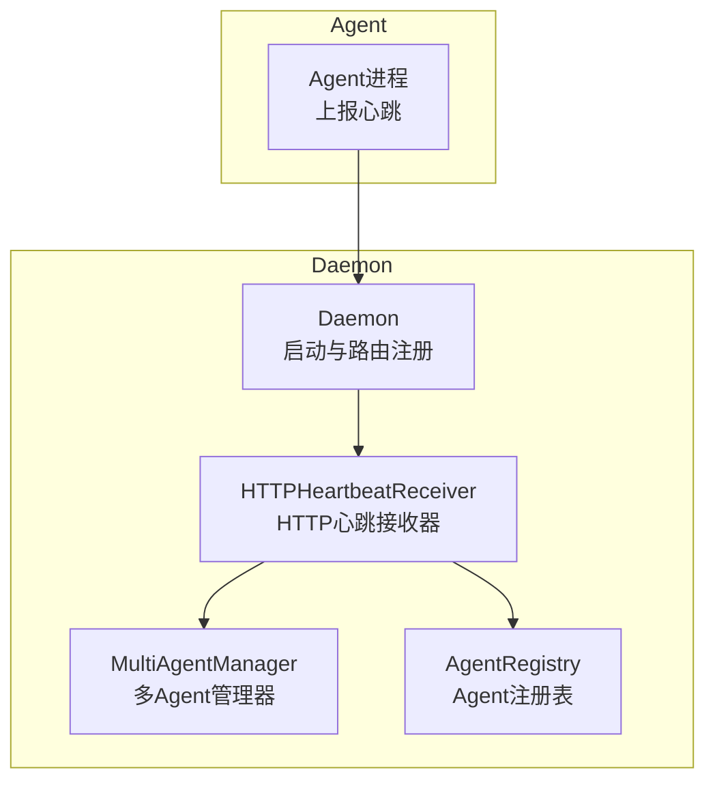
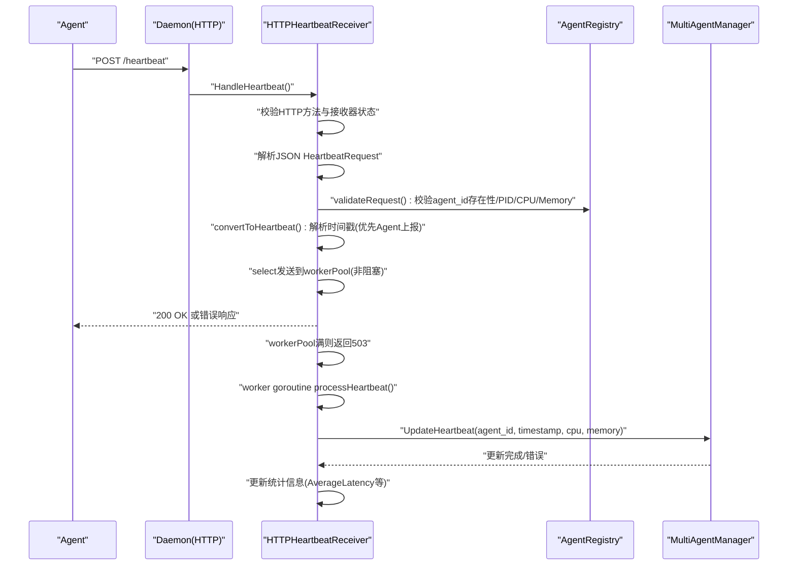
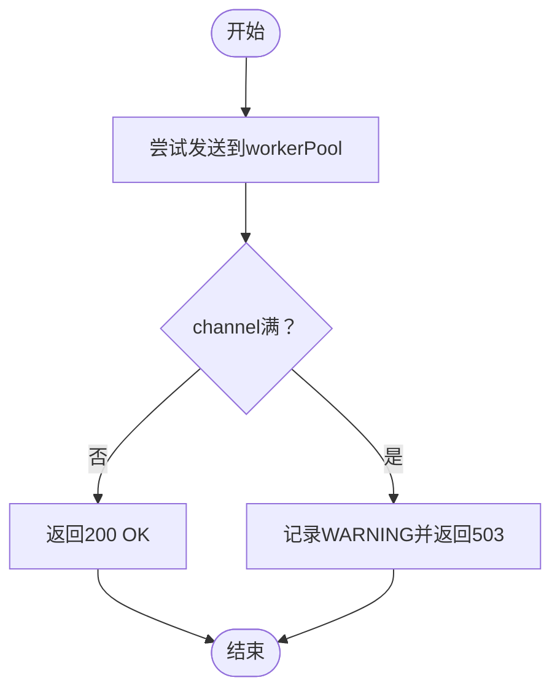

# 心跳接收

<cite>
**本文引用的文件列表**
- [daemon/internal/agent/heartbeat_receiver.go](file://daemon/internal/agent/heartbeat_receiver.go)
- [daemon/internal/agent/multi_manager.go](file://daemon/internal/agent/multi_manager.go)
- [daemon/internal/agent/registry.go](file://daemon/internal/agent/registry.go)
- [daemon/internal/daemon/daemon.go](file://daemon/internal/daemon/daemon.go)
- [daemon/internal/agent/heartbeat.go](file://daemon/internal/agent/heartbeat.go)
- [daemon/internal/agent/heartbeat_receiver_test.go](file://daemon/internal/agent/heartbeat_receiver_test.go)
</cite>

## 目录
1. [简介](#简介)
2. [项目结构](#项目结构)
3. [核心组件](#核心组件)
4. [架构总览](#架构总览)
5. [详细组件分析](#详细组件分析)
6. [依赖关系分析](#依赖关系分析)
7. [性能考量](#性能考量)
8. [故障排查指南](#故障排查指南)
9. [结论](#结论)

## 简介
本文件面向Daemon侧“HTTP心跳接收”能力，聚焦于HTTPHeartbeatReceiver如何接收并处理来自Agent的心跳上报。内容覆盖：
- HTTPHeartbeatReceiver结构体设计与职责
- HandleHeartbeat()如何作为HTTP处理器接收POST请求
- 请求处理流程：方法校验、接收器状态、JSON解析、validateRequest()数据校验、转换为内部Heartbeat、并发处理模型（workerPool与startWorkers()）、processHeartbeat()调用multiManager.UpdateHeartbeat()更新元数据
- convertToHeartbeat()中时间戳解析逻辑（优先使用Agent上报时间，失败则回退服务器时间）
- GetStats()与HandleStats()提供的监控统计能力
- 故障排查：心跳接收失败、工作池满（worker pool is full）等问题的诊断步骤

## 项目结构
与心跳接收直接相关的模块位于daemon/internal/agent目录，Daemon在启动时根据配置决定是否启用HTTP心跳接收，并注册路由到HTTP服务器。



图表来源
- [daemon/internal/daemon/daemon.go](file://daemon/internal/daemon/daemon.go#L630-L666)
- [daemon/internal/agent/heartbeat_receiver.go](file://daemon/internal/agent/heartbeat_receiver.go#L116-L174)
- [daemon/internal/agent/multi_manager.go](file://daemon/internal/agent/multi_manager.go#L485-L523)
- [daemon/internal/agent/registry.go](file://daemon/internal/agent/registry.go#L280-L314)

章节来源
- [daemon/internal/daemon/daemon.go](file://daemon/internal/daemon/daemon.go#L289-L309)
- [daemon/internal/daemon/daemon.go](file://daemon/internal/daemon/daemon.go#L630-L666)

## 核心组件
- HTTPHeartbeatReceiver：负责接收HTTP心跳请求、并发处理、统计与优雅停止
- MultiAgentManager：持有元数据存储，负责UpdateHeartbeat()更新心跳与资源使用历史
- AgentRegistry：提供agent_id存在性校验
- Daemon：在启动时创建HTTP服务器并注册/启动HTTPHeartbeatReceiver

章节来源
- [daemon/internal/agent/heartbeat_receiver.go](file://daemon/internal/agent/heartbeat_receiver.go#L49-L114)
- [daemon/internal/agent/multi_manager.go](file://daemon/internal/agent/multi_manager.go#L485-L523)
- [daemon/internal/agent/registry.go](file://daemon/internal/agent/registry.go#L280-L314)
- [daemon/internal/daemon/daemon.go](file://daemon/internal/daemon/daemon.go#L120-L136)

## 架构总览
Daemon在启动时根据配置决定是否启用HTTP端口，若启用，则注册“/heartbeat”和“/heartbeat/stats”两个路由，分别由HTTPHeartbeatReceiver的HandleHeartbeat()与HandleStats()处理。请求进入后，先进行基础校验与数据校验，随后将心跳对象投递至workerPool通道，由工作协程异步处理并调用MultiAgentManager.UpdateHeartbeat()更新元数据。



图表来源
- [daemon/internal/agent/heartbeat_receiver.go](file://daemon/internal/agent/heartbeat_receiver.go#L116-L174)
- [daemon/internal/agent/heartbeat_receiver.go](file://daemon/internal/agent/heartbeat_receiver.go#L176-L204)
- [daemon/internal/agent/heartbeat_receiver.go](file://daemon/internal/agent/heartbeat_receiver.go#L206-L234)
- [daemon/internal/agent/heartbeat_receiver.go](file://daemon/internal/agent/heartbeat_receiver.go#L236-L270)
- [daemon/internal/agent/multi_manager.go](file://daemon/internal/agent/multi_manager.go#L485-L523)
- [daemon/internal/daemon/daemon.go](file://daemon/internal/daemon/daemon.go#L630-L666)

## 详细组件分析

### HTTPHeartbeatReceiver结构体与生命周期
- 字段概览
  - multiManager：多Agent管理器引用，用于更新心跳与资源使用
  - registry：Agent注册表引用，用于校验agent_id存在性
  - logger：日志器
  - workerPool：带缓冲的通道，承载待处理的心跳对象
  - workerCount：工作协程数量
  - mu：保护统计数据的并发访问
  - stats：统计信息
  - totalLatency：原子计数，累计处理延迟纳秒
  - wg：等待所有worker goroutine退出
  - stopCh：停止信号通道
  - stopped：原子标记，防止重复停止
- 初始化
  - NewHTTPHeartbeatReceiver()从配置读取workerCount（默认10），创建workerPool容量为workerCount*10，随后调用startWorkers()启动worker goroutine
- 停止
  - Stop()设置stopped标志，关闭stopCh通知worker退出，等待wg（workerPool通道不关闭，确保正在处理的心跳能完成）

章节来源
- [daemon/internal/agent/heartbeat_receiver.go](file://daemon/internal/agent/heartbeat_receiver.go#L49-L114)
- [daemon/internal/agent/heartbeat_receiver.go](file://daemon/internal/agent/heartbeat_receiver.go#L311-L331)

### HTTP处理器：HandleHeartbeat()
- 方法校验与状态检查
  - 仅允许POST方法；若接收器已停止，返回503
- JSON解析
  - 使用json.NewDecoder解码请求体为HeartbeatRequest
  - 解码失败返回400
- 数据校验：validateRequest()
  - agent_id非空且存在于注册表
  - PID > 0
  - CPU范围[0,100]
  - Memory ≥ 0
- 转换为内部Heartbeat
  - convertToHeartbeat()：若请求携带timestamp且可解析为RFC3339，则使用该时间；否则使用服务器时间
- 并发处理
  - 将Heartbeat对象非阻塞投递到workerPool
  - 若channel满，记录警告并返回503，提示稍后重试
- 统计更新
  - 接收时更新TotalReceived与LastReceivedTime

章节来源
- [daemon/internal/agent/heartbeat_receiver.go](file://daemon/internal/agent/heartbeat_receiver.go#L116-L174)
- [daemon/internal/agent/heartbeat_receiver.go](file://daemon/internal/agent/heartbeat_receiver.go#L176-L204)
- [daemon/internal/agent/heartbeat_receiver.go](file://daemon/internal/agent/heartbeat_receiver.go#L206-L234)

### 并发处理模型：workerPool与startWorkers()
- workerPool
  - 类型为chan *Heartbeat，容量为workerCount*10
  - 采用select+default实现非阻塞发送，避免阻塞HTTP请求
- startWorkers()
  - 启动workerCount个工作协程，每个协程在循环中从workerPool读取心跳对象并调用processHeartbeat()
  - 收到stopCh或workerPool关闭时退出
- Stop()
  - 关闭stopCh通知worker退出，等待wg；不关闭workerPool，保证正在处理的心跳能完成



图表来源
- [daemon/internal/agent/heartbeat_receiver.go](file://daemon/internal/agent/heartbeat_receiver.go#L157-L174)

章节来源
- [daemon/internal/agent/heartbeat_receiver.go](file://daemon/internal/agent/heartbeat_receiver.go#L272-L309)
- [daemon/internal/agent/heartbeat_receiver.go](file://daemon/internal/agent/heartbeat_receiver.go#L311-L331)

### 处理逻辑：processHeartbeat()
- 记录开始时间，调用multiManager.UpdateHeartbeat()更新元数据
- 更新TotalProcessed与AverageLatency（原子累计总延迟后按计数平均）
- 错误处理：UpdateHeartbeat失败时记录错误并增加TotalErrors

章节来源
- [daemon/internal/agent/heartbeat_receiver.go](file://daemon/internal/agent/heartbeat_receiver.go#L236-L270)
- [daemon/internal/agent/multi_manager.go](file://daemon/internal/agent/multi_manager.go#L485-L523)

### 数据校验：validateRequest()
- agent_id非空且存在于注册表
- PID > 0
- CPU ∈ [0,100]
- Memory ≥ 0

章节来源
- [daemon/internal/agent/heartbeat_receiver.go](file://daemon/internal/agent/heartbeat_receiver.go#L176-L204)
- [daemon/internal/agent/registry.go](file://daemon/internal/agent/registry.go#L280-L314)

### 时间戳解析：convertToHeartbeat()
- 优先使用请求中的timestamp（RFC3339）
- 解析失败则使用服务器时间，并记录警告

章节来源
- [daemon/internal/agent/heartbeat_receiver.go](file://daemon/internal/agent/heartbeat_receiver.go#L206-L234)

### 统计与监控：GetStats()与HandleStats()
- GetStats()
  - 返回TotalReceived、TotalProcessed、TotalErrors、LastReceivedTime、AverageLatency的副本
- HandleStats()
  - 仅允许GET方法
  - 返回当前统计信息（JSON）

章节来源
- [daemon/internal/agent/heartbeat_receiver.go](file://daemon/internal/agent/heartbeat_receiver.go#L333-L361)

### 与Daemon的集成
- Daemon在启动时根据配置创建HTTP服务器并注册路由：
  - /heartbeat -> httpHeartbeatReceiver.HandleHeartbeat
  - /heartbeat/stats -> httpHeartbeatReceiver.HandleStats
- 若未配置HTTP端口，则禁用HTTP心跳接收（仅使用Unix Socket）

章节来源
- [daemon/internal/daemon/daemon.go](file://daemon/internal/daemon/daemon.go#L289-L309)
- [daemon/internal/daemon/daemon.go](file://daemon/internal/daemon/daemon.go#L630-L666)

## 依赖关系分析
- HTTPHeartbeatReceiver依赖
  - MultiAgentManager：调用UpdateHeartbeat()更新元数据
  - AgentRegistry：validateRequest()中校验agent_id存在性
  - 日志器：记录错误、警告与调试信息
- Daemon依赖
  - 在启动时创建HTTP服务器并注册上述路由
  - 在停止时优雅关闭HTTPHeartbeatReceiver

```mermaid
classDiagram
class HTTPHeartbeatReceiver {
+HandleHeartbeat(w, r)
+HandleStats(w, r)
+GetStats() HeartbeatStats
+Stop()
-workerPool chan *Heartbeat
-workerCount int
-stats HeartbeatStats
-totalLatency atomic.Int64
-stopCh chan struct{}
-stopped atomic.Bool
}
class MultiAgentManager {
+UpdateHeartbeat(agentID, timestamp, cpu, memory) error
}
class AgentRegistry {
+Exists(id) bool
}
class Daemon {
+startHTTPServer()
}
HTTPHeartbeatReceiver --> MultiAgentManager : "更新心跳"
HTTPHeartbeatReceiver --> AgentRegistry : "校验agent_id"
Daemon --> HTTPHeartbeatReceiver : "注册路由/启动/停止"
```

图表来源
- [daemon/internal/agent/heartbeat_receiver.go](file://daemon/internal/agent/heartbeat_receiver.go#L116-L174)
- [daemon/internal/agent/multi_manager.go](file://daemon/internal/agent/multi_manager.go#L485-L523)
- [daemon/internal/agent/registry.go](file://daemon/internal/agent/registry.go#L280-L314)
- [daemon/internal/daemon/daemon.go](file://daemon/internal/daemon/daemon.go#L630-L666)

## 性能考量
- 工作池大小
  - workerPool容量为workerCount*10，有助于削峰填谷，避免HTTP请求阻塞
- 并发度
  - workerCount默认10，可根据系统负载与磁盘I/O能力调整
- 统计开销
  - AverageLatency基于原子计数累加与计数平均，开销极低
- I/O与序列化
  - JSON解析与UpdateHeartbeat涉及磁盘写入，建议关注磁盘吞吐与元数据存储实现

[本节为通用性能讨论，无需列出具体文件来源]

## 故障排查指南
- 心跳接收失败（检查Agent配置与网络连通性）
  - 确认Daemon已启用HTTP端口并正确注册路由
  - 确认Agent上报URL为“/heartbeat”，HTTP方法为POST
  - 检查网络连通性与防火墙策略
- 工作池满（worker pool is full）
  - 现象：部分请求返回503，日志出现“worker pool is full”
  - 处理：增大workerCount或提升worker处理速度；观察AverageLatency与TotalProcessed增长趋势
- 请求体格式错误
  - 现象：返回400，日志包含“invalid JSON format”
  - 处理：检查Agent上报JSON结构与字段类型
- 数据校验失败
  - 现象：返回400，日志包含“validation failed”
  - 处理：核对agent_id存在性、PID>0、CPU范围[0,100]、Memory≥0
- 时间戳解析失败
  - 现象：日志出现“failed to parse timestamp, using server time”
  - 处理：修正Agent上报的timestamp格式为RFC3339
- 统计信息查看
  - 使用“GET /heartbeat/stats”获取TotalReceived、TotalProcessed、TotalErrors、LastReceivedTime、AverageLatency

章节来源
- [daemon/internal/agent/heartbeat_receiver_test.go](file://daemon/internal/agent/heartbeat_receiver_test.go#L95-L123)
- [daemon/internal/agent/heartbeat_receiver_test.go](file://daemon/internal/agent/heartbeat_receiver_test.go#L125-L176)
- [daemon/internal/agent/heartbeat_receiver_test.go](file://daemon/internal/agent/heartbeat_receiver_test.go#L178-L220)
- [daemon/internal/agent/heartbeat_receiver_test.go](file://daemon/internal/agent/heartbeat_receiver_test.go#L222-L278)
- [daemon/internal/agent/heartbeat_receiver_test.go](file://daemon/internal/agent/heartbeat_receiver_test.go#L446-L507)
- [daemon/internal/agent/heartbeat_receiver_test.go](file://daemon/internal/agent/heartbeat_receiver_test.go#L509-L583)
- [daemon/internal/agent/heartbeat_receiver_test.go](file://daemon/internal/agent/heartbeat_receiver_test.go#L650-L721)
- [daemon/internal/agent/heartbeat_receiver_test.go](file://daemon/internal/agent/heartbeat_receiver_test.go#L723-L798)

## 结论
HTTPHeartbeatReceiver通过简洁的HTTP处理器、严格的请求校验、工作池并发模型与完善的统计机制，实现了高可用的心跳接收与处理。配合MultiAgentManager的元数据更新，形成从请求到落库的完整闭环。生产部署时建议：
- 合理设置workerCount与workerPool容量
- 监控AverageLatency与TotalErrors，及时发现处理瓶颈
- 关注Agent上报的timestamp格式与资源字段范围
- 在高并发场景下评估磁盘I/O与元数据存储性能