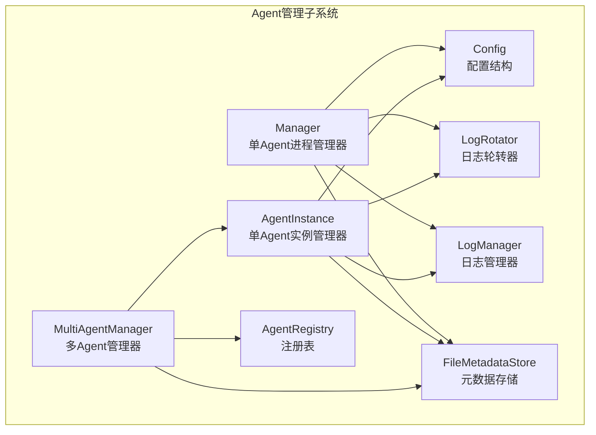
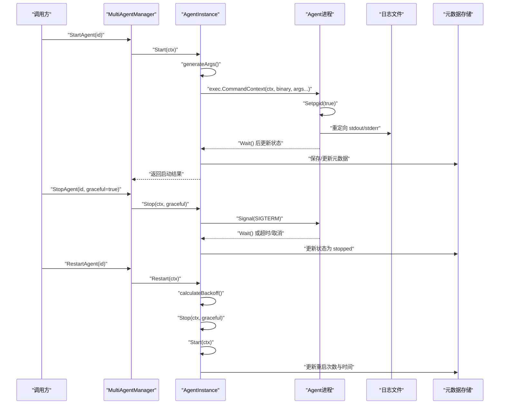
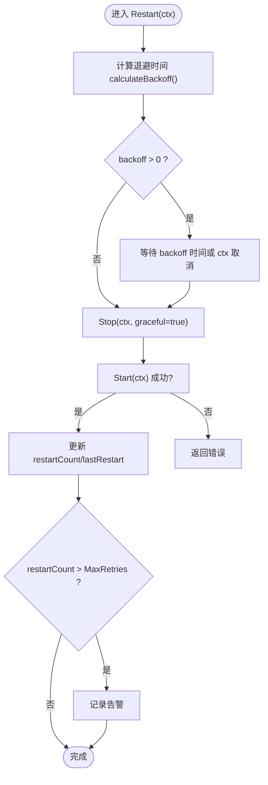
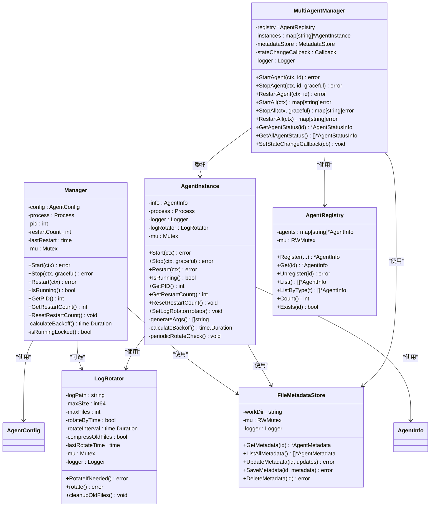
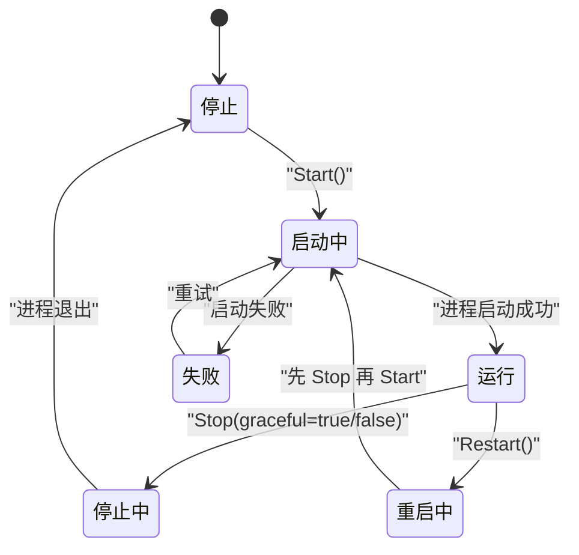

# 生命周期管理

<cite>
**本文引用的文件**
- [manager.go](file://daemon/internal/agent/manager.go)
- [multi_manager.go](file://daemon/internal/agent/multi_manager.go)
- [instance.go](file://daemon/internal/agent/instance.go)
- [log_manager.go](file://daemon/internal/agent/log_manager.go)
- [registry.go](file://daemon/internal/agent/registry.go)
- [metadata_store.go](file://daemon/internal/agent/metadata_store.go)
- [config.go](file://daemon/internal/config/config.go)
- [daemon.yaml](file://daemon/configs/daemon.yaml)
- [daemon.multi-agent.example.yaml](file://daemon/configs/daemon.multi-agent.example.yaml)
- [PHASE2_TEST_SUITE.md](file://daemon/internal/agent/PHASE2_TEST_SUITE.md)
</cite>

## 目录
1. [简介](#简介)
2. [项目结构](#项目结构)
3. [核心组件](#核心组件)
4. [架构总览](#架构总览)
5. [详细组件分析](#详细组件分析)
6. [依赖关系分析](#依赖关系分析)
7. [性能考量](#性能考量)
8. [故障排查指南](#故障排查指南)
9. [结论](#结论)
10. [附录](#附录)

## 简介
本文件围绕 Daemon Agent 的生命周期管理，聚焦于 Agent 进程的启动、停止与重启机制。重点解析 manager.go 中 Manager 结构体的设计与实现，涵盖进程分离（Setpgid）、信号处理（SIGTERM 优雅关闭与 SIGKILL 强制终止）、exec.CommandContext 的使用、启动命令构建与 stdout/stderr 重定向到日志文件、Restart() 方法中的退避重启策略（backoff strategy）及 calculateBackoff() 的动态等待时间计算逻辑，并提供 Agent 状态转换图与故障排查建议。

## 项目结构
Daemon 模块内与 Agent 生命周期管理直接相关的文件组织如下：
- agent/manager.go：单 Agent 进程管理器，提供 Start/Stop/Restart 等核心能力
- agent/instance.go：单 Agent 实例管理器（更完整的实现，含日志轮转、参数生成等）
- agent/multi_manager.go：多 Agent 管理器，封装批量操作与状态回调
- agent/log_manager.go：日志轮转与清理工具
- agent/registry.go：Agent 状态与类型常量定义
- agent/metadata_store.go：Agent 元数据持久化
- internal/config/config.go：配置结构与默认值、校验
- configs/daemon.yaml 与 configs/daemon.multi-agent.example.yaml：示例配置
- PHASE2_TEST_SUITE.md：生命周期与多组件集成测试说明

图表来源
- [manager.go](file://daemon/internal/agent/manager.go#L1-L234)
- [instance.go](file://daemon/internal/agent/instance.go#L1-L411)
- [multi_manager.go](file://daemon/internal/agent/multi_manager.go#L1-L529)
- [log_manager.go](file://daemon/internal/agent/log_manager.go#L1-L557)
- [registry.go](file://daemon/internal/agent/registry.go#L1-L314)
- [metadata_store.go](file://daemon/internal/agent/metadata_store.go#L1-L384)
- [config.go](file://daemon/internal/config/config.go#L1-L505)

章节来源
- [manager.go](file://daemon/internal/agent/manager.go#L1-L234)
- [instance.go](file://daemon/internal/agent/instance.go#L1-L411)
- [multi_manager.go](file://daemon/internal/agent/multi_manager.go#L1-L529)
- [log_manager.go](file://daemon/internal/agent/log_manager.go#L1-L557)
- [registry.go](file://daemon/internal/agent/registry.go#L1-L314)
- [metadata_store.go](file://daemon/internal/agent/metadata_store.go#L1-L384)
- [config.go](file://daemon/internal/config/config.go#L1-L505)

## 核心组件
- Manager（单 Agent 进程管理器）：负责单个 Agent 的启动、停止、重启、状态查询与重启计数管理；内部使用 exec.CommandContext 启动进程，设置进程组，重定向 stdout/stderr 到日志文件；Stop(graceful=true) 通过发送 SIGTERM 并等待最多 30 秒，否则强制 SIGKILL；Restart() 基于 calculateBackoff() 实现退避策略并在超时或上下文取消时提前返回。
- AgentInstance（单 Agent 实例管理器）：与 Manager 类似，但更完整地实现了参数生成、日志轮转、状态机更新与元数据持久化；提供 generateArgs() 根据 Agent 类型生成不同命令行参数；calculateBackoff() 与 Manager 的策略一致。
- MultiAgentManager（多 Agent 管理器）：管理多个 Agent 实例，提供批量 Start/Stop/Restart 与状态回调；在启动/停止/重启后更新元数据并触发状态变化回调。
- LogManager/LogRotator：提供日志轮转与清理能力，支持按大小与时间轮转、压缩旧文件、清理过期日志。
- AgentRegistry/AgentInfo：定义 Agent 状态与类型常量，维护 Agent 的配置、状态、重启计数与时间戳等信息。
- Config：定义 Daemon/Manager/Agent/Agents 等配置结构，包含健康检查与重启策略的默认值与校验逻辑。

章节来源
- [manager.go](file://daemon/internal/agent/manager.go#L1-L234)
- [instance.go](file://daemon/internal/agent/instance.go#L1-L411)
- [multi_manager.go](file://daemon/internal/agent/multi_manager.go#L1-L529)
- [log_manager.go](file://daemon/internal/agent/log_manager.go#L1-L557)
- [registry.go](file://daemon/internal/agent/registry.go#L1-L314)
- [metadata_store.go](file://daemon/internal/agent/metadata_store.go#L1-L384)
- [config.go](file://daemon/internal/config/config.go#L1-L505)

## 架构总览
Daemon 通过 MultiAgentManager 统一调度多个 Agent 实例，每个实例由 AgentInstance 管理生命周期；Manager 提供单实例能力；两者均依赖配置、日志与元数据存储。启动时通过 exec.CommandContext 构建命令并设置进程组，重定向输出到工作目录下的 agent.log；停止时优先 SIGTERM，超时或上下文取消则强制 SIGKILL；重启采用退避策略，防止雪崩效应。

图表来源
- [multi_manager.go](file://daemon/internal/agent/multi_manager.go#L135-L275)
- [instance.go](file://daemon/internal/agent/instance.go#L47-L155)
- [instance.go](file://daemon/internal/agent/instance.go#L186-L248)
- [instance.go](file://daemon/internal/agent/instance.go#L250-L300)
- [metadata_store.go](file://daemon/internal/agent/metadata_store.go#L133-L384)

## 详细组件分析

### Manager 结构体与生命周期方法
- 结构体字段
  - config：Agent 配置（二进制路径、工作目录、配置文件、健康检查与重启策略）
  - process/pid：当前进程句柄与 PID
  - restartCount/lastRestart：重启计数与上次重启时间
  - mu：并发互斥锁
  - logger：日志记录器
- Start(ctx)
  - 检查是否已运行（isRunningLocked）
  - 构建启动命令：exec.CommandContext(ctx, binary, args...)，args 包含 -config 指向配置文件
  - 设置 SysProcAttr.Setpgid=true，使 Agent 进程独立运行，避免与父进程会话耦合
  - 打开日志文件并重定向 stdout/stderr 到该文件
  - 启动进程并后台 Wait()，退出后关闭日志文件并记录日志
- Stop(ctx, graceful)
  - 若 graceful=true：发送 SIGTERM，等待最多 30 秒；超时或 ctx 取消则强制 Kill()
  - 若 graceful=false：直接 Kill()
  - 清理 process/pid
- Restart(ctx)
  - 计算退避时间 calculateBackoff()，若 >0 则等待；支持 ctx 取消
  - 调用 Stop(ctx, true) 停止当前进程
  - 调用 Start(ctx) 启动新进程
  - 增加重启计数与 lastRestart；当超过阈值记录告警
- calculateBackoff()
  - 若距离上次重启超过 5 分钟，则重置重启计数为 0
  - 根据 restartCount 分段返回等待时间：0、10s、30s、60s
- 辅助方法
  - IsRunning/GetPID/GetRestartCount/ResetRestartCount：线程安全查询与重置

图表来源
- [manager.go](file://daemon/internal/agent/manager.go#L139-L175)
- [manager.go](file://daemon/internal/agent/manager.go#L215-L234)

章节来源
- [manager.go](file://daemon/internal/agent/manager.go#L1-L234)

### AgentInstance 与 Manager 的差异与增强
- 参数生成：generateArgs() 根据 Agent 类型生成不同参数（filebeat、telegraf、node_exporter、custom）
- 日志轮转：启动前确保日志目录存在，支持 LogRotator 定期轮转检查与压缩旧文件
- 状态机：Start/Stop/Restart 前后更新状态（starting/stopping/restarting/running/stopped/failed），并在退出后恢复为 stopped
- 元数据：启动/停止/重启后更新元数据（状态、启动时间、重启次数）

章节来源
- [instance.go](file://daemon/internal/agent/instance.go#L1-L411)

### MultiAgentManager 的批量与回调
- 提供 StartAgent/StopAgent/RestartAgent 与 StartAll/StopAll/RestartAll
- 启停/重启后更新元数据并触发状态变化回调（可选）
- 通过 AgentRegistry 管理 Agent 注册与列举

章节来源
- [multi_manager.go](file://daemon/internal/agent/multi_manager.go#L1-L529)
- [registry.go](file://daemon/internal/agent/registry.go#L1-L314)

### 日志管理与轮转
- LogManager
  - GetAgentLogs/SearchLogs：读取最近 N 行或搜索关键词，限制读取大小避免大文件阻塞
  - StartCleanupTask/StopCleanupTask：定时清理过期日志（默认保留 30 天）
- LogRotator
  - RotateIfNeeded/rotate：按大小与时间轮转，支持压缩旧文件并清理超出数量的旧文件
  - cleanupOldFiles：按编号排序并删除多余文件

章节来源
- [log_manager.go](file://daemon/internal/agent/log_manager.go#L1-L557)

### 配置与默认值
- Config 定义了 Daemon/Manager/Agent/Agents 等配置结构
- 默认值与校验：健康检查、重启策略、采集器、更新配置均有默认值与校验逻辑
- 示例配置文件 daemon.yaml 与 daemon.multi-agent.example.yaml 展示了单 Agent 与多 Agent 的典型配置

章节来源
- [config.go](file://daemon/internal/config/config.go#L1-L505)
- [daemon.yaml](file://daemon/configs/daemon.yaml#L1-L63)
- [daemon.multi-agent.example.yaml](file://daemon/configs/daemon.multi-agent.example.yaml#L1-L189)

## 依赖关系分析
- Manager/AgentInstance 依赖：
  - config.AgentConfig：二进制路径、工作目录、配置文件、健康检查与重启策略
  - syscall.SysProcAttr.Setpgid：进程分离
  - exec.CommandContext：带上下文的进程启动
  - 日志文件：重定向 stdout/stderr
  - 元数据存储：保存/更新 Agent 状态与重启次数
- MultiAgentManager 依赖：
  - AgentRegistry：注册与查询 Agent
  - FileMetadataStore：持久化元数据
  - AgentInstance：具体生命周期操作
- 日志依赖：
  - LogRotator：轮转与压缩
  - LogManager：清理与查询

图表来源
- [manager.go](file://daemon/internal/agent/manager.go#L1-L234)
- [instance.go](file://daemon/internal/agent/instance.go#L1-L411)
- [multi_manager.go](file://daemon/internal/agent/multi_manager.go#L1-L529)
- [registry.go](file://daemon/internal/agent/registry.go#L1-L314)
- [metadata_store.go](file://daemon/internal/agent/metadata_store.go#L1-L384)
- [log_manager.go](file://daemon/internal/agent/log_manager.go#L1-L557)

## 性能考量
- 退避策略：通过 calculateBackoff() 控制重启频率，避免雪崩效应；当距离上次重启超过 5 分钟时重置计数，防止长期累积导致持续高退避。
- 日志轮转：LogRotator 按大小与时间轮转，支持压缩旧文件，减少磁盘占用与 IO 压力；LogManager 清理过期日志，降低存储压力。
- 并发安全：Manager/AgentInstance 使用互斥锁保护进程句柄与状态；MultiAgentManager 使用读写锁保护实例集合。
- 启动与停止：使用 exec.CommandContext 可在 ctx 取消时快速终止；Stop(graceful=true) 通过等待与超时控制优雅退出窗口。

[本节为一般性指导，无需列出具体文件来源]

## 故障排查指南
- Agent 无法启动
  - 检查二进制路径与权限：确认 config.AgentConfig.BinaryPath 指向的可执行文件存在且具备执行权限
  - 检查配置文件路径：确保 ConfigFile 指向的配置文件存在
  - 查看日志：检查工作目录下的 agent.log 输出，定位启动错误
  - 参考路径
    - [config.go](file://daemon/internal/config/config.go#L343-L360)
    - [manager.go](file://daemon/internal/agent/manager.go#L46-L89)
    - [instance.go](file://daemon/internal/agent/instance.go#L66-L127)
- 进程意外退出
  - 查看日志：使用 LogManager.GetAgentLogs/LogManager.SearchLogs 定位异常
  - 检查资源限制：内存/CPU 阈值过高可能导致被系统回收
  - 观察状态：通过 MultiAgentManager.GetAgentStatus 或元数据查看状态与重启次数
  - 参考路径
    - [log_manager.go](file://daemon/internal/agent/log_manager.go#L283-L417)
    - [multi_manager.go](file://daemon/internal/agent/multi_manager.go#L425-L470)
    - [metadata_store.go](file://daemon/internal/agent/metadata_store.go#L133-L384)
- 优雅关闭失败
  - 确认 Stop(graceful=true) 后等待 30 秒仍未退出，系统会强制 SIGKILL
  - 检查外部依赖（网络、文件系统）导致 Agent 无法正常处理 SIGTERM
  - 参考路径
    - [manager.go](file://daemon/internal/agent/manager.go#L92-L137)
    - [instance.go](file://daemon/internal/agent/instance.go#L186-L248)
- 重启风暴
  - 检查 restartCount 与 calculateBackoff() 的行为，确认是否超过阈值触发告警
  - 调整 MaxRetries/backoff 策略，避免频繁重启
  - 参考路径
    - [manager.go](file://daemon/internal/agent/manager.go#L139-L175)
    - [instance.go](file://daemon/internal/agent/instance.go#L250-L300)
    - [config.go](file://daemon/internal/config/config.go#L69-L76)

章节来源
- [config.go](file://daemon/internal/config/config.go#L343-L360)
- [manager.go](file://daemon/internal/agent/manager.go#L92-L137)
- [instance.go](file://daemon/internal/agent/instance.go#L186-L248)
- [log_manager.go](file://daemon/internal/agent/log_manager.go#L283-L417)
- [multi_manager.go](file://daemon/internal/agent/multi_manager.go#L425-L470)
- [metadata_store.go](file://daemon/internal/agent/metadata_store.go#L133-L384)

## 结论
Daemon 的 Agent 生命周期管理通过 Manager/AgentInstance 提供了稳健的启动、停止与重启能力，配合 MultiAgentManager 实现多实例统一调度与状态回调，辅以 LogManager/LogRotator 的日志管理与清理，形成完整的可观测与可维护体系。退避重启策略有效缓解雪崩风险，结合元数据持久化与状态机更新，确保运维可观测与自动化可控。

[本节为总结性内容，无需列出具体文件来源]

## 附录

### Agent 状态转换图

图表来源
- [registry.go](file://daemon/internal/agent/registry.go#L8-L24)
- [instance.go](file://daemon/internal/agent/instance.go#L47-L155)
- [instance.go](file://daemon/internal/agent/instance.go#L186-L248)
- [instance.go](file://daemon/internal/agent/instance.go#L250-L300)

### 启动命令构建与信号处理要点
- 启动命令构建：使用 exec.CommandContext(ctx, binary, args...)，args 包含 -config 指向配置文件
- 进程分离：SysProcAttr.Setpgid=true，确保 Agent 独立运行
- stdout/stderr 重定向：打开日志文件并设置 cmd.Stdout/cmd.Stderr
- 优雅关闭：Stop(graceful=true) 发送 SIGTERM，等待最多 30 秒；超时或 ctx 取消则强制 Kill()

章节来源
- [manager.go](file://daemon/internal/agent/manager.go#L46-L89)
- [instance.go](file://daemon/internal/agent/instance.go#L66-L127)

### 退避策略与阈值告警
- calculateBackoff()：基于 restartCount 分段返回等待时间；超过 5 分钟重置计数
- 阈值告警：超过 MaxRetries 记录错误日志，提示异常

章节来源
- [manager.go](file://daemon/internal/agent/manager.go#L215-L234)
- [instance.go](file://daemon/internal/agent/instance.go#L389-L410)
- [config.go](file://daemon/internal/config/config.go#L69-L76)

### 测试与验证参考
- 集成测试与性能基准：PHASE2_TEST_SUITE.md 描述了生命周期与多组件协同测试场景与性能基准

章节来源
- [PHASE2_TEST_SUITE.md](file://daemon/internal/agent/PHASE2_TEST_SUITE.md#L1-L210)