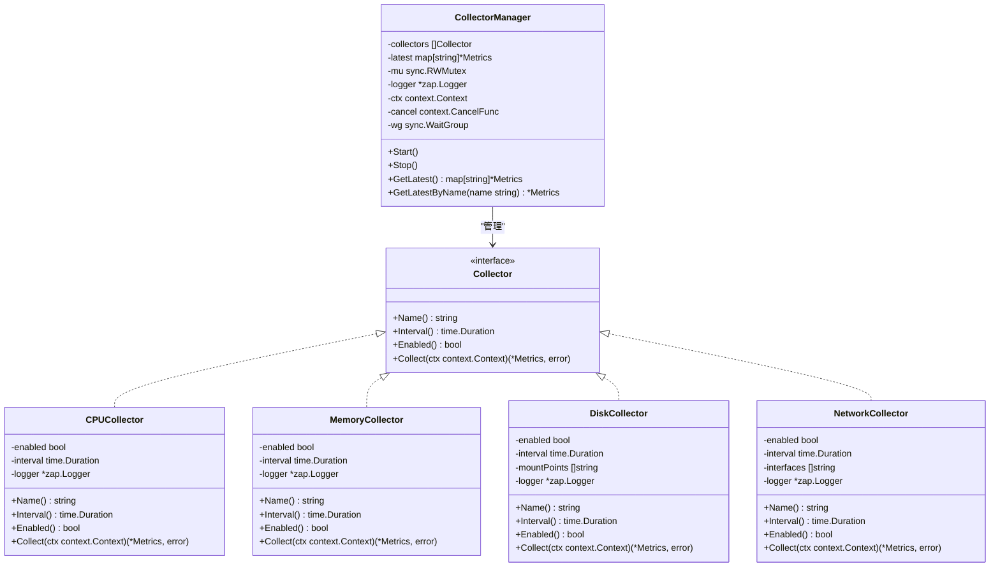
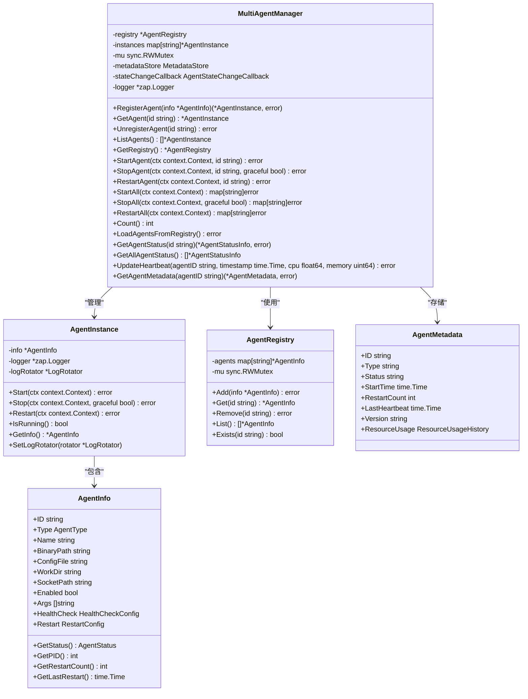

# Daemon模块

<cite>
**本文档引用的文件**
- [main.go](file://daemon/cmd/daemon/main.go)
- [daemon.go](file://daemon/internal/daemon/daemon.go)
- [signal.go](file://daemon/internal/daemon/signal.go)
- [config.go](file://daemon/internal/config/config.go)
- [manager.go](file://daemon/internal/agent/manager.go)
- [multi_manager.go](file://daemon/internal/agent/multi_manager.go)
- [resource_monitor.go](file://daemon/internal/agent/resource_monitor.go)
- [heartbeat_receiver.go](file://daemon/internal/agent/heartbeat_receiver.go)
- [server.go](file://daemon/internal/grpc/server.go)
- [cpu.go](file://daemon/internal/collector/cpu.go)
- [memory.go](file://daemon/internal/collector/memory.go)
- [disk.go](file://daemon/internal/collector/disk.go)
- [network.go](file://daemon/internal/collector/network.go)
- [manager.go](file://daemon/internal/collector/manager.go)
</cite>

## 目录
1. [简介](#简介)
2. [项目结构](#项目结构)
3. [核心组件](#核心组件)
4. [架构概述](#架构概述)
5. [详细组件分析](#详细组件分析)
6. [依赖分析](#依赖分析)
7. [性能考虑](#性能考虑)
8. [故障排查指南](#故障排查指南)
9. [结论](#结论)

## 简介
Daemon模块是运维框架中的核心主机代理，负责在边缘节点上执行主机监控、Agent生命周期管理、与Manager通信等关键任务。该模块作为系统的核心组件，实现了从资源采集、Agent管理到状态上报的完整功能链。Daemon采用Go语言开发，具有高并发、低资源占用的特点，能够稳定运行在各种边缘计算环境中。其主要功能包括：采集主机的CPU、内存、磁盘和网络资源指标；管理多个Agent进程的生命周期；通过gRPC与Manager服务进行双向通信；接收并处理Agent的心跳上报。本技术文档将深入分析Daemon模块的架构设计、核心功能实现和运行机制，为开发和运维人员提供全面的技术参考。

## 项目结构
Daemon模块的项目结构遵循Go语言的标准布局，包含命令行入口、内部实现、配置文件和脚本等组成部分。该结构清晰地划分了不同功能模块，便于维护和扩展。


**Diagram sources**
- [main.go](file://daemon/cmd/daemon/main.go)
- [daemon.go](file://daemon/internal/daemon/daemon.go)
- [config.go](file://daemon/internal/config/config.go)

## 核心组件

Daemon模块的核心组件包括守护进程主控、资源采集器、Agent管理器、心跳接收器和gRPC服务端。这些组件协同工作，实现了Daemon的核心功能。守护进程主控负责整个Daemon的生命周期管理，包括启动、运行和停止。资源采集器定期采集主机的CPU、内存、磁盘和网络使用情况，并将指标数据上报给Manager。Agent管理器负责管理多个Agent进程的生命周期，包括启动、停止和重启。心跳接收器通过HTTP端点接收Agent的心跳上报，用于监控Agent的运行状态。gRPC服务端提供远程过程调用接口，允许Manager或其他客户端查询Agent状态、执行操作和获取指标数据。这些组件通过清晰的接口和事件机制进行通信，形成了一个松耦合、高内聚的系统架构。

**Section sources**
- [daemon.go](file://daemon/internal/daemon/daemon.go)
- [manager.go](file://daemon/internal/agent/manager.go)
- [multi_manager.go](file://daemon/internal/agent/multi_manager.go)
- [resource_monitor.go](file://daemon/internal/agent/resource_monitor.go)
- [heartbeat_receiver.go](file://daemon/internal/agent/heartbeat_receiver.go)
- [server.go](file://daemon/internal/grpc/server.go)

## 架构概述

Daemon模块采用分层架构设计，各组件职责明确，通过清晰的接口进行交互。该架构确保了系统的可维护性和可扩展性。


**Diagram sources**
- [daemon.go](file://daemon/internal/daemon/daemon.go)
- [multi_manager.go](file://daemon/internal/agent/multi_manager.go)
- [resource_monitor.go](file://daemon/internal/agent/resource_monitor.go)
- [heartbeat_receiver.go](file://daemon/internal/agent/heartbeat_receiver.go)
- [server.go](file://daemon/internal/grpc/server.go)

## 详细组件分析

### 守护进程启动与信号处理
Daemon模块的启动流程始于`main.go`文件中的`main`函数，该函数负责解析命令行参数、加载配置、初始化日志系统，并创建Daemon实例。启动流程严格按照顺序执行，确保各组件正确初始化。


守护进程通过`signal.go`文件中的`WaitForSignal`方法监听系统信号，包括SIGINT、SIGTERM和SIGQUIT。当接收到这些信号时，Daemon会优雅地停止所有正在运行的组件，包括采集器、Agent进程和网络服务，确保数据完整性和系统稳定性。这种信号处理机制使得Daemon能够安全地响应系统关机或重启命令。

**Section sources**
- [main.go](file://daemon/cmd/daemon/main.go)
- [daemon.go](file://daemon/internal/daemon/daemon.go)
- [signal.go](file://daemon/internal/daemon/signal.go)

### 资源采集器
资源采集器是Daemon模块的核心功能之一，负责定期采集主机的CPU、内存、磁盘和网络使用情况。采集器采用模块化设计，每个资源类型都有独立的采集器实现。



采集器的采集频率通过配置文件中的`interval`参数设置，默认为60秒。CPU采集器使用`gopsutil/v3/cpu`库获取CPU使用率、核心数和型号信息；内存采集器采集虚拟内存和Swap内存的使用情况；磁盘采集器监控指定挂载点的磁盘使用率和I/O统计；网络采集器跟踪指定网卡的网络流量。所有采集器都实现了`Collector`接口，由`CollectorManager`统一管理，确保采集任务的并发执行和结果聚合。

**Section sources**
- [cpu.go](file://daemon/internal/collector/cpu.go)
- [memory.go](file://daemon/internal/collector/memory.go)
- [disk.go](file://daemon/internal/collector/disk.go)
- [network.go](file://daemon/internal/collector/network.go)
- [manager.go](file://daemon/internal/collector/manager.go)

### Agent生命周期管理器
Agent生命周期管理器负责管理多个Agent进程的启动、停止、重启和健康检查。该管理器采用多Agent架构，支持同时管理多种类型的Agent。



管理器通过`AgentRegistry`维护所有Agent的配置信息，并使用`AgentInstance`对象管理每个Agent的运行状态。当Daemon启动时，管理器会根据配置文件加载所有Agent，并启动它们的进程。管理器还负责维护Agent的元数据，包括启动时间、重启次数和资源使用历史。通过`StateSyncer`组件，管理器能够将Agent状态同步到Manager服务，实现集中式监控和管理。

**Section sources**
- [multi_manager.go](file://daemon/internal/agent/multi_manager.go)
- [instance.go](file://daemon/internal/agent/instance.go)
- [registry.go](file://daemon/internal/agent/registry.go)
- [metadata_store.go](file://daemon/internal/agent/metadata_store.go)

### gRPC服务端
gRPC服务端是Daemon与Manager通信的核心组件，提供了一系列远程过程调用接口，用于查询Agent状态、执行操作和获取指标数据。


服务端实现了`DaemonService`接口，提供`ListAgents`、`OperateAgent`、`GetAgentMetrics`和`SyncAgentStates`等方法。`ListAgents`方法返回所有已注册Agent的详细信息；`OperateAgent`方法允许Manager启动、停止或重启指定的Agent；`GetAgentMetrics`方法提供Agent的资源使用历史数据；`SyncAgentStates`方法用于双向状态同步。服务端通过`MultiAgentManager`和`ResourceMonitor`等组件获取所需数据，确保了接口的高效性和一致性。

**Section sources**
- [server.go](file://daemon/internal/grpc/server.go)
- [multi_manager.go](file://daemon/internal/agent/multi_manager.go)
- [resource_monitor.go](file://daemon/internal/agent/resource_monitor.go)

## 依赖分析

Daemon模块的依赖关系清晰，各组件通过接口和事件进行松耦合通信。核心依赖包括配置管理、日志系统、元数据存储和外部库。

```mermaid
graph TD
Daemon["Daemon"]
Config["config.go"]
Logger["logger.go"]
MultiAgentManager["multi_manager.go"]
ResourceMonitor["resource_monitor.go"]
HeartbeatReceiver["heartbeat_receiver.go"]
GRPCServer["server.go"]
CollectorManager["collector/manager.go"]
CPUCollector["collector/cpu.go"]
MemoryCollector["collector/memory.go"]
DiskCollector["collector/disk.go"]
NetworkCollector["collector/network.go"]
Daemon --> Config
Daemon --> Logger
Daemon --> MultiAgentManager
Daemon --> ResourceMonitor
Daemon --> HeartbeatReceiver
Daemon --> GRPCServer
Daemon --> CollectorManager
CollectorManager --> CPUCollector
CollectorManager --> MemoryCollector
CollectorManager --> DiskCollector
CollectorManager --> NetworkCollector
MultiAgentManager --> Logger
ResourceMonitor --> Logger
HeartbeatReceiver --> Logger
GRPCServer --> Logger
CPUCollector --> Logger
MemoryCollector --> Logger
DiskCollector --> Logger
NetworkCollector --> Logger
MultiAgentManager --> "gopsutil/v3/process"
ResourceMonitor --> "gopsutil/v3/process"
CPUCollector --> "gopsutil/v3/cpu"
MemoryCollector --> "gopsutil/v3/mem"
DiskCollector --> "gopsutil/v3/disk"
NetworkCollector --> "gopsutil/v3/net"
```

**Diagram sources**
- [daemon.go](file://daemon/internal/daemon/daemon.go)
- [config.go](file://daemon/internal/config/config.go)
- [logger.go](file://daemon/internal/logger/logger.go)
- [multi_manager.go](file://daemon/internal/agent/multi_manager.go)
- [resource_monitor.go](file://daemon/internal/agent/resource_monitor.go)
- [heartbeat_receiver.go](file://daemon/internal/agent/heartbeat_receiver.go)
- [server.go](file://daemon/internal/grpc/server.go)
- [manager.go](file://daemon/internal/collector/manager.go)

## 性能考虑

Daemon模块在设计时充分考虑了性能影响，通过多种优化措施确保在边缘节点上的稳定运行。资源采集器的采集频率默认设置为60秒，避免了过于频繁的系统调用对主机性能的影响。采集任务采用并发执行模式，每个采集器在独立的goroutine中运行，确保了采集过程的高效性。心跳接收器使用worker pool模式处理并发请求，通过限制worker数量和channel容量，防止了资源耗尽问题。Agent管理器在启动和停止Agent时采用优雅的进程管理策略，避免了强制终止进程可能导致的数据丢失。gRPC服务端通过连接池和超时控制，确保了与Manager通信的稳定性和可靠性。此外，Daemon还实现了PID文件和节点ID的持久化存储，确保了在系统重启后能够恢复之前的状态。

## 故障排查指南

### gRPC连接失败
当Daemon无法连接到Manager时，首先检查网络连通性，确保Manager服务地址和端口可达。查看Daemon日志中的错误信息，确认是否为TLS证书问题或超时错误。检查配置文件中的`manager.address`和`manager.tls`配置项是否正确。如果使用TLS，确保证书文件路径正确且文件存在。可以通过`telnet`或`nc`命令测试端口连通性。

### 采集数据异常
如果采集的资源指标数据异常，首先检查对应采集器的配置，确认`enabled`和`interval`参数设置正确。查看Daemon日志中的采集错误信息，确认是否为系统调用失败。对于CPU和内存采集，检查`gopsutil/v3`库的版本兼容性。对于磁盘和网络采集，确认挂载点和网卡名称配置正确。可以通过手动执行`top`、`df`、`ifconfig`等系统命令验证数据准确性。

### Agent无法启动
当Agent无法启动时，检查Agent二进制文件路径和配置文件路径是否正确。查看Agent的日志文件，确认启动失败的具体原因。检查工作目录权限，确保Daemon有读写权限。确认Agent的依赖库已正确安装。如果Agent需要特定环境变量，确保在启动命令中正确设置。对于自定义Agent，检查其启动脚本和配置文件语法是否正确。

### 心跳接收器无响应
如果心跳接收器无法接收Agent的心跳，首先检查HTTP服务器是否正常启动，确认监听端口8081是否被占用。查看Daemon日志，确认HTTP服务器启动成功。检查防火墙设置，确保端口8081对外开放。验证Agent发送的心跳请求格式是否符合API规范，特别是`agent_id`、`pid`、`cpu`和`memory`字段。可以通过`curl`命令手动发送心跳请求进行测试。

**Section sources**
- [daemon.go](file://daemon/internal/daemon/daemon.go)
- [config.go](file://daemon/internal/config/config.go)
- [heartbeat_receiver.go](file://daemon/internal/agent/heartbeat_receiver.go)

## 结论
Daemon模块作为运维框架的核心组件，实现了主机监控、Agent管理和状态上报的完整功能。其模块化设计和清晰的架构使得系统易于维护和扩展。通过分析代码实现，可以看出Daemon在性能、稳定性和可维护性方面都做了充分考虑。未来可以进一步优化资源采集的精度和频率，增加更多的健康检查机制，并完善监控告警功能。该模块为构建可靠的边缘计算平台提供了坚实的基础，是整个运维框架成功的关键所在。