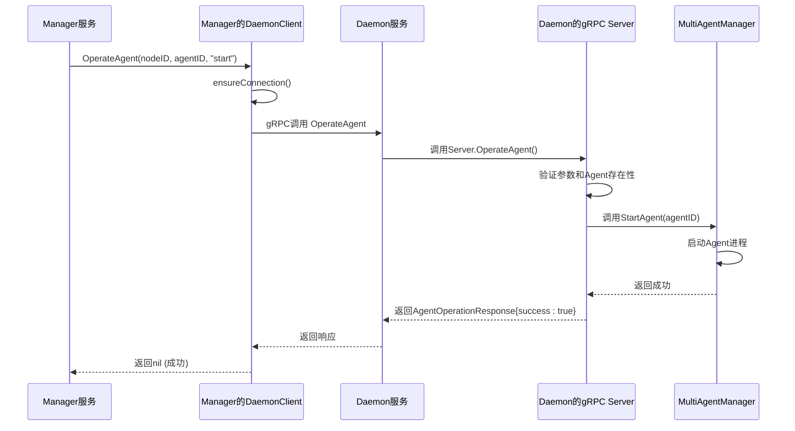

# gRPC通信层

<cite>
**本文档引用的文件**   
- [daemon.proto](file://daemon/pkg/proto/daemon.proto)
- [manager.proto](file://daemon/pkg/proto/manager/manager.proto)
- [server.go](file://daemon/internal/grpc/server.go)
- [manager_client.go](file://daemon/internal/grpc/manager_client.go)
- [daemon_client.go](file://manager/internal/grpc/daemon_client.go)
- [config.go](file://daemon/internal/config/config.go)
- [config.go](file://manager/internal/config/config.go)
</cite>

## 目录
1. [引言](#引言)
2. [gRPC协议设计](#grpc协议设计)
3. [gRPC服务端实现](#grpc服务端实现)
4. [gRPC客户端实现](#grpc客户端实现)
5. [通信序列图](#通信序列图)
6. [故障排查指南](#故障排查指南)
7. [结论](#结论)

## 引言
本技术文档详细阐述了运维框架中Daemon模块的gRPC通信层设计与实现。文档聚焦于Daemon与Manager及Agent之间的通信功能，深入解析了gRPC服务端和客户端的实现细节。gRPC作为系统核心的通信协议，实现了Manager对Daemon的远程过程调用，以及Daemon向Manager上报状态和指标的功能。文档将详细说明`ListAgents`、`OperateAgent`、`GetAgentMetrics`等API的定义、请求/响应格式、错误处理和日志记录机制，并结合代码分析`server.go`中的`OperateAgent`方法和`manager_client.go`中的`Register`方法调用流程。

## gRPC协议设计
gRPC通信层的协议设计基于Protocol Buffers（protobuf），定义了两个核心的`.proto`文件：`daemon.proto`和`manager.proto`。这两个文件分别定义了Daemon服务和Manager服务的接口，确保了通信双方的契约一致性。

### daemon.proto协议文件
`daemon.proto`文件定义了Daemon服务的接口，该服务由Manager调用，用于管理Daemon节点及其托管的Agent。其核心组件包括：

#### 服务（Service）定义
```protobuf
service DaemonService {
  rpc Register(RegisterRequest) returns (RegisterResponse);
  rpc Heartbeat(HeartbeatRequest) returns (HeartbeatResponse);
  rpc ReportMetrics(MetricsRequest) returns (MetricsResponse);
  rpc GetConfig(ConfigRequest) returns (ConfigResponse);
  rpc PushUpdate(UpdateRequest) returns (UpdateResponse);
  rpc ListAgents(ListAgentsRequest) returns (ListAgentsResponse);
  rpc OperateAgent(AgentOperationRequest) returns (AgentOperationResponse);
  rpc GetAgentMetrics(AgentMetricsRequest) returns (AgentMetricsResponse);
  rpc SyncAgentStates(SyncAgentStatesRequest) returns (SyncAgentStatesResponse);
}
```
该服务定义了Manager可以对Daemon执行的所有操作，包括节点注册、心跳上报、指标上报、配置获取、更新推送，以及对Agent的列举、操作和指标查询。

#### 消息（Message）定义
- **AgentInfo**: 描述Agent的详细信息，包括ID、类型、状态、PID、版本、启动时间等。
- **ListAgentsRequest/ListAgentsResponse**: 用于列举所有Agent的请求和响应消息。
- **AgentOperationRequest/AgentOperationResponse**: 用于操作Agent（启动、停止、重启）的请求和响应消息。
- **ResourceDataPoint**: 表示一个资源使用数据点，包含CPU、内存、磁盘等指标。
- **AgentMetricsRequest/AgentMetricsResponse**: 用于获取Agent资源使用指标的请求和响应消息。
- **SyncAgentStatesRequest/AgentMetricsResponse**: 用于Daemon向Manager同步其管理的所有Agent状态的请求和响应消息。

**协议文件来源**
- [daemon.proto](file://daemon/pkg/proto/daemon.proto)

### manager.proto协议文件
`manager.proto`文件定义了Manager服务的接口，该服务由Daemon调用，用于向Manager注册节点、发送心跳和上报指标。

#### 服务（Service）定义
```protobuf
service ManagerService {
  rpc RegisterNode(RegisterNodeRequest) returns (RegisterNodeResponse);
  rpc Heartbeat(HeartbeatRequest) returns (HeartbeatResponse);
  rpc ReportMetrics(ReportMetricsRequest) returns (ReportMetricsResponse);
}
```
该服务定义了Daemon可以向Manager执行的操作，主要包括节点注册、心跳上报和指标上报。

#### 消息（Message）定义
- **RegisterNodeRequest/RegisterNodeResponse**: 用于节点注册的请求和响应消息，包含节点ID、主机名、IP、操作系统等信息。
- **HeartbeatRequest/HeartbeatResponse**: 用于心跳上报的请求和响应消息。
- **MetricData/ReportMetricsRequest/ReportMetricsResponse**: 用于指标上报的请求和响应消息，`MetricData`包含指标类型、时间戳和具体数值。

**协议文件来源**
- [manager.proto](file://daemon/pkg/proto/manager/manager.proto)

## gRPC服务端实现
gRPC服务端（`Server`）在Daemon模块中实现，负责监听来自Manager的gRPC请求并执行相应的业务逻辑。其实现位于`daemon/internal/grpc/server.go`文件中。

### 核心API实现
服务端实现了`daemon.proto`中定义的所有RPC方法。

#### ListAgents API
`ListAgents`方法用于列举Daemon管理的所有Agent实例。其实现逻辑如下：
1.  调用`multiAgentManager.ListAgents()`获取所有Agent实例。
2.  遍历实例，通过`GetInfo()`获取基本信息，并通过`GetAgentMetadata()`获取元数据（如版本、启动时间）。
3.  将内部数据结构转换为protobuf定义的`AgentInfo`消息。
4.  构建并返回`ListAgentsResponse`。

#### OperateAgent API
`OperateAgent`方法用于对指定的Agent执行启动、停止或重启操作。其核心实现逻辑在`server.go`的`OperateAgent`方法中：
1.  **参数验证**：检查`agent_id`是否为空，并验证`operation`字段是否为`start`、`stop`或`restart`之一。
2.  **存在性检查**：通过`multiAgentManager.GetAgent(req.AgentId)`检查Agent是否存在，若不存在则返回`NotFound`错误。
3.  **执行操作**：根据`operation`的值，调用`multiAgentManager`的相应方法（`StartAgent`、`StopAgent`、`RestartAgent`）。
4.  **错误处理**：如果操作失败，记录错误日志，并返回包含错误信息的`AgentOperationResponse`和`Internal` gRPC错误码。
5.  **成功响应**：操作成功后，记录成功日志，并返回`success: true`的响应。

此方法的实现体现了清晰的错误处理和日志记录策略，确保了操作的可追溯性。

#### GetAgentMetrics API
`GetAgentMetrics`方法用于获取指定Agent在一段时间内的资源使用历史数据。其实现逻辑如下：
1.  验证`agent_id`参数。
2.  验证`duration_seconds`参数，若无效则使用默认值（1小时）。
3.  检查Agent是否存在。
4.  调用`resourceMonitor.GetResourceHistory()`获取指定时间范围内的资源历史数据。
5.  将内部的`ResourceDataPoint`结构转换为protobuf消息。
6.  返回包含数据点的`AgentMetricsResponse`。

**服务端实现来源**
- [server.go](file://daemon/internal/grpc/server.go#L37-L255)

## gRPC客户端实现
gRPC客户端分为两部分：Daemon模块中的`ManagerClient`和Manager模块中的`DaemonClient`。

### Daemon模块的ManagerClient
`ManagerClient`（位于`daemon/internal/grpc/manager_client.go`）是Daemon用来与Manager通信的客户端。其主要功能是实现节点注册、心跳发送和指标上报。

#### 核心功能实现
- **Connect方法**：负责建立与Manager的gRPC连接。它会根据配置加载TLS证书（生产环境）或使用不安全连接（开发环境），并配置keepalive参数以维持长连接。
- **SyncAgentStates方法**：此方法用于将Daemon管理的Agent状态同步到Manager。其调用流程如下：
    1.  验证客户端连接状态。
    2.  将内部的`agent.AgentState`对象列表转换为protobuf定义的`proto.AgentState`列表。
    3.  构建`SyncAgentStatesRequest`请求。
    4.  调用`c.client.SyncAgentStates(ctx, req)`发起gRPC调用。
    5.  处理响应，检查`success`字段，并根据结果记录日志或返回错误。

该客户端的设计考虑了生产环境的TLS安全性和连接的健壮性。

### Manager模块的DaemonClient
`DaemonClient`（位于`manager/internal/grpc/daemon_client.go`）是Manager用来与Daemon通信的客户端。它封装了对`ListAgents`、`OperateAgent`和`GetAgentMetrics`等API的调用。

#### 核心特性
- **连接池（DaemonClientPool）**：Manager使用连接池来管理与多个Daemon节点的连接，避免为每个请求都创建新连接，提高了性能和资源利用率。
- **自动重连（ensureConnection）**：`ensureConnection`方法会检查连接状态，如果连接断开或处于故障状态，会自动尝试重连，保证了通信的可靠性。
- **错误转换**：通过`convertGRPCError`函数将gRPC的底层错误码（如`Unavailable`、`DeadlineExceeded`）转换为更易理解的业务错误（如`ErrConnectionFailed`、`ErrTimeout`），便于上层服务处理。

**客户端实现来源**
- [manager_client.go](file://daemon/internal/grpc/manager_client.go#L1-L155)
- [daemon_client.go](file://manager/internal/grpc/daemon_client.go#L1-L398)

## 通信序列图
下图展示了从Manager发起指令到Daemon执行并返回结果的完整交互过程，以`OperateAgent`操作为例。



**序列图来源**
- [server.go](file://daemon/internal/grpc/server.go#L70-L124)
- [daemon_client.go](file://manager/internal/grpc/daemon_client.go#L168-L237)

## 故障排查指南
当gRPC通信出现问题时，可按照以下步骤进行诊断：

### gRPC连接失败
1.  **检查网络连通性**：使用`ping`和`telnet`命令确认Manager与Daemon之间的网络是否通畅，端口是否开放。
2.  **检查服务状态**：确认Daemon服务是否正在运行，并监听正确的端口（默认9091）。
3.  **检查TLS配置**：如果启用了TLS，确认`cert_file`、`key_file`和`ca_file`路径正确，且证书有效。在`daemon.log`中查找`failed to load client cert`或`failed to read CA cert`等错误。
4.  **检查防火墙**：确认防火墙规则没有阻止gRPC通信端口。

### 证书验证错误
1.  **验证证书链**：确保客户端的证书（`cert_file`）是由服务端信任的CA（`ca_file`）签发的。
2.  **检查主机名**：证书中的`Common Name` (CN) 或 `Subject Alternative Name` (SAN) 必须与连接的主机名匹配。
3.  **检查文件权限**：确保证书文件的读取权限正确。

### API调用超时
1.  **检查服务负载**：Daemon或Manager服务可能因CPU或内存过高而响应缓慢。检查系统资源使用情况。
2.  **增加超时时间**：在客户端配置中适当增加`timeout`值。
3.  **检查网络延迟**：高网络延迟可能导致超时。使用`traceroute`分析网络路径。
4.  **查看日志**：在`daemon.log`或`manager.log`中查找`deadline exceeded`或`context deadline exceeded`错误，这通常表明请求处理时间过长。

**故障排查来源**
- [manager_client.go](file://daemon/internal/grpc/manager_client.go#L40-L92)
- [daemon_client.go](file://manager/internal/grpc/daemon_client.go#L74-L137)
- [errors.go](file://manager/internal/grpc/errors.go#L1-L48)

## 结论
本文档详细解析了运维框架中Daemon模块的gRPC通信层。通过`daemon.proto`和`manager.proto`协议文件，定义了清晰的通信契约。服务端实现了对Agent的全面管理能力，而客户端则确保了与Manager之间可靠、安全的通信。该设计支持节点注册、心跳、指标上报和远程操作等核心功能，为整个系统的集中管理和监控提供了坚实的基础。通过理解其API实现、客户端连接池和错误处理机制，可以有效地进行开发、维护和故障排查。