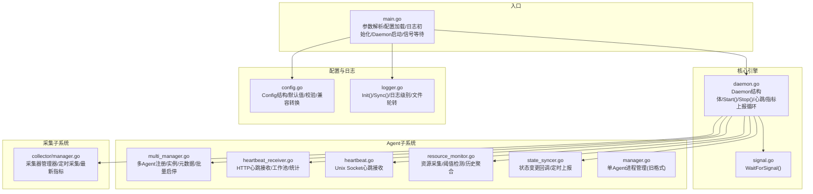
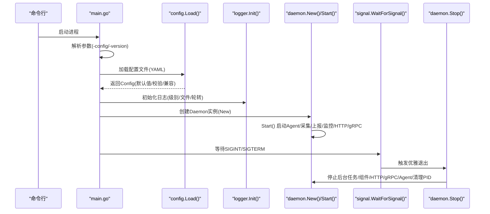
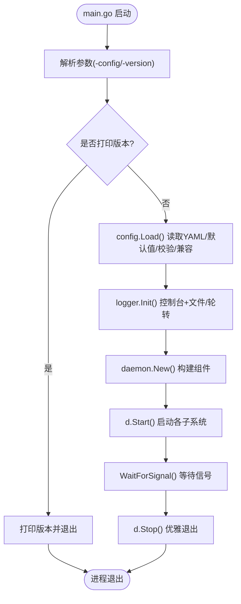
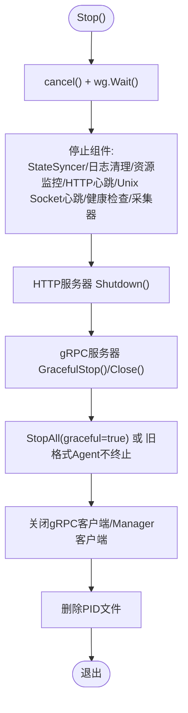
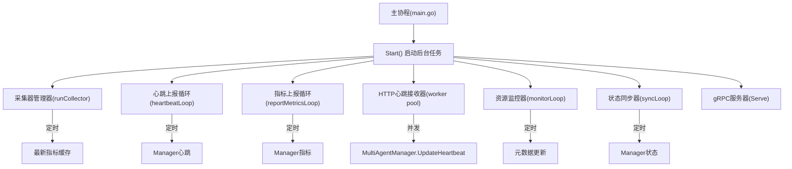
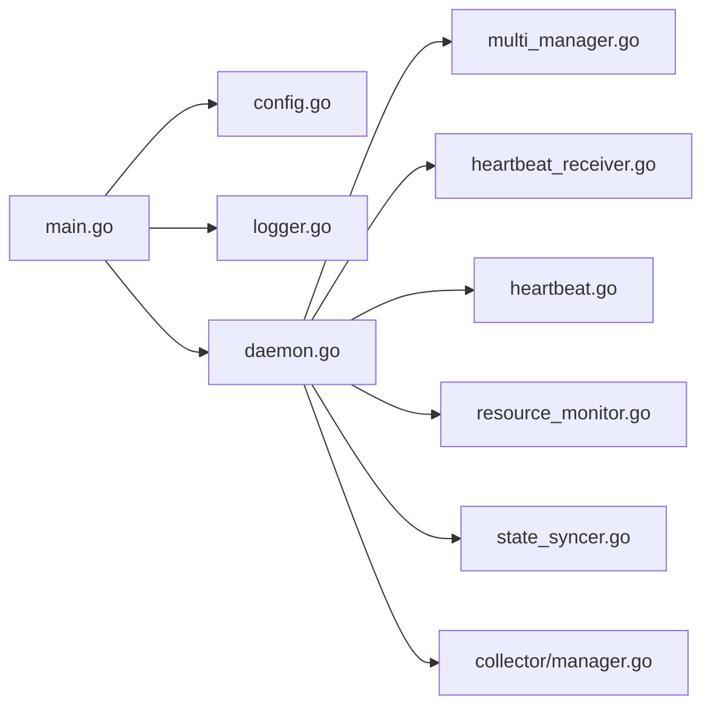

# 核心引擎

<cite>
**本文引用的文件**
- [daemon/cmd/daemon/main.go](file://daemon/cmd/daemon/main.go)
- [daemon/internal/daemon/daemon.go](file://daemon/internal/daemon/daemon.go)
- [daemon/internal/daemon/signal.go](file://daemon/internal/daemon/signal.go)
- [daemon/internal/config/config.go](file://daemon/internal/config/config.go)
- [daemon/internal/logger/logger.go](file://daemon/internal/logger/logger.go)
- [daemon/internal/agent/multi_manager.go](file://daemon/internal/agent/multi_manager.go)
- [daemon/internal/agent/manager.go](file://daemon/internal/agent/manager.go)
- [daemon/internal/agent/heartbeat.go](file://daemon/internal/agent/heartbeat.go)
- [daemon/internal/agent/heartbeat_receiver.go](file://daemon/internal/agent/heartbeat_receiver.go)
- [daemon/internal/agent/state_syncer.go](file://daemon/internal/agent/state_syncer.go)
- [daemon/internal/agent/resource_monitor.go](file://daemon/internal/agent/resource_monitor.go)
- [daemon/internal/collector/manager.go](file://daemon/internal/collector/manager.go)
- [daemon/configs/daemon.yaml](file://daemon/configs/daemon.yaml)
</cite>

## 目录
1. [简介](#简介)
2. [项目结构](#项目结构)
3. [核心组件](#核心组件)
4. [架构总览](#架构总览)
5. [详细组件分析](#详细组件分析)
6. [依赖分析](#依赖分析)
7. [性能考量](#性能考量)
8. [故障排查指南](#故障排查指南)
9. [结论](#结论)

## 简介
本文件面向Daemon核心引擎，聚焦其作为守护进程的核心职责，系统阐述启动流程（命令行参数解析、配置加载、日志初始化、模块初始化、节点注册、定时任务启动）、优雅退出流程（停止接收新任务、等待当前任务完成、断开Manager连接、保存状态与关闭日志）、信号处理机制（SIGTERM、SIGINT等），并结合代码路径展示main.go中的启动函数调用栈与daemon.go中的Start()/Stop()实现。同时提供核心引擎的线程/协程模型图，说明主协程与采集、上报、监控等后台协程的协作关系，并给出常见问题的诊断步骤。

## 项目结构
Daemon位于daemon子模块，采用分层与功能域划分：
- cmd/daemon：入口程序，负责参数解析、配置加载、日志初始化、Daemon实例创建与启动、信号等待与优雅退出
- internal/daemon：核心引擎，封装Daemon生命周期、组件编排、gRPC/HTTP服务、心跳与指标上报循环
- internal/config：配置模型与加载、默认值、校验、兼容转换
- internal/logger：日志初始化与刷新
- internal/agent：多Agent管理、健康检查、心跳接收、资源监控、状态同步
- internal/collector：指标采集器管理器
- configs：默认配置示例

图表来源
- [daemon/cmd/daemon/main.go](file://daemon/cmd/daemon/main.go#L1-L65)
- [daemon/internal/daemon/daemon.go](file://daemon/internal/daemon/daemon.go#L1-L238)
- [daemon/internal/daemon/signal.go](file://daemon/internal/daemon/signal.go#L1-L22)
- [daemon/internal/config/config.go](file://daemon/internal/config/config.go#L1-L187)
- [daemon/internal/logger/logger.go](file://daemon/internal/logger/logger.go#L1-L154)
- [daemon/internal/agent/multi_manager.go](file://daemon/internal/agent/multi_manager.go#L1-L120)
- [daemon/internal/agent/heartbeat_receiver.go](file://daemon/internal/agent/heartbeat_receiver.go#L1-L120)
- [daemon/internal/agent/heartbeat.go](file://daemon/internal/agent/heartbeat.go#L1-L74)
- [daemon/internal/agent/resource_monitor.go](file://daemon/internal/agent/resource_monitor.go#L1-L120)
- [daemon/internal/agent/state_syncer.go](file://daemon/internal/agent/state_syncer.go#L1-L90)
- [daemon/internal/agent/manager.go](file://daemon/internal/agent/manager.go#L1-L90)
- [daemon/internal/collector/manager.go](file://daemon/internal/collector/manager.go#L1-L60)

章节来源
- [daemon/cmd/daemon/main.go](file://daemon/cmd/daemon/main.go#L1-L65)
- [daemon/internal/config/config.go](file://daemon/internal/config/config.go#L137-L187)
- [daemon/internal/logger/logger.go](file://daemon/internal/logger/logger.go#L27-L108)

## 核心组件
- Daemon结构体：持有配置、日志、各子系统组件、上下文与等待组，统一编排生命周期
- 配置加载：Viper解析YAML，绑定环境变量，设置默认值，兼容旧格式Agent配置，校验与警告
- 日志系统：Zap初始化控制台+文件输出，支持日志轮转与刷新
- 多Agent管理：注册表、实例、元数据存储、批量启停、状态回调
- 心跳接收：Unix Socket与HTTP两种方式，HTTP支持工作池并发处理
- 资源监控：周期采集Agent进程资源，阈值检测，历史数据聚合
- 状态同步：监听状态变化，定时向Manager上报Agent状态
- 采集器管理：按配置启用采集器，定时采集并缓存最新指标
- gRPC/HTTP服务：对外提供Daemon服务，内部HTTP心跳接收

章节来源
- [daemon/internal/daemon/daemon.go](file://daemon/internal/daemon/daemon.go#L26-L238)
- [daemon/internal/config/config.go](file://daemon/internal/config/config.go#L189-L354)
- [daemon/internal/logger/logger.go](file://daemon/internal/logger/logger.go#L27-L108)
- [daemon/internal/agent/multi_manager.go](file://daemon/internal/agent/multi_manager.go#L1-L120)
- [daemon/internal/agent/heartbeat.go](file://daemon/internal/agent/heartbeat.go#L1-L74)
- [daemon/internal/agent/heartbeat_receiver.go](file://daemon/internal/agent/heartbeat_receiver.go#L1-L120)
- [daemon/internal/agent/resource_monitor.go](file://daemon/internal/agent/resource_monitor.go#L1-L120)
- [daemon/internal/agent/state_syncer.go](file://daemon/internal/agent/state_syncer.go#L1-L90)
- [daemon/internal/collector/manager.go](file://daemon/internal/collector/manager.go#L1-L60)

## 架构总览
Daemon采用“主协程+后台协程”的线程/协程模型：
- 主协程负责：命令行参数解析、配置加载、日志初始化、Daemon实例创建、Start()启动编排、WaitForSignal()等待信号
- 后台协程负责：采集器、心跳上报、指标上报、HTTP心跳接收、资源监控、状态同步、gRPC服务

图表来源
- [daemon/cmd/daemon/main.go](file://daemon/cmd/daemon/main.go#L18-L64)
- [daemon/internal/daemon/daemon.go](file://daemon/internal/daemon/daemon.go#L240-L396)
- [daemon/internal/daemon/signal.go](file://daemon/internal/daemon/signal.go#L11-L22)

## 详细组件分析

### 启动流程（main.go调用栈与Start()）
- 参数解析：支持-config与-version，version打印后退出
- 配置加载：Viper读取YAML，自动绑定环境变量，设置默认值，兼容旧格式Agent配置，校验与警告
- 日志初始化：创建目录、控制台+文件输出、Zap核心、刷新
- Daemon实例创建：生成或加载节点ID、创建采集器、构建多Agent管理器/旧格式Agent管理器、gRPC客户端、Manager客户端、资源监控、日志管理器、状态同步器、HTTP心跳接收器、gRPC服务器
- 启动：创建工作目录、写入PID文件、启动Agent、启动多Agent健康检查、启动HTTP服务器、启动资源监控、启动日志清理任务、启动采集器、连接Manager并注册、建立Manager gRPC客户端、启动StateSyncer、启动gRPC服务、启动心跳与指标上报循环
- 信号等待：等待SIGINT/SIGTERM/SIGQUIT，触发Stop()

图表来源
- [daemon/cmd/daemon/main.go](file://daemon/cmd/daemon/main.go#L18-L64)
- [daemon/internal/daemon/daemon.go](file://daemon/internal/daemon/daemon.go#L240-L396)
- [daemon/internal/daemon/signal.go](file://daemon/internal/daemon/signal.go#L11-L22)

章节来源
- [daemon/cmd/daemon/main.go](file://daemon/cmd/daemon/main.go#L18-L64)
- [daemon/internal/config/config.go](file://daemon/internal/config/config.go#L137-L187)
- [daemon/internal/logger/logger.go](file://daemon/internal/logger/logger.go#L27-L108)
- [daemon/internal/daemon/daemon.go](file://daemon/internal/daemon/daemon.go#L240-L396)

### 优雅退出流程（Stop()）
- 停止后台任务：cancel()取消上下文，wg.Wait()等待
- 停止组件：StateSyncer、日志清理、资源监控、HTTP心跳接收器、Unix Socket心跳接收器、健康检查器、采集器管理器
- 停止HTTP服务器：Shutdown()优雅关闭
- 停止gRPC服务器：GracefulStop()优雅停止，关闭监听器
- 停止Agent：多Agent模式StopAll(graceful=true)，旧格式Agent不终止其进程
- 关闭gRPC客户端：关闭与Manager的连接
- 删除PID文件：os.Remove()

图表来源
- [daemon/internal/daemon/daemon.go](file://daemon/internal/daemon/daemon.go#L398-L489)

章节来源
- [daemon/internal/daemon/daemon.go](file://daemon/internal/daemon/daemon.go#L398-L489)

### 信号处理机制
- WaitForSignal()注册SIGINT、SIGTERM、SIGQUIT，收到信号后记录日志并调用Stop()执行优雅退出
- 旧格式Agent管理器在Stop(graceful)时通过发送SIGTERM等待优雅退出，超时则强制kill

章节来源
- [daemon/internal/daemon/signal.go](file://daemon/internal/daemon/signal.go#L11-L22)
- [daemon/internal/agent/manager.go](file://daemon/internal/agent/manager.go#L92-L137)

### 线程/协程模型图
- 主协程：main.go负责启动与等待信号
- 后台协程：
  - 采集器管理器：runCollector()循环定时采集
  - 心跳上报循环：heartbeatLoop()定时发送心跳
  - 指标上报循环：reportMetricsLoop()定时上报指标
  - HTTP心跳接收器：worker pool并发处理
  - 资源监控器：monitorLoop()定时采集并更新元数据
  - 状态同步器：syncLoop()定时向Manager上报状态
  - gRPC服务器：Serve()提供Daemon服务

图表来源
- [daemon/internal/collector/manager.go](file://daemon/internal/collector/manager.go#L35-L124)
- [daemon/internal/daemon/daemon.go](file://daemon/internal/daemon/daemon.go#L526-L571)
- [daemon/internal/agent/heartbeat_receiver.go](file://daemon/internal/agent/heartbeat_receiver.go#L116-L174)
- [daemon/internal/agent/resource_monitor.go](file://daemon/internal/agent/resource_monitor.go#L406-L441)
- [daemon/internal/agent/state_syncer.go](file://daemon/internal/agent/state_syncer.go#L226-L282)

章节来源
- [daemon/internal/collector/manager.go](file://daemon/internal/collector/manager.go#L35-L124)
- [daemon/internal/daemon/daemon.go](file://daemon/internal/daemon/daemon.go#L526-L571)
- [daemon/internal/agent/heartbeat_receiver.go](file://daemon/internal/agent/heartbeat_receiver.go#L116-L174)
- [daemon/internal/agent/resource_monitor.go](file://daemon/internal/agent/resource_monitor.go#L406-L441)
- [daemon/internal/agent/state_syncer.go](file://daemon/internal/agent/state_syncer.go#L226-L282)

### 配置加载与兼容
- 配置结构：DaemonConfig、ManagerConfig、AgentConfig(旧)/AgentsConfig(新)、Collectors、Update
- 默认值：日志级别、日志文件、PID文件、工作目录、Manager超时/重连/心跳间隔、Agent健康检查/重启策略、采集器间隔等
- 兼容转换：若旧格式agent存在且未配置新格式agents，则转换为新格式数组
- 校验：日志级别、Manager地址、TLS证书文件存在性、Agent二进制/配置文件存在性、Agent配置字段合法性、重启策略有效性
- 环境变量：支持AutomaticEnv()与BindEnv()绑定

章节来源
- [daemon/internal/config/config.go](file://daemon/internal/config/config.go#L1-L187)
- [daemon/internal/config/config.go](file://daemon/internal/config/config.go#L189-L354)
- [daemon/internal/config/config.go](file://daemon/internal/config/config.go#L356-L499)
- [daemon/configs/daemon.yaml](file://daemon/configs/daemon.yaml#L1-L63)

### 日志初始化
- 解析日志级别，创建日志目录
- 控制台与文件双输出，JSON编码文件输出
- Sync()用于刷新缓冲，保证退出前日志落盘

章节来源
- [daemon/internal/logger/logger.go](file://daemon/internal/logger/logger.go#L27-L108)
- [daemon/internal/logger/logger.go](file://daemon/internal/logger/logger.go#L104-L110)

### 多Agent管理与健康检查
- MultiAgentManager：注册表、实例集合、元数据存储、状态变化回调、批量启停、状态查询、心跳更新
- HTTP心跳接收器：POST /heartbeat接收心跳，工作池并发处理，统计信息，优雅停止
- Unix Socket心跳接收器：监听socket，解码心跳并交给健康检查器
- 资源监控器：周期采集CPU/RSS/VMS/IO/FDs/Threads，阈值检测，历史聚合，更新元数据
- 状态同步器：监听状态变化，定时向Manager上报Agent状态

章节来源
- [daemon/internal/agent/multi_manager.go](file://daemon/internal/agent/multi_manager.go#L1-L120)
- [daemon/internal/agent/heartbeat_receiver.go](file://daemon/internal/agent/heartbeat_receiver.go#L116-L174)
- [daemon/internal/agent/heartbeat.go](file://daemon/internal/agent/heartbeat.go#L38-L73)
- [daemon/internal/agent/resource_monitor.go](file://daemon/internal/agent/resource_monitor.go#L1-L120)
- [daemon/internal/agent/state_syncer.go](file://daemon/internal/agent/state_syncer.go#L1-L90)

### 采集器管理
- Manager：按配置启用采集器，定时采集，保存最新指标，支持并发安全读取

章节来源
- [daemon/internal/collector/manager.go](file://daemon/internal/collector/manager.go#L1-L124)

## 依赖分析
- 入口依赖：main.go依赖config.Load()、logger.Init()、daemon.New()/Start()/WaitForSignal()
- Daemon依赖：agent.MultiAgentManager、agent.HTTPHeartbeatReceiver、agent.HeartbeatReceiver、agent.ResourceMonitor、agent.StateSyncer、collector.Manager、comm.GRPCClient、grpc.Server/Listener
- 配置依赖：internal/config/config.go定义的结构体与加载逻辑
- 日志依赖：internal/logger/logger.go提供Init()/Sync()

图表来源
- [daemon/cmd/daemon/main.go](file://daemon/cmd/daemon/main.go#L18-L64)
- [daemon/internal/daemon/daemon.go](file://daemon/internal/daemon/daemon.go#L240-L396)

章节来源
- [daemon/cmd/daemon/main.go](file://daemon/cmd/daemon/main.go#L18-L64)
- [daemon/internal/daemon/daemon.go](file://daemon/internal/daemon/daemon.go#L240-L396)

## 性能考量
- 并发与等待组：Start()/Stop()中广泛使用sync.WaitGroup保证优雅停止，避免资源泄漏
- 定时器与上下文：心跳/指标/监控循环使用time.Ticker与context.Cancel，避免阻塞
- 采集器并发：采集器管理器为每个采集器启动独立goroutine，降低相互影响
- HTTP心跳接收：工作池限制并发，防止过载；满载时返回503并提示稍后重试
- 资源监控：并发采集多个Agent，阈值检测与历史聚合减少重复计算
- gRPC/HTTP：HTTP服务器使用ListenAndServe，gRPC服务器GracefulStop优雅停止

[本节为通用指导，无需列出具体文件来源]

## 故障排查指南
- 进程无法启动
  - 检查配置文件路径与权限，确认-D参数正确
  - 查看配置加载错误与校验警告（Manager地址为空、TLS证书缺失、Agent二进制/配置文件不存在）
  - 检查日志初始化是否成功（目录创建、文件打开）
  - 参考路径：
    - [daemon/cmd/daemon/main.go](file://daemon/cmd/daemon/main.go#L27-L42)
    - [daemon/internal/config/config.go](file://daemon/internal/config/config.go#L189-L354)
    - [daemon/internal/logger/logger.go](file://daemon/internal/logger/logger.go#L35-L84)

- PID文件冲突
  - 若PID文件已存在且进程未运行，可手动清理；若存在冲突进程，需先终止旧进程再启动
  - Start()阶段会写入PID文件，Stop()阶段会删除
  - 参考路径：
    - [daemon/internal/daemon/daemon.go](file://daemon/internal/daemon/daemon.go#L573-L577)
    - [daemon/internal/daemon/daemon.go](file://daemon/internal/daemon/daemon.go#L485-L489)

- 配置加载失败
  - 检查YAML语法、字段名称、环境变量绑定是否正确
  - 关注默认值设置与兼容转换（旧格式Agent到新格式）
  - 参考路径：
    - [daemon/internal/config/config.go](file://daemon/internal/config/config.go#L137-L187)
    - [daemon/internal/config/config.go](file://daemon/internal/config/config.go#L356-L385)

- 无法连接Manager
  - 检查manager.address、TLS证书、超时与重连间隔
  - Start()中会尝试连接并注册，失败会记录错误并后台重试
  - 参考路径：
    - [daemon/internal/daemon/daemon.go](file://daemon/internal/daemon/daemon.go#L491-L524)
    - [daemon/internal/config/config.go](file://daemon/internal/config/config.go#L300-L336)

- Agent启动失败
  - 检查Agent二进制路径、工作目录、配置文件、Socket路径
  - 多Agent模式下查看StartAll结果统计；旧格式Agent启动失败不影响采集器
  - 参考路径：
    - [daemon/internal/agent/multi_manager.go](file://daemon/internal/agent/multi_manager.go#L277-L313)
    - [daemon/internal/agent/manager.go](file://daemon/internal/agent/manager.go#L35-L90)

- 心跳接收异常
  - HTTP心跳：检查POST /heartbeat是否可达、工作池是否满载、统计信息
  - Unix Socket心跳：检查socket路径、监听器创建、连接接受
  - 参考路径：
    - [daemon/internal/agent/heartbeat_receiver.go](file://daemon/internal/agent/heartbeat_receiver.go#L116-L174)
    - [daemon/internal/agent/heartbeat.go](file://daemon/internal/agent/heartbeat.go#L38-L73)

- 资源监控阈值触发
  - 检查CPU/Memory阈值与持续时间配置，查看日志告警
  - 参考路径：
    - [daemon/internal/agent/resource_monitor.go](file://daemon/internal/agent/resource_monitor.go#L314-L374)

- 优雅退出未生效
  - 确认收到SIGINT/SIGTERM，WaitForSignal()是否被调用
  - Stop()中各组件是否正常停止，HTTP/gRPC是否优雅关闭
  - 参考路径：
    - [daemon/internal/daemon/signal.go](file://daemon/internal/daemon/signal.go#L11-L22)
    - [daemon/internal/daemon/daemon.go](file://daemon/internal/daemon/daemon.go#L398-L489)

## 结论
Daemon核心引擎通过清晰的启动/退出流程、完善的信号处理与优雅停机机制、模块化的组件编排，实现了稳定可靠的守护进程能力。其多Agent管理、资源监控、状态同步与指标上报等特性，满足生产环境对可观测性与可维护性的要求。建议在部署时关注配置校验、日志轮转与PID文件管理，并结合本文提供的故障排查步骤快速定位问题。