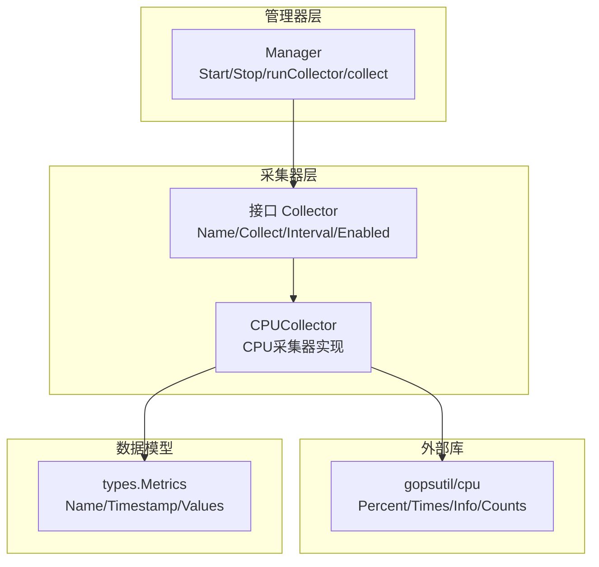
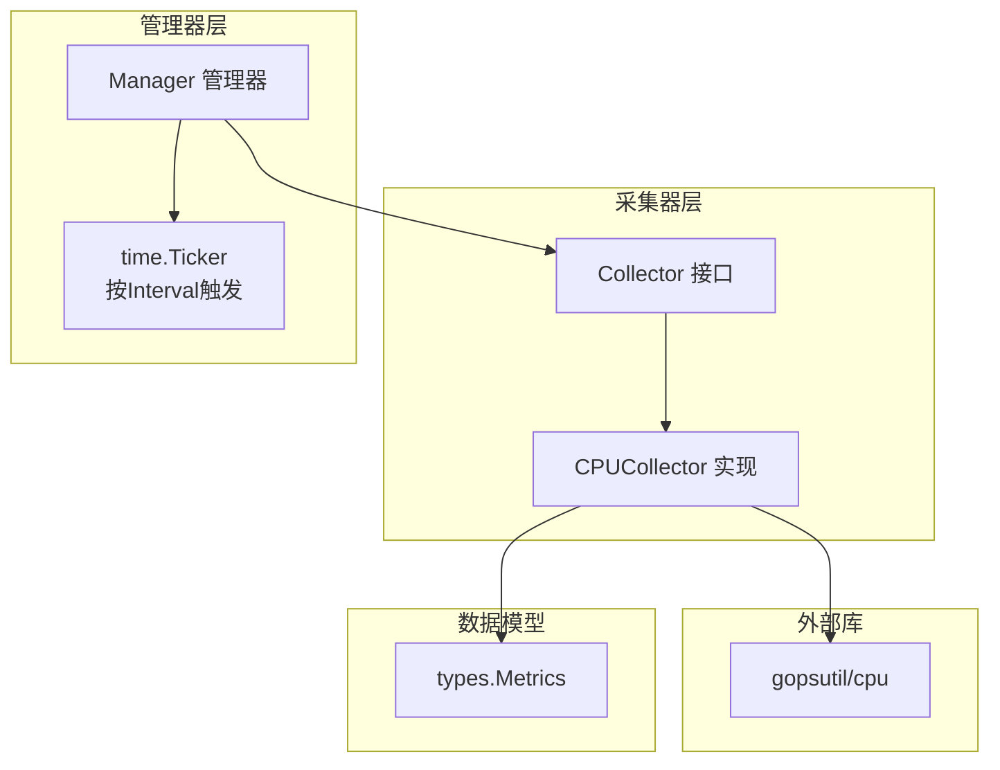
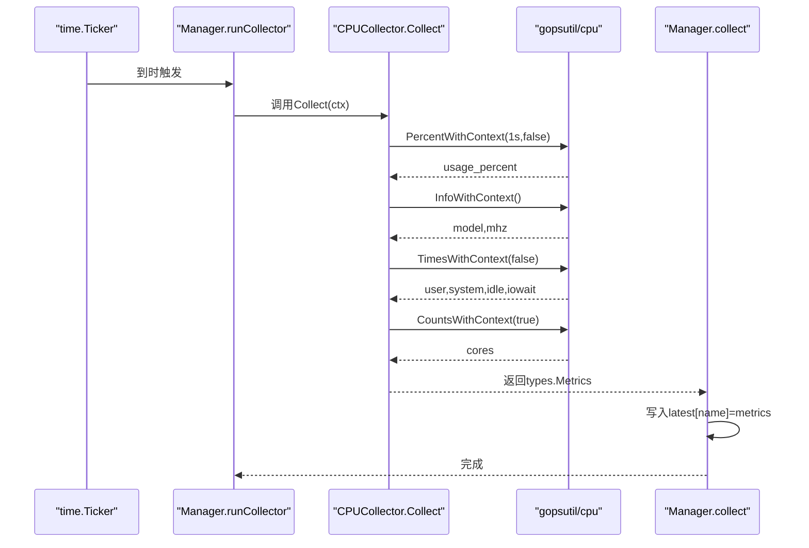
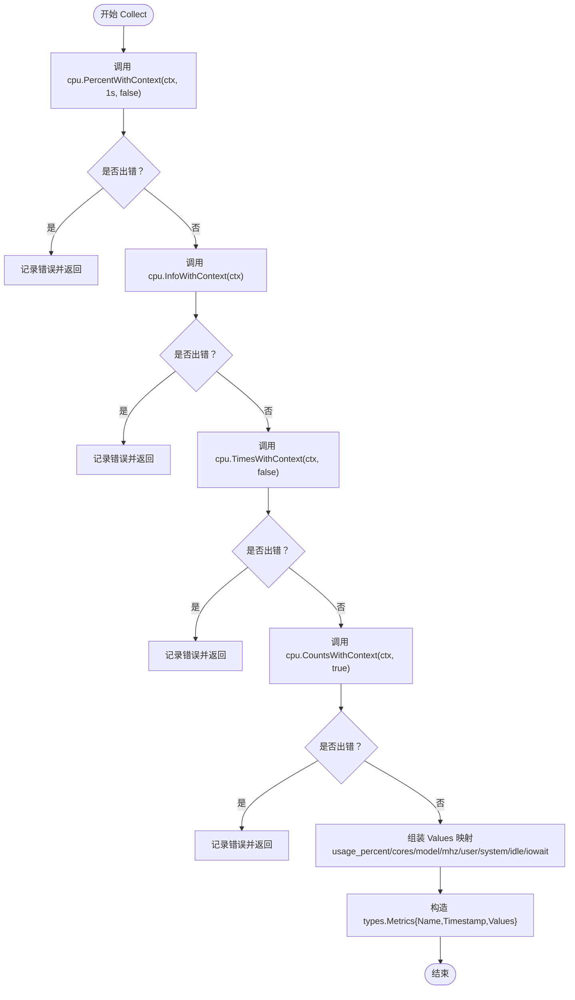

# CPU采集器

<cite>
**本文引用的文件**
- [daemon/internal/collector/cpu.go](file://daemon/internal/collector/cpu.go)
- [daemon/internal/collector/cpu_test.go](file://daemon/internal/collector/cpu_test.go)
- [daemon/internal/collector/manager.go](file://daemon/internal/collector/manager.go)
- [daemon/internal/collector/collector.go](file://daemon/internal/collector/collector.go)
- [daemon/pkg/types/types.go](file://daemon/pkg/types/types.go)
- [daemon/go.mod](file://daemon/go.mod)
- [daemon/configs/daemon.multi-agent.example.yaml](file://daemon/configs/daemon.multi-agent.example.yaml)
</cite>

## 目录
1. [简介](#简介)
2. [项目结构](#项目结构)
3. [核心组件](#核心组件)
4. [架构总览](#架构总览)
5. [详细组件分析](#详细组件分析)
6. [依赖关系分析](#依赖关系分析)
7. [性能考量](#性能考量)
8. [故障排查指南](#故障排查指南)
9. [结论](#结论)

## 简介
本文件面向CPU采集器的实现与使用，聚焦于其CPU资源监控能力。重点解析CPUCollector结构体的设计、采集流程、指标含义以及与采集器管理器的协作方式。特别说明采集间隔对CPU使用率精度的影响，并通过序列图与流程图展示从定时触发到数据上报的完整链路。同时提供常见问题的排查建议，包括CPU使用率为0、采集器报错“不支持”、多核系统数据异常等问题的诊断步骤。

## 项目结构
CPU采集器位于Daemon模块内部，采用统一的采集器接口抽象，配合采集器管理器进行周期性调度与结果缓存。关键文件如下：
- 采集器接口与实现：collector.go、cpu.go
- 采集器管理器：manager.go
- 类型定义：types.go
- 外部依赖：go.mod中声明的gopsutil
- 默认配置示例：daemon.multi-agent.example.yaml

图表来源
- [daemon/internal/collector/collector.go](file://daemon/internal/collector/collector.go#L1-L24)
- [daemon/internal/collector/cpu.go](file://daemon/internal/collector/cpu.go#L1-L106)
- [daemon/internal/collector/manager.go](file://daemon/internal/collector/manager.go#L1-L124)
- [daemon/pkg/types/types.go](file://daemon/pkg/types/types.go#L1-L111)

章节来源
- [daemon/internal/collector/cpu.go](file://daemon/internal/collector/cpu.go#L1-L106)
- [daemon/internal/collector/manager.go](file://daemon/internal/collector/manager.go#L1-L124)
- [daemon/internal/collector/collector.go](file://daemon/internal/collector/collector.go#L1-L24)
- [daemon/pkg/types/types.go](file://daemon/pkg/types/types.go#L1-L111)
- [daemon/go.mod](file://daemon/go.mod#L1-L46)

## 核心组件
- CPUCollector：实现采集器接口，负责调用gopsutil采集CPU使用率、核心数、型号、时间统计等指标，并封装为types.Metrics。
- Manager：统一调度多个采集器，基于每个采集器的Interval进行周期性采集，保存最新指标供上层查询。
- Collector接口：定义采集器的统一行为，便于扩展其他类型的采集器。
- types.Metrics：采集结果的数据模型，包含指标名、时间戳与键值对形式的指标值。

章节来源
- [daemon/internal/collector/cpu.go](file://daemon/internal/collector/cpu.go#L1-L106)
- [daemon/internal/collector/manager.go](file://daemon/internal/collector/manager.go#L1-L124)
- [daemon/internal/collector/collector.go](file://daemon/internal/collector/collector.go#L1-L24)
- [daemon/pkg/types/types.go](file://daemon/pkg/types/types.go#L1-L111)

## 架构总览
下图展示了CPU采集器在系统中的位置与交互关系，以及采集器管理器的调度机制。

图表来源
- [daemon/internal/collector/collector.go](file://daemon/internal/collector/collector.go#L1-L24)
- [daemon/internal/collector/cpu.go](file://daemon/internal/collector/cpu.go#L1-L106)
- [daemon/internal/collector/manager.go](file://daemon/internal/collector/manager.go#L1-L124)
- [daemon/pkg/types/types.go](file://daemon/pkg/types/types.go#L1-L111)

## 详细组件分析

### CPUCollector 结构体与设计要点
- 字段
  - enabled：控制采集器是否启用（影响管理器是否自动调度）。
  - interval：采集间隔，由管理器按此间隔触发周期性采集。
  - logger：日志记录器，用于采集过程中的错误与调试信息。
- 关键方法
  - Name()：返回固定名称“cpu”，用于标识指标类型。
  - Interval()：返回当前采集间隔。
  - Enabled()：返回启用状态。
  - Collect(ctx)：执行采集，调用gopsutil完成指标采集并组装为types.Metrics。

注意：仓库中未发现名为lastStats的字段或显式的增量算法实现。CPU使用率usage_percent来源于gopsutil的cpu.PercentWithContext，其内部实现基于两次采样之间的差异计算，首次采集需等待至少一个采样周期才能得到有效值。

章节来源
- [daemon/internal/collector/cpu.go](file://daemon/internal/collector/cpu.go#L1-L106)
- [daemon/internal/collector/cpu_test.go](file://daemon/internal/collector/cpu_test.go#L1-L143)

### 采集流程与指标说明
- 采集步骤
  1) 调用cpu.PercentWithContext(ctx, 1s, false)获取整体CPU使用率。该调用会进行一次约1秒的采样，内部通过两次系统读数差分计算使用率。
  2) 调用cpu.InfoWithContext(ctx)获取CPU信息（如型号、频率等）。
  3) 调用cpu.TimesWithContext(ctx, false)获取CPU时间统计（user/system/idle/iowait）。
  4) 调用cpu.CountsWithContext(ctx, true)获取物理核心数。
  5) 将采集到的指标写入types.Metrics的Values映射中，包含usage_percent、cores、model、mhz、user、system、idle、iowait等键。
- 边界情况
  - 首次采集：由于使用率依赖两次采样差分，首次调用通常无法得到有效使用率，测试用例注释明确指出“第一次采集需要等待以计算CPU使用率”。因此建议在业务侧对首次采集结果做忽略或重试处理。
  - 错误处理：当任一采集调用失败时，记录错误并返回nil，上层应根据返回值进行重试或降级处理。

章节来源
- [daemon/internal/collector/cpu.go](file://daemon/internal/collector/cpu.go#L43-L106)
- [daemon/internal/collector/cpu_test.go](file://daemon/internal/collector/cpu_test.go#L51-L101)

### 采集器管理器协作
- 启动流程
  - Manager.Start()遍历所有采集器，若Enabled()为true，则启动独立协程运行runCollector。
  - runCollector内部创建time.Ticker，立即执行一次采集后进入循环，按Interval()周期触发。
- 数据保存
  - collect()调用采集器的Collect(ctx)，成功后将最新指标写入latest映射，供GetLatest()/GetLatestByName()查询。
- 查询接口
  - GetLatest()返回所有采集器的最新指标快照。
  - GetLatestByName(name)返回指定采集器的最新指标。

章节来源
- [daemon/internal/collector/manager.go](file://daemon/internal/collector/manager.go#L35-L124)

### 采集间隔对精度的影响
- 使用率精度
  - gopsutil的cpu.PercentWithContext默认采样时长为1秒，这意味着使用率是基于两次系统读数之间的时间差计算得出。因此，采集间隔越短，两次采样覆盖的时间窗口越小，瞬时波动越明显；采集间隔越长，平均效果越平滑，但响应速度越慢。
- 建议
  - 对于实时监控，可选择较短间隔（如1-5秒），以捕捉瞬时峰值。
  - 对于趋势分析，可选择较长间隔（如10-60秒），以降低噪声。
  - 首次采集必须等待至少一个采样周期，避免返回无效值。

章节来源
- [daemon/internal/collector/cpu.go](file://daemon/internal/collector/cpu.go#L43-L50)
- [daemon/internal/collector/cpu_test.go](file://daemon/internal/collector/cpu_test.go#L56-L60)

### 名称与间隔的作用
- Name()用于标识指标类型，便于上层路由与存储。
- Interval()决定采集频率，直接影响数据粒度与系统开销。
- Enabled()用于控制是否参与自动调度，禁用的采集器仍可手动调用Collect()。

章节来源
- [daemon/internal/collector/cpu.go](file://daemon/internal/collector/cpu.go#L28-L41)
- [daemon/internal/collector/manager.go](file://daemon/internal/collector/manager.go#L35-L53)

### 时序图：从定时触发到数据上报

图表来源
- [daemon/internal/collector/manager.go](file://daemon/internal/collector/manager.go#L63-L104)
- [daemon/internal/collector/cpu.go](file://daemon/internal/collector/cpu.go#L43-L106)

### 流程图：CPU使用率采集与组装

图表来源
- [daemon/internal/collector/cpu.go](file://daemon/internal/collector/cpu.go#L43-L106)

## 依赖关系分析
- 外部依赖
  - gopsutil/v3/cpu：提供CPU使用率、信息、时间统计、核心数等采集能力。
  - zap：日志记录。
- 内部依赖
  - types.Metrics：作为采集结果载体。
  - Collector接口：统一采集器行为，便于扩展。

章节来源
- [daemon/go.mod](file://daemon/go.mod#L1-L46)
- [daemon/internal/collector/cpu.go](file://daemon/internal/collector/cpu.go#L1-L106)
- [daemon/pkg/types/types.go](file://daemon/pkg/types/types.go#L1-L111)

## 性能考量
- 采样时长与开销
  - 使用率采样默认1秒，采样越频繁，系统调用次数越多，CPU与IO开销越大。
- 采集间隔权衡
  - 短间隔：更灵敏，适合告警与实时监控；但可能放大噪声。
  - 长间隔：更平滑，适合趋势分析；但响应延迟较大。
- 并发与锁
  - Manager在保存最新指标时使用互斥锁保护latest映射，避免并发写冲突。
- 首次采集等待
  - 首次使用率采集需等待至少一个采样周期，避免无效值导致误判。

章节来源
- [daemon/internal/collector/cpu.go](file://daemon/internal/collector/cpu.go#L43-L50)
- [daemon/internal/collector/manager.go](file://daemon/internal/collector/manager.go#L95-L104)

## 故障排查指南
- 现象：CPU使用率为0或异常低
  - 可能原因
    - 首次采集未等待采样周期，导致使用率无效。
    - 系统资源紧张或采样间隔过长，导致瞬时使用率偏低。
  - 排查步骤
    - 确认首次采集后至少等待一个采样周期再读取使用率。
    - 检查采集间隔设置是否合理，适当缩短以提升灵敏度。
    - 观察系统负载与进程状态，确认是否存在资源瓶颈。
  章节来源
  - [daemon/internal/collector/cpu_test.go](file://daemon/internal/collector/cpu_test.go#L56-L60)
  - [daemon/internal/collector/cpu.go](file://daemon/internal/collector/cpu.go#L43-L50)

- 现象：采集器报错“不支持”
  - 可能原因
    - 当前平台或容器环境不支持某些采集项（如cpu.Info/Times）。
  - 排查步骤
    - 检查gopsutil在目标平台的支持范围。
    - 在测试环境中验证各采集函数返回值，定位具体失败点。
    - 对不可用的指标进行降级处理（例如仅采集可用字段）。
  章节来源
  - [daemon/internal/collector/cpu.go](file://daemon/internal/collector/cpu.go#L43-L64)

- 现象：多核系统数据异常
  - 可能原因
    - 使用率是整体CPU的百分比，而非单核使用率；多核环境下总使用率可能超过100%。
    - 不同采集函数返回的键值存在差异，需按需取用。
  - 排查步骤
    - 确认usage_percent为整体CPU使用率，结合cores理解总量。
    - 若需单核指标，可在上层按需拆分或换算。
    - 核对返回的键集合，确保业务侧正确读取所需字段。
  章节来源
  - [daemon/internal/collector/cpu.go](file://daemon/internal/collector/cpu.go#L74-L106)

- 现象：采集器未被自动调度
  - 可能原因
    - Enabled()返回false，管理器在Start()阶段会跳过该采集器。
  - 排查步骤
    - 检查采集器构造参数enabled。
    - 确认配置文件中对应采集器处于启用状态。
  章节来源
  - [daemon/internal/collector/manager.go](file://daemon/internal/collector/manager.go#L39-L53)
  - [daemon/configs/daemon.multi-agent.example.yaml](file://daemon/configs/daemon.multi-agent.example.yaml#L165-L181)

- 现象：采集结果为空或字段缺失
  - 可能原因
    - 首次采集或部分采集函数失败，导致某些字段未填充。
  - 排查步骤
    - 在测试用例中观察必需字段usage_percent与cores的存在性。
    - 对返回值进行健壮性检查，避免直接断言非空。
  章节来源
  - [daemon/internal/collector/cpu_test.go](file://daemon/internal/collector/cpu_test.go#L80-L101)
  - [daemon/internal/collector/cpu.go](file://daemon/internal/collector/cpu.go#L74-L106)

## 结论
CPU采集器通过gopsutil提供稳定、跨平台的CPU资源采集能力，结合管理器的周期调度与结果缓存，形成完整的监控闭环。需要注意首次采集的等待要求、采集间隔对精度与开销的影响，以及在多核场景下的整体使用率理解。针对常见问题，建议在业务侧做好边界处理与降级策略，确保监控系统的稳定性与准确性。