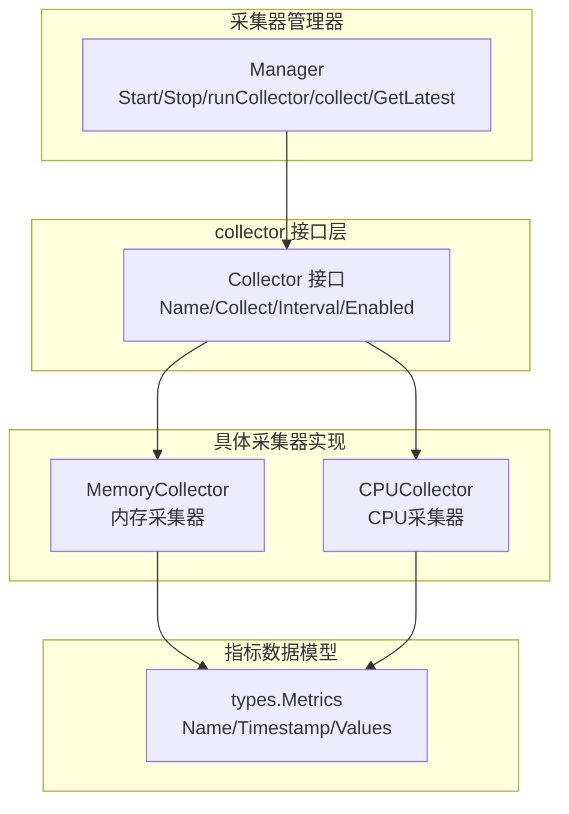
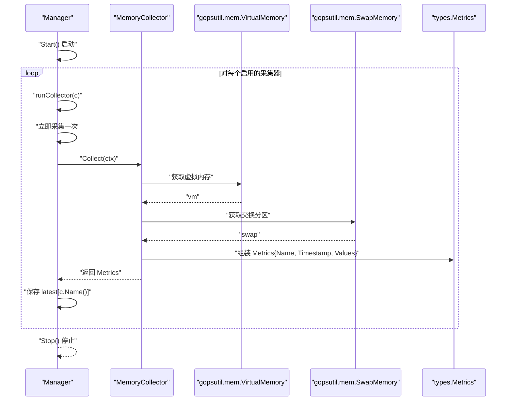

# 内存采集器

<cite>
**本文引用的文件**
- [memory.go](file://daemon/internal/collector/memory.go)
- [memory_test.go](file://daemon/internal/collector/memory_test.go)
- [manager.go](file://daemon/internal/collector/manager.go)
- [collector.go](file://daemon/internal/collector/collector.go)
- [types.go](file://daemon/pkg/types/types.go)
- [go.mod](file://daemon/go.mod)
- [manager_test.go](file://daemon/internal/collector/manager_test.go)
- [cpu.go](file://daemon/internal/collector/cpu.go)
</cite>

## 目录
1. [简介](#简介)
2. [项目结构](#项目结构)
3. [核心组件](#核心组件)
4. [架构概览](#架构概览)
5. [详细组件分析](#详细组件分析)
6. [依赖分析](#依赖分析)
7. [性能考虑](#性能考虑)
8. [故障排查指南](#故障排查指南)
9. [结论](#结论)

## 简介
本文件面向内存资源监控场景，系统化阐述内存采集器的设计与实现，重点包括：
- MemoryCollector 结构体的轻量级设计与职责边界
- Collect 方法如何基于 gopsutil 的 mem.VirtualMemory 与 mem.SwapMemory 采集关键指标
- Name 与 Interval 方法在采集器管理器中的调度机制
- 指标数据结构映射与计算逻辑
- 从定时触发到数据上报的完整时序流程
- 常见问题的诊断与排查步骤

## 项目结构
内存采集器位于 Daemon 模块的 collector 子包中，遵循“接口 + 多实现”的采集器抽象模式，并通过 Manager 实现统一调度与并发安全的数据存储。



图表来源
- [collector.go](file://daemon/internal/collector/collector.go#L1-L24)
- [memory.go](file://daemon/internal/collector/memory.go#L1-L89)
- [cpu.go](file://daemon/internal/collector/cpu.go#L1-L106)
- [manager.go](file://daemon/internal/collector/manager.go#L1-L124)
- [types.go](file://daemon/pkg/types/types.go#L1-L111)

章节来源
- [memory.go](file://daemon/internal/collector/memory.go#L1-L89)
- [manager.go](file://daemon/internal/collector/manager.go#L1-L124)
- [collector.go](file://daemon/internal/collector/collector.go#L1-L24)
- [types.go](file://daemon/pkg/types/types.go#L1-L111)

## 核心组件
- Collector 接口：定义采集器的统一能力，包括名称、采集、间隔与启用状态。
- MemoryCollector：实现 Collector，负责采集内存与交换分区指标。
- Manager：统一启动、调度与并发安全地保存最新指标。
- types.Metrics：指标数据载体，包含名称、时间戳与键值对指标集合。

章节来源
- [collector.go](file://daemon/internal/collector/collector.go#L1-L24)
- [memory.go](file://daemon/internal/collector/memory.go#L1-L89)
- [manager.go](file://daemon/internal/collector/manager.go#L1-L124)
- [types.go](file://daemon/pkg/types/types.go#L1-L111)

## 架构概览
内存采集器的运行时架构如下：Manager 以协程方式为每个启用的采集器创建定时器，周期性调用 Collect，将结果写入共享的 latest 映射，供上层查询与上报。



图表来源
- [manager.go](file://daemon/internal/collector/manager.go#L35-L104)
- [memory.go](file://daemon/internal/collector/memory.go#L43-L88)
- [types.go](file://daemon/pkg/types/types.go#L18-L23)

章节来源
- [manager.go](file://daemon/internal/collector/manager.go#L35-L104)
- [memory.go](file://daemon/internal/collector/memory.go#L43-L88)

## 详细组件分析

### MemoryCollector 结构体与生命周期
- 字段
  - enabled：控制采集器启停
  - interval：采集周期
  - logger：日志记录器
- 构造函数：NewMemoryCollector
- 方法
  - Name：固定返回 "memory"
  - Interval：返回 interval
  - Enabled：返回 enabled
  - Collect：采集并返回 types.Metrics

设计特点
- 轻量：仅持有必要状态，避免额外开销
- 可配置：通过构造参数设置启用状态与采集间隔
- 可观测：错误路径记录日志，便于定位

章节来源
- [memory.go](file://daemon/internal/collector/memory.go#L12-L41)

### Collect 方法：指标采集与映射
- 采集来源
  - mem.VirtualMemoryWithContext(ctx)：虚拟内存
  - mem.SwapMemoryWithContext(ctx)：交换分区
- 指标映射
  - 主要字段（与磁盘/网络保持一致命名）：total_bytes、used_bytes、free_bytes、available_bytes、usage_percent
  - 详细字段：cached、buffers、swap_total、swap_used、swap_free、swap_percent
  - 兼容字段：total、available、used、free
- 数据封装
  - types.Metrics：Name 固定为 "memory"，Timestamp 为采集时刻，Values 为上述键值对

计算与约束
- 使用率与交换分区使用率应在 [0, 100] 区间内
- used 与 available 不应大于 total
- total 应大于 0

章节来源
- [memory.go](file://daemon/internal/collector/memory.go#L43-L88)
- [memory_test.go](file://daemon/internal/collector/memory_test.go#L51-L125)
- [types.go](file://daemon/pkg/types/types.go#L18-L23)

### Name 与 Interval 在调度中的作用
- Name：作为 Manager.latest 的键，用于区分不同采集器的最新指标
- Interval：作为 time.Ticker 的周期，驱动 Manager.runCollector 的循环采集
- Enabled：Manager.Start 会跳过禁用的采集器

章节来源
- [memory.go](file://daemon/internal/collector/memory.go#L28-L41)
- [manager.go](file://daemon/internal/collector/manager.go#L35-L81)

### Manager 调度机制与并发安全
- Start：遍历采集器，跳过禁用项，为每个启用采集器启动协程
- runCollector：基于采集器 Interval 创建 ticker，先立即采集一次，再循环等待 ticker 或取消信号
- collect：调用采集器 Collect，记录耗时，保存最新指标至 latest，加锁保护
- GetLatest/GetLatestByName：读取 latest，使用 RWMutex 提供并发安全

章节来源
- [manager.go](file://daemon/internal/collector/manager.go#L35-L124)

### 类图：采集器与管理器关系
```mermaid
classDiagram
class Collector {
+Name() string
+Collect(ctx) *Metrics
+Interval() time.Duration
+Enabled() bool
}
class MemoryCollector {
-enabled bool
-interval time.Duration
-logger Logger
+Name() string
+Interval() time.Duration
+Enabled() bool
+Collect(ctx) *Metrics
}
class Manager {
-collectors []Collector
-latest map[string]*Metrics
-mu RWMutex
-logger Logger
-ctx Context
-cancel CancelFunc
-wg WaitGroup
+Start() void
+Stop() void
-runCollector(c Collector) void
-collect(c Collector) void
+GetLatest() map[string]*Metrics
+GetLatestByName(name string) *Metrics
}
class Metrics {
+Name string
+Timestamp time.Time
+Values map[string]interface{}
}
Collector <|.. MemoryCollector
Manager --> Collector : "管理"
MemoryCollector --> Metrics : "返回"
```

图表来源
- [collector.go](file://daemon/internal/collector/collector.go#L1-L24)
- [memory.go](file://daemon/internal/collector/memory.go#L1-L89)
- [manager.go](file://daemon/internal/collector/manager.go#L1-L124)
- [types.go](file://daemon/pkg/types/types.go#L18-L23)

## 依赖分析
- 外部库
  - gopsutil/v3/mem：提供 VirtualMemory 与 SwapMemory 的上下文感知采集
  - go.uber.org/zap：日志记录
- 内部模块
  - daemon/pkg/types：指标数据结构
  - daemon/internal/collector：采集器接口与实现、管理器

章节来源
- [go.mod](file://daemon/go.mod#L5-L15)
- [memory.go](file://daemon/internal/collector/memory.go#L1-L17)
- [types.go](file://daemon/pkg/types/types.go#L18-L23)

## 性能考虑
- 轻量采集：MemoryCollector 仅在 Collect 中进行一次系统调用，避免重复 IO
- 并发安全：Manager 使用 RWMutex 保护 latest，读多写少场景下读锁开销低
- 调度开销：Manager 为每个采集器创建独立 ticker，周期性触发，避免阻塞
- 上报路径：Manager 仅保存最新指标，不承担上报职责，减少耦合

[本节为通用性能建议，不直接分析具体文件]

## 故障排查指南

常见问题与诊断步骤
- 内存使用率超过 100%
  - 现象：used_percent 或 swap_percent > 100
  - 诊断：检查 Collect 返回值范围校验逻辑，确认 gopsutil 返回值是否异常
  - 处理：若持续出现，检查系统内存统计源与内核版本兼容性
  - 参考
    - [memory_test.go](file://daemon/internal/collector/memory_test.go#L113-L125)

- 可用内存为 0
  - 现象：available_bytes 或 available 为 0
  - 诊断：确认 total 是否大于 0；检查 cached/buffers 是否被计入可用性；核对系统内存统计口径差异
  - 处理：根据业务容忍度调整阈值策略，关注系统回收与页面释放行为
  - 参考
    - [memory.go](file://daemon/internal/collector/memory.go#L60-L79)
    - [memory_test.go](file://daemon/internal/collector/memory_test.go#L90-L112)

- 交换分区数据缺失
  - 现象：swap_total/swap_used/swap_percent 不存在或为 0
  - 诊断：确认系统存在 swap 分区；检查 mem.SwapMemoryWithContext 是否返回错误；查看 Collect 错误日志
  - 处理：若无 swap，可忽略相关指标；若存在但未采集到，检查权限与内核支持
  - 参考
    - [memory.go](file://daemon/internal/collector/memory.go#L52-L57)
    - [memory.go](file://daemon/internal/collector/memory.go#L43-L88)

- 采集器未生效
  - 现象：Manager 未产生 memory 指标
  - 诊断：确认 MemoryCollector.Enabled() 为 true；检查 Manager.Start 是否被调用；验证 ticker 是否正常触发
  - 处理：启用采集器并确保 Start 已执行；观察日志中“collector started”与“metrics collected”
  - 参考
    - [manager.go](file://daemon/internal/collector/manager.go#L35-L81)
    - [manager_test.go](file://daemon/internal/collector/manager_test.go#L101-L128)

- 并发读取一致性
  - 现象：读取最新指标时出现数据竞争或空值
  - 诊断：确认使用 GetLatest/GetLatestByName；检查是否在 Start 前后调用
  - 处理：在 Start 后再读取；确保读取期间不修改 latest
  - 参考
    - [manager.go](file://daemon/internal/collector/manager.go#L106-L124)
    - [manager_test.go](file://daemon/internal/collector/manager_test.go#L44-L84)

- 指标字段不全
  - 现象：缺少 total/available/used/used_percent 等字段
  - 诊断：检查 Collect 返回的 Values 是否包含所需键；确认 gopsutil 版本与平台支持
  - 处理：补充缺失字段或升级依赖
  - 参考
    - [memory.go](file://daemon/internal/collector/memory.go#L60-L79)
    - [memory_test.go](file://daemon/internal/collector/memory_test.go#L80-L89)

## 结论
内存采集器以最小化设计实现稳定高效的内存资源监控，通过 Collector 抽象与 Manager 统一调度，形成清晰的采集链路与并发安全的数据存储。结合 gopsutil 的上下文感知采集与严格的指标范围校验，能够满足生产环境对内存与交换分区的可观测性需求。建议在部署时合理设置采集间隔，关注系统 swap 与内存统计口径差异，并通过日志与单元测试快速定位异常。