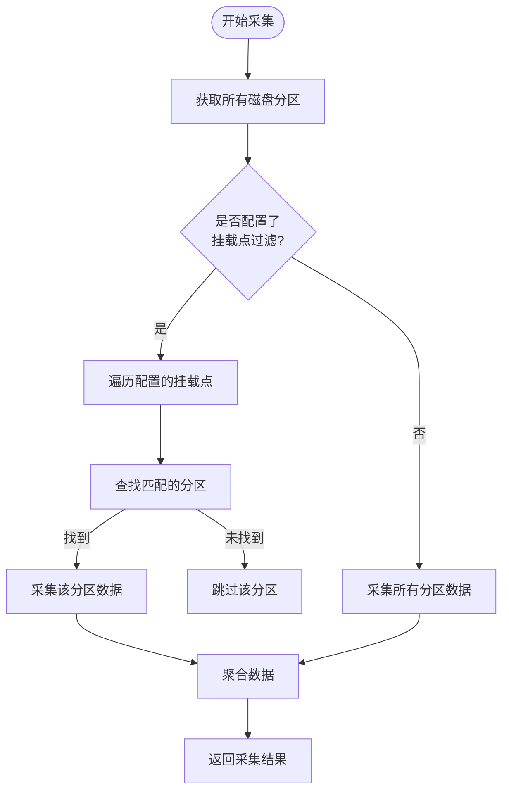
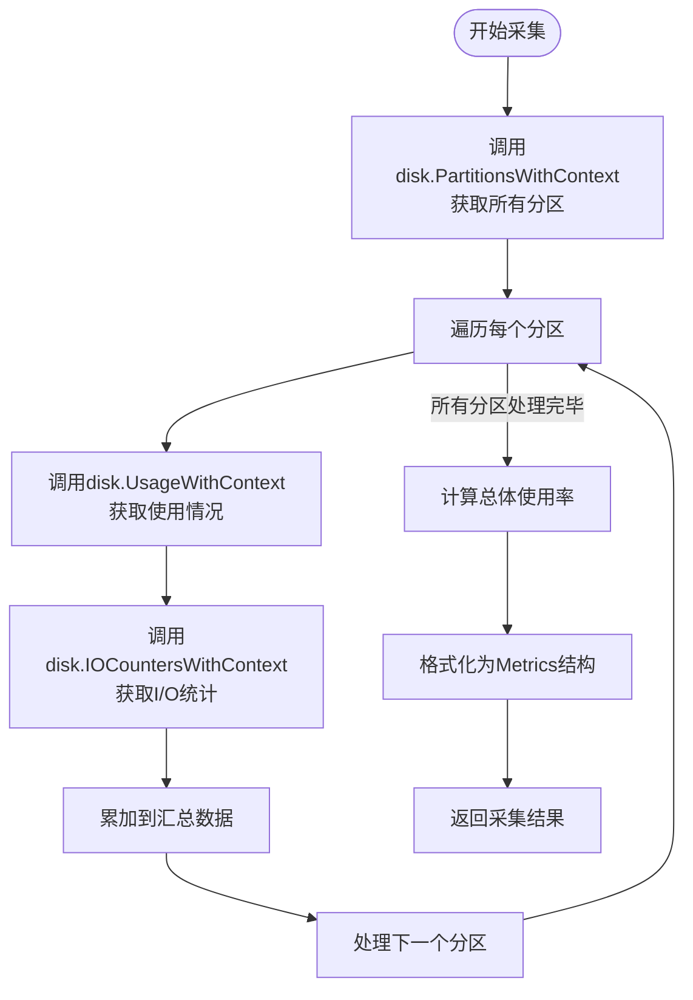
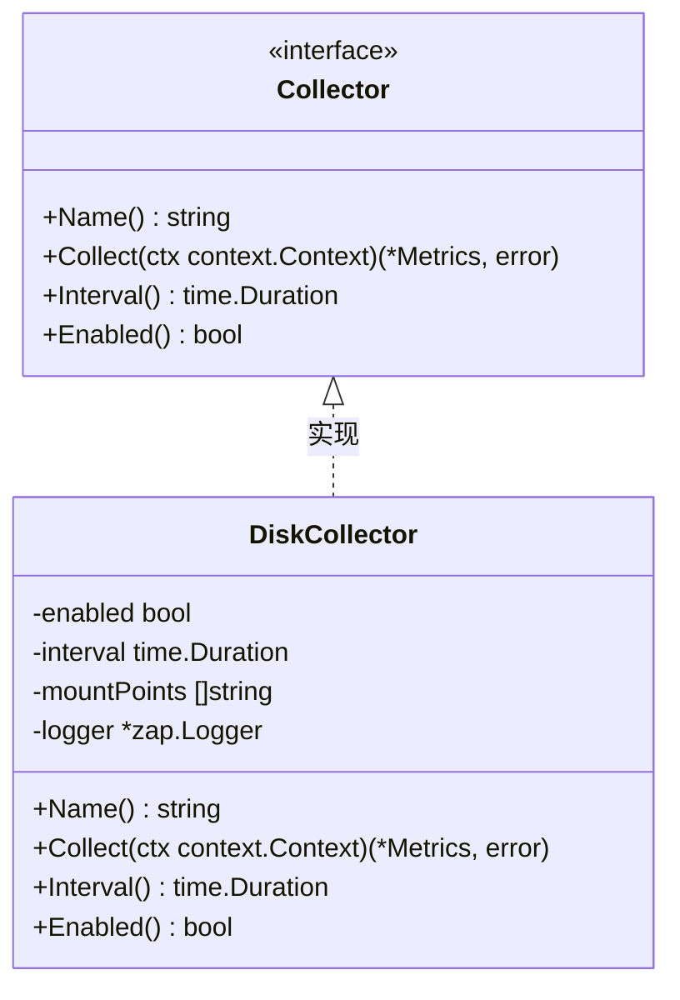
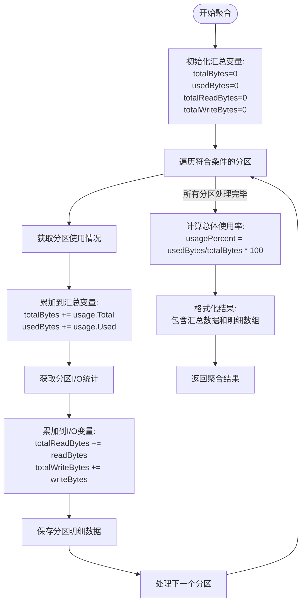
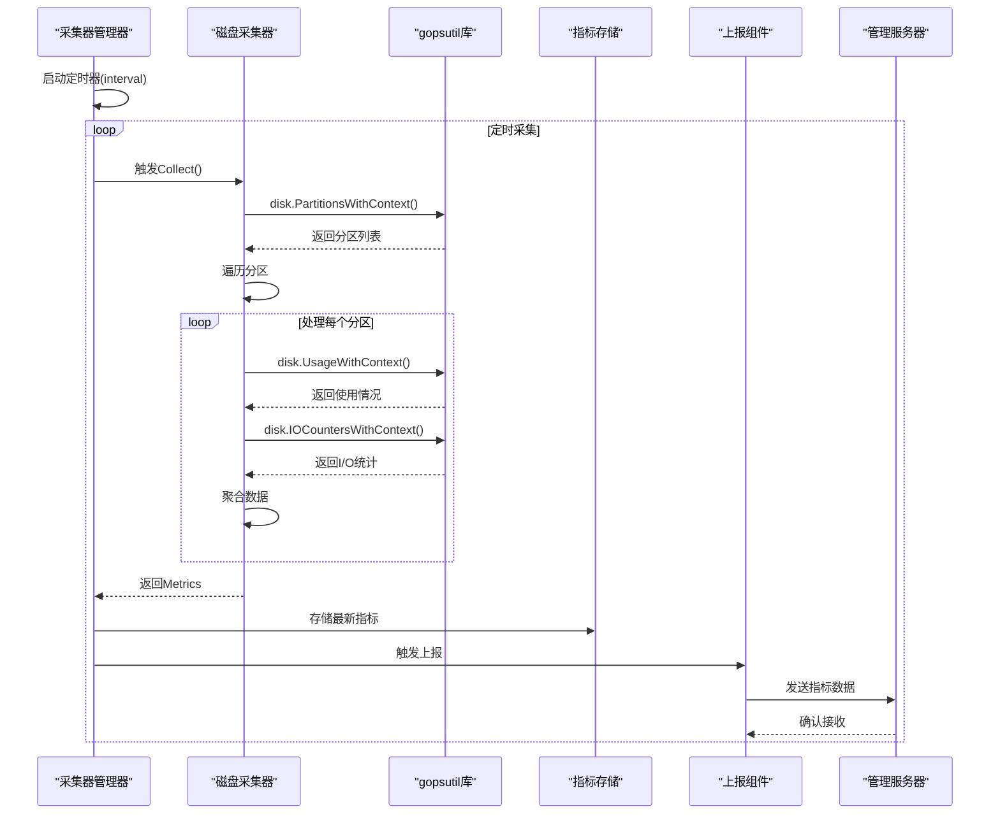

# 磁盘采集器

<cite>
**本文档引用的文件**   
- [disk.go](file://daemon/internal/collector/disk.go)
- [types.go](file://daemon/pkg/types/types.go)
- [manager.go](file://daemon/internal/collector/manager.go)
- [collector.go](file://daemon/internal/collector/collector.go)
- [config.go](file://daemon/internal/config/config.go)
- [daemon.go](file://daemon/internal/daemon/daemon.go)
- [daemon.yaml](file://daemon/configs/daemon.yaml)
</cite>

## 目录
1. [简介](#简介)
2. [核心组件](#核心组件)
3. [挂载点过滤机制](#挂载点过滤机制)
4. [数据采集流程](#数据采集流程)
5. [采集器管理接口](#采集器管理接口)
6. [多磁盘数据聚合](#多磁盘数据聚合)
7. [时序图](#时序图)
8. [故障排查指南](#故障排查指南)

## 简介
磁盘采集器是系统监控框架中的核心组件之一，负责定期采集主机磁盘资源的使用情况。该采集器基于gopsutil库实现，能够获取磁盘分区的挂载点、设备、文件系统类型、空间使用情况以及I/O性能指标。通过配置化的挂载点过滤功能，可以灵活监控特定的磁盘分区。采集到的数据经过聚合处理后，上报至管理服务器，为系统性能监控和容量规划提供数据支持。

## 核心组件

磁盘采集器的核心实现位于`DiskCollector`结构体中，该结构体实现了通用的`Collector`接口。采集器通过`Collect`方法执行具体的采集逻辑，使用`Name`和`Interval`方法向采集器管理器注册自身信息。采集器的配置通过`mountPoints`字段实现挂载点过滤功能，支持只监控指定的磁盘分区。

**Section sources**
- [disk.go](file://daemon/internal/collector/disk.go#L12-L39)

## 挂载点过滤机制

磁盘采集器通过`mountPoints`字段实现挂载点过滤功能。当配置中指定了需要监控的挂载点列表时，采集器只会采集这些特定挂载点的磁盘信息。如果`mountPoints`为空，则采集所有可用的磁盘分区。这种设计提供了灵活的监控策略，允许运维人员根据实际需求监控关键的磁盘分区，避免采集不必要的数据。

**Diagram sources**
- [disk.go](file://daemon/internal/collector/disk.go#L63-L76)

## 数据采集流程

磁盘采集器使用gopsutil库的三个核心函数来采集磁盘信息：

1. `disk.PartitionsWithContext`：获取系统中所有磁盘分区的信息，包括挂载点、设备名称和文件系统类型。
2. `disk.UsageWithContext`：获取指定挂载点的磁盘使用情况，包括总空间、已用空间、可用空间和使用率。
3. `disk.IOCountersWithContext`：获取磁盘设备的I/O统计信息，包括读写字节数。

采集流程首先获取所有分区，然后对每个分区采集使用情况和I/O统计，最后将数据聚合为统一的指标格式。

**Diagram sources**
- [disk.go](file://daemon/internal/collector/disk.go#L48-L153)

## 采集器管理接口

磁盘采集器实现了`Collector`接口的三个关键方法，这些方法在采集器管理器中发挥重要作用：

- `Name()`方法返回采集器的唯一标识符"disk"，用于在管理器中识别和索引该采集器。
- `Interval()`方法返回配置的采集间隔，管理器根据此值创建相应的定时器。
- `Enabled()`方法返回采集器的启用状态，管理器根据此状态决定是否启动该采集器。

这些接口方法使得采集器管理器能够统一管理不同类型的采集器，实现插件化的监控架构。

**Diagram sources**
- [collector.go](file://daemon/internal/collector/collector.go#L10-L23)
- [disk.go](file://daemon/internal/collector/disk.go#L12-L43)

## 多磁盘数据聚合

磁盘采集器对多个磁盘分区的数据进行聚合处理，生成汇总指标。采集器遍历所有符合条件的分区，累加总空间、已用空间和I/O字节数，同时保留每个分区的详细信息。最终返回的数据包含两部分：扁平化的汇总数据（用于前端快速展示）和明细数据数组（供未来扩展使用）。

**Diagram sources**
- [disk.go](file://daemon/internal/collector/disk.go#L55-L144)

## 时序图

磁盘采集器的完整工作流程从定时触发开始，到数据上报结束。采集器管理器根据配置的间隔定时触发采集，磁盘采集器执行采集逻辑后将数据存储在内存中，最后由上报循环将数据发送到管理服务器。

**Diagram sources**
- [manager.go](file://daemon/internal/collector/manager.go#L64-L80)
- [disk.go](file://daemon/internal/collector/disk.go#L46-L153)
- [daemon.go](file://daemon/internal/daemon/daemon.go#L550-L572)

## 故障排查指南

### 特定挂载点无法识别
当配置的挂载点无法识别时，可能的原因和解决方法：
1. 检查挂载点路径是否正确，确保与`df`命令显示的路径完全一致
2. 确认挂载点当前是否处于挂载状态
3. 检查文件系统类型是否被操作系统支持
4. 查看采集器日志中的错误信息

**Section sources**
- [disk.go](file://daemon/internal/collector/disk.go#L48-L52)

### 磁盘使用率显示100%但实际有空间
此问题通常由以下原因引起：
1. 文件系统保留空间：某些文件系统为root用户保留了一定比例的空间
2. 已删除但未释放的文件：进程仍持有已删除文件的句柄
3. 磁盘配额限制：用户或组的磁盘配额已满
4. 采集器计算错误：检查代码中的除零保护逻辑

**Section sources**
- [disk.go](file://daemon/internal/collector/disk.go#L123-L127)

### I/O计数器为0
I/O计数器为0的可能原因：
1. 磁盘在采集间隔内没有发生读写操作
2. 权限不足，无法读取I/O统计信息
3. 特定平台或文件系统不支持I/O计数器
4. 设备名称不匹配，导致无法获取正确的I/O统计

**Section sources**
- [disk.go](file://daemon/internal/collector/disk.go#L93-L106)