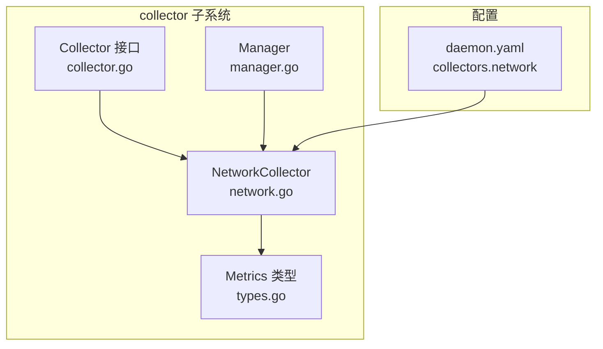
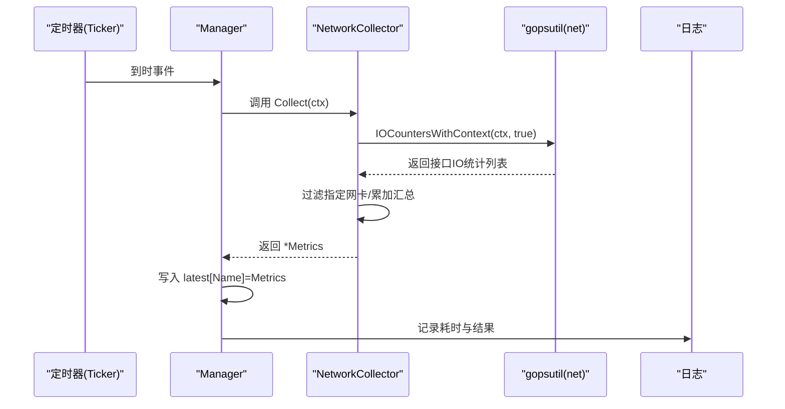
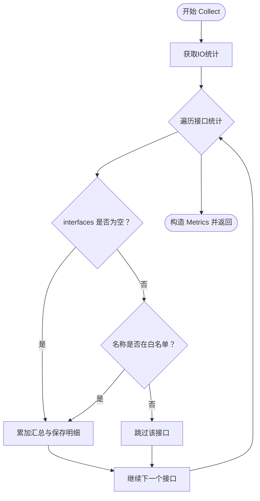
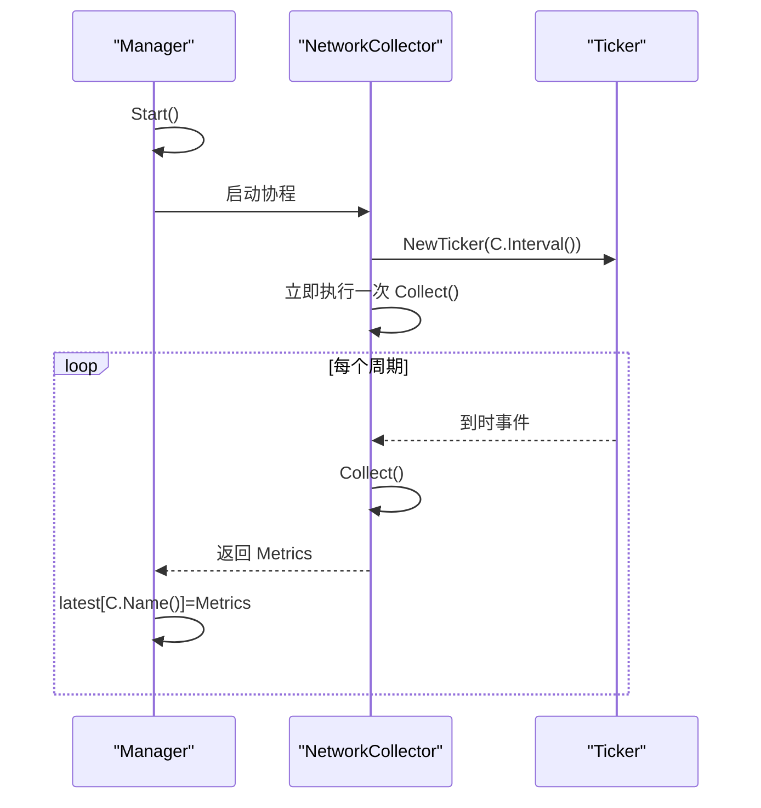
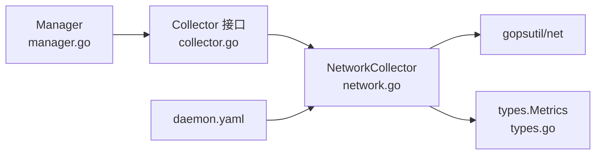

# 网络采集器

<cite>
**本文引用的文件列表**
- [network.go](file://daemon/internal/collector/network.go)
- [network_test.go](file://daemon/internal/collector/network_test.go)
- [manager.go](file://daemon/internal/collector/manager.go)
- [collector.go](file://daemon/internal/collector/collector.go)
- [types.go](file://daemon/pkg/types/types.go)
- [daemon.yaml](file://daemon/configs/daemon.yaml)
- [disk.go](file://daemon/internal/collector/disk.go)
</cite>

## 目录
1. [简介](#简介)
2. [项目结构](#项目结构)
3. [核心组件](#核心组件)
4. [架构总览](#架构总览)
5. [详细组件分析](#详细组件分析)
6. [依赖关系分析](#依赖关系分析)
7. [性能考量](#性能考量)
8. [故障排查指南](#故障排查指南)
9. [结论](#结论)
10. [附录](#附录)

## 简介
本文件面向网络采集器的实现与使用，聚焦于NetworkCollector结构体的网卡过滤能力与指标聚合逻辑，并解释其如何通过gopsutil库采集网络接口的发送/接收字节数、数据包数、错误数与丢包数等关键指标。同时，文档阐述Name与Interval方法在采集器管理器中的调度机制，给出网络流量速率计算的思路与序列图，最后提供常见问题的诊断步骤。

## 项目结构
网络采集器位于Daemon模块的collector子系统中，采用统一的Collector接口抽象与Manager调度器进行周期性采集与结果缓存。

图表来源
- [network.go](file://daemon/internal/collector/network.go#L1-L136)
- [manager.go](file://daemon/internal/collector/manager.go#L1-L124)
- [collector.go](file://daemon/internal/collector/collector.go#L1-L24)
- [types.go](file://daemon/pkg/types/types.go#L1-L24)
- [daemon.yaml](file://daemon/configs/daemon.yaml#L40-L55)

章节来源
- [network.go](file://daemon/internal/collector/network.go#L1-L136)
- [manager.go](file://daemon/internal/collector/manager.go#L1-L124)
- [collector.go](file://daemon/internal/collector/collector.go#L1-L24)
- [types.go](file://daemon/pkg/types/types.go#L1-L24)
- [daemon.yaml](file://daemon/configs/daemon.yaml#L40-L55)

## 核心组件
- NetworkCollector：负责采集网络IO统计，支持按网卡白名单过滤，聚合发送/接收字节、数据包、错误与丢包等指标。
- Manager：统一启动与调度各采集器，基于采集器的Interval进行周期性触发，并将最新指标写入内存缓存。
- Collector接口：定义采集器的统一行为（Name、Collect、Interval、Enabled）。
- Metrics类型：承载采集结果的通用结构，包含指标名称、时间戳与键值对数据。

章节来源
- [network.go](file://daemon/internal/collector/network.go#L1-L136)
- [manager.go](file://daemon/internal/collector/manager.go#L1-L124)
- [collector.go](file://daemon/internal/collector/collector.go#L1-L24)
- [types.go](file://daemon/pkg/types/types.go#L1-L24)

## 架构总览
下图展示了从定时触发到数据上报的完整流程：Manager根据采集器Interval创建ticker，触发NetworkCollector.Collect，后者调用gopsutil获取IO统计并聚合，最终由Manager保存至latest映射，供上层读取。

图表来源
- [manager.go](file://daemon/internal/collector/manager.go#L63-L104)
- [network.go](file://daemon/internal/collector/network.go#L45-L136)

## 详细组件分析

### NetworkCollector 结构体与字段
- 字段说明
  - enabled：采集器开关
  - interval：采集周期
  - interfaces：网卡白名单，空表示采集全部网卡
  - logger：日志记录器
- 关键方法
  - Name：返回“network”
  - Interval：返回采集周期
  - Enabled：返回启用状态
  - Collect：采集并聚合指标

章节来源
- [network.go](file://daemon/internal/collector/network.go#L12-L44)

### 网卡过滤逻辑
NetworkCollector通过interfaces字段实现网卡过滤：
- 若interfaces非空，则仅处理名称匹配的网卡
- 使用线性扫描匹配，命中后累加对应接口的字节、包数、错误与丢包计数
- 将每张网卡的原始统计作为明细项保留，便于后续扩展

图表来源
- [network.go](file://daemon/internal/collector/network.go#L45-L136)

章节来源
- [network.go](file://daemon/internal/collector/network.go#L45-L136)

### gopsutil IOCounters 的使用与指标含义
- 调用方式：net.IOCountersWithContext(ctx, true)
- 返回的接口统计包含每张网卡的BytesSent、BytesRecv、PacketsSent、PacketsRecv、Errin、Errout、Dropin、Dropout等字段
- NetworkCollector将这些字段累加为全局汇总，并保留明细数组以便扩展

章节来源
- [network.go](file://daemon/internal/collector/network.go#L45-L136)

### 指标聚合与输出格式
- 汇总指标（扁平化，供前端快速展示）
  - tx_bytes、rx_bytes、bytes_sent、bytes_recv、packets_sent、packets_recv、error_in、error_out、drop_in、drop_out、interface_count
- 明细指标（数组，供未来扩展使用）
  - details：每张网卡的原始统计键值对
- 时间戳：当前采集时刻
- 名称：固定为“network”

章节来源
- [network.go](file://daemon/internal/collector/network.go#L107-L136)
- [types.go](file://daemon/pkg/types/types.go#L18-L24)

### Name 与 Interval 方法在调度中的作用
- Name：用于Manager在latest映射中保存与检索指标的键名
- Interval：用于Manager创建ticker，控制采集频率
- Enabled：决定是否启动该采集器的协程

章节来源
- [network.go](file://daemon/internal/collector/network.go#L30-L44)
- [manager.go](file://daemon/internal/collector/manager.go#L35-L81)

### 采集器管理器调度机制
- Manager.Start：遍历已注册采集器，对启用的采集器启动独立协程
- 协程内部使用time.NewTicker，立即执行一次采集，随后按Interval循环触发
- 每次采集完成后，将最新Metrics写入latest映射，供外部读取

图表来源
- [manager.go](file://daemon/internal/collector/manager.go#L35-L104)

章节来源
- [manager.go](file://daemon/internal/collector/manager.go#L35-L104)

### 网络流量速率计算思路
- 当前实现直接返回累计字节与包数等总量指标
- 若需计算速率（如 bytes/sec），可在上层或业务侧基于两次采集的时间差与差分值计算
- 与磁盘采集器对比可见，磁盘采集器同样返回总量而非速率，速率计算通常由消费方完成

章节来源
- [network.go](file://daemon/internal/collector/network.go#L107-L136)
- [disk.go](file://daemon/internal/collector/disk.go#L123-L151)

## 依赖关系分析
- NetworkCollector依赖gopsutil/net进行系统级网络IO统计采集
- NetworkCollector依赖types.Metrics作为统一输出结构
- Manager依赖Collector接口抽象，实现对多种采集器的统一调度
- 配置文件daemon.yaml定义了network采集器的启用状态、采集周期与网卡白名单

图表来源
- [network.go](file://daemon/internal/collector/network.go#L1-L136)
- [manager.go](file://daemon/internal/collector/manager.go#L1-L124)
- [collector.go](file://daemon/internal/collector/collector.go#L1-L24)
- [types.go](file://daemon/pkg/types/types.go#L1-L24)
- [daemon.yaml](file://daemon/configs/daemon.yaml#L40-L55)

章节来源
- [network.go](file://daemon/internal/collector/network.go#L1-L136)
- [manager.go](file://daemon/internal/collector/manager.go#L1-L124)
- [collector.go](file://daemon/internal/collector/collector.go#L1-L24)
- [types.go](file://daemon/pkg/types/types.go#L1-L24)
- [daemon.yaml](file://daemon/configs/daemon.yaml#L40-L55)

## 性能考量
- 采集频率：由Interval控制，过短会增加系统开销；过长会降低实时性
- 过滤策略：interfaces为空时需遍历全部网卡，建议在生产环境设置白名单以减少遍历成本
- 日志级别：Debug级别会打印汇总字节与接口数量，频繁采集时注意日志量
- 上层消费：若需要速率指标，建议在消费侧进行差分计算，避免在采集侧重复计算

## 故障排查指南
- 症状：网卡名称无法识别
  - 可能原因：interfaces中填写的网卡名不在系统中存在
  - 处理步骤：
    - 在目标主机确认真实网卡名称
    - 检查daemon.yaml中的network.interfaces配置
    - 临时将interfaces设为空，验证是否能采集到默认网卡
  - 参考路径
    - [daemon.yaml](file://daemon/configs/daemon.yaml#L50-L55)
    - [network.go](file://daemon/internal/collector/network.go#L68-L80)

- 症状：流量数据不更新
  - 可能原因：采集器未启用、Interval过大、gopsutil调用失败
  - 处理步骤：
    - 检查daemon.yaml中network.enabled与interval
    - 查看Manager日志，确认是否持续触发Collect
    - 观察Collect返回的Metrics时间戳是否递增
  - 参考路径
    - [daemon.yaml](file://daemon/configs/daemon.yaml#L50-L55)
    - [manager.go](file://daemon/internal/collector/manager.go#L35-L104)
    - [network_test.go](file://daemon/internal/collector/network_test.go#L100-L133)

- 症状：错误计数器持续增长
  - 可能原因：链路抖动、硬件问题、驱动异常
  - 处理步骤：
    - 对比前后两次采集的error_in/error_out差值，判断是否持续上升
    - 检查对应网卡的物理状态与驱动日志
    - 缩短采集周期，更早发现异常趋势
  - 参考路径
    - [network.go](file://daemon/internal/collector/network.go#L82-L105)

- 症状：采集失败或返回nil
  - 可能原因：gopsutil调用失败、上下文取消
  - 处理步骤：
    - 查看Collect日志中的错误信息
    - 确认上下文未提前取消
    - 重试采集或检查系统权限
  - 参考路径
    - [network.go](file://daemon/internal/collector/network.go#L45-L52)

## 结论
NetworkCollector通过gopsutil提供系统级网络IO统计采集，借助interfaces白名单实现灵活的网卡过滤，聚合发送/接收字节、数据包、错误与丢包等关键指标。Manager基于Collector接口抽象与Interval调度，统一管理采集生命周期并将最新指标缓存。若需速率指标，建议在消费侧基于差分计算实现。针对常见问题，可通过核对网卡名、调整采集周期与检查日志进行定位与修复。

## 附录
- 配置参考
  - network采集器启用、间隔与网卡白名单
  - 参考路径
    - [daemon.yaml](file://daemon/configs/daemon.yaml#L50-L55)

- 测试参考
  - 验证Name、Interval、Enabled与多次采集的时间戳递增
  - 参考路径
    - [network_test.go](file://daemon/internal/collector/network_test.go#L12-L133)